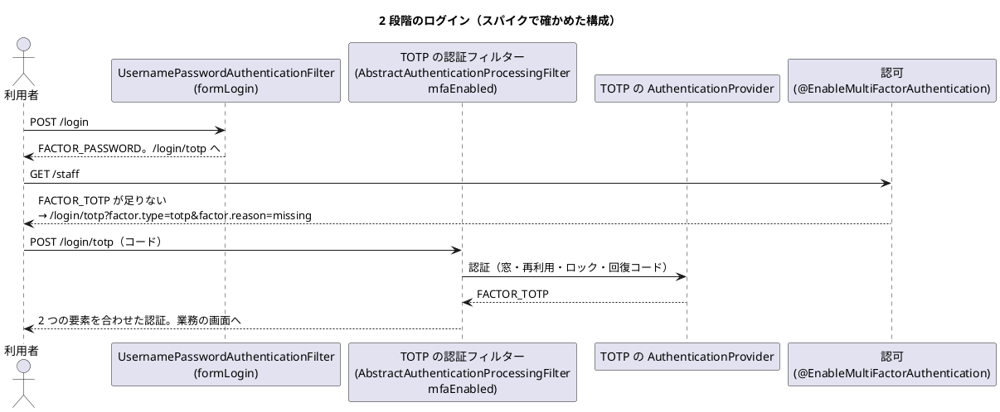

# ADR-011: 多要素認証は Spring Security 7 の要素の権限で組み、TOTP は java-otp で作る

password の後に TOTP を求める 2 段階のログインを、Spring Security 7 の多要素認証（要素ごとの権限）で組む。TOTP の生成は `com.eatthepath:java-otp` に任せ、時間の窓・再利用の拒否・失敗の数え方・回復コードはアプリケーションで持つ。

日付: 2026-10-06

## ステータス

提案（Bolt 13 のスパイク TS-01 の結論。W5 の US-18 の計画の承認で採否を決める。Bolt 13 の確認ポイント 4）

## コンテキスト

- US-18 は、メールアドレス・password・TOTP で本人確認し、無操作 30 分・最長 8 時間の session を発行する（AC1）。password か TOTP の失敗が 5 回続いたら 15 分ロックする（AC3）。初回は TOTP を登録し、一度だけ使える回復コードを発行する（AC7・AC9）。
- 非機能要件は、password を Argon2id か bcrypt で保存し（SEC-07）、回復コードを 10 個発行する（SEC-09）。
- 技術スタックは、TOTP のライブラリを候補（`dev.samstevens.totp`）として挙げただけで、評価していなかった（TS-01）。リスク台帳には「TOTP と Spring Security 7 の統合が想定より難しい（中・中）」がある。
- アクセス・監査は「単純なモデル」で、認証の仕組みは実績のある部品に任せる（[アーキテクチャ](../../design/cargo-tracker/architecture_backend.md)）。認証の成功・失敗・ロックは、Spring Security のイベントから同期で監査記録に書く（IA-INV-08）。
- 開発環境では、ログインの画面（A-01）と認証コードの画面（A-02）を入力済みにする（2026-10-06 の人の決定。Bolt 13 の確認ポイント 7）。
- Bolt 13 で、本体と分けたスパイク（[`spikes/ts-01-totp/`](https://github.com/k2works/practical-domain-driven-design-in-enterpris-application/tree/develop/spikes/ts-01-totp)）を Spring Boot 4.1.1（Spring Security 7.1.1）で作り、学習テスト 29 件で確かめた。

## 決定（案）

### 1. TOTP の生成

**`com.eatthepath:java-otp` で TOTP を作る（HMAC-SHA1、6 桁、30 秒）。前後 1 つの時間の窓の照合、再利用の拒否、一定時間の比較はアプリケーションで持つ。**

| 候補 | RFC 6238 の試験ベクトル | 保守（最後の公開） | ライセンス | 推移的な依存 | 判断 |
| :--- | :--- | :--- | :--- | :--- | :--- |
| (a) JDK の HMAC だけの実装 | 6 件とも一致 | 自分で持つ | — | なし | 代わりの案。約 50 行で書けるが、暗号の手順を自分で保守する |
| (b) `java-otp` 1.0.0 | 試した 3 件とも一致 | 2026-08 | MIT | なし | **採る案**。小さく、依存がなく、保守されている |
| (c) `dev.samstevens.totp` 1.7.1 | 試した 3 件とも一致 | 2020-11 | POM に記載なし | `commons-codec`、ZXing（core・javase） | 採らない。6 年近く更新がなく、QR の画像の部品まで入る |
| `googleauth` 1.5.0 | 試していない | 2020-04 | — | — | 採らない（(c) と同じ理由。計画の確認ポイント 3） |

- (b) は時間の窓での照合の API を持たないため、照合は「前後 1 つの刻みのコードを作り、一定時間で比べる」をアプリケーションで書く（スパイクの (a) の `verify` と同じ形）。
- 秘密は 160 ビット（20 バイト）の乱数で作り、Base32 で `otpauth://` の URI と、手で入力する文字列に使う。登録の QR は、US-18 の Bolt で ZXing（Apache-2.0）を使うかクライアントで描くかを決める（未確認）。

### 2. 2 段階のログイン（Spring Security 7）

**password（`FACTOR_PASSWORD`）と TOTP（独自の要素 `FACTOR_TOTP`）の両方を、認証が要るすべての画面に求める。**

| 項目 | 方針 | スパイクで分かったこと |
| :--- | :--- | :--- |
| 要素の要求 | `@EnableMultiFactorAuthentication(authorities = {FACTOR_PASSWORD, FACTOR_TOTP})` | 独自の要素の名前（`FACTOR_TOTP`）をそのまま使える |
| 足りない要素の画面へ導く | `DelegatingMissingAuthorityAccessDeniedHandler` で、`FACTOR_TOTP` が足りなければ A-02、`FACTOR_PASSWORD` が足りなければ A-01 | 枠組みが `factor.type`・`factor.reason` を付けて導く。A-02 で理由を示すのに使える |
| TOTP の認証 | `AbstractAuthenticationProcessingFilter` を継ぐフィルター（`POST /login/totp`）と `AuthenticationProvider`。password の要素がそろった session でだけ受け付ける | フィルターの `mfaEnabled` を有効にしても、**結果のトークンの型が `toBuilder()` を自分で宣言していないと、password の要素が合わさらず置き換わる**。独自のトークンにビルダーを持たせる |
| session の保存 | TOTP のフィルターに `HttpSessionSecurityContextRepository` を設定する | 既定のままでは request の中だけに残る |
| 失敗の数え方 | password と TOTP の誤りを、`AuthenticationFailureBadCredentialsEvent` の 1 か所で数える。5 回続いたら 15 分ロック（`UserDetails` の `accountLocked` と、TOTP の provider の確認） | 監査記録（IA-INV-08）を書く箇所と同じにできる。ロック中の拒否は数えない |
| 再利用の拒否 | 利用者ごとに最後に使った時間の刻みの番号を持ち、それ以下の刻みを拒否する | TOTP のライブラリの外の記録が要る（H3） |
| 回復コード | TOTP の欄で受け付け、一度使ったら消す | 本体ではハッシュで保存する |
| 無操作 30 分 | `server.servlet.session.timeout=30m` | 設定で守れる |
| 最長 8 時間 | 本人確認の時刻を session に残し、request ごとに比べるフィルター | Spring Security に既製の部品はない。時刻はアプリケーションの `Clock` で比べる |
| password の保存 | `PasswordEncoderFactories` の既定（bcrypt） | Argon2id は Bouncy Castle を足さないと使えない。SEC-07 は bcrypt で満たす |

### 3. 開発環境の入力済み

- `dev` プロファイルの設定（`cargotracker.dev-login.username`・`password`・`prefill-totp`）があるときだけ、A-01 にメールアドレスと password、A-02 にその時点のコードを入れる。既定の設定（ステージング・本番を含む）では入力済みにしない。学習テストで両方を確かめた。
- 開発用の利用者は固定の TOTP の秘密を持つ。本番の利用者の秘密は利用者ごとに作る。

### 代替案

| 案 | 却下理由 |
| :--- | :--- |
| 独自のフィルターの連鎖で段階を管理する（Spring Security 6 までのやり方） | Spring Security 7 の要素の権限で、足りない要素への誘導と認可の判定を枠組みに任せられる |
| password と TOTP を 1 つの画面で同時に送る | 誤った password でも TOTP を試せ、どちらが誤りかの扱いが複雑になる。US-18 の画面（A-01・A-02）と合わない |
| 開発環境では TOTP を飛ばす | 開発と本番で認証の流れが変わり、2 段階のログインを開発環境で確かめられない（確認ポイント 7） |
| Argon2id にする | Bouncy Castle が要る。bcrypt で SEC-07 を満たすため、足す理由がまだない |

## 影響

### ポジティブ

- 認証の流れと認可の判定を枠組みに任せ、アプリケーションが持つのは TOTP の照合・再利用・失敗の数え方・回復コードだけになる。
- 失敗の数え方と監査記録を、Spring Security のイベントの 1 か所にまとめられる。
- 新しい依存は `java-otp` 1 つで、推移的な依存がない。

### ネガティブ

- Spring Security 7 の多要素認証は新しい仕組みで、「結果の型が `toBuilder()` を宣言していないと要素が合わさらない」のような資料の少ない振る舞いがある。US-18 で統合テストを厚くする。
- 要素の権限の発行時刻（`FactorGrantedAuthority` の `issuedAt`）はシステムの時計で決まり、アプリケーションの `Clock` で動かせない。時刻に頼る判定（最長 8 時間）は、session に残す自分の時刻で行う。
- 再利用の拒否・失敗の回数・ロック・回復コードの記録が、複数のアプリケーションの実行環境で共有される必要がある（本体では表）。

### US-18 の Bolt で要るもの

| 種類 | 内容 |
| :--- | :--- |
| 表（`identity`） | 利用者（メールアドレス、password のハッシュ、状態、所属企業）、TOTP の資格（暗号化した秘密、最後に使った時間の刻み）、回復コード（ハッシュ、使った時刻）、ログインの失敗（連続の回数、ロックの期限） |
| 画面 | A-01（ログイン）、A-02（認証コード。`factor.reason` に応じた案内、回復コードの入力、ロック中の案内と解ける時刻）、TOTP の登録（QR か手入力の秘密、回復コードの表示） |
| 置き換え | 仮の主体（`ProvisionalActorProperties`）を、認証の主体から利用者と荷主企業を引く形に置き換える。荷主の画面（`/customer`）と社内の画面（`/staff`）の役割を分ける（US-16） |
| 開発環境 | 開発用の利用者（荷主担当者・営業担当者）と固定の TOTP の秘密を `dev` プロファイルで投入し、A-01・A-02 を入力済みにする |

### 未確認の項目

- 登録の QR の描き方（ZXing をサーバーで使うか、クライアントで描くか）と、TOTP の秘密の暗号化の鍵の管理。
- 実際のサーブレットコンテナでの session の固定化の対策と、同じ利用者の同時のログイン。学習テストは MockMvc だけ。
- password の再設定（SEC-08）と、TOTP の再登録（SEC-10）の流れ。
- 利用者の画面で「次に取れる操作」（T-35）: A-02 で誤ったときは再入力か回復コード、ロック中は解ける時刻を示して待つ、端末を失ったときは回復コードか管理者への連絡。US-18 の計画の確認ポイントにする。

## コンプライアンス

- US-18 の Bolt で、本体の統合テストに、2 つの要素がそろわないと業務の画面を開けないこと、再利用の拒否、5 回の失敗のロック、最長 8 時間を加える。
- 既定の設定で A-01・A-02 が入力済みにならないことを、本体のテストで守る。

## 参考資料

- [Bolt 13 計画](../../development/cargo-tracker/bolt_13_plan.md)、[Bolt 13 終了報告](../../development/cargo-tracker/bolt_13_report.md)
- スパイク: `spikes/ts-01-totp/`（`TotpCandidatesTest`、`MfaLoginTest`、`DevLoginPrefillTest`、`PasswordStorageTest`、`SessionTimeoutTest`）
- RFC 6238（TOTP）、RFC 4226（HOTP）
- [ユーザーストーリー](../../requirements/cargo-tracker/user_story.md)（US-18）、[非機能要件](../../design/cargo-tracker/non_functional.md)（SEC-04〜10）、[技術スタック](../../design/cargo-tracker/tech_stack.md)（TS-01）
