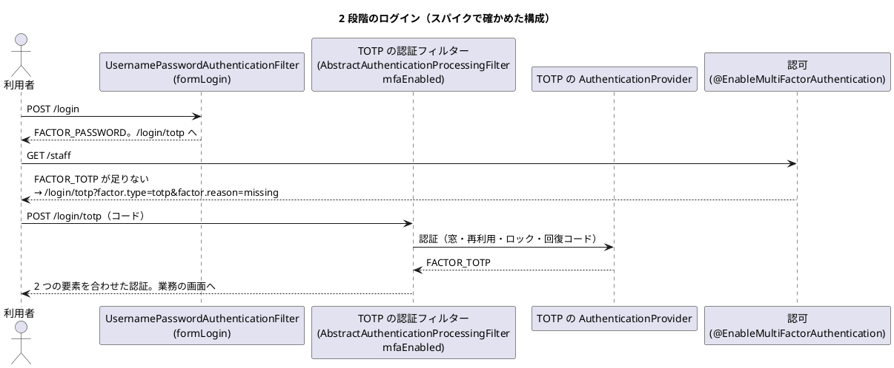

# ADR-011: 多要素認証は Spring Security 7 の要素の権限で組み、TOTP は java-otp で作る

password の後に TOTP を求める 2 段階のログインを、Spring Security 7 の多要素認証（要素ごとの権限）で組む。TOTP の生成は `com.eatthepath:java-otp` に任せ、時間の窓・再利用の拒否・失敗の数え方・回復コードはアプリケーションで持つ。

日付: 2026-10-06

## ステータス

提案（Bolt 13 のスパイク TS-01 の結論。W5 の US-18 の計画の承認で採否を決める。Bolt 13 の確認ポイント 4）

## コンテキスト

- US-18 は、メールアドレス・password・TOTP で本人確認し、無操作 30 分・最長 8 時間の session を発行する（AC1）。password か TOTP の失敗が 5 回続いたら 15 分ロックする（AC3）。初回は TOTP を登録し、一度だけ使える回復コードを発行する（AC7・AC9）。
- 非機能要件は、password を Argon2id か bcrypt で保存し（SEC-07）、回復コードを 10 個発行する（SEC-09）。
- 技術スタックは、TOTP のライブラリを候補（`dev.samstevens.totp`）として挙げただけで、評価していなかった（TS-01）。リスク台帳には「TOTP と Spring Security 7 の統合が想定より難しい（中・中）」がある。
- アクセス・監査は「単純なモデル」で、認証の仕組みは実績のある部品に任せる（[アーキテクチャ](../../design/cargo-tracker/architecture_backend.md)）。認証の成功・失敗・ロックは、Spring Security のイベントから同期で監査記録に書く（IA-INV-08）。
- 開発環境では、ログインの画面（A-01）と認証コードの画面（A-02）を入力済みにする（2026-10-06 の人の決定。Bolt 13 の確認ポイント 7）。
- Bolt 13 で、本体と分けたスパイク（[`spikes/ts-01-totp/`](https://github.com/k2works/practical-domain-driven-design-in-enterpris-application/tree/develop/spikes/ts-01-totp)）を Spring Boot 4.1.1（Spring Security 7.1.1）で作り、学習テストで確かめた（初めは 29 件。[Bolt 13 のレビュー](../../review/cargo-tracker/bolt_13_review_20261006.md)の指摘で直し、57 件）。

## 決定（案）

### 1. TOTP の生成

**`com.eatthepath:java-otp` で TOTP を作る（HMAC-SHA1、6 桁、30 秒）。前後 1 つの時間の窓の照合、再利用の拒否、一定時間の比較はアプリケーションで持つ。**

| 候補 | RFC 6238 の試験ベクトル | 保守（最後の公開） | ライセンス | 推移的な依存 | 判断 |
| :--- | :--- | :--- | :--- | :--- | :--- |
| (a) JDK の HMAC だけの実装 | 6 件とも一致 | 自分で持つ | — | なし | 代わりの案。HMAC は JDK にあり、自分で持つのは切り詰めの約 10 行で、試験ベクトルで固定できる。差は小さい |
| (b) `java-otp` 1.0.0 | 8 桁で試した 3 件と、6 桁で 6 件とも一致 | 2026-08 | MIT | なし | **採る案**。小さく、依存がなく、保守されている。スパイクの 2 段階のログインはこの生成の上で通る |
| (c) `dev.samstevens.totp` 1.7.1 | 試した 3 件とも一致 | 2020-11 | POM に記載なし | `commons-codec`、ZXing（core・javase） | 採らない。6 年近く更新がなく、QR の画像の部品まで入る |
| `googleauth` 1.5.0 | 試していない | 2020-04 | — | — | 採らない（(c) と同じ理由。計画の確認ポイント 3） |

- (b) が担うのは HOTP の計算と切り詰めだけで、時間の窓での照合の API を持たない。照合は「前後 1 つの刻みのコードを作り、一定時間で比べる」をアプリケーションで書く（スパイクの `SpikeUsers`）。再利用の拒否・秘密の生成・Base32・`otpauth://` の URI もアプリケーションが持つ。
- (a) と (b) の差は小さく、生成をポートの裏に置けば後で替えられる判断である（下の「US-18 の Bolt で要るもの」）。
- 秘密は 160 ビット（20 バイト）の乱数で作り、Base32 で `otpauth://` の URI と、手で入力する文字列に使う案とする。Base32 は JDK にも (b) にもない見込みで、出どころ（自分で書くか `commons-codec` を足すか）と URI の組み立ては、スパイクで確かめていない（未確認）。登録の QR は、US-18 の Bolt で ZXing（Apache-2.0）を使うかクライアントで描くかを決める（未確認）。

### 2. 2 段階のログイン（Spring Security 7）

**password（`FACTOR_PASSWORD`）と TOTP（独自の要素 `FACTOR_TOTP`）の両方を、認証が要るすべての画面に求める。**

| 項目 | 方針 | スパイクで分かったこと |
| :--- | :--- | :--- |
| 要素の要求 | `@EnableMultiFactorAuthentication(authorities = {FACTOR_PASSWORD, FACTOR_TOTP})` | 独自の要素の名前（`FACTOR_TOTP`）をそのまま使える |
| 足りない要素の画面へ導く | `DelegatingMissingAuthorityAccessDeniedHandler` で、`FACTOR_TOTP` が足りなければ A-02、`FACTOR_PASSWORD` が足りなければ A-01 | 枠組みが `factor.type`・`factor.reason` を付けて導く。A-02 で理由を示すのに使える |
| TOTP の認証 | `AbstractAuthenticationProcessingFilter` を継ぐフィルター（`POST /login/totp`）と `AuthenticationProvider`。password の要素がそろった session でだけ受け付ける | フィルターの `mfaEnabled` を有効にしても、**結果のトークンの型が `toBuilder()` を自分で宣言していないと、password の要素が合わさらず置き換わる**。独自のトークンにビルダーを持たせる。要素を合わせるのは主体の名前が同じときだけで、別の利用者の password を送っても先の利用者の `FACTOR_TOTP` は引き継がれない |
| session の固定化 | TOTP の段でも session の ID を変え、CSRF のトークンを作り直す（`ChangeSessionIdAuthenticationStrategy` と `CsrfAuthenticationStrategy`）。本体では `http.getSharedObject(SessionAuthenticationStrategy.class)` を渡すか、configurer で組んで formLogin とそろえる | `new` で足したフィルターの既定は何もしない戦略で、権限が上がる TOTP の段で ID が変わらなかった（レビューで見つけて直した） |
| 成功の後の行き先 | 保存した request（深いリンク）へ戻すか、役割ごとの既定の画面へ導く | スパイクは固定の `/staff`。荷主（`/customer`）と社内（`/staff`）の役割分け（US-16）と一緒に決める |
| session の保存 | TOTP のフィルターに `HttpSessionSecurityContextRepository` を設定する | 既定のままでは request の中だけに残る |
| 失敗の数え方 | password と TOTP の誤りを、`AuthenticationFailureBadCredentialsEvent` の 1 か所で数える。5 回続いたら 15 分ロック（`UserDetails` の `accountLocked` と、TOTP の provider の確認） | 監査記録（IA-INV-08）を書く箇所と同じにできる。ロック中の拒否は数えない |
| 再利用の拒否 | 利用者ごとに最後に使った時間の刻みの番号を持ち、それ以下の刻みを拒否する | TOTP のライブラリの外の記録が要る（H3） |
| 回復コード | TOTP の欄で受け付け、一度使ったら消す | 本体ではハッシュで保存する |
| 無操作 30 分 | `server.servlet.session.timeout=30m`（Spring Session JDBC では効く設定を確かめる） | 設定しただけで、振る舞いは確かめていない（W5 の統合テスト） |
| 最長 8 時間 | 本人確認の時刻を、その session で初めて TOTP が通ったときだけ残し、request ごとに比べるフィルター。**期限の確認を 2 つの要素の認証より前に置く**（フィルターの順序に頼らない形も W5 で比べる） | 確認を認可の直前に置いたら、期限切れの session に TOTP だけを送って 8 時間延ばせた（レビューで見つけて直した）。Spring Security の `RequiredFactor` には有効期間（`validDuration`）があり時計も替えられるが、期限切れは要素の再入力を求めるもので session を終わらせない。AC5 の再認証には session を捨てるフィルターを使う |
| password の保存 | `PasswordEncoderFactories` の既定（bcrypt、強さ 10） | Argon2id は Bouncy Castle を足さないと符号化で `NoClassDefFoundError` になる。SEC-07 は bcrypt で満たす |
| 更新の原子性 | 失敗の回数は `UPDATE ... SET failures = failures + 1 ... RETURNING`、再利用の拒否は `UPDATE ... SET last_used_step = :step WHERE last_used_step < :step` の更新件数で判定する。存在しないメールアドレスの失敗では行を作らない | スパイクは `synchronized` とメモリで守った。読んでから書く形では、並んだ試行や複数のインスタンスで 5 回を超えて試せ、同じコードが 2 回通る |

### 3. 開発環境の入力済み

`dev` プロファイルのときだけ、A-01 にメールアドレスと password、A-02 にその時点のコードを入れる。既定の設定（ステージング・本番を含む）では入力済みにしない。誤って入力済みが本番で効くと、password を知った者に A-02 が TOTP を差し出し、多要素認証が無効になるため、次の層で守る。

| 層 | 守り方 | スパイク |
| :--- | :--- | :--- |
| 1 | 入力済みの部品を `@Profile("dev")` の bean にする。controller はその部品の有無だけを見て、TOTP の生成器や利用者の秘密を直接参照しない | `DevLoginPrefill`。既定の設定で A-01・A-02 が空で出ることを確かめた |
| 2 | dev-login の設定（`cargotracker.dev-login.*`）が、`dev` でない、または `staging`・`prod` と併用のプロファイルで入っていたら、起動を失敗させる | `DevLoginGuard`。起動が `IllegalStateException` で失敗することを確かめた |
| 3 | コードを作れるのは、`dev` の設定に書いた開発用の固定の秘密だけにする。利用者の表の秘密（暗号化した値）は復号しない。開発用の利用者でない主体には何も入れない | スパイクは全員が固定の秘密。本体で守る |
| 4 | 開発用の利用者と固定の秘密は、`spring.flyway.locations` の共通・ベンダーの場所に置かず、`dev` だけで足す場所か起動時の投入にし、その場所をテストで確かめる。利用者を 2 人以上にし、秘密が別であることも確かめる | 本体で守る |
| 5 | ステージング・本番で `SPRING_PROFILES_ACTIVE` を固定し、`dev` を拒否する確認を IaC・CD と運用の手順に足す | 本体で守る（W5） |

本体の `dev` プロファイルは今「H2 で bootRun」の意味で、入力済みの意味がそこに相乗りする。

### 4. `identity` への置き方と仮の主体の置き換え

- 認証の主体の型（例: `AuthenticatedActor(UserId, CompanyId, Role)`）は共有カーネル `shared` に置く。ほかのコンテキストは `@AuthenticationPrincipal` でそれだけを受け取り、`FACTOR_*` や認証方式を知らない。今の依存（`identity → quotation::events`）のまま `quotation` が `identity` の API から利用者を引くと、`quotation → identity → quotation::events` の循環になるため。
- `identity` は、利用者・TOTP の資格・回復コード・失敗の記録と、`UserDetailsService`・`AuthenticationProvider`・失敗のリスナーを持つ。TOTP のライブラリへの依存は `identity.infrastructure` に閉じ込める。
- `SecurityFilterChain`（URL ごとの規則、`/customer`・`/staff`）は `platform` か `identity.infrastructure.config` に置く。W5 で決める。
- 置き換えの順: ① 主体の型を `shared` に足す → ② 認証を入れて主体を解決する → ③ controller を 1 つずつ置き換える → ④ `ProvisionalActorProperties` を消す。

### 代替案

| 案 | 却下理由 |
| :--- | :--- |
| 独自のフィルターの連鎖で段階を管理する（Spring Security 6 までのやり方） | Spring Security 7 の要素の権限で、足りない要素への誘導と認可の判定を枠組みに任せられる |
| password と TOTP を 1 つの画面で同時に送る | 誤った password でも TOTP を試せ、どちらが誤りかの扱いが複雑になる。US-18 の画面（A-01・A-02）と合わない。ただし 2 段階の画面は AC2 と緊張する（下の「W5 で人が決める論点」） |
| 開発環境では TOTP を飛ばす | 開発と本番で認証の流れが変わり、2 段階のログインを開発環境で確かめられない（確認ポイント 7） |
| 要素を全体の注釈でなく URL ごとに求める（`AuthorizationManagerFactories` 等で、登録の画面は `FACTOR_PASSWORD` だけ） | 却下ではなく W5 で比べる。全体の注釈では、初回の登録（AC7）と再設定（SEC-08）の画面を開く経路を別に作り、登録を終えていない利用者が業務の画面に入れないことを同時に守る必要がある |
| Argon2id にする | Bouncy Castle が要る。bcrypt で SEC-07 を満たすため、足す理由がまだない |

## 影響

### ポジティブ

- 認証の流れと認可の判定を枠組みに任せ、アプリケーションが持つのは TOTP の照合・再利用・失敗の数え方・回復コードだけになる。
- 失敗の数え方と監査記録を、Spring Security のイベントの 1 か所にまとめられる。
- 新しい依存は `java-otp` 1 つで、推移的な依存がない。

### ネガティブ

- Spring Security 7 の多要素認証は新しい仕組みで、「結果の型が `toBuilder()` を宣言していないと要素が合わさらない」「追加したフィルターは session の ID を変えない」のような資料の少ない振る舞いがある。US-18 で統合テストを厚くし、版を上げるときの回帰の守りにする。
- TOTP はサーバーの時計の正しさに依存する。前後 1 つの窓（±30 秒）を超えるずれは認証の障害になる。NTP（ECS なら Amazon Time Sync）の前提を、非機能要件か運用要件に書く。
- 要素の権限の発行時刻（`FactorGrantedAuthority` の `issuedAt`）はシステムの時計で決まり、アプリケーションの `Clock` で動かせない。時刻に頼る判定（最長 8 時間）は、session に残す自分の時刻で行う。
- 再利用の拒否・失敗の回数・ロック・回復コードの記録が、複数のアプリケーションの実行環境で共有される必要がある（本体では表）。

### US-18 の Bolt で要るもの

| 種類 | 内容 |
| :--- | :--- |
| 表（`identity`） | 利用者（メールアドレス、password のハッシュ、状態、所属企業）、TOTP の資格（暗号化した秘密、最後に使った時間の刻み）、回復コード（ハッシュ、使った時刻）、ログインの失敗（連続の回数、ロックの期限） |
| 画面 | A-01（ログイン）、A-02（認証コード。`factor.reason` に応じた案内、回復コードの入力、ロック中の案内と解ける時刻）、TOTP の登録（QR か手入力の秘密、回復コードの表示） |
| 置き換え | 仮の主体（`ProvisionalActorProperties`）を、認証の主体から利用者と荷主企業を引く形に置き換える。荷主の画面（`/customer`）と社内の画面（`/staff`）の役割を分ける（US-16） |
| 開発環境 | 開発用の利用者（荷主担当者・営業担当者）と固定の TOTP の秘密を `dev` プロファイルで投入し、A-01・A-02 を入力済みにする（決定 3 の 5 つの層） |
| 部品の分け方 | TOTP の生成は `TotpCodeGenerator` のポート（`identity.domain`）と java-otp の実装（`identity.infrastructure`）に分け、RFC 6238 の試験ベクトルを契約テストにする。ロックの方針（5 回・15 分）は利用者の集約、再利用の不変条件（刻みは単調に増える）は TOTP の資格、一度だけ使う回復コードはハッシュの照合に置く |
| テストのデータ | スパイクは singleton の利用者と時計をテストで共有し、並列実行では壊れる。本体ではテストごとにデータを分ける |

### 未確認の項目

- 登録の QR の描き方（ZXing をサーバーで使うか、クライアントで描くか）と、TOTP の秘密の暗号化の鍵の管理。
- 秘密の Base32 の出どころと `otpauth://` の URI の組み立て。回復コード 10 個の発行（SEC-09）とハッシュでの保存（スパイクは 2 個を平文で持つ）。
- java-otp の生成器のスレッドセーフ（スパイクは照合を `synchronized` の中で行う）。
- Spring Session JDBC の上で: session に置く値（独自のトークン、`FactorGrantedAuthority`、`Instant`）の直列化、changeSessionId、無操作 30 分が `spring.session.timeout` と `server.servlet.session.timeout` のどちらで効くか、最長 8 時間を即時失効（BR-14）と同じ経路にできるか。
- 同じ利用者の同時のログインと、同じコードの同時の送信（1 つだけ通ること）。学習テストは MockMvc だけ。
- 初回の登録（AC7）の画面の認可と、登録を終えていない利用者の扱い。登録の完了時に最初のコードを確かめて `FACTOR_TOTP` を与えるか。
- password の再設定（SEC-08）と、TOTP の再登録（SEC-10）の流れ。
- 利用者の画面で「次に取れる操作」（T-35）: A-02 で誤ったときは再入力か回復コード、ロック中は解ける時刻を示して待つ、端末を失ったときは回復コードか管理者への連絡。US-18 の計画の確認ポイントにする。

### W5 で人が決める論点

- AC2（利用者の存在や失敗箇所を第三者が推測できる詳細を示さない）と 2 段階の画面の緊張。A-02 に進めば password が正しいと分かる。ロックの確認は password の照合より先に行われ、存在しない利用者はロックされないため、ロックの表示（A-02 の解ける時刻を含む）から利用者の存在が分かる。
- 複数の利用者への password の総当たり（spraying）は利用者ごとのロックでは防げない。送信元ごとの流量の制限を非機能要件で扱うか。
- 本体の `same-site=lax` のつなぎ（D-21）と、US-18 で有効にする CSRF の防御との関係。

## コンプライアンス

- US-18 の Bolt で、本体の統合テストに次を加える。2 つの要素がそろわないと業務の画面を開けない（全 URL）、再利用の拒否、5 回の失敗のロックの境界（4・5 回、14 分 59 秒・15 分）、最長 8 時間の境界（7 時間 59 分 59 秒・8 時間）、期限切れの session に TOTP を送っても延びない、TOTP の段で session の ID が変わる、ロック中の誤りで期限が延びない、認証の成功・失敗・ロックが同じ transaction で監査記録に書かれる（IA-INV-08）。
- 枠組みの振る舞いの特性テスト（ビルダーのないトークンでは `FACTOR_PASSWORD` が失われる、既定のリポジトリでは request の中にしか残らない、要素の発行時刻はシステムの時計）を置き、Spring Security の版を上げるときの回帰の守りにする。
- 既定・staging・prod の設定で A-01・A-02 が入力済みにならないこと、dev の外で dev-login の設定があると起動しないことを、本体のテストで守る。
- ArchUnit で、TOTP のライブラリへの依存を `identity.infrastructure` に閉じ込め、ほかのコンテキストが `FACTOR_*` を参照しないことを守る。

## 参考資料

- [Bolt 13 計画](../../development/cargo-tracker/bolt_13_plan.md)、[Bolt 13 終了報告](../../development/cargo-tracker/bolt_13_report.md)、[Bolt 13 のレビュー](../../review/cargo-tracker/bolt_13_review_20261006.md)
- スパイク: `spikes/ts-01-totp/`（`SpikeSetupTest`、`TotpCandidatesTest`、`MfaLoginTest`、`DevLoginPrefillTest`、`PasswordStorageTest`、`SessionTimeoutTest`）
- RFC 6238（TOTP）、RFC 4226（HOTP）
- [ユーザーストーリー](../../requirements/cargo-tracker/user_story.md)（US-18）、[非機能要件](../../design/cargo-tracker/non_functional.md)（SEC-04〜10）、[技術スタック](../../design/cargo-tracker/tech_stack.md)（TS-01）
