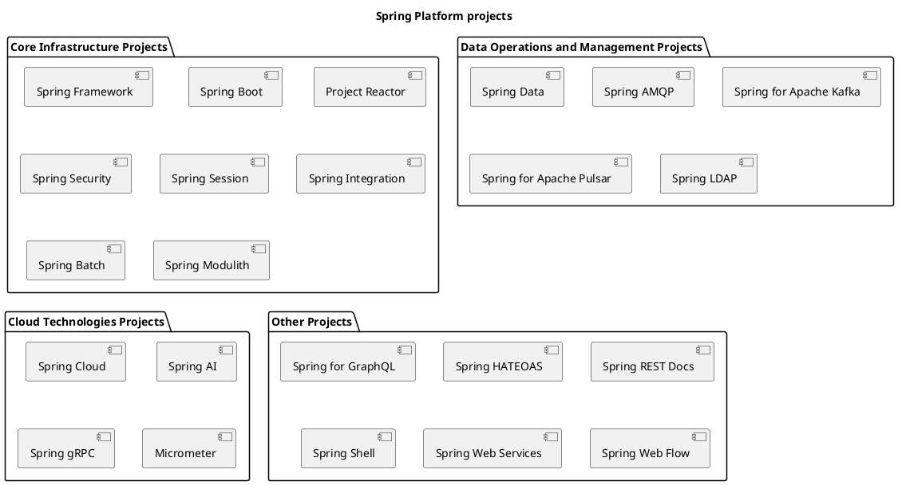
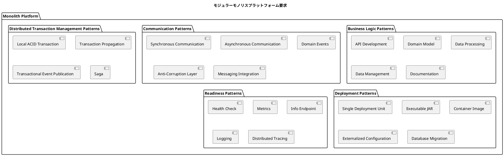
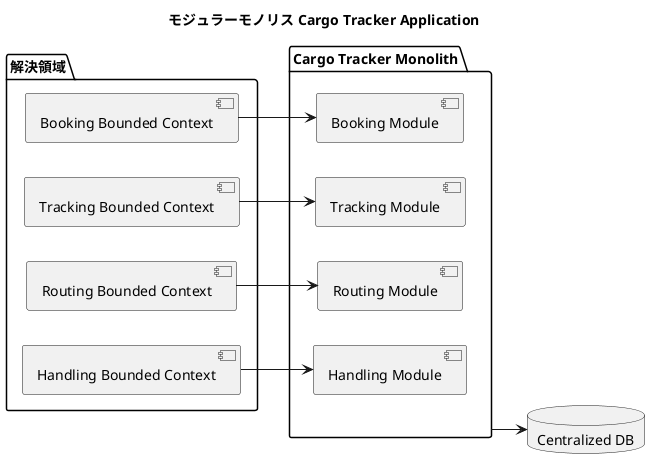
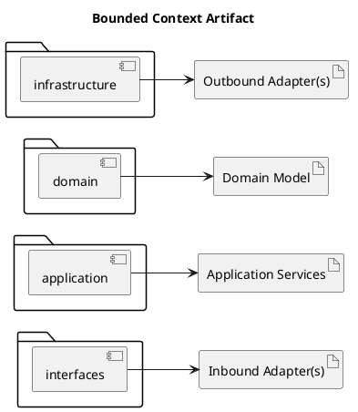
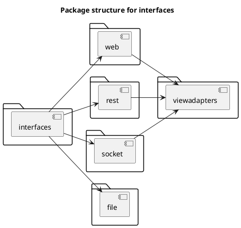
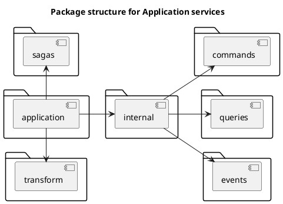
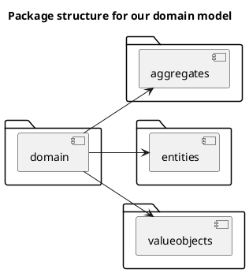
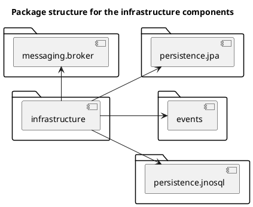
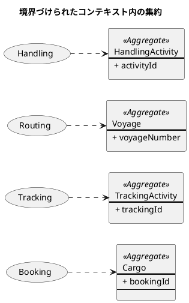
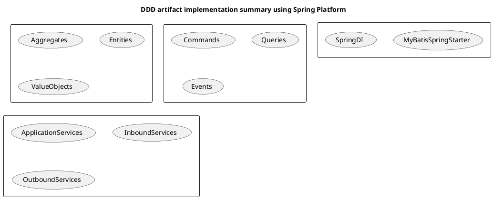

# 第 3 章：Spring Platform × モジュラーモノリス

- アプリケーション設計のための様々なDDD成果物をモデルリングプロセスを進めてCargo Trackerアプリケーション設計を詳細化した。
  - 荷物追跡問題領域/コアドメインに特定してCargo Trackerアプリケーションを問題領域のソリューションに割り当てた。
  - Cargo Trackerアプリケーションのサブドメイン/境界づけられたコンテキストを特定した。
  - 集約、エンティティ、値オブジェクトそしてドメインルールを含むドメインモデルを各境界づけられたコンテキスト毎に詳細化した。
  - 境界づけられたコンテキストで要求されるサポートドメインサービスを特定した。
  - 境界づけられたコンテキスト内の様々なオペレーションを特定した。（コマンド、クエリ、イベントそしてサガ）
- これまでのDDDモデリングフェーズから実装フェーズにすすむ。
- この記事ではエンタープライズJavaを開発実装の基本として以下のトピックでDDD実装を進めます。
    - Spring Bootを使ったモノリス実装
    - Spring Bootを使ったマイクロサービス実装
    - Axon Frameworkを使ったCommand/Query Responsibility Segregation(CQRS)/Event Sourcing(ES) 設計パターンによるマイクロサービス実装

## Spring プラットフォーム

- Spring Platform(https://spring.io/)はエンタープライズアプリケーションを構築するJavaの主流フレームワークです。
- Spring platformはプロジェクトポートフォリオを提供しています。
  - Core Infrastructure Projects:Springベースアプリケーションの基本部分
  - Data Operations and Management Projects:Springベースアプリケーションのデータ管理・メッセージング部分
  - Cloud Technologies Projects:Springアプリケーションのクラウドネイティブ化
  - Other Projects:Web API・ドキュメント・CLI など周辺領域



> かつてポートフォリオに含まれていた Spring Statemachine や Spring Cloud Sleuth などは Attic（保守終了プロジェクト置き場）に移動しています。

### モジュラーモノリスプラットフォームへの要求

- 単一デプロイのモジュラーモノリスであっても、プラットフォームに求められる機能は幅広いです。
- 要求は 5 つのパターン分類で整理できます。
  - Business Logic Patterns:BC の内側の業務ロジック
  - Communication Patterns:BC をまたぐ通信
  - Distributed Transaction Management Patterns:整合性の担保
  - Deployment Patterns:配置と成果物
  - Readiness Patterns:運用準備（可観測性）



- それぞれの要求を、前節の Spring プロジェクトポートフォリオと Cargo Tracker の実装へ対応づけます。

| 分類 | 要求 | 対応する Spring プロジェクト | Cargo Tracker での実装 |
| :--- | :--- | :--- | :--- |
| Business Logic | API Development | Spring Framework（Spring MVC）／Spring Boot | `interfaces.web` の `@Controller` |
| Business Logic | Domain Model | （フレームワーク非依存のプレーン Java） | `domain.model` の集約・エンティティ・値オブジェクト |
| Business Logic | Data Processing | Spring Framework（`@Transactional`）／Spring Batch | `application.internal.commandservices` のユースケース |
| Business Logic | Data Management | MyBatis Spring Boot Starter（ADR-004 により JPA は不採用） | `infrastructure` のリポジトリ／Mapper 実装 |
| Business Logic | Documentation | springdoc-openapi | `/swagger-ui` による API ドキュメント |
| Communication | Synchronous Communication | Spring Framework（DI によるメソッド呼び出し） | 同一 JVM 内の ACL ポート呼び出し |
| Communication | Asynchronous Communication | Spring Framework（`ApplicationEventPublisher`） | `@TransactionalEventListener(AFTER_COMMIT)` |
| Communication | Domain Events | Spring Framework／Spring Modulith | `CargoStatusUpdatedEvent` などの BC 間通知 |
| Communication | Anti-Corruption Layer | Spring Framework（インターフェース + `@Component` 実装） | `application.internal.outboundservices.acl` |
| Communication | Messaging Integration | Spring AMQP／Spring for Apache Kafka／Spring Integration | 本章では未使用（第 4 章の EDA で導入） |
| Distributed Transaction | Local ACID Transaction | Spring Framework（`@Transactional`） | 単一 DB のため 2 フェーズコミットは不要 |
| Distributed Transaction | Transaction Propagation | Spring Framework | アプリケーションサービスをトランザクション境界とする |
| Distributed Transaction | Transactional Event Publication | Spring Framework（`@TransactionalEventListener`） | コミット後に BC 間へ反映し、ロールバック時の不整合を防ぐ |
| Distributed Transaction | Saga | Axon Framework など | 本章では未使用（第 5 章で導入） |
| Deployment | Single Deployment Unit | Spring Boot | 全 BC を 1 つのアプリケーションとして起動 |
| Deployment | Executable JAR | Spring Boot（`bootJar`） | 実行可能 JAR を成果物とする |
| Deployment | Container Image | Spring Boot ＋ Dockerfile | `apps/cargo-tracker/Dockerfile` |
| Deployment | Externalized Configuration | Spring Boot（Profile／`application-*.yml`） | `local` / `local-postgres` / `dev` / `e2e` |
| Deployment | Database Migration | Flyway（`spring-boot-flyway`） | `src/main/resources/db` のマイグレーション |
| Readiness | Health Check | Spring Boot Actuator | `/actuator/health`（唯一 permitAll） |
| Readiness | Metrics | Spring Boot Actuator ／ Micrometer | `/actuator/metrics`（要認証） |
| Readiness | Info Endpoint | Spring Boot Actuator | `/actuator/info`（要認証） |
| Readiness | Logging | Spring Boot（Logback） | 既定構成 |
| Readiness | Distributed Tracing | Micrometer Tracing | 本章では未使用（分散構成となる第 4 章以降の検討事項） |

- Communication Patterns と Distributed Transaction Management Patterns が、いずれもプロセス内で満たされている点に注目します。
  - DI・アプリケーションイベント・単一 DB のローカルトランザクションで足りています。
  - モジュラーモノリスの利点はここに集約されます。
  - ここを外部ミドルウェアと分散トランザクションへ差し替える判断が、そのまま第 4 章の EDA、第 5 章の CQRS/ES への移行軸になります。
- Deployment Patterns と Readiness Patterns は、分散構成へ移っても要求そのものは変わりません。
  - Spring Boot と Actuator が提供する部分は据え置きです。
  - 追加されるのは Distributed Tracing のように「分散したから必要になる」項目だけです。

### Spring Boot: 機能

- 前節の要求一覧のうち、Deployment Patterns と Readiness Patterns の大半は Spring Boot が肩代わりします。
- ここでは Cargo Tracker が実際に使っている機能を、要求との対応で整理します。

#### 自動構成とスターター

- スターター依存を宣言すると、対応する自動構成が有効になります。
- Cargo Tracker が使うのは Web・テンプレート・検証・セキュリティ・運用と、永続化（MyBatis／Flyway）です。

```gradle
implementation 'org.springframework.boot:spring-boot-starter-web'
implementation 'org.springframework.boot:spring-boot-starter-thymeleaf'
implementation 'org.springframework.boot:spring-boot-starter-validation'
implementation 'org.springframework.boot:spring-boot-starter-security'
implementation 'org.springframework.boot:spring-boot-starter-actuator'
implementation "org.mybatis.spring.boot:mybatis-spring-boot-starter:${mybatisStarterVersion}"
```

- ただし Spring Boot 4 では自動構成がモジュールへ分割されています。
  - ライブラリの依存を入れただけでは自動構成が有効にならない場合があります。

```gradle
// spring-boot-flyway が無いと FlywayAutoConfiguration が有効にならず、
// 依存だけ入れてもマイグレーションが「静かに実行されない」
implementation 'org.springframework.boot:spring-boot-flyway'
implementation 'org.flywaydb:flyway-core'
```

- 自動構成の代償はこの失敗の形にあります。
  - 設定漏れが起動失敗ではなく「起動は成功するが効いていない」として現れます。
  - 動作を確かめるテストがなければ気づけません。
- 参照: `docs/article/source/java-2/apps/cargo-tracker/build.gradle`

#### 起動クラスとコンポーネントスキャン

- `@SpringBootApplication` を付けたクラスのパッケージが、コンポーネントスキャンの起点になります。
- ここが各 BC のトップレベルパッケージの親であることが、すべての BC が 1 プロセスにまとまる根拠です。

```java
@SpringBootApplication
@ConfigurationPropertiesScan
public class CargoTrackerApplication {
    public static void main(String[] args) {
        SpringApplication.run(CargoTrackerApplication.class, args);
    }
}
```

- 参照: `.../com/example/cargotracker/CargoTrackerApplication.java`

#### 外部化された設定

- `@ConfigurationPropertiesScan` により、`@ConfigurationProperties` を付けた record が設定の型になります。
  - 設定値を型で受けることで、キーの綴り間違いが起動時に判明します。

```java
@ConfigurationProperties(prefix = "app.demo-login")
public record DemoLoginProperties(
        boolean enabled, String username, String password, List<Account> accounts) { ... }
```

- 環境差は Profile 別ファイルで吸収します（`application-local.yml` / `-local-postgres` / `-dev` / `-e2e`）。
- 「テストでは短くしたい」といった値も設定へ出します。
  - コメントに「テストでは短く」と書いても短くはなりません。

```yaml
cargotracker:
  tracking:
    polling-interval: 30s
```

- 参照: `.../shared/infrastructure/web/DemoLoginProperties.java`、`.../src/main/resources/application.yml`

#### 成果物の切り分け

- `developmentOnly` の依存は `bootJar` に含まれません。
  - H2 と DevTools を本番成果物から外すことで、設定ミスで本番が H2 に接続する経路そのものを消します。

```gradle
developmentOnly 'com.h2database:h2'
developmentOnly 'org.springframework.boot:spring-boot-devtools'
```

- Deployment Patterns の Single Deployment Unit と Executable JAR は、この `bootJar` 一つで満たされます。

#### 運用エンドポイント（Actuator）

- Readiness Patterns は Actuator の公開設定に集約されます。

```yaml
management:
  endpoints:
    web:
      exposure:
        include: health,info,metrics
  endpoint:
    health:
      probes:
        enabled: true
```

- `metrics` を公開しているのは、結果整合の取りこぼしを数えて読むためです。
  - 購読側の失敗は利用者の画面に返せないため、ここが唯一の気づく手段になります。
- 公開範囲のうち認証不要なのは `/actuator/health` だけです。
- 参照: `.../src/main/resources/application.yml`

### Spring Framework のまとめ

- Spring Boot が「組み立て」を担うのに対して、Spring Framework は BC の内側と外側をつなぐ道具を提供します。
- モジュラーモノリスにおける使い方は次の 4 点に集約されます。
  - DI:ドメインを Spring から隔離するために使う
  - 宣言的トランザクション:境界はアプリケーションサービスに置く
  - アプリケーションイベント:BC 間の非同期通知
  - Spring MVC:受信の入口
- DI は、ドメインサービスに `@Service` を付けるのではなく、インフラ層の `@Configuration` で組み立てます。
  - 依存を注入する側を外に置くことで、ドメインは Spring を知らないままでいられます。

```java
@Configuration
public class RoutingDomainConfiguration {
    @Bean
    public RouteSearchService routeSearchService(FreightEstimator estimator, Clock clock) {
        return new RouteSearchService(estimator, clock.getZone());
    }
}
```

- 参照: `.../routing/infrastructure/config/RoutingDomainConfiguration.java`
- 宣言的トランザクションは `@Transactional` をアプリケーションサービスに置き、そこをトランザクション境界とします。
  - ドメインモデルにはトランザクションの概念を持ち込みません。
- アプリケーションイベントは `ApplicationEventPublisher` で発行し、`@TransactionalEventListener(AFTER_COMMIT)` で購読します。
  - プロセス内でありながら、発行元のロールバック時に購読側が動かないことを保証できます。
- Spring MVC は `@Controller` が Web からの受信を受け、Thymeleaf + htmx が HTML を返します。
- 重要なのは、この 4 つがいずれも interfaces / application / infrastructure の 3 層に閉じている点です。
  - ドメイン層に Spring は現れません。
  - Cargo Tracker ではこれを規約ではなく ArchUnit のルールとして固定しています。

```java
static final ArchRule ドメイン層はSpringに依存しない =
        noClasses()
                .that().resideInAPackage("..domain..")
                .should().dependOnClassesThat().resideInAPackage("org.springframework..")
                .because("ドメイン層は Spring フレームワークに依存してはならない");
```

- 参照: `.../src/test/java/com/example/cargotracker/PackageStructureTest.java`
- フレームワークに縛られたドメインは、フレームワークの都合で設計が歪みます。
  - 第 4 章の EDA、第 5 章の CQRS/ES へ実装方式を替えられるのは、ドメイン層がこのルールで守られているからです。
  - Spring を外側に寄せるという判断が、そのまま移行可能性を担保しています。

## モジュラーモノリスとしての Cargo Tracker

- モノリシックアーキテクチャの主のポイントは以下
  - 強いトランザクション一貫性
  - 保守容易性
  - データ管理の中央集中
  - 責任の共有
  
- モノリシックアーキテクチャにおいてDDDは中心的な役割をはたしている。
- 境界づけられたコンテキストはビジネスケイパビリティを独りした解決領域に分割する。
- 分割されたモジュールとしての境界づけられたコンテキストとドメインイベントによる相互やり取りは緩い結合を実現することで`真のモジュラリティ`または`モジュラモノリス`を可能にする。
- DDDを使って`真のモジュラリティ`または`モジュラモノリス`から始めるアドバンテージはモノリシックアーキテクチャのメリットを維持しつつ独理性を維持しながらマイクロサービスに移行することを可能にする。


### 境界づけられたコンテキスト

- 境界づけられたコンテキストはCargo TrackerモノリスのDDD実装のソリューションフェーズの開始点です。
- Cargo Trackerモノリスはデプロイ可能な単一のJARファイルとして作成されます。
- パッケージ構造はヘキサゴナルアーキテクチャをミラーする必要があります。



#### インターフェース層（interfaces）

- このパッケージには境界づけられたコンテキストがプロトコルで分類した全ての可能なインバウンドサービスが含まれます。
- 以下を主要な目的にします。
  - ドメインモデルを代表してプロトコルをやり取りする（e.g,REST API(s),Web API(s),WebSocket(s),FTP(s))
  - データ閲覧ビュー(e.g.,Browser View(s),Mobile View(s))



#### アプリケーション層（application）

- このパッケージには境界づけられたコンテキストのドメインモデルが要求するアプリケーションサービスが含まれます。
- アプリケーションサービスクラスは複数の目的に使われます。
  - インターフェイスの入力とレポジトリへの出力のポートとして
  - コマンド、クエリ、イベントそしてサガの参加者として
  - トランザクションの初期化、コントロール、終了
  - ドメインモデルに共通する関心事(ロギング、セキュリティ、メトリクス)の集権化
  - データのオブジェクト変換
  - 他の境界づけられたコンテキスト呼び出し



#### ドメイン層（domain）

- このパッケージには境界づけられたコンテキストのドメインモデルを配置します。
 - 集約
 - エンティティ
 - 値オブジェクト
 - ドメインルール



#### インフラストラクチャ層（infrastructure）

- このパッケージには境界づけられたコンテキストのドメインモデルが外部レポジトリ(e.g.,Relational Databases(s), NoSQL Databases, Message Queues,Event Infrastructure)とやり取りすのに必要なコンポーネントを含みます。



#### 共有カーネル

- 時に境界づけられたコンテキストを横断したドメインモデルを共有する必要がある。
- DDDのシェアードカーネルはコードの重複を減少させつつドメインモデルを共有する強固な仕組みを提供します。
- モノリスにおいてシェアードカーネルはより高いレベルの独理性を維持しつつマイクロサービスより簡単に実装できます。


### ドメインモデルの実装

- コアドメインモデルが境界づけられたコンテキストの中心的な機能であり、すでに述べた通り関連するアーティファクトです。
- ドメインモデルアーティファクトは以下を実装に必要とします。
  - 集約
  - エンティティ
  - 値オブジェクト

#### 集約

- 集約はドメインモデルの中心です。



- 集約の実装には以下の局面があります。
  - 集約クラスの実装
  - ドメインの豊かさ（ビジネス属性・ビジネスメソッド）
  - 状態の永続化
  - 集約間の参照
  - イベント

##### 集約クラスの実装

##### ドメインの豊かさ

- DDDの基本ではドメインの豊さが表現されかつドメインモデル内に集められる。そして集約はドメインモデルの中心となります。
- 集約はドメインリッチかつ境界づけられたコンテキストの明確なビジネスコンセプトを伝えるべきです。
- 集約はゲッターとセッターだけの貧血モデルになる。これはDDD界隈でアンチパターンとみなされます。
  - 貧血集約はドメインの意図も目的も表現されていません。
  - この属性を取得するだけのパターンはビジネスオブジェクトよりデータ変換オブジェクトを表すに最も使えます。
  - 貧血集約はドメインロジックが関連するサービスに漏れ出して意図を汚染します。
  - 貧血集約は時間とともにメンテナンス不能なコードになります。
- 可能な限り貧血集約は避けるべきです。そして利用意図を純粋なデータオブジェクトに制約するべきです。
- ドメインリッチ集約はこれと対照的に、名前が指すように豊かです。ビジネス属性とビジネスメソッドを表すサブドメインの意図を明確に表す。
- ビジネス属性の網羅：ルート集約は境界づけられたコンテキストに要求されるビジネス属性を全て網羅しなければなりません。
- ビジネスメソッドの網羅：そのほかの集約の重要な点はビジネスメソッドを通じてドメインロジックを表現することです。
  - 集約は特定のサブドメインで要求されるビジネスロジックとらえて関数にする必要があります。
  - ビジネスメソッドは集約内で単純なメソッドとして実装され現在の集約状態と一緒に働きます。

##### 状態の永続化

- 集約状態コンストラクタは新規集約と既存の集約を読み込む両方で使います。
- 既存の集約読み込みには２つの方法があります。
  - データストアから直接現在の集約状態を読み込むドメインソース
  - 空の集約状態を読み込んで特定の集約で発生したイベントを再生するイベントソース
- モノリス実装では1つ目の状態ソース集約を使います。
- 集約の永続化オペレーションはその集約のみ作用します。

##### 集約間の参照

- 集約間の参照は境界づけられたコンテキストをまたいだ集約の関連です。

##### イベント

- 真のDDDに従って、ドメインイベントは常に集約から公開する必要がある。

#### エンティティ

- 境界づけられたコンテキスト内のエンティティは自分自身の識別子を持つだけでなく常にルート集約とともに存在します。
- エンティティオブジェクトは集約のライフサイクルが完了するまで変わることはありません。
- エンティティオブジェクトの実装は以下をカバーしています。
  - エンティティクラスの実装
  - エンティティと集約の関係
  - エンティティ状態の構築
  - エンティティ状態の永続化

##### エンティティクラスの実装

##### エンティティと集約の関係

- エンティティクラスは自身のルート集約と強い関連を持っています。ルート集約なしには存在できないのです。

##### エンティティ状態の構築

- エンティティの状態は、管理下に置くルート集約が操作を実行するときにのみ構築されます。

##### エンティティ状態の永続化

- エンティティの永続化もルート集約の永続化操作に含めて行い、エンティティ単独で永続化することはありません。

#### 値オブジェクト

- 値オブジェクトは境界づけられたコンテキストの集約のスコープ内で使用されます。
- 識別子を持たず、集約のインスタンス内で取り換え可能です。

##### 値オブジェクトクラスの実装

- 値オブジェクトは識別子を持たないため、主キー項目を持ちません。

##### 値オブジェクトと集約の関係

- 値オブジェクトはルート集約なしには存在できません。しかし識別子を持たないため、集約のインスタンス内で簡単に取り替えることができます。

##### 値オブジェクトの構築

- 値オブジェクトの状態は、管理下に置くルート集約が操作を実行するときにのみ構築されます。

##### 値オブジェクトの永続化

- 値オブジェクトの永続化もルート集約の永続化操作に含めて行い、値オブジェクト単独で永続化することはありません。

#### ドメインルール

- ドメインルールは境界づけられたコンテキストの範囲内のビジネスロジック実行に関する集約をサポートします。
- ドメインモデル内のドメインルールは実行時に存在する集約の状態に依存します。集約の状態よりデータを要求する場合はサービスレイヤーに移動すべきです。

#### コマンド

- 境界づけられたコンテキスト内のコマンドは集約の状態を変更する操作です。

#### クエリ

- 境界づけられたコンテキスト内のクエリは集約の状態を取得する操作です。

### ドメインモデルサービスの実装

#### 受信サービス

- 受信サービス(またはヘキサゴナルアーキテクチャでの受信アダプタ)はコアドメインモデルの外部ゲートウェイとしての役割を持ちます。
- Cargo Trackerでは、ドメインモデルコンシューマーを基本として2種類の受信サービスを実装します。
  - RESTFul ウェブサービスを使ったHTTP API(s) 実装
  - Thymeleaf + htmx を用いたネイティブ Web API

#### RESTful API

#### ネイティブ Web API

#### アプリケーションサービス

- アプリケーションサービスはIoCコンテナを使ってSpring プラットフォーム内で構築されます。

#### アプリケーションサービス：イベント

- DDD内でのドメインイベントは集約によって生成されなければならないモノです。
- Sprng プラットフォームではSpring ApplicationEventPublisherを使って実装します。

#### 送信サービス

- Cargo Trackerモノリスでは、データベースとのやりとりに送信サービスを使います。
- 送信サービスはレポジトリクラスとして実装されインターフェイスの一部となります。
- レポジトリクラスは一般的に特定の集約に関連してデータベース操作全般を取り扱います。
  - 新しい集約と関連の永続化
  - 集約と関連の更新
  - 集約と関連の問い合わせ

### 実装のまとめ

- Springプラットフォームを使って複数のDDDアーティファクトと伴にモノリスCargo Trackerアプリケーションの実装を完了しました。



## まとめ

- まずSpringプラットフォームの詳細を確立して提供するケイパビリティを確認した。
- ドメイン駆動設計を使ったCargo Trackerモジュラーモノリスの実装の合理的正当性を確立した。
- 様々なDDDアーティファクト開発の詳細に取り組んだ - 最初にドメインモデルそしてドメインモデルをサポートするサービスをSpringプラットフォームが提供する技術を使って。
