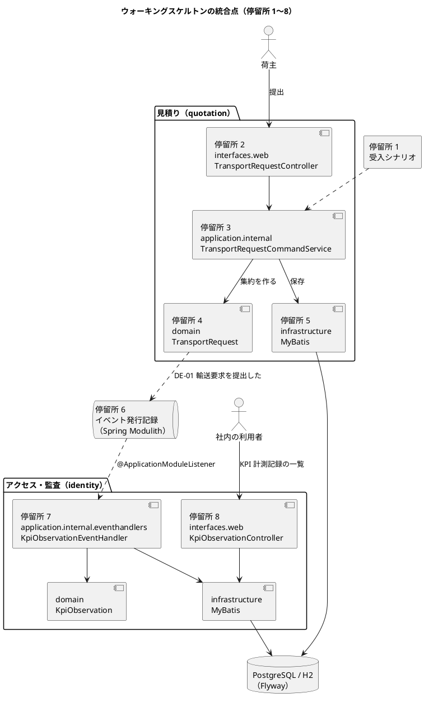
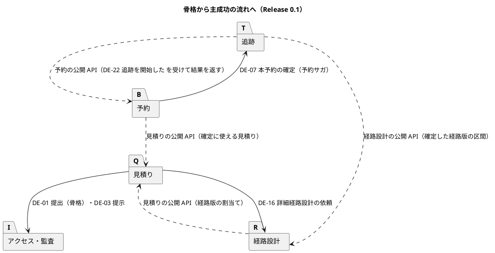

# ウォーキングスケルトンのガイドツアー

cargo-tracker の最初の Bolt で作ったウォーキングスケルトン（全統合点を通る最小の縦割り）を、いまのコードでたどります。荷主が輸送要求を提出してから、ドメインイベントが別のコンテキストに届き、社内の画面に KPI 計測記録が出るまでを、停留所ごとに実際のコードの抜粋と、[開発ガイドライン](index.md)のどの考え方の実装かとともに示します。最後に、この骨格の上に Release 0.1 の主成功の流れがどう育ったかを地図で示します。

本記事のコードの抜粋は、すべて `apps/cargo-tracker` の実在のコード（2026-10-10 時点の `develop`）から写しています。読みやすさのため、抜粋では import と一部のコメントを省いています。

## ウォーキングスケルトンとは

ウォーキングスケルトンは、本番と同じ構成のすべての統合点（画面、アプリケーション、ドメイン、永続化、コンテキストの間のイベント、もう一方のコンテキストの画面）を、最小の機能で一度に通した縦割りです。中身は薄くてよく、骨格が端から端まで歩けることを先に確かめます。

cargo-tracker では、開発戦略の序盤の最初の Bolt（Bolt 1）で作りました。層ごとに作り込んでから最後につなぐと、モジュールの境界、イベントの配信、H2 と PostgreSQL の差といった統合点の誤りが最後まで見えないからです。題材にしたのは、KPI-01（経路提示リードタイム）の開始時刻の記録です。

| 項目 | 内容 |
| :--- | :--- |
| 業務の流れ | 荷主が輸送要求を提出すると、KPI 計測記録に提出時刻が記録され、社内の画面に出る |
| 通るコンテキスト | 見積り（`quotation`）→ アクセス・監査（`identity`） |
| つなぐもの | ドメインイベント DE-01「輸送要求を提出した」（Spring Modulith のイベント発行記録） |
| 受入シナリオ | `features/quotation/walking_skeleton.feature`（`@walking-skeleton`） |

## 手元で動かす

```bash
cd apps/cargo-tracker
./gradlew bootRun
```

開発用のプロファイル（H2 のインメモリ）で起動します。ブラウザで `http://localhost:8080/` を開き、ログインの画面の「開発用の利用者でログイン（開発環境だけ）」から荷主担当者（`shipper@dev.cargo-tracker.example`）を選んで見積依頼を提出し、画面に示された業務番号（TR-…）を控えます。営業担当者でログインし直してナビゲーションの「KPI 計測記録」を開くと、控えた業務番号の行に提出時刻が出ています（開発用のサンプルの行もあらかじめ入っています）。

ツアーで見るテストは次のコマンドで動きます。統合テストは Testcontainers で PostgreSQL を起動するので、先に Docker を起動しておいてください。

```bash
cd apps/cargo-tracker
./gradlew check
```

## 地図



停留所 9 では、この骨格を守るテストと CI を、停留所 10 では Release 0.1 への育ち方を見ます。

## 停留所 1: 受入シナリオ（入口）

ツアーの入口は、業務の言葉で書いた受入シナリオです。開発戦略の序盤はアウトサイドインで、シナリオを先に書き、それを通すように内側を作りました。

```gherkin
# language: ja
@walking-skeleton @US-01 @US-21 @must
機能: 輸送要求の提出を KPI 計測に記録する
  荷主が輸送要求を提出すると、見積りのドメインイベント（DE-01）がアクセス・監査に届き、
  KPI-01 の開始時刻として、業務番号とともに KPI 計測記録に残る（Bolt 1 のウォーキングスケルトン、Bolt 4 で業務番号を追加）。
  受入条件を部分的にしか満たさないため、受入条件の番号のタグは付けない。

  シナリオ: 輸送要求を提出すると KPI 計測記録に業務番号と提出時刻が記録される
    前提 現在時刻が "2026-10-05T01:00:00Z" である
    かつ 荷主が必須条件をそろえた輸送条件を入力している
    もし 荷主が入力した輸送条件を提出する
    ならば 輸送要求は審査中になる
    もし 発行されたドメインイベントが購読するコンテキストに配信される
    ならば KPI 計測記録にその輸送要求の提出時刻 "2026-10-05T01:00:00Z" が記録される
    かつ KPI 計測記録にその輸送要求の業務番号 "TR-2026-0001" が記録される
```

見どころは「発行されたドメインイベントが購読するコンテキストに配信される」の 1 行です。業務のルールの層のシナリオは、DB とアプリケーション全体を起動せず、cucumber-spring の小さなコンテキスト（`AcceptanceTestConfiguration`）で、メモリのリポジトリと、テスト用の同期の配信（`DeferredEventDelivery`）を組み立てて動きます。`DeferredEventDelivery` は `ApplicationEventPublisher` のテスト用の実装として、発行されたイベントをためておき、このステップ（`shared.acceptance.EventDeliverySteps`）で購読する側へ届けます。本番では発行元のコミットの後に配信されるので、シナリオでも提出と記録をはっきり 2 段に分けて確かめます。

```java
@もし("発行されたドメインイベントが購読するコンテキストに配信される")
public void 発行されたドメインイベントが配信される() {
    delivery.deliverAll();
}
```

## 停留所 2: 画面とコントローラー（インターフェース層）

荷主の画面（C-03 見積依頼の作成）から送った入力を、見積りのインターフェース層のコントローラーが受けます。コントローラーは、入力をアプリケーション層のコマンドに変え、結果（提出できた／入力の誤り）を画面の行き先に変えるだけで、業務の判断を持ちません。

```java
@PostMapping
public String submit(
        AuthenticatedActor actor,
        @ModelAttribute TransportRequestForm transportRequestForm,
        BindingResult bindingResult,
        Model model,
        RedirectAttributes redirectAttributes) {
    Optional<ShipmentTermsInput> input =
            TransportRequestFormConverter.convert(transportRequestForm, provisionalConsignees, bindingResult);
    if (input.isEmpty()) {
        return showCreateFormWithErrors(transportRequestForm, model);
    }
    SubmissionOutcome outcome = commandService.submit(new SubmitTransportRequestCommand(
            actor.companyId(),
            actor.userId(),
            input.get(),
            RequiredDocumentViews.attachments(transportRequestForm)));
    return switch (outcome) {
        case SubmissionOutcome.Submitted submitted ->
            redirectToDetail(
                    submitted.number(),
                    TransportRequestLabels.numberWithVersion(submitted.number(), 1) + " を提出しました",
                    redirectAttributes);
        case SubmissionOutcome.Rejected(SubmissionViolations violations) -> {
            SubmissionViolationMessages.reject(violations, bindingResult);
            yield showCreateFormWithErrors(transportRequestForm, model);
        }
    };
}
```

- 荷主の企業はログインした利用者（`AuthenticatedActor`）から取り、画面の入力からは受け取りません
- 結果は `sealed` な型（`SubmissionOutcome`）で、`switch` で漏れなく分岐します。提出の後は詳細の画面へリダイレクトします（PRG）

## 停留所 3: アプリケーションサービス（アプリケーション層）

コマンドを受けて、検証・集約の生成・保存・イベントの発行を 1 つのトランザクションで進めます。第 3 章の「アプリケーションサービス」の役割です。

```java
@Transactional
public SubmissionOutcome submit(SubmitTransportRequestCommand command) {
    UtcInstant submittedAt = new UtcInstant(clock.instant());
    DocumentCheck documents = documentPolicy.check(List.of(), command.attachments());
    return switch (command.terms().validate(submittedAt, acceptancePolicy).and(documents.violations())) {
        case ShipmentTermsInput.Invalid(SubmissionViolations violations) ->
            new SubmissionOutcome.Rejected(violations);
        case ShipmentTermsInput.Valid(ShipmentTerms terms) -> submitValid(command, terms, documents, submittedAt);
    };
}
```

```java
private SubmissionOutcome submitValid(
        SubmitTransportRequestCommand command,
        ShipmentTerms terms,
        DocumentCheck documents,
        UtcInstant submittedAt) {
    TransportRequestId id = new TransportRequestId(UUID.randomUUID());
    ShipmentTerms withDocuments = terms.withDocuments(storeDocuments(id, documents));
    TransportRequestNumber number = numberIssuer.next(TransportRequestNumber.yearOf(submittedAt));
    TransportRequest transportRequest = TransportRequest.submit(
            id, number, command.shipperCompanyId(), withDocuments, command.submittedBy(), submittedAt);
    repository.save(transportRequest);
    publishEvents(transportRequest);
    return new SubmissionOutcome.Submitted(transportRequest.id(), number);
}

/** 保存した集約のイベントを、保存と同じトランザクションで発行し、集約から消す。 */
private void publishEvents(TransportRequest transportRequest) {
    transportRequest.domainEvents().forEach(eventPublisher::publishEvent);
    transportRequest.clearDomainEvents();
}
```

- 時刻は注入した `Clock` から取ります。受入シナリオの「現在時刻が … である」は、この `Clock` を差し替えて決めています
- 入力の検証は、入力の値オブジェクト（`ShipmentTermsInput`）が「正しい輸送条件」か「違反の一覧」かを返す形にし、例外を使いません
- 保存とイベントの発行が同じトランザクションの中にあることが、停留所 6 の配信の確かさの前提です

## 停留所 4: 集約とドメインイベント（ドメイン層）

業務の規則の中心は、見積りのコンテキストの集約「輸送要求」（`TransportRequest`）です。提出は、最初の版を作って審査中にし、ドメインイベント DE-01 を生成します。第 1 章の集約・ドメインイベント、第 2 章の輸送要求のモデルの実装です。

```java
public static TransportRequest submit(
        TransportRequestId id,
        TransportRequestNumber number,
        CompanyId shipperCompanyId,
        ShipmentTerms terms,
        UserId submittedBy,
        UtcInstant submittedAt) {
    TransportRequestVersion firstVersion =
            new TransportRequestVersion(FIRST_VERSION_NO, terms, submittedBy, submittedAt);
    TransportRequest request = new TransportRequest(
            id,
            number,
            shipperCompanyId,
            TransportRequestStatus.UNDER_REVIEW,
            firstVersion,
            List.of(),
            INITIAL_AGGREGATE_VERSION);
    request.domainEvents.add(new TransportRequestSubmitted(
            id.value(), FIRST_VERSION_NO, shipperCompanyId, submittedAt, number.text()));
    return request;
}
```

DE-01 は、ほかのコンテキストに公開する「公表された言語」です。

```java
@DomainEvent
public record TransportRequestSubmitted(
        UUID transportRequestId,
        int versionNo,
        CompanyId shipperCompanyId,
        UtcInstant submittedAt,
        String transportRequestNumber) {}
```

- イベントは `record` で、属性は Java 標準と共有カーネル（`CompanyId`・`UtcInstant`）の型だけです。見積りの集約の型を漏らしません
- 業務番号（`transportRequestNumber`）は Bolt 4 で足した部品です。イベントは保存されて後から読まれるので、部品は足すだけにし、古いイベントでは null になることを Javadoc に書いています（イベントの進化の規則）
- ドメイン層は Spring に依存しません。イベントの発行は集約が「生成」し、停留所 3 のアプリケーションサービスが「発行」します

## 停留所 5: リポジトリと MyBatis・Flyway（インフラストラクチャ層）

集約の保存は、ドメイン層のリポジトリのインターフェースを、インフラストラクチャ層の MyBatis の実装が満たします（依存性の逆転）。SQL は自分のスキーマ（`quotation`）の表だけを参照します。

```xml
<insert id="insertTransportRequest">
    INSERT INTO quotation.transport_request
        (id, request_number, shipper_company_id, status, current_version_no, version)
    VALUES (#{id}, #{requestNumber}, #{shipperCompanyId}, #{status}, #{currentVersionNo}, #{version})
</insert>
```

表は Flyway のマイグレーションで作ります。コンテキストごとにスキーマを分け、スキーマをまたいで外部キーを張りません。購読する側の KPI 計測記録の表は、Bolt 1 では使う列だけで作りました。

```sql
CREATE TABLE identity.kpi_observation (
    transport_request_id UUID                     NOT NULL,
    shipper_company_id   UUID                     NOT NULL,
    submitted_at         TIMESTAMP WITH TIME ZONE NOT NULL,
    excluded             BOOLEAN                  NOT NULL DEFAULT FALSE,
    CONSTRAINT pk_kpi_observation PRIMARY KEY (transport_request_id)
);
```

業務番号の列（Bolt 4）や最初の提示時刻の列（Bolt 21）は、使う Bolt のマイグレーションで後から足しています。手元の起動（開発用のプロファイル）は H2、統合テストと本番は PostgreSQL です。マイグレーションは共通のもの（`db/migration/common`）に、ベンダーごとの差分（`db/migration/h2`・`db/migration/postgresql`。イベント発行記録の表など）だけを足します。

## 停留所 6: イベントの発行と配信（Spring Modulith）

停留所 3 で `ApplicationEventPublisher` に渡した DE-01 は、Spring Modulith のイベント発行記録（`platform` スキーマの表）に、輸送要求の保存と同じトランザクションで書かれます。コミットの後に、購読する側に非同期で配信され、配信が終わると記録が完了になります。

- 保存とイベントの記録が同じトランザクションなので、「保存したのにイベントが消えた」「イベントだけが出た」が起きません
- 配信に失敗した記録は残り、起動のときに配り直します（`spring.modulith.events.republish-outstanding-events-on-restart=true`。起動しない間の定期の再配信は運用準備（W10）で入れる予定です）。配信は「少なくとも 1 回」なので、購読する側は同じイベントが 2 回届いても結果が変わらないように作ります（停留所 7）

この配信が本当に非同期で起き、完了まで進むことは、PostgreSQL（Testcontainers）を使う統合テストで確かめています。

```java
@Test
void 輸送要求を提出するとイベントが非同期に配信されKPI計測記録ができて配信が完了する() {
    SubmissionOutcome.Submitted submitted =
            (SubmissionOutcome.Submitted) commandService.submit(new SubmitTransportRequestCommand(
                    new CompanyId(UUID.randomUUID()),
                    new UserId(UUID.randomUUID()),
                    ShipmentTermsFixture.completeInput()));
    TransportRequestId id = submitted.transportRequestId();

    await().atMost(TIMEOUT)
            .untilAsserted(() -> assertThat(kpiObservationQueryService.findByTransportRequestId(id.value()))
                    .isPresent());
    await().atMost(TIMEOUT)
            .untilAsserted(() -> assertThat(completedEventPublications.findAll())
                    .extracting(EventPublication::getEvent)
                    .filteredOn(TransportRequestSubmitted.class::isInstance)
                    .map(TransportRequestSubmitted.class::cast)
                    .extracting(TransportRequestSubmitted::transportRequestId)
                    .contains(id.value()));
}
```

## 停留所 7: 購読する側（アクセス・監査のコンテキスト）

アクセス・監査のコンテキストは、見積りの集約を直接は呼ばず、DE-01 を購読して自分の集約「KPI 計測記録」（`KpiObservation`）を作ります。

```java
@ApplicationModuleListener
public void on(TransportRequestSubmitted event) {
    repository.save(KpiObservation.recordSubmission(
            event.transportRequestId(),
            event.transportRequestNumber(),
            event.shipperCompanyId(),
            event.submittedAt()));
}
```

`@ApplicationModuleListener` は、発行元のコミットの後に、非同期で、新しいトランザクションの中で処理します。配信が少なくとも 1 回なので、保存は冪等にしています。同じ輸送要求の記録があれば何もしません（抜粋の `firstPresentedAt` は Bolt 21 で足した列で、骨格の時点にはありませんでした）。

```xml
<insert id="insertIfAbsent">
    INSERT INTO identity.kpi_observation (<include refid="columns"/>)
    SELECT #{transportRequestId}, #{transportRequestNumber}, #{shipperCompanyId}, #{submittedAt}, #{firstPresentedAt}
     WHERE NOT EXISTS (
           SELECT 1 FROM identity.kpi_observation WHERE transport_request_id = #{transportRequestId})
</insert>
```

アクセス・監査が見積りに依存してよいのは、公表されたイベントだけです。モジュールの宣言（`package-info.java`）で、依存してよい先を名前で限っています。

```java
@org.springframework.modulith.ApplicationModule(
        displayName = "アクセス・監査",
        allowedDependencies = {"shared", "quotation :: events", "platform :: web"})
package com.example.cargotracker.identity;
```

`quotation :: events` は、見積りのイベントのパッケージに付けた名前付きのインターフェース（`@NamedInterface("events")`）です。アクセス・監査のコードが見積りの集約やアプリケーションサービスの型を使うと、停留所 9 のモジュールの検査で失敗します。

## 停留所 8: 社内の画面（KPI 計測記録）

最後の統合点は、もう一方のコンテキストの画面です。社内の利用者が開く KPI 計測記録の一覧（S-22 KPI の照会の前身の仮の画面）が、アクセス・監査の照会のサービスから記録を読みます。

```java
@GetMapping("/staff/kpi-observations")
public String list(Model model) {
    model.addAttribute(
            "observations",
            queryService.findAll().stream()
                    .map(observation -> KpiObservationView.from(observation, clock.instant()))
                    .toList());
    return "identity/kpi-observations/list";
}
```

ここまでで、荷主の画面 → 見積りのアプリケーション → 集約 → 永続化 → イベント発行記録 → アクセス・監査の購読 → 永続化 → 社内の画面、のすべての統合点を 1 本の流れが通りました。

## 停留所 9: 骨格を守る網（テストと CI）

ウォーキングスケルトンの価値は、骨格を通したことだけでなく、その骨格を壊さない網を最初から張ったことにあります。

### ドメイン層の依存（AT-01）

```java
@ArchTest
static final ArchRule ドメイン層はJava標準とドメイン層と注釈の語彙にだけ依存する = classes()
        .that()
        .resideInAPackage("..domain..")
        .and()
        .doNotHaveSimpleName("package-info")
        .should()
        .onlyDependOnClassesThat()
        .resideInAnyPackage(
                "java..", "com.example.cargotracker..domain..", "com.example.cargotracker.shared.annotation.ddd..");
```

### モジュールの境界（AT-03）

```java
@Test
void モジュール間の依存が境界を守っている() {
    modules.verify();
}
```

Spring Modulith がパッケージの構成と `allowedDependencies` から、コンテキストの間の依存を検査します。

### そのほかの網

| 網 | 確かめること | 実行 |
| :--- | :--- | :--- |
| 業務のルールの層の受入シナリオ（Cucumber） | 停留所 1 のシナリオ。DB とアプリケーション全体を起動せず、メモリのリポジトリとテスト用の同期の配信で速く回す | `./gradlew check` |
| 統合テスト（Testcontainers の PostgreSQL） | 停留所 5・6 の保存と非同期の配信 | `./gradlew check` |
| アーキテクチャテスト AT-01〜06 | AT-01・02・05 は ArchUnit（ドメイン層・層の依存・ステップ定義の依存）、AT-03 は Spring Modulith（モジュールの境界）、AT-04 は独自のテスト `MapperSchemaArchitectureTest`（マッパーの SQL のスキーマ）、AT-06 は Gradle の検査 `verifyProductionClasspath`（本番の依存に H2 を含まない） | `./gradlew check` |
| 画面の層の受入シナリオ（Playwright、axe-core） | 画面をブラウザで操作し、アクセシビリティの違反がないこと | `./gradlew uiTest` |
| CI（GitHub Actions） | 上のすべてと、JIG の設計ドキュメントの生成、デモ環境への配備 | develop・main への push と Pull Request で、`apps/cargo-tracker/**` などに変更があるとき。デモ環境への配備は develop で、check と画面の層の両方が通ったときだけ |

## 停留所 10: ウォーキングスケルトンから Release 0.1 の主成功の流れへ

Bolt 1 の骨格は 2 つのコンテキストと 1 つのイベントでした。Release 0.1（Bolt 28 まで）では、同じ統合点の形を繰り返して、提出から荷主の追跡の照会までの主成功の流れに育ちました。



| 骨格（Bolt 1） | 主成功の流れ（Release 0.1） |
| :--- | :--- |
| 2 つのコンテキスト（見積り、アクセス・監査） | 5 つのコンテキスト（見積り、経路設計、予約、追跡、アクセス・監査） |
| 1 つのイベント（DE-01） | 提出・提示・詳細経路設計の依頼・経路の確定・承認・本予約の確定などのイベントと、コンテキストの公開 API |
| イベントの購読だけ | 予約サガ（本予約の確定から追跡の開始までを、イベントと公開 API でつなぐ） |
| 受入シナリオ 1 本 | Release 0.1 の 28 件の受入条件ごとのシナリオと、画面の層の主成功の流れのシナリオ 1 本（`main_flow_ui.feature`） |

新しいコンテキストを足すたびに、停留所 2〜8 と同じ形（インターフェース層 → アプリケーションサービス → 集約 → リポジトリ、コンテキストの間はイベントか公開 API）を繰り返し、停留所 9 の網がその形を守りました。Release 0.1 の主成功の流れのシナリオが、新しいステップ定義を 1 つも足さずに既存の部品だけで組めたのは、骨格の形が最後まで崩れなかったからです。

## まとめ

- ウォーキングスケルトンは、すべての統合点を最小の機能で先に通し、統合点の誤りを最初に潰すための縦割りです
- cargo-tracker の骨格は、荷主の提出 → DE-01 → KPI 計測記録 → 社内の画面で、第 1〜3 章の考え方（集約、ドメインイベント、境界づけられたコンテキスト、モジュラーモノリス）がすべて 1 本の流れに現れます
- 骨格と同時に張ったテストと CI の網が、Release 0.1 まで形を守りました

## 関連ドキュメント

- [第 1 章：ドメイン駆動設計](01-ddd-fundamentals.md)、[第 2 章：Cargo Tracker のドメインモデル](02-cargo-domain-model.md)、[第 3 章：Spring Platform × モジュラーモノリス](03-spring-modular-monolith.md)
- [Bolt 1 計画 - ウォーキングスケルトン](../development/cargo-tracker/bolt_01_plan.md)
- [開発戦略](../development/cargo-tracker/development_strategy.md)（序盤）
- [Bolt 28 終了報告](../development/cargo-tracker/bolt_28_report.md)（Release 0.1 の主成功の流れ）
- [ユーザーマニュアル](../manual/index.md)（画面の操作）
