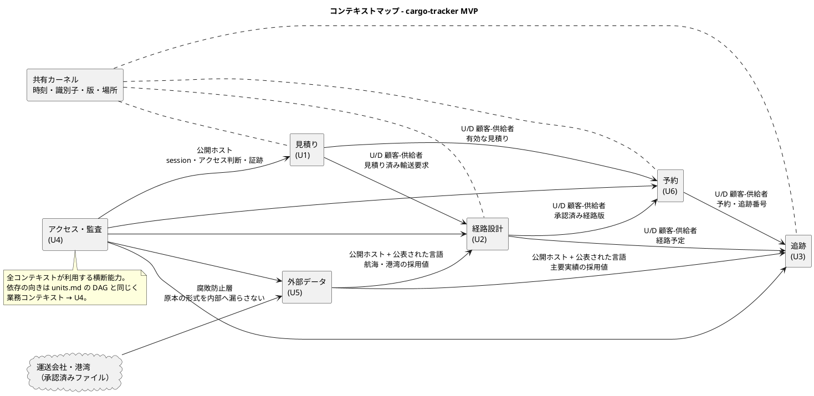
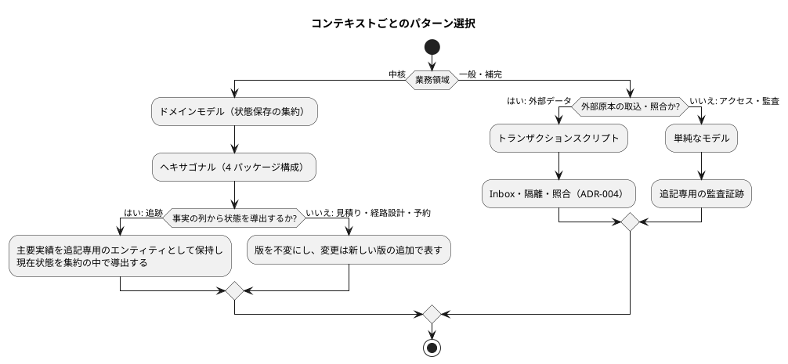
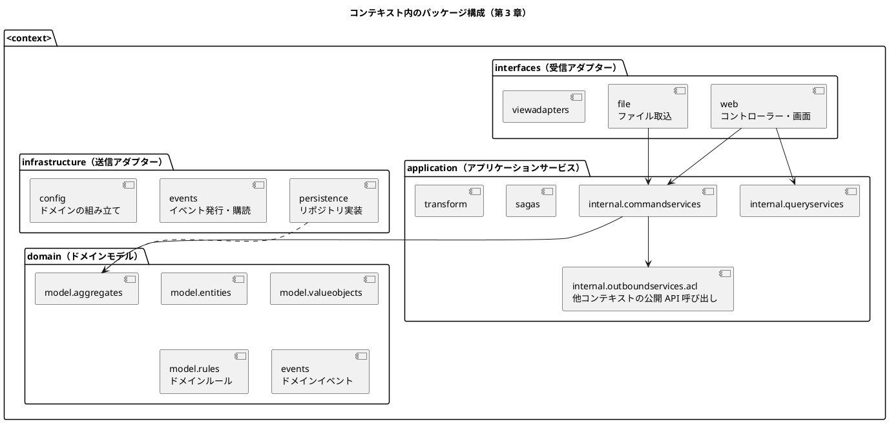
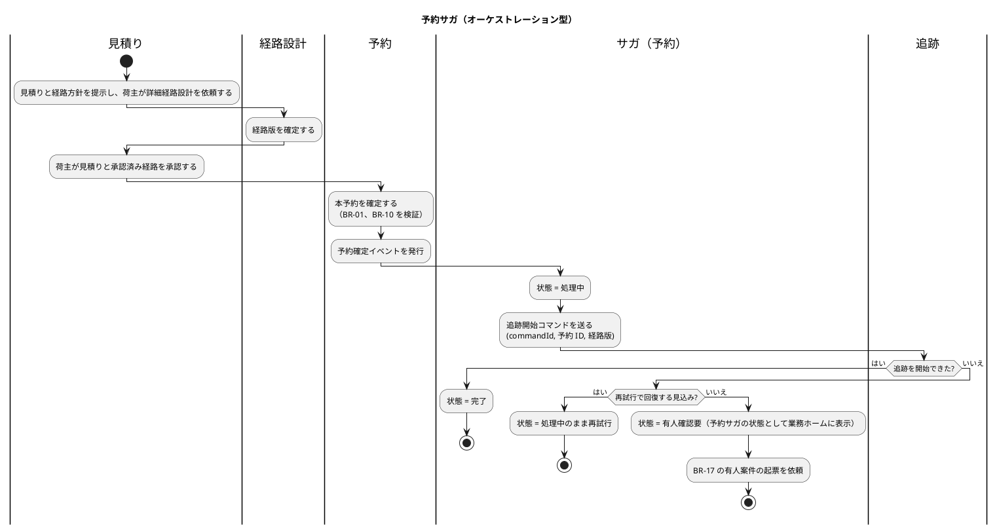

# cargo-tracker バックエンドアーキテクチャ

## 位置づけ

本書は、[Unit 定義](../../requirements/cargo-tracker/units.md) の U1〜U6 と [要件定義](../../requirements/cargo-tracker/requirements_definition.md) の BR・NFR をもとに、バックエンドの構造を決める。設計の語彙と進め方は開発ガイドラインの [第 1 章](../../article/01-ddd-fundamentals.md)・[第 2 章](../../article/02-cargo-domain-model.md)・[第 3 章](../../article/03-spring-modular-monolith.md) に従う。言語・フレームワーク・製品は技術スタック選定（後続工程）で決める。第 3 章が示す Spring Platform の構成は、その第一候補として扱う。

本書の判断は次の ADR に記録する。

| ADR | 決定 |
| :--- | :--- |
| [ADR-001](../../adr/cargo-tracker/001-modular-monolith.md) | モジュラーモノリスで構築し、物理的なサービス分割は行わない |
| [ADR-002](../../adr/cargo-tracker/002-domain-logic-pattern-per-context.md) | ドメインロジックのパターンを境界づけられたコンテキストごとに選ぶ。MVP ではイベントソーシングを使わない |
| [ADR-003](../../adr/cargo-tracker/003-inter-context-integration.md) | コンテキスト間は冪等コマンド、永続化したドメインイベント、オーケストレーション型のサガで連携する |
| [ADR-004](../../adr/cargo-tracker/004-external-data-ingestion.md) | 外部原本は Inbox・隔離・照合の 3 段で取り込む |
| [ADR-005](../../adr/cargo-tracker/005-server-side-rendering.md) | 画面はサーバーサイドレンダリングとハイパーメディアで提供する |

## 開発ガイドラインとの対応

第 2 章の DDD モデリングプロセス（サブドメイン → 境界づけられたコンテキスト → ドメインモデル → ドメインモデルの操作 → サガ → ドメインモデルサービス）のうち、本書は前半の高レベル成果物と、最後のドメインモデルサービスの構造を扱う。集約・操作・サガの詳細はドメインモデル設計（後続工程）で扱う。

| ガイドラインの考え方 | 本書での適用 | ガイドラインとの違いと理由 |
| :--- | :--- | :--- |
| サブドメインごとに境界づけられたコンテキストを 1 つ割り当てる（第 2 章） | Unit = サブドメイン = コンテキストとして 1 対 1 に対応させる | なし |
| Booking・Routing・Handling・Tracking の 4 コンテキスト（第 2 章） | 見積り・経路設計・予約・追跡・アクセス・監査・外部データ・通知の 7 コンテキスト | 要件で見積り（U1）と予約（U6）を分けた。荷役（Handling）は第 2 段階。認証・監査と外部原本の取込は独立した規則を持つため、別のコンテキストにした |
| 予約コンテキストが貨物に経路を割り当てる（第 2 章 Assign Route to Cargo） | 経路設計コンテキストが経路版を作り、専門家の承認を経て確定する。予約は承認済み経路版を参照するだけ | 経路の比較・専門家判断・版管理（US-06〜US-08、BR-11）が要件の中核のため |
| モジュラーモノリス、単一 DB（第 3 章） | 同じ。DB は 1 つで、コンテキストごとにスキーマを分ける | スキーマ分割は境界を DB でも強制するための追加 |
| interfaces / application / domain / infrastructure の 4 パッケージ（第 3 章） | 同じ構成を全コンテキストで使う | なし |
| ドメイン層はフレームワークに依存しない。ArchUnit で固定する（第 3 章） | 同じ | なし |
| モノリスでは状態保存の集約を使う。イベントソーシングは CQRS/ES 編（第 5 章）で扱う（第 3 章） | 全コンテキストで状態保存の集約を使う | なし |
| BC 間通知はアプリケーションイベントを AFTER_COMMIT で購読する（第 3 章） | Spring Modulith の `@ApplicationModuleListener`（コミット後に非同期で、新しいトランザクションで処理する）で購読し、発行したイベントを永続化して未完了の配信をやり直す | PV-01 は重複予約・原本消失を 1 件も許さない。コミット後・購読前にプロセスが止まるとイベントが失われるため |
| サガは第 3 章では未使用（第 5 章で導入） | 予約サガをモノリスの中でオーケストレーション型として実装する | ARCH-HO-02 が部分成功の管理を求めているため |
| 受信サービスは REST API とネイティブ Web API（Thymeleaf + htmx）（第 3 章） | 画面はネイティブ Web（サーバーサイドレンダリング）で提供する。REST API は外部の利用者が現れた時点で追加する | パイロットに外部の API 利用者がいないため（BR-18、OQ-05） |

## 設計の前提

| 前提 | 根拠 | 設計への影響 |
| :--- | :--- | :--- |
| MVP は予約・経路設計・基本追跡の縦の流れを通すウォーキングスケルトン | インセプションデッキ 6 章、units.md | 最初から全コンテキストの骨格を置き、中身は Bolt ごとに厚くする |
| 版と証跡が業務の中心にある | BR-04、BR-05、BR-10、BR-11、BR-16、NFR-AUDIT-01 | 上書きではなく、新しい版・新しい実績の追加でモデル化する |
| パイロットは外部 API を使わず承認済みファイルを手動で取り込む | BR-18、OQ-05 | 外部連携は外部データコンテキストに閉じ、後から API の受信口に差し替えられるようにする |
| 権限外開示・外部原本消失・重複予約が 1 件でも出たらパイロット中止 | PV-01 | 認可・冪等性・原本保存をアーキテクチャで保証し、個々の画面実装の注意に頼らない |
| チームは小規模で、物理分割の運用負荷を負えない | インセプションデッキ 8 章（仮定）、本リポジトリの実体制 | デプロイは 1 単位にし、境界は論理モジュールで守る |

## 境界づけられたコンテキスト

Unit は業務能力の単位であり、デプロイ単位ではない（units.md「AI の仮定と要確認」）。MVP では、第 2 章と同じく 1 つのサブドメインに 1 つのコンテキストを対応させる。通知だけは Unit ではなく一般のサブドメインとして独立させた（U3 のストーリー US-22 を実現する）。KPI の計測（US-21）はアクセス・監査コンテキストに置く。

| コンテキスト | Unit | 業務領域の分類 | 主な集約候補 | 根拠 |
| :--- | :--- | :--- | :--- | :--- |
| 見積り（Quotation） | U1 | 中核 | 輸送要求、見積り | 顧客要件理解・見積り管理はコアのケイパビリティ |
| 経路設計（Routing） | U2 | 中核（差別化の源泉） | 経路設計案件（経路版を含む）、航海（Voyage） | 制約対応型経路設計は A 社の競争優位。航海は第 2 章と同じく経路設計が持つ |
| 予約（Booking） | U6 | 中核 | 貨物予約（予約版を含む） | 予約管理はコアのケイパビリティ。第 2 章の Cargo 集約に当たる |
| 追跡（Tracking） | U3 | 中核 | 追跡記録（主要実績を含む）、有人案件 | 状態管理・例外対応はコアで成熟度が低い。第 2 章の TrackingActivity に当たる |
| アクセス・監査（Identity & Audit） | U4 | 一般 | 企業、利用者、参照許可、監査証跡 | 業務固有性は低く、標準的な手法で足りる |
| 外部データ（External Data） | U5 | 補完 | 取込バッチ、外部原本、隔離案件 | 中核を支える取込・照合 |
| 通知（Notification） | U3（US-22） | 一般 | 通知 | 荷主へのメール通知（UC-13 の一部を MVP へ前倒し）。業務の判断を持たず、イベントを購読して送るだけ。第 2 段階の通知（配信設定、代替チャネル）もここで拡張する |

荷役（Handling）は第 2 段階で加える。MVP の主要実績の登録（US-12）は、追跡管理者が追跡コンテキストで行う。荷役コンテキストを加えるときに、実績の登録をどちらが持つかを見直す。

集約・エンティティ・値オブジェクトの詳細はドメインモデル設計（後続工程）で決める。

### コンテキストマップ

矢印は「上流（U）が下流（D）へ成果を提供する」向きで描いている。units.md の DAG（利用側 → 依存先）とは向きが逆だが、関係は同じである。

| 関係 | 上流 → 下流 | パターン | 結合を抑える条件（units.md より） |
| :--- | :--- | :--- | :--- |
| 見積り → 経路設計 | Q → R | 顧客-供給者 | 見積り計算の内部過程を経路設計に漏らさない |
| 見積り → 予約 | Q → B | 顧客-供給者 | 見積りの内部情報を予約へ複製せず、見積り ID・版・有効期限だけを渡す |
| 経路設計 → 予約 | R → B | 顧客-供給者 | 経路算出方法を予約に漏らさない |
| 予約 → 追跡 | B → T | 顧客-供給者 | 見積りの内部情報を追跡へ公開しない |
| 経路設計 → 追跡 | R → T | 顧客-供給者 | 候補計算の内部過程を追跡へ公開しない |
| 外部データ → 経路設計・追跡 | X → R、T | 公開ホスト + 公表された言語 | 未検証の原本を採用値として渡さない |
| 外部 → 外部データ | EXT → X | 腐敗防止層 | 提供元の形式を経路規則へ直接漏らさない |
| アクセス・監査 → 全体 | IA → 全体 | 公開ホスト | 認証方式・監査方式を業務規則へ埋め込まない |
| 共有カーネル | 全業務コンテキスト | 共有カーネル（第 3 章） | 業務の意味を持たない基本型だけに限る |
| 追跡 → 予約（イベントのみ） | T → B | 公表された言語（ドメインイベント） | 集荷実績の採用と引渡しの確認だけを通知する。予約は追跡の公開 API・内部に依存しない（[ドメインモデル](domain_model.md) DE-09、DE-10。第 2 章で Booking が Cargo Handled を購読するのと同じ） |
| 予約 → 見積り（イベントのみ） | B → Q | 公表された言語（ドメインイベント） | 本予約の確定だけを通知し、輸送要求を予約確定済みにする（[ドメインモデル](domain_model.md) DE-07） |

下流のコンテキストは、上流の公開 API を自分の application 層の ACL（腐敗防止層）越しに呼ぶ（第 3 章 `application.internal.outboundservices.acl`）。上流のドメインオブジェクトを自分のドメイン層に持ち込まない。

### 共有カーネル

第 3 章の共有カーネルを、次の基本型に限って使う。業務規則を持つ型は共有しない。

| 型 | 内容 |
| :--- | :--- |
| UTC 時点 | UTC で保存し、表示時に利用者のタイムゾーンと UTC offset を付ける（BR-10） |
| コマンド ID、集約の版 | ARCH-HO-01 の冪等性と期待版の照合に使う |
| 場所 | UN/LOCODE による場所の識別（インセプションデッキ ガイディングプリンシプル） |
| 業務 ID の基底 | 予約 ID、追跡番号などの不透明な識別子の基底型 |

## ドメインロジックパターンの選択

[アーキテクチャ設計ガイド](../../reference/アーキテクチャ設計ガイド.md) の選択フローをコンテキストごとに当てはめ、第 3 章の「モノリスでは状態保存の集約を使う」に合わせて調整した（ADR-002）。

| コンテキスト | ドメインロジック | テストの形 | 選定理由 |
| :--- | :--- | :--- | :--- |
| 見積り | ドメインモデル。版を明示した集約 | ピラミッド | 有効期限の境界（BR-10）、版の置換（BR-16）など規則が多い |
| 経路設計 | ドメインモデル。版を明示した集約 | ピラミッド | 制約適合判定（BR-02、BR-11）が最も複雑で、Golden dataset で検証する。判定はドメインルールとして集約の外に純粋な関数で切り出す |
| 予約 | ドメインモデル。版を明示した集約 | ピラミッド | 状態遷移（予約の状態モデル）と確定条件（BR-01、BR-04）を集約で守る |
| 追跡 | ドメインモデル。追記専用の主要実績を持つ集約 | ピラミッド | 第 2 章の TrackingActivity と同じく、集約が実績（HandlingEvent に当たる）の列を持つ。訂正は新しい実績（BR-05）、順序逆転は保留（BR-06）、完了後の遅延実績は保持のみ（BR-16）を、実績の追加と状態の導出で表す |
| アクセス・監査 | 単純なモデル | ダイヤモンド | 固定役割（BR-15）と参照許可（BR-07）の登録・照会が中心。認証の仕組みは実績のある部品に任せる |
| 外部データ | トランザクションスクリプト | 逆ピラミッド寄り | 処理は「受け取る → 検証する → 分類する → 照合する」の手続き。冪等性と件数照合（BR-12）を統合テストで保証する |

### 監査証跡の扱い

ガイドのフローでは「監査記録が必要」な中核領域はイベント履歴式になる。本設計では MVP でイベントソーシングを使わず、次の方法で NFR-AUDIT-01 を満たす（ADR-002）。

- 集約の版を不変にする。変更は新しい版の追加で表し、旧版は読み取り専用で残す（BR-04、BR-16）。
- 追跡の主要実績は追記専用とし、削除・上書きしない（BR-05）。
- 状態を変える操作はすべて集約がドメインイベントを生成する（第 3 章「ドメインイベントは常に集約から公開する」）。アクセス・監査コンテキストがそれを購読し、追記専用の監査証跡に記録する。
- 監査証跡には、操作者、日時（UTC）、対象 ID と版、変更前後、理由、承認、出典を持たせる（RP-02）。
- 認証の成功・失敗・ロックと権限外のアクセス試行は、ドメインイベントにならないため、Spring Security のイベントと認可の判断の箇所から、同じ request の中で同期に監査記録へ書く（ドメインモデル IA-INV-08）。

将来、追跡を CQRS/ES へ移す場合は、第 5 章（Axon Framework）の進め方に沿って別の ADR で判断する。

## パッケージ構成

全コンテキストで第 3 章の 4 パッケージ構成を使う。ヘキサゴナルアーキテクチャのポートとアダプターをパッケージ名に対応させる。

| パッケージ | 責務 | 置かないもの |
| :--- | :--- | :--- |
| `interfaces` | 画面・ファイルなどの受信、入力の形式検証、ビューへの変換 | 業務規則の判定 |
| `application` | ユースケースの手順、認可の確認（アクセス・監査の判断を使う）、トランザクション境界、コマンドの冪等処理、期待版の照合、サガ、他コンテキストの呼び出し | 業務規則の判定 |
| `domain` | 集約の不変条件、状態遷移、BR の判定、ドメインイベントの生成 | 永続化、HTTP、現在時刻の直接取得、認証方式、フレームワークへの依存 |
| `infrastructure` | 永続化、イベントの永続化と配信、ドメインオブジェクトの組み立て | 業務規則の判定 |

アーキテクチャテスト（ArchUnit 相当）で次を固定する。

- `domain` はフレームワークに依存しない（第 3 章）。
- コンテキストは他コンテキストの `domain`・`infrastructure` を参照しない。参照してよいのは公開 API とドメインイベントだけ。
- 依存は `interfaces` → `application` → `domain` ← `infrastructure` の向きに限る。

Bolt 1 の実装で次を決めた。

- 各コンテキストの `domain.events` は、Spring Modulith の名前付きインターフェース（`@NamedInterface("events")`）として公開する。他のコンテキストはこのパッケージのイベントの型だけを参照できる。イベントは他のコンテキストのドメインの型を持たず、UUID と共有カーネルの型だけで表す
- MyBatis の型ハンドラーなど、コンテキストに属さない技術的な部品は基盤（`platform`）モジュールに置き、設定（`mybatis.type-handlers-package`）を通してだけ使う。コンテキストのコードから `platform` を参照しない
- アプリケーションサービスは各コンテキストの `infrastructure.config` で Bean として組み立てる（`@Service` を付けない）

横断の取り決めは次のとおり。

- **時刻**: 現在時刻は Clock から得て、ドメインには引数で渡す。有効期限の判定はトランザクションの commit 時刻で行う（BR-10）。
- **識別子**: 予約 ID、予約版 ID、経路版 ID などはシステムが発行する不透明な値とする。追跡番号は推測されにくい形式にする（番号の推測で BR-07 の開示制御を破られないため）。
- **認可**: 企業による分離と予約単位の参照許可は、`application` 層とクエリの両方で強制する。画面での非表示に頼らない（PV-01 の権限外開示 0 件）。
- **結果整合の間の判断**: 他のコンテキストのイベントで更新される値（例: 予約の輸送段階）だけで、取り返しのつかない判断をしない。変更・取消しの申請の承認のように誤りが許されない判断は、その時点で上流の公開 API に同期で確かめる（ドメインモデル B-INV-06）。
- **トランザクション**: 境界は `application` のアプリケーションサービスに置く。ドメインモデルにトランザクションの概念を持ち込まない（第 3 章）。

## コンテキスト間連携（ARCH-HO-01〜03）

モジュラーモノリスの中でも、コンテキスト間は公開 API（ACL 越しの同期呼び出し）とドメインイベント（非同期通知）だけで連携する（ADR-001、ADR-003）。

### ARCH-HO-01 コマンドの冪等性と期待版

| 要素 | 方式 |
| :--- | :--- |
| コマンドの形 | すべての変更コマンドは `commandId`、対象 ID、`expectedVersion` を持つ |
| 冪等性 | コンテキストごとに処理済みコマンドを記録し、同じ `commandId` には同じ結果を返す。同じ `commandId` で内容が違う場合は衝突として拒否する |
| 期待版の照合 | 集約の版を楽観ロックに使う。`expectedVersion` が現在版と違えば変更せず、競合として最新版の再読込または再承認を求める |
| 配送保証 | コンテキスト内のコマンドは同期のメソッド呼び出しで処理する。ドメインイベントはコミット後に「少なくとも 1 回」配信し、受信側の冪等性で重複を吸収する |

### ドメインイベントの配信

イベントはアプリケーションイベントとして発行し、Spring Modulith の `@ApplicationModuleListener` で購読する。これは、発行元のコミット後に、非同期で、購読側の新しいトランザクションの中で処理する。第 3 章の同期の `@TransactionalEventListener(AFTER_COMMIT)` は、購読側の書き込みがコミットされないため使わない（ADR-003）。

発行したイベントは業務データと同じトランザクションでイベント発行記録に永続化し、購読の完了を記録する（Transactional Outbox と同じ効果）。アプリケーションの起動時と定期処理で、未完了の配信をやり直す。複数のインスタンスが同時に再配信しないよう、再配信の定期処理は ShedLock で 1 インスタンスに限る。

| 取り決め | 内容 |
| :--- | :--- |
| 再試行の担い手 | イベントの配信の失敗（購読側の例外）はイベント発行記録の再配信が担う（RTY-01）。予約サガの業務上の再試行（追跡の開始）は、サガがコマンドとして直接呼び、イベントの再配信には頼らない（RTY-02）。同じ処理を 2 つの仕組みで再試行しない |
| 受信側の冪等性 | 購読側は、イベントの ID か業務キーの一意制約で重複を吸収する（例: 経路設計案件は輸送要求版ごとに 1 つ） |
| 順序 | イベントは発行元の集約の版を持ち、購読側は記録済みの版より古いイベントを適用しない（ドメインモデル B-INV-12） |
| 型の固定 | Spring Modulith はイベントの型を完全修飾クラス名で保存するため、イベントの型は各コンテキストの `events` パッケージ（公表された言語）に置き、移動しない |
| テスト | 業務ルール層の受入シナリオでは、テスト用の同期の配信を使い、配信をステップとして明示する（テスト戦略） |

これにより、コミット後・購読前にプロセスが止まってもイベントは失われない。第 3 章が `metrics` を公開して「結果整合の取りこぼしを数える」としている点は、未完了の配信件数として監視する（[インフラストラクチャアーキテクチャ](architecture_infrastructure.md) 可観測性）。

### ARCH-HO-02 部分成功とサガ

複数コンテキストにまたがる業務の流れは、第 1 章・第 2 章のサガとしてモデル化する。MVP では、第 2 章の Booking Saga に当たる **予約サガ** を、オーケストレーション型（中央の制御部品がライフサイクルを管理する）で実装する。分散トランザクションは使わない。

| 要素 | 方式 |
| :--- | :--- |
| 状態 | サガごとに「処理中・完了・失敗・有人確認要」を永続化する。後続が完了するまで、画面に成功と表示しない |
| 置き場所 | サガを始めるコンテキストの `application.sagas`（第 3 章）に置く。予約サガは予約コンテキストに置く |
| 再処理 | 完了した段階、未完了の段階、失敗理由、再処理に使う ID を保持する。再試行は冪等コマンドで行い、完了した段階を重複実行しない |
| 補償 | MVP では自動補償をしない。進められない場合は BR-17 に従って有人案件へ引き継ぐ |
| 数値 | 再試行の回数・間隔は非機能要件 RTY-02（1、2、4、8、16 分の間隔で最大 5 回）、監視の閾値は OBS-04 |
| 有人確認要の見え方 | 予約サガの状態（予約コンテキストの表）を業務ホームの一覧の正とする。有人案件の起票（追跡コンテキスト）が同じ原因で失敗しても、未処理が見えるようにする |

荷役サガ（第 2 章 Handling Saga）は、荷役コンテキストとともに第 2 段階で扱う。

### ARCH-HO-03 外部データの冪等性・隔離・照合

外部原本は外部データコンテキストの Inbox を必ず通す（ADR-004）。

| 段階 | 方式 | 対応する規則 |
| :--- | :--- | :--- |
| 受信 | 原本を無加工で保存し、冪等性キー（提供元、原本種別、外部 ID、外部版）と payload のハッシュを付ける | BR-12、PV-01 の外部原本消失 0 件 |
| 分類 | 同じキーで同じ payload は「重複」、同じキーで違う payload は「隔離」、新しいキーは検証して「採用」 | BR-12 |
| 採用値の公開 | 採用した値だけを、出典・版・発生時刻・取得時刻付きのドメインイベントとして公開する。経路設計は航海（Voyage）集約を、追跡は主要実績を、それぞれ自分のコマンドで更新する | units.md U5 → U2、U3 の契約 |
| 手動入力 | 停止時の手動入力は出典・入力者・入力時刻・仮状態を必須にし、原本と同じ Inbox に別の種別で記録する | BR-08 |
| 照合 | 停止期間の全原本を「採用・重複・隔離」に分類し、件数照合と手動入力との差異確認が済んだ時点で復旧完了とする | BR-12、US-15 |

パイロットではファイル取込（`interfaces.file`）だけを作る。第 2 段階で API の受信口を足しても、Inbox 以降の処理は変えない。

## データの所有と永続化

| 方針 | 内容 |
| :--- | :--- |
| データベース | MVP は 1 つのリレーショナル DB を使い、コンテキストごとにスキーマを分ける（第 3 章の単一 DB に、スキーマ分割を加えた） |
| 所有 | 各スキーマは所有するコンテキストだけが読み書きする。他コンテキストのデータは公開 API かドメインイベントから得る。守り方はマッパーの SQL の静的検査（ADR-001） |
| 集約の永続化 | 状態保存。エンティティと値オブジェクトは集約の永続化の一部として保存し、単独では保存しない（第 3 章） |
| イベントの永続化 | 発行したドメインイベントと配信の完了状態を、発行元と同じトランザクションで保存する |
| 監査証跡 | アクセス・監査スキーマに追記専用で記録し、更新・削除の権限を与えない |
| スキーマの変更 | マイグレーションツールで版管理する（第 3 章 Database Migration） |

テーブル設計はデータモデル設計（後続工程）で行う。

## 受信サービスの方針

第 3 章は受信サービスとして REST API とネイティブ Web API（サーバーサイドレンダリング）の 2 種類を示している。cargo-tracker の MVP では次のようにする。

| 受信サービス | MVP での扱い | 理由 |
| :--- | :--- | :--- |
| ネイティブ Web（`interfaces.web`） | 顧客 Web と社内業務 Web の全画面をこれで提供する（ADR-005） | 利用者は人だけで、外部の API 利用者はいない |
| ファイル取込（`interfaces.file`） | データ責任者が承認済みファイルを取り込む | BR-18 |
| REST API（`interfaces.rest`） | MVP では作らない。第 2 段階の外部連携や外部の利用者が現れた時点で追加する | 利用者のいない API は、開示制御（BR-07）と認可の検証範囲を広げるだけになる |

変更操作の共通の取り決めは次のとおり。

- 変更系のリクエストは `commandId` と期待版を必須にする。画面ではフォームの隠し項目として持たせる。
- 期待版の不一致は競合として扱い、最新版の内容と差分を画面に示して再確認を求める。
- 顧客向けと社内向けで URL の領域を分け、それぞれ別の認可規則を適用する。顧客向けの画面とクエリでは、料金・契約条件・書類を取得しない（BR-07）。

GraphQL と gRPC は採用しない。

## 後続工程への引継ぎ

| ID | 引継ぎ内容 | 引継ぎ先 |
| :--- | :--- | :--- |
| AB-01 | 言語・フレームワーク、DB 製品、永続化ライブラリ、イベントの永続化の実装方式。第 3 章の Spring Boot・MyBatis・Flyway・Spring Modulith を第一候補として評価する | 技術スタック選定 |
| AB-02 | 各コンテキストの集約・エンティティ・値オブジェクト・ドメインルール、コマンド・クエリ・イベント、予約サガの詳細 | ドメインモデル設計 |
| AB-03 | スキーマ、イベントの永続化、処理済みコマンド、サガの状態、監査証跡の表構造 | データモデル設計 |
| AB-04 | 再試行回数・間隔・timeout、性能、RPO/RTO、監査証跡の保持期間 | 非機能要件 |
| AB-05 | アーキテクチャテスト（パッケージの依存、マッパーの SQL による他スキーマ参照の禁止） | テスト戦略 |
| AB-06 | password 強度・回復、TOTP の登録・再登録手順（BR-14 の残り） | 非機能要件、技術スタック選定 |

## AI の仮定と要確認

- Unit と境界づけられたコンテキストを 1 対 1 にしたのは MVP に限った仮定である。第 2 段階で荷役・例外対応・通知を加えるときに見直す。
- 第 2 章では Booking コンテキストが見積り・予約・経路の割当てをまとめて持つ。本設計は units.md に従って見積りと予約を分けたが、実装して両者の結合が強すぎる場合は統合を検討する。
- 有人案件（US-11、US-20、BR-17）は追跡コンテキストに置いた。予約変更・経路再設計・外部停止からも起票されるため、第 2 段階で例外対応コンテキストへ分ける可能性がある。
