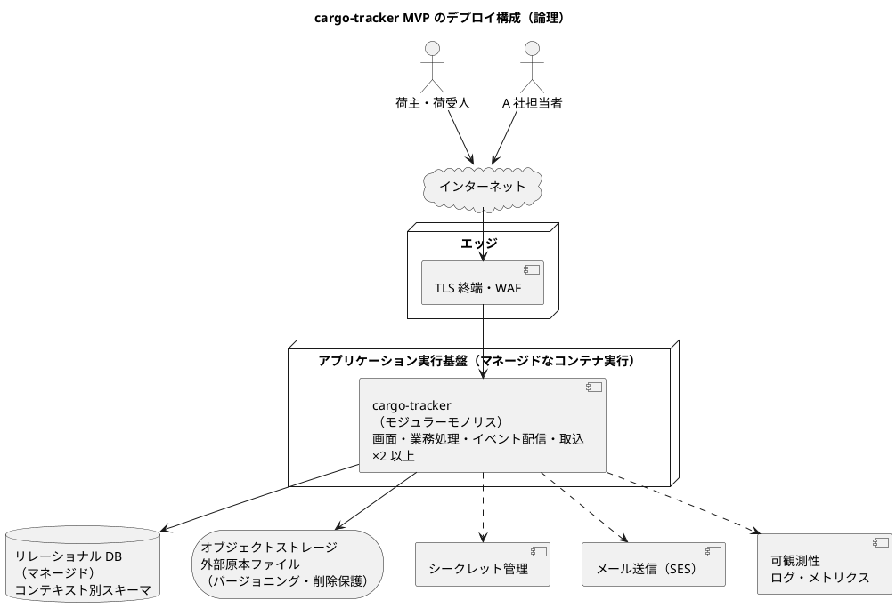
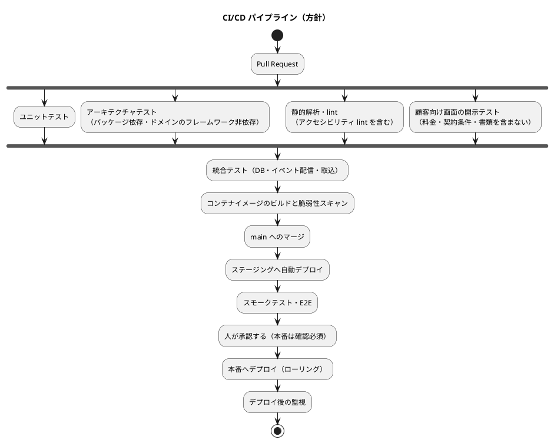

# cargo-tracker インフラストラクチャアーキテクチャ

## 位置づけ

本書は、[バックエンドアーキテクチャ](architecture_backend.md) と [フロントエンドアーキテクチャ](architecture_frontend.md) を動かす基盤の方針を決める。デプロイと運用準備の要求は開発ガイドライン [第 3 章](../../article/03-spring-modular-monolith.md) の Deployment Patterns・Readiness Patterns に合わせる。クラウド事業者・製品は技術スタック選定（後続工程）で決め、可用性・性能・RPO/RTO などの数値は非機能要件（後続工程）で決める。本書は数値に依存しない構造だけを扱う。

## 設計の前提

| 前提 | 根拠 | 影響 |
| :--- | :--- | :--- |
| パイロットの利用者は限定航路の荷主と A 社の担当者に限られる | 要件定義「優先顧客と MVP パイロット境界」 | 大規模な水平分散は不要。単純な構成から始める |
| 外部 API に接続しない | BR-18、OQ-05 | 外部向けの受信口（webhook など）を MVP では設けない |
| 権限外開示・外部原本消失が 1 件でもあれば中止 | PV-01 | 通信・保存の暗号化、原本の消失防止、監査証跡の改ざん防止を基盤でも担保する |
| 開発基盤は Docker・Docker Compose、Nix flake、GitHub Actions | AGENTS.md | ステージングから本番まで同じコンテナイメージを使う。ローカルは開発体験を優先し、コンテナなしでも起動できるようにする（ADR-007） |

## デプロイ形態

ADR-001 のモジュラーモノリスに合わせ、**全コンテキストを 1 つのアプリケーションとして起動する**（第 3 章 Single Deployment Unit）。画面もこのアプリケーションがサーバーサイドで描画するため（ADR-005）、フロントエンドを別に配信しない。

| 構成要素 | 方針 | 理由 |
| :--- | :--- | :--- |
| アプリケーション | 1 つのコンテナイメージを 2 つ以上のインスタンスで動かす。session 以外の状態を持たせず、session は共有ストアに置く | 1 インスタンスの障害やデプロイ中も受付を止めない |
| イベント配信・サガの再試行 | アプリケーションの中で動かす。未完了の配信と再試行は、複数インスタンスで二重に処理しないよう DB のロックで 1 インスタンスに限る | 第 3 章のとおりプロセス内で完結させ、別プロセスを増やさない |
| データベース | マネージドなリレーショナル DB 1 つ。コンテキストごとにスキーマを分け、アプリケーションの DB 利用者は 1 つにする。追記専用の表からは UPDATE・DELETE の権限を外す | ADR-001。スキーマ境界は SQL の静的検査で守る |
| オブジェクトストレージ | 取り込んだ外部原本ファイルを保存する。バージョニングと削除保護を有効にする | BR-12、PV-01 の外部原本消失 0 件 |

マイクロサービス、コンテナオーケストレーターの自前運用、サーバーレスは採用しない。理由は ADR-001 に記録した。

## 環境構成

| 環境 | 用途 | 構成 | データ |
| :--- | :--- | :--- | :--- |
| ローカル | 開発 | アプリケーションを H2（インメモリ）で起動し、外部原本はローカルのファイルシステムに保存する。統合テストと E2E は Testcontainers の PostgreSQL で行う（ADR-007） | テスト用データ |
| デモ | 関係者が触って確かめる（ADR-013）。ステージング・本番ではなく、非機能要件の対象にしない | Heroku の Eco dyno 1 つで dev プロファイルのまま動かす（H2 のインメモリ、書類は dyno の一時的なファイルシステム）。アクセスの制限はしない | 開発用の利用者と架空のデータだけ。再起動で初期状態に戻る |
| ステージング | 受入テスト、Golden dataset による検証、リリース前確認 | 本番と同じ構成を小さい規模で | 匿名化または合成したデータ。本番の個人・取引情報を持ち込まない |
| 本番 | パイロット運用 | 上記デプロイ構成 | 本番データ |

本番への操作（デプロイ、DB 接続、バックアップ・リストア）は運用手順書に定義したタスクだけで行う（CLAUDE.md「環境操作は運用手順書に従う」）。手順書は運用要件の工程と `operating-*` スキルで作る。

## コンテナ化

- 成果物は実行可能な単一のアプリケーションとし、それをコンテナイメージにする（第 3 章 Executable JAR、Container Image）。
- イメージは CI でビルドし、同じイメージをステージング・本番へ昇格させる。環境ごとに作り直さない。
- 環境差は設定プロファイルで吸収し、秘密情報は環境変数とシークレット管理から読み込む。イメージに埋め込まない（第 3 章 Externalized Configuration）。
- 開発専用の依存（組込み DB、開発用ツール）は本番の成果物に含めない（第 3 章 成果物の切り分け）。

## データ保護

| 対象 | 方針 | 関連 |
| :--- | :--- | :--- |
| 通信 | 外部との通信は TLS。内部の DB 接続も暗号化する | NFR-PRIVACY-01 |
| 保存 | DB、オブジェクトストレージ、バックアップを暗号化する | NFR-PRIVACY-01 |
| 監査証跡 | アプリケーションの DB 利用者には追記権限だけを与える。定期的に別の保存先へ書き出し、改ざんを検知できるようにする | NFR-AUDIT-01 |
| 外部原本 | バージョニングと削除保護。保持期間中は削除できない設定にする | BR-12、PV-01 |
| シークレット | シークレット管理に置き、ローテーションできるようにする。リポジトリに置かない | NFR-AUTH-01 |
| バックアップ | DB の時点復旧（PITR）を有効にする。RPO/RTO の値はこれから決める | NFR-RECOVERY-01 |

## 可観測性

| 種類 | 方針 |
| :--- | :--- |
| ヘルスチェック | 稼働確認の端点だけを認証なしで公開する。その他の運用端点は認証を必須にする（第 3 章 Actuator） |
| ログ | 構造化ログ（JSON）にし、要求 ID・commandId・コンテキスト名を必ず付ける。個人情報・password・TOTP をログに出さない |
| メトリクス | 画面の応答時間とエラー率に加え、業務の健全性を測る指標を出す: 未完了のイベント配信の件数と滞留時間、「処理中」のまま止まっているサガの数、「有人確認要」の件数、隔離中の外部原本の件数、鮮度を超えた追跡の件数。第 3 章が「結果整合の取りこぼしを数える唯一の手段」とする点に当たる |
| トレース | 1 プロセスのため分散トレースは MVP では導入しない。要求 ID と commandId をログとイベントに引き継いで追跡する（第 3 章 Distributed Tracing は分散構成で検討） |
| アラート | 上の業務指標の閾値を超えたら担当者へ通知する。閾値は非機能要件・運用要件で決める |

監査証跡（業務上の誰が・いつ・何を）と運用ログ（システムの動作）は目的が違うため、別々に保存する。

## CI/CD

- CI/CD は GitHub Actions で構築する（AGENTS.md）。
- DB のマイグレーションはマイグレーションツールで版管理する（第 3 章 Database Migration）。前のバージョンのアプリと互換のある変更（追加 → 移行 → 削除の段階分け）にし、ローリングデプロイ中も動くようにする。
- 本番へのデプロイは人の承認を必須にする（開発ガイド AI-DLC 版「本番環境に関わる操作はすべて確認必須」）。
- デモ環境（Heroku、ADR-013）は、develop の cargo-tracker CI の check・ui が緑になった後に、`deploy-demo` ジョブが自動で配備する（Bolt 16）。人の承認は要らない（ステージング・本番ではなく、非機能要件の対象にしない）。Heroku の API キーは GitHub の Environment `demo`（develop だけ）に置く。
- W10 のステージング・本番の配備では、配備をワークフローの取り消しから切り離した専用のワークフロー（または reusable workflow）にし、イメージ（`runtime` のステージ）を 1 回だけビルドして digest をステージング・本番へ昇格させる。環境ごとに `environment`（本番は必須のレビュアー）と、ジョブに限った `id-token: write`（OIDC）を置く（Bolt 16 レビュー R-11）。

## Infrastructure as Code

インフラは Terraform でコード化する（`operating-provision` スキルの前提）。クラウド事業者が決まった後に、環境ごとの構成を IaC で作る。手作業でコンソールから変更しない。

## 後続工程への引継ぎ

| ID | 引継ぎ内容 | 引継ぎ先 |
| :--- | :--- | :--- |
| AI-01 | クラウド事業者、コンテナ実行サービス、DB・オブジェクトストレージ・シークレット管理・session ストア・可観測性の製品 | 技術スタック選定 |
| AI-02 | 稼働時間・計画停止・SLA、RPO/RTO、性能、データ保持期間、データの所在地（越境） | 非機能要件 |
| AI-03 | 監視項目の閾値、アラートの通知先、障害時の手順、バックアップ・リストアの手順 | 運用要件 |
| AI-04 | 環境構築とパイプラインの実装 | `operating-setup`、`operating-provision`、`operating-cicd` |

## AI の仮定と要確認

- 本プロジェクトのテンプレート（`docs/template/`）に AWS の環境セットアップ手順書があるため、クラウドは AWS が第一候補になると見込んでいる。決定は技術スタック選定で行う。
- 荷主はアジア・欧州にいるため、データの所在地と越境移転（NFR-PRIVACY-01）がリージョン選定の制約になる可能性がある。非機能要件で確認する。
