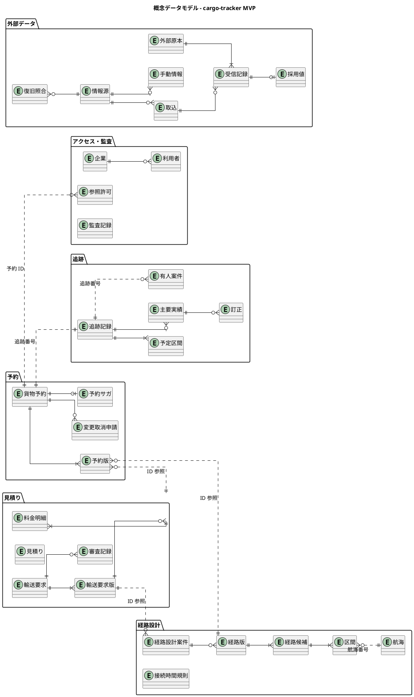
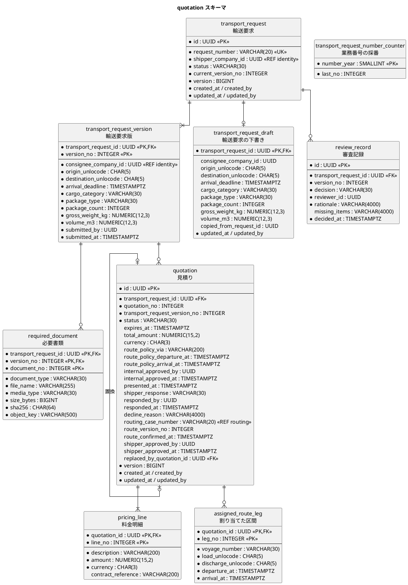
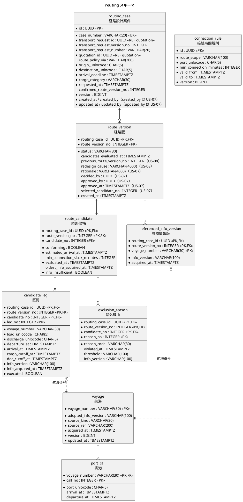
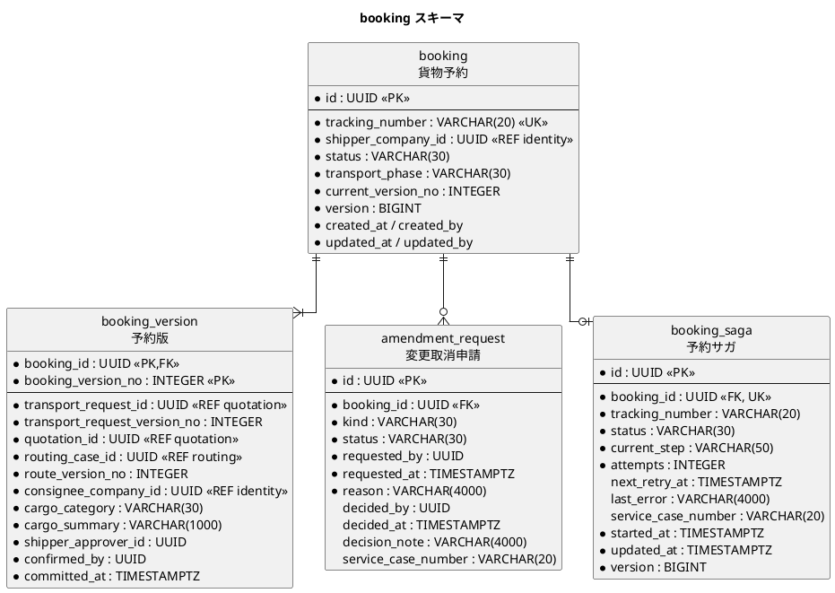
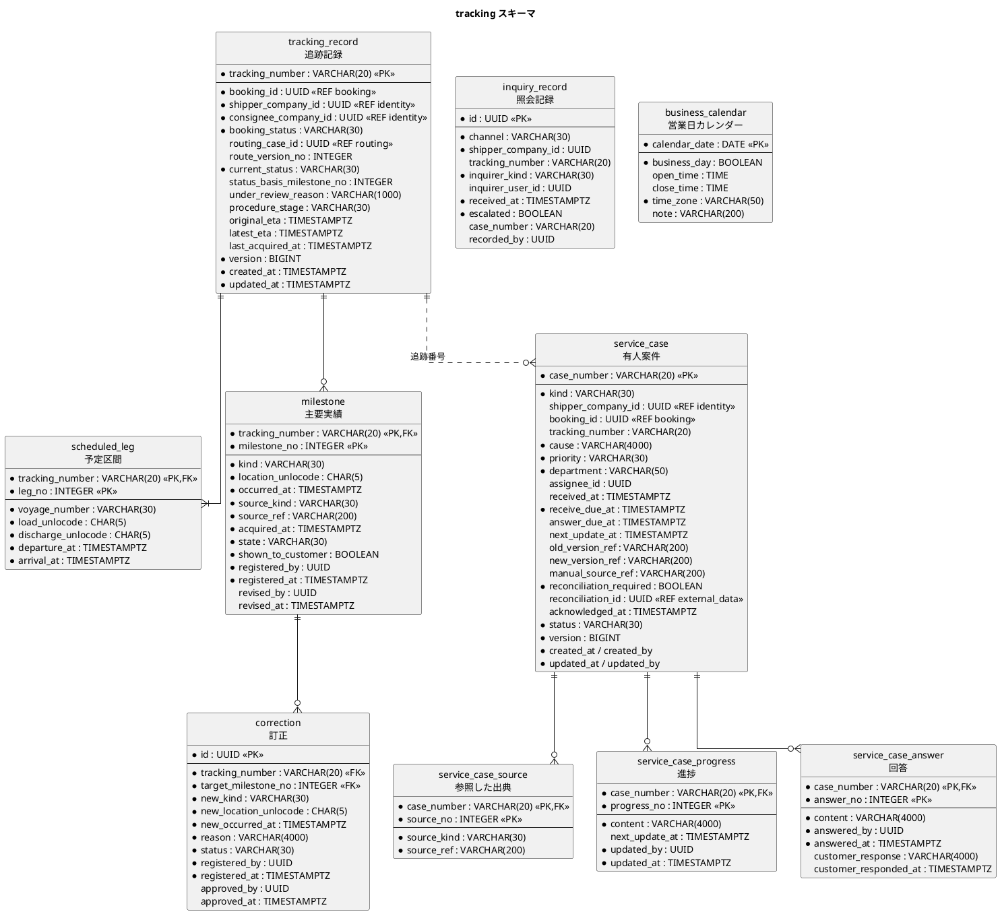
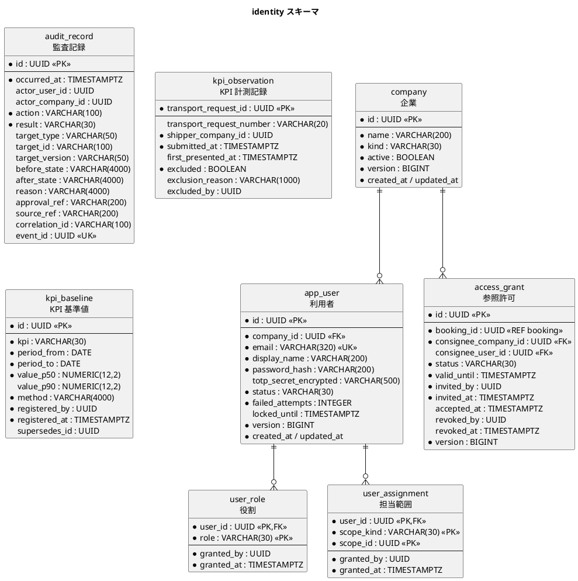
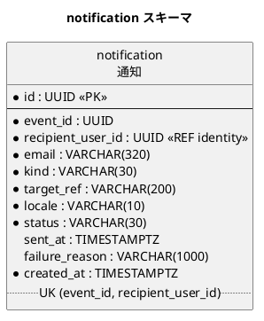
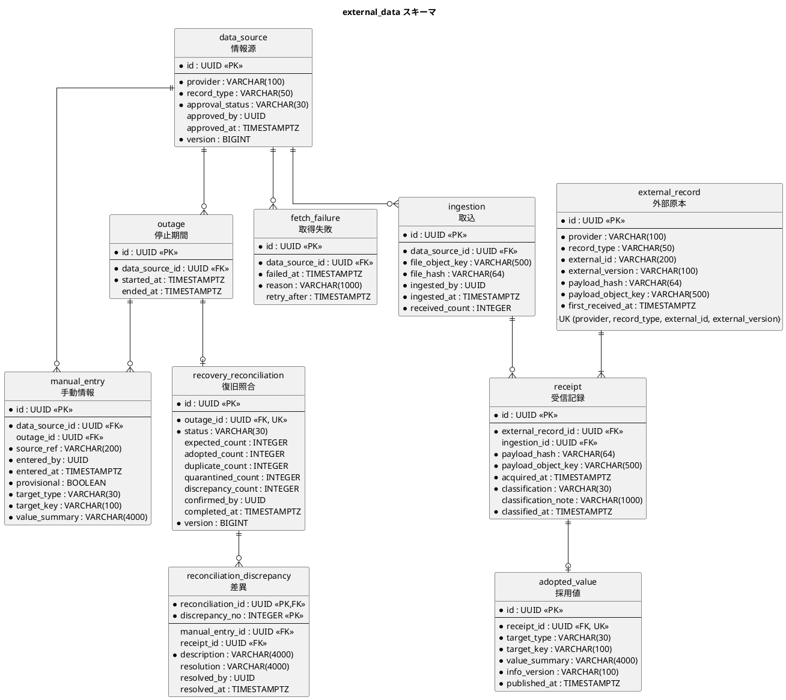

# cargo-tracker データモデル

## 位置づけ

本書は、[ドメインモデル](domain_model.md) の集約を永続化する構造を決める（ドメインモデルの引継ぎ DM-01）。前提は次のとおり。

| 前提 | 出典 | データモデルへの影響 |
| :--- | :--- | :--- |
| DB は 1 つ、コンテキストごとにスキーマを分ける | ADR-001 | 7 つの業務スキーマと、基盤用のスキーマを置く |
| 集約は状態保存。版は不変、追跡の主要実績と監査記録は追記専用 | ADR-002 | 版はヘッダ・明細の形で別の行にする。追記専用の表には削除の権限を与えない |
| 冪等コマンド、永続化したドメインイベント、予約サガ | ADR-003 | 処理済みコマンド、イベント発行記録、サガ状態の表を持つ |
| 外部原本は Inbox・隔離・照合 | ADR-004 | 原本は S3 に置き、DB には冪等性キーとハッシュと分類を持つ |
| 開発は H2、本番は PostgreSQL 18、永続化は MyBatis、スキーマは Flyway | ADR-007 | DDL は H2 と PostgreSQL の共通部分で書く |

## 概念データモデル

業務の言葉で、管理する対象と関係を示す。コンテキストの境界をまたぐ関係は、ID による参照だけで表す（外部キーを張らない）。



## スキーマ

| スキーマ | 所有するコンテキスト | 内容 |
| :--- | :--- | :--- |
| `quotation` | 見積り | 輸送要求、輸送要求の下書き、輸送要求版、必要書類、審査記録、見積り、料金明細、処理済みコマンド |
| `routing` | 経路設計 | 経路設計案件、経路版、経路候補、区間、除外理由、参照情報版、航海、寄港、接続時間規則、処理済みコマンド |
| `booking` | 予約 | 貨物予約、予約版、変更取消申請、予約サガ、処理済みコマンド |
| `tracking` | 追跡 | 追跡記録、予定区間、主要実績、訂正、有人案件とその進捗・回答、照会記録、営業日カレンダー、処理済みコマンド |
| `identity` | アクセス・監査 | 企業、利用者、役割、担当範囲、参照許可、監査記録、KPI 計測記録、KPI 基準値 |
| `external_data` | 外部データ | 情報源、取込、外部原本、受信記録、採用値、手動情報、停止期間、復旧照合、差異 |
| `notification` | 通知 | 通知（送信の記録） |
| `platform` | 基盤（コンテキストに属さない） | Spring Modulith のイベント発行記録、Spring Session の表、ShedLock の表 |

`platform` スキーマはフレームワークが定める表だけを置き、業務の表を置かない。イベント発行記録はすべてのコンテキストが書き込むが、内容はフレームワークが管理し、業務のコードは直接読み書きしない。

## 命名と型の規約

ADR-007 により、DDL は H2（PostgreSQL 互換モード）と PostgreSQL 18 の両方で動く範囲で書く。

| 項目 | 規約 | 理由 |
| :--- | :--- | :--- |
| 物理名 | 英語の snake_case。表と列の日本語名は本書と DDL のコメントに書く | ドメインモデルの英語名（コード名）と揃え、H2 と PostgreSQL の両方で引用符なしで扱えるようにする |
| 主キー | 集約ルートはアプリケーションが発行する UUID（`UUID` 型）。業務キーがあるもの（航海番号、追跡番号、受付番号）は業務キーを主キーにする | 第 2 章「集約識別子はビジネスキーを使う」。DB の採番機能（シーケンスの方言差）に依存しない |
| 子の表の主キー | 親の主キー + 連番の複合主キー（例: 輸送要求 ID + 版番号） | 版・明細は親の中での順序に意味がある（ガイドのヘッダ・明細パターン） |
| 時刻 | `TIMESTAMP WITH TIME ZONE`。値は UTC で保存する | BR-10。`TIMESTAMPTZ` の略記は H2 で使えないため、DDL では正式名で書く |
| 文字列 | `VARCHAR(n)`。長い自由記述は `VARCHAR(4000)` | `TEXT` は H2 では CLOB になり、比較や索引の扱いが PostgreSQL と変わる |
| 金額 | `NUMERIC(15,2)` と通貨コード `CHAR(3)` | 浮動小数を使わない |
| 区分値 | `VARCHAR(30)` に英語の定数名（例: `UNDER_REVIEW`）を入れ、`CHECK` 制約で値を限る | 列挙型（`CREATE TYPE`）は H2 と PostgreSQL で構文が違う |
| 真偽 | `BOOLEAN` | 両方で使える |
| 使わないもの | `JSONB`、部分インデックス、`CREATE TYPE`、シーケンスの方言、トリガー | H2 で動かない。必要になったら ADR-007 に従って別の ADR で判断する |
| 楽観ロック | 集約ルートの表に `version BIGINT NOT NULL` を置き、`UPDATE ... SET ..., version = version + 1 WHERE id = ? AND version = ?` で更新する。更新が 0 件なら、ほかの更新が先に入ったとして失敗させる（Bolt 5 の輸送要求の状態の更新で使い始める） | ARCH-HO-01 の期待版の照合 |
| 監査用の列 | 集約ルートの表に `created_at`、`created_by`、`updated_at`、`updated_by` を置く | ガイドの共通設計原則。業務上の証跡は監査記録が持つ |

## 版・追記専用・冪等性の表し方

### 版（ADR-002）

版を持つ集約は、ヘッダ（集約ルート）と版の表に分ける。

| 表 | 役割 | 更新 |
| :--- | :--- | :--- |
| ヘッダ（例: `transport_request`） | 現在の状態、現在の版番号、楽観ロックの `version` | 状態の変化のたびに UPDATE する |
| 版（例: `transport_request_version`） | 版ごとの内容。主キーは（ヘッダ ID、版番号） | INSERT だけ。作った版の行は更新しない |

集約の楽観ロック（`version`）と業務上の版番号（`*_version_no`）は別の列にする。前者は同時更新の検出、後者は業務が参照する版である。

### 追記専用

| 表 | 許す操作 | 守り方 |
| :--- | :--- | :--- |
| `identity.audit_record`、`identity.kpi_baseline` | INSERT、SELECT | PostgreSQL ではアプリケーションの DB 利用者から UPDATE・DELETE の権限を外す |
| `quotation.transport_request_version`、`quotation.review_record`、`quotation.required_document`、`booking.booking_version`、`external_data.receipt` | INSERT、SELECT | UPDATE・DELETE の権限を外す（`review_record` は判断の事実で後から変えないため。2026-10-02 に承認、Bolt 5。`required_document` は版に付く書類の事実のため。2026-10-03 に承認、Bolt 7） |
| `tracking.milestone` | INSERT、SELECT、状態と下書き内容の UPDATE | DELETE の権限を外す。採用済みの内容を変えないことはドメインと PostgreSQL の統合テストで確かめる（T-INV-01、T-INV-07） |
| `routing.route_version` | INSERT、SELECT、UPDATE | 状態が変わる（確定 → 再設計要 → 旧版）ため権限では守らない。確定した経路版の内容（候補・区間・判断根拠・承認）を変えないことは、ドメインと PostgreSQL の統合テストで確かめる（R-INV-06） |

輸送要求の下書きは、版の表とは別の `transport_request_draft` に置く（下書きは何度も更新するため）。提出したときに、下書きの内容を `transport_request_version` に新しい版として INSERT する。これにより版の表は INSERT だけになる（Q-INV-03）。

権限の付与と剥奪は、PostgreSQL 用の Flyway のコールバック（`afterMigrate`）で、表の作成と同じ配備の中で行う（ADR-007 の補足の決定）。開発の H2 では権限による保護は働かない。保護は PostgreSQL の統合テストで確かめ、Testcontainers でも同じコールバックが動く。

### 業務番号の採番（D-10）

業務番号は、年ごとのカウンター表 `transport_request_number_counter` で振る。H2 と PostgreSQL の共通の SQL で書き（ADR-007）、方言で分けない。

1. その年の行がなければ、提出とは別のトランザクションで `INSERT`（`last_no = 0`）する。同時の `INSERT` による一意制約の違反は、行がすでにあるという意味なので無視する。PostgreSQL では、トランザクションの中で制約に違反するとそのトランザクションが使えなくなるため、提出のトランザクションの中では `INSERT` しない。
2. 提出のトランザクションで `UPDATE transport_request_number_counter SET last_no = last_no + 1 WHERE number_year = ?` を実行し、その年の行を行ロックして増やす。
3. 同じトランザクションで `SELECT last_no` を実行して番号を読む。

年の行は、アプリケーションの起動時に今年と来年（日本時間）の分を提出のトランザクションの外で用意する（2026-10-02 の D-13）。手順 1 の別のトランザクションは外側の接続を握ったまま 2 本目の接続を取るため、年の最初の提出が接続のプールの大きさ以上に同時に来ると枯渇しうる。手順 1 は、年をまたいで動き続けた場合の予備として残す。

採番は提出と同じトランザクションで行う。提出が失敗すれば番号も戻るため、欠番が出ない（`last_no = 0` の行は番号を使わない）。手順 1 の後の UPDATE が行を見つけられるのは、分離レベルが READ COMMITTED だからである。行ロックは提出のトランザクションの終わりまで続くので、同じ年の提出は採番の部分で直列になる。年は、提出時刻の日本時間（Asia/Tokyo）の年をドメインが決めて渡す。

### 冪等性（ARCH-HO-01）

各業務スキーマに処理済みコマンドの表を置く。

```text
<schema>.processed_command
  command_id      UUID          PK
  command_type    VARCHAR(100)  NOT NULL
  payload_hash    VARCHAR(64)   NOT NULL   -- 同じ command_id で内容が違えば衝突として拒否する
  result_ref      VARCHAR(200)              -- 例: 予約 ID と追跡番号
  processed_at    TIMESTAMP WITH TIME ZONE NOT NULL
```

コマンドの処理と同じトランザクションで INSERT する。主キーの一意制約により、同時に送られた同じコマンドの片方は失敗し、既存の結果を返す。

## 論理データモデル

列の表記は「物理名（日本語名）: 型」。`*` は NOT NULL、`PK` は主キー、`FK` は同じスキーマ内の外部キー、`UK` は一意制約、`REF` は他スキーマへの ID 参照（外部キーを張らない）を表す。

### 見積り（`quotation`）



| 表 | 主な制約 | 対応する不変条件 |
| :--- | :--- | :--- |
| `transport_request` | `status` IN（`DRAFT`、`UNDER_REVIEW`、`QUOTING`、`QUOTED`、`ROUTING`、`AWAITING_APPROVAL`、`READY_TO_BOOK`、`BOOKED`、`WITHDRAWN`）。Bolt 20 で荷主承認待ち（`AWAITING_APPROVAL`）と予約待ち（`READY_TO_BOOK`）を使い始める（CHECK には初めからある） | 輸送要求の状態遷移 |
| `transport_request`（業務番号） | `request_number` に一意制約（`uk_transport_request_number`）。`TR-年-年ごとの連番` の表記をそのまま入れる。画面と通知には業務番号だけを出す（D-4、D-10） | Q-INV-13 |
| `transport_request_number_counter` | 年ごとに 1 行。`number_year` は業務番号の年（`year` は H2 の予約語のため使わない）。`last_no` はその年に最後に振った連番。追記専用ではない（行を更新する） | Q-INV-13 |
| `transport_request_draft` | 輸送要求ごとに 1 行。提出時に内容を版の表へ INSERT する。`copied_from_request_id` は複製元 | Q-INV-03、Q-INV-11 |
| `transport_request_version` | `cargo_category` IN（`GENERAL`、`DANGEROUS`、`REEFER`、`OTHER_SPECIAL`）。提出した版だけを INSERT し、更新しない（追記専用の印 `COMMENT ON TABLE ... IS '輸送要求版 [append-only]'` を付ける）。版 1 の `submitted_at` が KPI-01 の開始時刻（D-3） | Q-INV-02、Q-INV-03、US-21 |
| `review_record` | （`transport_request_id`、`version_no`）→ `transport_request_version` の FK。（`transport_request_id`、`version_no`）に一意制約（1 つの版に判断は 1 つ。差し戻すと新しい版ができるため。Bolt 5 レビュー R-02）。`decision` IN（`APPROVED`、`SENT_BACK`）。`rationale` は確定の根拠と差戻しの理由の両方を入れる（判断で読み分ける）。追記専用の印を付ける | Q-INV-04、Q-INV-14 |
| `required_document` | 主キー（`transport_request_id`、`version_no`、`document_no`）。（`transport_request_id`、`version_no`）→ `transport_request_version` の FK。`document_type` IN（`COMMERCIAL_INVOICE`、`PACKING_LIST`、`OTHER`）。`media_type` IN（`PDF`、`PNG`、`JPEG`）。`size_bytes` は 1 以上 10,485,760 以下。`sha256` は中身の SHA-256 の 16 進 64 文字。`file_name` は画面に出すだけに使い、`object_key` は `quotation/{輸送要求 ID}/{UUID}`（ファイル名を使わない）。出し直しでは、引き継ぐ書類は前の版の行と同じ `object_key` で新しい版に INSERT し（ファイルを複製しない）、差し替えた種類は新しい `object_key` の行にする。前の版の行は変えない。新しい版の `document_no` は 1 から振り直す。行は新しい版を作るとき（提出・出し直し）だけ INSERT し、審査の確定・差戻しの保存では書かない（2026-10-05 の D-25。Bolt 9。Bolt 6〜8 レビュー R-07）。追記専用の印を付ける（2026-10-03 に承認、Bolt 7） | Q-INV-16、US-01 |
| `quotation` | UK（`transport_request_id`、`quotation_no`）。`quotation_no` は輸送要求の中で 1 から振り、画面と URL に出す（内部の ID を出さない。Bolt 10）。`expires_at`・`total_amount`・`currency`・`route_policy_via`・`route_policy_departure_at`・`route_policy_arrival_at` は作成中（`DRAFT`）の見積りを保存するため NULL を許し、承認待ち以後は NOT NULL を CHECK で守る。`currency` IN（`USD`、`EUR`、`JPY`）。`route_policy_via` は UN/LOCODE のカンマ区切り（0〜5 件、空は経由地なし）。`status` IN（`DRAFT`、`PENDING_APPROVAL`、`PRESENTED`、`ROUTING_REQUESTED`、`AWAITING_SHIPPER_APPROVAL`、`APPROVED`、`EXPIRED`、`REPLACED`）。Bolt 10 は `DRAFT`・`PENDING_APPROVAL`・`PRESENTED` の値と、提示までに使う列だけで表を作り、ほかの値と列（荷主の回答・経路版・荷主承認・置換）は使う Bolt で足す（2026-10-05 の決定）。Bolt 10 の画面は作成と算出を 1 つの操作にしているため、作成中（`DRAFT`）の見積りはまだ表に入らない（入力に誤りがあれば見積りを保存しない）。作成中を保存するのは、作成中のまま保存する操作か、承認待ちからの差戻しを入れる Bolt から（Bolt 9・10 レビュー R-15）。Bolt 11 で `status` に `EXPIRED`・`REPLACED` を足し、`replaced_by_quotation_id`（`quotation.id` への FK、NULL 可。再見積りは旧版を先に更新し新しい見積りを後に保存するため、PostgreSQL では `DEFERRABLE INITIALLY DEFERRED` でコミットの時に確かめる。H2 は遅延の FK を作れないため置かない）と `ck_quotation_replaced`（置換済みのときだけ値を持つ: `(status = 'REPLACED') = (replaced_by_quotation_id IS NOT NULL)`）を足す。Q-INV-18 は PostgreSQL の部分一意インデックス `ux_quotation_active`（`transport_request_id`、`status` IN（`DRAFT`、`PENDING_APPROVAL`、`PRESENTED`））でも守り、違反は「見積りがすでにある」として値で返す。H2 は部分インデックスを作れないため、このインデックスと置換先の FK は `postgresql` のマイグレーション（`V20261005170100`）だけに置く（`event_publication` と同じく DB ごとのフォルダ）。`internal_approved_at` と `presented_at` は、社内承認して提示するが 1 つの操作なので同じ値（Bolt 9・10 レビュー R-14。COMMENT にも書いた）。失効・置換の時刻の列は作らない（監査記録は US-17）（2026-10-05 の決定）。マイグレーション `V20261005130000__create_quotation.sql` は、（`transport_request_id`、`transport_request_version_no`）→ `transport_request_version` の FK、承認待ち以後の必須（`ck_quotation_calculated`）、提示済みの承認者と提示時刻（`ck_quotation_presented`）、到着は出発より後の CHECK を持つ。ER 図の `created_at`・`updated_at` などの監査の列は、ほかの業務の表と同じく作っていない（監査記録は US-17 で決める）`shipper_response` IN（`PROCEED`、`DECLINED`）。`presented_at` は KPI-01 の終了時刻。Bolt 12 で `status` に `ROUTING_REQUESTED` を、荷主の回答の `shipper_response`（CHECK IN（`PROCEED`）。`DECLINED` は辞退（US-24 AC2）で足す）・`responded_by`・`responded_at` を足す。回答の 3 列はそろって NULL かそろって値を持ち、`ROUTING_REQUESTED` なら値を持つ（`ck_quotation_responded`）。`ux_quotation_active` は `ROUTING_REQUESTED` も数えるよう作り直す（2026-10-06 の決定）。`decline_reason` は辞退（US-24 AC2）で足す。Bolt 20（US-24 AC4・AC5）で `status` の `AWAITING_SHIPPER_APPROVAL`・`APPROVED` を使い始め、経路版の参照 `routing_case_number`（案件番号。画面と URL に内部の ID を出さないため、ER 図の当初の `routing_case_id` を案件番号に変えた。D-4）・`route_version_no`・`route_confirmed_at`（確定の時刻の写し）と、荷主承認の `shipper_approved_by`・`shipper_approved_at` を足す。経路版の参照の 3 列はそろって NULL かそろって値を持ち、荷主承認待ち・承認済みなら値を持つ（`ck_quotation_route_assigned`）。荷主承認の 2 列はそろって NULL かそろって値を持ち、承認済みなら値を持つ（`ck_quotation_shipper_approved`）。経路設計の表に外部キーは張らない（スキーマの所有。ADR-001）。割り当てた経路の区間は `assigned_route_leg`（見積り ID と区間番号 1 から。到着は出発より後）に写し、荷主の承認の画面（C-17）は経路設計に問い合わせない（ADR-014）。`ux_quotation_active` は `AWAITING_SHIPPER_APPROVAL`・`APPROVED` も数えるよう作り直す（マイグレーション `V20261008100000`・`V20261008100100`）。割り当てた区間は割当ての後に変えないため、リポジトリはまだ書いていないときだけ書く | Q-INV-05〜10、US-21 |
| `pricing_line` | 主キー（`quotation_id`、`line_no`）。`line_no` は 1〜10。`amount` は 0 より大きい（NUMERIC(15,2)）。`currency` は見積りの `currency` と同じ値（アプリケーションで守る）。見積りを算出し直すときは明細を入れ替える（Bolt 10 は算出し直しを入れない） | Q-INV-17、US-03 |

見積りの「失効」は、有効期限を過ぎたときに状態を書き換えるのではなく、判定時刻と `expires_at` の比較で決める（Q-INV-06）。`status` の `EXPIRED` は、期限切れを確かめた結果として残す。Bolt 11 では、再見積りのときに有効期限を過ぎていた旧版にだけ記録する（定期処理での記録は入れない。2026-10-05 の決定）。予約確定の判定は常に `expires_at` で行う。

### 経路設計（`routing`）



| 表 | 主な制約 | 対応する不変条件 |
| :--- | :--- | :--- |
| `routing_case` | UK（`transport_request_id`、`transport_request_version_no`）で、詳細経路設計の依頼（DE-16）が再配信されても案件を重複させない。`confirmed_route_version_no` は確定した経路版の番号を 1 つだけ持つ（NULL は未確定） | R-INV-05、R-INV-10 |
| `route_version` | `status` IN（`DRAFT`、`CANDIDATES_PRESENTED`、`EXPERT_REVIEW`、`CONFIRMED`、`REDESIGN_REQUIRED`、`SUPERSEDED`）。確定時は `approved_by`・`approved_at`・`rationale` が NOT NULL（アプリケーションで検証） | R-INV-03、R-INV-04、R-INV-06 |
| `exclusion_reason` | `reason_code` IN（`DEADLINE_EXCEEDED`、`CONNECTION_TOO_SHORT`、`CARGO_NOT_SUPPORTED`、`NOT_CONNECTABLE`、`INFO_INSUFFICIENT`） | R-INV-02 |
| `referenced_info_version` | 確定時に参照した航海ごとの情報版。承認時の再検証と、確定後の再評価に使う | R-INV-03、R-INV-07 |
| `candidate_leg` | `executed` は再設計の対象から外す区間を示す | R-INV-08 |

「確定は案件に 1 つ」は PostgreSQL の部分一意インデックスで表せるが、H2 で使えないため、案件のヘッダに `confirmed_route_version_no` を 1 つだけ持つことで表す（命名と型の規約）。

Bolt 17（US-06 AC1〜AC3）で作る範囲（[Bolt 17 計画](../../development/cargo-tracker/bolt_17_plan.md) の確認ポイント 4〜7）:

- `routing` スキーマに、`routing_case`・`route_version`・`route_candidate`・`candidate_leg`・`exclusion_reason`・`voyage`・`port_call`・`connection_rule` と、案件番号の採番の `routing_case_number_counter`（年ごとに 1 行。`quotation.transport_request_number_counter` と同じ形）を作る。`route_version` の判断・承認の列（`rationale`、`decided_by`、`approved_by`、`approved_at`、`selected_candidate_no`）、再設計の列（`previous_route_version_no`、`redesign_cause`）と `referenced_info_version` は、使う Bolt（US-07・US-08）で足す。
- `routing_case.case_number` は案件番号（`RC-年-連番`。UK）。画面と URL には案件番号だけを出す（D-4）。
- 実装で足した列（Bolt 17 のステップ 3）: `routing_case.transport_request_number`（業務番号の写し。S-05 で見積依頼を示す）、`routing_case.requested_at`（詳細経路設計の依頼時刻。S-05 の並びと案件番号の年）、`route_version.candidates_evaluated_at`（候補の判定時刻。候補が 0 件でも算出したことを残す）、`candidate_leg.info_version`・`info_acquired_at`（区間を取った航海の採用情報版と取得時刻。理由の参照情報版と情報鮮度に使う）。`routing_case` の `created_by`・`updated_by` は、操作者を残す Bolt（US-07 の確定）で足す。`route_candidate.candidate_no` は 1〜20（候補の上限）、`voyage.source_kind` は出典の種類の 4 値を CHECK で守る。
- `route_candidate.min_connection_slack_minutes` は候補の接続余裕（接続時間 − 必要最小接続時間の最小。分）。直行は NULL。`info_insufficient` は AC4（W6）まで常に false。
- 候補を再算出したら、経路版の候補・区間・除外理由を消して入れ直す（候補は追記専用ではない）。確定した経路版の候補は書き換えない（Bolt 19）。
- Bolt 19（US-07 AC1・AC2）で足す列: `route_version` の `candidates_found`（見つけた候補の数。上限で示さなかった候補の数を常に示す。Bolt 17 レビュー D-64。既存の行は示した候補の数で埋める）、`selected_candidate_no`・`rationale`（VARCHAR(4000)）・`approved_by`・`approved_at`。4 列はそろって NULL かそろって値を持ち、確定では値を持ち、作成中・候補提示済み・要専門家判断では持たない（再設計要・旧版は確定の後の状態なので持てる）（CHECK `ck_route_version_confirmed`）。確定すると `routing_case.confirmed_route_version_no` に経路版番号を入れる。`routing_case` の `quotation_expires_at`（DE-16 の見積有効期限。S-05 の並び）・`created_by`（行を作った操作者ではなく、DE-16 の依頼者の荷主担当者。行はイベントの購読が作る）・`updated_by`（最後に算出・確定した経路設計者）。Bolt 17 で作った行のために NULL を許す（デモ環境のサンプルの案件は `db/dev-data` で依頼元の見積りから写す）。S-05 は最新の経路版の状態を示し、見積有効期限の近い順（NULL は後ろ）、同じなら依頼の古い順に並べる。確定した経路版の行は、`updateRouteVersion` の条件（作成中・候補提示済みだけ）で書き直さない。参照情報版は `candidate_leg.info_version` から読み、写しの列は作らない。開発レビューの後に外部キーを 2 本足した（`V20261007140000`）。`routing_case`（`id`、`confirmed_route_version_no`）→ `route_version`、`route_version`（`routing_case_id`、`route_version_no`、`selected_candidate_no`）→ `route_candidate`（確定した候補を消せない）。「確定は案件に 1 つ」は H2 で部分一意インデックスを作れないため `confirmed_route_version_no` と集約の検証で守る。`decided_by`（専門判断）と再設計の列は使う Bolt で足す。
- 経路設計の表と見積りの表の間に外部キーは張らない（スキーマの所有。ADR-001）。輸送要求・見積りの ID は、見積りの公開 API とイベントから得た値の写し。
- 航海・寄港・接続時間規則は、外部原本の取込（US-14、W7）と規則の管理ができるまで、開発環境の `db/dev-data` にだけ入れる仮のデータ（出典 `MANUAL_ENTRY`、情報版 `PROVISIONAL-1`、架空の航海番号）。ステージング・本番では 0 件。

### 予約（`booking`）



| 表 | 主な制約 | 対応する不変条件 |
| :--- | :--- | :--- |
| `booking` | `tracking_number` は一意。`status` IN（`CONFIRMED`、`AMENDMENT_PENDING`、`CANCELLATION_PENDING`、`AMENDING`、`CANCELLED`、`IN_TRANSIT`、`COMPLETED`）。`transport_phase` IN（`BEFORE_PICKUP`、`AFTER_PICKUP`、`COMPLETED`） | B-INV-06、B-INV-07 |
| `booking_version` | 予約確定時の見積り・経路版・荷受人・貨物の写しと、確定者・commit 時刻。UK（`quotation_id`）で、1 つの見積りから 2 件目の予約を作れない（別のコマンド ID による同時確定でも片方が一意制約で失敗する） | B-INV-01、B-INV-08、B-INV-11 |
| `booking_saga` | 予約ごとに 1 つ。`status` IN（`IN_PROGRESS`、`COMPLETED`、`FAILED`、`NEEDS_HUMAN`） | ARCH-HO-02 |
| `processed_command` | 本予約確定のコマンド ID を記録し、再送には既存の予約 ID と追跡番号を返す | B-INV-03 |

`booking_version.cargo_summary` は予約確定時の貨物の写しで、見積りの内部情報（料金明細）は複製しない（units.md「見積り内部情報を予約へ複製しない」）。

### 追跡（`tracking`）



| 表 | 主な制約 | 対応する不変条件 |
| :--- | :--- | :--- |
| `tracking_record` | `current_status` は主要実績から導出した結果の保存（照会のため）。導出の正は集約のロジック。`original_eta`（確定した経路版の到着予定）と `latest_eta`（最新の見込み）を別に持つ。`procedure_stage` は通関等の手続き中の段階 | T-INV-08、T-INV-10 |
| `milestone` | UK（`tracking_number`、`source_kind`、`source_ref`）。`state` IN（`DRAFT`、`ADOPTED`、`UNDER_REVIEW`、`RETAINED_ONLY`）。DELETE の権限なし | T-INV-01〜03、T-INV-05 |
| `correction` | `status` IN（`PENDING_APPROVAL`、`APPLIED`、`REJECTED`）。`approved_by` は `registered_by` と異なる（`CHECK`） | T-INV-06 |
| `service_case` | `kind` IN（`CUSTOMER_INQUIRY`、`QUOTATION_CONSULTATION`、`AMENDMENT`、`REDESIGN`、`EXTERNAL_OUTAGE`、`REJECTED_MILESTONE`、`SAGA_FAILURE`）。`status` IN（`RECEIVED`、`ESCALATED`、`IN_PROGRESS`、`ANSWERED`、`CLOSED`、`DUPLICATE_CLOSED`）。`shipper_company_id` で荷主の照会範囲を限る。`acknowledged_at` は営業時間外の優先度高の自動受付の時刻 | SC-INV-01〜05 |
| `inquiry_record` | `channel` IN（`WEB_SELF`、`WEB_INQUIRY`、`PHONE`、`EMAIL`）。`inquirer_kind` IN（`SHIPPER`、`CONSIGNEE`）。`escalated` は有人対応へ移ったか | IR-INV-01〜02、KPI-02 |
| `business_calendar` | 日ごとの営業日・営業時間。年次で翌年分を登録する | SC-INV-04 |

`tracking_record.current_status` は導出結果を保存した非正規化である。照会（US-09）のたびに全実績から導出し直すのを避けるためで、集約を保存するときに必ず導出し直して書く。

`correction` の `CHECK (approved_by IS NULL OR approved_by <> registered_by)` は H2 と PostgreSQL の両方で使える。

### アクセス・監査（`identity`）



| 表 | 主な制約 | 対応する不変条件 |
| :--- | :--- | :--- |
| `user_role` | `role` IN（BR-15 の 8 役割）。システム管理者・監査担当者と業務の役割の併用は、アプリケーションで拒否する | IA-INV-01 |
| `user_assignment` | `scope_kind` IN（`COMPANY`、`BOOKING`） | IA-INV-02 |
| `app_user` | `failed_attempts` と `locked_until` で 5 回失敗・15 分ロックを表す | IA-INV-03 |
| `access_grant` | `status` IN（`INVITED`、`ACTIVE`、`REVOKED`、`EXPIRED`）。同じ予約・荷受人企業に有効な許可を重複させないことはアプリケーションで確認する | IA-INV-05、IA-INV-06 |
| `audit_record` | UPDATE・DELETE の権限なし。`event_id` の一意制約で、イベントの再配信による重複記録を防ぐ。認証の失敗と権限外のアクセス試行は `event_id` を持たず、同期で書く | IA-INV-07、IA-INV-08 |
| `kpi_observation` | 輸送要求ごとに 1 行。DE-01 で作り、DE-03 で最初の提示時刻だけを記録する（2 回目以降の提示では更新しない）。`transport_request_number` は DE-01 の表示用の業務番号の写しで、社内の一覧に UUID の代わりに出す（Bolt 4）。Bolt 4 より前の DE-01 は業務番号を持たないため null を許す | KPI-INV-01 |
| `kpi_baseline` | UPDATE・DELETE の権限なし。訂正は `supersedes_id` で前の行を指す新しい行にする | KPI-INV-02 |

session は `platform` スキーマの Spring Session の表に置く。利用停止・権限取消し・参照許可の取消しを次の request から反映するため、認可の判断は session に保存した値ではなく、request ごとに `app_user`・`user_role`・`access_grant` を確かめる（IA-INV-04、IA-INV-06）。

`audit_record.before_state` と `after_state` は変更前後の要約である。4000 文字を超える詳細が必要になったら、データモデルを見直す。

Bolt 14 で作る範囲（2026-10-06、human:kakimomokuri。[Bolt 14 計画](../../development/cargo-tracker/bolt_14_plan.md) の確認ポイント 4・5・7・12）:

- `company` は全列を作る。`kind` は `SHIPPER`・`CONSIGNEE`・`OPERATOR`（A 社）。
- `app_user` は `id`・`company_id`・`email`・`display_name`・`password_hash`・`status`（`ACTIVE`・`SUSPENDED`）・`version`・`created_at`・`updated_at` を作る。`email` は前後の空白を除き小文字にして保存し、一意にする。`totp_secret_encrypted`・`failed_attempts`・`locked_until` は TOTP とロックの W5 で足す。`password_hash` は `{bcrypt}` の接頭辞を付けた DelegatingPasswordEncoder の形式（SEC-07）。
- `user_role` は全列を作る。`role` は `SHIPPER`（荷主担当者）・`SALES`（営業担当者）・`ROUTE_DESIGNER`（経路設計者）・`TRACKING_MANAGER`（追跡管理者）・`DATA_STEWARD`（データ責任者）・`CUSTOMER_SUPPORT`（カスタマーサポート）・`SYSTEM_ADMIN`（システム管理者）・`AUDITOR`（監査担当者）。
- `audit_record` は `id`・`occurred_at`・`actor_user_id`・`actor_company_id`・`action`・`result`・`reason`・`correlation_id` を作り、追記だけにする（` [append-only]`）。`action` はログインの成功・失敗・ログアウト（`LOGIN_SUCCEEDED`・`LOGIN_FAILED`・`LOGOUT`）、`reason` は失敗の理由（`BAD_CREDENTIALS`・`UNKNOWN_USER`・`SUSPENDED`・`COMPANY_INACTIVE`）。存在しないメールアドレスでの失敗は、操作者を空にして記録し、メールアドレスは残さない。権限外のアクセスの試行の記録は US-16 の Bolt で足す。対象・変更前後・承認・出典・`event_id` の列は使う Bolt で足す。
- `user_assignment`・`access_grant`・`kpi_baseline` は使う Bolt（US-16・US-19・US-21）で作る。
- 既存の表の `shipper_company_id`・`consignee_company_id`・`submitted_by` などには外部キーを張らない。仮の荷受人の企業（US-16 の企業マスターまで設定にある）を表に持たないため、企業マスターで決める。
- 開発用の企業と利用者は `db/dev-data/` に置き、`dev` のときだけ Flyway の場所に足す。共通・ベンダーの場所に置かない（ADR-011 の決定 3）。
- Bolt 14 の認可はログインの時点の役割で行う。request ごとに `app_user`・`user_role` を確かめるのは、権限の取消し（US-18 AC6）とあわせて W5 で入れる。

### 通知（`notification`）



| 表 | 主な制約 | 対応する不変条件 |
| :--- | :--- | :--- |
| `notification` | UK（`event_id`、`recipient_user_id`）で、イベントの再配信でも同じ宛先へ 2 通送らない。`kind` IN（`QUOTATION_PRESENTED`、`ROUTE_APPROVED`、`QUOTATION_EXPIRING`、`BOOKING_CONFIRMED`、`TRACKING_UNDER_REVIEW`、`CONSIGNEE_INVITATION`、`PASSWORD_RESET`）。`status` IN（`PENDING`、`SENT`、`FAILED`） | N-INV-02、N-INV-03 |

メールの本文は保存しない（料金などを含まないことは N-INV-01 で守り、本文はテンプレートと `target_ref` から再現できる）。

### 外部データ（`external_data`）



| 表 | 主な制約 | 対応する規則 |
| :--- | :--- | :--- |
| `data_source` | `approval_status` IN（`CANDIDATE`、`APPROVED`、`SUSPENDED`）。承認済みが 0 件ならパイロットを開始しない（アプリケーションで判定） | BR-18 |
| `external_record` | 冪等性キー（提供元、原本種別、外部 ID、外部版）の一意制約。最初に受け取った payload のハッシュを持つ | BR-12 |
| `receipt` | 受け取るたびに 1 行。`classification` IN（`ADOPTED`、`DUPLICATE`、`QUARANTINED`、`DISCREPANCY`）。ハッシュが外部原本と同じなら重複、違えば隔離。UPDATE・DELETE の権限なし | BR-12、US-14 |
| `adopted_value` | 採用した受信記録ごとに 1 つ。ここから DE-12・DE-13 を発行する | ADR-004 |
| `manual_entry` | 出典・入力者・入力時刻・仮状態を NOT NULL にする | BR-08 |
| `recovery_reconciliation` | 停止期間ごとに 1 つ。完了には全件の分類、件数の一致、差異の解消が必要（アプリケーションで判定） | BR-12、US-15 |

原本の payload は S3 に置き（ADR-004、ADR-008）、DB には `payload_object_key` とハッシュだけを持つ。開発環境では同じキーでローカルのファイルシステムに置く（ADR-007）。輸送要求の必要書類（`required_document`）も同じく、ファイルの中身は保存先に置き、DB にはオブジェクトキーと SHA-256 を持つ（Bolt 7）。

### 基盤（`platform`）

| 表 | 提供元 | 用途 |
| :--- | :--- | :--- |
| `event_publication`（と完了済みの保管表） | Spring Modulith（JDBC） | イベント発行記録。発行と同じトランザクションで記録し、購読の完了を記録する。未完了のものを再配信する（ADR-003） |
| `spring_session`、`spring_session_attributes` | Spring Session JDBC | 複数インスタンス間で共有する session |
| `shedlock` | ShedLock | 定期処理（再配信、予約サガの再試行、日次の処理）を 1 インスタンスに限るためのロック |

`spring_session` と `spring_session_attributes` は Bolt 14 で作る（`principal_name` はログインのメールアドレスを入れるため 320 文字に広げた。Spring Session JDBC の DDL を `platform` スキーマに置く。無操作 30 分の期限は session の `MAX_INACTIVE_INTERVAL`（`spring.session.timeout`）、発行から 8 時間の上限は session の属性に置いた認証時刻で判定する）。表の定義はフレームワークの提供する DDL に従う。DDL は DB ごとに違うため、Flyway の `db/migration/{vendor}/` に H2 用と PostgreSQL 用を分けて置く（ADR-007）。完了したイベント発行記録は 30 日（RET-05）で削除する。

## マイグレーションの構成

```text
src/main/resources/db/
├── migration/
│   ├── common/        業務の表（H2 と PostgreSQL の共通部分）
│   │   ├── V20261001090000__create_identity.sql
│   │   ├── V20261001090100__create_quotation.sql
│   │   └── ...
│   ├── h2/            フレームワークの表（H2 用）
│   └── postgresql/    フレームワークの表（PostgreSQL 用）
└── callback/
    └── postgresql/
        └── afterMigrate__grant_app_user.sql   権限の付与と、追記専用の表の UPDATE・DELETE の剥奪
```

| 規約 | 内容 |
| :--- | :--- |
| 版番号 | 作成日時の版番号（`VyyyyMMddHHmmss__説明.sql`）にする。コンテキストごとの版番号の帯は使わない（ADR-007。帯を分けると、後から小さい番号を足したときに検証で失敗する） |
| 1 つの Flyway | `common` と `{vendor}` の場所を 1 つの Flyway の実行で適用し、履歴表は 1 つにする |
| 共通部分 | 業務の表の DDL は H2 と PostgreSQL の両方で実行する（ADR-007）。CI で両方に適用して確かめる |
| 権限 | 権限の付与と剥奪は PostgreSQL 用の `afterMigrate` のコールバックで行い、表の作成と同じ配備で反映する。新しい表を足したら、同じ変更でコールバックも更新する |
| 後方互換 | ローリングデプロイのため、列の削除・名前の変更は「追加 → 移行 → 削除」に分ける（インフラ設計） |
| 日本語名のコメント | 業務の表と列には、作るマイグレーションで日本語名のコメント（`COMMENT ON TABLE`・`COMMENT ON COLUMN`）を付ける。表の日本語名は本書の ER 図、列の日本語名はドメインモデルの用語集に合わせる。ER 図（SchemaSpy）に日本語名が出る。付け忘れは PostgreSQL の統合テスト（`SchemaCommentIntegrationTest`）が検出する（2026-10-03、human:kakimomokuri） |
| 追記専用の印 | 追記専用の表には、作るマイグレーションで表のコメントの日本語名の後ろに印を付ける（`COMMENT ON TABLE ... IS '<日本語名> [append-only]'`。2026-10-03 に `'append-only'` だけの形から変えた）。PostgreSQL の `afterMigrate` のコールバックは、コメントが ` [append-only]` で終わる表からアプリケーション利用者の UPDATE・DELETE を外す（名指しにしないので、書き忘れで保護が黙って外れない）。印の付け忘れは、権限の統合テストが設計の一覧との一致で検出する（Bolt 3 レビュー R-02） |
| スキーマの自動初期化 | 使わない。スキーマと表は Flyway だけが作る（Spring Modulith の `spring.modulith.events.jdbc.schema-initialization.enabled=false`。将来の Spring Session なども同じ）。既定権限（`ALTER DEFAULT PRIVILEGES`）も使わない。Flyway 以外で作られた表に UPDATE・DELETE が付くのを防ぐ。連番（SEQUENCE、IDENTITY）を使う表を足したら、コールバックに `USAGE ON ALL SEQUENCES` の付与を足す（Bolt 3 レビュー R-25） |
| 凍結の時点 | 最初にステージングへ配置したマイグレーションは書き換えない。それまでは Bolt で使う列だけを作り、後の Bolt で足す。凍結の後に `NOT NULL` の列を足すときは、既定値付きで追加するか「追加 → 移行 → 制約」の 3 段にする。状態の `CHECK` 制約は、状態を足すたびに作り直す（Bolt 1 レビュー R-37） |

## インデックス

照会の主な経路に対してだけ置く。性能目標が決まった後（非機能要件）に見直す。

| 表 | インデックス | 使う照会 |
| :--- | :--- | :--- |
| `quotation.transport_request` | （`shipper_company_id`、`status`） | 荷主の輸送要求の一覧 |
| `quotation.quotation` | （`transport_request_id`、`status`） | 輸送要求の有効な見積り |
| `routing.routing_case` | （`transport_request_id`） | 輸送要求から経路設計案件 |
| `routing.referenced_info_version` | （`voyage_number`） | 航海の更新で再評価する確定済み経路版の検索（DE-12） |
| `booking.booking` | `tracking_number`（一意）、（`shipper_company_id`、`status`） | 追跡番号での照会、荷主の予約一覧 |
| `booking.booking_saga` | （`status`、`next_retry_at`） | 再試行の対象 |
| `tracking.tracking_record` | （`shipper_company_id`）、（`consignee_company_id`） | 荷主・荷受人の照会 |
| `tracking.service_case` | （`status`、`receive_due_at`） | 受領期限を過ぎた案件（escalation） |
| `identity.access_grant` | （`booking_id`、`consignee_company_id`、`status`） | 参照許可の確認（request ごと） |
| `identity.audit_record` | （`target_type`、`target_id`、`occurred_at`）、（`actor_user_id`、`occurred_at`） | 監査証跡の照会（US-17） |
| `external_data.receipt` | （`ingestion_id`）、（`classification`） | 取込単位の件数、隔離中の一覧 |
| `tracking.service_case` | （`shipper_company_id`、`status`） | 荷主の問い合わせ一覧（US-23） |
| `tracking.inquiry_record` | （`shipper_company_id`、`received_at`） | KPI-02 の週次集計 |
| `identity.kpi_observation` | （`submitted_at`） | KPI-01 の週次集計 |
| `quotation.quotation` | （`status`、`expires_at`） | 期限間近の見積り（DE-19）、荷主承認済み・期限間近の一覧 |

## ドメインモデルとの対応

| 集約（ドメインモデル） | 表 | 対応の注意 |
| :--- | :--- | :--- |
| 輸送要求 | `transport_request`、`transport_request_draft`、`transport_request_version`、`required_document`、`review_record` | 輸送条件（値オブジェクト）は下書きと版の表の列に展開する |
| 見積り | `quotation`、`pricing_line` | 料金根拠は明細の表、有効期限・経路方針・荷主の回答・荷主承認は列 |
| 経路設計案件 | `routing_case`、`route_version`、`route_candidate`、`candidate_leg`、`exclusion_reason`、`referenced_info_version` | 制約適合判定（値オブジェクト）は候補の列と除外理由の表に展開する |
| 航海 | `voyage`、`port_call` | — |
| 接続時間規則 | `connection_rule` | — |
| 貨物予約 | `booking`、`booking_version`、`amendment_request` | 確定条件（値オブジェクト）は保存しない。確定時に検証するだけ |
| 予約サガ | `booking_saga` | ドメインモデルの予約サガの状態 |
| 追跡記録 | `tracking_record`、`scheduled_leg`、`milestone`、`correction` | 現在状態は導出結果を保存する（非正規化） |
| 有人案件 | `service_case`、`service_case_source`、`service_case_progress`、`service_case_answer` | — |
| 照会記録・営業日カレンダー | `inquiry_record`、`business_calendar` | — |
| KPI 計測記録 | `kpi_observation`、`kpi_baseline` | — |
| 通知 | `notification` | — |
| 企業・利用者・参照許可・監査記録 | `company`、`app_user`、`user_role`、`user_assignment`、`access_grant`、`audit_record` | 認証の仕組みは Spring Security が使う |
| 外部データ（トランザクションスクリプト） | `external_data` の各表 | — |

## 後続工程への引継ぎ

| ID | 引継ぎ内容 | 引継ぎ先 |
| :--- | :--- | :--- |
| DA-01 | 監査記録・完了済みイベント発行記録・外部原本・session の保持期間と掃除の方針 | 非機能要件 |
| DA-02 | DB 利用者（マイグレーション用・アプリケーション用）の作成。権限の付与と剥奪は Flyway のコールバックで行う | 運用要件、`operating-provision` |
| DA-03 | H2 と PostgreSQL の両方へのマイグレーション適用、追記専用・CHECK 制約・一意制約のテスト | テスト戦略 |
| DA-04 | 照会の性能目標に基づくインデックスの見直し | 非機能要件 |

## AI の仮定と要確認

- **DB 利用者の分け方**: アプリケーションの DB 利用者は 1 つにし、スキーマ境界はマッパーの SQL の静的検査で守る（2026-10-01 に human:kakimomokuri が決定、ADR-001 を改訂）。追記専用の表の権限剥奪は表単位で行う。
- **荷受人**: 輸送条件に荷受人企業を加えた（UC-01 の記録項目、IA-INV-05 の判定に必要）。ドメインモデルにも同じ修正を入れた。
- **金額の通貨**: 見積りは 1 つの通貨で表すと仮定した。複数通貨の混在が必要かは営業責任者に確認する。
- **追跡番号の形式**: `VARCHAR(20)` とし、推測されにくい形式の具体は実装で決める。
- **外部原本の個人情報と保持**: 外部原本のファイルは荷受人の担当者名などの個人情報を含みうる。Object Lock（コンプライアンスモード）の 7 年の間は削除できないため、取引の証跡として保持期間の満了まで残し、満了後に PRV-06 に従って削除する。保持期間中の利用は採否の照合と監査に限る（要確認: 管理・コンプライアンス責任者）。
- **保持期間を過ぎた記録の削除**: 追記専用の表はアプリケーションの DB 利用者では削除できないため、年次の削除（`retention:purge`）はマイグレーション用の DB 利用者で、承認を得て実行する（運用要件）。
