# cargo-tracker ドメインモデル

## 位置づけ

本書は、開発ガイドライン [第 2 章](../../article/02-cargo-domain-model.md) のモデリング手順（サブドメイン → 境界づけられたコンテキスト → ドメインモデル → ドメインモデルの操作 → サガ → ドメインモデルサービス）のうち、低レベルの成果物を扱う。高レベルの成果物（コンテキストとコンテキストマップ）と、ドメインモデルサービスの構造は [バックエンドアーキテクチャ](architecture_backend.md) で決めた。

| 入力 | 使い方 |
| :--- | :--- |
| [要件定義](../../requirements/cargo-tracker/requirements_definition.md) | 情報モデル、状態モデル、BR-01〜BR-18 |
| [ユーザーストーリー](../../requirements/cargo-tracker/user_story.md) | 受入条件を集約の不変条件とコマンドに対応させる |
| [Unit 定義](../../requirements/cargo-tracker/units.md) | コンテキストの責務と Unit 間の契約 |
| ADR-002 | 中核コンテキストは状態保存の集約、MVP ではイベントソーシングを使わない |
| ADR-003 | 冪等コマンド、永続化したドメインイベント、オーケストレーション型の予約サガ |

表と図の名前はユビキタス言語の日本語で書き、括弧内にコードで使う英語名を併記する。コードのクラス名・メソッド名はこの英語名に合わせる。

## 業務領域の分類

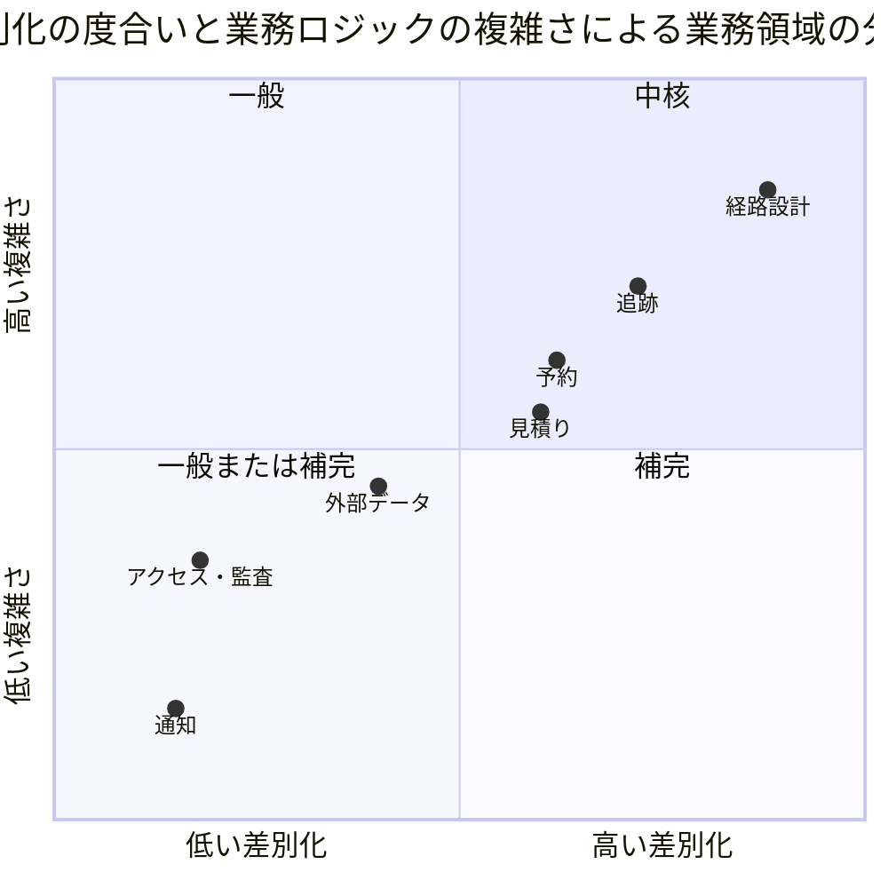

| コンテキスト | 分類 | 根拠 |
| :--- | :--- | :--- |
| 経路設計（Routing） | 中核 | 制約対応型経路設計は A 社の競争優位であり、ケイパビリティの成熟度が低い（経路候補算出）。規則（BR-02、BR-11）と専門判断・再設計が最も複雑 |
| 追跡（Tracking） | 中核 | 顧客から見える透明性の源泉。予定と実績、確認中、訂正の二者確認、鮮度が絡む |
| 予約（Booking） | 中核 | 予約の確定・変更・取消しの段階規則（BR-01、BR-04）を持つ |
| 見積り（Quotation） | 中核 | 根拠付き見積りと有効期限の境界（BR-10）を持つ。差別化は経路設計ほど高くない |
| 外部データ（External Data） | 補完 | 冪等性・隔離・照合（BR-12）は手続き的。A 社固有の採否判断を含むため一般ではない |
| アクセス・監査（Identity & Audit） | 一般 | 認証・役割・監査証跡は業界共通の仕組みで足りる。パイロットの KPI の計測（US-21）もここに置く |
| 通知（Notification） | 一般 | メールの送信と送信結果の記録だけを担う。業務の判断を持たない（US-22） |

## ユビキタス言語

### 呼び分けの決定

要件定義の「貨物予約の状態遷移」は下書きから完了までを 1 つの状態モデルで描いている。一方、Unit 定義は U1（輸送要求・見積り）と U6（予約管理）を分けている。本書では次のように呼び分ける。

| 業務の段階 | 呼び名 | 所属コンテキスト | 要件定義の状態との対応 |
| :--- | :--- | :--- | :--- |
| 本予約より前 | **輸送要求**（TransportRequest）、その版を **輸送要求版** | 見積り | 下書き、審査中、見積提示済み、変更中（本予約前）、失効、取消済み（本予約前の取下げ） |
| 本予約以後 | **貨物予約**（Booking）、その版を **予約版** | 予約 | 確定、変更承認待ち、取消承認待ち、変更中（本予約後）、取消済み、輸送中、完了 |

ユーザーストーリーの US-01・US-02 にある「予約版」は、本書では「輸送要求版」と読み替える。

### 用語集

| 用語 | 英語名 | 定義 | コンテキスト |
| :--- | :--- | :--- | :--- |
| 輸送要求 | TransportRequest | 荷主が見積りを依頼する輸送条件のまとまり。本予約までの版を持つ | 見積り |
| 業務番号 | TransportRequestNumber | 荷主と社内が電話・メールで言い合える輸送要求の番号。`TR-年-年ごとの連番`（例: TR-2026-0142）で、年が変わると 0001 から数え直す。版は「TR-2026-0142 版 2」と表記する。画面には内部の ID（UUID）を出さない（2026-10-02 の D-4）。初回の提出時に 1 回だけ振り、年は提出時刻の日本時間（Asia/Tokyo）の年とする。連番は 4 桁のゼロ埋めで、9999 を超えたら桁を増やす。欠番を出さない（2026-10-02 の D-10） | 見積り |
| 業務番号の採番 | TransportRequestNumberIssuer | 年を受け取り、その年の次の業務番号を返すポート。年の算出は業務番号が持ち、採番は提出と同じトランザクションで行う（D-10） | 見積り |
| 輸送要求版 | TransportRequestVersion | 輸送要求のある時点の条件。提出後は不変で、変更は新しい版になる | 見積り |
| 輸送条件 | ShipmentTerms | 荷受人、出発地、目的地、希望到着期限、貨物、必要書類の組 | 見積り（共有の写しは予約・経路設計） |
| 輸送条件の入力 | ShipmentTermsInput | 荷主が提出しようとする輸送条件の入力。項目が欠けていてよく、検証して違反がなければ輸送条件になる | 見積り |
| 提出の検証結果 | SubmissionViolations | 提出の検証で見つかった不足と誤りの一覧。項目と理由の種類だけを持ち、利用者に示す理由と直し方の文言は画面の層が付ける（Q-INV-01、Q-INV-02） | 見積り |
| 貨物 | Cargo | 貨物種別、荷姿、個数、総重量（kg）、容積（m3）の組 | 見積り |
| 貨物種別 | CargoCategory | 一般、危険物、冷凍、その他特殊。MVP は一般だけを受け付ける（BR-03） | 見積り |
| 荷姿 | PackageType | 貨物の梱包の形。パレット、カートン、クレート、その他（2026-10-02 に human:kakimomokuri が承認した仮の値。業務責任者の確認で見直す） | 見積り |
| 審査 | Review | 営業担当者が提出条件と書類の充足を判断すること | 見積り |
| 審査記録 | ReviewRecord | 1 つの版に対する審査の判断の記録。判断者・判断時刻・根拠（確定）または理由と不足事項（差戻し）を持ち、後から変えない | 見積り |
| 審査の判断 | ReviewDecision | 充足（審査を確定し見積り作成へ進める）と差戻し（下書きに戻す）の 2 つ | 見積り |
| 見積り | Quotation | 審査済みの輸送要求版に対する料金根拠・有効期限・経路方針の提示 | 見積り |
| 経路方針 | RoutePolicy | 見積りとともに荷主へ示す、想定する主な経由地と概算の日程。詳細な経路は経路設計者の承認後に確定する | 見積り |
| 荷主の回答 | ShipperResponse | 提示された見積りと経路方針への荷主の回答（詳細経路設計へ進む、辞退する、相談する） | 見積り |
| 荷主承認 | ShipperApproval | 荷主担当者が見積りと承認済み経路を確認して与える承認。BR-01 の確定条件の 1 つ | 見積り |
| 料金根拠 | PricingBasis | 見積り金額の内訳と参照した契約条件 | 見積り |
| 見積有効期限 | QuotationExpiry | 予約確定の commit 時刻がこれより前のときだけ見積りが有効になる UTC 時点（BR-10） | 見積り |
| 経路設計案件 | RoutingCase | 1 つの輸送要求について経路版を作り、確定・再設計する単位 | 経路設計 |
| 経路版 | RouteVersion | 候補の比較、判断根拠、承認を伴って確定した経路のある版 | 経路設計 |
| 経路候補 | RouteCandidate | 区間の列からなる候補と、その制約適合判定 | 経路設計 |
| 区間 | Leg | 航海、積地、揚地、出発予定、到着予定 | 経路設計（写しは追跡） |
| 航海 | Voyage | 航海番号で識別される運航予定。外部原本から採用した版を持つ | 経路設計 |
| 必要最小接続時間 | MinimumConnectionTime | 航路・港ごとの、区間の乗り継ぎに必要な最小時間（BR-11） | 経路設計 |
| 制約適合判定 | ConstraintEvaluation | 期限・接続時間・貨物種別による候補の適合・除外とその理由 | 経路設計 |
| 再設計要 | RedesignRequired | 確定後の外部情報更新で制約を満たさなくなった経路版の状態 | 経路設計 |
| 本予約 | — | A 社と荷主の間で輸送の条件（見積り・経路版・貨物）を確定すること。運送会社による船腹の確保（ブッキングの確認）とは別の事実であり、確認書でも区別して示す（要確認: 業務責任者） | 予約 |
| 貨物予約 | Booking | 本予約で確定した輸送の契約。予約版と追跡番号を持つ | 予約 |
| 予約版 | BookingVersion | 貨物予約のある時点の合意内容（見積り、経路版、貨物）。変更は新しい版になる | 予約 |
| 追跡番号 | TrackingNumber | 顧客が追跡を照会するための推測されにくい番号。本予約時に発行する | 予約（照会は追跡） |
| 輸送段階 | TransportPhase | 集荷前、集荷後、完了。変更・取消しの可否を決める（BR-04） | 予約 |
| 追跡記録 | TrackingRecord | 1 つの追跡番号の予定と主要実績、現在状態 | 追跡 |
| 主要実績 | Milestone | 出典と発生時刻を伴う、集荷・搬入・出発・到着などの事実 | 追跡 |
| 出典 | Source | 実績や採用値の根拠（外部原本、現場記録、社内確認、手動入力） | 共有カーネル |
| 確認中 | UnderReview | 順序逆転・矛盾・鮮度超過のため、現在状態に反映せず保留している状態（BR-06） | 追跡 |
| 訂正 | Correction | 原実績を残したまま理由付きで新しい事実を記録すること（BR-05） | 追跡 |
| 鮮度 | Freshness | 最終取得時刻からの経過と、許容範囲を超えたかどうか | 追跡、経路設計 |
| 最新の到着見込み | LatestEstimate | 当初の予定（確定した経路版）とは別に、実績と採用値から見込む最新の到着時刻 | 追跡 |
| 照会記録 | InquiryRecord | 荷主・荷受人からの照会 1 件の経路（顧客 Web・電話・メール）と、Web で完結したか有人対応へ移ったかの記録。KPI-02 の計測に使う | 追跡 |
| 営業日カレンダー | BusinessCalendar | 有人案件の受領・回答期限を数えるための営業日と営業時間（日本の祝日・年末年始） | 追跡 |
| 有人案件 | ServiceCase | 受付番号を持ち、担当・期限・回答・復旧照合を追跡する顧客照会または業務例外（BR-09、BR-17） | 追跡 |
| 受付番号 | CaseNumber | 有人案件の一意な識別子 | 追跡 |
| 企業 | Company | 荷主・荷受人・A 社などの利用者の所属組織 | アクセス・監査 |
| 利用者 | User | 事前登録され、固定役割を持つ人（BR-14、BR-15） | アクセス・監査 |
| 役割 | Role | 荷主担当者、営業担当者、経路設計者、追跡管理者、データ責任者、カスタマーサポート、システム管理者、監査担当者 | アクセス・監査 |
| 参照許可 | AccessGrant | 荷主担当者が予約単位で荷受人に与える照会の許可（BR-07） | アクセス・監査 |
| KPI 計測記録 | KpiObservation | KPI-01・KPI-02 の算出に使う時刻・件数と、パイロット開始前の基準値 | アクセス・監査 |
| 通知 | Notification | 荷主担当者へ送るメール 1 通の宛先・種類・対象・送信結果 | 通知 |
| 監査記録 | AuditRecord | 操作者・時刻・対象・変更前後・理由・承認・出典の追記専用の記録 | アクセス・監査 |
| 情報源 | DataSource | データ責任者が選定・承認した運送会社・港湾などの原本の提供元（BR-18） | 外部データ |
| 外部原本 | ExternalRecord | 外部から受け取った無加工の原本と、その分類（採用・重複・隔離） | 外部データ |
| 冪等性キー | IdempotencyKey | 提供元、原本種別、外部 ID、外部版の組（BR-12） | 外部データ |
| 手動情報 | ManualEntry | 連携停止中に出典・入力者・入力時刻・仮状態を伴って入力した情報（BR-08） | 外部データ |
| 復旧照合 | RecoveryReconciliation | 停止期間の全原本の分類・件数照合・手動情報との差異確認（BR-12） | 外部データ |
| 採用値 | AdoptedValue | 外部原本から採用し、業務に公開した値 | 外部データ |
| 輸送要求 ID | TransportRequestId | 輸送要求を識別する、システムが発行する不透明な値。画面には出さず、業務番号を出す | 見積り |
| 場所 | Location | UN/LOCODE（国コード 2 文字 + 地点コード 3 文字）で識別する港・地点 | 共有カーネル |
| UTC 時点 | UtcInstant | 業務上の時刻。UTC の時点として保持し、表示ではタイムゾーンと UTC offset を付ける（BR-10） | 共有カーネル |
| 企業 ID | CompanyId | 荷主・荷受人・A 社などの企業を識別する値 | 共有カーネル |
| 利用者 ID | UserId | 操作した利用者を識別する値 | 共有カーネル |

## 共有カーネル

[バックエンドアーキテクチャ](architecture_backend.md) で決めたとおり、業務規則を持たない基本型だけを共有する。

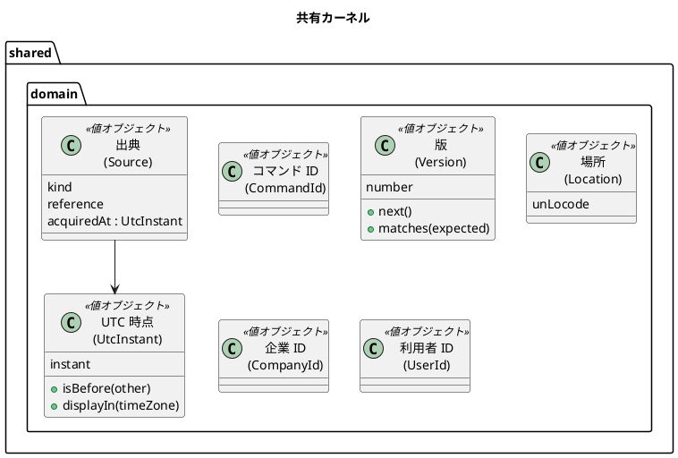

| 型 | 不変条件 |
| :--- | :--- |
| UTC 時点 | UTC の時点として保持する。表示はタイムゾーンと UTC offset を必ず付ける（BR-10） |
| 版 | 1 から始まり、増えるだけ。期待版と一致しない変更は競合とする（ARCH-HO-01） |
| 場所 | UN/LOCODE の形式（国コード 2 文字 + 地点コード 3 文字）だけを受け付ける |
| 出典 | 種類（外部原本・現場記録・社内確認・手動入力）、参照、取得時刻を必須とする |

ドメインイベントは、共有カーネルのインターフェースではなく、注釈 `@DomainEvent` を付けた record として各コンテキストの `domain.events` に置く（2026-10-02 の D-1、[ADR-003](../../adr/cargo-tracker/003-inter-context-integration.md) の補足の決定）。各イベントは受信側の冪等性のキーになる業務キーを持ち、Java の標準と共有カーネルの型だけを持つ。

## コンテキストごとのドメインモデル

各コンテキストについて、集約、エンティティ・値オブジェクト、不変条件、状態遷移、ドメインルールを示す。

### 見積り（Quotation、U1）

#### 見積りの集約

| 集約 | 集約ルート | 識別子 | 含むもの | 責務 |
| :--- | :--- | :--- | :--- | :--- |
| 輸送要求 | 輸送要求（TransportRequest） | 輸送要求 ID | 輸送要求版（エンティティ）、審査記録（エンティティ） | 下書き・提出・審査・差戻し・取下げと、版の管理 |
| 見積り | 見積り（Quotation） | 見積り ID | 料金根拠（値）、有効期限（値）、経路方針（値）、荷主の回答（値）、荷主承認（値） | 見積りの作成・社内承認・提示、荷主の回答、経路版の割当て、荷主承認、失効・置換 |

見積りを輸送要求の中に入れない理由: 見積りは版ごとに複数作られ（置換）、有効期限で単独に失効する。輸送要求の版の更新と見積りの承認が同じトランザクションで競合しないよう、別の集約にする。

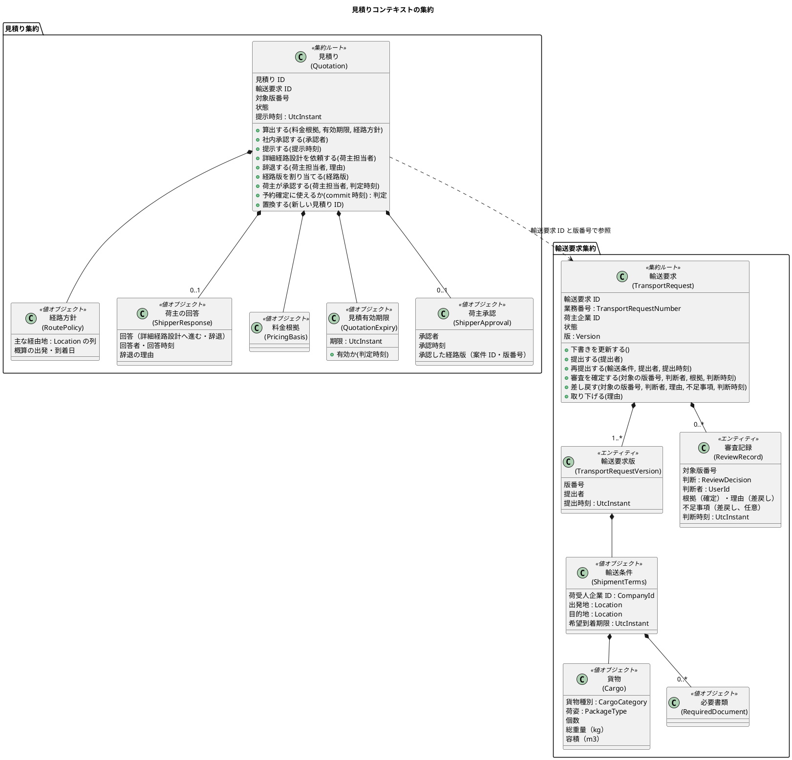

#### 見積りの状態遷移

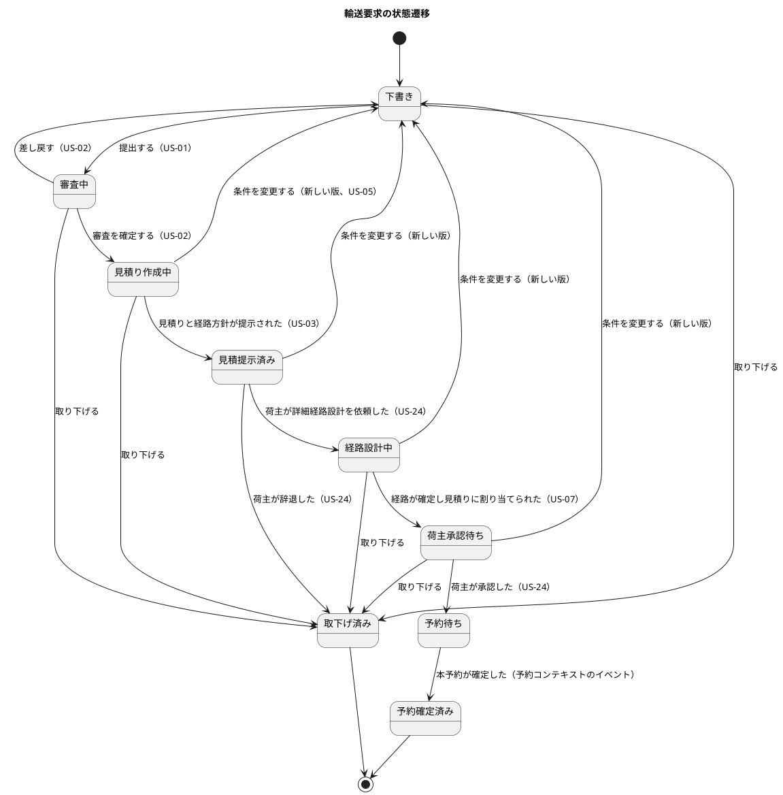

業務の順序は要件定義のエンドツーエンド業務フローに従う: 審査 → 見積りと経路方針の提示 → 荷主の回答 → 詳細経路設計 → 荷主の承認 → 本予約。要件定義の「見積提示済み → 失効」は、見積りの状態（失効）として扱う。見積りが期限で失効しても輸送要求はその状態のまま、新しい見積りを作れる。

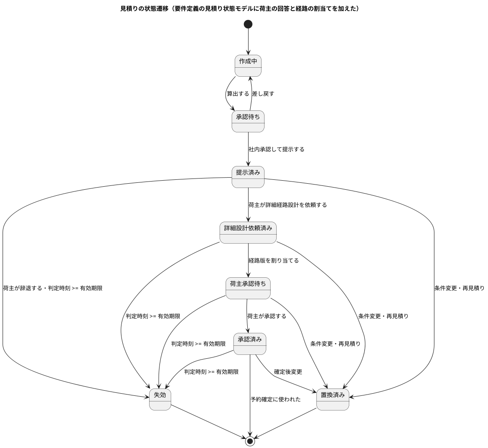

#### 見積りの不変条件とドメインルール

| ID | 不変条件・ルール | 根拠 |
| :--- | :--- | :--- |
| Q-INV-01 | 提出には必須条件（荷受人、出発地、目的地、希望到着期限、貨物、必要書類）がそろっていること。出発地と目的地は異なること（2026-10-02 の D-6）。不足や誤りがあれば下書きのまま不足項目と誤りを返す | US-01 |
| Q-INV-02 | 貨物種別が一般以外の輸送要求は提出できない。手動窓口を案内する | BR-03、US-01 |
| Q-INV-03 | 提出された輸送要求版は変更できない。変更は新しい版を作る | BR-04、US-05 |
| Q-INV-04 | 審査の確定は最新版に対してだけ行える。古い版の審査確定は拒否する。審査の対象の版番号を集約の現在の版番号と照合して判定する（ARCH-HO-01 の期待版（集約の `version`）の照合とは別の、業務の規則。Bolt 5）。差戻しも同じ照合を行う | US-02 |
| Q-INV-14 | 審査の確定・差戻しは、状態が審査中のときだけ行える。確定には根拠、差戻しには理由が必要で、不足事項は任意。根拠・理由・不足事項は 4,000 文字まで（2026-10-02 に human:kakimomokuri が承認。Bolt 5） | US-02 |
| Q-INV-15 | 再提出は、状態が下書きのときだけ行える。提出と同じ検証（Q-INV-01・02・12）を通し、版番号を 1 増やした新しい版を作って審査中にする。業務番号は変えない（Q-INV-13） | US-02、US-05 |
| Q-INV-05 | 見積りの算出には料金根拠・有効期限・経路方針が必要。提示した時刻を記録する（KPI-01） | US-03、US-21 |
| Q-INV-06 | 見積りが予約確定に使えるのは、状態が承認済みで、予約確定の commit 時刻が有効期限より前のときだけ。同時刻は失効とする | BR-10、US-03、US-04 |
| Q-INV-07 | 失効・置換済みの見積りは再提示・承認・予約確定に使えない。新しい見積りを作る | BR-16、US-03 |
| Q-INV-08 | 利用者は自社の輸送要求だけを操作できる（アプリケーション層で確認し、集約は荷主企業 ID を保持する） | BR-07、US-01 |
| Q-INV-09 | 詳細経路設計の依頼と辞退は、提示済みの見積りに対してだけ行える。辞退には理由が必要で、辞退した見積りは失効する | US-24 |
| Q-INV-10 | 荷主の承認は、見積りに割り当てた経路版が確定済みで、承認の時点で再設計要・旧版でなく、見積りが有効期限内のときだけ行える。承認には承認した経路版を記録する | BR-01、BR-10、BR-16、US-24 |
| Q-INV-11 | 輸送要求の複製は、輸送条件を引き継いだ新しい下書きを作る。希望到着期限と必要書類は引き継がない | US-01 |
| Q-INV-12 | 希望到着期限は提出時刻より後でなければならない。同時刻と過去は誤りとする。期限が経路設計に間に合うかは、提出では判定せず経路設計の制約適合（BR-11）で判定する。個数は 1 以上の整数、総重量と容積は 0 より大きい値（小数点以下 3 桁まで）とする（2026-10-02 に human:kakimomokuri が承認） | US-01 |
| Q-INV-13 | 業務番号は初回の提出で振り、差戻し・再提出・新しい版では変えない。同じ番号を 2 つの輸送要求に振らない（D-10） | US-01、D-4 |

| ドメインルール | 英語名 | 内容 |
| :--- | :--- | :--- |
| MVP 受付範囲 | MvpAcceptancePolicy | 貨物種別が一般かを判定する。後続段階で特殊貨物を受け付けるときは、この規則を差し替える。提出の検証（ShipmentTermsInput）が使う |
| 見積有効判定 | QuotationValidity | 判定時刻と有効期限から有効・失効を判定する。判定時刻は呼び出し側が commit 時刻として渡す |

提出の検証は、輸送条件の入力（ShipmentTermsInput）が Q-INV-01・Q-INV-02・Q-INV-12 をまとめて判定し、違反をすべて提出の検証結果（SubmissionViolations）として返す（1 件ずつ直させない）。違反がなければ、同じ判定の結果として輸送条件（ShipmentTerms）を返す（検証を通らずに輸送条件を作れないよう、変換を別の操作に分けない。Bolt 4 レビュー R-04）。そのうえで業務番号の採番（TransportRequestNumberIssuer）で番号を得て提出する。採番のポートは `domain.model` に置き、実装は `infrastructure.persistence` に置く。

審査（Bolt 5）: 社内の画面（S-02・S-03）は営業担当者がすべての荷主の輸送要求を扱うため、リポジトリに荷主企業で絞らない照会（業務番号の検索、審査中の一覧）を持つ。荷主の画面の照会は、業務番号が推測しやすいため必ず荷主企業で絞る（Bolt 4 レビュー R-02）。2 つの照会は名前と入力ポートを分け（荷主用の照会サービスと、社内用の `StaffTransportRequestQueryService`）、取り違えを防ぐ。受付一覧は集約を組み立てない読み取りモデル（`TransportRequestSummary`）で、最初の提出時刻（版 1）の古い順に並べる（Bolt 5 レビュー R-05・R-09・R-10）。下書きを保存するまでは（R1.0）、再提出が輸送条件の入力を受け取る。

荷主の再提出（Bolt 6）: 荷主の見積依頼の一覧（C-02）は、リポジトリの `findSummariesByShipper(荷主企業)` で、自社の輸送要求だけを最初の提出時刻の新しい順に返す。一覧の行（`TransportRequestSummary`）は状態を持ち、荷主の画面はそれを「いま誰の対応待ちか」に対応させる（審査中・見積り作成中は A 社、下書きはお客様）。荷主に見せる審査記録は直近の差戻しの理由と不足事項だけで、審査の確定の根拠と判断者は社内の記録として見せない（2026-10-03 の人の決定）。集約の操作は足さず、再提出は Bolt 5 の `再提出する()` を荷主企業で絞った照会の後に呼ぶ。

Q-INV-01 の「下書きのまま」は、R1.0 で下書きを保存するまで、下書きを保存せずに入力を残して同じ画面を表示することで満たす（2026-10-02 の人の決定。Bolt 4）。下書きの操作（`下書きを更新する()`）と `transport_request_draft` は R1.0 の下書き保存で作る。必要書類は、ファイルの保存とあわせて Bolt 4 の次の Bolt で必須条件に入れる。

### 経路設計（Routing、U2）

#### 経路設計の集約

| 集約 | 集約ルート | 識別子 | 含むもの | 責務 |
| :--- | :--- | :--- | :--- | :--- |
| 経路設計案件 | 経路設計案件（RoutingCase） | 経路設計案件 ID | 経路版（エンティティ）、経路候補（エンティティ）、判断根拠（値） | 候補の算出・比較、専門判断、確定、再設計要、再設計 |
| 航海 | 航海（Voyage） | 航海番号 | 運航予定（値）、寄港（値）、採用情報版（値） | 外部原本から採用した運航予定の保持と更新 |
| 接続時間規則 | 接続時間規則（ConnectionRule） | 規則 ID | 対象の航路・港、必要最小接続時間 | 航路別の必要最小接続時間の管理（BR-11） |

経路版を経路設計案件の中に入れる理由: 再設計では旧版と新版の関係（新旧関係、変更根拠、引き継ぐ不適合理由）を一貫して保つ必要がある（US-08）。経路版を独立した集約にすると、「確定済みの経路版は案件に 1 つだけ」という不変条件を集約をまたいで守ることになる。

航海を経路設計案件の外に置く理由: 航海は多くの案件から参照され、外部原本の採用で独立に更新される（第 2 章の Voyage 集約と同じ）。

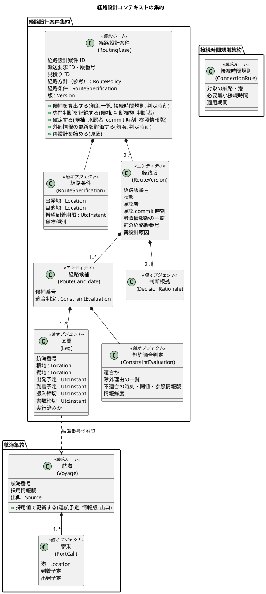

#### 経路版の状態遷移

要件定義の経路版の状態モデルに、本書の呼び名を合わせた。

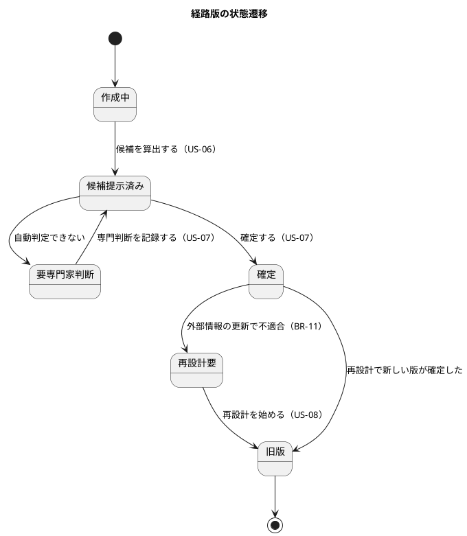

#### 経路設計の不変条件とドメインルール

| ID | 不変条件・ルール | 根拠 |
| :--- | :--- | :--- |
| R-INV-01 | 候補は、到着予定が希望到着期限以前で、すべての接続時間が必要最小接続時間以上のときだけ適合とする。同時刻・同値は適合 | BR-11、US-06 |
| R-INV-02 | 期限に間に合わない候補、貨物種別に対応しない候補、接続できない候補は除外し、不適合となった時刻・閾値・参照情報版を残す | BR-02、US-06 |
| R-INV-03 | 確定は承認の commit 時点で再検証し、参照した情報版が承認中に更新されていれば確定を拒否する | BR-11、US-07 |
| R-INV-04 | 確定には判断根拠と、経路設計者の役割が必要 | US-07、BR-15 |
| R-INV-05 | 1 つの経路設計案件で「確定」の経路版は同時に 1 つだけ | US-07、US-08 |
| R-INV-06 | 旧版・再設計要の経路版は再確定・新規予約への割当てに使えない | BR-16、US-07 |
| R-INV-07 | 確定後に外部情報の更新で不適合になっても、経路版を再設計要にするだけで予約を取り消さない。参照した旧情報版を保持する | BR-11、US-07 |
| R-INV-08 | 再設計は実行済みの区間を変えず、未実行の区間だけを対象にする。新版は旧版の番号と変更根拠を持つ | US-08 |
| R-INV-09 | 外部情報が停止中のときは、最終採用値と取得時刻を示し、情報不足として識別する | US-06 |
| R-INV-10 | 経路設計案件は、荷主の詳細経路設計の依頼（DE-16）を受けて作る。案件は輸送要求版ごとに 1 つだけで、依頼のイベントが再配信されても重複して作らない | 業務フロー、US-24、ARCH-HO-01 |
| R-INV-11 | 経路が確定したら、依頼元の見積りに経路版を割り当てる（DE-05）。荷主の承認は割り当てた後に行う | 業務フロー、BR-01 |

| ドメインルール・サービス | 英語名 | 内容 |
| :--- | :--- | :--- |
| 制約適合判定 | ConstraintEvaluator | 経路条件、区間の列、接続時間規則、判定時刻から適合・除外と理由を返す純粋な関数。Golden dataset で検証する |
| 経路候補探索 | RouteCandidateFinder | 航海の一覧から出発地から目的地までの区間の列を列挙する。MVP は確定的な列挙とし、最適化はしない（スコープ外） |

経路候補探索と制約適合判定は複数の航海と規則を扱うため、ドメインサービスにする。どちらも状態を持たず、リポジトリを呼ばない。必要な航海と規則はアプリケーションサービスが読み込んで渡す。

### 予約（Booking、U6）

#### 予約の集約

| 集約 | 集約ルート | 識別子 | 含むもの | 責務 |
| :--- | :--- | :--- | :--- | :--- |
| 貨物予約 | 貨物予約（Booking） | 予約 ID | 予約版（エンティティ）、変更・取消申請（エンティティ）、追跡番号（値）、輸送段階（値） | 本予約の確定、変更・取消しの申請と承認、版の管理 |

第 2 章の Cargo 集約に当たる。第 2 章では Cargo が経路（Itinerary）と配送状況（Delivery）を持つが、本設計では経路は経路設計の経路版を番号で参照し、配送状況は追跡コンテキストが持つ。

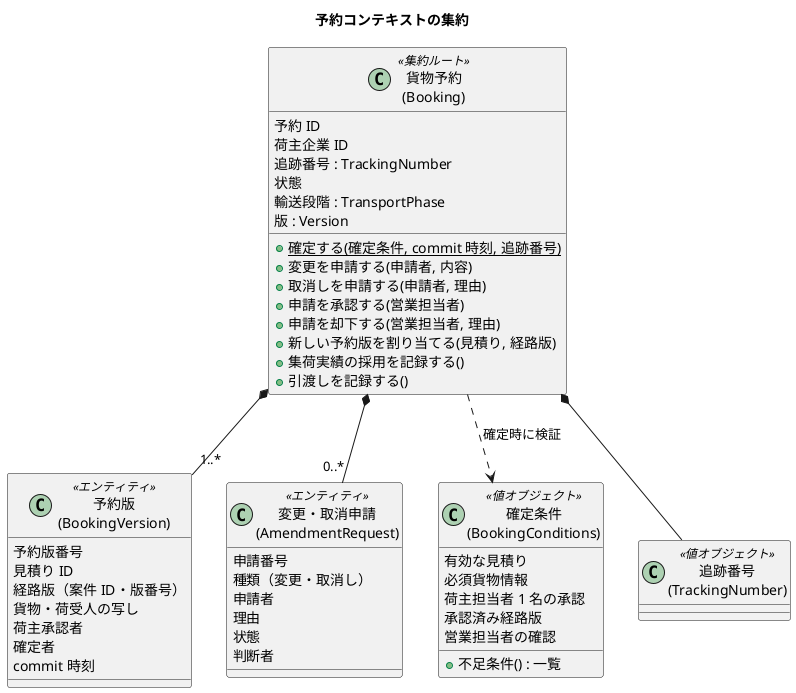

#### 予約の状態遷移

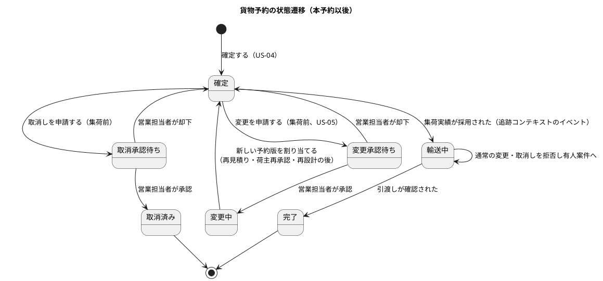

#### 予約の不変条件とドメインルール

| ID | 不変条件・ルール | 根拠 |
| :--- | :--- | :--- |
| B-INV-01 | 本予約は、有効な見積り、必須貨物情報、荷主担当者 1 名の承認、承認済み経路版、営業担当者による条件確認がそろったときだけ確定する。不足条件を返す | BR-01、US-04 |
| B-INV-02 | 見積りの有効性は予約確定の commit 時刻で判定する。同時刻以後は失効 | BR-10、US-04 |
| B-INV-03 | 同じコマンド ID の確定要求は予約を重複生成せず、既存の追跡番号を返す | US-04、PV-01 |
| B-INV-04 | 特殊貨物を含む輸送要求は確定しない | BR-03、US-04 |
| B-INV-05 | 再設計要・旧版の経路版、失効・置換済みの見積りは確定・新しい予約版に使えない | BR-16 |
| B-INV-06 | 変更・取消しの申請は集荷前（輸送段階が集荷前）のときだけ受け付け、予約の状態は承認まで変えない。輸送段階は DE-09 で結果整合的に更新されるため、申請の承認時には追跡の公開 API で集荷実績の有無を同期で確かめ、採用済みなら承認せず有人案件へ引き継ぐ | BR-04、US-05 |
| B-INV-07 | 集荷後の通常の変更・取消しは拒否し、要求と理由を記録して有人案件へ引き継ぐ | BR-04、BR-17、US-05 |
| B-INV-08 | 予約版は不変。変更の承認で料金・経路に影響する場合は、旧版を保持して新しい予約版を作る | BR-04、US-05 |
| B-INV-09 | 期待版が現在版と違う変更は競合として拒否する | ARCH-HO-01、US-05 |
| B-INV-10 | カスタマーサポートは予約を確定・変更できない（アプリケーション層の認可） | US-11、BR-15 |
| B-INV-11 | 1 つの見積りから確定できる貨物予約は 1 件だけ。別のコマンド ID・別の利用者による同時の確定でも 2 件目は拒否する（予約版の見積り ID の一意制約） | PV-01（重複予約 0 件）、US-04 |
| B-INV-12 | 他のコンテキストからのイベントは、イベントが持つ発行元の集約の版が、記録済みの版より新しいときだけ適用する。古い版のイベントは無視して記録だけ残す | ARCH-HO-01、イベントの順序 |

| ドメインルール・サービス | 英語名 | 内容 |
| :--- | :--- | :--- |
| 確定条件の検証 | BookingConditions | 見積り・経路版・貨物・承認の状態を受け取り、不足条件を返す。見積りと経路版の状態は、アプリケーションサービスが ACL 越しに取得して値として渡す |
| 追跡番号の発行 | TrackingNumberIssuer | 推測されにくい一意な追跡番号を発行する（ファクトリ） |

### 追跡（Tracking、U3）

#### 追跡の集約

| 集約 | 集約ルート | 識別子 | 含むもの | 責務 |
| :--- | :--- | :--- | :--- | :--- |
| 追跡記録 | 追跡記録（TrackingRecord） | 追跡番号 | 予定（値）、主要実績（エンティティ）、訂正（エンティティ）、現在状態（値） | 予定と実績の保持、現在状態の導出、確認中の保留、訂正の二者確認 |
| 有人案件 | 有人案件（ServiceCase） | 受付番号 | 進捗（エンティティ）、回答（エンティティ）、復旧照合の要否と結果（値） | 顧客照会・業務例外の受付から終結・再開まで。荷主は自社の問い合わせを照会・再開できる（US-23） |
| 照会記録 | 照会記録（InquiryRecord） | 照会記録 ID | 経路（顧客 Web・電話・メール・Web の問い合わせ）、対象、受付時刻、有人対応へ移ったか | KPI-02 の分母と分子の記録（US-21） |
| 営業日カレンダー | 営業日カレンダー（BusinessCalendar） | 年 | 営業日・休業日、営業時間 | 受領・回答期限の計算（BR-09、US-20） |

第 2 章の TrackingActivity が HandlingEvent の列を持つのと同じく、追跡記録が主要実績の列を持ち、現在状態を集約の中で導出する（ADR-002）。

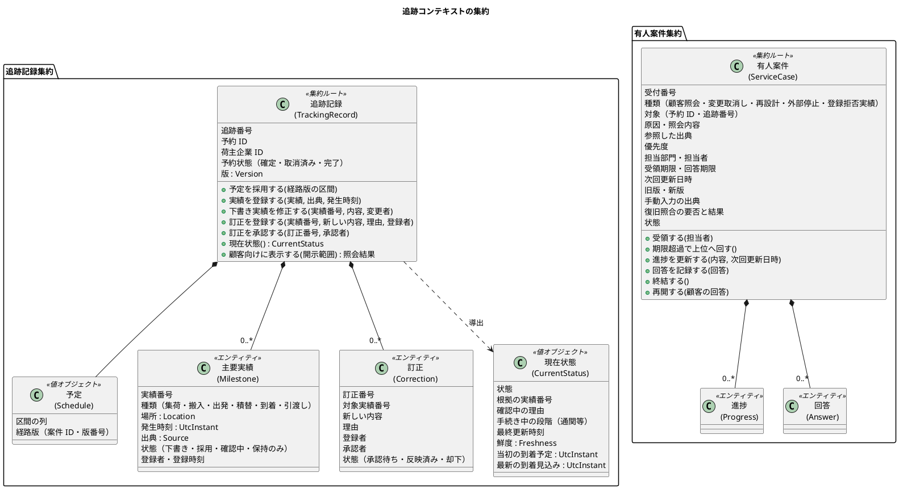

#### 追跡の状態遷移

追跡状態は要件定義の追跡状態モデルを使う。状態名は業務責任者の確認前の候補である（要件定義の注記）。

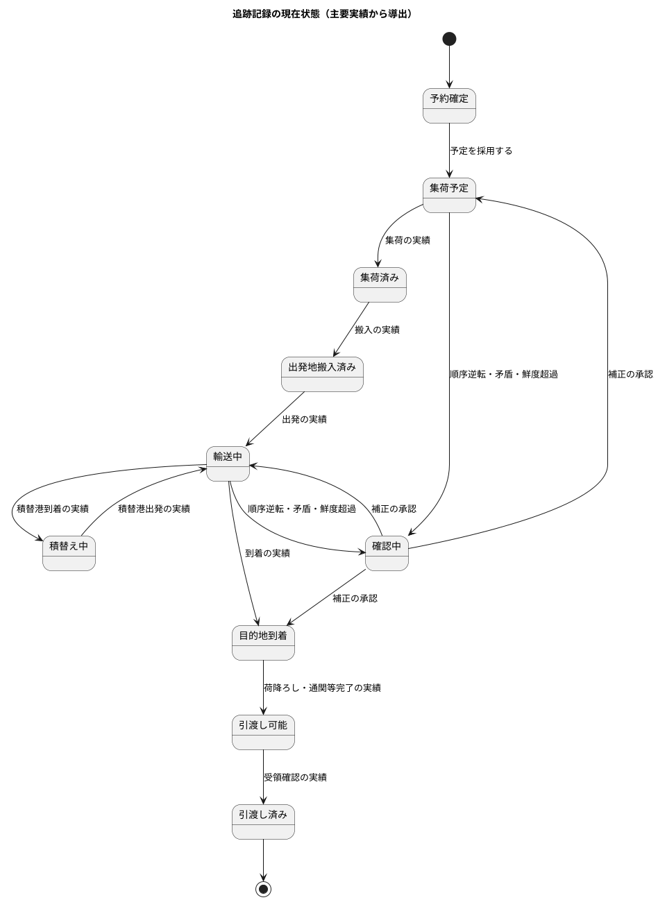

有人案件の状態遷移は、要件定義の例外案件の状態モデルを US-20 の受入条件に合わせて具体化した。

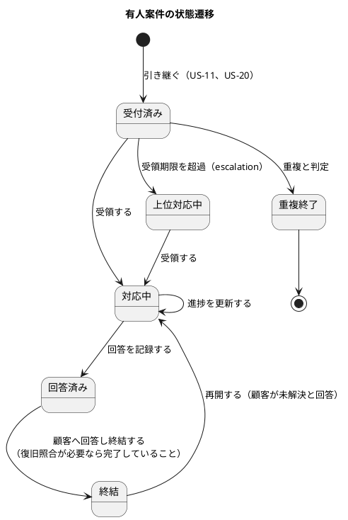

要件定義の例外案件の状態（評価中、顧客確認待ち、解決確認中）は第 2 段階の例外対応で使う。MVP の有人案件は US-20 の受入条件に必要な状態だけを持つ。

#### 追跡の不変条件とドメインルール

| ID | 不変条件・ルール | 根拠 |
| :--- | :--- | :--- |
| T-INV-01 | 主要実績は削除・上書きしない。訂正は原実績に関連付けた訂正記録で行う | BR-05、US-13 |
| T-INV-02 | 同じ出典識別子の実績は重複登録せず、既存の記録を返す | US-12 |
| T-INV-03 | 時系列に反する・矛盾する実績は保持するが現在状態に直ちに反映せず、確認中にする | BR-06、US-12 |
| T-INV-04 | 取消済み予約への実績登録は拒否し、発生事実を有人案件として起票する | BR-16、US-12 |
| T-INV-05 | 完了済み（引渡し済み）の追跡への遅延実績は保持のみとし、現在状態を自動で後退・再開しない | BR-16、US-12 |
| T-INV-06 | 訂正には理由が必要。採用済みまたは顧客表示済みの実績の訂正は、登録者と異なる追跡管理者の承認まで採用値を変えない | BR-05、US-13 |
| T-INV-07 | 採用前の下書き実績は二者確認なしで修正でき、変更者と変更時刻を記録する | BR-05、US-13 |
| T-INV-08 | 予定と実績を混同しない。現在状態は採用済みの実績だけから導出し、予定は予定として示す | 要件定義 追跡状態モデル、US-09 |
| T-INV-09 | 顧客向けの表示は開示範囲（荷主・荷受人）に絞る。荷受人には到着予定、現在状態、主要実績、最終更新時刻だけを示す | BR-07、US-10 |
| SC-INV-01 | 有人案件は受付番号を持ち、種類に応じた必須項目（原因、担当、期限、旧版・新版、手動入力の出典、顧客連絡、復旧照合）をそろえて起票する | BR-09、BR-17、US-20 |
| SC-INV-02 | 復旧照合が必要な案件は、照合が完了するまで終結できない | US-20 |
| SC-INV-03 | 再開しても受付番号と過去の回答履歴を保持する | US-20、US-23 |
| SC-INV-04 | 受領・回答期限は営業日カレンダーで数える。営業時間外の起票は翌営業日の開始から数え、優先度高は起票時に受付番号と次回更新日時を依頼元へ返す | BR-09、US-20 |
| SC-INV-05 | 荷主は自社の問い合わせだけを照会・再開できる | BR-07、US-23 |
| T-INV-10 | 当初の到着予定（確定した経路版）と最新の到着見込みを分けて持ち、どちらかで他方を上書きしない | US-09、要件定義 RQ-03 |
| IR-INV-01 | 顧客 Web の追跡照会は自動で照会記録にする。同じ利用者・同じ追跡番号の 30 分以内の再表示は 1 件にまとめる。照会の後 24 時間以内に同じ追跡番号の問い合わせが起票されたら、有人対応へ移ったと記録する | KPI-02、US-21 |
| IR-INV-02 | 電話・メールの照会は、引継ぎが不要でもカスタマーサポートが記録する | KPI-02、US-21 |

| ドメインルール・サービス | 英語名 | 内容 |
| :--- | :--- | :--- |
| 現在状態の導出 | CurrentStatusDeriver | 採用済みの実績の列と予定から現在状態と確認中の理由を導く。追跡記録の中で使う |
| 鮮度の判定 | FreshnessPolicy | 最終取得時刻と許容範囲から鮮度超過を判定する。許容範囲の値は非機能要件（NFR-FRESH-01）で決める |
| 開示範囲 | DisclosureScope | 照会者の立場（荷主・荷受人・社内）から表示してよい項目を決める |

### アクセス・監査（Identity & Audit、U4）

ADR-002 により単純なモデルとする。認証の仕組み（password、TOTP、session）は Spring Security に任せ、ドメインモデルは業務上の規則だけを持つ。

| 集約 | 集約ルート | 識別子 | 含むもの | 責務 |
| :--- | :--- | :--- | :--- | :--- |
| 企業 | 企業（Company） | 企業 ID | 種類（荷主・荷受人・A 社）、有効・無効 | 企業の有効性 |
| 利用者 | 利用者（User） | 利用者 ID | メールアドレス、役割（値）、担当企業・担当案件（値）、利用状態、ロック | 役割の付与・職務分離、利用停止 |
| 参照許可 | 参照許可（AccessGrant） | 参照許可 ID | 予約 ID、荷受人企業、開示項目、有効期間、状態 | 荷受人の招待・受諾・取消し |
| 監査記録 | 監査記録（AuditRecord） | 監査記録 ID | 操作者、時刻、対象と版、変更前後、理由、承認、出典、結果 | 追記専用の証跡 |
| KPI 計測 | KPI 計測記録（KpiObservation） | 輸送要求 ID・週 | 提出時刻、最初の提示時刻、照会の件数、基準値 | KPI-01・KPI-02 の週次の算出（US-21） |

| ID | 不変条件・ルール | 根拠 |
| :--- | :--- | :--- |
| IA-INV-01 | 役割は BR-15 の 8 つに固定する。システム管理者・監査担当者に業務データを変更できる役割を併せて付与できない | BR-15、US-16 |
| IA-INV-02 | 業務担当者は担当企業・担当案件だけを操作できる | BR-15、US-16 |
| IA-INV-03 | 5 回連続で認証に失敗したら 15 分ロックする。session は無操作 30 分または発行後 8 時間で失効する | BR-14、US-18 |
| IA-INV-04 | 利用停止・権限取消しは次の request から反映する | BR-14、US-16、US-18 |
| IA-INV-05 | 参照許可は予約の荷受人と一致する相手にだけ発行し、同じ予約・荷受人への有効な許可を重複発行しない | BR-07、US-19 |
| IA-INV-06 | 取り消された参照許可は、既存の session でも直ちに無効になる | BR-07、US-10、US-19 |
| IA-INV-07 | 監査記録は追記だけを許し、更新・削除しない。関連する記録の欠落は異常として示す | NFR-AUDIT-01、US-17 |
| IA-INV-08 | 認証の成功・失敗・ロック、権限外のアクセス試行は、ドメインイベントを経ずに同じ request の中で同期に監査記録へ書く | AUD-01、US-16〜US-19 |
| KPI-INV-01 | KPI-01 は、版 1 を最初に提出した時刻と、最初の有効な見積り・経路方針の提示時刻から求める（「有効な」の定義は D-11 で人が決める）。差戻し・再提出・新しい版で開始時刻を戻さない（2026-10-02 の D-3）。KPI-02 は照会記録から求める。PV-01 の除外（訓練データ、顧客都合の取消し）を適用し、除外の対象・理由・判断者を記録する | US-21、PV-01 |
| KPI-INV-02 | パイロット開始前の基準値は、算出方法と登録者とともに記録し、登録後は変更せず訂正は新しい記録で行う | US-21、PV-01 |

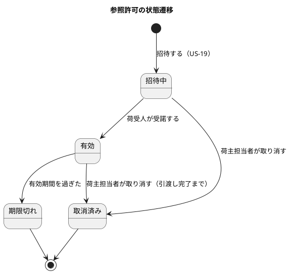

### 外部データ（External Data、U5）

ADR-002 によりトランザクションスクリプトとする。ここでは処理が扱うデータの構造と規則を示す。

| データ | 英語名 | 主な項目 | 規則（ID） |
| :--- | :--- | :--- | :--- |
| 情報源 | DataSource | 提供元、原本種別、選定・承認状態、承認者 | ED-INV-01: 承認済みの情報源が 0 件ならパイロットを開始しない（BR-18、US-14） |
| 取込 | Ingestion | 取込 ID、情報源、ファイル、取込者、取込時刻、件数 | 取込単位で件数を数え、照合に使う |
| 外部原本 | ExternalRecord | 冪等性キー（提供元、原本種別、外部 ID、外部版）、payload、payload のハッシュ、取得時刻、分類（採用・重複・隔離・差異） | ED-INV-02: 同じキー・同じハッシュは重複、同じキー・違うハッシュは隔離する。ED-INV-03: 順序逆転・既存値との矛盾は差異として自動で上書きしない（BR-12、US-14） |
| 採用値 | AdoptedValue | 対象（航海・主要実績）、値、出典、版 | 採用値だけを経路設計・追跡へ公開する（ADR-004） |
| 手動情報 | ManualEntry | 出典、入力者、入力時刻、仮状態、内容 | ED-INV-04: 出典・入力者・入力時刻・仮状態を必須とする（BR-08、US-15） |
| 取得失敗 | FetchFailure | 失敗時刻、理由、再実行可能時刻 | 第 2 段階の API 連携で使う。パイロットでは記録の形だけ持つ（US-15） |
| 復旧照合 | RecoveryReconciliation | 停止期間、分類別件数、受信件数、手動情報との差異一覧、確認者、完了時刻 | ED-INV-05: 全原本が分類済みで、受信件数が一致し、差異確認が済んだときだけ完了する（BR-12、US-15） |

### 通知（Notification）

荷主担当者へのメール通知（US-22）を担う一般のコンテキストとする。業務の判断を持たず、他のコンテキストのイベントを購読して、宛先をアクセス・監査の公開 API で解決し、メールを送る。

| 集約 | 集約ルート | 識別子 | 含むもの | 責務 |
| :--- | :--- | :--- | :--- | :--- |
| 通知 | 通知（Notification） | 通知 ID | 宛先（利用者 ID・メールアドレス）、種類、対象、言語、状態（送信待ち・送信済み・失敗）、送信時刻 | メールの送信と結果の記録 |

| ID | 不変条件・ルール | 根拠 |
| :--- | :--- | :--- |
| N-INV-01 | 通知の本文は件名と画面への導線だけとし、料金・契約条件・書類・他の予約の情報を含めない | BR-07、US-22 |
| N-INV-02 | 同じイベントからの通知は宛先ごとに 1 通だけ送る（イベントの再配信で重複しない） | ARCH-HO-01 |
| N-INV-03 | 送信に失敗したら失敗と宛先を記録し、画面の通知一覧でも確認できるようにする | US-22 |

| 種類 | 契機 | 宛先 |
| :--- | :--- | :--- |
| 見積りの提示 | DE-03 | 輸送要求の荷主担当者 |
| 経路の承認（荷主の承認が必要） | DE-05（見積りへの割当て後） | 同上 |
| 見積りの期限間近 | DE-19 | 同上 |
| 本予約の確定 | DE-07 | 同上 |
| 確認中への遷移 | DE-18 | 予約の荷主担当者 |
| 荷受人への招待 | 参照許可の発行 | 荷受人（日本語と英語） |

### 外部データの開始判定

| 照会 | 内容 | 根拠 |
| :--- | :--- | :--- |
| パイロット開始可否を判定する（PilotReadiness） | 承認済みの情報源の件数を返し、0 件なら開始不可とその理由を示す。運用の開始前チェックで使う | BR-18、US-14 |

## ドメインモデルの操作

第 2 章にならい、コンテキストごとのコマンド・クエリ・イベントを示す。コマンドはすべて `commandId` と期待版を持つ（ARCH-HO-01）。

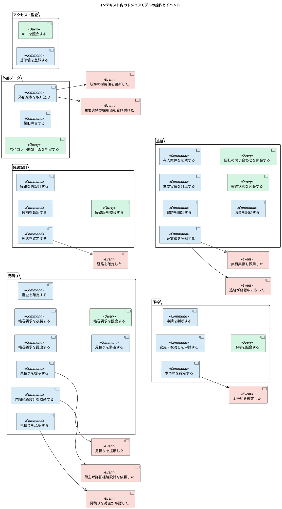

### イベント一覧

イベントは集約が生成し（第 3 章）、永続化して配信する（ADR-003）。すべてのイベントはアクセス・監査コンテキストが購読して監査記録を残す。イベントは発行元の集約の版を持ち、購読側は古い版を適用しない（B-INV-12）。イベントの型は、コンテキストの公表された言語として、移動しないパッケージに置く（ADR-003）。

| ID | イベント | 発行元 | 主な属性 | 購読先と反応 | 要件定義との対応 |
| :--- | :--- | :--- | :--- | :--- | :--- |
| DE-01 | 輸送要求を提出した | 見積り | 輸送要求 ID、版番号、荷主企業、提出時刻、業務番号（表示用の文字列。業務キーではない。D-10） | 監査、KPI 計測（KPI-01 の開始時刻） | EV-01 |
| DE-02 | 輸送要求を審査した | 見積り | 輸送要求 ID、版番号、判断（文字列 `APPROVED`・`SENT_BACK`。イベントはドメインの型を持たない）、判断者、判断時刻（2026-10-02 に承認。Bolt 5） | 監査（US-17 で購読する。それまでは発行だけ） | — |
| DE-03 | 見積りを提示した | 見積り | 見積り ID、輸送要求 ID・版番号、有効期限、経路方針、提示時刻 | 通知（見積りの提示）、KPI 計測（KPI-01 の終了時刻） | EV-02 |
| DE-16 | 荷主が詳細経路設計を依頼した | 見積り | 見積り ID、輸送要求 ID・版番号、経路条件、経路方針、依頼者 | 経路設計: 経路設計案件を作る（R-INV-10） | — |
| DE-17 | 荷主が見積りを辞退した | 見積り | 見積り ID、理由、回答者 | 監査、営業の業務ホーム | — |
| DE-05 | 経路を確定した | 経路設計 | 経路設計案件 ID、経路版番号、見積り ID、承認者、参照情報版 | 見積り: 経路版を割り当てる（荷主承認待ち）。通知（荷主の承認が必要）。予約（再設計後の割当て）、追跡（予定の更新） | EV-04 |
| DE-04 | 見積りを荷主が承認した | 見積り | 見積り ID、輸送要求 ID・版番号、承認した経路版、承認者 | 監査、営業の業務ホーム（予約の確定待ち） | — |
| DE-19 | 見積りの期限が近づいた | 見積り（定期処理） | 見積り ID、有効期限 | 通知（期限間近） | — |
| DE-06 | 経路が再設計要になった | 経路設計 | 経路設計案件 ID、経路版番号、不適合理由、旧情報版 | 追跡: 有人案件を起票、予約: 再設計中を表示 | — |
| DE-07 | 本予約を確定した | 予約 | 予約 ID、予約版番号、追跡番号、見積り ID、経路版、commit 時刻 | 予約サガ: 追跡を開始する。見積り: 輸送要求を予約確定済みにする。通知（本予約の確定） | EV-03 |
| DE-08 | 予約を変更・取消しした | 予約 | 予約 ID、新旧の予約版、種類、承認者 | 追跡: 予定の更新または取消済みへ | — |
| DE-09 | 集荷実績を採用した | 追跡 | 追跡番号、予約 ID、発生時刻 | 予約: 輸送段階を集荷後にする（BR-04） | — |
| DE-10 | 引渡しを確認した | 追跡 | 追跡番号、予約 ID、発生時刻 | 予約: 完了にする | — |
| DE-18 | 追跡が確認中になった | 追跡 | 追跡番号、予約 ID、確認中の理由 | 通知（確認中への遷移） | — |
| DE-11 | 主要実績を訂正した | 追跡 | 追跡番号、原実績、訂正内容、理由、承認者 | 監査 | EV-10 の社内版 |
| DE-20 | 照会を記録した | 追跡 | 照会記録 ID、経路、対象、有人対応へ移ったか | KPI 計測（KPI-02） | — |
| DE-12 | 航海の採用値を更新した | 外部データ | 航海番号、採用値、出典、情報版 | 経路設計: 航海を更新し、確定済みの経路版を再評価する | EV-05 |
| DE-13 | 主要実績の採用値を受け付けた | 外部データ | 追跡番号、実績、出典 | 追跡: 主要実績を登録する（下書き） | EV-06 |
| DE-14 | 外部原本を隔離した | 外部データ | 冪等性キー、理由 | 監査、データ責任者への表示 | EV-05 |
| DE-15 | 参照許可を取り消した | アクセス・監査 | 参照許可 ID、予約 ID、荷受人 | 追跡: 照会の開示判断に反映（次の request から） | — |

表は業務の順序に並べた。ID は追加した順のため連番になっていない。

DE-09・DE-10 は追跡から予約への通知、DE-05 の見積りへの割当てと DE-07 の輸送要求の更新は下流から上流への通知で、units.md の DAG と逆向きになる。第 2 章で Booking が Handling の Cargo Handled を購読するのと同じく、下流の事実を上流がイベントで知る形であり、上流が下流の公開 API や内部に依存するわけではない。

### 業務の流れと予約サガ

輸送要求から追跡開始までの業務の流れを、要件定義のエンドツーエンド業務フローに合わせて示す。予約サガ（第 2 章の Booking Saga に当たるオーケストレーション型、[バックエンドアーキテクチャ](architecture_backend.md)）が状態を管理するのは最後の「本予約の確定 → 追跡の開始」の区間である。

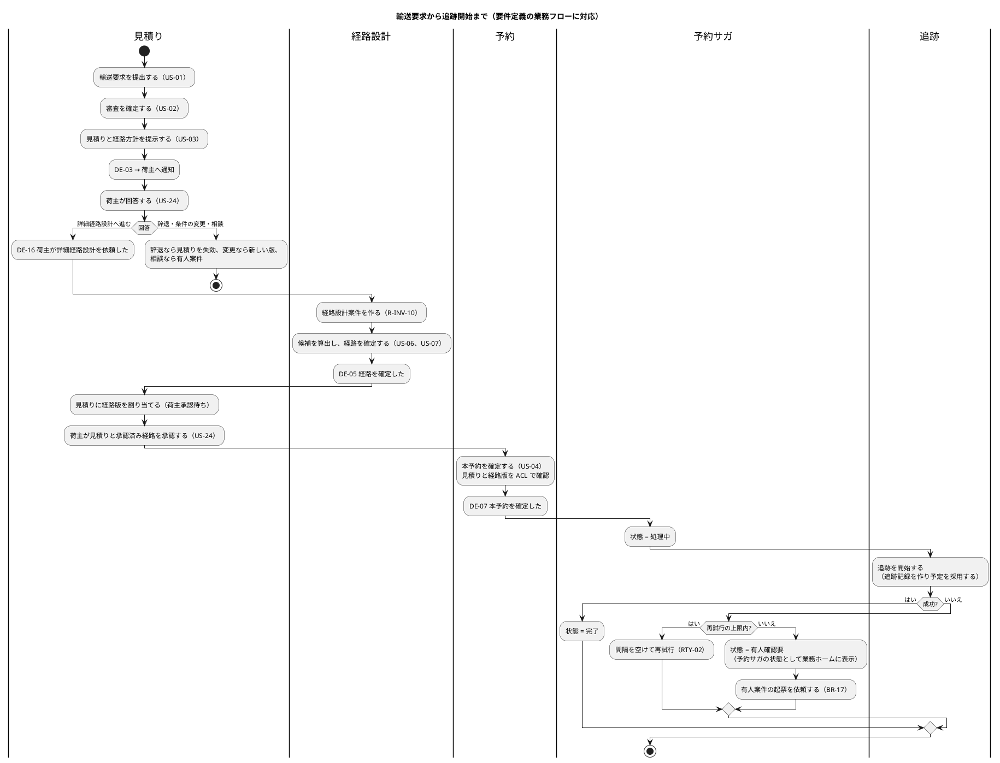

| 段階 | 状態の持ち主 | 失敗時の扱い |
| :--- | :--- | :--- |
| 提出〜見積りの提示 | 輸送要求・見積りの各集約 | 利用者に不足条件を示す（同期） |
| 荷主の回答〜経路の確定 | 見積り・経路設計案件の各集約（DE-16、DE-05 で連携） | イベントの再配信で回復する。受信側は冪等（R-INV-10、B-INV-12） |
| 荷主の承認 | 見積り | 不足条件を示して承認しない（同期） |
| 本予約の確定 | 貨物予約 | 不足条件を示して確定しない（同期） |
| 追跡の開始 | 予約サガ | 再試行し、回復しなければ有人確認要 |

予約サガが有人確認要になったときは、予約サガの状態そのもの（予約コンテキストの表）を業務ホームの一覧の正とし、有人案件の起票はそれに追加して行う。追跡の開始と同じ原因で有人案件の起票（追跡コンテキスト）も失敗する場合があるため、起票の成否に依存せず未処理が見えるようにする。

## リポジトリ

集約ごとにリポジトリのインターフェースを domain 層に置き、実装を infrastructure 層に置く。

| コンテキスト | リポジトリ | 主な操作 |
| :--- | :--- | :--- |
| 見積り | 輸送要求リポジトリ、見積りリポジトリ | ID で取得、期待版で保存、輸送要求の有効な見積りを取得 |
| 経路設計 | 経路設計案件リポジトリ、航海リポジトリ、接続時間規則リポジトリ | ID で取得、期待版で保存、航海番号を参照する確定済み経路版の案件を取得 |
| 予約 | 貨物予約リポジトリ | ID・追跡番号で取得、コマンド ID で確定結果を取得、期待版で保存 |
| 追跡 | 追跡記録・有人案件・照会記録・営業日カレンダーのリポジトリ | 追跡番号で取得、期待版で保存、期限を過ぎた未受領案件を取得、荷主企業の問い合わせを取得 |
| 通知 | 通知リポジトリ | イベント ID と宛先で既存の通知を取得（N-INV-02） |
| アクセス・監査 | 企業・利用者・参照許可リポジトリ、監査記録リポジトリ（追記のみ）、KPI 計測記録リポジトリ | ID・メールアドレスで取得、予約と荷受人で有効な許可を取得 |

## 後続工程への引継ぎ

| ID | 引継ぎ内容 | 引継ぎ先 |
| :--- | :--- | :--- |
| DM-01 | 集約ごとの表、版と追記専用の表現、イベント発行記録・処理済みコマンド・サガ状態の表 | データモデル設計 |
| DM-02 | 画面ごとに使うコマンド・クエリと、開示範囲ごとの表示項目 | UI 設計 |
| DM-03 | 不変条件（Q-INV、R-INV、B-INV、T-INV、SC-INV、IA-INV）を Cucumber のシナリオと単体テストに対応させる | テスト戦略 |
| DM-04 | 鮮度の許容範囲、有人案件の受領期限の既定値、監査記録の保持期間 | 非機能要件 |
| DM-05 | 追跡状態の状態名、必要最小接続時間の値と管理責任者 | 業務責任者への確認 |

## AI の仮定と要確認

- **呼び分け**: 本予約前を「輸送要求」、本予約以後を「貨物予約」と呼び分けた。要件定義とユーザーストーリーの「予約版」（本予約前）の表記は、次の要件の改訂で揃えることを提案する。
- **業務の順序**: 初版は「審査 → 経路確定 → 見積り」の順で設計していたが、要件定義のエンドツーエンド業務フローと Unit 定義（U2 の入力は見積り済み輸送要求）に反していたため、分析成果物レビュー（2026-10-01、R-01）で「審査 → 見積りと経路方針の提示 → 荷主の回答 → 詳細経路設計 → 荷主の承認 → 本予約」に改めた。
- **有人案件の置き場所**: 追跡コンテキストに置いた（バックエンドアーキテクチャの仮定と同じ）。予約・経路設計・外部データの各コンテキストからの起票が追跡に集まるため、第 2 段階の例外対応で分ける。
- **本予約と船腹確保**: 本予約は A 社と荷主の輸送条件の確定とし、運送会社の船腹確保とは区別した。業務責任者の確認が必要である（R-28）。
- **照会記録のまとめ方**: 顧客 Web の照会を 30 分単位でまとめ、24 時間以内の問い合わせを有人対応へ移ったとみなす規則（IR-INV-01）は KPI-02 の算式の解釈であり、プロダクト責任者の確認が必要である。
- **荷主の見積り承認**: BR-01 の「荷主担当者 1 名の承認」を、承認済み経路を割り当てた後の見積りへの荷主承認として表した（US-24）。
- **経路候補探索**: MVP は航海の一覧から確定的に列挙するだけとし、最適化はしない（インセプションデッキのスコープ外）。候補が多すぎる場合の絞り込みは UI 設計とあわせて検討する。
