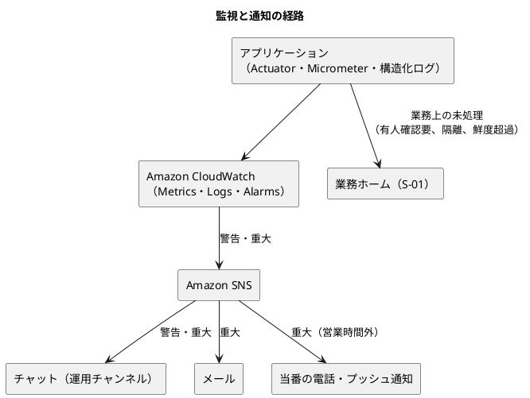
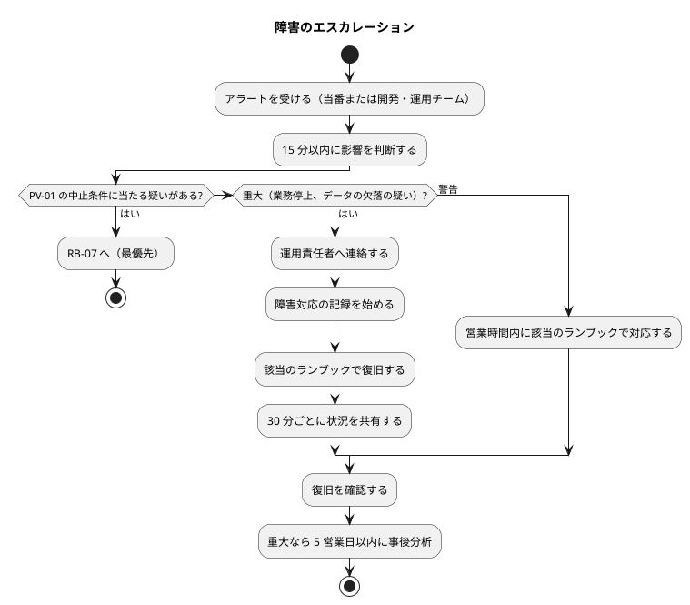
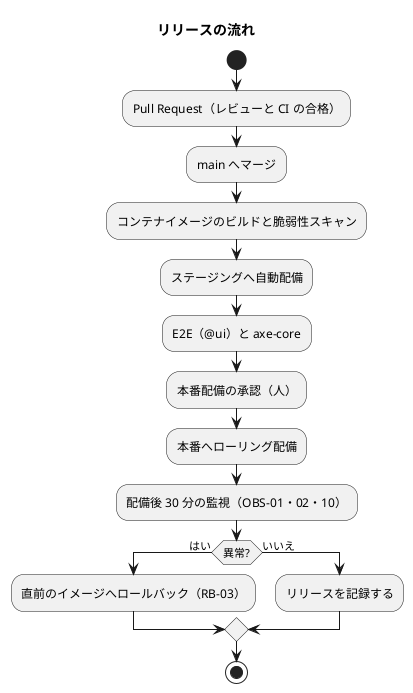

# cargo-tracker 運用要件

## 位置づけ

本書は、[非機能要件](non_functional.md) の目標値（SLO、RPO・RTO、監視の閾値、保持期間）を、日々の運用と障害時の手順に落とし込む。あわせて、[データモデル](data_model.md) の引継ぎ DA-02（DB 利用者と権限の初期化）と、[インフラ設計](architecture_infrastructure.md) の引継ぎ AI-03（監視の閾値、通知先、障害時・バックアップ・リストアの手順）に答える。

| 方針 | 内容 | 根拠 |
| :--- | :--- | :--- |
| 自動化を前提にする | 繰り返す作業は定期処理か運用タスクにする。手作業は判断が必要なものに限る | 運用要件定義ガイド |
| 手順は正式なタスクにする | 本番・ステージングへの操作は、運用手順書（`docs/operation/cargo-tracker/`）に定義したタスクだけで行う。一時的なスクリプトを作らない | CLAUDE.md「環境操作は運用手順書に従う」 |
| 本番は確認必須 | 本番への配備・設定変更・データ操作は人の承認を経る | 開発ガイド（AI-DLC 版） |
| パイロットの中止条件を最優先にする | 権限外開示・外部原本消失・重複予約（PV-01）の疑いは、通常の障害より先に扱う | PV-01 |

本書は運用の要件と手順の骨子を定める。実際の手順書と運用タスクは、`operating-*` スキルで `docs/operation/cargo-tracker/` と `ops/` に作る（後続工程への引継ぎ）。

## 運用体制

### 役割

| 役割 | 担う人 | 責任 |
| :--- | :--- | :--- |
| 運用責任者 | A 社 運用部門 | 運用全体の判断、重大障害の指揮、パイロット中止の判断の起案 |
| 追跡管理者 | A 社 運用部門 | 確認中・鮮度超過の追跡、実績の訂正、有人案件の対応 |
| データ責任者 | A 社 運用部門 | 外部原本の取込、隔離・差異の判断、復旧照合 |
| カスタマーサポート | A 社 | 顧客照会の受付と回答、有人案件の起票 |
| システム管理者 | A 社 IT 部門 | 利用者・権限の管理、TOTP の再登録 |
| 監査担当者 | A 社 管理部門 | 監査証跡の照会、権限の定期見直しの確認 |
| 開発・運用チーム | 開発者と AI エージェント | 配備、監視の一次対応、障害の技術的な復旧、事後分析 |
| 当番（オンコール） | 開発・運用チームの持ち回り | 営業時間外の重大アラートの一次対応 |

### 代行者

少人数に依存する役割には、不在時の代行者を決めておく（レビュー R-29）。

| 役割 | 代行の決め方 |
| :--- | :--- |
| 追跡管理者（訂正の二者確認の 2 人目） | 追跡管理者を 2 名以上に保ち、さらに 1 名を代行者として登録する。代行者も追跡管理者の役割を持つ（BR-15） |
| データ責任者（取込・隔離の判断・復旧照合） | 主担当と副担当の 2 名を登録する。両方が不在の日は取込を翌営業日に回し、FRS-02 の確認中を有人窓口で説明する |
| 運用責任者 | 不在時の判断者（上位の責任者）を月ごとに決めて運用チャンネルに示す |

### 対応時間

| 時間帯 | 体制 | 対象のアラート |
| :--- | :--- | :--- |
| 営業時間（平日 09:00〜18:00 JST） | 運用部門と開発・運用チーム | 警告と重大のすべて |
| 営業時間外 | 当番が通知を受ける。着手の目標は 1 時間以内（最善努力）。当番はシステムのアラートだけを受け、顧客の業務案件（有人案件）は受けない。営業時間外の優先度高の案件は自動で受付番号と次回更新日時を返す（SVC-05） | 重大だけ |

月の稼働率 99.5%（AVL-02、月の停止許容 約 3.6 時間）は、営業時間外の重大障害に 1 時間以内に着手し、2 時間以内に復旧すれば（RCV-04）、月 1 回の重大障害まで守れる水準である。営業時間外の体制を常駐にするかは、パイロットの利用状況を見て運用責任者が判断する。

## 定常運用

自動で行う作業と、人が判断する作業を分ける。

### 日次

| 作業 | 方法 | 担当 | 根拠 |
| :--- | :--- | :--- | :--- |
| 外部原本の取込 | データ責任者が S-16 で承認済みファイルを取り込む。取込がなければ 11:00 JST に通知 | データ責任者（手動）、通知は自動 | BR-18、FRS-04 |
| 隔離・差異の判断 | S-17 で隔離・差異を確認し、採用・却下を判断する | データ責任者 | BR-12、OBS-06 |
| 確認中・鮮度超過の追跡の確認 | S-11 の一覧を確認し、補正または有人案件へ | 追跡管理者 | FRS-02、OBS-07 |
| 有人案件の確認 | S-14 で未受領・期限間近の案件を確認する | カスタマーサポート、業務担当者 | SVC-01〜04 |
| 監査記録の書き出し | 前日分を S3（Object Lock）へ書き出し、ハッシュを記録する | 定期処理（自動） | AUD-03 |
| 監査記録の欠落の照合 | 業務の状態変更と監査記録の件数を照合する。欠落は重大アラート | 定期処理（自動） | AUD-04、OBS-08 |
| 保持期間を過ぎた記録の掃除 | イベント発行記録（30 日）、処理済みコマンド（90 日）、予約サガ（90 日）を削除する | 定期処理（自動） | RET-05〜07 |
| アラートの振り返り | 前日の警告・重大の一覧を確認し、対応漏れがないか見る | 開発・運用チーム | — |

### 週次

| 作業 | 方法 | 担当 |
| :--- | :--- | :--- |
| SLO の確認 | 稼働率・応答時間・エラー率の週次の値を確認し、エラーバジェットの消費を見る | 開発・運用チーム |
| 有人案件の傾向の確認 | 種類別の件数、期限遵守を確認する（PV-01 の例外報告の材料） | 運用責任者 |
| KPI の確認 | S-22 で KPI-01・KPI-02 の週次の値を確認し、PV-01 の判定の材料にする | 監査担当者、運用責任者 |
| 通知の失敗の確認 | 送信に失敗した通知とバウンスを確認し、宛先の誤りを直す | システム管理者 |

### 月次

| 作業 | 方法 | 担当 | 根拠 |
| :--- | :--- | :--- | :--- |
| 依存・イメージの脆弱性の確認 | CI のスキャン結果と本番イメージの再スキャン。CRITICAL は 7 日、HIGH は 30 日以内に修正 | 開発・運用チーム | SEC-18 |
| 容量の確認 | DB の容量・接続数、S3 の容量、ECS の CPU・メモリの推移を確認する | 開発・運用チーム | SCL-01〜04 |
| 月次スナップショットの確認 | 月 1 回の RDS スナップショットが取得され、大阪へ複製されたことを確かめる | 定期処理と確認 | RET-10、PRV-02 |
| 計画停止（必要なとき） | 日曜 02:00〜04:00 JST。7 日前に告知 | 開発・運用チーム（承認: 運用責任者） | AVL-03 |
| SLO の報告 | 月間の稼働率と主要指標を運用責任者へ報告する | 開発・運用チーム | AVL-02 |

### 四半期・半期・年次

| 周期 | 作業 | 担当 | 根拠 |
| :--- | :--- | :--- | :--- |
| 四半期 | 利用者と権限の見直し（不要な利用者、役割の過不足、職務分離） | システム管理者、確認は監査担当者 | BR-15、IA-INV-01 |
| 半期 | 時点復旧の訓練（RB-02）と AZ 切替の訓練（RB-01）。RTO を測る | 開発・運用チーム | RCV-08 |
| 年次 | 保持期間を過ぎた取引記録・監査記録・外部原本の削除（RET-01〜04）と、個人情報の削除・匿名化（PRV-06）。追記専用の表はアプリケーションの DB 利用者では削除できないため、マイグレーション用の DB 利用者で `retention:purge` を実行する | 開発・運用チーム（承認: 管理・コンプライアンス責任者） | RET、PRV-06 |
| 年次 | 翌年の営業日カレンダーの登録（11 月末まで） | 運用責任者 | SVC-07 |
| 年次 | 侵入テスト（パイロット開始前の 1 回に加えて、大きな変更があった年） | IT 責任者 | SEC-19 |

## 監視と通知

### 通知の経路

業務上の未処理（有人案件、隔離、鮮度超過）は、アラートとしてだけでなく、担当者の業務ホーム（S-01）に一覧で表示する。アラートは「対応が必要な異常」だけに絞り、アラート疲れを防ぐ。

### アラートと対応

非機能要件の監視指標（OBS-01〜10）に、重要度・通知先・対応手順を対応させる。

| 指標 | 警告の通知先 | 重大の通知先 | 対応手順 |
| :--- | :--- | :--- | :--- |
| OBS-01 応答時間 | 運用チャンネル | 運用チャンネル、メール、当番 | RB-03（配備起因なら）、容量の確認 |
| OBS-02 5xx の割合 | 運用チャンネル | 運用チャンネル、メール、当番 | RB-03 |
| OBS-03 未完了のイベント配信 | 運用チャンネル | 運用チャンネル、メール、当番 | RB-04 |
| OBS-04 止まった予約サガ | 運用チャンネル | — | RB-05 |
| OBS-05 有人確認要・受領期限の超過 | 運用チャンネル、業務ホーム | 上位の運用責任者（escalation） | 有人案件の対応（SVC） |
| OBS-06 隔離中の外部原本 | 業務ホーム | データ責任者へメール | 日次の隔離判断 |
| OBS-07 鮮度を超えた追跡 | 業務ホーム | 追跡管理者へメール | 日次の確認、RB-06（外部停止なら） |
| OBS-08 監査記録の欠落 | — | 運用チャンネル、メール、当番 | RB-08 |
| OBS-09 認証の失敗・ロック | 運用チャンネル | 運用チャンネル、メール、当番 | RB-09 |
| OBS-10 ヘルスチェック | 運用チャンネル | 運用チャンネル、メール、当番 | RB-01、RB-03 |
| OBS-11 通知メールの失敗・バウンス | 運用チャンネル | 運用チャンネル、メール | 週次の通知の失敗の確認、SES の送信状態の確認 |

運用チャンネルに使うチャットツールは、A 社の標準に合わせて決める（要確認）。

### エスカレーション

## バックアップと復旧

| 対象 | 方式 | 頻度・保持 | 複製 | 根拠 |
| :--- | :--- | :--- | :--- | :--- |
| DB | RDS の自動バックアップと時点復旧 | 継続（RPO 5 分）、35 日 | 大阪リージョンへ自動バックアップを複製 | RCV-01、RET-10、PRV-02 |
| DB | 手動スナップショット | 月 1 回、1 年 | 大阪リージョンへ複製 | RET-10 |
| 外部原本 | S3 のバージョニングと Object Lock（コンプライアンスモード） | 取得から 7 年 | 大阪リージョンへ複製 | RCV-02、RET-03 |
| 監査記録の書き出し | S3（Object Lock） | 日次、7 年 | 大阪リージョンへ複製 | AUD-03、RET-02 |
| インフラの構成 | Terraform（リポジトリで版管理） | 変更のたび | — | インフラ設計 |
| アプリケーション | ECR のコンテナイメージ | 本番に出した版を 1 年保持 | — | RB-03 のロールバック |
| シークレット | Secrets Manager | — | 復旧手順に再作成の方法を記す | — |

復旧の訓練（半期、RCV-08）では、RB-02 の手順で別のインスタンスへ時点復旧し、RB-02 の照合まで行って RTO を測る。訓練の結果は手順書に反映する。

## 障害対応の手順（ランブック）

各ランブックの詳細な手順は運用手順書に書く。本書では検知・初動・復旧・確認の骨子を定める。

| ID | 事象 | 検知 | 初動 | 復旧 | 確認 |
| :--- | :--- | :--- | :--- | :--- | :--- |
| RB-01 | AZ の障害、タスクの停止 | OBS-10、RDS のイベント | RDS の自動切替と ECS のタスクの再配置を見守る | 15 分で戻らなければ、RDS の手動フェイルオーバーとタスクの再起動 | ヘルスチェック、主要画面の表示、未完了のイベント配信の再開 |
| RB-02 | DB の論理障害・誤操作 | 利用者の報告、監査記録、整合性の確認 | 書き込みを止める（メンテナンス表示に切り替え） | 障害の直前の時点へ別インスタンスに時点復旧し、切り替える（目標 2 時間、RCV-04） | 時点以後の外部原本（S3）と、本予約の確定・荷主の承認・実績の採用の構造化ログ（CloudWatch Logs）を照合し、欠けたものを再処理する（RCV-07）。顧客に示した追跡番号が復元されたことを確かめる |
| RB-03 | 配備後の不具合（5xx、応答の悪化） | OBS-01、OBS-02、配備後の監視 | 配備との関係を確認する | 直前のイメージへロールバックする（変更管理） | エラー率・応答時間の回復 |
| RB-04 | 未完了のイベント配信の滞留 | OBS-03 | 購読側の例外をログで確認する | 原因を直して再配信を待つ。直せない場合は該当のイベントを有人案件にする | 滞留件数が 0 になる |
| RB-05 | 予約サガの停止・有人確認要 | OBS-04、OBS-05 | 予約と追跡の状態を確認する | 原因を直して再試行するか、有人案件で追跡を手動で開始する | 予約サガが完了、または有人案件で対応中 |
| RB-06 | 外部情報源の停止・ファイル未着 | FRS-04 の通知、OBS-07 | 停止期間を記録する | 手動情報の登録（BR-08）と有人案件で業務を続ける | 復旧後に復旧照合（US-15）を完了する |
| RB-07 | パイロット中止条件の疑い（権限外開示、外部原本の消失、重複予約） | 利用者の報告、監査記録、照合の異常 | 運用責任者へ即時に連絡する。影響の範囲を特定し、拡大を止める（該当機能の停止、参照許可の停止、該当アカウントの停止） | 原因を直す。PV-01 の手続き（パイロットの停止と、原因・再開条件の審査）を運用責任者が起案する | 影響を受けた顧客への連絡、監査記録の保全、事後分析 |
| RB-08 | 監査記録の欠落 | OBS-08 | 欠落した対象と期間を特定する | 原因を直す。欠落は補わず、異常として記録する（改ざんと区別するため） | 欠落の範囲と原因を記録し、監査担当者へ報告する |
| RB-09 | 認証への攻撃・アカウントの乗っ取りの疑い | OBS-09、利用者の報告 | 該当アカウントを利用停止にする。攻撃元を WAF で遮断する | 本人確認のうえ password の再設定と TOTP の再登録（SEC-10） | 不審な操作の有無を監査記録で確認する |

### 事後分析

重大な障害と RB-07 は、5 営業日以内に事後分析を行う。誰かを責めずに、原因、検知・対応の時間、再発防止策を記録し、ランブック・監視・設計書に反映する（AI-DLC の「修正はガードレールにする」）。

## 変更管理

### リリースの流れ

| 変更の種類 | 例 | 承認 | 時期 |
| :--- | :--- | :--- | :--- |
| 通常の変更 | 機能の追加・修正、依存の更新 | 開発・運用チームのレビューと、本番配備の承認 | 営業時間内（金曜の午後を避ける） |
| 影響の大きい変更 | DB の構造の変更（列の削除を伴う段階）、認証・認可の変更、計画停止を伴う変更 | 上記に加えて運用責任者の承認 | 計画停止の枠、または営業時間内の早い時刻 |
| 緊急の変更 | CRITICAL の脆弱性、重大障害の修正 | 当番と運用責任者の承認。事後にレビューする | 随時 |

### ロールバック

| 対象 | 方法 |
| :--- | :--- |
| アプリケーション | ECR に保持した直前のイメージで再配備する。どのリリースでも、直前の版へ戻せることを配備前に確認する |
| DB の構造 | 前の版のアプリケーションと互換のある変更（追加 → 移行 → 削除）に限っているため、アプリケーションだけを戻せばよい。DB の変更そのものは戻さず、前進の修正で直す |
| 設定・インフラ | Terraform の前の版を適用する |

ロールバックの手順を持たないリリースは行わない。

## DB 利用者と権限の初期化（DA-02）

| DB 利用者 | 用途 | 権限 |
| :--- | :--- | :--- |
| マスター利用者 | RDS の作成時のみ。初期化のタスクだけが使う | すべて（普段は使わない。資格情報は Secrets Manager で保管し、使用を監査する） |
| マイグレーション利用者 | Flyway によるスキーマの作成・変更 | 業務スキーマと `platform` の所有者 |
| アプリケーション利用者 | アプリケーションの実行時（ADR-001 改訂の「1 つの DB 利用者」） | 各スキーマの SELECT・INSERT・UPDATE・DELETE。ただし追記専用の表は SELECT・INSERT のみ |

初期化の手順は次のとおりとし、運用タスクとして実装する。

1. マスター利用者でマイグレーション利用者とアプリケーション利用者を作る（`db:init`、環境ごとに 1 回）。
2. 配備のたびに、Flyway をマイグレーション利用者で実行し、スキーマと表を作る。
3. 同じ Flyway の実行の中で、PostgreSQL 用の `afterMigrate` コールバックがアプリケーション利用者に権限を与える。追記専用の表は、表の定義の印（`COMMENT ON TABLE ... IS 'append-only'`）で選んで UPDATE・DELETE を外す。ステージング・本番では Flyway のプレースホルダー `requireappuser=true` にし、アプリケーション利用者がなければマイグレーションを失敗させる（Bolt 3）。Flyway とアプリの DB 利用者を同じ配備の中でどう分けるか（アプリの中で `spring.flyway.user` を分けるか、配備の前の別ジョブにするか）は人の判断待ち（D-9）。追記専用の表（`identity.audit_record`、`identity.kpi_baseline`、`quotation.transport_request_version`、`booking.booking_version`、`external_data.receipt`）には SELECT・INSERT だけを与え、`tracking.milestone` には DELETE を与えない（データモデル、ADR-007）。
4. 新しい表を足すときは、同じ変更でコールバックも更新する。権限の付与が表の作成と同じ配備で行われるため、配備の途中で表を使えない・保護が外れる時間ができない。
5. 配備後に `db:grants:verify` で、追記専用の表の権限を確かめる（PostgreSQL の統合テストと同じ確認）。

## アカウントの運用

| 作業 | 手順 | 担当 | 根拠 |
| :--- | :--- | :--- | :--- |
| 企業の登録 | 契約を確認して企業を登録する | システム管理者 | US-16 |
| 利用者の登録 | 企業の管理担当者からの申請を受けて登録し、初回ログインで TOTP を登録させる | システム管理者 | SEC-09、US-16 |
| 利用停止 | 退職・契約終了の連絡を受けたら当日中に利用停止にする | システム管理者 | IA-INV-04 |
| TOTP の再登録 | 事前に決めた別経路（所属企業の管理担当者への確認など）で本人確認し、登録を解除する。本人に通知する | システム管理者 | SEC-10 |
| 権限の定期見直し | 四半期ごとに、役割と担当範囲の一覧を企業ごとに確認する | システム管理者、監査担当者 | 定常運用 |

## 運用タスクの一覧

CLAUDE.md の規律に従い、次の作業を正式な運用タスク（Gulp タスク）として作り、運用手順書に載せる。名前は既存のタスク（`okf:check`、`sonar-local:scan` など）と同じ `領域:操作` の形にした案である。環境（ステージング・本番）は引数で指定する。

| タスク（案） | 内容 | 対応 |
| :--- | :--- | :--- |
| `db:init` | DB 利用者（マイグレーション用・アプリケーション用）の作成。権限の付与は Flyway のコールバックが行う | DB 利用者と権限の初期化 |
| `db:grants:verify` | 追記専用の表の権限を確認する | 同上 |
| `deploy:release` / `deploy:rollback` | 指定したイメージの配備と、直前のイメージへの戻し | 変更管理、RB-03 |
| `db:restore:pitr` | 指定時点への時点復旧と切替 | RB-02 |
| `recovery:reconcile` | 時点復旧後の外部原本・監査記録との照合 | RB-02、RCV-07 |
| `db:failover:drill` | RDS の手動フェイルオーバー（訓練） | RB-01 |
| `maintenance:on` / `maintenance:off` | メンテナンス表示の切替 | RB-02、計画停止 |
| `audit:export:verify` | 監査記録の書き出しとハッシュの確認 | AUD-03 |
| `calendar:register` | 翌年の営業日カレンダーの登録 | SVC-07 |
| `kpi:baseline:register` | パイロット開始前の基準値の登録（US-21） | KPI |
| `retention:purge` | 保持期間を過ぎた記録の削除（年次、承認付き） | RET |
| `user:disable` | 緊急時の利用停止 | RB-07、RB-09 |

## 後続工程への引継ぎ

| ID | 引継ぎ内容 | 引継ぎ先 |
| :--- | :--- | :--- |
| OP-01 | 運用手順書（ランブック RB-01〜09 の詳細手順）の作成 | `operating-deploy`、`operating-backup`、`docs/operation/cargo-tracker/` |
| OP-02 | 運用タスクの実装 | `operating-script` |
| OP-03 | 監視・アラーム・通知の IaC | `operating-provision` |
| OP-04 | CI/CD のパイプライン（リリースの流れ、ロールバック） | `operating-cicd` |
| OP-05 | チャットツール、当番の体制と通知方法の決定 | 運用責任者 |

## AI の仮定と要確認

- **営業時間外の体制**: 営業時間外は当番が重大アラートだけを受け、1 時間以内の着手を最善努力とした。常駐体制が必要かは運用責任者が判断する。
- **チャットツール**: A 社の標準のチャットツールは確認していない（OP-05）。
- **パイロット中止の手続き**: PV-01 の停止と再開の審査は、経営・業務改革委員会が判断する（要件定義）。本書の RB-07 は、その判断までの拡大防止と情報の保全を定めたものである。
- **当番の担い手**: 開発・運用チームの持ち回りとしたが、本リポジトリの実際の体制では担い手が限られる。体制が決まったら見直す。
