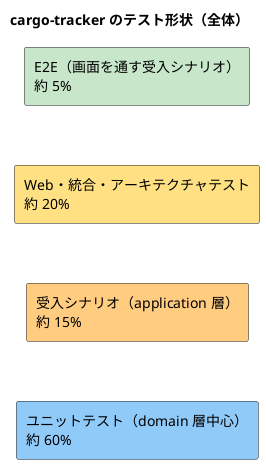
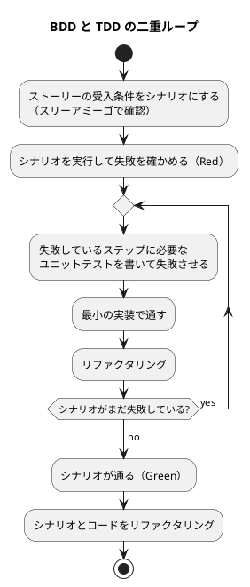
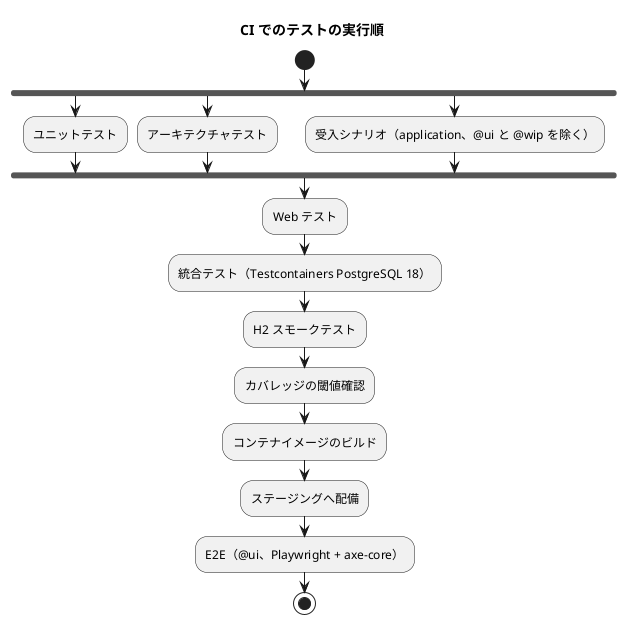

# cargo-tracker テスト戦略

## 位置づけ

本書は、各設計書から引き継いだテストの項目に答え、TDD と BDD（ADR-009）を一体にした開発の進め方を決める。

| 引継ぎ | 出典 | 本書の節 |
| :--- | :--- | :--- |
| AB-05 アーキテクチャテスト（パッケージ依存、マッパーの SQL による他スキーマ参照の禁止） | バックエンドアーキテクチャ | アーキテクチャテスト |
| AF-03 アクセシビリティ検証の配分と手動確認の手順 | フロントエンドアーキテクチャ | アクセシビリティテスト |
| TS-03 テストの配分、カバレッジ、ArchUnit と Modulith、Cucumber の階層とタグ | 技術スタック | テスト形状、BDD、カバレッジ |
| DM-03 不変条件と Cucumber シナリオ・単体テストの対応 | ドメインモデル | 不変条件とテストの対応 |
| DA-03 H2 と PostgreSQL へのマイグレーション適用、追記専用・CHECK・一意制約のテスト | データモデル | 統合テスト |
| UI-HO-01、UI-HO-03 主要フローの E2E、顧客向け HTML の開示テスト | UI 設計 | E2E、Web テスト |
| 非機能要件の検証方法（PERF、RCV、RTY、FRS、SVC、AUD、OBS） | 非機能要件 | 非機能要件のテスト |

2026-10-01 の [分析成果物レビュー](../../review/cargo-tracker/analysis_review_20261001.md) を受けて、業務の順序（R-01）、重複確定・session・イベント配信の検証（R-03、R-07、R-08）、非機能要件との接続（R-21）、対応表の漏れ（R-22）を反映した。

## テスト形状

全体は **ピラミッド型** とする。ドメインモデル（ADR-002）とヘキサゴナルの 4 パッケージ構成をとり、業務規則の大半がドメイン層にあるためである（テスト戦略ガイド）。ただし、ADR-002 でパターンを変えたコンテキストは形を変える。

| コンテキスト | パターン（ADR-002） | 形 | 重点 |
| :--- | :--- | :--- | :--- |
| 見積り、経路設計、予約、追跡 | ドメインモデル | ピラミッド | 集約・ドメインルールのユニットテスト。境界値（BR-10、BR-11）を網羅する |
| アクセス・監査 | 単純なモデル | ダイヤモンド | 認証・認可・参照許可の Web テストと統合テスト |
| 外部データ | トランザクションスクリプト | 統合テスト中心 | 冪等性・隔離・照合を実 DB で確かめる統合テスト |



割合はテストの件数の目安であり、目標値ではない。実行時間の配分（CI の節）と合わせて、Bolt ごとの実績で見直す。

### テストの深さ

AI-DLC のテスト戦略の水準（リリース・イテレーション計画ガイド AI-DLC 版）は、本番機能を Standard 以上とする。パイロット中止の条件（PV-01: 権限外開示・外部原本消失・重複予約）に直結する箇所は Comprehensive にする。

| 水準 | 対象 |
| :--- | :--- |
| Comprehensive | 予約確定の条件と冪等性（BR-01、BR-10、B-INV-01〜03）、制約適合判定（BR-11、Golden dataset）、開示制御（BR-07）、外部原本の冪等性・隔離・照合（BR-12）、認証・ロック・session 失効（BR-14）、訂正の二者確認（BR-05） |
| Standard | 上記以外の本番機能 |

## テストレベル

各レベルの責務を分け、同じことを複数のレベルで重ねて確かめない。

| レベル | 対象 | 外部依存 | 確かめること | 確かめないこと | ツール |
| :--- | :--- | :--- | :--- | :--- | :--- |
| ユニット | domain の集約・値オブジェクト・ドメインルール | なし（純粋なオブジェクト） | 不変条件、状態遷移、境界値 | 永続化、画面 | JUnit 6、AssertJ |
| 受入シナリオ（application） | application の入力ポート | リポジトリはメモリ上の実装、Clock は固定 | ユーザーストーリーの受入条件、認可の判断、冪等コマンド、期待版 | SQL、HTML | Cucumber（日本語 Gherkin） |
| Web | interfaces.web の画面 | application はモックまたはメモリ実装 | 画面の描画、URL ごとの認可、開示範囲、エラー要約、確認画面の項目 | 業務規則の詳細 | Spring MockMvc |
| 統合 | infrastructure（マッパー、マイグレーション、イベント配信、取込、S3 アダプター） | Testcontainers の PostgreSQL 18 | SQL の正しさ、制約、権限、イベントの永続化と再配信、ファイル取込 | 業務規則の詳細 | Testcontainers、Spring Modulith Test |
| アーキテクチャ | コード全体の構造 | なし | 依存の向き、モジュール境界、ドメインのフレームワーク非依存、他スキーマ参照の禁止 | 振る舞い | ArchUnit、Spring Modulith |
| E2E（画面を通す受入シナリオ） | アプリケーション全体 | PostgreSQL、実ブラウザ | 主要フローが画面から最後まで通ること、部分更新、アクセシビリティの自動検査 | 規則の網羅（下のレベルで済ませる） | Cucumber + Playwright、axe-core |
| スモーク（H2） | アプリケーションの起動 | H2 | H2 でアプリが起動し、マイグレーションが通ること（ADR-007） | SQL の正しさ | Spring Boot Test |

## BDD（ADR-009）

### 開発の流れ

ストーリーごとに、外側の受入シナリオと内側の TDD を二重のループで回す。



### シナリオの階層

| 階層 | タグ | ステップ定義の呼び先 | 使う場面 |
| :--- | :--- | :--- | :--- |
| 業務ルール | （既定） | application の入力ポート。リポジトリはメモリ上の実装、Clock は固定。他のコンテキストへのイベントはテスト用の同期の配信で届け、シナリオの中で「イベントが配信される」ステップとして明示する | 受入条件の大半。速く、規則を網羅する |
| 画面 | `@ui` | Playwright で実ブラウザを操作し、PostgreSQL を使う | 主要フローの最後までの通し、確認画面、部分更新、アクセシビリティの自動検査 |

同じ受入条件を両方の階層で書かない。画面の階層は、ストーリーごとに主成功シナリオ 1 本と、画面に固有の条件（確認の領域、エラー要約、開示範囲の見え方）に限る。

業務ルールの階層では本番の非同期の購読（`@ApplicationModuleListener`）が動かないため、イベント配信そのもの（コミット後の配信、再配信、受信側の冪等性）は統合テストで確かめる（ADR-003）。session の失効や認可の即時反映のように、フレームワークと DB に依存する受入条件も、業務ルールの階層ではなくセキュリティの統合テストで確かめる。

### タグの規約

| タグ | 意味 | 例 |
| :--- | :--- | :--- |
| `@US-nn` | ユーザーストーリー（必須。Feature に付ける） | `@US-04` |
| `@US-nn-ACm` | 受入条件の番号（必須。シナリオに付ける。番号は user_story.md の受入条件の順） | `@US-04-AC2` |
| `@NFR-<ID>` | 非機能要件の ID（該当する統合テスト・性能テストに付ける） | `@NFR-RTY-02` |
| `@BR-nn` | 業務ルール（該当するシナリオに付ける） | `@BR-10` |
| `@<不変条件 ID>` | ドメインモデルの不変条件 | `@B-INV-03` |
| `@must`・`@should`・`@could` | ストーリーの優先度（Feature に付ける） | `@must` |
| `@ui` | 画面を通す階層 | — |
| `@wip` | 作業中。CI の必須の実行から外す | — |
| `@golden` | Golden dataset による経路の検証 | — |

`@wip` のシナリオを残したまま Bolt を完了しない。受入条件ごとに `@US-nn-ACm` のシナリオがあることを、CI で受入条件の数と照合して確かめる（ADR-009 のコンプライアンス）。

### 置き場所とステップ定義

```text
src/test/resources/features/
├── quotation/        US-01〜03
├── routing/          US-06〜08、golden/（Golden dataset）
├── booking/          US-04、US-05
├── tracking/         US-09〜13、US-20
├── identity/         US-16〜19
└── external_data/    US-14、US-15

src/test/java/.../<context>/acceptance/   コンテキストごとのステップ定義
src/test/java/.../shared/acceptance/      共通ステップ（ログイン、時刻の固定、企業・利用者の準備）
```

ステップ定義は自分のコンテキストの入力ポートだけを呼ぶ。前提の準備で他のコンテキストのデータが必要なときは、そのコンテキストの公開 API を使う（ADR-001 の境界をテストでも守る）。

### シナリオの例

US-04 の受入条件と BR-10 の境界を、日本語 Gherkin で書いた例を示す。

```gherkin
# language: ja
@US-04 @must
機能: 予約を確定する
  荷主として、合意した見積りと承認済み経路で本予約を確定したい。
  追跡可能な輸送を開始するためだ。

  背景:
    前提 荷主企業 "荷主株式会社" の荷主担当者 "山田" が見積りを承認している
    かつ 経路設計案件の経路版 1 が確定している
    かつ 見積りの有効期限は "2026-10-08T09:00:00Z" である

  @BR-01 @BR-10 @B-INV-01
  シナリオ: 有効期限より前の確定は成功する
    前提 現在時刻は "2026-10-08T08:59:59Z" である
    もし 営業担当者 "佐藤" が本予約を確定する
    ならば 予約版 1 と一意な追跡番号が記録される

  @BR-10 @B-INV-02
  シナリオ: 有効期限と同時刻の確定は失効として拒否される
    前提 現在時刻は "2026-10-08T09:00:00Z" である
    もし 営業担当者 "佐藤" が本予約を確定する
    ならば 予約は確定されない
    かつ 見積りの失効と再見積りの必要性が示される

  @B-INV-03
  シナリオ: 同じ確定要求の再送は予約を重複生成しない
    前提 コマンド "cmd-001" で本予約を確定済みである
    もし コマンド "cmd-001" で本予約を再び確定する
    ならば 予約は 1 件のままで、既存の追跡番号が返される
```

### Golden dataset（経路設計）

要件定義の Golden dataset（代表案件を複数の経路設計者とコンプライアンス担当者が承認したもの）は、`@golden` のシナリオアウトラインとして例の表で表す。期待候補・除外候補・除外理由を例の列にし、データの版を Feature の説明に書く。データそのものは業務責任者が決める（要件定義 H-9 の残作業）。

```gherkin
# language: ja
@US-06 @golden @BR-11
機能: 経路候補の制約適合判定（Golden dataset v0）

  シナリオアウトライン: 代表案件の候補と除外理由が承認済みの結果と一致する
    前提 Golden dataset の案件 "<案件>" を読み込む
    もし 候補を算出する
    ならば 適合候補は "<適合候補>" である
    かつ 除外候補と理由は "<除外>" である

    例:
      | 案件 | 適合候補 | 除外 |
      | G-01 標準・直行と積替え | 1,2 | なし |
      | G-02 接続時間の境界 | 1,2 | 3:CONNECTION_TOO_SHORT |
      | G-03 期限超過を含む | 1 | 2:DEADLINE_EXCEEDED |
      | G-04 特殊貨物（MVP 対象外） | なし | 全候補:CARGO_NOT_SUPPORTED |
      | G-05 欠航・港湾閉鎖による再設計 | 1 | 2:NOT_CONNECTABLE |
      | G-06 外部データの欠落・古さ・矛盾 | なし | 全候補:INFO_INSUFFICIENT |
```

例の 6 区分は要件定義の Golden dataset の代表案件の区分に対応する。表の値は区分を示すための仮の値で、実際の案件と期待結果は業務責任者が決める。

## 不変条件とテストの対応

ドメインモデルの不変条件を、主に確かめるレベルに対応させる（DM-03）。シナリオには不変条件 ID のタグを付け、どのテストで守られているかをたどれるようにする。

| 不変条件 | ユニット | 受入シナリオ | 統合 | Web・E2E |
| :--- | :--- | :--- | :--- | :--- |
| Q-INV-01〜03（提出の条件、特殊貨物、版の不変） | ○ | ○ | 版の表の INSERT のみ（UPDATE の権限なし） | 特殊貨物の案内（`@ui`） |
| Q-INV-04（最新版の審査） | ○ | ○ | — | — |
| Q-INV-05〜07（見積りの条件と提示時刻、有効期限、失効・置換） | ○（境界値） | ○ | — | — |
| Q-INV-08（自社の輸送要求だけ） | — | ○ | — | ○（他社の URL の拒否） |
| Q-INV-09〜10（荷主の回答、荷主の承認） | ○（境界値: 承認時の有効期限、経路版の状態） | ○ | — | 回答・承認の画面（`@ui`） |
| Q-INV-11（複製） | ○ | ○ | — | — |
| R-INV-01〜02（制約適合、除外理由） | ○（境界値、複数の接続のうち 1 つだけ不足、規則の有効期間の境界、Golden dataset） | ○（`@golden`） | — | — |
| R-INV-03（commit 時の再検証） | ○ | ○ | 期待版の競合 | — |
| R-INV-04〜08（権限、確定は 1 つ、旧版、再設計） | ○ | ○ | `confirmed_route_version_no` の更新、確定した経路版の内容が変わらないこと | — |
| R-INV-09（停止中の情報不足） | ○（鮮度の境界: 24 時間の直前・同時刻・直後） | ○ | — | — |
| R-INV-10〜11（案件は輸送要求版ごとに 1 つ、経路版の割当て） | — | ○ | ○（DE-16 を 2 回配信しても案件が 1 つ） | — |
| B-INV-01〜02（確定条件、有効期限） | ○（境界値） | ○ | — | 確定条件の表示（`@ui`） |
| B-INV-03（同じコマンド ID の冪等性） | — | ○ | ○（同時送信で 1 件、同じ ID で内容が違えば衝突） | 二重送信（`@ui`） |
| B-INV-04〜05（特殊貨物、旧版） | ○ | ○ | — | — |
| B-INV-06〜07（集荷前だけの変更・取消し） | ○ | ○ | ○（DE-09 の反映前に承認しても、追跡への同期の確認で拒否される） | — |
| B-INV-08〜09（予約版の不変、競合） | ○ | ○ | 期待版の競合、版の表の INSERT のみ | 競合表示 |
| B-INV-10（カスタマーサポートは予約を操作できない） | — | ○ | — | ○ |
| B-INV-11（1 つの見積りから予約は 1 件） | — | ○ | ○（別のコマンド ID・別の利用者で同時に確定しても 1 件） | — |
| B-INV-12（古い版のイベントを適用しない） | ○ | — | ○（順序を入れ替えて配信） | — |
| T-INV-01〜05（追記、重複、確認中、取消済み、完了後） | ○ | ○ | 一意制約、DELETE の権限なし | — |
| T-INV-06〜07（訂正の二者確認、下書きの修正） | ○ | ○ | `CHECK`（承認者 ≠ 登録者） | 確認の領域（`@ui`） |
| T-INV-08〜10（予定と実績の区別、開示範囲、当初の予定と最新の見込み） | ○ | ○ | — | ○（顧客向け HTML の開示テスト） |
| SC-INV-01〜03（有人案件） | ○ | ○ | — | — |
| SC-INV-04（営業日カレンダーと受領期限） | ○（デシジョンテーブル: 営業時間内・外、休業日、優先度、年末年始） | ○ | — | — |
| SC-INV-05（荷主は自社の問い合わせだけ） | — | ○ | — | ○ |
| IR-INV-01〜02（照会記録） | ○（30 分のまとめ、24 時間の有人対応への移行の境界） | ○ | — | — |
| KPI-INV-01〜02（KPI の算出、基準値） | ○（中央値・90 パーセンタイル、除外の適用） | ○ | 基準値の表の INSERT のみ | — |
| N-INV-01〜03（通知の本文、重複なし、失敗の記録） | ○ | ○ | ○（イベントの再配信で 1 通） | メールの本文の開示テスト |
| IA-INV-01〜02（固定役割、担当範囲） | ○ | ○ | — | ○（URL ごとの認可） |
| IA-INV-03（ロック） | ○（4・5・6 回目、ロックの 14:59・15:00） | — | — | ○ |
| IA-INV-04（session と即時反映） | — | — | ○（セキュリティの統合テスト: 無操作 30 分・8 時間の失効、利用停止・権限取消しの次の request からの反映） | ○ |
| IA-INV-05〜06（参照許可） | ○ | ○ | ○（取消し後の既存 session、セキュリティの統合テスト） | — |
| IA-INV-07（監査記録の追記専用と欠落の検知） | — | — | ○（UPDATE・DELETE の権限なし、`event_id` の一意、欠落の照合の定期処理） | — |
| IA-INV-08（認証・権限外の試行の同期記録） | — | — | ○（セキュリティの統合テスト） | — |
| ED-INV-01（情報源 0 件で開始不可） | — | ○ | — | — |
| ED-INV-02〜03（重複・隔離・差異） | — | ○ | ○（同じファイルの再取込、内容の違う原本、順序逆転・矛盾） | 取込画面（`@ui`） |
| ED-INV-04〜05（手動情報、復旧照合） | — | ○ | ○（件数の照合） | — |

### 時刻と境界値

BR-10・BR-11 は「同時刻」「同値」が判定を分ける。境界値は次の規則で網羅する。

- Clock を固定し、境界の直前・同時刻・直後の 3 点を必ず書く。
- 時刻は UTC で与え、表示のテストではタイムゾーンと UTC offset を確かめる。
- 「commit 時刻で判定する」規則（BR-10、R-INV-03）は、アプリケーションサービスが commit 時刻として渡す時刻を固定して確かめる。
- Clock はマイクロ秒に切り捨てる（ADR-007）。境界値を保存して読み直しても、判定が変わらないことを統合テストでも確かめる。
- BR-11 は、接続が複数ある経路で 1 つの接続だけが不足する場合と、接続時間規則の有効期間（適用開始・終了）の境界も網羅する。

## アーキテクチャテスト

CI で毎回実行する。

| ID | ルール | ツール | 根拠 |
| :--- | :--- | :--- | :--- |
| AT-01 | `domain` パッケージは Spring などのフレームワークに依存しない | ArchUnit | 第 3 章、ADR-001 |
| AT-02 | 依存は `interfaces` → `application` → `domain` ← `infrastructure` の向きに限る | ArchUnit | バックエンドアーキテクチャ |
| AT-03 | モジュール（コンテキスト）間の依存は公開 API とドメインイベントだけ | Spring Modulith `ApplicationModules.verify()` | ADR-001 |
| AT-04 | 各コンテキストのマッパーの SQL は自分のスキーマ（と `platform` の許可された表）以外を参照しない | マッパー XML を読む独自のテスト | ADR-001（改訂）、データモデル |
| AT-05 | ステップ定義は自分のコンテキストの入力ポートと公開 API だけを呼ぶ | ArchUnit | 本書 BDD |
| AT-06 | 本番の実行クラスパスに H2・Hibernate ORM・JPA が含まれない | Gradle のビルド検査 | ADR-007 |

## 統合テスト

| 対象 | 確かめること |
| :--- | :--- |
| マイグレーション | すべての DDL が PostgreSQL 18 と H2 の両方に適用できる（ADR-007）。CHECK 制約・一意制約が効く |
| マッパー | 集約の保存と復元が一致する。期待版が違う更新は 0 件になる |
| 追記専用の保護 | アプリケーションの DB 利用者で、監査記録・受信記録・版の表を UPDATE・DELETE できない（PostgreSQL のみ） |
| 冪等性 | 同じ `commandId` を同時に 2 回送っても、処理済みコマンドの一意制約で 1 件になる。同じ `commandId` で内容（payload のハッシュ）が違えば衝突として拒否する。一意制約違反の後は、同じトランザクションで続けずに読み直す（ADR-007） |
| 重複確定の防止 | 同じ見積りから、別のコマンド ID・別の利用者で同時に本予約を確定しても、予約版の見積り ID の一意制約で 1 件になる（B-INV-11） |
| 受信側の冪等性 | DE-16・DE-07・DE-13 などを 2 回配信しても、購読側の処理は 1 回分になる（R-INV-10、N-INV-02） |
| イベントの順序 | 同じ集約のイベントを逆の順序で配信しても、古い版のものは適用されない（B-INV-12） |
| イベント配信 | 発行と業務データが同じトランザクションで記録される。購読前にアプリケーションを止めて再起動しても、イベントが失われず二重処理されない（ADR-003） |
| 予約サガ | 追跡の開始が失敗したとき、再試行が記録され、5 回目の失敗で有人確認要へ移る（RTY-02 の境界）。有人確認要の間、画面は処理中を成功と表示しない |
| 外部原本の取込 | 同じファイルの再取込で件数と採用値が変わらない。同じキーで内容の違う原本は隔離される。照合の件数が一致する（ADR-004） |
| ファイルの保存 | S3 アダプター（統合テストは S3 互換のコンテナ）で原本を保存・取得できる |
| 外部原本の差異 | 順序逆転・既存値との矛盾は自動で上書きされず差異になる（US-14 の 5 件目、ED-INV-03） |
| 権限のコールバック | Testcontainers で Flyway の `afterMigrate` コールバックを含めて適用し、所有者ではないアプリケーションの DB 利用者で全マッパーのテストを動かす（ADR-007） |
| セキュリティ | SpringBootTest と PostgreSQL で、session の無操作 30 分・発行後 8 時間の失効、利用停止・権限取消し・参照許可の取消しの次の request からの反映、認証の失敗と権限外のアクセス試行の監査記録への同期の記録を確かめる（IA-INV-03〜08） |
| 監査記録の欠落の照合 | 業務の状態変更と監査記録の件数の照合が、欠落を異常として検出する（AUD-04） |
| 時刻に依存する定期処理 | Clock を固定して、鮮度超過（FRS-01・02）、受領期限の超過と escalation（SVC-01〜05）、見積りの期限間近（DE-19）、再配信（RTY-01）の判定の境界を確かめる |
| 通知 | メールを受けるだけのコンテナで、通知の宛先・件名・本文（料金などを含まない）と、送信失敗の記録を確かめる |

統合テストは Testcontainers の PostgreSQL を使い、H2 で書かない（ADR-007）。H2 で確かめるのはスモークテストだけとする。

## Web テストと開示制御

| 対象 | 確かめること | 根拠 |
| :--- | :--- | :--- |
| URL ごとの認可 | 役割ごとに、許可された URL だけが表示でき、それ以外は A-04 になる | BR-15、IA-INV-01〜02 |
| 他社のデータ | 他社の輸送要求・予約・追跡番号・問い合わせの URL は拒否される。存在しない番号と他社の番号で、応答の状態と本文が同じであることを比べて確かめる | BR-07、Q-INV-08、SC-INV-05 |
| 顧客向け HTML の開示 | 荷主・荷受人の各画面の HTML、部分更新の断片、エラー応答、隠し項目、通知メールの本文に、料金・契約条件・書類・他の予約が含まれない | BR-07、UI-HO-03、N-INV-01 |
| 参照許可の取消し | 取り消した直後の request から、既存 session でも対象の予約が表示されない | IA-INV-06 |
| エラー要約・値の保持 | 入力エラーで要約が出て、入力値が保持される | BR-13 |
| 確認の領域 | 重要操作の確認の領域に 6 項目（対象、現在状態、変更内容、影響、実行者、回復手段）がそろう | BR-13 |
| 多言語 | 荷受人向けの画面と招待メールが、英語を選ぶと英語で表示される | US-10、US-19 |

開示制御は Comprehensive の対象のため、荷主・荷受人・社内の各立場で、表示してよい項目と表示してはならない項目の両方を確かめる。

## E2E テスト（画面を通す受入シナリオ）

`@ui` のシナリオとして、次の主要フローを持つ（UI-HO-01）。

| フロー | 範囲 | 対応 |
| :--- | :--- | :--- |
| 見積依頼から本予約まで | 荷主の提出 → 審査 → 見積りと経路方針の提示 → 荷主が詳細経路設計へ進む → 経路確定 → 荷主の承認 → 本予約確定 → 追跡開始の表示。各段階のメール通知（受けるだけのコンテナで確認） | US-01〜04、US-06〜07、US-22、US-24 |
| 見積りの辞退・相談 | 荷主が辞退（理由）と相談（有人案件の起票）を選ぶ | US-24 |
| 追跡の照会 | 荷主の照会（確認中の表示を含む）、荷受人の照会（開示範囲） | US-09、US-10 |
| 実績の訂正 | 追跡管理者 2 名による訂正の登録と承認 | US-13 |
| 外部データの取込 | ファイル取込と分類結果の表示 | US-14 |
| 問い合わせ | 荷主の問い合わせの起票 → 社内の受領・回答 → 荷主の確認と再開の依頼 | US-20、US-23 |
| 認証 | ログイン、初回の TOTP の登録、password の再設定、ロック、session の失効の警告と延長、失効後の再認証の案内と入力の保持 | US-18、US 横断受入条件 |

## アクセシビリティテスト（BR-13、NFR-ACCESS-01）

| 方法 | 範囲 | 頻度 |
| :--- | :--- | :--- |
| 自動検査（axe-core） | `@ui` のシナリオで表示したすべての画面 | CI で毎回 |
| 部品のテスト | 共通部品（エラー要約、状態バッジ、確認画面、日時表示、通知領域）の HTML 構造と属性 | CI で毎回（Web テスト） |
| キーボード操作の確認 | 主要フローをキーボードだけで操作できる（Playwright でキー操作だけを使う） | CI で毎回（`@ui` の一部） |
| WCAG 2.2 の新しい基準 | フォーカスが固定ヘッダーに隠れない（2.4.11）、操作の大きさ 24px 以上（2.5.8）、ファイル選択をボタンで行える（2.5.7）、認証の欄で貼り付けができる（3.3.8）、窓口の案内が同じ位置にある（3.2.6）を `@ui` のシナリオで確かめる | CI で毎回 |
| 画面幅 | 顧客向けの画面を 320 CSS px で表示し、横スクロールが出ないことを確かめる（1.4.10） | CI で毎回 |
| 問い合わせの間隔と通知 | Playwright の時計を進めて、非同期処理の状態の問い合わせ間隔と停止、状態が変わったときだけの通知を確かめる | CI で毎回 |
| 支援技術による手動確認 | 主要フローをスクリーンリーダー（NVDA または VoiceOver）で操作する | Bolt の完了時、画面を変えたとき |

自動検査で WCAG 2.2 AA の全体を判定することはできない。手動確認の結果は Bolt の完了報告に記録する。

## 非機能要件のテスト

非機能要件の検証方法（[非機能要件](non_functional.md)）を、テストのレベルと時期に対応させる（H-13、R-21）。テストには `@NFR-<ID>` のタグを付ける。

| 非機能要件 | テストの種類 | 時期 |
| :--- | :--- | :--- |
| PERF-01〜09（応答時間、候補算出、取込、通知） | 負荷テスト（ツールはリリース計画の最初の性能テストの Bolt で選ぶ、TS-05）。ステージングで本番相当のデータ量（SCL-04）に対して実行する。PERF-06 は同じ追跡番号への実績の集中による版の競合を必ず含める | パイロット開始前、大きな変更のたび |
| RTY-01〜03（再配信、予約サガの再試行） | 統合テスト（Clock を固定した境界） | CI で毎回 |
| FRS-01〜04（鮮度） | 統合テスト（Clock を固定した境界） | CI で毎回 |
| SVC-01〜07（受領・回答期限、営業日カレンダー） | ユニットテスト（デシジョンテーブル）と統合テスト | CI で毎回 |
| SEC-01〜11（認証） | セキュリティの統合テスト、E2E | CI で毎回 |
| SEC-15〜20（通信・保存・脆弱性） | CI の脆弱性スキャン、IaC の検査、外部の侵入テスト | CI で毎回、パイロット開始前 |
| AUD-01〜04（監査） | 統合テスト | CI で毎回 |
| RCV-01〜08（復旧） | 時点復旧の訓練で RTO と RPO を実測し、`recovery:reconcile` の照合まで行う。照合のタスクは、構造化ログと DB の差を作った状態で自動テストする | パイロット開始前、半年に 1 回（訓練）、CI で毎回（照合のタスク） |
| OBS-01〜11（監視） | 閾値を超える状態を意図的に作り、通知を確かめる | パイロット開始前 |
| ACC-01〜06（アクセシビリティ） | アクセシビリティテストの節 | CI で毎回、Bolt の完了時 |

## カバレッジ目標

JaCoCo でレイヤーごとに測る。目標値と CI の閾値を分け、閾値は実績に合わせて段階的に目標へ上げる（目標値をそのまま閾値にすると、閾値を満たすためのテストを書くことになる）。下の表の「最初の閾値」は出発点の記録であり、CI が使う現在の閾値の正は `apps/cargo-tracker/build.gradle` の `coverageThresholds` とする（閾値を上げるときは `build.gradle` だけを直す）。対象のクラスが 0 件の層は検証を失敗させる。分岐が 0 件の層の分岐の閾値は検証にならないため、報告では「対象なし」と書く。

| レイヤー | 行（目標） | 分岐（目標） | 最初の閾値 |
| :--- | :--- | :--- | :--- |
| domain | 90% | 85% | 85% / 75% |
| application | 85% | 75% | 80% / 65% |
| interfaces | 70% | — | 65% / — |
| infrastructure | 75% | — | 70% / — |
| 全体 | 80% | 70% | 75% / 65% |

カバレッジは足りないテストを見つける手段であり、品質の目標そのものではない。Comprehensive の対象は、カバレッジではなく前の節の境界値と不変条件の対応で完了を判断する。

## CI での実行



| 段階 | 実行時間の目標 | 失敗時 |
| :--- | :--- | :--- |
| ユニット・アーキテクチャ・受入シナリオ | 合計 2 分以内 | マージしない |
| Web・統合・スモーク | 合計 6 分以内 | マージしない |
| E2E | 10 分以内 | 本番へ配備しない |

Pull Request ではステージングへの配備の前までを実行する。E2E は main へのマージ後にステージングで実行する。実行時間が目標を超えたら、テストを減らす前に、下のレベルへ移せないかを見直す。

Bolt 2 の時点の実装（`.github/workflows/cargo-tracker-ci.yml`）は、配備の前までを 1 つのジョブの `./gradlew check` で動かす。段階を分けていないのは、全体で約 2 分と目標（合計 8 分）に収まっているためで、目標を超えたら段階に分ける。コンテナイメージのビルド・配備は運用準備、E2E は Bolt 3 で足す。書式（Spotless）・静的解析（Checkstyle・SpotBugs）・AT-06 も同じジョブで検証する。

Cucumber の実行結果（HTML・JSON）を CI の成果物として保存し、受入条件の達成状況を示す生きたドキュメントにする（ADR-009）。

## テストデータ

| 方針 | 内容 |
| :--- | :--- |
| ユニット | コンテキストごとに Object Mother とテストデータビルダーを用意する（例: 輸送要求のビルダー、承認済みの見積り） |
| 受入シナリオ | 背景（Background）でデータを準備し、シナリオの中で業務の言葉で表す。ID や内部の値をシナリオに書かない |
| 統合・E2E | テストごとにデータを作り、テストの順序に依存しない。共有のマスタ（企業・利用者・接続時間規則）は準備用のステップで作る |
| 本番データ | テストに使わない（インフラ設計: ステージングも匿名化・合成データ） |

## 完了の定義（Definition of Done）

ストーリーは次をすべて満たしたときに完了とする。

- [ ] 受入条件ごとに、タグ付きのシナリオがあり、すべて通る（`@wip` なし）
- [ ] 関係する不変条件のユニットテストが通り、境界値（直前・同時刻・直後）がある
- [ ] Comprehensive の対象なら、本書の該当する統合・Web テストが通る
- [ ] アーキテクチャテストとカバレッジの閾値を満たす
- [ ] 画面を変えたなら、`@ui` のシナリオと axe-core の検査が通り、支援技術による手動確認を記録した
- [ ] Cucumber の実行結果を CI の成果物で確認できる

## ユーザーストーリーとシナリオの対応

受入条件の数だけ業務ルールの階層のシナリオ（または、セキュリティの統合テストへ移したもの）を書き、主要フローに `@ui` のシナリオを足す。

| ストーリー | 優先度 | 受入条件の数 | Feature の置き場所 | `@ui` |
| :--- | :--- | :---: | :--- | :---: |
| US-01 輸送条件を提出する | Must | 5 | quotation/ | ○ |
| US-02 輸送条件を審査する | Must | 3 | quotation/ | ○ |
| US-03 根拠付き見積りを提示する | Must | 5 | quotation/ | ○ |
| US-24 見積りと経路に回答・承認する | Must | 5 | quotation/ | ○ |
| US-04 予約を確定する | Must | 5 | booking/ | ○ |
| US-05 予約を変更・取消しする | Should | 7 | booking/ | — |
| US-06 経路候補を比較する | Must | 4 + Golden | routing/ | ○ |
| US-07 専門判断を伴う経路を確定する | Must | 5 | routing/ | ○ |
| US-08 経路を再設計する | Should | 4 | routing/ | — |
| US-09 荷主が輸送状態を照会する | Must | 3 | tracking/ | ○ |
| US-10 荷受人が許可範囲を照会する | Could | 6 | tracking/ | ○ |
| US-11 顧客照会を引き継ぐ | Must | 3 | tracking/ | — |
| US-20 照会・業務例外を回答・終結まで追跡する | Must | 8 | tracking/ | ○ |
| US-22 重要な変化を荷主へ通知する | Must | 4 | notification/ | ○ |
| US-23 自分の問い合わせを追跡する | Must | 4 | tracking/ | ○ |
| US-12 主要実績を登録する | Must | 5 | tracking/ | — |
| US-13 主要実績を訂正する | Should | 6 | tracking/ | ○ |
| US-14 外部原本を安全に取り込む | Must | 5 | external_data/ | ○ |
| US-15 外部連携停止から復旧する | Should | 4 | external_data/ | — |
| US-18 本人として認証される | Must | 9 | identity/ | ○ |
| US-19 荷受人の参照許可を管理する | Could | 7 | identity/ | — |
| US-16 利用者と権限を管理する | Must | 5 | identity/ | — |
| US-17 監査証跡を照会する | Should | 3 | identity/ | — |
| US-21 パイロットの KPI を計測する | Must | 5 | identity/ | — |
| 横断受入条件（BR-13、WCAG 2.2.1） | — | 7 | 各 `@ui` とアクセシビリティテスト | ○ |

合計で受入条件は 120 件（横断の 7 件と Golden dataset を除く）、`@ui` が 15 フロー前後になる見込みである。

## 後続工程への引継ぎ

| ID | 引継ぎ内容 | 引継ぎ先 |
| :--- | :--- | :--- |
| TST-01 | 性能・負荷テストの目標値と方法 | 非機能要件 |
| TST-02 | Golden dataset の案件・期待結果の決定と承認 | 業務責任者（要件定義 H-9） |
| TST-03 | CI のワークフロー（段階、並列、成果物の保存） | `operating-cicd` |
| TST-04 | 変異テスト（PIT）の導入可否。導入するなら技術スタックに追加する | 最初の数 Bolt の実績を見て判断 |

## AI の仮定と要確認

- **テストの割合**: ピラミッドの割合は目安として置いた。Bolt の実績（実行時間、変更依頼数）で見直す。
- **カバレッジの目標値**: 目標値はテスト戦略ガイドの値を基にし、最初の閾値を目標より低く置いた。閾値を上げる時期はイテレーションのふりかえりで決める。
- **E2E の実行場所**: ステージングで実行するとした。ステージングが用意できるまでは、CI 上でアプリケーションと PostgreSQL をコンテナで起動して実行する。
- **ローカルの `@ui`**: 開発のアプリ起動は H2 だが、`@ui` のシナリオはローカルでも Testcontainers の PostgreSQL で実行する。Docker が必要なのは `@ui` と統合テストだけで、ADR-007 の範囲と矛盾しない（レビューの矛盾事項 2）。
- **変異テスト**: テスト戦略ガイドは PIT による変異テストを示しているが、技術スタックに含めていない。導入は TST-04 で判断する。
