# cargo-tracker UI 設計

## 位置づけ

本書は、[フロントエンドアーキテクチャ](architecture_frontend.md) の引継ぎ AF-02（画面ごとの遷移、レイアウト、文言、帳票）と、[ドメインモデル](domain_model.md) の引継ぎ DM-02（画面ごとのコマンド・クエリ、開示範囲ごとの表示項目）に答える。2026-10-01 の [分析成果物レビュー](../../review/cargo-tracker/analysis_review_20261001.md) を受けて、業務の順序（R-01）と利用者の業務上の穴（R-09〜R-16、R-27、R-28、R-30、R-33）を反映した。

| 前提 | 出典 | UI への影響 |
| :--- | :--- | :--- |
| 画面はサーバーサイドレンダリングとハイパーメディアで提供する | ADR-005 | 1 画面 = 1 URL。部分更新は一覧の絞り込み、状態の更新、確認の領域、session の警告に限る |
| 顧客向けと社内向けで URL の領域を分ける | ADR-005 | `/customer/**` と `/staff/**` で別のレイアウト・ナビゲーションにする |
| 業務の順序 | 要件定義 エンドツーエンド業務フロー | 審査 → 見積りと経路方針の提示 → 荷主の回答 → 詳細経路設計 → 荷主の承認 → 本予約 |
| 横断受入条件（BR-13、WCAG 2.2 AA） | user_story.md | 共通部品（エラー要約、確認の領域、状態バッジ、日時表示、通知領域、session の警告）で担保する |
| 荷受人の開示範囲 | BR-07 | 荷受人向けの画面は到着予定・現在状態・主要実績・最終更新時刻だけを表示する |
| 言語 | US-10、US-19 | 荷受人向けの画面（C-11、C-12）と招待メールは日本語と英語。その他は日本語 |
| Bootstrap 5.3、htmx 2.0、Thymeleaf | ADR-006 | 部品は Bootstrap を基に作り、色だけで状態を示す部品は使わない |

現場入力 UI（UI-06）は第 2 段階のため本書の対象外とする。

## システムメタファー

輸送の情報を **旅程表** にたとえ、顧客 Web と社内業務 Web で同じ語彙を使う。

| 旅程表のたとえ | 画面の語 | ドメインの概念 |
| :--- | :--- | :--- |
| 時刻表 | 予定 | 確定した経路版の区間（当初の予定） |
| 通過記録 | 実績 | 採用した主要実績 |
| 時刻表の改訂 | 最新の見込み | 実績と採用値から見込む最新の到着時刻 |
| 照合中の札 | 確認中 | 予定と実績の矛盾、順序の逆転、鮮度超過 |
| 旅程表の版 | 経路版 | 経路の確定・再設計で増える版 |

画面では「予定」と「実績」を常に並べて区別し、「確認中」のときは何が分かっていて何が分かっていないかを分けて示す（UI 設計の原則）。

## 画面のオブジェクト

ガイドのオブジェクト指向 UI に従い、利用者が操作する「モノ」をドメインモデルの集約から選ぶ。各オブジェクトに一覧（コレクションビュー）と詳細（シングルビュー）を持たせ、操作は詳細の画面に置く。

| オブジェクト | 集約（ドメインモデル） | 一覧 | 詳細 | 主なアクション | 利用者 |
| :--- | :--- | :--- | :--- | :--- | :--- |
| 見積依頼（輸送要求） | 輸送要求 | ○ | ○ | 下書き作成・更新、複製、提出、取下げ、審査確定、差戻し | 荷主担当者、営業担当者 |
| 見積り | 見積り | 輸送要求の詳細に含める | ○ | 算出、社内承認、提示、荷主の回答（詳細経路設計へ進む・辞退・相談）、荷主の承認 | 営業担当者、荷主担当者 |
| 経路設計案件 | 経路設計案件 | ○ | ○ | 候補算出、専門判断、確定、再設計 | 経路設計者 |
| 貨物予約 | 貨物予約 | ○ | ○ | 本予約確定、変更・取消申請、申請の承認・却下 | 営業担当者、荷主担当者 |
| 追跡 | 追跡記録 | ○（社内） | ○ | 照会、実績登録、訂正、訂正承認 | 荷主担当者、荷受人、追跡管理者、カスタマーサポート |
| 問い合わせ（有人案件） | 有人案件 | ○ | ○ | 起票、受領、進捗更新、回答、終結、再開 | 荷主担当者、カスタマーサポート、業務担当者 |
| 参照許可 | 参照許可 | 予約の詳細に含める | — | 招待、受諾、取消し | 荷主担当者、荷受人 |
| 通知 | 通知 | ○ | — | 照会 | 荷主担当者 |
| 外部データの取込 | 外部データ（取込・受信記録） | ○ | ○ | ファイル取込、隔離の判断、手動情報登録、復旧照合 | データ責任者 |
| 利用者 | 利用者・企業 | ○ | ○ | 登録、役割付与、利用停止、TOTP の解除 | システム管理者 |
| 監査記録 | 監査記録 | ○ | ○（照会のみ） | 条件で照会 | 監査担当者 |
| KPI | KPI 計測記録 | ○（週次） | — | 照会、基準値の登録 | 監査担当者 |

荷主向けの画面では「輸送要求」を「見積依頼（輸送要求）」と併記し、荷主の言葉で読めるようにする。

## 画面一覧

画面 ID は顧客向けを `C-`、社内向けを `S-`、共通を `A-` で始める。

### 共通

| ID | 画面 | 目的 | 主な操作 | 対応 |
| :--- | :--- | :--- | :--- | :--- |
| A-01 | ログイン | 本人確認（メールアドレス・password） | ログイン、password を忘れた場合へ | UC-18、US-18 |
| A-02 | 認証コードの入力 | 多要素認証（TOTP または回復コード） | 確認 | US-18、BR-14 |
| A-03 | 再認証の案内 | session 失効・権限取消し後の案内。保持した入力があればその旨を示す | ログインへ | US-18、IA-INV-04、US 横断受入条件 |
| A-04 | エラー・権限なし | 操作できない理由と次の行動 | 戻る、問い合わせ | US-16、BR-07 |
| A-05 | password の再設定の依頼 | 登録メールアドレスへ再設定リンクを送る | 送信 | US-18、SEC-08 |
| A-06 | password の再設定 | 再設定リンクから新しい password を設定する | 設定 | US-18、SEC-04〜08 |
| A-07 | 認証アプリの登録 | 初回ログイン時に TOTP を登録し、回復コードを受け取る | 登録、回復コードの保存の確認 | US-18、SEC-09 |

### 顧客 Web（`/customer/**`）

| ID | 画面 | 目的 | 主な操作 | 主なコマンド・クエリ | 対応 |
| :--- | :--- | :--- | :--- | :--- | :--- |
| C-01 | ホーム | 要対応（回答待ちの見積り、承認待ちの見積り、期限間近、差戻し）を先頭に、自社の状況を一覧する | 各画面へ、新規作成 | 輸送要求・予約・問い合わせの照会 | — |
| C-02 | 見積依頼の一覧 | 自社の輸送要求を状態で絞り込む | 絞り込み、詳細へ、新規作成、複製 | 輸送要求を照会する | UC-01、US-01 |
| C-03 | 見積依頼の作成・編集 | 輸送条件を段階的に入力し、下書き保存・提出する | 下書き保存、提出、取下げ | 下書きを更新する、提出する、取り下げる | UC-01、US-01、US-05 |
| C-04 | 見積依頼の詳細 | 版、進み具合（いま誰の対応待ちか）、担当営業、審査結果、差戻し理由、見積りを確認する。予約があれば予約へのリンク | 編集（新しい版）、複製、取下げ、見積りへの回答・承認へ | 輸送要求・見積りを照会する | UC-01〜03、US-03、US-05 |
| C-05 | 見積りへの回答 | 料金根拠・有効期限・経路方針を確認し、詳細経路設計へ進む・辞退・相談のいずれかを選ぶ | 進む、辞退（理由）、相談 | 詳細経路設計を依頼する、辞退する、有人案件を起票する | US-03、US-24 |
| C-17 | 見積りと経路の承認 | 承認済み経路と見積りを確認して承認する | 承認（確認の領域を経る） | 荷主が承認する | US-24、BR-01 |
| C-06 | 予約一覧 | 自社の本予約を一覧する | 絞り込み、詳細へ | 予約を照会する | UC-04、UC-05 |
| C-07 | 予約の詳細 | 予約版、追跡番号、搬入・書類の締切、変更・取消申請の状態を確認する。見積依頼へのリンク | 変更申請、取消申請、荷受人の招待・取消し、確認書の表示 | 予約・参照許可を照会する | US-05、US-19 |
| C-08 | 変更・取消しの申請 | 集荷前の変更・取消しを申請する（現在の値を初期値にする） | 申請（確認の領域を経る） | 変更・取消しを申請する | US-05 |
| C-09 | 荷受人の招待 | 予約単位で荷受人を招待する | 招待（確認の領域を経る）、取消し | 招待する、取り消す | US-19 |
| C-10 | 追跡の照会 | 追跡番号で現在状態・当初の予定・最新の見込み・実績・出典・鮮度を見る | 照会、問い合わせ | 輸送状態を照会する（荷主の開示範囲）、照会を記録する | UC-09、US-09 |
| C-11 | 荷受人の追跡照会（日本語・英語） | 許可された予約の到着予定・現在状態・主要実績・最終更新時刻だけを見る | 照会、言語の切替 | 輸送状態を照会する（荷受人の開示範囲）、照会を記録する | US-10 |
| C-12 | 招待の受諾（日本語・英語） | 荷受人が招待を受諾する | 受諾、言語の切替 | 受諾する | US-19 |
| C-13 | 予約・経路確認書 | 合意内容を印刷・保存できる形で見る。本予約と船腹の確保の違いを明記する | 印刷 | 予約を照会する | RP-01 |
| C-14 | 問い合わせ一覧 | 自社の問い合わせの受付番号・状態・次回更新・最新の回答を見る | 詳細へ | 自社の問い合わせを照会する | US-23 |
| C-15 | 問い合わせの詳細 | 進捗と回答の履歴を見る。未解決なら再開を依頼する | 再開の依頼 | 有人案件を再開する | US-20、US-23 |
| C-16 | 通知一覧 | 送られた通知（メールと同じ内容）と送信の結果を見る | 対象の画面へ | 通知を照会する | US-22 |

### 社内業務 Web（`/staff/**`）

| ID | 画面 | 目的 | 主な操作 | 主な役割 | 対応 |
| :--- | :--- | :--- | :--- | :--- | :--- |
| S-01 | 業務ホーム | 役割ごとの未処理を一覧する。営業担当者には「荷主承認済み・見積り期限間近」を最上位に出す。予約サガの有人確認要を表示する | 各画面へ | 全役割 | — |
| S-02 | 見積依頼の受付一覧 | 審査中・見積り作成中・荷主の回答待ち・予約の確定待ちを一覧する（Bolt 5 は審査中だけを、最初の提出時刻の古い順に） | 絞り込み、詳細へ | 営業担当者 | UC-02 |
| S-03 | 見積依頼の審査 | 条件と書類を確認し、審査を確定または差し戻す | 審査確定、差戻し | 営業担当者 | UC-02、US-02 |
| S-04 | 見積りの作成 | 料金根拠・有効期限・経路方針を入力し、算出・承認・提示する | 算出、社内承認、提示 | 営業担当者 | UC-03、US-03 |
| S-05 | 経路設計案件一覧 | 詳細経路設計の依頼済み・専門判断待ち・再設計要の案件を一覧する | 絞り込み、詳細へ | 経路設計者 | UC-06〜08 |
| S-06 | 経路候補の比較 | 採用候補・除外候補・理由・鮮度を比較する。経路方針（参考）を示す | 候補算出、専門判断の記録、確定へ | 経路設計者 | UC-06、US-06 |
| S-07 | 経路の確定 | 判断根拠を記録して確定する | 確定（確認の領域を経る） | 経路設計者 | UC-07、US-07 |
| S-08 | 経路の再設計 | 再設計要の経路について未実行区間の新候補を作る | 再設計開始、候補算出、確定 | 経路設計者 | UC-08、US-08 |
| S-09 | 予約の確定 | BR-01 の確定条件を確認して本予約を確定する | 確定（確認の領域を経る） | 営業担当者 | UC-04、US-04 |
| S-10 | 予約一覧 | 予約と変更・取消申請の状況を一覧する | 絞り込み、詳細へ | 営業担当者 | UC-05 |
| S-24 | 予約の詳細（社内） | 予約版、変更・取消申請、予約サガの状態を確認する | 申請の承認・却下 | 営業担当者 | UC-05、US-05 |
| S-11 | 追跡一覧 | 確認中・鮮度超過・訂正承認待ちの追跡を一覧する | 絞り込み、詳細へ | 追跡管理者 | UC-10 |
| S-12 | 追跡の詳細（社内） | 予定・実績・原本・訂正履歴・顧客への表示内容を区別して見る | 実績登録、下書き修正、訂正、訂正承認 | 追跡管理者、カスタマーサポート（照会のみ） | UC-09、UC-10、US-11〜13 |
| S-13 | 主要実績の登録・訂正 | 出典と発生時刻を指定して実績を登録・訂正する | 登録、訂正（確認の領域を経る） | 追跡管理者 | US-12、US-13 |
| S-14 | 有人案件一覧 | 未受領・期限超過・対応中の案件を一覧する | 絞り込み、詳細へ | カスタマーサポート、業務担当者 | UC-20、US-20 |
| S-15 | 有人案件の詳細 | 受付から回答・終結・再開までを追跡する | 受領、進捗更新、回答、終結、再開 | カスタマーサポート、業務担当者 | UC-20、US-11、US-20 |
| S-23 | 照会の記録 | 電話・メールで受けた照会を記録する | 記録、有人案件へ引き継ぐ | カスタマーサポート | US-21、IR-INV-02 |
| S-16 | 外部データの取込 | 承認済みファイルを取り込み、分類結果を見る | ファイル取込 | データ責任者 | UC-15、US-14 |
| S-17 | 隔離・差異の確認 | 隔離された原本と差異を確認し判断する | 採用・却下の判断 | データ責任者 | US-14 |
| S-18 | 手動情報と復旧照合 | 停止中の手動情報を登録し、復旧後に照合する | 手動情報登録、照合、完了 | データ責任者 | US-15 |
| S-19 | 情報源の管理 | 情報源を選定・承認する。パイロット開始可否（承認済みの件数）を示す | 承認 | データ責任者 | BR-18、US-14 |
| S-20 | 利用者一覧・詳細 | 企業と利用者、役割、担当範囲を管理する | 登録、役割付与（確認の領域を経る）、利用停止、TOTP の解除 | システム管理者 | UC-16、US-16、US-18 |
| S-21 | 監査証跡の照会 | 対象と期間で操作・承認・変更・訂正を時系列で見る | 照会 | 監査担当者 | UC-17、US-17 |
| S-22 | KPI の照会 | KPI-01・KPI-02 の週次の値と基準値を見る | 照会、基準値の登録 | 監査担当者 | US-21 |

画面は共通 7、顧客 Web 17、社内業務 Web 24 の計 48 である。

### URL の決まり

画面ごとの URL は、領域（`/customer/**`・`/staff/**`）の下に、扱う資源を英語の複数形で置く。作成は `/new`、提出後の画面は資源の ID の下に置く（PRG のリダイレクト先）。実装した画面から順に、次の表に足す。

| 画面 | URL | 備考 |
| :--- | :--- | :--- |
| C-03 見積依頼の作成・編集 | `GET /customer/transport-requests/new`、`POST /customer/transport-requests` | 必須条件（荷受人・出発地・目的地・希望到着期限・貨物）とエラー要約、特殊貨物の案内を持つ。共通レイアウト（顧客 Web）の中で、輸送条件・貨物・書類・確認の 4 段階の段階入力にする（Bolt 8。下の「段階入力」）。荷受人は企業マスターができるまで設定の仮の一覧から選ぶ（US-16 で置き換える）。必要書類の入力は種類ごとの欄（`multipart/form-data`）で、1 つの版に 5 件まで（商業送り状 1 件、梱包明細 1 件、その他 3 件まで。Q-INV-16）。書類は任意（D-20）。形式・容量・件数の誤りはエラー要約で示し、ブラウザはファイルの選択を残せないため、エラー要約と書類の段階で選び直しを求める（Bolt 6〜8 レビュー R-02・R-20） |
| C-02 見積依頼の一覧 | `GET /customer/transport-requests` | Bolt 6 は自社の輸送要求を、最初の提出時刻の新しい順に一覧する（ページ分けと状態の絞り込みは後の Bolt）。業務番号、版、状態（いま誰の対応待ちか）、出発地 → 目的地、提出時刻を示す |
| C-04 見積依頼の詳細 | `GET /customer/transport-requests/{業務番号}` | Bolt 6 は版、状態、いま誰の対応待ちか、輸送条件、直近の差戻しの理由と不足事項、下書きのときの編集への入口を示す（担当営業・複製・取下げは後の Bolt）。Bolt 10 で、提示済みの見積りがあれば見積りの節（料金明細と合計、有効期限（利用者のタイムゾーンと UTC offset）、経路方針、詳細な経路は経路設計者の承認後に確定する旨）を足す。見積りの節は見積りの状態から出し、輸送要求の状態の更新（DE-03 の受け取り）を待たない（2026-10-05 に承認）。審査の確定の根拠と判断者は見せない。提出と出し直しの後の PRG のリダイレクト先で、結果（例: TR-2026-0001 版 1 を提出しました）を上部に示す。旧 C-03 の提出の完了（`/{業務番号}/submitted`）を統合してなくした（2026-10-03 に承認） |
| C-03 見積依頼の編集（出し直し） | `GET /customer/transport-requests/{業務番号}/edit`、`POST /customer/transport-requests/{業務番号}/versions` | 下書き（差戻し）のときだけ開ける。現在の版の輸送条件を初期値にし、「出し直すと版 N になります。業務番号は変わりません」と案内する。出し直しは新しい版を作る。下書きでないときは C-04 に戻して理由を示す。期待版（ARCH-HO-01）は画面に持たせず、二重送信は「審査中のため出し直せません」、同時の更新は「他の利用者が先に更新しました」で拒否する（2026-10-03 に承認） |
| 必要書類の取得 | 荷主: `GET /customer/transport-requests/{業務番号}/versions/{版}/documents/{書類番号}`、営業: `GET /staff/transport-requests/{業務番号}/versions/{版}/documents/{書類番号}` | Bolt 7。C-04 と S-03 に現在の版の書類の一覧（種類、ファイル名、大きさ）と取得のリンクを出す。`Content-Disposition: attachment`（RFC 6266 の `filename*`）と `X-Content-Type-Options: nosniff` で返し、ブラウザの中で開かせない。荷主は荷主企業で絞り、他社の番号は 404（2026-10-03 に承認）。編集（出し直し）では前の版の書類を一覧で示し、選ばなかった種類は引き継ぐことと、ある種類を選ぶとその種類の前の版の書類を差し替えることを案内する（2026-10-05 の D-25。Bolt 9）。取得できるのは現在の版の書類だけで、前の版の書類の URL は 404 にする（Bolt 6〜8 レビュー R-19） |
| S-02 見積依頼の受付一覧 | `GET /staff/transport-requests` | Bolt 5 は審査中だけを、提出時刻の古い順に一覧する。Bolt 10 で見積り作成中を足し、行から S-04 を開ける（2026-10-05 に承認）。業務番号、版、提出時刻、出発地 → 目的地、希望到着期限を示す。審査の確定・差戻しの結果を一覧の上部に示す。社内の画面では荷主企業で絞らない |
| S-03 見積依頼の審査 | `GET /staff/transport-requests/{業務番号}`、`POST /staff/transport-requests/{業務番号}/reviews` | 輸送条件と版を示し、審査の確定（根拠）と差戻し（理由・不足事項）の 2 つのフォームを持つ。対象の版番号を隠し項目で送る。古い版なら拒否して最新版を示し、ほかの利用者が先に更新していれば「他の利用者が先に更新しました」と示す。差戻しの後は受付一覧へ戻る。審査を確定したら S-04 の作成へ進む（Bolt 10。2026-10-05 に承認） |
| S-04 見積りの作成 | 作成と算出: `GET /staff/transport-requests/{業務番号}/quotations/new`、`POST /staff/transport-requests/{業務番号}/quotations`。社内承認して提示: `GET /staff/transport-requests/{業務番号}/quotations/{見積り番号}`、`POST …/{見積り番号}/presentation` | Bolt 10。料金明細（内容・金額・参照した契約条件。1〜10 行）、通貨、有効期限（日本時間）、経路方針（主な経由地、概算の出発日時・到着日時）を 1 つの画面で入力し、送ると算出まで進む（作成中のまま保存する操作は入れない）。誤りはエラー要約で示し入力を残す。算出した見積り（承認待ち）を確かめ、社内承認して提示すると受付一覧へ戻り、結果（例: TR-2026-0001 見積 1 を提示しました）を示す。見積り番号は輸送要求の中で 1 から（2026-10-05 に承認） |
| S-22 KPI の照会（前身の仮の画面） | `GET /staff/kpi-observations` | 輸送要求ごとの業務番号と提出時刻の一覧だけ（Bolt 1。業務番号は Bolt 4 で足し、内部の ID は出さない。業務番号のない古い記録は「（業務番号なし）」と示す）。日時は UTC だけを表示している（利用者のタイムゾーンを主にし UTC を併記する共通部品は、US-21 の Bolt で適用する）。週次の値と基準値も US-21 の Bolt で作る |

## ナビゲーションとレイアウト

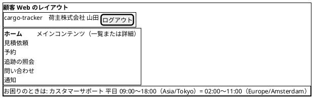

| 項目 | 顧客 Web | 社内業務 Web |
| :--- | :--- | :--- |
| 配置 | 左サイドナビ。幅が狭いときは上部のメニューに畳む | 左サイドナビ |
| 項目 | ホーム、見積依頼、予約、追跡の照会、問い合わせ、通知。荷受人はホームと追跡の照会だけ | 役割に応じて表示: 業務ホーム、見積依頼、経路設計、予約、追跡、有人案件、照会の記録、外部データ、利用者、監査証跡、KPI |
| ヘッダー | 企業名・利用者名、ログアウト。荷受人は言語の切替 | 役割名・利用者名、ログアウト |
| 窓口の案内 | すべての画面で同じ位置（下部）に、窓口と受付時間を利用者のタイムゾーンで示す（WCAG 3.2.6、R-11） | — |
| 現在地 | ナビの現在項目を太字と `aria-current="page"` で示す | 同左 |

ナビに表示しない項目は、URL を直接開いても権限がなければ A-04 を表示する（表示の制御を権限の防御にしない）。

実装（Bolt 8、2026-10-03 に承認）: レイアウトは Thymeleaf のフラグメント（`templates/layout/customer.html`・`staff.html`）で作り、Layout Dialect は使わない。Bootstrap 5.3 と htmx 2.0 は WebJars（webjars-locator-lite）で同梱し、共通の CSS は `static/css/app.css` に置く（操作の大きさ、`scroll-padding`、表の横スクロールの囲み、長い語の折り返し）。画面ごとのスタイルは書かない。ナビには、いまある画面だけを出す（顧客 Web: 見積依頼。社内業務 Web: 見積依頼、KPI 計測記録）。ない画面の項目は、画面を作る Bolt で足す。ヘッダーは認証（US-18）までは仮の主体の名前を出し、ログアウトは出さない。窓口の案内は仮に「平日 09:00〜18:00（Asia/Tokyo）」とする（US-18 の後に利用者のタイムゾーンで示す）。

## 画面遷移

確認（重要操作の実行前確認）は、詳細画面の中に開く確認の領域で行う（共通部品）。遷移図では、確認の段階を区別するために状態として描いている。

### 認証とアカウント

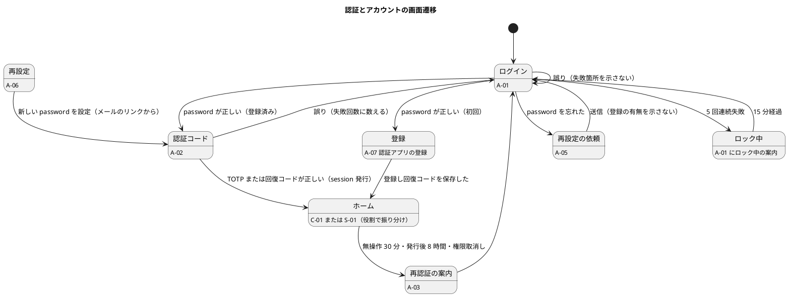

TOTP の端末を失い回復コードもない場合は、システム管理者が S-20 で事前に決めた別経路の本人確認をしたうえで登録を解除し、本人は次回のログインで A-07 から登録し直す（SEC-10）。

### 顧客 Web（荷主担当者）

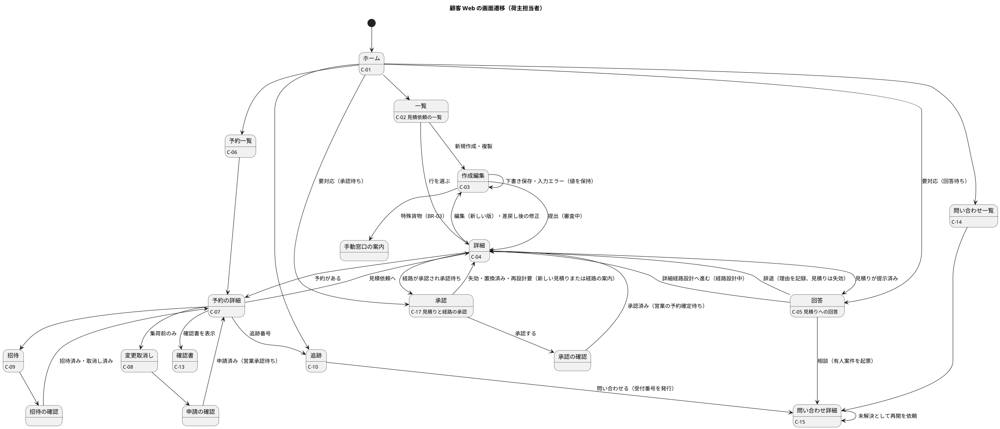

### 荷受人

荷受人は事前登録された利用者（US-18、US-19）である。未登録の荷受人企業の利用者は招待できないため、荷主担当者がシステム管理者へ登録を依頼する。

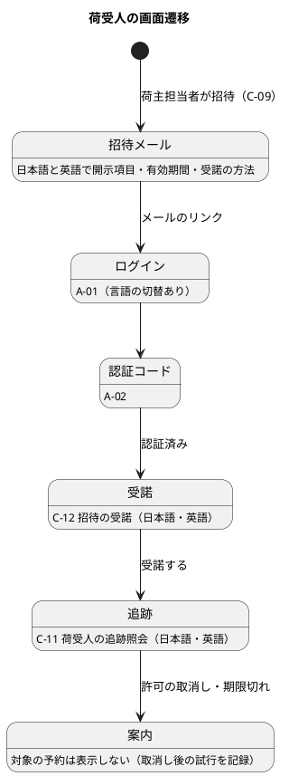

### 社内業務 Web（受付から本予約まで）

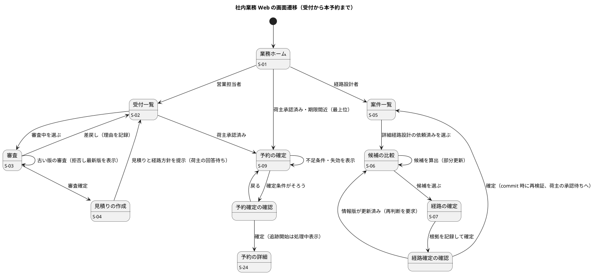

### 社内業務 Web（追跡・有人案件・照会）

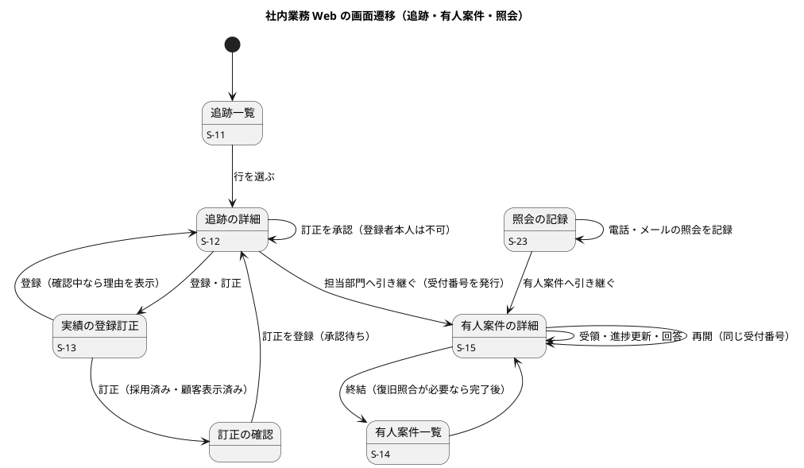

### 社内業務 Web（外部データ・管理）

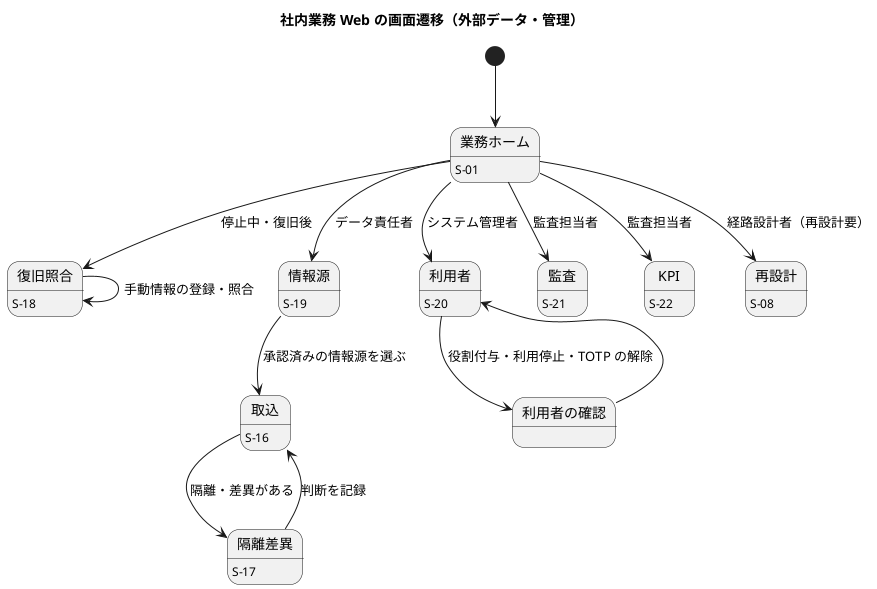

## 画面イメージ

主要な画面を示す。状態は文字とアイコン（`<&check>` などで表記）で示し、色だけに頼らない（BR-13）。日時は「年月日 時刻 タイムゾーン（UTC offset）」の形で、利用者のタイムゾーンを主にする。社内の画面で UTC が必要な箇所は括弧で併記する（BR-10、R-30）。画面イメージの企業名・番号・金額は説明用の架空の値である。

### A-01 ログイン

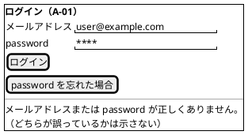

password と認証コードの欄は貼り付けとパスワード管理ツールを妨げない。`autocomplete="username"`・`"current-password"`・`"one-time-code"` を付ける（WCAG 3.3.8）。

### A-07 認証アプリの登録

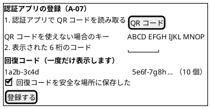

### C-03 見積依頼の作成・編集

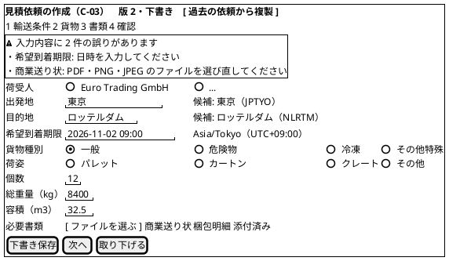

| 項目 | 振る舞い |
| :--- | :--- |
| 段階入力 | 輸送条件・貨物・書類・確認の 4 段階に分け、各段階で下書き保存する（要件定義 利用シーン）。R1.0 で下書きを保存するまでは、1 つのフォームの中のパネルの切り替えにする（2026-10-03 に承認、Bolt 8 のプロトタイプ。UI-HO-04）。段階ごとのサーバーの検証はせず、提出のときに今と同じ検証とエラー要約で示す。エラー要約のリンクを選ぶと、その項目のある段階を開いてフォーカスを移す。選んだファイルは段階を移っても残る。JavaScript がないときは全段階を 1 画面で示す。プロトタイプの操作性を人が確かめ、この形で残すと決めた（2026-10-03、UI-HO-04 の C-03 の分） |
| 港の入力 | 港名で検索し、候補から UN/LOCODE を選ぶ。UN/LOCODE を直接入力してもよい。直接入力では、前後の空白を除き小文字を大文字にそろえてから形式を確かめる（貼り付けや小文字の入力を誤りにしない。Bolt 1 で実装、Bolt 3 レビュー R-26）。空欄は「出発地: 入力してください」のように、形式の誤りと分けて示す |
| 複製 | 過去の見積依頼から輸送条件を引き継いで新しい下書きを作る。希望到着期限と必要書類は再入力させる（Q-INV-11） |
| エラー要約 | 送信に失敗したら画面上部に要約を表示し、要約へフォーカスを移す。各項目の誤りへのリンクを持つ。リンクは「表示名: 文言」の形にし、文言は表示名で始めない（入力欄の下の文言はラベルのすぐ下に出るため。2026-10-05 に human:kakimomokuri が決定、Bolt 6〜8 レビュー R-04） |
| 選択肢の入力 | 荷受人・貨物種別・荷姿は、一覧を開かずにすべて見えるラジオボタン（`fieldset` と `legend`）にする。選択の欄（select）のキー操作は OS によって違い（macOS では ↓ で一覧が開くだけ）、キー操作だけの主要フローを OS によらず確かめられないため（2026-10-02 に human:kakimomokuri が決定。Bolt 4）。荷受人は、企業マスターができたら（US-16）検索できる入力に変える |
| 貨物種別 | 一般以外を選ぶと、MVP の対象外であることと手動窓口の連絡先を表示する。提出ボタンは `aria-disabled` にして理由を関連付け、押したときにも理由をエラー要約で示す（Q-INV-02） |
| 版 | 提出済みの見積依頼を編集すると新しい版の下書きになる旨を表示する（Q-INV-03） |
| ファイル | 「ファイルを選ぶ」ボタンで選べる。ドラッグ & ドロップは補助とする（WCAG 2.5.7）。書類の種類ごとに入力欄を分ける（商業送り状、梱包明細、その他の書類。2026-10-03 に承認、Bolt 7）。受け付ける形式と大きさの上限を、入力欄の説明に書く |
| 隠し項目 | `commandId`、期待版 |

### C-04 見積依頼の詳細（進み具合）

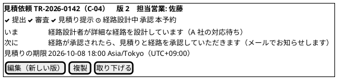

### C-05 見積りへの回答

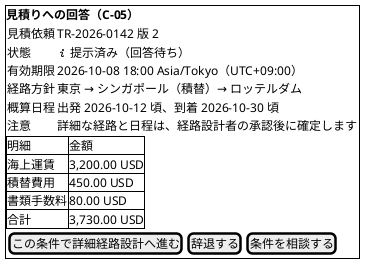

辞退には理由を必須とする（Q-INV-09）。相談は有人案件（種類: 見積りの相談）を起票し、見積りの状態は変えない。失効・置換済みの見積りは読み取り専用で表示し、新しい見積りを依頼する手順を示す（Q-INV-07）。

### C-17 見積りと経路の承認

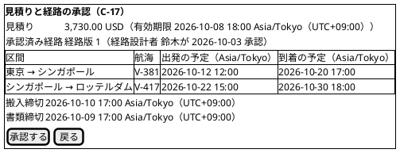

承認の後、本予約は担当営業が確定する（US-04）。荷主には承認済みであることと、予約の確定をメールで知らせることを示す。

### S-04 見積りの作成

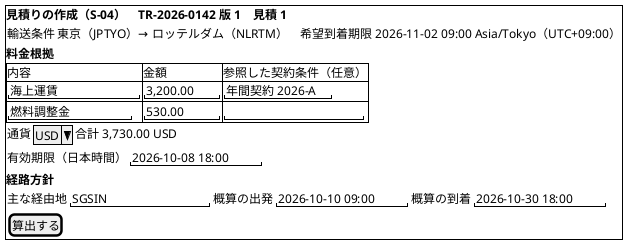

| 項目 | 振る舞い |
| :--- | :--- |
| 入力 | 料金明細（1〜10 行）・通貨・有効期限・経路方針を 1 つの画面で入れ、「算出する」で承認待ちまで進む（作成中のまま保存する操作は入れない）。誤りはエラー要約で示し、入力を残す（Q-INV-17） |
| 社内承認して提示 | 算出した見積り（承認待ち）を読み取り専用で示し、「社内承認して提示する」で提示する。承認者は認証（US-18）までは仮の営業担当者 |
| 日時 | 有効期限と経路方針の日時は日本時間で入れ、画面では利用者のタイムゾーンを主にし UTC を併記する |

### S-06 経路候補の比較

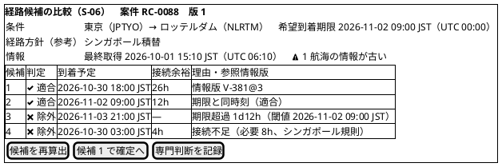

| 項目 | 振る舞い |
| :--- | :--- |
| 判定の表示 | 「適合」「除外」を文字とアイコンで示す。除外には不適合の時刻・閾値・参照情報版を示す（R-INV-02） |
| 境界の扱い | 期限と同時刻・必要接続時間と同値は適合と表示する（R-INV-01） |
| 情報不足 | 外部情報が停止中なら最終採用値と取得時刻を示し、「情報不足」と表示する（R-INV-09） |
| 再算出 | 候補の表だけを部分更新し、更新が終わったときに 1 回だけライブリージョンで通知する |

### S-09 予約の確定

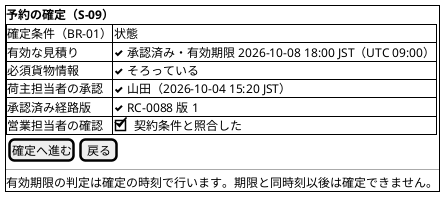

条件が 1 つでも欠けていれば、欠けている条件を `<&x>` と理由で示す。「確定へ進む」は `aria-disabled` にして、欠けている条件の一覧を関連付ける（B-INV-01、R-30）。

### 共通の確認の領域（重要操作）

本予約確定、取消し、権限変更、実績訂正、荷受人への共有・取消し、見積りと経路の承認は、詳細画面の中に開くこの確認の領域を経る（BR-13）。

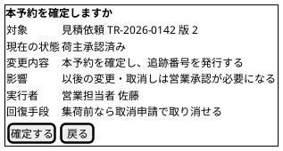

### C-10 追跡の照会（荷主）・C-11（荷受人）

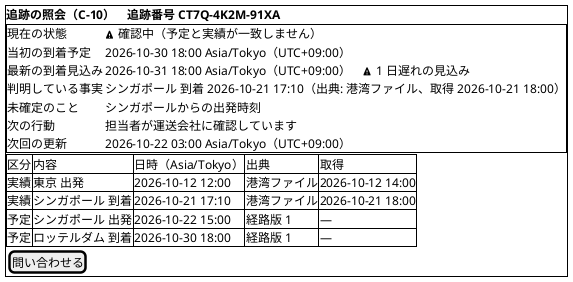

| 項目 | 荷主（C-10） | 荷受人（C-11） |
| :--- | :--- | :--- |
| 現在状態・確認中の説明 | 表示 | 表示 |
| 当初の予定と最新の見込み | 両方を並べて表示する（T-INV-10） | 到着予定として両方を表示する |
| 手続き中の段階 | 「目的地到着（通関等の手続き中）」のように表示する | 同左 |
| 予定と実績の表 | 区分・出典・取得時刻を含めて表示 | 到着予定と主要実績だけを表示し、最終更新時刻を示す |
| 料金、契約条件、書類、他の予約 | 自社分のみ | 表示しない（BR-07） |
| 問い合わせ | 有人案件を起票し、C-15 で受付番号と次回更新を示す | 荷主または有人窓口を案内する |
| 言語 | 日本語 | 日本語と英語 |

予定と実績は「区分」の列で文字として分け、行の色だけで区別しない（T-INV-08、BR-13）。画面幅が 600px 未満のときは、表を時系列のリスト（区分・内容・日時を 1 項目にまとめる）に切り替え、横スクロールなしで読めるようにする（WCAG 1.4.10）。

### C-14 問い合わせ一覧

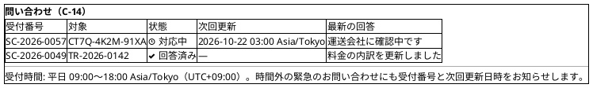

C-15 の詳細では進捗と回答の履歴を示し、回答済みの案件には「解決しなかった」の操作で再開を依頼できる（US-23）。

### S-12 追跡の詳細（社内）

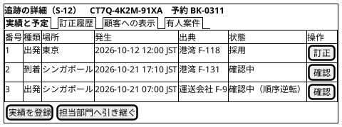

「顧客への表示」タブは、顧客が今見ている内容（C-10 と同じ）を示し、社内の確認状態と区別する（US-11）。カスタマーサポートには登録・訂正のボタンを表示しない。行内のボタンは 24 × 24 CSS px 以上の大きさにする（WCAG 2.5.8）。

### S-15 有人案件の詳細

```plantuml
@startsalt
{+
  <b>有人案件 SC-2026-0057（S-15）
  {
    種類 | 外部停止
    状態 | <&clock> 対応中
    担当 | 追跡管理部 鈴木（受領 2026-10-21 10:05 JST）
    回答期限 | 2026-10-22 12:00 Asia/Tokyo（UTC+09:00）
    次回更新 | 2026-10-21 18:00 Asia/Tokyo（UTC+09:00）
    復旧照合 | <&x> 未完了（照合 RR-0012）
  }
  {#
    日時 | 進捗・回答 | 更新者
    2026-10-21 10:20 JST | 港湾に再送を依頼 | 鈴木
  }
  { [ 進捗を更新 ] | [ 回答を記録 ] | [ 終結する ] }
  ---
  復旧照合が完了していないため、終結できません。
}
@endsalt
```

### S-16 外部データの取込

```plantuml
@startsalt
{+
  <b>外部データの取込（S-16）
  {
    情報源 | ^港湾 A（承認済み）^
    ファイル | [ ファイルを選ぶ ] port-a-20261021.csv
    [ 取り込む ]
  }
  {#
    分類 | 件数
    採用 | 118
    重複 | 4
    隔離 | 1
    差異 | 2
    受信件数 | 125
  }
  { [ 隔離・差異を確認する ] }
}
@endsalt
```

## 共通部品

| 部品 | 内容 | 根拠 |
| :--- | :--- | :--- |
| エラー要約 | 画面上部に誤りの件数と各項目へのリンクを並べ、送信失敗時にフォーカスを移す | BR-13、US 横断受入条件 |
| フォーム項目 | ラベルを必ず付け、誤りは項目の下に理由と直し方を示す。入力値は保持する。変更・新しい版の入力では現在の値を初期値にし、同じ情報を二度入力させない | BR-13、WCAG 3.3.7 |
| 状態バッジ | 文字 + アイコン。予定・実績・確認中・処理中・有人確認要を区別する | BR-13、RQ-03 |
| 日時表示 | UTC の値を利用者のタイムゾーンで「年月日 時刻 タイムゾーン（UTC offset）」と表示する。社内の画面で必要な箇所は UTC を括弧で併記する。略称（JST など）は表の中だけに使う | BR-10、R-30 |
| 確認の領域 | 詳細画面の中に開き、対象・現在状態・変更内容・影響・実行者・回復手段を必須項目にする。開いたらフォーカスを領域の見出しへ移し、戻るで元のボタンへ戻す | BR-13 |
| 通知領域 | 部分更新の結果、確認中への遷移、escalation を `aria-live` で通知する。状態が変わったときだけ書き込み、問い合わせのたびには書き込まない | BR-13、R-30 |
| 処理中表示 | 予約サガなど非同期処理の状態を「処理中」「完了」「有人確認要」で示す。処理中を完了と表示しない | ARCH-HO-02 |
| 競合表示 | 期待版が違うときに、最新版と自分の入力の差分を示し、再確認を求める | ARCH-HO-01、US-02、US-05 |
| session の警告 | 無操作による失効の 5 分前に、延長の操作を持つ警告を表示し、支援技術にも通知する。失効したら、送信しようとした入力を下書きとして保持し、再認証後に戻す | WCAG 2.2.1、US 横断受入条件、R-15 |
| 無効の操作 | 操作できないボタンは `disabled` ではなく `aria-disabled` にし、理由を `aria-describedby` で関連付ける。押したときにも理由を示す | R-30 |
| 窓口の案内 | すべての顧客向け画面で同じ位置に、窓口と受付時間を利用者のタイムゾーンで示す | WCAG 3.2.6、R-11 |
| 固定ヘッダーとフォーカス | 固定ヘッダーや確認の領域の下にフォーカスが隠れないよう、`scroll-padding` で余白をとる | WCAG 2.4.11 |
| 操作の大きさ | ボタン・リンクの操作範囲を 24 × 24 CSS px 以上にする（`btn-sm` も含む） | WCAG 2.5.8 |
| ファイルの選択 | ボタンで選べるようにし、ドラッグ & ドロップは補助とする | WCAG 2.5.7 |
| 認証の入力 | 貼り付けとパスワード管理ツールを妨げない。`autocomplete` を付ける | WCAG 3.3.8 |
| 画面幅 | 320 CSS px まで横スクロールなしで読める。表は狭い画面で時系列のリストに切り替える | WCAG 1.4.10 |

## メール通知（US-22）

| 種類 | 件名の例 | 本文 | 宛先 |
| :--- | :--- | :--- | :--- |
| 見積りの提示 | 【cargo-tracker】見積りが提示されました（TR-2026-0142） | 対象の番号と、C-05 へのリンクだけ | 荷主担当者 |
| 経路の承認 | 【cargo-tracker】経路が承認されました。承認をお願いします | C-17 へのリンク | 荷主担当者 |
| 見積りの期限間近 | 【cargo-tracker】見積りの期限が近づいています | 期限（利用者のタイムゾーン）と C-05 または C-17 へのリンク | 荷主担当者 |
| 本予約の確定 | 【cargo-tracker】本予約が確定しました（追跡番号） | C-07 へのリンク | 荷主担当者 |
| 確認中への遷移 | 【cargo-tracker】輸送状況を確認しています | C-10 へのリンク | 荷主担当者 |
| 荷受人への招待 | 【cargo-tracker】Tracking invitation / 追跡のご招待 | 日本語と英語で開示項目・有効期間・受諾の方法 | 荷受人 |

料金・契約条件・書類・他の予約の情報はメールに書かない（N-INV-01）。送った通知は C-16 でも確認できる。

## インタラクション

### 主要な操作フロー

#### 見積依頼から本予約まで（荷主担当者・営業担当者・経路設計者）

1. 荷主担当者が C-03 で輸送条件を段階的に入力し、下書き保存する（過去の依頼から複製してもよい）。
2. 荷主担当者が提出する。必須条件がそろっていなければエラー要約を表示し、下書きのまま残す。
3. 営業担当者が S-03 で審査を確定し、S-04 で料金根拠・有効期限・経路方針を入力して見積りを提示する。荷主へメールで知らせる。
4. 荷主担当者が C-05 で見積りと経路方針を確認し、詳細経路設計へ進むと回答する（辞退・相談も選べる）。
5. 経路設計者が S-06 で候補を比較し、S-07 で経路を確定する。経路版が見積りに割り当てられ、荷主へメールで知らせる。
6. 荷主担当者が C-17 で見積りと承認済み経路・締切を確認し、確認の領域を経て承認する。
7. 営業担当者が S-01 の最上位に出た「荷主承認済み」から S-09 を開き、確認の領域を経て本予約を確定する。
8. S-24 の予約の詳細に追跡番号と「追跡の開始: 処理中」を表示する。予約サガが完了したら「完了」に更新し、通知領域で知らせる。荷主へ本予約の確定をメールで知らせる。

C-04 には、各段階の進み具合と「いま誰の対応待ちか」を表示し、荷主が状況を問い合わせずに分かるようにする。

Bolt 6 での輸送要求の状態と、荷主の画面（C-02・C-04）の表示の対応は次のとおり。営業の画面（S-02・S-03）の表示名は変えない。

| 状態 | 荷主の画面の表示 | いま誰の対応待ちか |
| :--- | :--- | :--- |
| 審査中 | 審査中（A 社の対応待ち） | A 社。営業担当者が審査している |
| 下書き（差し戻された） | 差戻し（お客様の対応待ち） | お客様。差戻しの理由を確かめ、直して出し直す |
| 見積り作成中 | 見積り作成中（A 社の対応待ち） | A 社。営業担当者が見積りを作成している |
| 見積提示済み | 見積提示済み（お客様の対応待ち） | お客様。見積りと経路方針を確かめ、回答する（回答は US-24。Bolt 10 で足した） |

#### 主要実績の訂正（追跡管理者 2 名）

1. 追跡管理者 A が S-13 で採用済みの実績の訂正を、理由を付けて登録する。確認の領域を経る。
2. 訂正は「承認待ち」になり、顧客への表示は変わらない（T-INV-06）。
3. 追跡管理者 B が S-12 で訂正を承認する。A 本人が承認しようとすると拒否し、別の追跡管理者が必要と示す。
4. 承認されると現在状態を導き直し、顧客への表示が変わる。

#### 問い合わせ（荷主担当者・カスタマーサポート）

1. 荷主担当者が C-10 で「問い合わせる」を選ぶ。有人案件を起票し、受付番号と次回更新日時を示す。営業時間外の優先度高の案件は、受付番号と次回更新日時を直ちに返す（SC-INV-04）。
2. カスタマーサポートが電話・メールで受けた照会は S-23 で記録し、必要なら有人案件へ引き継ぐ（IR-INV-02）。
3. 荷主担当者は C-14・C-15 で進捗と回答を確認し、解決しなければ同じ受付番号で再開を依頼する。

### エラーと例外の扱い

| 状況 | 表示 | 回復手段 |
| :--- | :--- | :--- |
| 入力の誤り | エラー要約と項目ごとの理由。入力値を保持する | 直して再送 |
| 期待版の不一致（他の人が先に更新） | 「この内容は他の利用者が更新しました」と、最新版と自分の入力の差分。Bolt 5 の S-03 は暫定で「他の利用者が先に更新しました。受付一覧から開き直してください」とだけ示す（差分の表示は ARCH-HO-01 の残りの Bolt） | 最新版を確認して再操作 |
| 二重送信 | 同じ `commandId` の再送には最初の結果を表示する（例: 既存の追跡番号） | 不要 |
| 同じ見積りからの別の確定 | 「この見積りは既に予約に使われています」と既存の予約へのリンク（B-INV-11） | 既存の予約を確認 |
| 業務規則による拒否（失効、古い版、集荷後の変更など） | 拒否の理由と、代わりにできること（再見積り、新しい版、有人案件） | 案内に従う |
| 権限なし・他社のデータ | A-04。対象の存在の有無を推測できる情報を出さない。存在しない番号と同じ応答にする。試行は監査記録に残る | 戻る |
| session の失効が近い | 失効の 5 分前の警告と延長の操作 | 延長 |
| session の失効・権限の取消し | A-03 の再認証の案内。業務データを表示しない。保持した入力があれば再認証後に戻す | 再ログイン |
| 非同期処理の遅れ・失敗 | 「処理中」のまま表示し、有人確認要になったら受付番号を示す | 有人案件で対応 |
| 外部情報の停止・鮮度超過 | 最終採用値・取得時刻・最新性を保証しない旨・次回更新・担当窓口 | 有人窓口 |
| メールの送信失敗 | 画面の通知一覧（C-16）に同じ内容を表示する | 画面で確認 |
| 予期しないエラー | 何が完了していて何が未完了かを示し、要求 ID を表示する | 再操作または問い合わせ（要求 ID を伝える） |

### 部分更新を使う箇所

ADR-005 のとおり、画面全体の遷移を基本とし、部分更新は次に限る。

| 箇所 | 使い方 | アクセシビリティ |
| :--- | :--- | :--- |
| 一覧の絞り込み | 絞り込み条件の変更で一覧の表だけを更新する | 件数の変化を通知領域で知らせる |
| 経路候補の再算出 | 候補の表だけを更新する | 更新が終わったときに 1 回通知する |
| 非同期処理の状態 | 「処理中」の間だけ状態の部分を問い合わせ（非機能要件の間隔）、完了・有人確認要で止める | 状態が変わったときだけ通知する |
| 確認の領域 | 詳細画面の中に確認の領域を開く | フォーカスを確認の領域へ移し、戻るで元のボタンへ戻す |
| session の警告 | 失効の 5 分前に警告を開く | 警告を支援技術に通知し、延長のボタンへフォーカスを移す |

## 後続工程への引継ぎ

| ID | 引継ぎ内容 | 引継ぎ先 |
| :--- | :--- | :--- |
| UI-HO-01 | 主要フロー（見積依頼から本予約、実績の訂正、照会、問い合わせ）の E2E シナリオと、支援技術による手動確認の手順 | テスト戦略 |
| UI-HO-02 | 画面の応答時間、非同期処理の状態を問い合わせる間隔、session の警告の時刻 | 非機能要件 |
| UI-HO-03 | 顧客向け画面の HTML（部分更新の断片・エラー応答を含む）とメールに料金・契約条件・書類が含まれないことの自動テスト | テスト戦略 |
| UI-HO-04 | 経路候補の比較（S-06）と見積依頼の段階入力（C-03）の操作性をプロトタイプで確かめる。C-03 は Bolt 8 で確かめ、段階入力で残すと決めた（2026-10-03）。S-06 は W3 | 最初の Bolt |

## AI の仮定と要確認

- **本予約を確定する人**: US-04 の受入条件に従い、本予約の確定は営業担当者が社内業務 Web（S-09）で行う。荷主は見積りへの回答（C-05）と、見積りと経路の承認（C-17）を行う。
- **本予約と船腹の確保**: 確認書（C-13）と予約の詳細（C-07）に「本予約は A 社との輸送条件の確定であり、船腹の確保は運送会社の確認後に表示する」と示す。船腹の確保を画面で扱うかは業務責任者に確認する（R-28）。
- **KPI の照会者**: S-22 は監査担当者の画面とした。プロダクト責任者が使う場合の役割は OQ-07 の残項目で扱う。
- **荷主・社内の画面の言語**: 英語は荷受人向けの画面と招待メールだけとした。荷主の担当者が欧州にいる場合の英語対応は、パイロット顧客（OQ-01）が決まった後に判断する。
- **画面イメージの値**: 画面イメージの企業名・番号・金額・時刻は説明用の架空の値である。
