# cargo-tracker UI 設計

## 位置づけ

本書は、[フロントエンドアーキテクチャ](architecture_frontend.md) の引継ぎ AF-02（画面ごとの遷移、レイアウト、文言、帳票）と、[ドメインモデル](domain_model.md) の引継ぎ DM-02（画面ごとのコマンド・クエリ、開示範囲ごとの表示項目）に答える。

| 前提 | 出典 | UI への影響 |
| :--- | :--- | :--- |
| 画面はサーバーサイドレンダリングとハイパーメディアで提供する | ADR-005 | 1 画面 = 1 URL。部分更新は一覧の絞り込み、状態の更新、確認画面に限る |
| 顧客向けと社内向けで URL の領域を分ける | ADR-005 | `/customer/**` と `/staff/**` で別のレイアウト・ナビゲーションにする |
| 横断受入条件（BR-13、WCAG 2.2 AA 目標） | user_story.md | 共通部品（エラー要約、確認画面、状態バッジ、日時表示、通知領域）で担保する |
| 荷受人の開示範囲 | BR-07 | 荷受人向けの画面は到着予定・現在状態・主要実績・最終更新時刻だけを表示する |
| Bootstrap 5.3、htmx 2.0、Thymeleaf | ADR-006 | 部品は Bootstrap を基に作り、色だけで状態を示す部品は使わない |

MVP の言語は日本語とする（フロントエンドアーキテクチャの仮定）。現場入力 UI（UI-06）は第 2 段階のため本書の対象外とする。

## 画面のオブジェクト

ガイドのオブジェクト指向 UI に従い、利用者が操作する「モノ」をドメインモデルの集約から選ぶ。各オブジェクトに一覧（コレクションビュー）と詳細（シングルビュー）を持たせ、操作は詳細の画面に置く。

| オブジェクト | 集約（ドメインモデル） | 一覧 | 詳細 | 主なアクション | 利用者 |
| :--- | :--- | :--- | :--- | :--- | :--- |
| 輸送要求 | 輸送要求 | ○ | ○ | 下書き作成・更新、提出、取下げ、審査確定、差戻し | 荷主担当者、営業担当者 |
| 見積り | 見積り | 輸送要求の詳細に含める | ○ | 算出、社内承認、提示、荷主承認 | 営業担当者、荷主担当者 |
| 経路設計案件 | 経路設計案件 | ○ | ○ | 候補算出、専門判断、確定、再設計 | 経路設計者 |
| 貨物予約 | 貨物予約 | ○ | ○ | 本予約確定、変更・取消申請、申請の承認・却下 | 営業担当者、荷主担当者 |
| 追跡 | 追跡記録 | ○（社内） | ○ | 照会、実績登録、訂正、訂正承認 | 荷主担当者、荷受人、追跡管理者、カスタマーサポート |
| 有人案件 | 有人案件 | ○ | ○ | 起票、受領、進捗更新、回答、終結、再開 | カスタマーサポート、業務担当者 |
| 参照許可 | 参照許可 | 予約の詳細に含める | — | 招待、受諾、取消し | 荷主担当者、荷受人 |
| 外部データの取込 | 外部データ（取込・受信記録） | ○ | ○ | ファイル取込、隔離の判断、手動情報登録、復旧照合 | データ責任者 |
| 利用者 | 利用者・企業 | ○ | ○ | 登録、役割付与、利用停止 | システム管理者 |
| 監査記録 | 監査記録 | ○ | ○（照会のみ） | 条件で照会 | 監査担当者 |

## 画面一覧

画面 ID は顧客向けを `C-`、社内向けを `S-`、共通を `A-` で始める。

### 共通

| ID | 画面 | 目的 | 主な操作 | 対応 |
| :--- | :--- | :--- | :--- | :--- |
| A-01 | ログイン | 本人確認（メールアドレス・password） | ログイン | UC-18、US-18 |
| A-02 | TOTP 入力 | 多要素認証 | 確認 | UC-18、US-18、BR-14 |
| A-03 | 再認証の案内 | session 失効・権限取消し後の案内 | ログインへ | US-18、IA-INV-04 |
| A-04 | エラー・権限なし | 操作できない理由と次の行動 | 戻る、問い合わせ | US-16、BR-07 |

### 顧客 Web（`/customer/**`）

| ID | 画面 | 目的 | 主な操作 | 主なコマンド・クエリ | 対応 |
| :--- | :--- | :--- | :--- | :--- | :--- |
| C-01 | ホーム | 自社の輸送要求・予約の状況を一覧する | 各一覧へ、新規作成 | 輸送要求・予約の照会 | — |
| C-02 | 輸送要求一覧 | 自社の輸送要求を状態で絞り込む | 絞り込み、詳細へ、新規作成 | 輸送要求を照会する | UC-01 |
| C-03 | 輸送要求の作成・編集 | 輸送条件を下書きし提出する | 下書き保存、提出、取下げ | 下書きを更新する、提出する、取り下げる | UC-01、US-01、US-05 |
| C-04 | 輸送要求の詳細 | 版、審査結果、差戻し理由、見積りを確認する | 編集（新しい版）、見積りの承認、取下げ | 輸送要求・見積りを照会する | UC-01〜03、US-03、US-05 |
| C-05 | 見積りの承認 | 料金根拠・有効期限・経路の概要を確認して承認する | 承認（確認画面を経る） | 荷主が承認する | US-04（BR-01 の荷主承認） |
| C-06 | 予約一覧 | 自社の本予約を一覧する | 絞り込み、詳細へ | 予約を照会する | UC-04、UC-05 |
| C-07 | 予約の詳細 | 予約版、追跡番号、変更・取消申請の状態を確認する | 変更申請、取消申請、荷受人の招待・取消し、確認書の表示 | 予約・参照許可を照会する | US-05、US-19 |
| C-08 | 変更・取消しの申請 | 集荷前の変更・取消しを申請する | 申請（確認画面を経る） | 変更・取消しを申請する | US-05 |
| C-09 | 荷受人の招待 | 予約単位で荷受人を招待する | 招待（確認画面を経る）、取消し | 招待する、取り消す | US-19 |
| C-10 | 追跡の照会 | 追跡番号で現在状態・予定・実績・出典・鮮度を見る | 照会、問い合わせ | 輸送状態を照会する（荷主の開示範囲） | UC-09、US-09 |
| C-11 | 荷受人の追跡照会 | 許可された予約の到着予定・現在状態・主要実績・最終更新時刻だけを見る | 照会 | 輸送状態を照会する（荷受人の開示範囲） | US-10 |
| C-12 | 招待の受諾 | 荷受人が招待を受諾する | 受諾 | 受諾する | US-19 |
| C-13 | 予約・経路確認書 | 合意内容を印刷・保存できる形で見る | 印刷 | 予約を照会する | RP-01 |

### 社内業務 Web（`/staff/**`）

| ID | 画面 | 目的 | 主な操作 | 主な役割 | 対応 |
| :--- | :--- | :--- | :--- | :--- | :--- |
| S-01 | 業務ホーム | 役割ごとの未処理の仕事を一覧する | 各画面へ | 全役割 | — |
| S-02 | 輸送要求の受付一覧 | 審査待ち・見積り待ちの輸送要求を一覧する | 絞り込み、詳細へ | 営業担当者 | UC-02 |
| S-03 | 輸送要求の審査 | 条件と書類を確認し、審査を確定または差し戻す | 審査確定、差戻し | 営業担当者 | UC-02、US-02 |
| S-04 | 見積りの作成 | 料金根拠と有効期限を入力し、算出・承認・提示する | 算出、社内承認、提示 | 営業担当者 | UC-03、US-03 |
| S-05 | 経路設計案件一覧 | 候補算出待ち・専門判断待ち・再設計要の案件を一覧する | 絞り込み、詳細へ | 経路設計者 | UC-06〜08 |
| S-06 | 経路候補の比較 | 採用候補・除外候補・理由・鮮度を比較する | 候補算出、専門判断の記録、確定へ | 経路設計者 | UC-06、US-06 |
| S-07 | 経路の確定 | 判断根拠を記録して確定する | 確定（確認画面を経る） | 経路設計者 | UC-07、US-07 |
| S-08 | 経路の再設計 | 再設計要の経路について未実行区間の新候補を作る | 再設計開始、候補算出、確定 | 経路設計者 | UC-08、US-08 |
| S-09 | 予約の確定 | BR-01 の確定条件を確認して本予約を確定する | 確定（確認画面を経る） | 営業担当者 | UC-04、US-04 |
| S-10 | 予約一覧・詳細 | 予約と変更・取消申請を確認する | 申請の承認・却下 | 営業担当者 | UC-05、US-05 |
| S-11 | 追跡一覧 | 確認中・鮮度超過・訂正承認待ちの追跡を一覧する | 絞り込み、詳細へ | 追跡管理者 | UC-10 |
| S-12 | 追跡の詳細（社内） | 予定・実績・原本・訂正履歴・顧客への表示内容を区別して見る | 実績登録、下書き修正、訂正、訂正承認 | 追跡管理者、カスタマーサポート（照会のみ） | UC-09、UC-10、US-11〜13 |
| S-13 | 主要実績の登録・訂正 | 出典と発生時刻を指定して実績を登録・訂正する | 登録、訂正（確認画面を経る） | 追跡管理者 | US-12、US-13 |
| S-14 | 有人案件一覧 | 未受領・期限超過・対応中の案件を一覧する | 絞り込み、詳細へ | カスタマーサポート、業務担当者 | UC-20、US-20 |
| S-15 | 有人案件の詳細 | 受付から回答・終結・再開までを追跡する | 受領、進捗更新、回答、終結、再開 | カスタマーサポート、業務担当者 | UC-20、US-11、US-20 |
| S-16 | 外部データの取込 | 承認済みファイルを取り込み、分類結果を見る | ファイル取込 | データ責任者 | UC-15、US-14 |
| S-17 | 隔離・差異の確認 | 隔離された原本と差異を確認し判断する | 採用・却下の判断 | データ責任者 | US-14 |
| S-18 | 手動情報と復旧照合 | 停止中の手動情報を登録し、復旧後に照合する | 手動情報登録、照合、完了 | データ責任者 | US-15 |
| S-19 | 情報源の管理 | 情報源を選定・承認する | 承認 | データ責任者 | BR-18、US-14 |
| S-20 | 利用者一覧・詳細 | 企業と利用者、役割、担当範囲を管理する | 登録、役割付与（確認画面を経る）、利用停止 | システム管理者 | UC-16、US-16 |
| S-21 | 監査証跡の照会 | 対象と期間で操作・承認・変更・訂正を時系列で見る | 照会 | 監査担当者 | UC-17、US-17 |

## ナビゲーション

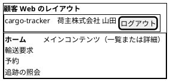

| 項目 | 顧客 Web | 社内業務 Web |
| :--- | :--- | :--- |
| 配置 | 左サイドナビ | 左サイドナビ |
| 項目 | ホーム、輸送要求、予約、追跡の照会。荷受人はホームと追跡の照会だけ | 役割に応じて表示: 業務ホーム、輸送要求、経路設計、予約、追跡、有人案件、外部データ、利用者、監査証跡 |
| ヘッダー | 企業名・利用者名、ログアウト | 役割名・利用者名、ログアウト |
| 現在地 | ナビの現在項目を太字と `aria-current="page"` で示す | 同左 |

ナビに表示しない項目は、URL を直接開いても権限がなければ A-04 を表示する（表示の制御を権限の防御にしない）。

## 画面遷移

### 認証

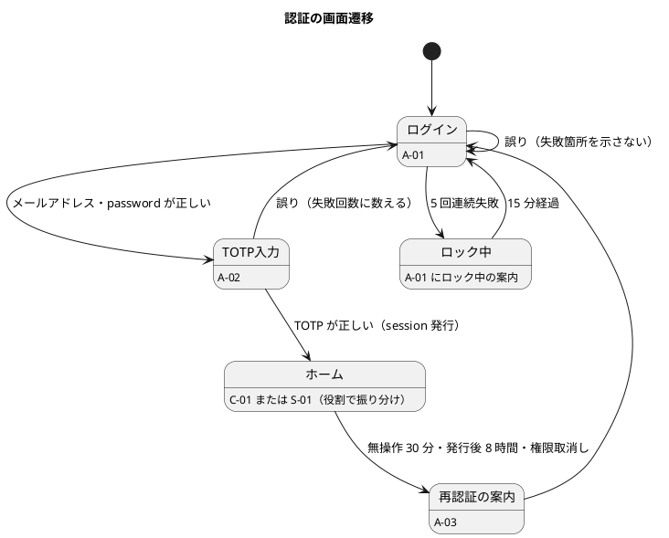

### 顧客 Web（荷主担当者）

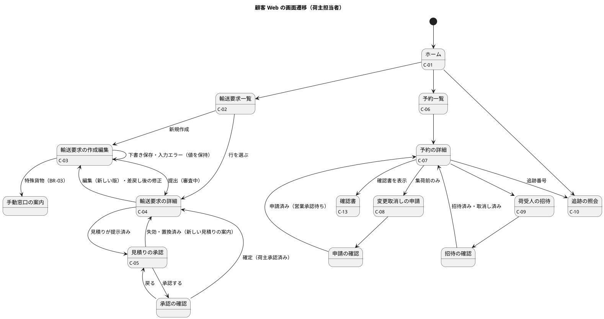

### 社内業務 Web（予約までの流れ）

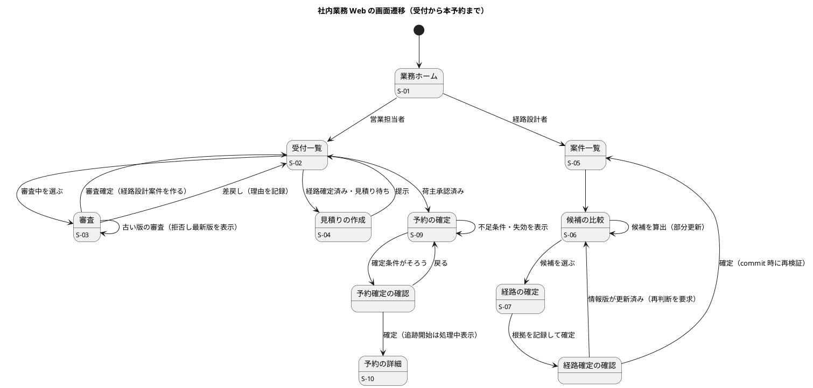

### 社内業務 Web（追跡と有人案件）

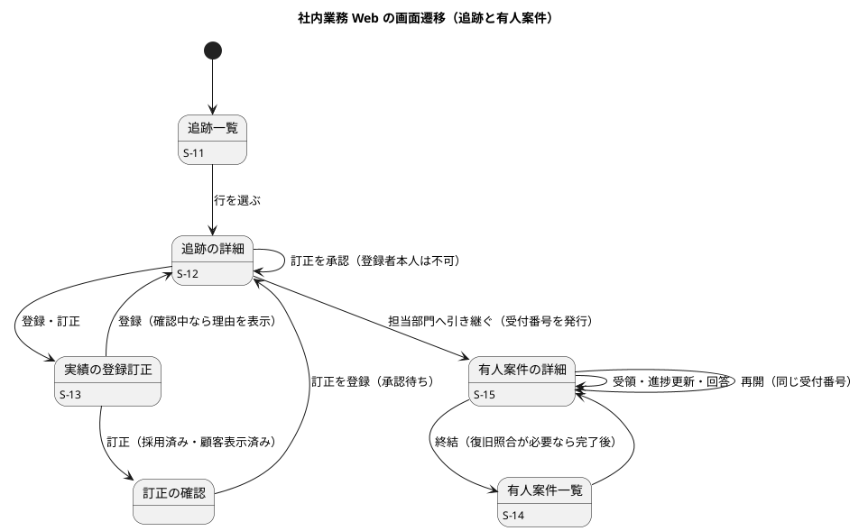

## 画面イメージ

主要な画面を示す。状態は文字とアイコン（`[!]` などで表記）で示し、色だけに頼らない（BR-13）。日時は利用者のタイムゾーンと UTC offset を付ける（BR-10）。

### A-01・A-02 ログインと TOTP

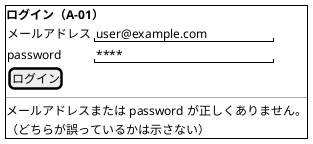

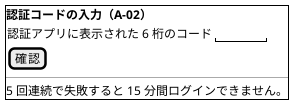

### C-03 輸送要求の作成・編集

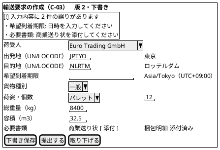

| 項目 | 振る舞い |
| :--- | :--- |
| エラー要約 | 送信に失敗したら画面上部に要約を表示し、要約へフォーカスを移す。各項目の誤りへのリンクを持つ |
| 貨物種別 | 一般以外を選ぶと、MVP の対象外であることと手動窓口の連絡先を表示し、提出ボタンを無効にする（Q-INV-02） |
| 版 | 提出済みの輸送要求を編集すると新しい版の下書きになる旨を表示する（Q-INV-03） |
| 隠し項目 | `commandId`、期待版 |

### C-05 見積りの承認

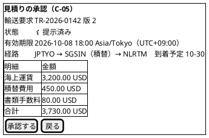

失効・置換済みの見積りは読み取り専用で表示し、承認ボタンの代わりに「新しい見積りを依頼する」手順を示す（Q-INV-07）。

### S-06 経路候補の比較

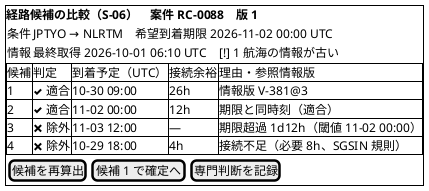

| 項目 | 振る舞い |
| :--- | :--- |
| 判定の表示 | 「適合」「除外」を文字とアイコンで示す。除外には不適合の時刻・閾値・参照情報版を示す（R-INV-02） |
| 境界の扱い | 期限と同時刻・必要接続時間と同値は適合と表示する（R-INV-01） |
| 情報不足 | 外部情報が停止中なら最終採用値と取得時刻を示し、「情報不足」と表示する（R-INV-09） |
| 再算出 | 候補の表だけを部分更新し、更新したことをライブリージョンで通知する |

### S-09 予約の確定

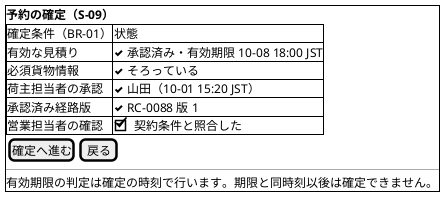

条件が 1 つでも欠けていれば、欠けている条件を `<&x>` と理由で示し、「確定へ進む」を無効にする（B-INV-01）。

### 共通の確認画面（重要操作）

本予約確定、取消し、権限変更、実績訂正、荷受人への共有・取消しは、この形の確認を経る（BR-13）。

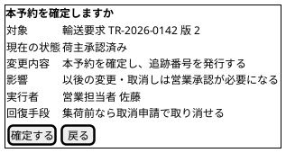

### C-10 追跡の照会（荷主）・C-11（荷受人）

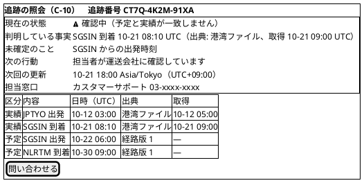

| 項目 | 荷主（C-10） | 荷受人（C-11） |
| :--- | :--- | :--- |
| 現在状態・確認中の説明 | 表示 | 表示 |
| 予定と実績の表 | 区分・出典・取得時刻を含めて表示 | 到着予定と主要実績だけを表示し、最終更新時刻を示す |
| 料金、契約条件、書類、他の予約 | 自社分のみ | 表示しない（BR-07） |
| 問い合わせ | 有人案件の起票につながる | 荷主または有人窓口を案内する |

予定と実績は「区分」の列で文字として分け、行の色だけで区別しない（T-INV-08、BR-13）。

### S-12 追跡の詳細（社内）

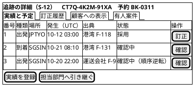

「顧客への表示」タブは、顧客が今見ている内容（C-10 と同じ）を示し、社内の確認状態と区別する（US-11）。カスタマーサポートには登録・訂正のボタンを表示しない（B-INV-10 と同じく照会だけ）。

### S-15 有人案件の詳細

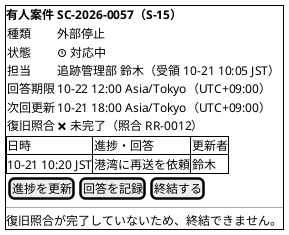

### S-16 外部データの取込

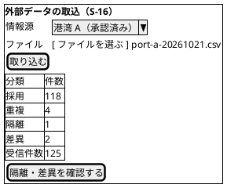

## 共通部品

| 部品 | 内容 | 根拠 |
| :--- | :--- | :--- |
| エラー要約 | 画面上部に誤りの件数と各項目へのリンクを並べ、送信失敗時にフォーカスを移す | BR-13、US 横断受入条件 |
| フォーム項目 | ラベルを必ず付け、誤りは項目の下に理由と直し方を示す。入力値は保持する | BR-13 |
| 状態バッジ | 文字 + アイコン。予定・実績・確認中・処理中・有人確認要を区別する | BR-13、RQ-03 |
| 日時表示 | UTC の値を利用者のタイムゾーンで表示し、UTC offset を付ける。必要な画面では UTC も併記する | BR-10 |
| 確認画面 | 対象・現在状態・変更内容・影響・実行者・回復手段を必須項目にする | BR-13 |
| 通知領域 | 部分更新の結果、確認中への遷移、escalation を `aria-live` で通知する | BR-13 |
| 処理中表示 | 予約サガなど非同期処理の状態を「処理中」「完了」「有人確認要」で示す。処理中を完了と表示しない | ARCH-HO-02 |
| 競合表示 | 期待版が違うときに、最新版と自分の入力の差分を示し、再確認を求める | ARCH-HO-01、US-02、US-05 |

## インタラクション

### 主要な操作フロー

#### 輸送要求から本予約まで（荷主担当者と営業担当者）

1. 荷主担当者が C-03 で輸送条件を入力し、下書き保存する。
2. 荷主担当者が提出する。必須条件がそろっていなければエラー要約を表示し、下書きのまま残す。
3. 営業担当者が S-03 で審査を確定する。経路設計案件が作られる（DE-02）。
4. 経路設計者が S-06 で候補を比較し、S-07 で確定する。
5. 営業担当者が S-04 で見積りを算出・社内承認・提示する。
6. 荷主担当者が C-05 で見積りを確認し、確認画面を経て承認する。
7. 営業担当者が S-09 で確定条件を確かめ、確認画面を経て本予約を確定する。
8. S-10 の予約の詳細に追跡番号と「追跡の開始: 処理中」を表示する。予約サガが完了したら「完了」に更新し、通知領域で知らせる。

#### 主要実績の訂正（追跡管理者 2 名）

1. 追跡管理者 A が S-13 で採用済みの実績の訂正を、理由を付けて登録する。確認画面を経る。
2. 訂正は「承認待ち」になり、顧客への表示は変わらない（T-INV-06）。
3. 追跡管理者 B が S-12 で訂正を承認する。A 本人が承認しようとすると拒否し、別の追跡管理者が必要と示す。
4. 承認されると現在状態を導き直し、顧客への表示が変わる。

### エラーと例外の扱い

| 状況 | 表示 | 回復手段 |
| :--- | :--- | :--- |
| 入力の誤り | エラー要約と項目ごとの理由。入力値を保持する | 直して再送 |
| 期待版の不一致（他の人が先に更新） | 「この内容は他の利用者が更新しました」と、最新版と自分の入力の差分 | 最新版を確認して再操作 |
| 二重送信 | 同じ `commandId` の再送には最初の結果を表示する（例: 既存の追跡番号） | 不要 |
| 業務規則による拒否（失効、古い版、集荷後の変更など） | 拒否の理由と、代わりにできること（再見積り、新しい版、有人案件） | 案内に従う |
| 権限なし・他社のデータ | A-04。対象の存在の有無を推測できる情報を出さない。試行は監査記録に残る | 戻る |
| session の失効・権限の取消し | A-03 の再認証の案内。業務データを表示しない | 再ログイン |
| 非同期処理の遅れ・失敗 | 「処理中」のまま表示し、有人確認要になったら受付番号を示す | 有人案件で対応 |
| 外部情報の停止・鮮度超過 | 最終採用値・取得時刻・最新性を保証しない旨・次回更新・担当窓口 | 有人窓口 |
| 予期しないエラー | 何が完了していて何が未完了かを示し、要求 ID を表示する | 再操作または問い合わせ（要求 ID を伝える） |

### 部分更新を使う箇所

ADR-005 のとおり、画面全体の遷移を基本とし、部分更新は次に限る。

| 箇所 | 使い方 | アクセシビリティ |
| :--- | :--- | :--- |
| 一覧の絞り込み | 絞り込み条件の変更で一覧の表だけを更新する | 件数の変化を通知領域で知らせる |
| 経路候補の再算出 | 候補の表だけを更新する | 更新したことを通知する |
| 非同期処理の状態 | 「処理中」の間だけ一定間隔で状態の部分を問い合わせ、完了・有人確認要で止める | 状態の変化を通知する |
| 確認画面 | 詳細画面の中に確認の領域を開く | フォーカスを確認の領域へ移し、戻るで元のボタンへ戻す |

## 後続工程への引継ぎ

| ID | 引継ぎ内容 | 引継ぎ先 |
| :--- | :--- | :--- |
| UI-HO-01 | 主要フロー（輸送要求から本予約、実績の訂正、照会）の E2E シナリオと、支援技術による手動確認の手順 | テスト戦略 |
| UI-HO-02 | 画面の応答時間、非同期処理の状態を問い合わせる間隔 | 非機能要件 |
| UI-HO-03 | 顧客向け画面の HTML に料金・契約条件・書類が含まれないことの自動テスト | テスト戦略 |
| UI-HO-04 | 経路候補の比較（S-06）の操作性をプロトタイプで確かめる | 最初の Bolt |

## AI の仮定と要確認

- **見積りの承認の画面**: BR-01 の「荷主担当者 1 名の承認」を、顧客 Web の見積りの承認（C-05）として設計した（ドメインモデルの仮定と同じ）。
- **本予約を確定する人**: US-04 の受入条件に従い、本予約の確定は営業担当者が社内業務 Web（S-09）で行う。荷主は見積りの承認までを行う。
- **多言語**: MVP は日本語のみとした。欧州の荷受人が C-11 を使う場合に英語が必要かは、US-10 が Could であることも踏まえて後続で判断する。
- **画面イメージの値**: 画面イメージの企業名・番号・金額は説明用の架空の値である。
