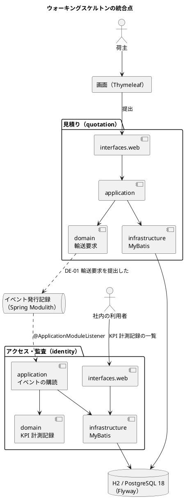
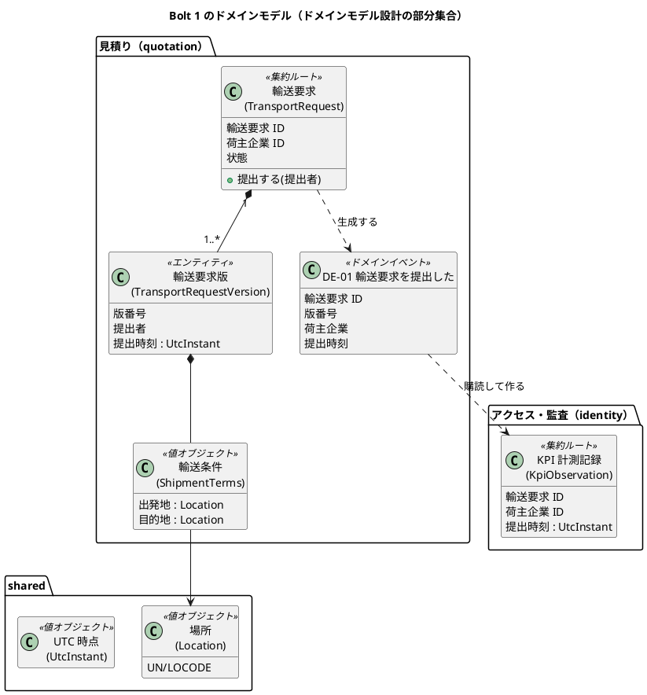
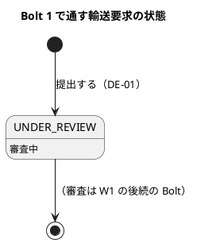
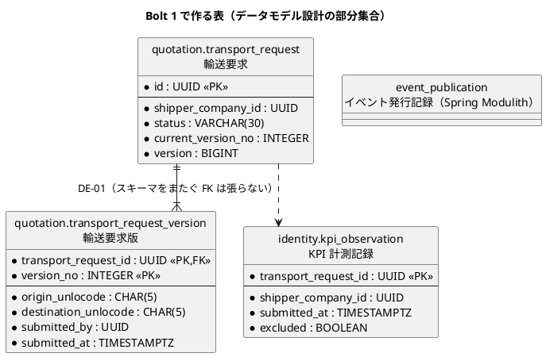
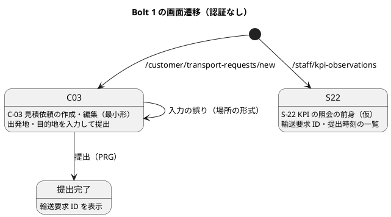

# Bolt 1 計画 - ウォーキングスケルトン

## 基本情報

| 項目 | 内容 |
| :--- | :--- |
| Bolt | 第 1 回（最初の Bolt = ウォーキングスケルトン） |
| 予定 | W1（2026-10-05 の週）、2〜4 時間 |
| 対象 Unit | U1 輸送要求・見積り（提出の最小形）、U4 アクセス・監査（KPI 計測の最小形） |
| GitHub | [#1 [技術] 開発基盤とウォーキングスケルトン](https://github.com/k2works/practical-domain-driven-design-in-enterpris-application/issues/1) の最初のタスク |
| 承認ゲート | すべてのステップで人が検証する（最初の Bolt のため最も密にする） |

## Bolt ゴール

荷主が出発地と目的地だけの輸送要求を画面から提出すると、見積りコンテキストが「輸送要求を提出した」イベント（DE-01）を発行し、アクセス・監査コンテキストがそれを購読して提出時刻を KPI 計測記録に残し、社内の画面に表示される。この 1 本の流れを、決めた構成（ADR-001〜009）のまま動かす。

### 確かめたい仮説

| # | 仮説 | この Bolt で分かること |
| :--- | :--- | :--- |
| H1 | AI は、決めた構成（Spring Modulith の 4 パッケージ構成、MyBatis、Flyway の `common`・`{vendor}`、`@ApplicationModuleListener`、日本語 Gherkin の Cucumber）で動く骨格を、承認ゲートの変更依頼 1 回以内で作れる | 以降の Bolt の承認ゲートの密度（各ステップか、自律実行か） |
| H2 | 同じマイグレーションで、H2 での起動と Testcontainers の PostgreSQL 18 での統合テストの両方が通る（ADR-007） | ADR-007 の「開発 H2、テストは PostgreSQL」が実際に回るか |
| H3 | コンテキスト間のイベント配信（発行の記録と非同期の購読）が、統合テストと受入シナリオ（テスト用の同期の配信）の両方で確かめられる | ADR-003 とテスト戦略の「業務ルール層の配信」の方式が成り立つか |
| H4 | 1 Bolt を 4 時間以内に収められる | Bolt の長さの目安（2〜4 時間）がこの規模の作業に合っているか |

## スコープ

### 通す統合点

### 入れるもの・入れないもの

| 入れる | 入れない（後の Bolt） |
| :--- | :--- |
| Gradle Wrapper、Spring Boot 4.1、Spring Modulith、MyBatis、Flyway、H2、Testcontainers、Thymeleaf | Spring Security と認証（US-18 の Bolt）、Bootstrap と共通部品、htmx |
| 見積り・アクセス監査の 2 モジュールと共有カーネルの最小形（UTC 時点、場所） | 予約・経路設計・追跡・外部データ・通知のモジュール |
| 輸送要求の提出（出発地・目的地だけ）と DE-01 | 審査、見積り、版の管理の全体、冪等コマンド（`commandId`・期待版） |
| KPI 計測記録の提出時刻の記録と一覧（US-21 AC1 の芯） | KPI-02、週次の照会、基準値 |
| アーキテクチャテストの最小形（AT-01 ドメインの非依存、AT-03 モジュール境界） | AT-02・AT-04〜06（Bolt 2 以降） |
| 受入シナリオ 1 本（業務ルール層）と、統合テスト（PostgreSQL） | `@ui` のシナリオ（Playwright）、CI（GitHub Actions） |

## 入力

| 成果物 | パス |
| :--- | :--- |
| ドメインモデル（輸送要求、KPI 計測記録、DE-01） | `docs/design/cargo-tracker/domain_model.md` |
| データモデル（`quotation`・`identity`・`platform` スキーマ、マイグレーションの構成） | `docs/design/cargo-tracker/data_model.md` |
| バックエンドアーキテクチャ（4 パッケージ構成、イベント配信） | `docs/design/cargo-tracker/architecture_backend.md` |
| 技術スタックと版 | `docs/design/cargo-tracker/tech_stack.md`、ADR-006・ADR-007 |
| テスト戦略（BDD の階層、タグ、アーキテクチャテスト） | `docs/design/cargo-tracker/test_strategy.md`、ADR-009 |
| 開発ガイドライン 第 1 章（集約、値オブジェクト、ドメインイベント） | `docs/article/01-ddd-fundamentals.md` の「ドメインモデル」 |
| 開発ガイドライン 第 3 章（4 パッケージ構成、Spring Modulith のモジュールとイベント、Spring Boot 4 の落とし穴） | `docs/article/03-spring-modular-monolith.md` の「モジュラーモノリスとしての Cargo Tracker」 |

## 対象ストーリーと受入条件

ウォーキングスケルトンは統合点を通すことが目的であり、ストーリーの受入条件をこの Bolt で満たし切ることはしない。対応は次のとおりで、残りは W1 の後続の Bolt で満たす。

| ストーリー | 受入条件（[ユーザーストーリー](../../requirements/cargo-tracker/user_story.md)） | この Bolt で通す部分 | 満たす Bolt |
| :--- | :--- | :--- | :--- |
| US-01 輸送条件を提出する | AC1: Given 必須条件がそろった自社の下書き、When 荷主が提出する、Then 新しい輸送要求版が審査中となり提出者と時刻が記録される | 出発地・目的地だけの提出で、版 1 が審査中となり提出者と時刻が記録される | W1 の後続の Bolt（必須条件、下書き、AC2・AC4） |
| US-21 パイロットの KPI を計測する | AC1: Given 輸送要求の提出と、最初の有効な見積り・経路方針の提示、When それぞれが起きる、Then 提出時刻と提示時刻が UTC で記録され、KPI-01 の算式で輸送要求ごとのリードタイムが求められる | 提出時刻だけを UTC で記録する | W2 以降（提示時刻、算式） |

GitHub では [#1](https://github.com/k2works/practical-domain-driven-design-in-enterpris-application/issues/1)（技術タスク、週 W1、Release 0.1）で扱い、ストーリーの Issue（#2 US-01 など）はこの Bolt では閉じない。

## 開発戦略との対応

| 項目 | [開発戦略](development_strategy.md) | この Bolt |
| :--- | :--- | :--- |
| 局面 | 序盤（W1〜W4）、アウトサイドイン | 受入シナリオを先に書き（ステップ 3）、内側へ下りる（ステップ 4〜8）。ただしプロジェクトの骨格とアーキテクチャテスト（ステップ 1〜2）は入口のシナリオを動かす前提として先に作る |
| W1 のデモ項目 | 輸送要求を提出すると、KPI 計測記録に提出時刻が記録され社内の画面に出る（`@walking-skeleton`） | ステップ 8 の目視とステップ 3 の受入シナリオ |
| BDD | 日本語 Gherkin、`features/<context>/`、ステップ定義は自分のコンテキストの入力ポートだけを呼ぶ | ステップ 3 |
| Living Documentation | 序盤は注釈の語彙を定義し、アーキテクチャテストで規則を固定する | ステップ 2・4（語彙の定義と付与）。生成の仕組みは Bolt 2 |
| 開発ガイドライン | 全局面で `docs/article/` の第 1〜3 章に準拠し、Bolt 計画の入力に章と節を挙げる | 第 1 章（ドメインモデル）と第 3 章（モジュラーモノリス）を入力に挙げ、各ステップの承認ゲートで型への準拠を確かめる |

## 設計（この Bolt の範囲）

設計の正は `docs/design/cargo-tracker/` であり、ここではこの Bolt で作る部分だけを抜き出す。

### ドメインモデル

この Bolt では、輸送条件のうち荷受人企業・希望到着期限・貨物（`Cargo`）を持たない。審査記録・版の管理の全体も後の Bolt で足す。

### 状態遷移

下書き（`DRAFT`）は持たず、画面からの提出で直接審査中の輸送要求を作る。下書きと版の表の書き分け（データモデル Q-INV-03）は US-01 の Bolt で入れる。

### データモデル

スキーマをまたぐ参照に外部キーを張らないのはデータモデル設計のとおりである。`event_publication` は Spring Modulith の定義に従い、`{vendor}` のマイグレーションに置く。

### 画面遷移

共通レイアウト・ナビゲーション・認証は持たない。ナビゲーションの骨格は W2 のログインの後に作る（開発戦略の序盤の手順 3）。

> 注（設計への反映が必要）: UI 設計の画面一覧は画面 ID と URL の領域（`/customer/**`・`/staff/**`）だけを定め、画面ごとの URL を定めていない。この Bolt で決めた `/customer/transport-requests/new` と `/staff/kpi-observations`（仮）を、ステップ 8 の承認時に UI 設計へ URL の規約として追記する。

## ステップ計画

状態の記号: `[ ]` 未着手、`[-]` 進行中、`[?]` 承認待ち、`[R]` 修正中、`[x]` 完了、`[S]` スキップ。**【要確認】** の付いたステップは、実行の前に人の確認を取る。

- [x] **1. プロジェクトを作る（設計・準備）** 【要確認: `apps/cargo-tracker/` への新規ファイルの作成】
  - `apps/cargo-tracker/` に Gradle（Groovy DSL）のプロジェクトを、Spring Initializr で Gradle Wrapper ごと生成する（2026-10-01 に人が決定）。
  - 依存は技術スタックのとおり（Spring Boot 4.1.x、Spring Modulith 2.1.x、MyBatis 4.1.0、`spring-boot-flyway`、H2 は `developmentOnly`、Testcontainers、Cucumber 8.0.x、ArchUnit 1.5.x、Thymeleaf）。Spring Security は入れない。
  - 基底パッケージは `com.example.cargotracker`（2026-10-01 に人が決定。第 3 章と同じ）。
  - Spring Initializr の MyBatis は Spring Boot 4.0 系までしか選べないため、MyBatis 4.1.0 は生成後に `build.gradle` へ足す。
  - 完了の判定: `./gradlew build` が通る（テストなし）。
- [x] **2. アーキテクチャテストを書く（Red → Green）**
  - `ApplicationModules.of(...).verify()`（AT-03）と、`domain` がフレームワークに依存しない ArchUnit のルール（AT-01）を書き、空の `quotation`・`identity` モジュールで通す。
  - 完了の判定: アーキテクチャテストが通る。わざと `domain` から Spring を参照すると失敗することを一度確かめる。
- [x] **3. 受入シナリオを書く（Red）**
  - `src/test/resources/features/quotation/walking_skeleton.feature`（`# language: ja`、Feature のタグ `@walking-skeleton @US-01 @US-21 @must`）に 1 シナリオを書く: 「荷主が出発地 JPTYO・目的地 NLRTM の輸送要求を提出すると、KPI 計測記録に提出時刻が記録される」。
  - シナリオには `@US-nn-ACm` を付けない。受入条件を部分的にしか満たさない骨格のシナリオを、受入条件の達成として数えないためである。US-01 の AC1 などのシナリオは W1 の後続の Bolt で書き、受入条件の数との照合（テスト戦略）は `@walking-skeleton` を除外して行う。
  - ステップ定義は見積りの入力ポートだけを呼び、リポジトリはメモリ上の実装、Clock は固定、イベントはテスト用の同期の配信で届ける（テスト戦略）。
  - 完了の判定: シナリオが「未実装」で失敗する。
- [x] **4. 共有カーネルとドメインを作る（TDD）**
  - `shared`: UTC 時点（`UtcInstant`）、場所（`Location`。UN/LOCODE の 5 文字の形式の検証）。ユニットテストを先に書く。
  - `shared.annotation.ddd`: この Bolt で使う語彙の注釈 `@AggregateRoot`・`@ValueObject`・`@DomainEvent` を定義し、作るクラスに付ける（開発戦略の Living Documentation、序盤の重点）。
  - `quotation.domain`: 輸送要求（`TransportRequest`）の最小形。輸送条件（`ShipmentTerms`）は出発地・目的地だけを持ち、「提出する」で版 1 の輸送要求版（`TransportRequestVersion`、提出者・提出時刻）を作り、状態を審査中にして DE-01「輸送要求を提出した」（輸送要求 ID、版番号、荷主企業、提出時刻）を生成する。
  - `identity.domain`: KPI 計測記録（`KpiObservation`）の最小形（輸送要求 ID、荷主企業、提出時刻を記録する）。
  - 完了の判定: ユニットテストが通る（場所の形式の誤り、提出時の DE-01 の内容、状態が審査中になることを含む）。
- [x] **5. アプリケーション層でつなぐ（Green）**
  - 見積りの入力ポート「輸送要求を提出する」と、アクセス・監査の DE-01 の購読（`@ApplicationModuleListener`）を作る。
  - 完了の判定: ステップ 3 の受入シナリオが通る。
- [x] **6. 永続化を作る（Red → Green）** 【要確認: DB スキーマの作成】
  - Flyway: `db/migration/common/` に `quotation.transport_request`・`quotation.transport_request_version` と `identity.kpi_observation` を、`db/migration/{vendor}/` に Spring Modulith のイベント発行記録の表を作る。版番号は作成日時（ADR-007）。
  - 列はデータモデルの名前と型のまま、この Bolt で使うものだけを作る（`transport_request`: `id`・`shipper_company_id`・`status`・`current_version_no`・`version`、`transport_request_version`: `transport_request_id`・`version_no`・`origin_unlocode`・`destination_unlocode`・`submitted_by`・`submitted_at`、`kpi_observation`: `transport_request_id`・`shipper_company_id`・`submitted_at`・`excluded`）。残りの列は使う Bolt のマイグレーションで足す。`status` の CHECK 制約はデータモデルの値の一覧のとおりに作る。
  - MyBatis のマッパーとリポジトリの実装。
  - 統合テスト（Testcontainers の PostgreSQL 18）: 輸送要求の保存と読み出し、KPI 計測記録の保存。
  - 完了の判定: 統合テストが通り、`bootRun`（H2）で起動してマイグレーションが通る（仮説 H2）。
- [x] **7. イベント配信を統合テストで確かめる**
  - PostgreSQL 上で、提出と同じトランザクションでイベント発行記録が残り、購読が完了すると KPI 計測記録ができることを、Spring Modulith のテスト（Scenario）で確かめる。
  - 完了の判定: 統合テストが通る（仮説 H3）。
- [x] **8. 画面をつなぐ** 【要確認: 画面を目視で確かめる】
  - 顧客向けの提出画面（C-03 見積依頼の作成・編集の最小形、`/customer/transport-requests/new`）と、社内向けの KPI 計測記録の一覧（S-22 KPI の照会の前身となる仮の画面、`/staff/kpi-observations`）を Thymeleaf で作る。提出は PRG（POST の後に一覧または完了の画面へリダイレクト）にする。MockMvc のテストを先に書く。
  - 完了の判定: MockMvc のテストが通り、H2 で起動して画面から提出すると一覧に提出時刻が表示される。
- [x] **9. 検証する**
  - `./gradlew check`（ユニット・アーキテクチャ・受入シナリオ・統合テスト）がすべて通る。
  - 実行時間と、各ステップの承認ゲートの通過数・変更依頼の数を記録する。
- [?] **10. Bolt 終了報告とゲート密度の判断** 【要確認: 以降の進め方の選択】
  - `bolt_01_report.md` に Bolt 終了報告（成果・指標・仮説の結論・判断と学び）を書く。
  - ウォーキングスケルトンの結果から、次の Bolt 以降を「各ステップでゲート」と「自律実行」のどちらで進めるかを、人が 1 回だけ選ぶ（AI-DLC 版ガイド 2.3）。

### 時間の配分と打ち切り

| ステップ | 目安 |
| :--- | :--- |
| 1〜3 | 60 分 |
| 4〜5 | 45 分 |
| 6〜7 | 60 分 |
| 8〜10 | 45 分 |

4 時間を超えそうなときは、ステップ 8（画面）を次の Bolt に回し、ステップ 7 までをこの Bolt の完了とする。画面の統合点は Bolt 2 の最初のステップで通す。

## 確認ポイント

| ステップ | 確認すること | 理由 |
| :--- | :--- | :--- |
| 1 | `apps/cargo-tracker/` への新規ファイルの作成と、生成した `build.gradle` の内容（生成の方法とパッケージ名は決定済み） | 新規ファイルの作成と外部サービスの利用は確認必須（CLAUDE.md） |
| 6 | 最初のスキーマとマイグレーション | データベースのスキーマ変更は確認必須（CLAUDE.md） |
| 8 | 画面の流れを人が目で確かめる | ウォーキングスケルトンの完了の判定 |
| 10 | 以降のゲート密度 | AI-DLC のラダープロンプト |

すべてのステップの終わりに承認ゲートを置き、人はコードを全行理解してから承認する。

## AI の仮定

- 基底パッケージを `com.example.cargotracker` とした。A 社の実在のドメイン名を使わないため、第 3 章の手本と同じ名前にした（人が承認）。
- Bolt 1 では Spring Security を入れない。Spring Boot は Security を入れると全画面にログインを求めるため、認証は US-18 の Bolt でまとめて入れる。
- ウォーキングスケルトンの提出は出発地・目的地だけとし、版・審査・冪等コマンドは後の Bolt で足す。データモデルの列も、この Bolt で使うものだけを作る。
- CI（GitHub Actions）は Bolt 2 で作る。この Bolt はローカルの `./gradlew check` で検証する。
- 認証がないため、荷主企業 ID と提出者 ID はテスト用の固定値（設定ファイルの値）を使う。US-18 の Bolt で認証の主体に置き換える。
- 提出した輸送要求の状態は、データモデルの状態の値 `UNDER_REVIEW`（審査中）にする（US-01 AC1 の「審査中となり」）。審査の操作は W1 の後続の Bolt（US-02）で作る。
- 用語集とクラスの整合のテスト、JIG と Spring Modulith の図の生成は、CI と合わせて Bolt 2 で作る（4 時間に収めるため。開発戦略を合わせて直した）。この Bolt では注釈の語彙の定義と付与までを行う。

## リスクと対策

| リスク | 影響 | 対策 |
| :--- | :--- | :--- |
| Spring Boot 4.1・Spring Modulith 2.1・MyBatis 4.1 の組み合わせで起動しない | ステップ 1・6 が止まる | 第 3 章の落とし穴（`spring-boot-flyway` など）を先に確かめる。版の組み合わせの問題は ADR-006 の範囲で版を下げて記録する |
| H2 と PostgreSQL の方言の違いでマイグレーションが片方だけ通る（H2） | ADR-007 の前提が崩れる | 共通の SQL だけを `common` に置き、方言は `{vendor}` に分ける。両方で通ることをステップ 6 の完了の判定にする |
| Testcontainers が手元の Docker で動かない | 統合テストができない | ステップ 6 の最初に Docker の稼働を確かめる。動かなければ人に確認し、統合テストを Bolt 2 の CI に回す |
| 4 時間を超える（H4） | Bolt の長さの目安が崩れる | 打ち切りの線（ステップ 8 を Bolt 2 へ）に従う |

## 完了条件

### Definition of Done

- [ ] ステップ 1〜10 が完了し、各ステップの承認ゲートを人が通した（打ち切った場合はステップ 7 まで）
- [ ] `./gradlew check` がすべて通る（ユニット・アーキテクチャ AT-01・AT-03・受入シナリオ・統合テスト）
- [ ] `@wip` のシナリオが残っていない
- [ ] H2 での起動と PostgreSQL 18 での統合テストが同じマイグレーションで通る
- [ ] 作ったクラスに注釈の語彙（`@AggregateRoot`・`@ValueObject`・`@DomainEvent`）が付いている
- [ ] 設計の判断が変わったら `docs/design/cargo-tracker/` と ADR に反映した（UI 設計の URL の規約を含む）
- [ ] 開発戦略の「品質チェックのコマンド」を実際のコマンドに更新した
- [ ] `bolt_01_report.md` に仮説 H1〜H4 の結論とゲート密度の判断を記録した
- [ ] ユーザーマニュアルは更新しない。この Bolt の画面は認証もナビゲーションもない仮の画面であり、マニュアルの対象になる画面は W2 以降に作る。マニュアルの作成は、利用者が使う画面ができる Bolt の計画で見積もる

### デモ項目

| # | デモ | 確かめること |
| :--- | :--- | :--- |
| 1 | H2 で起動し、`/customer/transport-requests/new` から JPTYO → NLRTM を提出する | 提出が受け付けられ、輸送要求 ID が表示される |
| 2 | `/staff/kpi-observations` を開く | デモ 1 の輸送要求の提出時刻（UTC）が一覧に出る |
| 3 | 出発地に `TYO` など形式の誤りを入れて提出する（`TOKYO` は形式に合うため使わない） | 誤りが示され、提出されない |
| 4 | `./gradlew check` を実行する | すべて通る（受入シナリオ `@walking-skeleton`、統合テスト、アーキテクチャテスト） |

## 更新履歴

| 日付 | 内容 | 作成 | 承認 |
| :--- | :--- | :--- | :--- |
| 2026-10-01 | 初版（Bolt ゴール、仮説、10 のステップ） | anthropic/claude-opus-5-5 | human:kakimomokuri |
| 2026-10-01 | 開始準備の検証を反映: 対象ストーリー、開発戦略との対応、設計 4 図、リスク、完了条件を追加。表をデータモデルの `transport_request_version` に合わせ、受入シナリオのタグと注釈の語彙を開発戦略・テスト戦略に合わせた | anthropic/claude-opus-5-5 | human:kakimomokuri |
| 2026-10-01 | 開発戦略に合わせ、入力に開発ガイドラインの第 1 章と第 3 章の節を挙げた | anthropic/claude-opus-5-5 | human:kakimomokuri |
| 2026-10-01 | 生成の方法（Spring Initializr）と基底パッケージ（`com.example.cargotracker`）の決定を反映し、計画を承認 | anthropic/claude-opus-5-5 | human:kakimomokuri |
| 2026-10-01 | ステップ 1〜9 を完了とし、ステップ 10 を人の判断待ちにした。デモ 3 の誤りの例を `TYO` に直した。結果は [Bolt 1 終了報告](bolt_01_report.md) | anthropic/claude-opus-5-5 | 承認待ち |

## 関連ドキュメント

- [リリース計画](release_plan.md)（W1）
- [開発戦略](development_strategy.md)（序盤）
- [ユーザーストーリー](../../requirements/cargo-tracker/user_story.md)（US-01、US-21）
- [ドメインモデル](../../design/cargo-tracker/domain_model.md)、[データモデル](../../design/cargo-tracker/data_model.md)、[UI 設計](../../design/cargo-tracker/ui_design.md)、[テスト戦略](../../design/cargo-tracker/test_strategy.md)
- [ADR 一覧](../../adr/cargo-tracker/index.md)
