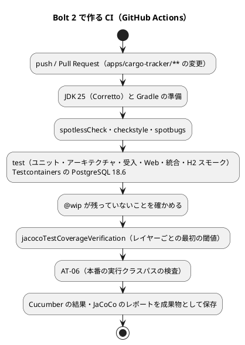
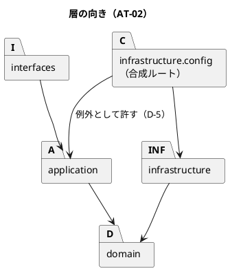

# Bolt 2 計画 - CI と品質の安全網

## 基本情報

| 項目 | 内容 |
| :--- | :--- |
| Bolt | 第 2 回 |
| 予定 | W1（2026-10-05 の週）、2〜4 時間 |
| 対象 | 技術タスク（Unit 横断）。ストーリーの受入条件は扱わない |
| GitHub | [#1 [技術] 開発基盤とウォーキングスケルトン](https://github.com/k2works/practical-domain-driven-design-in-enterpris-application/issues/1) の続き |
| 承認ゲート | 各ステップで人が検証する（Bolt 1 で決めたゲート密度。AT-02 と CI がそろうまで） |
| 前の Bolt | [Bolt 1 終了報告](bolt_01_report.md)、[Bolt 1 開発成果物レビュー](../../review/cargo-tracker/bolt_01_review_20261001.md) |

## Bolt ゴール

push と Pull Request のたびに、GitHub Actions が cargo-tracker のテスト・層の規則・静的解析・カバレッジの閾値を検証する。ローカルでは、SonarQube の品質ゲートで同じコードを判定できる。Bolt 1 のクローズで未達だった「CI が緑」と「Quality Gate が PASS」を満たし、以降の Bolt を、依存の誤りを目視に頼らない状態で進められるようにする。

### 確かめたい仮説

| # | 仮説 | この Bolt で分かること |
| :--- | :--- | :--- |
| H1 | GitHub Actions の ubuntu ランナーで、Testcontainers の PostgreSQL 18 を含む `./gradlew check` が、テスト戦略の目標（ユニット・アーキテクチャ・受入 2 分、Web・統合・スモーク 6 分）に収まる | CI の段階を分けるべきか |
| H2 | Bolt 1 のコードは、テスト戦略の「最初の閾値」（全体 75% / 65% など）を、テストを足さずに満たす | 閾値を最初から強制できるか、どのレイヤーにテストが足りないか |
| H3 | AT-02 を入れても、合成ルートの例外（D-5）だけで既存のコードが通る | 層の規則がいまの構成と矛盾しないか |
| H4 | SonarQube の品質ゲート（Bug 0、Vulnerability 0、重複 3% 未満）を、Bolt 1 のコードのまま通る | 静的解析の指摘を返済する量 |

## ふりかえりと前の Bolt からの引き継ぎ

| 入力 | 内容 | この Bolt での扱い |
| :--- | :--- | :--- |
| Try T-1 | 対象の設計の約束を「入れる／入れない」の表に必ず書く | 下の「設計の約束」の表 |
| Try T-2 | AT-02 と `@DomainEvent` の配置の ArchUnit を入れ、それまでは各ステップでゲートを置く | ステップ 3。ゲートは各ステップ |
| Try T-5 | CI・JaCoCo・フォーマッター・SonarQube をそろえ、`SONAR_TOKEN` を人が発行する | ステップ 2・4〜6 |
| レビュー R-15・R-16 | AT-02（合成ルートの例外）、AT-06 | ステップ 3 |
| レビュー R-31 | フォーマッターと書式の統一 | ステップ 2 |
| レビュー R-33 | `postgres:18` のマイナー版の固定 | ステップ 1 |
| Bolt 3 へ回すもの | E2E の基盤（Playwright、axe-core）、JIG・Spring Modulith の図と用語集の整合のテスト、追記専用の権限（R-17）、アプリケーション開発環境の手順書（R-11） | 半日を超えないよう分けた。Bolt 3 の計画で扱う |

## スコープ

### 設計の約束（Try T-1）

| 設計の約束 | 出典 | この Bolt |
| :--- | :--- | :--- |
| CI の実行順（ユニット・アーキテクチャ・受入 → Web → 統合 → H2 スモーク → カバレッジの閾値）と、段階ごとの時間の目標 | テスト戦略「CI での実行」 | 入れる。コンテナイメージのビルドと配備、E2E は入れない（運用準備と Bolt 3） |
| Cucumber の実行結果を CI の成果物として保存する | テスト戦略、ADR-009 | 入れる |
| カバレッジはレイヤーごとに測り、最初の閾値で始める | テスト戦略「カバレッジ目標」 | 入れる |
| 静的解析は Checkstyle・SpotBugs（Java 25 を読める版） | 技術スタック | 入れる |
| AT-02 層の向き、AT-06 本番の実行クラスパスに H2・Hibernate ORM・JPA がない | テスト戦略「アーキテクチャテスト」 | 入れる |
| `@DomainEvent` は `domain.events` に置く | 開発戦略「アノテーションの語彙」 | 入れる（D-1 の結論に従って片方向か両方向かを決める） |
| AT-04 マッパーの SQL は自分のスキーマだけを参照する、AT-05 ステップ定義は自分の入力ポートだけを呼ぶ | テスト戦略 | 入れない（Bolt 3 以降。コンテキストが 2 つのうちは効果が小さい） |
| `@wip` が残っていないことと、受入条件の数との照合の自動検査 | テスト戦略、ADR-009 | 入れる（`@wip` の検出だけ。受入条件の数との照合は、受入条件のシナリオができる US-01 の Bolt で入れる） |
| 脆弱性スキャン（Trivy） | 技術スタック | 入れない（運用準備でイメージと合わせて入れる） |
| GitHub Actions は AWS へ OIDC で認証する | 技術スタック、ADR-008 | 入れない（この Bolt は AWS に触れない） |

### 入れるもの・入れないもの

| 入れる | 入れない（後の Bolt） |
| :--- | :--- |
| GitHub Actions の CI（`apps/cargo-tracker/**` の変更で動く） | 配備、コンテナイメージ、E2E（運用準備・Bolt 3） |
| JaCoCo 0.8.15 とレイヤーごとの閾値 | 閾値の引き上げ（実績に合わせて段階的に） |
| Checkstyle 14.3.0、SpotBugs 4.10.4（Gradle プラグイン 6.5.12） | PMD などの追加の解析 |
| フォーマッター（Spotless 8.10.3）【要確認】 | — |
| AT-02、AT-06、`@DomainEvent` の配置の規則 | AT-04、AT-05 |
| SonarQube のスキャンの手順（Gradle の SonarQube プラグイン 7.5.0.8588、`sonarqube.config.json`、`sonar_local.js` を Wrapper で動かす修正） | SonarCloud など外部のサービス |
| Testcontainers のイメージを `postgres:18.6` に固定 | 依存の自動更新の仕組み（Renovate など。運用準備で判断） |

## 設計（この Bolt の範囲）

ドメインモデル・状態遷移・データモデル・画面に変更はないため、4 図は省略する。代わりに CI の流れを示す。

### AT-02 の規則（D-5 の結論に従う）

## 入力

| 成果物 | パス |
| :--- | :--- |
| CI の実行順、時間の目標、カバレッジ目標、アーキテクチャテスト | `docs/design/cargo-tracker/test_strategy.md` |
| 静的解析・カバレッジ・CI のツール | `docs/design/cargo-tracker/tech_stack.md` |
| 層の規則と合成ルートの例外、`allowedDependencies` | `docs/design/cargo-tracker/architecture_backend.md` |
| 品質チェックのコマンド | `docs/development/cargo-tracker/development_strategy.md` |
| SonarQube の手順 | `.claude/skills/operating-qt/SKILL.md`、`ops/scripts/sonar_local.js` |
| 開発ガイドライン 第 3 章（4 パッケージ構成とアーキテクチャテスト） | `docs/article/03-spring-modular-monolith.md` の「モジュラーモノリスとしての Cargo Tracker」 |

## ステップ計画

状態の記号: `[ ]` 未着手、`[-]` 進行中、`[?]` 承認待ち、`[R]` 修正中、`[x]` 完了、`[S]` スキップ。**【要確認】** の付いたステップは、実行の前に人の確認を取る。

- [ ] **1. テストのイメージを固定する**
  - `TestcontainersConfiguration` の `postgres:18` を `postgres:18.6` にする（R-33）。
  - 完了の判定: `./gradlew check` が通る。
- [ ] **2. 書式と静的解析を入れる** 【要確認: Spotless の導入（技術スタックにないツール）】
  - Spotless（Java の書式。Initializr のファイルのタブを含めて統一する）、Checkstyle、SpotBugs を `build.gradle` に入れ、`check` で動かす。規則は最小から始め、Checkstyle の設定は `config/checkstyle/` に置く。
  - 先に `spotlessApply` で書式だけのコミットを分ける（振る舞いの変更と混ぜない）。
  - 完了の判定: `./gradlew check` が通る。指摘を抑止した場合は理由を書く。
- [ ] **3. 層とモジュールの規則を足す（Red → Green）** 【要確認: D-5 合成ルートの例外、D-1 `DomainEvent` の扱い】
  - AT-02: `layeredArchitecture()` で `interfaces` → `application` → `domain` ← `infrastructure` を固定し、`..infrastructure.config..` だけが `application` に依存してよいとする。違反を一時的に入れて失敗することを確かめる。
  - `@DomainEvent` の付いたクラスは `..domain.events..` にある（D-1 で一本化するなら、逆向きの「`domain.events` のクラスは `@DomainEvent` の付いた record」も入れる）。
  - AT-06: Gradle のタスクで、`runtimeClasspath`（本番の実行クラスパス）に H2・Hibernate ORM・JPA がないことを検査し、`check` に組み込む。
  - 完了の判定: 規則が通り、違反で失敗することを確かめた。
- [ ] **4. カバレッジを測る**
  - JaCoCo 0.8.15 を入れ、テスト戦略のレイヤーごとの最初の閾値（domain 85%/75%、application 80%/65%、interfaces 65%、infrastructure 70%、全体 75%/65%）を `jacocoTestCoverageVerification` で検証する。
  - 閾値に届かないレイヤーがあれば、足りないテストを書いて届かせる（閾値を下げない。下げる場合は人の判断を仰ぐ）。
  - 完了の判定: `./gradlew check` がカバレッジの検証を含めて通る。
- [ ] **5. CI を作る** 【要確認: 新規ファイル、外部連携（GitHub Actions）】
  - `.github/workflows/cargo-tracker-ci.yml` を作る。`apps/cargo-tracker/**` の変更で、push（develop・main）と Pull Request に動く。
  - 手順は JDK 25（Corretto）、Gradle のキャッシュ、`./gradlew check`、`@wip` の検出、成果物（Cucumber・JaCoCo・テスト結果）の保存。
  - 権限は `contents: read` に絞る。
  - push して、CI が緑になることを `gh run` で確かめる（外部への公開のため push は人の確認を取る）。
  - 完了の判定: CI が緑。実行時間を記録する（仮説 H1）。
- [ ] **6. SonarQube の品質ゲートを通す** 【要確認: `SONAR_TOKEN` を人が発行して `.env` に置く】
  - Gradle の SonarQube プラグインを入れ、JaCoCo の XML を連携する。
  - `sonarqube.config.json` に cargo-tracker（`scanType: gradle`、`srcDir: apps/cargo-tracker`）を登録する。
  - `ops/scripts/sonar_local.js` の Gradle のスキャンを、Wrapper（`./gradlew`）があればそれを使うように直す（`operating-script`。運用手順書にも書く）。
  - `npx gulp sonar-local:check` で、Quality Gate が PASS になることを確かめる。指摘は直すか、残す理由を書く。
  - 完了の判定: Quality Gate が PASS（Bug 0、Vulnerability 0、重複 3% 未満、Code Smell の方針を明記）。
- [ ] **7. 文書を合わせる**
  - 開発戦略の「品質チェックのコマンド」に、書式・静的解析・カバレッジ・SonarQube のコマンドを足す。
  - テスト戦略の CI の段階と実際のワークフローの差（配備と E2E がまだないこと）を書く。
- [ ] **8. 検証と Bolt 終了報告**
  - `./gradlew check` と CI が緑、Quality Gate が PASS であることを確かめる。
  - `bolt_02_report.md` に成果・指標・仮説の結論・判断と学びを書く。

### 時間の配分と打ち切り

| ステップ | 目安 |
| :--- | :--- |
| 1〜2 | 40 分 |
| 3〜4 | 60 分 |
| 5 | 40 分 |
| 6〜8 | 60 分 |

4 時間を超えそうなときは、ステップ 6（SonarQube）を Bolt 3 の最初に回す。`SONAR_TOKEN` がそろわないときも、ステップ 6 を回してほかを先に完了させる。

## 確認ポイント

| ステップ | 確認すること | 理由 |
| :--- | :--- | :--- |
| 2 | Spotless を入れるか（技術スタックにない） | 外部のツールの導入は確認必須（CLAUDE.md） |
| 3 | D-5（合成ルートを依存の規則の例外にする）、D-1（`DomainEvent` を注釈に一本化する） | 構造の判断は人が決める |
| 4 | 閾値に届かないときに、閾値を下げるか | テスト戦略の判断 |
| 5 | ワークフローの新規作成、push | 新規ファイルと外部連携は確認必須（CLAUDE.md） |
| 6 | `SONAR_TOKEN` の発行 | 認証情報は人が扱う |

すべてのステップの終わりに承認ゲートを置き、人はコードを全行理解してから承認する。

## AI の仮定

- CI の Testcontainers は、GitHub Actions の ubuntu ランナーの Docker で動く。ランナーの準備に時間がかかる場合は、テストの段階を分けるかを H1 の結果で判断する。
- カバレッジの閾値は、テスト戦略の「最初の閾値」をそのまま使う。
- SonarQube はローカルのサーバー（localhost:9001）を使い、CI からはスキャンしない。CI での品質ゲートは、Checkstyle・SpotBugs・JaCoCo で代える。
- `@wip` の検出は、`features/` の下の `@wip` を grep する簡単なステップで行う。
- Spotless の Java の書式は、既存のコードの書き方（4 スペースのインデント、120 桁）に近い palantir-java-format を使う。

## リスクと対策

| リスク | 影響 | 対策 |
| :--- | :--- | :--- |
| SpotBugs が Java 25 のクラスファイルを読めない | ステップ 2 が止まる | 4.10.4 を使う。読めなければ SpotBugs を外して記録し、Checkstyle と SonarQube で代える |
| 既存のコードの静的解析の指摘が多い | 時間を超える | 規則を最小から始める。指摘は直し、抑止するときは理由を書く |
| CI の Testcontainers が遅い・不安定 | H1 が成り立たない | Docker のイメージのキャッシュ、テストの段階の分割を検討する |
| `SONAR_TOKEN` がそろわない | ステップ 6 が止まる | ステップ 6 を Bolt 3 の最初に回す |

## 完了条件

### Definition of Done

- [ ] ステップ 1〜8 が完了し、各ステップの承認ゲートを人が通した
- [ ] `./gradlew check`（書式・静的解析・テスト・AT-02・AT-06・カバレッジ）がローカルと CI の両方で緑
- [ ] SonarQube の Quality Gate が PASS（回した場合はその理由を記録）
- [ ] 規則（AT-02、`@DomainEvent` の配置、AT-06）は、違反で失敗することを確かめた
- [ ] 開発戦略のコマンドとテスト戦略の CI の記述を、実際のものに合わせた
- [ ] `bolt_02_report.md` に仮説 H1〜H4 の結論を記録した
- [ ] ユーザーマニュアルは更新しない（画面の変更がない）

### デモ項目

| # | デモ | 確かめること |
| :--- | :--- | :--- |
| 1 | develop に push する | GitHub Actions の cargo-tracker の CI が緑になり、Cucumber と JaCoCo のレポートが成果物に残る |
| 2 | `domain` から `infrastructure` を参照する一時的な変更でテストを動かす | AT-01・AT-02 が失敗する |
| 3 | `./gradlew jacocoTestReport` のレポートを開く | レイヤーごとのカバレッジが閾値を満たす |
| 4 | `npx gulp sonar-local:check` | Quality Gate が PASS |

## 更新履歴

| 日付 | 内容 | 作成 | 承認 |
| :--- | :--- | :--- | :--- |
| 2026-10-01 | 初版 | anthropic/claude-opus-5-5 | human:kakimomokuri |
| 2026-10-01 | 計画を承認。ステップ 2・3・5・6 の【要確認】（Spotless、D-5、D-1、push、`SONAR_TOKEN`）は、そのステップの実行前に確認する | anthropic/claude-opus-5-5 | human:kakimomokuri |

## 関連ドキュメント

- [リリース計画](release_plan.md)（W1）
- [開発戦略](development_strategy.md)（序盤の手順 2）
- [Bolt 1 終了報告](bolt_01_report.md)（Try、持ち越した負債）
- [Bolt 1 開発成果物レビュー](../../review/cargo-tracker/bolt_01_review_20261001.md)
- [テスト戦略](../../design/cargo-tracker/test_strategy.md)、[技術スタック](../../design/cargo-tracker/tech_stack.md)、[バックエンドアーキテクチャ](../../design/cargo-tracker/architecture_backend.md)
