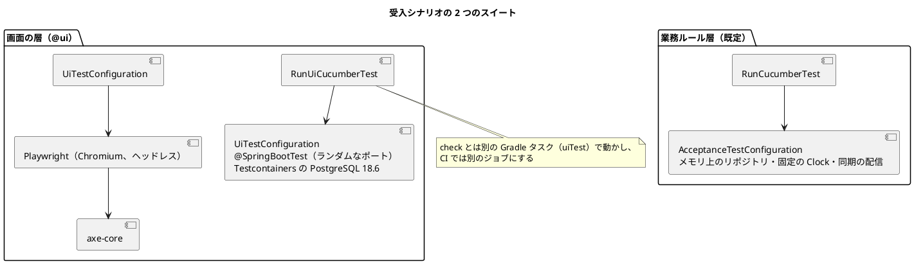
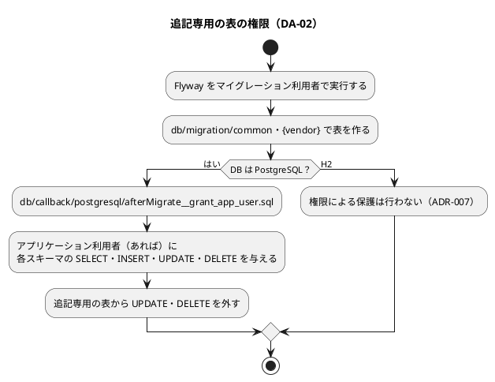

# Bolt 3 計画 - E2E の基盤と生きたドキュメント

## 基本情報

| 項目 | 内容 |
| :--- | :--- |
| Bolt | 第 3 回 |
| 予定 | W1（2026-10-05 の週）、2〜4 時間 |
| 対象 | 技術タスク（Unit 横断）と、人が決めた D-1・D-3〜D-7 の反映 |
| GitHub | [#1 [技術] 開発基盤とウォーキングスケルトン](https://github.com/k2works/practical-domain-driven-design-in-enterpris-application/issues/1) の残り。この Bolt で #1 の開発基盤を完了する |
| 承認ゲート | 各ステップで人が検証する（自律実行へ移るかは未決定） |
| 前の Bolt | [Bolt 2 終了報告](bolt_02_report.md)、[Bolt 2 開発成果物レビュー](../../review/cargo-tracker/bolt_02_review_20261002.md) |

## Bolt ゴール

人が決めた D-1・D-3〜D-7 を設計文書と ADR に反映したうえで、次の 4 つを作る。これで W1 の開発基盤（#1）を終え、次の Bolt から業務のストーリー（US-01 AC2）を画面まで受入シナリオで駆動できる状態にする。

- 画面を通す受入シナリオ（`@ui`。Playwright と axe-core）を CI で毎回動かす仕組み
- コードから設計図と用語集を生成する仕組み（JIG、Spring Modulith）
- 追記専用の表を DB の権限で守る仕組み
- アプリケーション開発環境の手順書

### 確かめたい仮説

| # | 仮説 | この Bolt で分かること |
| :--- | :--- | :--- |
| H1 | Playwright と axe-core の `@ui` のシナリオを、アプリケーションを同じ JVM で起動して（PostgreSQL は Testcontainers）CI で毎回動かせ、時間の目標（E2E 10 分以内）に収まる | ステージングがなくても E2E を毎回動かせるか |
| H2 | 業務ルール層と画面の層の受入シナリオを、Cucumber の別のスイートとして共存させられる | 2 つの階層の受入シナリオの構成 |
| H3 | 用語集（ドメインモデル設計）とクラス・Javadoc の整合を、テストで機械的に確かめられる | Living Documentation の「重複させた知識の検証」が回るか |
| H4 | 追記専用の表の UPDATE・DELETE を、PostgreSQL の権限で拒否できることを統合テストで確かめられる | `afterMigrate` のコールバックで DA-02 が実現できるか |

## ふりかえりと前の Bolt からの引き継ぎ

| 入力 | 内容 | この Bolt での扱い |
| :--- | :--- | :--- |
| 人の決定（2026-10-02） | D-8 次の Bolt は Bolt 3（技術）。D-3 KPI-01 は版 1 の最初の提出時刻から。D-4 業務番号は `TR-年-年ごとの連番`（版は「版 2」と表記）。D-6 出発地と目的地が同じ依頼は拒否。Spotless・D-5・D-1 を承認。D-7 Dependabot を有効にする | ステップ 1 で設計文書・要件・ADR に反映する。D-4・D-6 の実装は US-01 AC2 の Bolt |
| Try T-6 | 自律の実行の前に、計画に残る【要確認】をまとめて確認する | 下の「確認ポイント」の 5 点を、計画の承認の場でまとめて確認する |
| Try T-8 | 品質ゲートを足したら、不合格の入力で失敗することを確かめる | ステップ 2〜4 の完了の判定に入れる |
| Try T-9 | 「手順書にも書く」ステップは、手順書の差分がないうちは完了にしない | ステップ 5 の完了の判定 |
| レビュー R-11・R-17（Bolt 1） | 手順書、追記専用の権限 | ステップ 4・5 |
| Bolt 2 レビュー R-15・R-17・R-31・R-32 | 単位テストだけのカバレッジ、受入条件の数との照合、閾値の ratchet、そのほか | 入れない（受入条件の照合は US-01 AC2 の Bolt、ほかは W2 以降） |

## スコープ

### 設計の約束（Try T-1）

| 設計の約束 | 出典 | この Bolt |
| :--- | :--- | :--- |
| `@ui` は Playwright で実ブラウザを操作し、PostgreSQL を使う。axe-core の自動検査を `@ui` で表示したすべての画面で CI で毎回 | テスト戦略「シナリオの階層」「アクセシビリティテスト」 | 入れる（ウォーキングスケルトンの 2 画面） |
| キーボード操作だけで主要フローを操作できる | テスト戦略 | 入れる（提出の流れをキー操作だけで通す） |
| 顧客向けの画面を 320 CSS px で横スクロールなしに表示する（1.4.10） | テスト戦略 | 入れる |
| WCAG 2.2 の新しい基準、Playwright の時計、支援技術による手動確認 | テスト戦略 | 入れない（対象の画面要素がまだない。手動確認は画面を作り込む Bolt） |
| E2E は main へのマージ後にステージングで実行する | テスト戦略「CI での実行」 | 変える（ステージングがまだないため、CI の中でアプリを起動して実行する。ステージングができたら移す。テスト戦略に書く） |
| 用語集とクラス名・Javadoc の整合を確かめるテスト | 開発戦略「重複させた知識の検証」 | 入れる |
| JIG の設計ドキュメントと Spring Modulith のモジュール図を CI で生成し、成果物にする。生成物はコミットしない | 開発戦略「生成と公開」 | 入れる |
| jig-erd の ER 図（週次の見直しの前） | 開発戦略 | 入れない（週次の見直しで実行する） |
| 追記専用の表は、PostgreSQL の `afterMigrate` でアプリケーション利用者に SELECT・INSERT だけを与える。H2 では行わない | データモデル、運用要件 DA-02、ADR-007 | 入れる（`quotation.transport_request_version` だけ。ほかの追記専用の表はまだない） |
| DB 利用者の作成（`db:init`）と配備後の確認（`db:grants:verify`） | 運用要件 | 入れない（運用準備。この Bolt ではテストの中でアプリケーション利用者を作る） |
| 運用の手順は運用手順書に書き、定義済みのタスクを使う | CLAUDE.md | 入れる（アプリケーション開発環境の手順書） |

### 入れるもの・入れないもの

| 入れる | 入れない（後の Bolt） |
| :--- | :--- |
| D-1・D-3〜D-7 の文書への反映、Dependabot | D-4・D-6 の実装（US-01 AC2 の Bolt） |
| Playwright for Java 1.63.0、axe-core Playwright 4.13.0、`@ui` のシナリオ 1 本（ウォーキングスケルトンの画面） | 主要フローの `@ui`（画面ができる Bolt ごとに足す） |
| JIG（Gradle プラグイン 2026.9.1）、Spring Modulith のドキュメント生成、用語集の整合テスト | `@CoreConcept`・`@GuidedTour`（中盤・終盤） |
| `afterMigrate` のコールバックと権限の統合テスト | `db:init`・`db:grants:verify` の運用タスク（運用準備） |
| アプリケーション開発環境の手順書（`docs/operation/cargo-tracker/`）と `apps/cargo-tracker/README.md` | ステージング・本番の手順書（運用準備） |

## 設計（この Bolt の範囲）

ドメインモデル・状態遷移・画面に新しい要素はない（D-1 の反映で、ドメインモデルの共有カーネルの図からインターフェースを外すだけ）。データモデルは権限だけを足す。4 図の代わりに、受入シナリオの 2 つのスイートと、権限の付与の流れを示す。

## 入力

| 成果物 | パス |
| :--- | :--- |
| テスト戦略（シナリオの階層、E2E、アクセシビリティ、CI） | `docs/design/cargo-tracker/test_strategy.md` |
| 開発戦略（Living Documentation の重点、生成と公開、重複させた知識の検証） | `docs/development/cargo-tracker/development_strategy.md` |
| ドメインモデル（用語集、共有カーネル） | `docs/design/cargo-tracker/domain_model.md` |
| データモデル（追記専用、マイグレーションの構成）、運用要件（DA-02） | `docs/design/cargo-tracker/data_model.md`、`operation.md` |
| ADR（D-1 は ADR-003、D-5 は ADR-001） | `docs/adr/cargo-tracker/` |
| 開発ガイドライン 第 3 章（アーキテクチャテスト、Living Documentation の生成） | `docs/article/03-spring-modular-monolith.md` |
| 運用手順書の作り方 | `.claude/skills/operating-setup/SKILL.md` |

## ステップ計画

状態の記号: `[ ]` 未着手、`[-]` 進行中、`[?]` 承認待ち、`[R]` 修正中、`[x]` 完了、`[S]` スキップ。**【要確認】** の付いた操作は、Try T-6 に従い、計画の承認の場でまとめて確認する。

- [x] **1. 人の決定を文書に反映する** 【要確認: Dependabot の新規ファイル】
  - 次の決定を文書に反映する。
    - D-1: ADR-003 を改訂し、ドメインイベントを注釈 `@DomainEvent` の record で表し、各イベントが業務キーを持つことを記録する。ドメインモデルの共有カーネルの図から `DomainEvent` インターフェースを外す。
    - D-5: バックエンドアーキテクチャの「承認待ち」を外し、ADR-001 の結果から参照する。
    - Spotless: 技術スタックの「承認待ち」を外す。
    - D-3: 要件定義の KPI-01 とユーザーストーリー US-21 に、開始時刻（版 1 の最初の提出、差戻し・再提出・新しい版で戻さない）を書く。
    - D-4: ドメインモデルの用語集と輸送要求の集約に、業務番号（`TR-年-年ごとの連番`、版は「版 2」と表記、画面には UUID を出さない）を書く。データモデルの列と採番の表は、US-01 AC2 の Bolt で設計してから足す（「注」として残す）。
    - D-6: ユーザーストーリー US-01 AC2 と Q-INV-01 に「出発地と目的地が同じなら誤り」を足す。
  - D-7: `.github/dependabot.yml` を作り、`github-actions`（ルート）と `gradle`（`apps/cargo-tracker`）を週 1 回更新する。
  - 完了の判定: 該当の文書の差分があり、`okf:check` が通る。
- [x] **2. 画面の層の受入シナリオを作る（Red → Green）** 【要確認: 外部ライブラリ（Playwright、axe-core）、CI の新しいジョブ】
  - 業務ルール層のスイートのグルーを、`ui` のパッケージを含まないように絞る。画面の層のスイート（`RunUiCucumberTest`、`@ui` だけ）と、その組み立て（`@SpringBootTest` のランダムなポート、Testcontainers の PostgreSQL 18.6、Playwright の Chromium）を作る。
  - `features/quotation/walking_skeleton_ui.feature`（`@ui @walking-skeleton`）に、次の流れを書く。
    - 荷主が画面から提出する
    - 完了画面に見積依頼（輸送要求）ID と審査中が出る
    - 社内の一覧に提出時刻が出る
    - axe-core の違反が 0 件である
    - 提出までをキー操作だけで行える
    - 320 CSS px で横スクロールが出ない
  - Gradle の `uiTest` タスク（`check` に入れない）と、CI の別のジョブ（Playwright のブラウザを用意する）を作る。
  - 完了の判定: `./gradlew uiTest` と CI の新しいジョブが緑。わざと画面のラベルを外すと axe-core が失敗することを確かめる（T-8）。
- [x] **3. 生きたドキュメントを生成する** 【要確認: 外部ライブラリ（JIG の Gradle プラグイン）】
  - JIG の Gradle プラグインを入れ、`jigReports` で用語集・パッケージ関連・業務ルール一覧を生成する。
  - Spring Modulith のドキュメント生成（`Documenter`）でモジュール図を生成する。
  - CI の成果物にする。生成物はコミットしない。
  - 用語集の整合テストを書く。`@AggregateRoot`・`@ValueObject` の付いたクラスの英語名が、ドメインモデル設計の用語集にあり、Javadoc の最初の語が用語集の日本語名と一致することを確かめる。
  - 完了の判定: 生成が成功し、成果物に残る。用語集にない名前のクラスを一時的に足すと、整合テストが失敗することを確かめる（T-8）。

> 注（設計への反映が必要）: 開始準備の突き合わせで、次の型が用語集の表にないことが分かった。
>
> - 共有カーネルの値オブジェクト `Location`・`UtcInstant`・`CompanyId`・`UserId`。ドメインモデルの「共有カーネル」の節に定義はある
> - ID の型 `TransportRequestId`
>
> ステップ 3 で、整合テストを書く前に用語集の表へ足す（設計に合わせる）。

- [x] **4. 追記専用の表を DB の権限で守る（Red → Green）** 【要確認: DB の権限（セキュリティ・データベース）】
  - 統合テストを先に書く。Testcontainers の PostgreSQL にアプリケーション利用者（`cargo_tracker_app`）を作り、その利用者では `quotation.transport_request_version` の INSERT・SELECT ができ、UPDATE・DELETE が拒否されることを確かめる。
  - `db/callback/postgresql/afterMigrate__grant_app_user.sql` を作る。アプリケーション利用者があれば権限を与え、追記専用の表から UPDATE・DELETE を外す。利用者の名前は Flyway のプレースホルダーで渡す。Flyway の場所に `db/callback/{vendor}` を足す。
  - 完了の判定: 統合テストが緑。H2 のスモークテストも緑（H2 ではコールバックが動かない）。
- [x] **5. アプリケーション開発環境の手順書を作る**（`operating-setup`）
  - `docs/operation/cargo-tracker/` に、次を書く。
    - 前提（JDK 25、Docker、Node.js）
    - 起動（`bootRun`、開く URL、H2 コンソール、仮の主体）
    - 品質チェック（`check`、`uiTest`、SonarQube）
    - 生成物の場所
  - `apps/cargo-tracker/README.md` は手順書への入口だけにする。
  - 開発戦略の「品質チェックのコマンド」から手順書を参照する。
  - 完了の判定: 手順書の差分がある（T-9）。書いたコマンドを実際に動かして確かめる。
- [x] **6. 検証と Bolt 終了報告**
  - `./gradlew check`・`uiTest` と CI（2 つのジョブ）が緑、SonarQube の品質ゲートが PASS（コマンドの成否で判定）であることを確かめる。
  - `bolt_03_report.md` を書く。

### 時間の配分と打ち切り

| ステップ | 目安 |
| :--- | :--- |
| 1 | 30 分 |
| 2 | 70 分 |
| 3 | 40 分 |
| 4 | 40 分 |
| 5〜6 | 40 分 |

4 時間を超えそうなときは、ステップ 5（手順書）を US-01 AC2 の Bolt の最初に回す。次に、ステップ 3 の JIG を回す（用語集の整合テストは残す）。

## 確認ポイント（計画の承認の場でまとめて確認する。Try T-6。2026-10-02 にすべて承認）

| # | 確認すること | ステップ | 理由 |
| :--- | :--- | :--- | :--- |
| 1 | `.github/dependabot.yml` の新規作成（D-7 は承認済み） | 1 | 新規ファイル・外部連携 |
| 2 | Playwright for Java 1.63.0 と axe-core Playwright 4.13.0 の導入（技術スタックに載っている） | 2 | 外部ライブラリの導入は確認必須 |
| 3 | CI に `@ui` のジョブを足し、E2E をステージングでなく CI の中で動かす（テスト戦略を直す） | 2 | 外部連携と、設計の変更 |
| 4 | JIG の Gradle プラグインの導入（技術スタックに載っている） | 3 | 外部ライブラリの導入 |
| 5 | 追記専用の表の権限を `afterMigrate` で外す（アプリケーション利用者が既にあれば、配備のたびに権限が変わる） | 4 | セキュリティ・データベース |

push はステップの完了ごとに行う（Bolt 1・2 と同じく、CI の結果を確かめるため）。

## AI の仮定

- ローカルと CI の `@ui` は、アプリケーションを同じ JVM で起動し、Playwright の Chromium をヘッドレスで動かす。ステージングができたら、ステージングでの実行に移す。
- 用語集の整合テストは、ドメインモデル設計の用語集の表（日本語名・英語名の列）を Markdown として読む。表の形が変わったらテストも直す。
- アプリケーション利用者の名前は `cargo_tracker_app` とし、Flyway のプレースホルダーで環境ごとに変えられるようにする。

## リスクと対策

| リスク | 影響 | 対策 |
| :--- | :--- | :--- |
| Playwright のブラウザの用意が CI で遅い | H1 が成り立たない | Chromium だけを入れ、キャッシュする |
| Cucumber の Spring 連携は 1 つのグルーに文脈の設定を 1 つしか許さない | 2 つのスイートが衝突する | グルーのパッケージを分ける |
| JIG のプラグインが Java 25・Gradle 9.8 で動かない | ステップ 3 が止まる | 版を確かめる。動かなければ JIG を外して記録し、Spring Modulith の図と用語集の整合テストを先に入れる |
| 権限のコールバックが、アプリケーション利用者のない環境で失敗する | ローカル・CI のマイグレーションが止まる | 利用者がある場合だけ権限を与える |

## 完了条件

### Definition of Done

- [x] ステップ 1〜6 が完了し、各ステップの承認ゲートを人が通した（終了報告の承認でまとめて通過）
- [x] `./gradlew check` と `./gradlew uiTest` がローカルと CI の両方で緑
- [x] SonarQube の品質ゲートが PASS（コマンドの成否で判定）
- [x] 新しい検査（axe-core、用語集の整合、権限）は、不合格の入力で失敗することを確かめた（T-8）
- [x] D-1・D-3〜D-7 が設計文書・要件・ADR から追える
- [x] 手順書の差分がある（T-9）
- [x] `bolt_03_report.md` に仮説 H1〜H4 の結論を記録した
- [x] ユーザーマニュアルは更新しない（画面の変更がない。`@ui` は既存の仮の画面を使う）

### デモ項目

| # | デモ | 確かめること |
| :--- | :--- | :--- |
| 1 | `./gradlew uiTest` | Chromium で提出から一覧まで通り、axe-core の違反が 0 件 |
| 2 | CI の成果物を開く | Cucumber（2 つのスイート）、JaCoCo、JIG、Spring Modulith の図が残る |
| 3 | アプリケーション利用者で `transport_request_version` を UPDATE する（統合テスト） | 権限がなく拒否される |
| 4 | 手順書どおりに起動する | `bootRun` から画面を開ける |

## 更新履歴

| 日付 | 内容 | 作成 | 承認 |
| :--- | :--- | :--- | :--- |
| 2026-10-02 | 初版（人の決定 D-1・D-3〜D-8・Spotless を入力にした） | anthropic/claude-opus-5-5 | human:kakimomokuri |
| 2026-10-02 | 計画を承認。確認ポイント 1〜5（Dependabot、Playwright・axe-core、CI の `@ui` のジョブと E2E を CI の中で動かすこと、JIG、追記専用の表の権限）も承認された（Try T-6） | anthropic/claude-opus-5-5 | human:kakimomokuri |
| 2026-10-02 | ステップ 1〜5 を完了とし、ステップ 6 を承認待ちにした。結果は [Bolt 3 終了報告](bolt_03_report.md) | anthropic/claude-opus-5-5 | human:kakimomokuri |
| 2026-10-02 | 終了報告の承認で、ステップ 6 と各ステップの承認ゲートを通過した | anthropic/claude-opus-5-5 | human:kakimomokuri |

## 関連ドキュメント

- [リリース計画](release_plan.md)（W1）
- [開発戦略](development_strategy.md)
- [Bolt 2 終了報告](bolt_02_report.md)、[Bolt 2 開発成果物レビュー](../../review/cargo-tracker/bolt_02_review_20261002.md)
- [テスト戦略](../../design/cargo-tracker/test_strategy.md)、[ドメインモデル](../../design/cargo-tracker/domain_model.md)、[データモデル](../../design/cargo-tracker/data_model.md)、[運用要件](../../design/cargo-tracker/operation.md)
