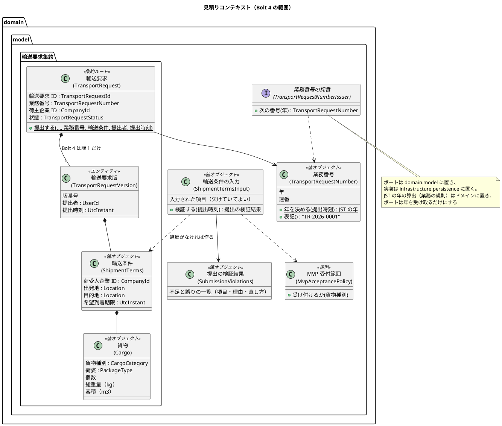
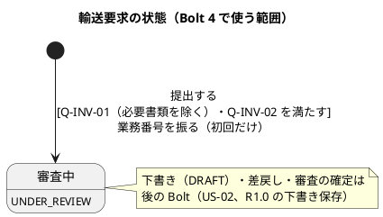
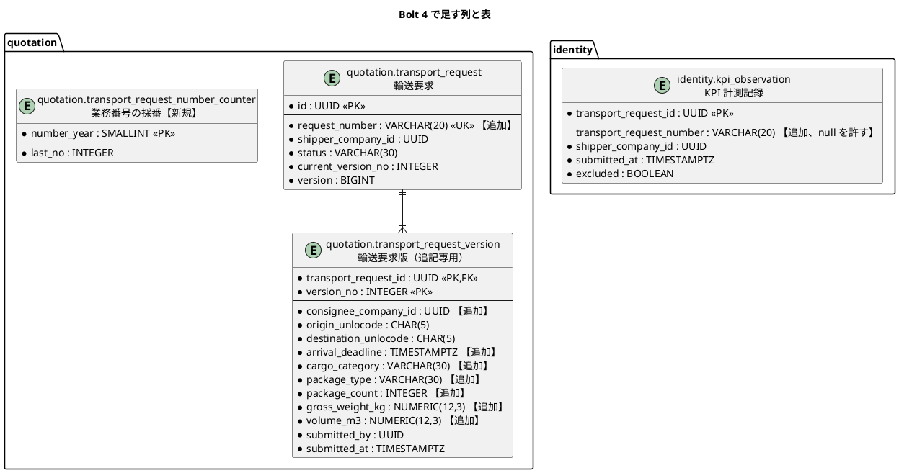
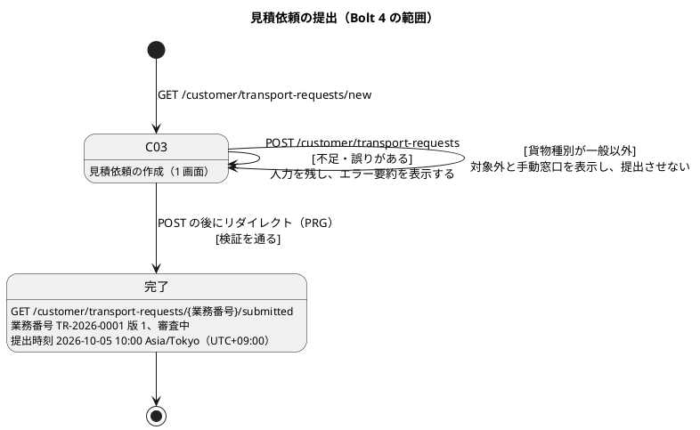

# Bolt 4 計画 - 業務番号と必須条件の検証（US-01 AC1・AC2・AC4）

## 基本情報

| 項目 | 内容 |
| :--- | :--- |
| Bolt | 第 4 回 |
| 予定 | W1（2026-10-05 の週）、2〜4 時間 |
| 対象 | U1 輸送要求・見積り。US-01 輸送条件を提出する（R0.1: AC1・AC2・AC4）。AC2 のうち必要書類は次の Bolt |
| GitHub | [#2 [US-01] 輸送条件を提出する（R0.1: AC1・AC2・AC4）](https://github.com/k2works/practical-domain-driven-design-in-enterpris-application/issues/2)。必要書類が残るため、この Bolt では閉じない |
| 承認ゲート | 標準（ステップごと）。業務のルールに関わる【要確認】は事後に回さず、計画の承認の場でまとめて確認する（Bolt 2 レビュー、Try T-6） |
| 前の Bolt | [Bolt 3 終了報告](bolt_03_report.md)、[Bolt 3 開発成果物レビュー](../../review/cargo-tracker/bolt_03_review_20261002.md) |

## Bolt ゴール

荷主が必須条件（荷受人、出発地、目的地、希望到着期限、貨物）を入れた見積依頼を提出すると、業務番号 `TR-年-連番` が振られて画面に示される。条件の不足や誤り、特殊貨物は、理由と直し方を示して受け付けない。荷主の画面と社内の KPI 計測記録の一覧から、内部の ID（UUID）を消す。

### 確かめたい仮説

| # | 仮説 | この Bolt で分かること |
| :--- | :--- | :--- |
| H1 | 年ごとのカウンター表を、H2 と PostgreSQL の共通の SQL（年の行を別のトランザクションで `last_no = 0` として用意し、提出のトランザクションでは `UPDATE` の行ロックだけで増やす）で更新すれば、同時に提出しても業務番号が重複も欠番もせずに振られる | D-10 の採番方式が、方言を分けずに（ADR-007）成り立つか |
| H2 | 提出の検証の結果（不足と誤りの一覧）をドメインの戻り値で表せば、画面のエラー要約と業務ルール層の受入シナリオが同じ規則を共有できる | Q-INV-01・Q-INV-02 をドメインに閉じ込められるか |
| H3 | 受入条件の番号（`@US-01-AC1` など）を付けた業務ルール層のシナリオを外側のループにし、画面の層は主成功と画面に固有の条件だけにする構成で、業務のストーリーが回る | ADR-009 とテスト戦略の階層の分担が、業務のストーリーで成り立つか |

## ふりかえりと前の Bolt からの引き継ぎ

| 入力 | 内容 | この Bolt での扱い |
| :--- | :--- | :--- |
| 人の決定（2026-10-02、Bolt 4 の開始準備） | 範囲は US-01 AC1・AC2・AC4。D-10: 業務番号は初回の提出時に 1 回だけ振り、年は提出時刻の JST の年とする。年ごとのカウンター表を行ロックで更新し、欠番を出さない。連番は 4 桁のゼロ埋めで、9999 を超えたら桁を増やす。必要書類はこの Bolt の必須条件から除き、次の Bolt で入れる。下書きは DB に保存せず、提出に失敗したら入力を残して同じ画面を表示する | ステップ 1 で設計文書に反映し、ステップ 2〜5 で実装する |
| Bolt 3 レビュー R-03 | 完了画面と画面の層のシナリオが UUID を表示・検証している | ステップ 5 で業務番号に置き換える。社内の KPI 計測記録の一覧も業務番号にする（ステップ 4・5） |
| Bolt 3 レビュー R-04 | D-4 の細部（いつ振るか、年の区切り、欠番、桁あふれ、版 1 の表記、複製） | D-10 で決まった。版の表記は「TR-2026-0001 版 1」。複製（AC5）は R1.0 |
| Bolt 3 レビュー R-22 | US-01 AC2 の Given が「不足」と「誤り」を混ぜている | ステップ 2 で、不足と誤りを別のシナリオに分ける |
| Bolt 3 レビュー R-31 の一部 | 320 CSS px の検証が作成画面だけ。Playwright の時計。本予約で業務番号を引き継ぐか | 320 CSS px は完了画面にも広げる（ステップ 5）。画面の層では時計を固定せず、番号の値はシナリオで決め打ちしない（下の「AI の仮定」）。本予約での引き継ぎは W4 の US-04 の Bolt |
| Bolt 2 レビュー R-17 | 受入条件の数との照合（テスト戦略）が未実装 | 入れない。時間の配分（目安 4 時間以内）に収めるため、必要書類を入れて AC2 を完了させる次の Bolt に回す |
| Try T-8 | 品質ゲートを足したら不合格の入力で失敗することを確かめる | ステップ 4（採番の一意制約、アプリケーション利用者の権限） |
| Try T-11 | 検証のコマンドを `&&` でつなぐとき、件数を数えるだけの `grep -c` を途中に置かない | 全ステップ |
| Try T-12 | 権限や設定の保護を足したら、最小の権限でアプリを起動するテストを同時に足す | ステップ 4（カウンター表の更新を、アプリケーション利用者で確かめる） |
| Try T-13 | 終了報告の時刻は、計画の承認と報告のコミットの時刻を根拠にする | ステップ 6 |

## スコープ

### 設計の約束（Try T-1）

| 設計の約束 | 出典 | この Bolt |
| :--- | :--- | :--- |
| 業務番号 `TR-年-年ごとの連番`。画面と通知には業務番号だけを出し、UUID を出さない。一意制約を付ける | D-4、データモデル、ドメインモデル（TransportRequestNumber） | 入れる |
| 提出には荷受人・出発地・目的地・希望到着期限・貨物・必要書類がそろうこと。出発地と目的地は異なること | Q-INV-01、D-6 | 入れる（必要書類を除く） |
| 一般以外の貨物は提出できず、手動窓口を案内する | Q-INV-02、BR-03、ドメインの規則 MvpAcceptancePolicy | 入れる（MvpAcceptancePolicy を作る） |
| 時刻は UTC で保存し、画面では利用者のタイムゾーンと UTC offset を示す。日時は「年月日 時刻 タイムゾーン（UTC offset）」で表示し、略称（JST など）は表の中だけに使う | BR-10、UI 設計の共通部品「日時表示」 | 入れる（利用者のタイムゾーンは Asia/Tokyo に固定。利用者ごとの設定は US-18 以降） |
| エラー要約は画面上部に出し、要約へフォーカスを移し、各項目へのリンクを持つ。項目の下に理由と直し方を示し、入力値を保持する | UI 設計 C-03、共通部品「フォーム項目」 | 入れる |
| 特殊貨物を選ぶと提出ボタンを `aria-disabled` にして理由を関連付ける | UI 設計 C-03 | 入れる |
| 段階入力（4 段階）、下書き保存、複製、取り下げ、港名の候補検索 | UI 設計 C-03 | 入れない（段階入力は #36 のプロトタイプの後。下書き保存と複製は R1.0） |
| 同じ受入条件を業務ルール層と画面の層の両方で書かない。画面の層は主成功 1 本と画面に固有の条件に限る | テスト戦略「シナリオの階層」 | 入れる |
| シナリオにストーリー・受入条件・不変条件・業務ルールのタグを付ける | テスト戦略のタグ規約 | 入れる（`@US-01 @must`、`@US-01-ACm`、`@Q-INV-01`、`@Q-INV-02`、`@BR-03`） |
| イベントは他のコンテキストのドメインの型を持たず、Java の標準と共有カーネルの型だけで表す。業務キーは輸送要求 ID と版番号 | バックエンドアーキテクチャ、ADR-003 | 入れる（DE-01 に、表示用の項目として業務番号の文字列を足す。業務キーは変えない） |
| SQL は H2 と PostgreSQL の共通部分で書く | ADR-007、データモデル | 入れる（採番の SQL も共通部分で書く） |
| 受入条件ごとに `@US-nn-ACm` のシナリオがあることを CI で照合する | テスト戦略、ADR-009 | 入れない（次の Bolt） |

### 入れるもの・入れないもの

| 入れる | 入れない（後の Bolt） |
| :--- | :--- |
| 業務番号の値オブジェクトと採番（カウンター表） | 必要書類とファイルの保存（次の Bolt。AC2 はそこで完了） |
| 輸送条件の拡張（荷受人、希望到着期限、貨物種別、荷姿、個数、総重量、容積） | 下書きの DB 保存（`transport_request_draft`）、複製（AC5）、別企業の拒否（AC3）。いずれも R1.0（#25） |
| 提出の検証（不足と誤りの一覧）と MvpAcceptancePolicy | US-02 の審査（次の Bolt 以降） |
| C-03 の 1 画面の入力とエラー要約、完了画面の業務番号、KPI 計測記録の一覧の業務番号 | UI の骨格（Bootstrap・htmx・共通レイアウト）と段階入力（#36） |
| 受入シナリオ（業務ルール層と `@ui`） | 受入条件の数との照合（次の Bolt）、荷受人の企業マスター（US-16 の Bolt。それまでは仮の一覧） |

## 設計（この Bolt の範囲）

### ドメインモデル

> 注（設計への反映が必要）: 次の型と規則が、ドメインモデルの用語集と集約の図にない。ステップ 1 で足す（設計に合わせる）。足さないと用語集の整合テストが失敗する。
>
> - 用語集: 貨物 `Cargo`（図にはあるが表にない）、荷姿 `PackageType`、輸送条件の入力 `ShipmentTermsInput`、提出の検証結果 `SubmissionViolations`、業務番号の採番 `TransportRequestNumberIssuer`
> - 業務番号の採番の規則（D-10）と DE-01 の表示用の業務番号（業務キーではない）
> - この Bolt での受入条件の読み方: AC2・Q-INV-01 の「下書きのまま保持」は、下書きを保存せず、入力を残して同じ画面を表示することで満たす（人の決定）。下書きの集約の操作（`下書きを更新する()`）と `transport_request_draft` は、R1.0 の下書き保存で作る。Q-INV-01 の必要書類は次の Bolt で入れる

### 状態遷移

この Bolt で使う遷移は「提出 → 審査中」だけである。下書きは保存しない（人の決定）ため、提出に失敗しても状態を持つものは作らない。

### データモデル

- 既存の行（Bolt 1〜3 の開発データ）は、ローカルの H2 と Testcontainers だけにある。ステージング・本番はまだないため、追加の列は `NOT NULL` で足し、既存の行がない前提でマイグレーションを書く（確認ポイント 4）。
- `cargo_category` と `package_type` は `VARCHAR(30)` に英語の定数名を入れ、`CHECK` 制約で値を限る（データモデルの命名規約）。
- カウンター表は追記専用ではない。既存のコールバックの規則どおり、アプリケーション利用者に SELECT・INSERT・UPDATE・DELETE を与える。
- 採番は、H2 と PostgreSQL の共通の SQL で書く（ADR-007）。その年の行がなければ別のトランザクションで `INSERT`（`last_no = 0`。同時の挿入による一意制約の違反は無視する）し、提出のトランザクションで `UPDATE … SET last_no = last_no + 1 WHERE number_year = ?` で行ロックして増やし、`SELECT` で読む（PostgreSQL では、制約の違反でトランザクションが使えなくなるため、提出のトランザクションの中では `INSERT` しない）。採番は提出と同じトランザクションで行うため、提出が失敗すれば番号も戻り、欠番が出ない。
- identity は、DE-01 の表示用の業務番号を KPI 計測記録に写して持つ（共有カーネルや quotation の型を参照しない）。

### 画面遷移

## 入力

| 成果物 | パス |
| :--- | :--- |
| ユーザーストーリー（US-01 の受入条件と決定 D-4・D-6） | `docs/requirements/cargo-tracker/user_story.md` |
| ドメインモデル（用語集、輸送要求の集約、Q-INV-01・02・03、MvpAcceptancePolicy） | `docs/design/cargo-tracker/domain_model.md` |
| データモデル（輸送要求・輸送要求版、業務番号の注、命名規約、権限） | `docs/design/cargo-tracker/data_model.md` |
| UI 設計（C-03 の画面イメージと振る舞い、完了画面、共通部品） | `docs/design/cargo-tracker/ui_design.md` |
| バックエンドアーキテクチャ（4 パッケージの責務、イベントの持てる型） | `docs/design/cargo-tracker/architecture_backend.md` |
| テスト戦略（シナリオの階層、タグ規約、アクセシビリティ） | `docs/design/cargo-tracker/test_strategy.md` |
| ADR-003（イベントの業務キー）、ADR-007（SQL の共通部分）、ADR-009（BDD と TDD の二重ループ） | `docs/adr/cargo-tracker/` |
| 開発ガイドライン 第 2 章（輸送要求のモデル）、第 3 章（4 パッケージの構成） | `docs/article/02-cargo-domain-model.md`、`docs/article/03-spring-modular-monolith.md` |

## ステップ計画

状態の記号: `[ ]` 未着手、`[-]` 進行中、`[?]` 承認待ち、`[R]` 修正中、`[x]` 完了、`[S]` スキップ。**【要確認】** の付いた操作は、Try T-6 に従い、計画の承認の場でまとめて確認する。

層を下りる順序: 開発戦略の序盤は「画面 → アプリケーション → ドメイン → データ」である。この Bolt では ADR-009 に従い、業務ルール層の受入シナリオを外側のループにして、アプリケーションとドメインを先に駆動する。画面の層のシナリオは、主成功と画面に固有の条件だけを最後に書く（テスト戦略の階層の分担）。データ層は、業務ルール層ではメモリ上の実装で代え、統合テストで PostgreSQL を確かめる。

- [x] **1. 決定を設計文書に反映する**
  - D-10 と今回の決定を、次の文書に書く。
    - ドメインモデル: 上の「注」の型（用語集の表）、採番の規則、MvpAcceptancePolicy の使い方、DE-01 の表示用の業務番号、この Bolt での受入条件の読み方
    - データモデル: 業務番号の列、カウンター表、KPI 計測記録の業務番号の列、採番の SQL。業務番号の「注」を外す
    - ユーザーストーリー: US-01 の決定の行に D-10 を書く。AC2 の必要書類と下書き保存を後の Bolt で入れることを書く
    - UI 設計: C-03 の行を Bolt 4 の範囲（1 画面。段階入力は #36）に直す。完了画面の行を、URL のキーを業務番号にして「業務番号と状態を示す」に直す（確認ポイント 5）
  - 完了の判定: 文書の差分があり、`okf:check` が ERROR 0。
- [x] **2. 受入シナリオを書く（外側のループの Red）**
  - `features/quotation/submit_transport_request.feature`（`@US-01 @must`）に、業務ルール層のシナリオを書く。
    - `@US-01-AC1`: 必須条件がそろうと審査中になり、提出者・提出時刻・業務番号 `TR-2026-0001` が記録される。同じ年の 2 件目は `TR-2026-0002`、JST で年が変わった提出（`2026-12-31T15:00:00Z`）は `TR-2027-0001`
    - `@US-01-AC2 @Q-INV-01`: 必須条件の不足。項目ごとに理由と直し方が示され、提出されない。不足と誤りは別のシナリオにする（R-22）
    - `@US-01-AC2 @Q-INV-01`: 誤り。出発地と目的地が同じ（D-6）、希望到着期限が提出時刻以前（確認ポイント 1）、個数・総重量・容積が 0 以下（シナリオのアウトライン）
    - `@US-01-AC4 @Q-INV-02 @BR-03`: 危険物・冷凍・その他特殊は提出されず、手動窓口が案内される（シナリオのアウトライン）
  - 既存の `walking_skeleton.feature` を、新しい必須条件と業務番号で書き直す。
  - 完了の判定: 新しいシナリオが期待した理由で失敗する（未定義のステップでなく、アサーションで）。
  - 結果（2026-10-02）: ステップ定義がまだない入力ポート（`SubmissionOutcome`、`ShipmentTermsInput`、`SubmissionViolations` など）を呼ぶため、Red はコンパイルエラーになった。開発戦略の序盤のワークフロー（「まだない入力ポートを呼んで Red」）に合わせ、完了の判定をこれに読み替えた。アサーションでの失敗は、ステップ 3 で型を作った時点で確かめる。ビルドが通らないため、push はステップ 3 の Green の後にする
- [x] **3. アプリケーションとドメインを作る（内側のループ）**
  - 単体テストを先に書き、次を作る。
    - ドメイン（`domain.model`）
      - `TransportRequestNumber`（形式、JST の年、4 桁のゼロ埋め、1 万件目で 5 桁）
      - `Cargo`・`CargoCategory`・`PackageType`、`ShipmentTerms` の拡張
      - `ShipmentTermsInput` の検証、`SubmissionViolations`、`MvpAcceptancePolicy`
      - 採番のポート `TransportRequestNumberIssuer`
      - `TransportRequest.submit` に業務番号を渡す。DE-01 に業務番号の文字列を足す
    - アプリケーション
      - 提出のコマンド（`SubmitTransportRequestCommand`）を入力項目に広げる
      - コマンドサービスで検証し、違反があれば保存せずに検証結果を返す。違反がなければ採番して提出する
      - `infrastructure.config` で組み立てる
    - identity: KPI 計測のイベントハンドラーが業務番号を受け取る
  - 業務ルール層では、採番をメモリ上の実装に差し替え、年の区切りを固定の時計で確かめる。
  - 完了の判定: 単体テストと、ステップ 2 の業務ルール層のシナリオが緑。ArchUnit（イベントの持てる型、層の依存）が緑。
  - 結果（2026-10-02）: 業務ルール層のシナリオ 26 本、単体テスト、ArchUnit、用語集の整合テスト、Spotless・Checkstyle・SpotBugs が緑。`test` の 141 件のうち、アプリケーション全体を起動する 22 件（統合テスト、H2 のスモーク、イベントの直列化の契約）は、採番のポートの実装（ステップ 4）がまだないためコンテキストを読み込めず失敗する。CI を赤にしないよう、push はステップ 4 の後にする
  - 計画からの変更: DE-01 の業務番号は、イベントの進化の規則（null を許す部品の追加だけ）に従い null を許す部品にした。Bolt 3 までの形の JSON も、業務番号を null として復元できることを契約テストに残した。そのため、KPI 計測記録の業務番号の列は `NOT NULL` でなく null を許す列にする（確認ポイント 4 の変更。ステップ 4 で人が確認する）
  - 型を合わせるためだけに、永続化の Java（行の部品と組み立て）と画面のコントローラーを手直しした。SQL・マイグレーションはステップ 4、画面はステップ 5 で作る
- [?] **4. 永続化と採番を作る（Red → Green）** 【要確認: スキーマの変更】
  - 統合テスト（Testcontainers の PostgreSQL 18.6）を先に書く。
    - 業務番号と追加の列が保存・復元される。KPI 計測記録に業務番号が保存される
    - 2 つのスレッドで同時に採番しても、番号が重複せず連続する（H1）。年の最初の提出で行が作られる
    - 業務番号の一意制約が、同じ番号の 2 件目を拒否する（T-8）
    - アプリケーション利用者でカウンター表を更新できる（T-12）
  - マイグレーション（`common`）で列と表を足す。採番の SQL は H2 と PostgreSQL の共通部分で書く。
  - H2 のスモークテストで、ローカルの起動と採番を確かめる。
  - 完了の判定: 統合テストと H2 のスモークテストが緑。
  - 結果（2026-10-02）: `./gradlew check` が緑（`test` 150 件すべて成功）。PostgreSQL で、年の最初の採番と続きの番号、ロールバックしても欠番が出ないこと、年の最初の採番を 8 スレッドで同時に行っても 1〜8 が重複なく振られること、年の行がある状態での同時の採番を確かめた（H1 は成り立った）。同時実行のテストは 3 回続けて通った。業務番号の一意制約が同じ番号の 2 件目を拒否すること（T-8）、アプリケーション利用者で採番の表を作って更新できること（T-12）も確かめた
  - 計画からの変更: 採番の表の年の列は、H2 で `year` が予約語のため `number_year` にした。完了画面（ステップ 5）で使うため、リポジトリに業務番号で探す操作（`findByNumber`）を足した
  - `uiTest` の画面の層のシナリオは、画面を作るステップ 5 まで動かさない（いまのコントローラーは仮の形で、提出は不足で受け付けられない）。CI の `ui` のジョブが赤になるため、push はステップ 5 の後にする
- [ ] **5. 画面を作る（外側のループの Green）**
  - 画面の層の受入シナリオ（`features/ui/`）を先に書く。主成功 1 本と画面に固有の条件だけにする（テスト戦略）。
    - 主成功（`@ui @US-01 @must`）: キー操作だけで提出すると、完了画面に業務番号（`TR-年-連番` の形式）と「版 1」と審査中が出て、UUID が出ない（R-03）。社内の KPI 計測記録の一覧に同じ業務番号が出る。既存のウォーキングスケルトンの `@ui` をこれに置き換える
    - エラー要約（`@ui @US-01`）: 誤りのある入力で提出すると、エラー要約にフォーカスが移り、項目へのリンクから直して出し直せる
    - 特殊貨物（`@ui @US-01`）: 特殊貨物を選ぶと、対象外と手動窓口が示され、提出ボタンが `aria-disabled` になり理由が関連付けられる
    - どのシナリオも axe-core の違反 0 件。幅 320 CSS px で横スクロールが出ないことを、完了画面でも確かめる（R-31）
  - C-03 の 1 画面に、荷受人（仮の一覧から選ぶ。確認ポイント 2）、希望到着期限（Asia/Tokyo で入力し UTC で保存）、貨物種別、荷姿、個数、総重量、容積を足し、エラー要約を作る。
  - 完了画面の URL のキーと表示を業務番号にし、提出時刻を共通部品の日時表示にする。KPI 計測記録の一覧に業務番号を出す。
  - 完了の判定: `./gradlew check` と `uiTest` が緑。
- [ ] **6. 検証と Bolt 終了報告**
  - `./gradlew check`・`uiTest` と CI（2 つのジョブ）が緑、SonarQube の品質ゲートが PASS（コマンドの成否で判定）であることを確かめる。
  - 手順書の「UUID を表示する負債」の記述を直す。
  - `bolt_04_report.md` を書く（時刻は計画の承認と報告のコミットを根拠にする。T-13）。

### 時間の配分と打ち切り

| ステップ | 目安 |
| :--- | :--- |
| 1 | 20 分 |
| 2 | 25 分 |
| 3 | 60 分 |
| 4 | 50 分 |
| 5 | 55 分 |
| 6 | 20 分 |
| 合計 | 230 分 |

4 時間を超えそうなときは、ステップ 5 の画面に固有の 2 本（エラー要約、特殊貨物）の `@ui` を次の Bolt に回す（画面の実装は残す）。業務番号・検証・主成功（ステップ 2〜4 とステップ 5 の主成功）は削らない。

## 確認ポイント（計画の承認の場でまとめて確認する。Try T-6。2026-10-02 にすべて承認）

| # | 確認すること | ステップ | 理由 |
| :--- | :--- | :--- | :--- |
| 1 | 希望到着期限の境界: 提出時刻以前（同時刻を含む）は誤りとし、提出時刻より後なら近い期限でも受け付ける。期限が経路設計に間に合うかは、経路設計の制約適合（BR-11）で判定する | 2、3 | 業務のルール。Bolt 3 の報告で人が決めるとした事項 |
| 2 | 荷受人は、企業マスターができるまで、設定ファイルの仮の一覧（企業 ID と名前、2〜3 社）から選ぶ。仮の主体（`ProvisionalActorProperties`）と同じく、US-16 の Bolt で置き換える | 5 | 仮の実装を画面に入れる |
| 3 | 荷姿の値: パレット・カートン・クレート・その他の 4 つ。個数は 1 以上の整数、総重量と容積は 0 より大きい小数（小数点以下 3 桁まで） | 2、3 | 業務の値。要件に定義がない |
| 4 | スキーマの変更: `quotation.transport_request` に `request_number`（一意）、`quotation.transport_request_version` に 7 列、`identity.kpi_observation` に `transport_request_number` を `NOT NULL` で足し、`quotation.transport_request_number_counter` を作る。既存の行はないものとする | 4 | データベース（確認必須） |
| 5 | 完了画面の URL のキーを業務番号にする（`/customer/transport-requests/TR-2026-0001/submitted`）。アドレスバーにも UUID を出さない。他社の番号を開いたときの拒否は、認証を入れる US-18・AC3 の Bolt で確かめる | 1、5 | UI 設計の変更、開示の範囲 |

push はステップの完了ごとに行う（CI の結果を確かめるため）。

## AI の仮定

- 画面の層は実際の時計で動く。業務番号の値（年と連番）はシナリオで決め打ちせず、形式と「完了画面と KPI 計測記録の一覧で同じ番号であること」を確かめる。年の区切りと連番の値は、業務ルール層（固定の時計）と統合テストで確かめる。
- 画面の希望到着期限は `datetime-local` で Asia/Tokyo の時刻として入力させ、UTC に直して保存する。
- 版の表記は「TR-2026-0001 版 1」とする（D-4 の「TR-2026-0142 版 2」に合わせる）。
- 提出の検証で、不足と誤りが同時にあるときはすべてを一覧で返す（1 件ずつ直させない）。
- 業務番号の列の長さは `VARCHAR(20)` とする（`TR-` と年 4 桁と連番、桁あふれの余裕を含む）。

## リスクと対策

| リスク | 影響 | 対策 |
| :--- | :--- | :--- |
| 共通の SQL での採番で、同時の `INSERT` の競合を取りこぼす | 年の最初の提出が同時に来ると失敗する | 年の行は別のトランザクションで用意し、一意制約の違反を無視する。PostgreSQL の統合テストで、年の最初の採番を同時に行う |
| 同時実行のテストが不安定になる | CI が時々落ちる | スレッドの開始をラッチでそろえ、待ちに時間の上限を置く |
| 画面の入力項目が増え、`@ui` のシナリオが壊れやすくなる | 保守の手間 | ラベルで要素を取る（Bolt 3 の R-13 の規則）。入力はステップの定義の 1 か所にまとめる |
| 必要書類を除いたまま AC2 のタグを付ける | AC2 が完了したように見える | 終了報告と #2 に、AC2 の必要書類が残ることを書く。受入条件の数との照合を入れるとき（次の Bolt）に扱いを決める |

## 完了条件

### Definition of Done

- [ ] ステップ 1〜6 が完了し、各ステップの承認ゲートを人が通した
- [ ] `./gradlew check` と `./gradlew uiTest` がローカルと CI の両方で緑
- [ ] SonarQube の品質ゲートが PASS（コマンドの成否で判定）
- [ ] 業務ルール層で `@US-01-AC1`・`@US-01-AC2`（必要書類を除く）・`@US-01-AC4` のシナリオが緑。画面の層で主成功と画面に固有の 2 本が緑
- [ ] 荷主の画面、画面の層のシナリオ、KPI 計測記録の一覧に UUID が出ない（R-03）
- [ ] D-10 と確認ポイント 1〜5 の決定が、設計文書から追える
- [ ] `bolt_04_report.md` に仮説 H1〜H3 の結論を記録した
- [ ] 支援技術による手動確認（テスト戦略）は、人がデモ 2 のエラー要約で行う（VoiceOver で、要約が読み上げられ、項目へのリンクで移動できること）
- [ ] ユーザーマニュアルは更新しない。マニュアルはまだなく、画面は UI の骨格（#36）の前の仮の画面である。マニュアルの作成は UI の骨格の後に計画する

### デモ項目

| # | デモ | 確かめること |
| :--- | :--- | :--- |
| 1 | `bootRun` で見積依頼を提出する | 完了画面に `TR-2026-0001 版 1` と提出時刻（Asia/Tokyo と UTC offset）が出て、アドレスバーにも UUID が出ない。2 件目は `TR-2026-0002`。KPI 計測記録の一覧に同じ番号が出る |
| 2 | 出発地と目的地を同じにし、希望到着期限を空にして提出する | エラー要約に 2 件が出て、入力が残り、直して提出できる |
| 3 | 貨物種別を冷凍にする | 対象外と手動窓口が示され、提出できない |
| 4 | `./gradlew uiTest` | 画面の層の 3 本が通り、axe-core の違反が 0 件 |

## 更新履歴

| 日付 | 内容 | 作成 | 承認 |
| :--- | :--- | :--- | :--- |
| 2026-10-02 | 初版（人の決定: 範囲、D-10、必要書類を除く、下書きを保存しない）。詳細と横断の整合性検証の指摘（高 3・中 12・低 8）を反映した | anthropic/claude-opus-5-5 | — |
| 2026-10-02 | 計画を承認。確認ポイント 1〜5（希望到着期限の境界、仮の荷受人の一覧、荷姿と数量の値、スキーマの変更、完了画面の URL のキー）も承認された（Try T-6） | anthropic/claude-opus-5-5 | human:kakimomokuri |
| 2026-10-02 | ステップ 1 で採番の手順を直した。PostgreSQL では制約の違反でトランザクションが使えなくなるため、年の行を別のトランザクションで用意する形にした（データモデル「業務番号の採番」） | anthropic/claude-opus-5-5 | — |

## 関連ドキュメント

- [リリース計画](release_plan.md)（W1）
- [開発戦略](development_strategy.md)（序盤・アウトサイドイン）
- [Bolt 3 終了報告](bolt_03_report.md)、[Bolt 3 開発成果物レビュー](../../review/cargo-tracker/bolt_03_review_20261002.md)
- [ユーザーストーリー](../../requirements/cargo-tracker/user_story.md)、[ドメインモデル](../../design/cargo-tracker/domain_model.md)、[データモデル](../../design/cargo-tracker/data_model.md)、[UI 設計](../../design/cargo-tracker/ui_design.md)、[バックエンドアーキテクチャ](../../design/cargo-tracker/architecture_backend.md)、[テスト戦略](../../design/cargo-tracker/test_strategy.md)
