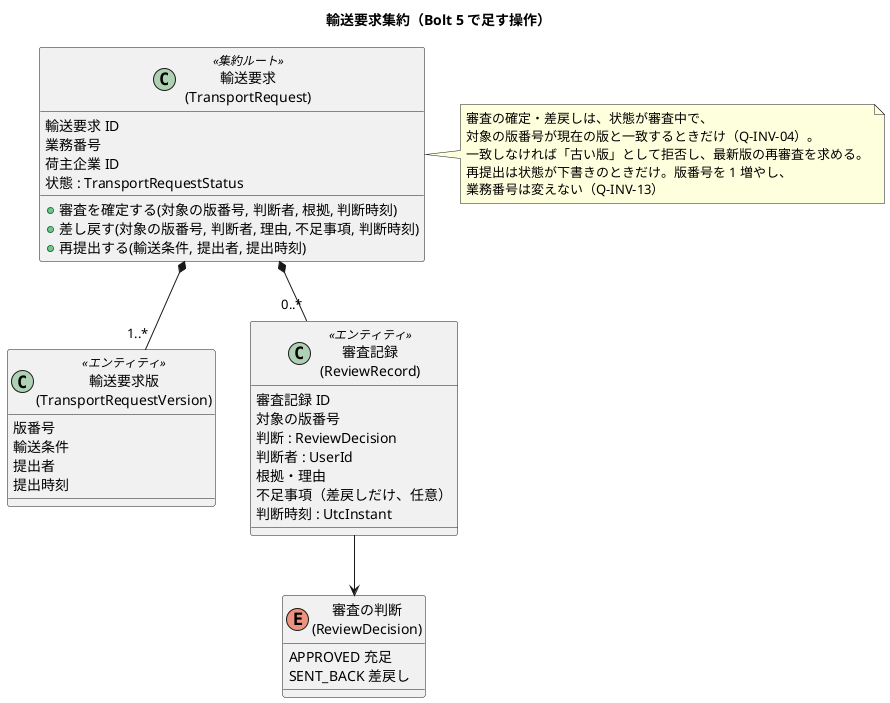
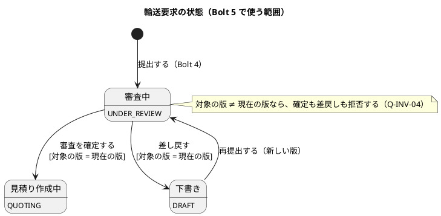
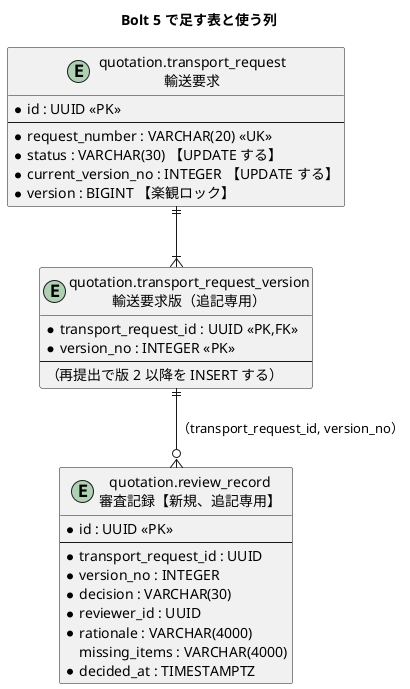
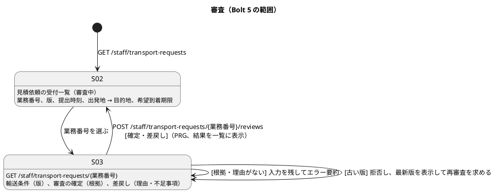

# Bolt 5 計画 - 輸送条件の審査と差戻し（US-02）

## 基本情報

| 項目 | 内容 |
| :--- | :--- |
| Bolt | 第 5 回 |
| 予定 | W1（2026-10-05 の週）、2〜4 時間 |
| 対象 | U1 輸送要求・見積り。US-02 輸送条件を審査する（AC1・AC2・AC3） |
| GitHub | [#3 [US-02] 輸送条件を審査する](https://github.com/k2works/practical-domain-driven-design-in-enterpris-application/issues/3) |
| 承認ゲート | 標準（ステップごと）。業務のルールに関わる【要確認】は、計画の承認の場でまとめて確認する（Try T-6） |
| アプローチ | 新しい表（審査記録）と集約の新しい操作を作るため、開発戦略の規則に従い、集約と永続化はインサイドアウト（ステップ 2a）で作る。そのうえで、業務ルール層の受入シナリオ（2b）と画面の層（3）を外側から駆動する。層の順: ドメイン → データ → アプリケーション（業務ルール層） → 画面 |
| #3 の扱い | US-02 の AC1〜AC3 は書類に依存しない（差戻しの理由に書類の不足を書ける）ため、この Bolt で #3 を閉じる。S-03 の書類の確認の欄は、必要書類の Bolt で足す |
| 前の Bolt | [Bolt 4 終了報告](bolt_04_report.md)、[Bolt 4 開発成果物レビュー](../../review/cargo-tracker/bolt_04_review_20261002.md) |

## Bolt ゴール

営業担当者が、受付一覧（S-02）から審査中の見積依頼を選び、審査（S-03）で条件充足を確定するか、理由を付けて差し戻せる。判断者・時刻・根拠（差戻しなら理由と不足事項）が審査記録に残り、確定すれば見積り作成中、差し戻せば下書きになる。審査を始めた後に新しい版が出された場合、古い版の審査の確定は拒否され、最新版の再審査が求められる。

### 確かめたい仮説

| # | 仮説 | この Bolt で分かること |
| :--- | :--- | :--- |
| H1 | 審査の対象の版番号をコマンドに持たせ、集約の現在の版番号と照合すれば（Q-INV-04 の照合）、古い版の審査の確定を集約の規則だけで拒否できる | ARCH-HO-01 の期待版（集約の `version`）の照合とは別に、業務の版の照合を規則として持てるか |
| H2 | 状態を変える集約の保存を、楽観ロック（`version` の列）付きの UPDATE と審査記録の INSERT で、H2 と PostgreSQL に共通の SQL で書ける | 提出（INSERT だけ）から、状態を変える操作へ永続化を広げられるか |
| H3 | ステップの区切りを「終わりに `check` が緑になる単位」にすれば、どのステップの終わりにも push できる（Try T-14） | Bolt 4 で 2 ステップの間 push できなかった問題が解けるか |

## ふりかえりと前の Bolt からの引き継ぎ

| 入力 | 内容 | この Bolt での扱い |
| :--- | :--- | :--- |
| 人の決定（2026-10-02、Bolt 5 の開始準備） | 範囲は US-02（営業の画面と審査の規則）。荷主が差戻し理由を見て直し、版 2 を出し直す画面（C-04、C-03 の編集）は次の Bolt。審査の判断者は、認証（US-18）ができるまで設定の仮の営業担当者で記録する。差戻しの理由は必須、不足事項は任意で、どちらも自由記述。確定の根拠も必須の自由記述 | ステップ 1 で設計文書に反映し、ステップ 2・3 で実装する |
| Try T-14 | ステップの区切りは、終わりに `check` が緑になる単位にする | 業務の規則と永続化を 1 つのステップ（ステップ 2）にまとめ、各ステップの終わりに push する |
| Try T-15 | マイグレーションを書いたら、統合テストより先に H2 のスモークを回す。ASCII 以外の設定値は文字コードを確かめる | ステップ 2（審査記録の表）、ステップ 3（仮の営業担当者の設定） |
| Try T-16 | ステップの開始と完了を時刻で残し、承認の待ち時間と AI の実行時間を分けて測る | 各ステップの結果に、開始と完了の時刻を書く |
| Try T-17 | コマンドの `cd` には絶対パスを使う | 全ステップ |
| Bolt 4 レビュー R-02 | 業務番号は推測しやすいため、荷主の画面では荷主企業で絞る | 社内の画面（S-02・S-03）は、営業担当者がすべての荷主の見積依頼を扱うため絞らない。荷主の画面の規則は変えない |
| Bolt 4 レビュー D-14〜D-20 | 業務責任者に確かめる事項 | この Bolt の範囲には入らない（必要書類・特殊貨物の案内・期限の入力は US-01 の Bolt） |
| Bolt 4 レビュー R-25〜R-27 | 後の Bolt に回した指摘 | R-27（同時実行で競合が実際に起きたことの確認）は、ステップ 2a の楽観ロックのテストで、片方が競合で失敗したことを確かめる形で入れる。R-25（設計の小さな整理）と R-26（スループットの上限）は引き続き後の Bolt |
| Bolt 2 レビュー R-17 | 受入条件の数との照合 | US-01 AC2（必要書類）の Bolt で入れる（Bolt 4 で決めた移し先のまま） |
| Bolt 4 の既知の課題 | 社内の画面の日時の表示（BR-10。UTC の併記） | S-02・S-03 では、利用者のタイムゾーン（Asia/Tokyo）の日時に UTC を括弧で併記する（UI 設計の共通部品「日時表示」） |

## スコープ

### 設計の約束（Try T-1）

| 設計の約束 | 出典 | この Bolt |
| :--- | :--- | :--- |
| 審査の確定は最新版に対してだけ行える。古い版の審査確定は拒否する | Q-INV-04、US-02 AC3 | 入れる（期待版として版番号を照合する） |
| 審査を確定すると見積り作成中、差し戻すと下書きになる | ドメインモデルの状態遷移 | 入れる（要件定義の状態モデルは「審査中 → 見積提示済み」で「見積り作成中」がない。確認ポイント 6） |
| 審査を確定すると S-04 見積りの作成へ移る | UI 設計の画面遷移 | 変える（S-04 がまだないため、受付一覧へ戻る暫定の遷移にし、UI 設計に書く） |
| 審査記録に判断者・時刻・根拠（差戻しなら理由と不足事項）を残す | US-02 AC1・AC2、データモデル `review_record` | 入れる |
| DE-02 輸送要求を審査した（監査が購読） | ドメインモデルのイベント一覧 | 入れる（発行だけ。監査の購読は US-17）。イベントはドメインの型を持てないため、判断は文字列（`APPROVED`・`SENT_BACK`）で持たせ、契約テストに固定の見本を足す |
| 変更コマンドは `commandId`・対象 ID・`expectedVersion` を持つ | ARCH-HO-01 | 入れない（後の Bolt）。この Bolt の古い版の拒否は、対象の版番号の照合（Q-INV-04）で行う。同時の更新は、リポジトリの楽観ロック（集約の `version`）で 1 人だけを成功させ、画面では「他の利用者が先に更新しました」と示す |
| 集約ルートの表は楽観ロック（`UPDATE ... WHERE id = ? AND version = ?`） | データモデル | 入れる |
| 社内の画面は `/staff/**`、資源は英語の複数形 | UI 設計 | 入れる |
| 社内の画面の日時は、利用者のタイムゾーンを主にし UTC を括弧で併記する | UI 設計「日時表示」、BR-10 | 入れる（S-02・S-03） |
| 荷主が差戻し理由を見て直し、版 2 を出し直す（C-04、C-03 の編集） | UI 設計 | 入れない（次の Bolt。この Bolt では集約の再提出の操作だけを作り、業務ルール層で AC3 を確かめる） |
| 審査の書類の確認（S-03 の「書類」） | UI 設計 S-03 | 入れない（必要書類は US-01 AC2 の Bolt） |

### 入れるもの・入れないもの

| 入れる | 入れない（後の Bolt） |
| :--- | :--- |
| 集約の操作: 審査を確定する、差し戻す、再提出する（版 2 以降） | 荷主の再提出・差戻し理由の画面（C-04、C-03 の編集） |
| 審査記録（エンティティ）、DE-02 | 監査記録への購読（US-17） |
| 永続化: 審査記録の表、輸送要求の状態の更新（楽観ロック）、再提出の版の INSERT | `commandId` の冪等性、期待版の競合表示（ARCH-HO-01 の残り） |
| S-02 受付一覧（審査中の絞り込み）、S-03 審査（確定・差戻し） | S-02 のほかの状態の絞り込み（見積り作成中・荷主の回答待ちなど。見積りの Bolt で足す） |
| 仮の営業担当者（設定） | 営業担当者の認証と権限（US-18） |

## 設計（この Bolt の範囲）

### ドメインモデル

> 注（設計への反映が必要）: 次の型と規則が、ドメインモデルの用語集と集約の図にない。ステップ 1 で足す。
>
> - 用語集: 審査記録 `ReviewRecord`（いまは「審査 Review」だけ。`@Entity` を付けると用語集の整合テストが失敗する）、審査の判断 `ReviewDecision`（充足・差戻し）
> - 審査記録の根拠と理由の扱い（確定は根拠が必須、差戻しは理由が必須で不足事項は任意）
> - 集約の図の操作の引数（`審査を確定する(版, 判断, 根拠)` を、対象の版番号・判断者・根拠・判断時刻に）
> - 集約の操作「再提出する」（下書きから審査中へ、新しい版）。ドメインモデルの操作「下書きを更新する」「提出する」との関係（下書きを保存するまでは、再提出が輸送条件を受け取る）
> - DE-02 の項目（輸送要求 ID、版番号、判断、判断者）に判断時刻を足すか（業務キーは輸送要求 ID・版番号・判断。判断は文字列で持つ。確認ポイント 4）
> - リポジトリの社内用の照会（荷主企業で絞らない業務番号の検索と、審査中の一覧）。荷主の画面の照会は荷主企業で必ず絞る（Bolt 4 レビュー R-02）ため、名前を分ける

### 状態遷移

### データモデル

- `review_record` は、（`transport_request_id`、`version_no`）から `transport_request_version` への外部キーを持つ（データモデルの主な制約）。`decision` は `VARCHAR(30)` に定数名を入れ、`CHECK` で `APPROVED`・`SENT_BACK` に限る（データモデルの主な制約の表に足す。確認ポイント 3）。
- 審査記録は判断の事実で、後から変えない。追記専用の印（`COMMENT ON TABLE ... IS 'append-only'`）を付ける（確認ポイント 3）。
- 状態の更新は `UPDATE quotation.transport_request SET status = ?, current_version_no = ?, version = version + 1 WHERE id = ? AND version = ?` とし、更新が 0 件なら競合として失敗させる。集約は読み込んだときの `version` を持つ。

### 画面遷移

## 入力

| 成果物 | パス |
| :--- | :--- |
| ユーザーストーリー（US-02） | `docs/requirements/cargo-tracker/user_story.md` |
| 要件定義（UC-02、状態モデル） | `docs/requirements/cargo-tracker/requirements_definition.md` |
| ドメインモデル（輸送要求の集約、Q-INV-04、DE-02） | `docs/design/cargo-tracker/domain_model.md` |
| データモデル（`review_record`、楽観ロック、追記専用） | `docs/design/cargo-tracker/data_model.md` |
| UI 設計（S-02・S-03、日時表示、競合表示） | `docs/design/cargo-tracker/ui_design.md` |
| バックエンドアーキテクチャ（ARCH-HO-01） | `docs/design/cargo-tracker/architecture_backend.md` |
| テスト戦略（シナリオの階層、タグ規約） | `docs/design/cargo-tracker/test_strategy.md` |
| ADR-002（版と追記専用）、ADR-003（イベントの業務キー）、ADR-007（SQL の共通部分）、ADR-009（BDD と TDD の二重ループ） | `docs/adr/cargo-tracker/` |
| 開発ガイドライン 第 2 章（輸送要求のモデル）、第 3 章（4 パッケージの構成） | `docs/article/02-cargo-domain-model.md`、`docs/article/03-spring-modular-monolith.md` |

## ステップ計画

状態の記号: `[ ]` 未着手、`[-]` 進行中、`[?]` 承認待ち、`[R]` 修正中、`[x]` 完了、`[S]` スキップ。各ステップの終わりに `check` が緑であることを確かめて push する（T-14）。

- [ ] **1. 決定を設計文書に反映する**
  - ドメインモデル: 上の「注」の型と操作、審査の根拠と理由の扱い、DE-02 の項目、社内用の照会
  - データモデル: `review_record` の `decision` の制約と追記専用、状態の更新の SQL
  - ユーザーストーリー: US-02 の決定（範囲、仮の営業担当者、差戻しの入力）
  - UI 設計: S-02・S-03 の URL の行、S-03 の画面イメージと振る舞い（確定と差戻しの入力、古い版の表示）、確定の後は S-04 ができるまで受付一覧へ戻る暫定の遷移
  - 要件定義: 確認ポイント 6 の決定に従う
  - 完了の判定: 文書の差分があり、`okf:check` が ERROR 0、`documentationTest` が緑。push する。
- [ ] **2a. 集約と永続化を作る（インサイドアウト、単体テストと統合テスト）** 【要確認: スキーマの変更】
  - 単体テストを先に書き、次を作る。
    - 集約を状態を変えられる形にし、楽観ロックの版（集約の `version`）と審査記録を持たせる
    - 集約の操作: 審査を確定する、差し戻す、再提出する（Q-INV-04 の照合、状態の規則、根拠と理由の必須）
    - 審査記録、審査の判断、DE-02（判断は文字列）
  - マイグレーションで `review_record` を作り、追記専用の印を付ける。統合テストより先に H2 のスモークを回す（T-15）。
  - リポジトリを、提出（新規の INSERT）と更新（状態の UPDATE を楽観ロックで行い、審査記録と再提出の版を INSERT）に分ける。社内用の照会（荷主企業で絞らない業務番号の検索、審査中の一覧）を足す。メモリ上の実装も同じ規則にする。
  - 統合テスト（PostgreSQL）を先に書く。
    - 審査記録と状態が保存・復元される。再提出の版 2 が保存される
    - 同じ版を 2 つのトランザクションで同時に更新すると、1 つだけが成功し、もう 1 つが競合で失敗する（R-27: 競合が実際に起きたことを確かめる）
    - アプリケーション利用者は審査記録を更新・削除できない（`AppendOnlyGrantIntegrationTest` の一覧に `review_record` を足す。T-8、T-12）
  - `DomainEventSerializationContractTest` に DE-02 の固定の見本を足す。
  - 完了の判定: `check` が緑（Bolt 4 の提出と画面のテストもそのまま通る）。push する。
- [ ] **2b. 審査のユースケースを作る（業務ルール層の Red → Green）**
  - 業務ルール層の受入シナリオ `features/quotation/review_transport_request.feature`（`@US-02 @must`）を先に書く。
    - `@US-02-AC1`: 審査中の版の条件充足を確定すると、判断者・時刻・根拠が記録され見積り作成中になる
    - `@US-02-AC2`: 差し戻すと、理由と不足事項が記録され下書きになる。理由がなければ差し戻せない
    - `@US-02-AC3 @Q-INV-04`: 版 1 を審査している間に差戻し・再提出で版 2 ができたら、版 1 の確定は拒否され、最新版の再審査が求められる
    - 審査中でない輸送要求は審査できない。根拠のない確定はできない
  - コマンド（確定・差戻し・再提出）、コマンドサービス、社内用の照会サービスを作る。審査の結果は、提出と同じく業務の結果（成功・拒否の理由）を戻り値で返す。
  - 完了の判定: `check` が緑。push する。
- [ ] **3. 営業の画面を作る（画面の層の Red → Green）**
  - 画面の層の受入シナリオ（`features/ui/review_transport_request_ui.feature`、`@ui @US-02`）を先に書く。主成功と画面に固有の条件だけにする（テスト戦略）。
    - 主成功: 荷主が提出した見積依頼が受付一覧に出て、審査を確定すると一覧から消え、結果が一覧に表示される。キー操作だけで行える
    - 画面に固有の条件: 根拠・理由なしで送るとエラー要約に誤りが示され、入力が残る
    - 幅 320 CSS px で横スクロールが出ない。axe-core の違反 0 件
  - S-02（受付一覧。審査中だけ、提出時刻の古い順）と S-03（審査。輸送条件と版、確定と差戻しの 2 つのフォーム、古い版のときは拒否して最新版を示す、同時の更新で負けたときは「他の利用者が先に更新しました」）を作る。社内の日時は UTC を括弧で併記する。
  - 仮の営業担当者の利用者 ID を、既存の仮の主体の設定に足す（`cargotracker.provisional-actor.staff-user-id`）。
  - 入口の一覧（`/`）に S-02 を足す。手順書の「開く URL」を更新し、`/staff/**` にまだ認証がないことを書く。
  - 完了の判定: `check` と `uiTest` が緑。push する。
- [ ] **4. 検証と Bolt 終了報告**
  - `check`・`uiTest`・CI・SonarQube の品質ゲート（PASS）を確かめる。
  - `bolt_05_report.md` を書く（各ステップの開始と完了の時刻を根拠にする。T-13・T-16）。

### 時間の配分と打ち切り

| ステップ | 目安 |
| :--- | :--- |
| 1 | 20 分 |
| 2a | 80 分 |
| 2b | 45 分 |
| 3 | 75 分 |
| 4 | 20 分 |
| 合計 | 240 分 |

Bolt 4 の実績（計画 230 分に対し、承認の待ちを含めて 4 時間 36 分）から、余裕は少ない。4 時間を超えそうなときは、次の順で次の Bolt に回す。

1. ステップ 3 の画面に固有の条件のシナリオ（エラー要約）。画面の実装は残す
2. S-03 の古い版・同時の更新の画面の表示（規則と永続化は 2a・2b で確かめてあるので、画面は一般のエラーの表示にとどめる）
3. ステップ 3 全体（S-02・S-03）。この場合は 2b までで #3 を閉じず、画面の Bolt で閉じる

審査の規則と永続化（ステップ 2a・2b）は削らない。

## 確認ポイント（計画の承認の場でまとめて確認する。Try T-6）

| # | 確認すること | ステップ | 理由 |
| :--- | :--- | :--- | :--- |
| 1 | 社内の画面の URL: S-02 は `GET /staff/transport-requests`、S-03 は `GET /staff/transport-requests/{業務番号}`、確定と差戻しは `POST /staff/transport-requests/{業務番号}/reviews`（判断を値で送る）。社内の画面では荷主企業で絞らない | 1、3 | UI 設計への URL の追加 |
| 2 | 古い版の拒否は、S-03 のフォームに対象の版番号を隠し項目で持たせ、集約の現在の版番号と照合して行う（Q-INV-04 の照合）。同時の更新は楽観ロック（集約の `version`）で 1 人だけを成功させる。ARCH-HO-01 の `commandId` と `expectedVersion`、差分を示す競合表示は後の Bolt | 2a、2b、3 | ARCH-HO-01 を入れずに、業務の規則と楽観ロックで代える |
| 3 | スキーマの変更: `quotation.review_record` を作り、`decision` を `APPROVED`・`SENT_BACK` に限り、追記専用の印を付ける（審査記録は判断の事実で、後から変えない。データモデルの追記専用の一覧と主な制約の表に足す） | 1、2a | データベース（確認必須） |
| 4 | DE-02 の項目に判断時刻を足す（輸送要求 ID、版番号、判断（文字列）、判断者、判断時刻）。監査（US-17）が購読するまでは発行だけにする | 1、2a | イベントの契約（保存される形） |
| 5 | 仮の営業担当者の利用者 ID を、既存の仮の主体の設定（`cargotracker.provisional-actor.staff-user-id`）に置く。US-18 で認証の主体に置き換える。`/staff/**` には認証がまだないことを手順書と既知の課題に書く | 3 | 仮の実装を画面に入れる |
| 6 | 要件定義の状態モデル（「審査中 → 見積提示済み」）に「見積り作成中」を足し、ドメインモデルの状態遷移に合わせる | 1 | 承認済みの要件の変更 |

push はステップの完了ごとに行う（T-14）。

## AI の仮定

- 受付一覧（S-02）の並びは、提出時刻の古い順（待たせている順）とする。
- 審査の確定・差戻しの後は、受付一覧へリダイレクトし（PRG）、「TR-2026-0001 版 1 の審査を確定しました」のような結果を一覧の上部に示す。
- 再提出は、Bolt 4 の提出と同じ検証（`ShipmentTermsInput`）を通す。業務番号は変えず、版番号を 1 増やす。DE-01 を版 2 でも発行し、KPI 計測は版 1 の時刻を変えない（D-3。既存の冪等な保存のまま）。
- 審査記録の根拠・理由・不足事項は 4,000 文字までとする（データモデル）。

## リスクと対策

| リスク | 影響 | 対策 |
| :--- | :--- | :--- |
| 楽観ロックの競合を、画面でどう見せるかが決まっていない | 同時に審査したときに分かりにくいエラーになる | この Bolt では「他の利用者が先に更新しました。一覧から開き直してください」と示す。差分の競合表示は後の Bolt |
| 輸送要求の保存が INSERT だけの作りで、状態の更新を足すと既存の提出の保存に影響する | 提出が壊れる | 提出（新規）と更新を別の操作にし、Bolt 4 の統合テストをそのまま通す |
| 業務ルール層の再提出は画面がないため、利用者の流れとして確かめられない | 再提出の画面を作るときに手戻り | 再提出は Bolt 4 の提出と同じ入力（`ShipmentTermsInput`）を受け取る形にし、次の Bolt の画面からそのまま呼べるようにする |
| 集約を不変（`final` の状態、版 1 つ）から状態を変える形に改めるため、Bolt 4 の提出・画面・テストに影響が広がる | ステップ 2a が長引き、`check` が緑にならない | 提出の振る舞いはそのままにし、Bolt 4 のテストを書き換えずに通すことを 2a の完了の判定にする |
| `/staff/**` に認証がない | 社内の画面を誰でも開ける | ローカルの開発環境だけで動かす。US-18 で認証を入れる。手順書と既知の課題に書く |

## 完了条件

### Definition of Done

- [ ] ステップ 1・2a・2b・3・4 が完了し、各ステップの承認ゲートを人が通した
- [ ] `./gradlew check` と `./gradlew uiTest` がローカルと CI の両方で緑。各ステップの終わりに push できた（H3）
- [ ] SonarQube の品質ゲートが PASS
- [ ] 業務ルール層で `@US-02-AC1`・`AC2`・`AC3` のシナリオが緑。画面の層で主成功と画面に固有の条件が緑
- [ ] 確認ポイント 1〜6 の決定が、設計文書から追える
- [ ] #3 を閉じた（打ち切りでステップ 3 を回した場合は、画面の Bolt で閉じる）
- [ ] `bolt_05_report.md` に仮説 H1〜H3 の結論と、各ステップの時刻を記録した
- [ ] ユーザーマニュアルは更新しない（マニュアルはまだない。画面は UI の骨格（#36）の前の仮の画面）

### デモ項目

| # | デモ | 確かめること |
| :--- | :--- | :--- |
| 1 | `bootRun` で見積依頼を提出し、受付一覧から審査を確定する | 受付一覧に出て、確定すると一覧から消え、結果が示される |
| 2 | 別の見積依頼を、理由を付けて差し戻す | 受付一覧から消え、審査記録に理由が残る（統合テストと業務ルール層で確かめる） |
| 3 | `./gradlew uiTest` | 審査の画面の層のシナリオが通り、axe-core の違反が 0 件 |

## 更新履歴

| 日付 | 内容 | 作成 | 承認 |
| :--- | :--- | :--- | :--- |
| 2026-10-02 | 初版（人の決定: 範囲は営業の画面と審査の規則、仮の営業担当者、差戻しの入力は自由記述）。詳細と横断の整合性検証の指摘（高 1・中 11・低 7）を反映し、ステップ 2 を 2a（インサイドアウト）と 2b に分けた | anthropic/claude-opus-5-5 | — |

## 関連ドキュメント

- [リリース計画](release_plan.md)（W1）
- [開発戦略](development_strategy.md)（序盤・アウトサイドイン）
- [Bolt 4 終了報告](bolt_04_report.md)、[Bolt 4 開発成果物レビュー](../../review/cargo-tracker/bolt_04_review_20261002.md)
- [ユーザーストーリー](../../requirements/cargo-tracker/user_story.md)、[ドメインモデル](../../design/cargo-tracker/domain_model.md)、[データモデル](../../design/cargo-tracker/data_model.md)、[UI 設計](../../design/cargo-tracker/ui_design.md)、[バックエンドアーキテクチャ](../../design/cargo-tracker/architecture_backend.md)
