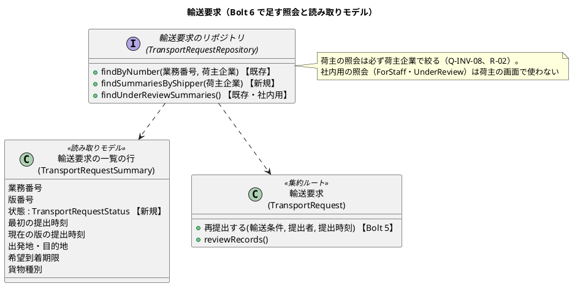
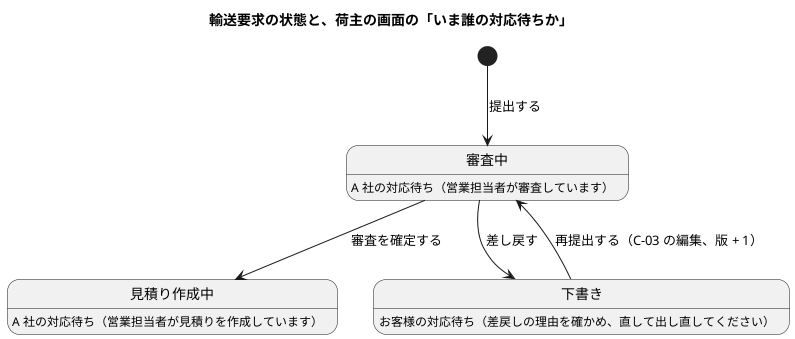
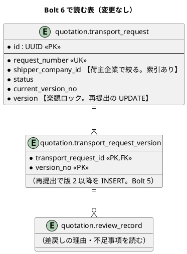
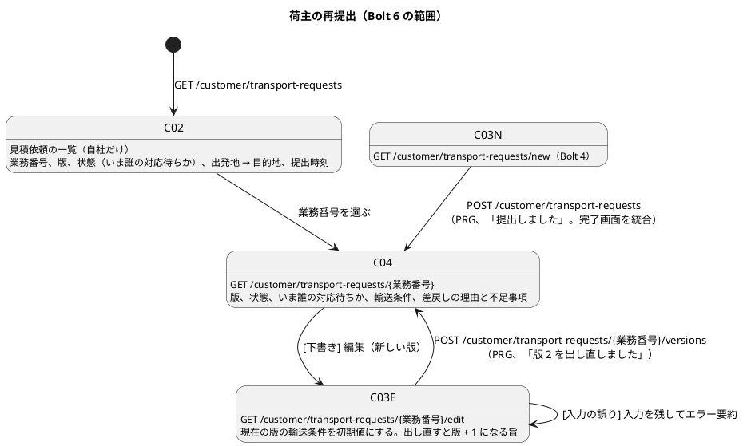

# Bolt 6 計画 - 荷主の再提出の画面（US-02 の差戻しから版 2 まで）

## 基本情報

| 項目 | 内容 |
| :--- | :--- |
| Bolt | 第 6 回 |
| 予定 | W1（2026-10-05 の週）、2〜4 時間 |
| 対象 | U1 輸送要求・見積り。US-02 輸送条件を審査する（AC2 の差戻しの後、荷主が理由を見て直し、AC3 の「新しい版」を出し直す流れを画面で通す） |
| GitHub | [#3 [US-02] 輸送条件を審査する](https://github.com/k2works/practical-domain-driven-design-in-enterpris-application/issues/3)（Bolt 5 でクローズ済み。この Bolt の成果はコメントで追記する）。C-02・C-04 は US-01（[#2](https://github.com/k2works/practical-domain-driven-design-in-enterpris-application/issues/2)）の画面でもあるため、#2 にも進捗を記録する |
| 承認ゲート | **業務のルール以外はまとめる**（2026-10-03 に human:kakimomokuri が決定）。計画の承認と、業務のルール・スキーマ・セキュリティに関わるステップ（ステップ 2）の承認は残す。設計文書の反映（ステップ 1）はステップ 2 の承認で、画面の層（ステップ 3）は終了報告（ステップ 4）の承認でまとめて受ける |
| アプローチ | 集約の操作（再提出）は Bolt 5 で作ってあるため、開発戦略の序盤のアウトサイドインで進める。業務ルール層の受入シナリオ（荷主の照会と再提出）から入り、足りない照会（荷主企業の一覧）を内側に作る。そのうえで画面の層を外側から駆動する |
| 前の Bolt | [Bolt 5 終了報告](bolt_05_report.md)、[Bolt 5 開発成果物レビュー](../../review/cargo-tracker/bolt_05_review_20261002.md) |

## Bolt ゴール

営業担当者が差し戻した見積依頼を、荷主が自社の見積依頼の一覧（C-02）で見つけ、詳細（C-04）で差戻しの理由と不足事項を読み、編集（C-03）で直して出し直せる。出し直すと業務番号は変わらずに版 2 が審査中になり、営業の受付一覧（S-02）に版 2 として並ぶ。他社の見積依頼は、一覧にも詳細にも編集にも出ない。

### 確かめたい仮説

| # | 仮説 | この Bolt で分かること |
| :--- | :--- | :--- |
| H1 | Bolt 5 で作った再提出の入力ポート（`ShipmentTermsInput` を受け取る `resubmit`）を、提出と同じフォームと変換器から書き換えずに呼べる | Bolt 5 のリスク「再提出は画面がないため利用者の流れとして確かめられない」への対策が効いたか |
| H2 | C-04 の「いま誰の対応待ちか」を、輸送要求の状態だけから決められる（状態ごとの対応表） | 進み具合の表示に、状態のほかの情報（担当営業など）が要るか |
| H3 | 承認ゲートを業務のルール以外でまとめても、終了報告の承認で人の変更依頼や見逃しの誤りが増えない | ゲートの密度を下げてよいか（Release 0.1 の残りの Bolt に使えるか） |

## ふりかえりと前の Bolt からの引き継ぎ

| 入力 | 内容 | この Bolt での扱い |
| :--- | :--- | :--- |
| 人の決定（2026-10-03、Bolt 6 の開始準備） | 範囲は荷主の再提出の画面。荷主は C-02 の最小の一覧から差戻しにたどり着く。差戻しは画面で見えるだけにする（荷主への連絡の運用は置かない）。MVP では出し直しの期限を設けない。不足事項は自由記述のまま。仮の営業担当者の記録は監査に使えないことを承知で進める（D-24） | ステップ 1 で設計文書に反映し、ステップ 2・3 で実装する |
| 人の決定（2026-10-03） | 承認ゲートの密度: 業務のルール以外のステップはまとめる | 上の「承認ゲート」。リリース計画の Unit の評価（U1 の承認ゲートの密度）にも書く |
| Try T-18 | 押せる範囲（24 CSS px）と横スクロールに効くスタイルは、UI の骨格（#36）の共通の CSS で決める | この Bolt では共通の CSS を作らない（#36）。新しい画面には Bolt 5 と同じ書き方（リンクの高さ、表の横スクロールの囲み）を当て、#36 で移す箇所として既知の課題に足す |
| Try T-19 | テストの結果を集計するときは、`passed` 以外の状態をすべて数える | Red・Green の確認で、`failed`・`ambiguous`・`undefined`・`skipped` を数える |
| Try T-20 | 計画に書く時刻は、`date` で確かめた値だけを書く | 各ステップの結果の時刻 |
| Try T-14・T-16・T-17 | ステップの終わりに `check` を緑にして push する。開始と完了の時刻を残す。`cd` は絶対パス | 全ステップ |
| Bolt 5 レビュー D-24 | 業務責任者に確かめる事項（荷主への知らせ方、出し直しの期限、不足事項の形、仮の営業担当者） | 上の人の決定で決まった。ユーザーストーリーの US-02 の決定に書く |
| Bolt 5 レビュー R-06 | 版 1 から変わった項目の表示を、荷主の再提出の画面を作る Bolt で検討する | 入れない（後の Bolt）。この Bolt では、S-03 の審査の履歴と C-04 の差戻しの理由で前の判断を追える。変わった項目の表示は、S-03 を UI の骨格（#36）で作り直すときに、営業担当者の使い方を確かめてから決める |
| Bolt 5 レビュー R-22 | 下書きの表示名「差戻し（下書き）」が R1.0 で合わなくなる | 荷主の画面では「差戻し（お客様の対応待ち）」と出す（AI の仮定）。下書きの保存（R1.0）で、差し戻されていない下書きと分ける |
| Bolt 4 レビュー R-02 | 業務番号は推測しやすいため、荷主の画面では荷主企業で絞る | 一覧・詳細・編集・再提出のすべてを荷主企業で絞り、他社の番号は 404 にする |
| UI 設計の C-03 の提出の完了 | 「C-04 見積依頼の詳細ができたらそちらへ統合する」 | 統合する（確認ポイント 3）。提出と再提出の後は C-04 へリダイレクトし、結果を上部に示す |

## スコープ

### 設計の約束（Try T-1）

| 設計の約束 | 出典 | この Bolt |
| :--- | :--- | :--- |
| 再提出は下書きのときだけ。版番号を 1 増やし、業務番号は変えない | Q-INV-13・15 | 入れる（Bolt 5 の集約の操作を画面から呼ぶ） |
| 提出済みの見積依頼を編集すると、新しい版になる旨を表示する | Q-INV-03、UI 設計 C-03 の「版」 | 入れる |
| C-04 に、版、進み具合（いま誰の対応待ちか）、審査結果、差戻し理由を示す | UI 設計 C-04 | 入れる。担当営業は入れない（営業担当者が仮の 1 人のため。US-18・US-16 の後） |
| C-04 の操作: 編集（新しい版）、複製、取下げ、見積りへの回答 | UI 設計 C-04 | 編集だけを入れる。複製（Q-INV-11）と取下げは後の Bolt、見積りへの回答は US-03・US-24 |
| C-02 は自社の輸送要求を状態で絞り込む | UI 設計 C-02 | 一覧だけを入れる。状態の絞り込みは後の Bolt（見積りの状態が増えてから） |
| C-01 ホームの要対応（差戻しを先頭に） | UI 設計 C-01 | 入れない（後の Bolt）。C-02 では差戻しの行に「お客様の対応待ち」と示す |
| 荷主の画面は荷主企業で絞る | Q-INV-08、Bolt 4 レビュー R-02 | 入れる |
| 顧客の画面の日時は、利用者のタイムゾーンで示す | UI 設計「日時表示」、BR-10 | 入れる（Bolt 4 の荷主の画面と同じ書式） |
| 差戻しを荷主に通知する | US-22 | 入れない（W9）。人の決定で、MVP の再提出の Bolt では画面で見えるだけにする |
| C-03 の隠し項目 `commandId`・期待版 | UI 設計 C-03、ARCH-HO-01 | 入れない（Bolt 5 と同じく ARCH-HO-01 の残りとして後の Bolt。確認ポイント 4） |
| 利用者は自社の輸送要求だけを操作できる（アプリケーション層で確認する） | Q-INV-08 | 入れる。荷主の照会サービスと再提出のコマンドが荷主企業を受け取り、リポジトリの照会で絞る（Bolt 4・5 と同じ形） |
| 再提出も希望到着期限は提出時刻より後 | Q-INV-12・15 | 入れる（Bolt 5 の検証のまま） |

### 入れるもの・入れないもの

| 入れる | 入れない（後の Bolt） |
| :--- | :--- |
| C-02 見積依頼の一覧（自社だけ、最初の提出時刻の新しい順） | 状態の絞り込み、C-01 ホームの要対応 |
| C-04 見積依頼の詳細（版、状態、いま誰の対応待ちか、輸送条件、差戻しの理由と不足事項、編集への入口） | 担当営業、見積り、予約へのリンク、複製、取下げ |
| C-03 の編集（現在の版の輸送条件を初期値にし、出し直すと新しい版） | 下書きの保存（R1.0）、必要書類（US-01 AC2） |
| 提出の完了画面の C-04 への統合 | 段階入力（#36） |
| 荷主企業の一覧の照会（読み取りモデル） | S-03 の版の差分の表示（R-06） |

## 設計（この Bolt の範囲）

### ドメインモデル

集約の操作は足さない。荷主の一覧のための照会と、読み取りモデルの項目を足す。

> 注（設計への反映。ステップ 1 で反映する）: 次は計画を書いた時点でドメインモデルになかった。
>
> - リポジトリの荷主企業の一覧の照会（`findSummariesByShipper`）と、読み取りモデル `TransportRequestSummary` の状態の項目
> - 荷主に見せる審査記録の範囲: 差戻しの理由と不足事項は見せ、審査の確定の根拠は見せない（確認ポイント 2）

### 状態遷移

状態と遷移は Bolt 5 のまま変えない。荷主の画面から見た「いま誰の対応待ちか」を状態に対応させる（仮説 H2）。

### データモデル

表と列は変えない（スキーマの変更なし）。荷主企業の一覧は、既存の索引 `ix_transport_request_shipper_status`（`shipper_company_id`, `status`）で絞り、版 1 と現在の版を結合して読む。

### 画面遷移

## 開始準備の検証

| 検証 | 見つけたこと | 対応 |
| :--- | :--- | :--- |
| 詳細（ストーリー・設計との突合） | UI 設計 C-03 の隠し項目（`commandId`・期待版）を計画が入れていない | 設計の約束の表に「入れない（ARCH-HO-01 の残り）」を足し、確認ポイント 4 で確かめる |
| 詳細 | Bolt 4 の画面の層のシナリオが「完了画面に業務番号と版 1 と状態 審査中」を確かめている。完了画面を C-04 に統合すると、ステップの定義が変わる | ステップ 3 とリスクに書いた。荷主の状態の表示名は「審査中（A 社の対応待ち）」で、「審査中」を含むので文言の照合は保てる |
| 詳細 | Q-INV-08 は「アプリケーション層で確認」。リポジトリでの絞り込みとの関係 | 設計の約束の表に書いた（入力ポートが荷主企業を受け取り、リポジトリの照会で絞る。Bolt 4・5 と同じ） |
| 横断（開発戦略） | 序盤はアウトサイドイン。集約の操作を足さないので、Bolt 5 のようなインサイドアウトの例外は要らない | アプローチに書いた |
| 横断（BC の独立性） | 変更は `quotation` の中だけ。共有カーネルの `CompanyId`・`UtcInstant`・`Location` を使い、ほかのコンテキストの型に依存しない | 問題なし |
| 横断（過去の計画との連続性） | 荷主の照会は必ず荷主企業で絞り、社内用の照会と名前を分ける（Bolt 4 R-02、Bolt 5 R-10）。結果は戻り値で返す（Bolt 4・5） | 問題なし。新しい照会も `findSummariesByShipper` と荷主企業を引数に取る名前にする |
| 前の Bolt のレビュー | R-06（版の差分）、R-22（下書きの表示名）、D-24 | ふりかえりの表に扱いを書いた |

## 入力

| 成果物 | パス |
| :--- | :--- |
| ユーザーストーリー（US-02 の決定、US-01） | `docs/requirements/cargo-tracker/user_story.md` |
| ドメインモデル（Q-INV-03・08・13・15、リポジトリの照会） | `docs/design/cargo-tracker/domain_model.md` |
| データモデル（索引、楽観ロック） | `docs/design/cargo-tracker/data_model.md` |
| UI 設計（C-02・C-03・C-04、URL の決まり、日時表示、エラー要約） | `docs/design/cargo-tracker/ui_design.md` |
| テスト戦略（シナリオの階層、タグ規約） | `docs/design/cargo-tracker/test_strategy.md` |
| 手順書（開く URL） | `docs/operation/cargo-tracker/application_development_setup.md` |
| 開発ガイドライン 第 2 章（輸送要求のモデル）、第 3 章（4 パッケージの構成） | `docs/article/02-cargo-domain-model.md`、`docs/article/03-spring-modular-monolith.md` |

## ステップ計画

状態の記号: `[ ]` 未着手、`[-]` 進行中、`[?]` 承認待ち、`[R]` 修正中、`[x]` 完了、`[S]` スキップ。各ステップの終わりに `check` が緑であることを確かめて push する（T-14）。

- [x] **1. 決定を設計文書に反映する**（承認はステップ 2 とまとめて受ける）
  - ユーザーストーリー: US-02 の決定に D-24 の決定（画面で見えるだけ、期限なし、不足事項は自由記述、仮の営業担当者を承知）を足す
  - ドメインモデル: 上の「注」（荷主企業の一覧の照会、読み取りモデルの状態、荷主に見せる審査記録の範囲）
  - UI 設計: URL の表に C-02・C-04・C-03 の編集を足し、C-03 の提出の完了の行を C-04 への統合に改める。C-04 の「いま誰の対応待ちか」の対応表
  - リリース計画: U1 の承認ゲートの密度を「業務のルール以外はまとめる」に改める（開始準備で反映済み）
  - 完了の判定: `okf:check` が ERROR 0、`documentationTest` が緑。push する。
  - 結果（2026-10-03 09:11〜09:12）: ユーザーストーリー（US-02 の決定に D-24 と荷主に見せる審査記録の範囲）、ドメインモデル（荷主の再提出の段落: `findSummariesByShipper`、一覧の行の状態、見せる審査記録の範囲）、UI 設計（URL の表に C-02・C-04・C-03 の編集を足し、提出の完了の行を C-04 に統合。状態といま誰の対応待ちかの対応表）に反映した。`okf:check` ERROR 0、`documentationTest` 緑
- [x] **2. 荷主の照会と再提出のユースケース（業務ルール層の Red → Green、内側の TDD）** 【承認ゲート: 荷主企業での絞り込み（セキュリティ）】
  - 業務ルール層の受入シナリオを先に書く（`features/quotation/resubmit_transport_request.feature`、`@US-02 @must`）。
    - 差し戻された見積依頼が、荷主の一覧に「下書き（差戻し）」で出て、詳細で理由と不足事項が読める
    - 直して再提出すると、業務番号は変わらずに版 2 が審査中になり、受付一覧に版 2 で並ぶ（Bolt 5 の再提出のシナリオと重ならないよう、荷主の照会から通す）
    - 他社の見積依頼は、荷主の一覧に出ず、業務番号で照会しても見つからず、再提出もできない（Q-INV-08）
    - 審査中の見積依頼は再提出できない（Bolt 5 の `NOT_DRAFT` を荷主の照会から確かめる）
  - 足りない内側を TDD で作る: 読み取りモデルの状態、リポジトリの `findSummariesByShipper`（メモリ上の実装と MyBatis）、荷主の照会サービス
  - 統合テスト（PostgreSQL）を先に書く: 自社の輸送要求だけが最初の提出時刻の新しい順に返り、再提出の版 2 では現在の版の提出時刻が変わる
  - 完了の判定: `check` が緑。push する。ステップ 1 とあわせて承認を受ける。
  - 結果（2026-10-03 09:13〜09:19）: 受入シナリオ 4 件（`resubmit_transport_request.feature`）をステップ定義とともに先に書き、コンパイルの失敗で Red を確かめた。内側は、集約の `sendBackNotice()`（荷主に見せる差戻しの知らせ `SendBackNotice`。現在の版への差戻しの理由と不足事項だけで、下書きのときだけ返す）、一覧の行の状態、リポジトリの `findSummariesByShipper`（メモリ上の実装と MyBatis。一覧の SQL は社内の受付一覧と共通の断片にした）、荷主の照会サービスの `findSummaries` を、単体テスト 3 件と統合テスト 1 件を先に書いて作った。業務ルール層のシナリオは 42 件すべて passed（failed・undefined・skipped 0）。`check` 緑（テスト 293 件）
  - 承認（2026-10-03、human:kakimomokuri）: ステップ 1 とあわせて承認された。「直近の差戻し」を「下書きのときの、現在の版への差戻し」とする解釈も承認された（出し直した後は前の版の差戻しの理由を示さない）
- [ ] **3. 荷主の画面を作る（画面の層の Red → Green）**（承認はステップ 4 とまとめて受ける）
  - 画面の層の受入シナリオ（`features/ui/resubmit_transport_request_ui.feature`、`@ui @US-02`）を先に書く。主成功と画面に固有の条件だけにする（テスト戦略）。
    - 主成功: 営業が差し戻した見積依頼を、荷主が一覧から開き、理由と不足事項を読み、編集で目的地を直して出し直すと、詳細に「版 2 を出し直しました」と審査中が示される。キー操作だけで行える
    - 画面に固有の条件: 編集で必須の項目を空にして送ると、エラー要約が出て入力が残る
    - 幅 320 CSS px で横スクロールが出ない。axe-core の違反 0 件（一覧・詳細・編集）
  - C-02・C-04・C-03 の編集を作る。編集の初期値は現在の版の輸送条件にする。出し直せない状態（審査中など）で編集を開いたら、C-04 に戻して理由を示す。
  - 提出の完了画面（`/{業務番号}/submitted`）を C-04 に統合する。Bolt 4 の画面の層のシナリオの期待（完了画面の文言）を C-04 に合わせる。
  - 入口の一覧（`/`）に C-02 を足す。手順書の「開く URL」を更新する。
  - 完了の判定: `check` と `uiTest` が緑。push する。
- [ ] **4. 検証と Bolt 終了報告**
  - `check`・`uiTest`・CI・SonarQube の品質ゲート（PASS）を確かめる。
  - `bolt_06_report.md` を書く（仮説 H1〜H3 の結論、各ステップの開始と完了の時刻）。ステップ 3 の結果をここでまとめて報告する。

### 時間の配分と打ち切り

| ステップ | 目安 |
| :--- | :--- |
| 1 | 15 分 |
| 2 | 60 分 |
| 3 | 100 分 |
| 4 | 20 分 |
| 合計 | 195 分 |

4 時間を超えそうなときは、次の順で次の Bolt に回す。

1. ステップ 3 の画面に固有の条件のシナリオ（エラー要約）。編集の誤りの表示は Bolt 4 の C-03 と同じ部品なので、画面の実装は残す
2. 提出の完了画面の C-04 への統合（完了画面を残し、C-04 へのリンクだけを足す）

荷主企業での絞り込みと、再提出の流れ（ステップ 2）は削らない。

## 確認ポイント（計画の承認の場でまとめて確認する。Try T-6。2026-10-03 にすべて承認）

| # | 確認すること | ステップ | 理由 |
| :--- | :--- | :--- | :--- |
| 1 | 荷主の画面の URL: C-02 は `GET /customer/transport-requests`、C-04 は `GET /customer/transport-requests/{業務番号}`、編集は `GET /customer/transport-requests/{業務番号}/edit`、出し直しは `POST /customer/transport-requests/{業務番号}/versions`（新しい版を作る）。すべて荷主企業で絞り、他社の番号は 404 | 1、3 | UI 設計への URL の追加 |
| 2 | 荷主に見せる審査記録: 直近の差戻しの理由と不足事項だけを見せる。審査の確定の根拠と判断者（営業担当者）は見せない（社内の判断の記録のため）。営業担当者が書く差戻しの理由は荷主に届く文になる（S-03 のヒントは Bolt 5 の R-12 で「荷主に伝わる言葉で」にしてある） | 1、2、3 | 社内の記録を荷主に開示する範囲 |
| 3 | 提出の完了画面を C-04 に統合する。提出と再提出の後は C-04 へリダイレクトし（PRG）、「TR-2026-0001 版 1 を提出しました」を上部に示す。`/{業務番号}/submitted` はなくす | 1、3 | UI 設計の「C-04 ができたら統合する」に従う。Bolt 4 の画面の層のシナリオを書き換える |
| 4 | 出し直しで楽観ロックの期待版を画面に持たせない。下書きを動かせるのは荷主だけで、二重送信は 2 回目が「審査中のため出し直せません」で拒否される。同時の更新は Bolt 5 のとおり「他の利用者が先に更新しました」と示す | 2、3 | ARCH-HO-01 の `expectedVersion` を入れずに済ませる |

決定（2026-10-03、human:kakimomokuri）: 確認ポイント 1〜4 はすべて上の案で承認された。AI の仮定にも異議はなかった。

push はステップの完了ごとに行う（T-14）。

## AI の仮定

- C-02 の並びは、最初の提出時刻の新しい順にする（荷主は最近の依頼から探す）。件数が少ないうちはページ分けをしない。
- 荷主の画面の状態の表示名: 審査中は「審査中（A 社の対応待ち）」、下書きは「差戻し（お客様の対応待ち）」、見積り作成中は「見積り作成中（A 社の対応待ち）」とする。営業の画面の表示名（「差戻し（下書き）」）は変えない。
- 編集の画面は、Bolt 4 の C-03 のテンプレートとフォームを使い回し、見出しと送り先と「出し直すと版 N になります。業務番号は変わりません」の案内だけを変える。
- 出し直しの検証は提出と同じ（`ShipmentTermsInput`）。希望到着期限は、出し直す時刻より後でなければならない（版 1 の期限が過ぎていれば直してもらう）。

## リスクと対策

| リスク | 影響 | 対策 |
| :--- | :--- | :--- |
| 完了画面の C-04 への統合で、Bolt 4 の画面の層のシナリオと単体テストが壊れる | ステップ 3 が長引く | 打ち切りの線 2 で完了画面を残せるようにする。期待の文言だけを変え、シナリオの手順は変えない |
| C-03 のテンプレートを作成と編集で共有すると、条件の分岐が増えて読みにくくなる | 画面の保守が難しくなる | 送り先・見出し・案内をモデルの値で渡し、テンプレートの中の分岐は案内の表示の 1 か所にする |
| 承認ゲートをまとめたため、画面の層の誤りが終了報告まで人の目に触れない | 手戻りが Bolt の終わりに集まる | ステップ 3 の終わりに CI の緑を確かめてから報告する。業務のルールに関わる判断が画面の層で出てきたら、まとめずにその場で確認する |
| 荷主の一覧の照会を作り間違え、他社の見積依頼が出る | 権限外開示（PV-01 で 0 件） | 業務ルール層と統合テストと画面の単体テストの 3 か所で他社を確かめる。ステップ 2 は承認ゲートを残す |

## 完了条件

### Definition of Done

- [ ] ステップ 1〜4 が完了し、計画・ステップ 2・終了報告の承認ゲートを人が通した
- [ ] `./gradlew check` と `./gradlew uiTest` がローカルと CI の両方で緑。各ステップの終わりに push できた
- [ ] SonarQube の品質ゲートが PASS
- [ ] 業務ルール層で荷主の照会と再提出のシナリオ（他社を含む）が緑。画面の層で主成功と画面に固有の条件が緑
- [ ] 確認ポイント 1〜4 と D-24 の決定が、設計文書から追える
- [ ] `bolt_06_report.md` に仮説 H1〜H3 の結論と、各ステップの時刻を記録した
- [ ] ユーザーマニュアルは更新しない（マニュアルはまだない。画面は UI の骨格（#36）の前の仮の画面）

### デモ項目

| # | デモ | 確かめること |
| :--- | :--- | :--- |
| 1 | `bootRun` で見積依頼を提出し、営業の画面で差し戻す | 荷主の一覧に「差戻し（お客様の対応待ち）」で出る |
| 2 | 詳細で理由を読み、編集で目的地を直して出し直す | 業務番号は変わらず版 2 が審査中になり、営業の受付一覧に版 2 で並ぶ |
| 3 | `./gradlew uiTest` | 再提出の画面の層のシナリオが通り、axe-core の違反が 0 件 |

## 更新履歴

| 日付 | 内容 | 作成 | 承認 |
| :--- | :--- | :--- | :--- |
| 2026-10-03 | 初版（人の決定: 範囲は荷主の再提出の画面、C-02 の最小の一覧、差戻しは画面で見えるだけ、期限なし、不足事項は自由記述、仮の営業担当者を承知、承認ゲートは業務のルール以外をまとめる） | anthropic/claude-opus-5-5 | — |
| 2026-10-03 | 計画を承認。確認ポイント 1〜4（荷主の画面の URL と他社の 404、荷主に見せる審査記録の範囲、完了画面の C-04 への統合、期待版を画面に持たせない）も承認された（Try T-6） | anthropic/claude-opus-5-5 | human:kakimomokuri |

## 関連ドキュメント

- [リリース計画](release_plan.md)（W1）
- [開発戦略](development_strategy.md)（序盤・アウトサイドイン）
- [Bolt 5 終了報告](bolt_05_report.md)、[Bolt 5 開発成果物レビュー](../../review/cargo-tracker/bolt_05_review_20261002.md)
- [ユーザーストーリー](../../requirements/cargo-tracker/user_story.md)、[ドメインモデル](../../design/cargo-tracker/domain_model.md)、[データモデル](../../design/cargo-tracker/data_model.md)、[UI 設計](../../design/cargo-tracker/ui_design.md)
