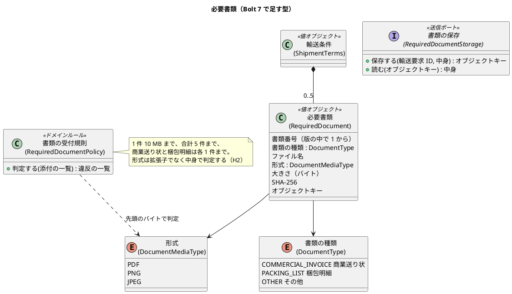
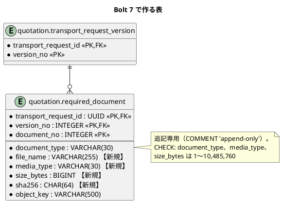
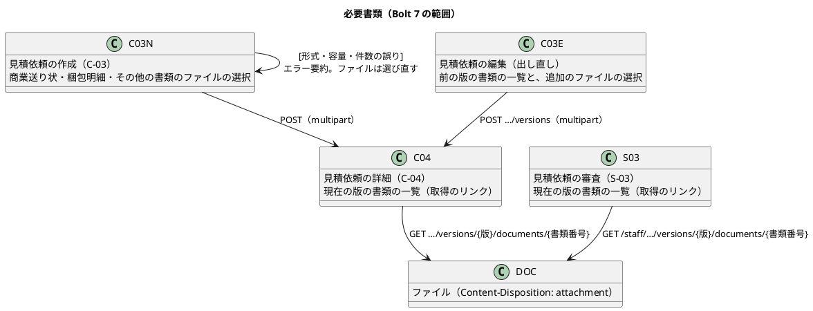

# Bolt 7 計画 - 見積依頼の必要書類（US-01 AC2 の残り）

## 基本情報

| 項目 | 内容 |
| :--- | :--- |
| Bolt | 第 7 回 |
| 予定 | W1（2026-10-05 の週）、3〜4 時間 |
| 対象 | U1 輸送要求・見積り。US-01 輸送条件を提出する（AC2 の必要書類。Release 0.1 の範囲の残り） |
| GitHub | [#2 [US-01] 輸送条件を提出する（R0.1: AC1・AC2・AC4）](https://github.com/k2works/practical-domain-driven-design-in-enterpris-application/issues/2)。この Bolt で R0.1 の範囲がそろうので、終了報告の承認でクローズする |
| 承認ゲート | 業務のルール以外はまとめる（Bolt 6 の H3 で継続を決めた）。計画の承認、業務のルールとセキュリティ（ステップ 2）、スキーマ（ステップ 3）、終了報告（ステップ 4・5 をまとめる）の 4 回 |
| アプローチ | 開発戦略の序盤のアウトサイドイン。業務ルール層の受入シナリオから入り、メモリ上のリポジトリとファイルの保存で業務の規則を作る。そのあと表とファイルの保存を内側に作り、最後に画面の層を外側から駆動する |
| 前の Bolt | [Bolt 6 終了報告](bolt_06_report.md) |

## Bolt ゴール

荷主が見積依頼の作成と出し直しの画面で、商業送り状・梱包明細・その他の書類（PDF・PNG・JPEG、1 件 10 MB、5 件まで）を任意で添付して提出できる。添付した書類は、提出した荷主（C-04）と営業担当者（S-03）だけが開ける。形式・容量・件数の誤りはエラー要約で示し、提出しない。

### 確かめたい仮説

| # | 仮説 | この Bolt で分かること |
| :--- | :--- | :--- |
| H1 | ファイルの本体を保存のポート（`RequiredDocumentStorage`）の向こうに置けば、業務ルール層はメモリ上の保存で、統合テストはローカルのファイルシステムで同じ振る舞いを確かめられる | S3（ADR-008）への差し替えを infrastructure だけで済ませられるか |
| H2 | 形式を拡張子でなく中身の先頭のバイトで判定すれば、拡張子を偽ったファイルを拒否できる | 形式の判定をドメインの規則として持てるか |
| H3 | 出し直しで前の版の書類を同じオブジェクトキーで新しい版に引き継げば、ファイルを複製せずに、版ごとの書類の記録を追記専用のまま残せる | 版の不変（追記専用）と書類の引き継ぎが両立するか |

## ふりかえりと前の Bolt からの引き継ぎ

| 入力 | 内容 | この Bolt での扱い |
| :--- | :--- | :--- |
| 人の決定（2026-10-03、Bolt 7 の開始準備。D-20） | 必要書類は提出の段階では任意で添付できる。足りなければ営業が審査で差し戻す（US-02）。形式は PDF・PNG・JPEG、1 件 10 MB。閲覧できるのは提出した荷主と営業担当者だけ | ステップ 1 で設計文書に反映し、ステップ 2〜4 で実装する |
| D-20 の残り（複製で書類を再提出させるか） | Q-INV-11 で「必要書類は引き継がない」と決まっている。複製は US-01 AC5（R1.0） | 入れない（R1.0 の複製の Bolt） |
| Try T-21 | 画面の層の受入シナリオも、実装の前に `uiTest` で一度実行し、失敗を記録する | ステップ 4 で行う |
| Try T-18 | 押せる範囲と横スクロールのスタイルは、UI の骨格（#36）の共通の CSS で決める | 共通の CSS は作らない。新しい部品（ファイルの選択、書類の一覧）は Bolt 6 と同じ書き方にし、#36 で移す箇所に足す |
| Try T-19・T-20・T-14・T-16・T-17 | 結果は `passed` 以外の状態をすべて数える。時刻は `date` で確かめた値だけを書く。ステップの終わりに `check` を緑にして push する。`cd` は絶対パス | 全ステップ |
| Bolt 6 の既知の課題 | 同時の更新で出し直せなかったとき入力が残らない。出し直した後は前の版の差戻しを示さない | この Bolt の範囲外。添付したファイルも、誤りがあれば選び直してもらう（ブラウザはファイルの選択を残せない） |

## スコープ

### 設計の約束（Try T-1）

| 設計の約束 | 出典 | この Bolt |
| :--- | :--- | :--- |
| 輸送条件は 0 件以上の必要書類を持つ | ドメインモデル（`Terms *-- "0..*" Doc`） | 入れる |
| Q-INV-01 の必須条件に必要書類を含める | ドメインモデル Q-INV-01 | **変える**。D-20 で任意にしたため、必須条件から外す（ステップ 1 でドメインモデルとユーザーストーリーを直す） |
| 必要書類は版ごとに持つ（`required_document` の主キーは版を含む） | データモデル | 入れる。表は新しく作る（スキーマの変更。確認ポイント 1） |
| 原本は S3 に置き、DB にはオブジェクトキーを持つ。開発ではローカルのファイルシステム | データモデル、ADR-004・007・008 | 入れる。この Bolt はローカルのファイルシステムの実装だけを作る。S3 の実装は運用準備（W10、#28） |
| C-03 の「ファイルを選ぶ」ボタン。ドラッグ & ドロップは補助 | UI 設計 C-03（WCAG 2.5.7） | ボタン（`input type="file"`）だけを入れる。ドラッグ & ドロップは入れない |
| C-03 の段階入力（書類の段階） | UI 設計 C-03 | 入れない（#36） |
| 書類の閲覧は提出した荷主と営業担当者だけ | D-20 | 入れる。荷主の取得は荷主企業で絞る（Q-INV-08）。荷受人・経路設計者への開示は US-10・US-06 で決める |
| 複製では必要書類を引き継がない | Q-INV-11 | 入れない（複製は R1.0） |

### 入れるもの・入れないもの

| 入れる | 入れない（後の Bolt） |
| :--- | :--- |
| 提出と出し直しでの添付（商業送り状 1 件、梱包明細 1 件、その他 3 件まで。合計 5 件まで） | 添付した書類の削除・差し替え（出し直しで追加はできる） |
| 形式（中身で判定）・容量・件数の検証とエラー要約 | ウイルスの検査（運用準備で方式を決める。リスクに書く） |
| 出し直しで前の版の書類を引き継ぐ | 書類の段階入力（#36）、ドラッグ & ドロップ |
| C-04（荷主）と S-03（営業）の書類の一覧と取得 | S3 の保存の実装（W10） |
| `required_document` の表とローカルのファイルシステムの保存 | 保存に失敗したファイルの片付け（リスクに書く） |

## 設計（この Bolt の範囲）

### ドメインモデル

> 注（設計への反映。ステップ 1 で反映する）: 次は計画を書いた時点でドメインモデルになかった。
>
> - 必要書類の属性、書類の種類、形式、書類の受付規則、書類の保存のポート
> - Q-INV-01 から必要書類を外す（D-20）。書類の受付規則を新しい不変条件（Q-INV-16）として足す
> - 出し直しでは前の版の書類を引き継ぎ、追加できる（確認ポイント 3）

### 状態遷移

輸送要求の状態と遷移は変えない。書類は版に付き、版は追記専用なので、書類だけを変える遷移はない（出し直しで新しい版を作る）。

### データモデル

> 注（設計への反映。ステップ 1 で反映する）: データモデルの `required_document` は `document_type` と `object_key` だけを持つ。画面にファイル名を出し、取得のときに形式を返し、改ざんを確かめるため、ファイル名・形式・大きさ・SHA-256 を足す（確認ポイント 1）。

### 画面遷移

## 開始準備の検証

| 検証 | 見つけたこと | 対応 |
| :--- | :--- | :--- |
| 詳細（ユーザーストーリー） | US-01 AC2 は「必須条件が不足する…下書きのまま」で、必要書類を必須条件に含める前提だった（Bolt 4 の決定「必要書類は次の Bolt で必須条件に入れる」） | D-20 で任意にした。ステップ 1 で US-01 の決定に書き、Bolt 4 の決定の文を改める |
| 詳細（ドメインモデル） | Q-INV-01 が必要書類を必須条件に含める。`RequiredDocument` は名前だけで属性がない | ステップ 1 で Q-INV-01 を改め、属性・規則・ポートを足す（上の注） |
| 詳細（データモデル） | `required_document` は 2 列だけ。表のマイグレーションはまだない | 確認ポイント 1。ステップ 3 で作る |
| 詳細（UI 設計） | C-03 の画面イメージは段階入力の「3 書類」。エラー要約の例が「商業送り状を添付してください」（必須の前提） | 段階入力は #36。エラー要約の例は形式・容量の誤りに改める（ステップ 1） |
| 横断（開発戦略） | 序盤はアウトサイドイン。新しい表があるが、集約の操作は足さず輸送条件に書類を持たせるだけなので、Bolt 5 のようなインサイドアウトの例外は要らない | ステップ 2（業務ルール層）→ ステップ 3（永続化）→ ステップ 4（画面）の順にした |
| 横断（BC の独立性） | 変更は `quotation` の中だけ。書類の保存のポートは `quotation.domain.model` に置き、実装は `quotation.infrastructure` に置く（採番のポートと同じ形） | 問題なし |
| 横断（過去の計画との連続性） | 荷主の照会は荷主企業で絞り、社内用と名前を分ける（Bolt 4 R-02、Bolt 5 R-10）。追記専用の表には同じマイグレーションで印を付ける（Bolt 5） | 書類の取得も荷主用（荷主企業で絞る）と社内用に分ける。`required_document` に追記専用の印を付ける |
| 前の Bolt のレビュー・既知の課題 | Bolt 6 はレビューを行っていない。既知の課題は上の表のとおり | 問題なし |

## 入力

| 成果物 | パス |
| :--- | :--- |
| ユーザーストーリー（US-01、US-02 の決定） | `docs/requirements/cargo-tracker/user_story.md` |
| ドメインモデル（Q-INV-01・08・11、輸送条件と必要書類） | `docs/design/cargo-tracker/domain_model.md` |
| データモデル（`required_document`、追記専用） | `docs/design/cargo-tracker/data_model.md` |
| UI 設計（C-03・C-04・S-03、ファイルの選択、エラー要約） | `docs/design/cargo-tracker/ui_design.md` |
| ADR（外部原本の保存、ローカルの開発環境、AWS） | `docs/adr/cargo-tracker/004-external-data-ingestion.md`、`007-postgresql-mybatis-flyway.md`、`008-aws-container-platform.md` |
| テスト戦略（シナリオの階層、タグ規約） | `docs/design/cargo-tracker/test_strategy.md` |
| 開発ガイドライン 第 2 章・第 3 章 | `docs/article/02-cargo-domain-model.md`、`docs/article/03-spring-modular-monolith.md` |

## ステップ計画

状態の記号: `[ ]` 未着手、`[-]` 進行中、`[?]` 承認待ち、`[R]` 修正中、`[x]` 完了、`[S]` スキップ。各ステップの終わりに `check` が緑であることを確かめて push する（T-14）。

- [?] **1. 決定を設計文書に反映する**（承認はステップ 2 とまとめて受ける）
  - ユーザーストーリー: US-01 の決定に D-20（任意、形式と容量と件数、閲覧できる人、複製は R1.0）を足し、Bolt 4 の「必要書類は次の Bolt で必須条件に入れる」を改める
  - ドメインモデル: Q-INV-01 から必要書類を外し、Q-INV-16（書類の受付規則）、必要書類の属性、書類の種類と形式、書類の保存のポートを足す
  - データモデル: `required_document` の列と制約、追記専用
  - UI 設計: C-03 の書類の入力、C-04・S-03 の書類の一覧と取得の URL、エラー要約の例
  - 完了の判定: `okf:check` が ERROR 0、`documentationTest` が緑。push する
  - 結果（2026-10-03 10:14〜10:15）: ユーザーストーリー（US-01 の決定に D-20、Bolt 4 の決定の文を改めた）、ドメインモデル（用語 5 つ、Q-INV-01 から必要書類を外し Q-INV-16 を足した、必要書類の属性、必要書類の段落）、データモデル（`required_document` の 4 列と制約、追記専用の一覧、スキーマの表の一覧）、UI 設計（C-03 の書類の入力、必要書類の取得の URL、エラー要約の例、ファイルの入力）に反映した。`okf:check` ERROR 0、`documentationTest` 緑
- [ ] **2. 書類の添付と閲覧のユースケース（業務ルール層の Red → Green）** 【承認ゲート: 業務のルール（Q-INV-16）とセキュリティ（閲覧の絞り込み）】
  - 業務ルール層の受入シナリオを先に書く（`features/quotation/attach_required_documents.feature`、`@US-01 @must`）
    - 商業送り状と梱包明細を添付して提出すると、版 1 に 2 件の書類が残り、荷主が取得すると同じ中身が返る
    - 書類なしでも提出できる（D-20）
    - 拡張子が `.pdf` でも中身が PDF でなければ受け付けない（H2）。10 MB を超える・6 件以上・商業送り状が 2 件は受け付けない。どれも提出されず、誤りがまとめて示される
    - 差し戻されて出し直すと、版 2 は版 1 の書類を引き継ぎ、追加した書類を足した一覧になる（H3）
    - 他社の荷主は書類を取得できない。営業担当者は取得できる
  - 足りない内側を TDD で作る: `RequiredDocument`、`DocumentType`、`DocumentMediaType`、`RequiredDocumentPolicy`、`RequiredDocumentStorage` とメモリ上の実装、提出・出し直しのコマンドの添付、書類の取得（荷主用と社内用）
  - 完了の判定: `check` が緑。push する。ステップ 1 とあわせて承認を受ける
- [ ] **3. 表とファイルの保存（内側の TDD、統合テスト）** 【承認ゲート: スキーマの変更】
  - 統合テスト（PostgreSQL）を先に書く: 版ごとの書類の保存と読み出し、出し直しでの引き継ぎ（同じオブジェクトキーの行が版 2 に足される）、CHECK 制約、追記専用（アプリケーション利用者は UPDATE・DELETE できない）
  - マイグレーション `V20261005…__create_required_document.sql`（`common`）。H2 のスモークを先に回す（T-15）
  - MyBatis のリポジトリの書類の保存と読み出し。ローカルのファイルシステムの保存（`cargotracker.document-storage.base-dir`。オブジェクトキーはファイル名を使わず `quotation/{輸送要求 ID}/{UUID}`）
  - 完了の判定: `check` が緑。push する。スキーマの承認を受ける
- [ ] **4. 画面の層（Red → Green）**（承認はステップ 5 とまとめて受ける）
  - 画面の層の受入シナリオ（`features/ui/attach_required_documents_ui.feature`、`@ui @US-01`）を先に書き、`uiTest` で失敗を確かめて記録する（T-21）
    - 主成功: 作成画面で商業送り状（PDF）を選んで提出すると、C-04 に書類の一覧が出て、取得できる。キー操作だけで行える
    - 画面に固有の条件: 形式の誤ったファイルを選んで提出すると、エラー要約に誤りが出て、ほかの入力が残り、ファイルの選び直しを求める
    - 営業の審査画面（S-03）に書類の一覧が出て、取得できる
    - 幅 320 CSS px で横スクロールが出ない。axe-core の違反 0 件
  - C-03 の作成と編集の書類の入力（`enctype="multipart/form-data"`）、C-04・S-03 の書類の一覧、取得の URL を作る。上限を超える送信（`MaxUploadSizeExceededException`）はエラー要約で示す
  - 完了の判定: `check` と `uiTest` が緑。push する
- [ ] **5. 検証と Bolt 終了報告**
  - `check`・`uiTest`・CI・SonarQube の品質ゲート（PASS）を確かめる
  - `bolt_07_report.md` を書く（仮説 H1〜H3 の結論、各ステップの開始と完了の時刻）。ステップ 4 の結果をここでまとめて報告する

### 時間の配分と打ち切り

| ステップ | 目安 |
| :--- | :--- |
| 1 | 15 分 |
| 2 | 60 分 |
| 3 | 50 分 |
| 4 | 90 分 |
| 5 | 20 分 |
| 合計 | 235 分 |

4 時間を超えそうなときは、次の順で次の Bolt に回す。

1. ステップ 4 の幅 320 CSS px のシナリオ（スタイルは Bolt 6 と同じ書き方で当てる）
2. 出し直しでの書類の追加（引き継ぎだけを残す）

形式・容量・件数の検証と、閲覧の絞り込みは削らない。

## 確認ポイント（計画の承認の場でまとめて確認する。Try T-6。2026-10-03 に 1〜5 を決定）

| # | 確認すること | ステップ | 理由 |
| :--- | :--- | :--- | :--- |
| 1 | `required_document` を新しく作り、データモデルの 2 列にファイル名・形式・大きさ・SHA-256 の 4 列を足す。追記専用にする | 1、3 | スキーマの変更 |
| 2 | 書類の入力は種類ごとに分ける: 商業送り状（1 件）、梱包明細（1 件）、その他の書類（複数選択、3 件まで）。合計 5 件まで | 1、2、4 | 書類の種類を荷主に選ばせる形。ファイルごとに種類を選ぶ欄は、ファイルの選択と組にできない（素の HTML の制約） |
| 3 | 出し直しでは、前の版の書類をすべて引き継ぎ（同じオブジェクトキー）、新しく選んだ書類を足す。引き継いだ書類の削除・差し替えは後の Bolt | 1、2、4 | 版は追記専用。削除の画面を作らずに済ませる（H3） |
| 4 | 取得の URL: 荷主は `GET /customer/transport-requests/{業務番号}/versions/{版}/documents/{書類番号}`、営業は `GET /staff/transport-requests/{業務番号}/versions/{版}/documents/{書類番号}`。`Content-Disposition: attachment` と `X-Content-Type-Options: nosniff` で返す（ブラウザの中で開かせない）。荷主の他社の番号は 404 | 1、2、4 | 閲覧の絞り込みとファイルの安全な返し方（セキュリティ） |
| 5 | ローカルのファイルシステムの保存先は設定 `cargotracker.document-storage.base-dir`（既定は一時ディレクトリの下）。S3 の実装は運用準備（W10、#28）で作る | 3 | 開発環境だけで動く実装にする |

決定（2026-10-03、human:kakimomokuri）: 確認ポイント 1〜4 はすべて上の案で決まった。確認ポイント 5 と AI の仮定にも異議はなかった。

## AI の仮定

- 形式の判定は先頭のバイトで行う（PDF は `%PDF-`、PNG は 8 バイトの署名、JPEG は `FF D8 FF`）。ファイルの中身の構造までは検査しない。
- ファイル名は画面に出すだけに使い、保存のキーに使わない。取得のときは RFC 6266 の `filename*` で返す。
- 1 回の送信の上限は `spring.servlet.multipart.max-file-size=10MB`、`max-request-size=55MB` にする。
- ファイルの保存は、輸送条件の検証を通った後、DB の保存の前に行う。DB の保存に失敗すると保存したファイルが残る（片付けは後の Bolt。リスクに書く）。

## リスクと対策

| リスク | 影響 | 対策 |
| :--- | :--- | :--- |
| マルウェアを含むファイルを、営業担当者がダウンロードして開く | 社内の端末の感染 | 形式を 3 つに絞り、中身で判定し、`attachment` と `nosniff` で返す。ウイルスの検査は運用準備（W10）で方式を決める。それまでパイロットで使わない（パイロット開始の条件に足すかを終了報告で人に確かめる） |
| 他社の荷主が業務番号と版と書類番号を推測して書類を取得する | 権限外開示（PV-01 で 0 件） | 荷主の取得は荷主企業で絞った照会を通す。業務ルール層・統合テスト・画面の単体テストの 3 か所で他社を確かめる。ステップ 2 は承認ゲートを残す |
| ファイルを保存した後に DB の保存が失敗し、ファイルが残る | 保存先に参照されないファイルがたまる | 開発環境ではローカルのファイルシステムなので影響は小さい。S3 の実装のときに、ライフサイクルの規則か片付けのジョブを決める |
| multipart の上限を超えた送信が、コントローラーに届く前に失敗する | 利用者に分かりにくい誤りの画面が出る | 例外を受けてエラー要約で示す（ステップ 4）。画面の単体テストで確かめる |
| 画面の層のテストでファイルを扱うと遅く・不安定になる | `uiTest` の時間が延びる | テスト用の小さな PDF と、中身が PDF でないファイルを `src/test/resources` に置き、Playwright の `setInputFiles` で選ぶ |

## 完了条件

### Definition of Done

- [ ] ステップ 1〜5 が完了し、計画・ステップ 2・ステップ 3・終了報告の承認ゲートを人が通した
- [ ] `./gradlew check` と `./gradlew uiTest` がローカルと CI の両方で緑。各ステップの終わりに push できた
- [ ] SonarQube の品質ゲートが PASS
- [ ] 業務ルール層で添付・検証・引き継ぎ・閲覧の絞り込みのシナリオ（他社を含む）が緑。画面の層で主成功と画面に固有の条件が緑
- [ ] 確認ポイント 1〜5 と D-20 の決定が、設計文書から追える
- [ ] `bolt_07_report.md` に仮説 H1〜H3 の結論と、各ステップの時刻を記録した
- [ ] #2 を、終了報告の承認でクローズした
- [ ] ユーザーマニュアルは更新しない（マニュアルはまだない。画面は UI の骨格（#36）の前の仮の画面）

### デモ項目

| # | デモ | 確かめること |
| :--- | :--- | :--- |
| 1 | `bootRun` で商業送り状（PDF）を添付して提出する | C-04 に書類の一覧が出て、取得すると同じファイルがダウンロードされる |
| 2 | 拡張子を `.pdf` に変えたテキストのファイルを添付して提出する | エラー要約に形式の誤りが出て、提出されない |
| 3 | 営業の審査画面で書類を開き、差し戻す。荷主が梱包明細を足して出し直す | 版 2 に商業送り状と梱包明細の 2 件が並ぶ |
| 4 | `./gradlew uiTest` | 書類の画面の層のシナリオが通り、axe-core の違反が 0 件 |

## 更新履歴

| 日付 | 内容 | 作成 | 承認 |
| :--- | :--- | :--- | :--- |
| 2026-10-03 | 初版（人の決定 D-20: 任意で添付、PDF・PNG・JPEG で 1 件 10 MB、閲覧は提出した荷主と営業担当者） | anthropic/claude-opus-5-5 | — |
| 2026-10-03 | 計画を承認。確認ポイント 1〜5（`required_document` の 4 列の追加と追記専用、種類ごとの入力欄、出し直しでの引き継ぎと追加、取得の URL と `attachment`・`nosniff`、ローカルのファイルシステムの保存先）も決まった（Try T-6） | anthropic/claude-opus-5-5 | human:kakimomokuri |

## 関連ドキュメント

- [リリース計画](release_plan.md)（W1）
- [開発戦略](development_strategy.md)（序盤・アウトサイドイン）
- [Bolt 6 終了報告](bolt_06_report.md)
- [ユーザーストーリー](../../requirements/cargo-tracker/user_story.md)、[ドメインモデル](../../design/cargo-tracker/domain_model.md)、[データモデル](../../design/cargo-tracker/data_model.md)、[UI 設計](../../design/cargo-tracker/ui_design.md)
