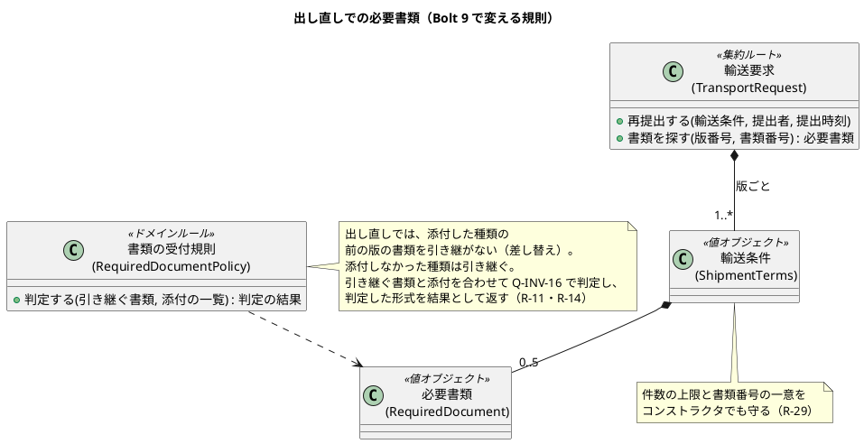
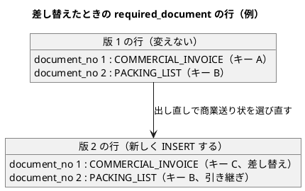
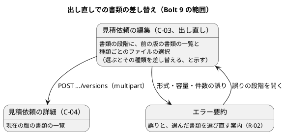

# Bolt 9 計画 - Bolt 6〜8 レビューの返済（書類の差し替えと改善提案）

## 基本情報

| 項目 | 内容 |
| :--- | :--- |
| Bolt | 第 9 回（W2 の最初の Bolt） |
| 予定 | W2（2026-10-12 の週。前倒しで 2026-10-05 から）、3〜4 時間 |
| 対象 | U1 輸送要求・見積り。[Bolt 6〜8 開発成果物レビュー](../../review/cargo-tracker/bolt_06-08_review_20261003.md) の R-01（引き継いだ書類の差し替え。D-25）と、AI の提案する対応方針が「修正」の改善提案 |
| GitHub | [#37 [技術] Bolt 6〜8 レビューの返済（書類の差し替えと改善提案）](https://github.com/k2works/practical-domain-driven-design-in-enterpris-application/issues/37)（確認ポイント 3。SP 0）。終了報告の承認でクローズする |
| 承認ゲート | 業務のルール・セキュリティに関わるステップは毎回、それ以外は次の承認ゲートにまとめる（U1 の密度。2026-10-03 の決定）。計画の承認、業務のルールとセキュリティ（ステップ 2）、終了報告（ステップ 3・4・5 をまとめる）の 3 回 |
| アプローチ | 開発戦略の序盤のアウトサイドイン。R-01 は業務ルール層の受入シナリオから入る。ほかの改善提案は、振る舞いを変えるものはテストを先に書き、振る舞いを変えないものは既存のテストを安全網にしてリファクタリングする |
| 前の Bolt | [Bolt 8 終了報告](bolt_08_report.md)、[Bolt 6〜8 開発成果物レビュー](../../review/cargo-tracker/bolt_06-08_review_20261003.md) |

## Bolt ゴール

荷主は出し直しで、引き継いだ書類を種類ごとに選び直して差し替えられる。前の版の書類の行は変わらない。あわせて、Bolt 6〜8 のレビューで「修正」とした指摘を片付け、W2 の見積り（US-03）を、書類の保存・画面の表示・層の境界の負債がない状態から始められるようにする。

### 確かめたい仮説

| # | 仮説 | この Bolt で分かること |
| :--- | :--- | :--- |
| H1 | 差し替えを「新しい版の書類の一覧を作り直す」こととして扱えば、版 1 の行を変えずに（追記専用のまま）差し替えられる | 版の不変と差し替えが、表の変更なしに両立するか |
| H2 | 書類の行の追加を「新しい版のときだけ」にしても（R-07）、提出・出し直し・審査の保存の経路を壊さない | Bolt 5 の R-03 の考え方（新しい事実だけを書く）を書類にも当てはめられるか |
| H3 | レビューの改善提案の約 30 件を、1 つの Bolt（4 時間以内）で片付けられる | 返済の Bolt の大きさの目安。超えるなら次から、レビューの直後に小さく返済する |

## ふりかえりと前の Bolt からの引き継ぎ

| 入力 | 内容 | この Bolt での扱い |
| :--- | :--- | :--- |
| 人の決定（2026-10-05、W2 の開始準備） | W2 の最初の Bolt をレビューの返済にし、US-03 は次の Bolt から始める | 本計画 |
| D-25（2026-10-05 に決定） | 引き継いだ書類の差し替え（R-01）を、W2 の最初の Bolt の前に 1 つの Bolt として入れる。版 1 の行は変えず、版 2 で差し替える | ステップ 1〜4 |
| D-26（2026-10-05 に AI の提案どおり決定） | 書類の保存をトランザクションの外に出し、ロールバックのときは補償で消す。取りこぼしは S3 のライフサイクルか定期の片付けで拾う。ADR に残し、実装は運用準備（W10） | ステップ 1 で ADR-010 を書く（確認ポイント 2）。実装はしない。出し直しの違反でファイルを保存しないテストはステップ 3 で足す |
| D-27（同上） | 認証（US-18）より前に、社内の画面の書類の実ファイルをステージングに置かない。置くなら `/staff` を網で制限する | ステップ 1 でリリース計画のパイロット開始の条件と手順書に書く（R-06） |
| D-31（同上） | パイロットで書類の添付を使う条件に、ウイルスの検査に加えて認証（US-18）も明記する | ステップ 1 でパイロット開始の条件の表に足す |
| D-28・D-29（未決） | 業務責任者に確かめる: 差戻しの知らせまでの暫定の運用と KPI-01 の扱い、顧客 Web の窓口の連絡手段と欧州向けの受付時間 | この Bolt では決めない。W2 の間に業務責任者へ確かめる（終了報告で状況を書く） |
| D-30（未決） | 段階入力を実際の荷主 2〜3 社で確かめ直す場 | パイロット前（W9 まで）。この Bolt では扱わない |
| Try T-25（Bolt 8） | ステップの開始のときに、最初のコマンドで `date` を実行して開始時刻を残す | 全ステップ |
| R-38（レビュー） | Red を確かめたことが履歴に残らない | 各ステップの結果に、実装の前の失敗の件数を書く。業務ルール層は Red のシナリオを先にコミットする |
| Try T-21・T-22・T-24・T-19・T-14・T-16・T-17 | 画面の層の Red を実行して記録する。書式の整形の後のファイルは今の形を読んでから書き換える。`passed` 以外を数える。ステップの終わりに `check` を緑にして push。`cd` は絶対パス | 全ステップ |

## スコープ

### この Bolt で扱う改善提案

| ステップ | 改善提案 |
| :--- | :--- |
| 1（文書） | R-06（D-27）、R-09、R-19 の仕様、R-20、R-34、D-26 の ADR、D-31 |
| 2（業務ルール層） | R-01、R-10、R-11、R-14、R-29、R-30、R-37 |
| 3（永続化） | R-05 のテスト、R-07、R-15 のテストの掃除、R-17、R-18、R-19 のテスト、R-31 |
| 4（画面の層） | R-01 の画面、R-02、R-03、R-04、R-08、R-12、R-13、R-16、R-23、R-24、R-25〜R-28、R-32、R-33、R-35、R-36 |

### 入れないもの

| 改善提案 | 理由 |
| :--- | :--- |
| R-05 の孤児ファイルの片付けの実装 | D-26 で、実装は運用準備（W10）で S3 と一緒に行うと決めた |
| R-15 の保存先の既定の扱い | 運用準備（W10）で S3 と合わせて決める |
| R-21（S-03 で引き継いだ書類と足した書類を区別する） | S-03 の作り直しの Bolt |
| R-22（出し直した後も前の差戻しを C-04 に残す） | D-24 とあわせて業務責任者に確かめてから |
| 受け付けた書類をサーバーで保持して、誤りの再表示で引き継ぐ（R-02 の残り） | 下書きの保存（R1.0）とあわせて決める |

## 設計（この Bolt の範囲）

### ドメインモデル

> 注（設計への反映。ステップ 1 で反映する）: ドメインモデルの Q-INV-16 は「出し直しでは前の版の書類を引き継ぎ、足した書類を含めて同じ規則で判定する」で、差し替えがない。確認ポイント 1 の決定を Q-INV-16 とユーザーストーリー（US-01 の D-20 の決定）に書く。「版と書類番号で書類を探す」を集約の操作として足す（R-10）。

### 状態遷移

輸送要求の状態と遷移は変えない。差し替えは出し直し（下書き → 審査中）の中で新しい版の書類の一覧を作るだけで、新しい遷移はない。

### データモデル

表と列は変えない（スキーマの変更なし）。変えるのは書き込みの仕方だけである。

> 注（設計への反映。ステップ 1 で反映する）: データモデルの `required_document` の説明は「出し直しでは前の版の行を同じ `object_key` で新しい版に INSERT する」である。差し替えた種類は新しいキーの行になること、行は新しい版のときだけ INSERT すること（R-07）を書き足す。書類番号は版ごとに 1 から振り直すか、引き継いだ番号を保つか（確認ポイント 1）もここに書く。

### 画面遷移

## 開始準備の検証

| 検証 | 見つけたこと | 対応 |
| :--- | :--- | :--- |
| 前の Bolt のレビュー | Bolt 6〜8 のレビュー（2026-10-03）は下書きのままで、「対応結果」が空。人の判断事項 D-25〜D-31 は未決。「修正」の改善提案は手付かず（例: R-07 の `insertRequiredDocumentIfAbsent`、R-03 の改行がコードに残る） | 2026-10-05 に D-25・D-26・D-27・D-31 を決めた。レビューの「対応結果」に記録する。改善提案は本 Bolt で扱う |
| 詳細（ユーザーストーリー） | US-01 の D-20 の決定は「引き継いだ書類の削除・差し替えは後の Bolt」 | ステップ 1 で差し替えの決定に改める |
| 詳細（ドメインモデル） | Q-INV-16 に差し替えがない。書類の探索がアプリケーション層にある（R-10） | 上の注 |
| 詳細（データモデル） | 表の変更はない。引き継ぎの説明だけがある | 上の注 |
| 詳細（UI 設計） | C-03 の行が段階入力と共通レイアウトの前の形（R-20）。前の版の書類の URL の仕様がない（R-19） | ステップ 1 で直す |
| 横断（開発戦略） | 序盤のアウトサイドイン。返済の Bolt は開発戦略に書かれていない | R-01 は受入シナリオから入る。返済の Bolt の扱いは終了報告のふりかえりで開発戦略に足すかを決める |
| 横断（BC の独立性） | 変更は `quotation` の中だけ。R-16 で、顧客側のコントローラーが社内用の照会を使わない規則を ArchUnit で固定する | 問題なし |
| 横断（過去の計画との連続性） | 新しい事実だけを書く（Bolt 5 の R-03）。荷主用と社内用の照会を分ける（Bolt 4 R-02、Bolt 5 R-10）。業務の拒否は値、壊れた前提は例外（Bolt 5） | R-07・R-10・R-37 はこの方針にそろえる |

## 入力

| 成果物 | パス |
| :--- | :--- |
| Bolt 6〜8 開発成果物レビュー（R-01〜R-38、D-25〜D-31） | `docs/review/cargo-tracker/bolt_06-08_review_20261003.md` |
| ユーザーストーリー（US-01 の D-20、US-02） | `docs/requirements/cargo-tracker/user_story.md` |
| ドメインモデル（Q-INV-16、必要書類） | `docs/design/cargo-tracker/domain_model.md` |
| データモデル（`required_document`、追記専用） | `docs/design/cargo-tracker/data_model.md` |
| UI 設計（C-03・C-04・S-03、エラー要約） | `docs/design/cargo-tracker/ui_design.md` |
| ADR（ローカルの開発環境、AWS） | `docs/adr/cargo-tracker/007-postgresql-mybatis-flyway.md`、`008-aws-container-platform.md` |

## ステップ計画

状態の記号: `[ ]` 未着手、`[-]` 進行中、`[?]` 承認待ち、`[R]` 修正中、`[x]` 完了、`[S]` スキップ。各ステップの終わりに `check`（ステップ 4 は `uiTest` も）が緑であることを確かめて push する（T-14）。

- [x] **1. 決定を設計文書に反映する**（承認はステップ 2 とまとめて受ける）
  - ユーザーストーリー: US-01 の D-20 の決定に、差し替え（確認ポイント 1）を足し、「削除・差し替えは後の Bolt」を改める
  - ドメインモデル: Q-INV-16 に差し替え、書類を探す集約の操作（R-10）
  - データモデル: `required_document` の差し替えの行と、新しい版のときだけ INSERT すること（R-07）
  - UI 設計: C-03 の行を段階入力と共通レイアウトに合わせる（R-20）。取得は現在の版の書類だけで、前の版の URL は 404（R-19）。C-03 の書類の段階の差し替えの案内
  - ADR-010: 書類の保存とトランザクション（D-26）
  - リリース計画: パイロット開始の条件に、書類の添付には認証も要ること（D-31）と、認証の前は社内の画面の書類をステージングに置かないこと（D-27）を足す。W2 に Bolt 9、更新履歴に Bolt 6〜9 の行
  - 手順書（アプリケーション開発環境）: 書類の件数を Q-INV-16 の表現にそろえる（R-20）。社内の画面の書類の扱い（D-27）
  - Bolt 8 終了報告の承認前の文（50・127・159 行）を決定に合わせ、Bolt 6〜8 のレビューを省いたことと、このレビューで補ったことを書く（R-09）。Bolt 6 の終了報告に開始準備の時刻の行を足す（R-34）
  - 完了の判定: `okf:check` が ERROR 0、`documentationTest` が緑。push する
  - 結果（2026-10-05 09:54〜09:57）: ユーザーストーリー（US-01 の D-20 の決定に種類ごとの差し替え）、ドメインモデル（Q-INV-16 に差し替えと書類番号の振り直し、輸送要求の `書類を探す`、書類の取得は現在の版だけ・形式を判定し直さない）、データモデル（差し替えの行、新しい版のときだけ INSERT）、UI 設計（C-03 の行を段階入力と Q-INV-16 の表現に、書類の取得の行に差し替えの案内と前の版の 404）、[ADR-010](../../adr/cargo-tracker/010-required-document-storage-transaction.md)（新規、索引とナビに追加）、リリース計画（パイロット開始の条件に D-27・D-31）、手順書（C-03 の形、件数、ADR-010、D-27）、Bolt 8 終了報告（承認前の文 3 か所とレビューを省いたこと）、Bolt 6 終了報告（開始準備の行）に反映した。`okf:check` ERROR 0、`documentationTest` 緑
- [x] **2. 書類の差し替えと書類の規則の整理（業務ルール層の Red → Green）** 【承認ゲート: 業務のルール（Q-INV-16 の差し替え）とセキュリティ（R-37）】
  - 業務ルール層の受入シナリオを先に書き、Red をコミットする（`attach_required_documents.feature` の出し直しのシナリオを直す。`@US-01 @US-02 @must`）
    - 版 1 に商業送り状と梱包明細がある。出し直しで商業送り状だけを選ぶと、版 2 は新しい商業送り状と引き継いだ梱包明細になり、版 1 の 2 件は変わらない（H1）
    - 差し替えた後も Q-INV-16 の件数・形式・容量を判定する
    - 今の「引き継いだ書類が行き止まりになる」ことを正しいとするシナリオを改める（R-01 の指摘）
  - 内側を TDD で作る
    - `RequiredDocumentPolicy` が、引き継ぐ書類（添付した種類を除く）と添付を合わせて判定し、判定した形式を返す。`detect` の 2 回の呼び出しをなくす（R-11）。判定とハッシュは防御コピーをしない内部の手段で行う（R-14）
    - `ShipmentTerms` のコンストラクタで、件数の上限と書類番号の一意を守る（R-29）
    - 件数の境界の単体テストを補う（その他 4 件、梱包明細 2 件、大きすぎて形式も違う書類。R-30）
    - 「版と書類番号で書類を探す」を `TransportRequest` に置き、社内の照会が荷主の照会の static メソッドを呼ばないようにする（R-10）
    - 荷主企業で絞らない `TransportRequestQueryService.findById` を消し、テストは荷主企業で絞った照会に移す（R-37。確認ポイント 4）
  - 完了の判定: `check` が緑。push する。ステップ 1 とあわせて承認を受ける
  - 結果（2026-10-05 09:58〜10:12）
    - Red: 受入シナリオを先に書き換え、Red のままコミットした（`b17a662`。R-38）。行き止まりを正しいとしていたシナリオ（同じ種類を足すと多すぎる）を、商業送り状の差し替えのシナリオに改めた。その他の書類を選び直すと前の版のその他がすべて差し替わるシナリオも足した。実装の前は新しい 2 件だけが失敗し（どちらも出し直しが拒否されて「下書き」のまま）、既存の 47 件は通った。続けて単体テストを先に書き、コンパイルの失敗 16 件と輸送条件のテストの実行時の失敗で Red を確かめた
    - Green: `RequiredDocumentPolicy` が判定の結果（`DocumentCheck`: 引き継ぐ書類、判定した形式つきの受け付けた添付、違反）を返すようにした。添付した種類の前の版の書類は引き継がない（D-25）。コマンドサービスは形式を判定し直さない（R-11）。輸送条件の検証と書類の違反の合成は `ShipmentTermsInput.Validation#and` に移した（R-11）。形式の判定と SHA-256 は添付の中身を複製せずに求める（R-14）。件数の上限は `DocumentType` が持ち、`ShipmentTerms` のコンストラクタも上限と書類番号の一意を守る（R-29）。件数の境界の単体テストを足した（R-30）。書類の探索は `TransportRequest#document(版, 書類番号)` に移し、照会サービスの static の探索をなくした（R-10）。荷主企業で絞らない `TransportRequestQueryService.findById` を消し、ステップ定義は業務番号での照会に移した（R-37。業務番号は `ScenarioContext` に持たせた）
    - AI の決めたこと: 新しい版の書類は、引き継ぐ書類（前の版の順）の後ろに受け付けた添付（添付した順）を並べ、書類番号を 1 から振る。前の版の書類の取得は見つからない扱い（R-19）を、業務ルール層のシナリオでも確かめた
    - 実行中に直した誤り: シナリオの 1 つが、新しい規則でも前の規則でも同じ結果になり差を確かめられなかったので、前の規則では件数を超える形に直した。書式（Spotless）
    - 業務ルール層のシナリオは 49 件すべて passed（failed・undefined・skipped 0。Bolt 7 の 48 件から、1 件を改め 1 件を足した）。`check` 緑（テスト 422 件）
  - 承認（2026-10-05、human:kakimomokuri）: ステップ 1 とあわせて承認された。新しい版の書類の並び（引き継ぐ書類の後ろに選んだ書類、書類番号は 1 から）も承認された
- [x] **3. 永続化とテストの補強（内側の TDD、統合テスト）**（承認はステップ 5 とまとめて受ける）
  - 統合テスト（PostgreSQL）を先に書く: 差し替えた後も版 1 の行が変わらない。行は新しい版のときだけ INSERT する（審査の確定・差戻しの保存で書類の行を書かない）
  - `insertRequiredDocumentIfAbsent` をやめ、新しい版のときだけ INSERT する（R-07）
  - テストを補う: 出し直しで書類に違反があるとき、ファイルを保存しない（R-05）。SHA-256 を中身から求めた期待値と比べる（R-17）。CHECK 制約の境界ちょうど（10,485,760 バイト）を受け付ける（R-18）。前の版の書類の取得は 404（R-19）。荷主一覧の、提出時刻が同じときの並び（R-31）
  - テストが書いたファイルを、実行ごとの一時ディレクトリにして消す（R-15 のテストの掃除）
  - 完了の判定: `check` が緑。push する
  - 結果（2026-10-05 10:50〜10:56）
    - Red: 集約の単体テスト（読み込んだ後に作った版）はコンパイルの失敗 6 件で、統合テストは集約の操作を足した後、リポジトリを直す前に実行して「新しい版を作らない更新では書類の行を書かない」の 1 件だけが失敗することを確かめた（前の `IfAbsent` では、審査の保存でも読み込んだ版の書類の行を書いていた）
    - 今の振る舞いを固定するテスト（最初から通った）: 差し替えた種類は新しいキーの行になり版 1 の行は変わらない（H1）、出し直しで書類に違反があればファイルを保存しない（R-05）、SHA-256 を中身から求めた期待値と比べる（R-17）、CHECK 制約は 10,485,760 バイトちょうどを受け付ける（R-18）、荷主の一覧は提出時刻が同じなら業務番号の新しい順（R-31）。前の版の書類が見つからないこと（R-19）は、ステップ 2 で集約の単体テストと業務ルール層のシナリオで確かめた
    - Green: `TransportRequest#newVersion()`（読み込んだ後に作った版）を足し、リポジトリの更新は、それがあるときだけ版と書類の行を INSERT する。`insertTransportRequestVersionIfAbsent` と `insertRequiredDocumentIfAbsent` をなくした（R-07。審査記録の Bolt 5 R-03 と同じ考え方）
    - テストの掃除（R-15）: Gradle のテストのタスクごとに、書類の保存先を `build/test-documents/<タスク名>` にし、実行の前に消す。`test` のタスクにはファイルを書くテストがないため、効果はステップ 4 の `uiTest` で確かめる
    - `check` 緑（テスト 429 件）
- [x] **4. 画面の層（Red → Green と、振る舞いを変えないリファクタリング）**（承認はステップ 5 とまとめて受ける）
  - 画面の層の受入シナリオを先に書き、`uiTest` で失敗を記録する（T-21）
    - 出し直しの書類の段階で、商業送り状を選び直して出し直すと、C-04 に新しい商業送り状と引き継いだ梱包明細が並ぶ（R-01）
    - 誤りの再表示で、エラー要約と書類の段階に「選んだ書類をもう一度選んでください」と出る（R-02）
    - 不足事項の改行が C-04 と S-03 で保たれる（R-03）。不足事項がないとき「なし」と出る（R-32）
  - 画面の単体テストを先に書いて直す: エラー要約の文言から表示名を外し、`ui_design.md` の例と完全一致させる（R-04）。JavaScript がないときにも成り立つ確認の段階の文言（R-23）。出し直しの拒否の文言を `role="status"` と分ける（R-24）。413 の案内に容量の合計、書類の欄に件数の上限を書く（R-33）
  - 413 の経路のテストを足す（`RANDOM_PORT`。Tomcat の `maxSwallowSize` で接続のリセットにならないか。R-08）。`UploadLimitAdvice` の対象を顧客 Web に絞る（R-35）
  - リファクタリング（既存のテストを安全網にする）: 輸送条件の表示の行と業務番号の解釈を共通の部品にする（R-12）。再提出できるかの判定を集約の `checkResubmittable()` に寄せる（R-13）。2 つのレイアウトの head と script を 1 つの断片にする（R-27）。`static/index.html` の `/webjars/...` の絶対パスをやめる（R-36）。古い Javadoc（R-25）、ポートの置き場所の理由（R-26）、`assertThat` の import（R-28）
  - 顧客側のコントローラーが社内用の照会を使わない規則を ArchUnit で固定する（R-16）。規則を足してから、違反がないことを確かめる
  - 完了の判定: `check` と `uiTest` が緑。push する
  - 結果（2026-10-05 10:57〜11:29）
    - Red: 画面の層のシナリオ 2 件（ほかの項目の誤りで書類の選び直しを求める R-02、編集で商業送り状を選び直すと差し替わる R-01）と、R-04 で既存のシナリオの期待を完全一致に変えたものを先に書き、実装の前の `uiTest` で、この 3 件だけが失敗することを記録した（T-21）。画面の単体テストは、不足事項の改行と「（なし）」（R-03・R-32）、拒否の警告（R-24）、拒否の 3 か所の期待を先に書き、5 件の失敗を確かめた。413 の統合テスト（`UploadLimitIntegrationTest`、`RANDOM_PORT`）は、実装の前に接続のリセット（`IOException`）で失敗した（R-08 の懸念のとおり）
    - Green: 編集の書類の段階に差し替えの案内（R-01）。ファイルを選んで誤りになったとき、エラー要約と書類の段階で選び直しを案内（R-02）。書類の誤りの文言から表示名を外した（R-04）。理由と不足事項の改行を保つ `app-preline`、空の不足事項は「（なし）」（R-03・R-32）。出し直せなかった理由は `role="alert"` の警告に分けた（R-24）。確認の段階の文言（R-23）、書類の欄の件数と 413 の案内の合計（R-33）。Tomcat の `max-swallow-size` を 60 MB にして 413 と案内を返す（R-08）。413 の案内は荷主の見積依頼のコントローラーのパスのときだけ（R-35）
    - リファクタリング（既存のテストを安全網にした）: `TransportRequestViews`（輸送条件の表示の行、荷受人の名前、業務番号の解釈。R-12）、`checkResubmittable()` で判定（R-13）、`layout/common.html`（R-27）、入口の一覧の相対パス（R-36）、Javadoc（R-25・R-26）、`assertThat` の import（R-28）。ArchUnit に「顧客 Web のコントローラーは `Staff…` に依存しない」（R-16）
    - 計画からの変更: (1) R-03・R-32 は画面の層のシナリオでなく画面の単体テストで確かめた（描いた HTML の `class` と文言で足りる）。(2) R-32 は「なし」でなく、すでに使っていた「（なし）」にそろえ、空文字も「（なし）」にした。(3) R-35 は、multipart の上限の超過がコントローラーを決める前に起きるため、`assignableTypes` では絞れなかった（`resolve-lazily` も試したが案内に届かなかった）。要求のパスで絞る形にした
    - 実行中に直した誤り: 413 のテストの要求に `Accept: text/html` がなく JSON が返った、SpotBugs 1 件（`getOriginalFilename()` の null）、書式
    - 画面の層のシナリオは 30 件すべて passed、axe-core の違反 0 件。`check` 緑（テスト 435 件）。テストの書類は `build/test-documents/uiTest` に置かれた（R-15）
- [x] **5. 検証と Bolt 終了報告**
  - `check`・`uiTest`・CI・SonarQube の品質ゲート（PASS）を確かめる
  - レビューの「対応結果」に、改善提案ごとの対応（修正のコミット、後の Bolt）を書き、レビューを承認待ちにする
  - `bolt_09_report.md` を書く（仮説 H1〜H3 の結論、各ステップの開始と完了の時刻、Red の記録）。ステップ 3・4 の結果をここでまとめて報告する
  - 結果（2026-10-05 11:30〜11:48）: SonarQube の品質ゲートが不合格（Bug 1: `Optional` を確かめずに取り出す、Code Smell 3: 413 の案内のパスの決め打ち、スキーマのコメントのテストのアサーション 2 件）になり、直して PASS にした（`f286877`）。`check`・`uiTest`・CI は緑。ステップ 3 のコミット（`23cd5c2`）の CI で、画面の層の 1 件（キー操作のファイルの選択）が時間切れで失敗した。後のコミットでは通っている（既知の課題）。レビューの対応結果と [Bolt 9 終了報告](bolt_09_report.md) を書いた
  - 承認（2026-10-05、human:kakimomokuri）: ステップ 3〜5 と終了報告が承認された

### 時間の配分と打ち切り

| ステップ | 目安 |
| :--- | :--- |
| 1 | 30 分 |
| 2 | 60 分 |
| 3 | 40 分 |
| 4 | 90 分 |
| 5 | 20 分 |
| 合計 | 240 分 |

4 時間を超えそうなときは、次の順で Bolt 10（US-03）の前の小さな Bolt に回す。

1. 重要度「低」のリファクタリング（R-25〜R-28、R-36）
2. R-12・R-13 のリファクタリング
3. R-23・R-24・R-32・R-33 の文言

R-01（差し替え）、R-02〜R-04（画面の表示の誤り）、R-07（書き込みの仕方）、R-08（413 のテスト）、R-37（Q-INV-08 の抜け道）は削らない。

## 確認ポイント（計画の承認の場でまとめて確認する。Try T-6）

| # | 確認すること | ステップ | 理由 |
| :--- | :--- | :--- | :--- |
| 1 | 差し替えの規則: 出し直しで、ある種類のファイルを 1 件でも選ぶと、その種類の前の版の書類をすべて引き継がない（その種類を差し替える）。選ばなかった種類は引き継ぐ。その他の書類も同じで、前の版のその他を残して足したいときは、残したいものも選び直す。書類番号は新しい版の中で 1 から振り直す | 1、2、4 | 業務のルールの変更。今は「選ぶと足す」なので、その他の書類の振る舞いが変わる。種類ごとの差し替えは、引き継いだ書類ごとの「外す」の欄を作らずに済む（R-01 の指摘の「同じ種類を選び直せば差し替わる、で足りる」） |
| 2 | ADR-010「必要書類の保存とトランザクション」を新しく作る（D-26 の決定を記録する。状態は承認済み、実装は W10） | 1 | 新しいファイルの作成 |
| 3 | GitHub に技術タスクの Issue「[技術] Bolt 6〜8 レビューの返済（書類の差し替えと改善提案）」を作り、Milestone を Release 0.1、週を W2、SP を 0 にする。終了報告の承認でクローズする | 計画の承認の後 | 外部への書き込み |
| 4 | `TransportRequestQueryService.findById`（荷主企業で絞らない）は、テスト専用に残さず消す | 2 | セキュリティ（Q-INV-08 の抜け道をなくす） |
| 5 | W2 の目標 SP は 8 のまま変えない。Bolt 9 は SP 0 で、W2 の時間を使う。W2 で US-03 などが終わらなければ、W4 の見直しで扱う | — | 週の計画 |

決定（2026-10-05、human:kakimomokuri）: 確認ポイント 1〜5 はすべて上の案で決まった。

## AI の仮定

- 差し替えの規則は、提出（版 1）では関係しない。提出では今までどおり、選んだ書類がすべて版 1 の書類になる。
- 差し替えた前の版の書類のファイルは消さない（版 1 の行が参照しているため）。
- R-08 の 413 のテストは、Tomcat の既定の `maxSwallowSize`（2 MB）を超えた送信で接続がリセットされるなら、`server.tomcat.max-swallow-size` を multipart の上限にそろえる。
- R-16 の ArchUnit の規則は、`quotation.interfaces.web` の顧客側のコントローラー（`TransportRequestController`）が `StaffTransportRequestQueryService` に依存しないことを確かめる。

## リスクと対策

| リスク | 影響 | 対策 |
| :--- | :--- | :--- |
| 改善提案の数が多く、4 時間を超える | Bolt が半日を超える | 打ち切りの順を決めた。削らないものを決めた |
| 差し替えで、版 1 の行を書き換えてしまう | 追記専用（データモデル）と版の不変（Q-INV-03）が崩れる | 統合テストで版 1 の行が変わらないことを先に書く。`required_document` はアプリケーション利用者が UPDATE・DELETE できない権限のまま |
| R-07 で、審査の保存の経路で書類の行が書かれなくなり、出し直しの版の書類が欠ける | 書類の取得が 404 になる | 「新しい版のときだけ INSERT」を、提出・出し直し・審査の確定・差戻しの 4 つの保存の経路で統合テストする |
| リファクタリングで画面の振る舞いが変わる | 既存のシナリオが壊れる | 既存の `uiTest` の 28 本と `check` を安全網にし、振る舞いを変えるものと変えないものをコミットで分ける |

## 完了条件

### Definition of Done

- [x] ステップ 1〜5 が完了し、計画・ステップ 2・終了報告の承認ゲートを人が通した
- [x] `./gradlew check` と `./gradlew uiTest` がローカルと CI の両方で緑。各ステップの終わりに push できた
- [x] SonarQube の品質ゲートが PASS
- [x] 業務ルール層で差し替え（版 1 は変わらない）のシナリオが緑。画面の層で差し替えと R-02・R-03 のシナリオが緑
- [x] 確認ポイント 1〜5 と D-25・D-26・D-27・D-31 の決定が、設計文書・ADR・リリース計画から追える
- [x] レビューの「対応結果」に、改善提案ごとの対応が書かれている
- [x] `bolt_09_report.md` に仮説 H1〜H3 の結論と、各ステップの時刻と Red の記録を書いた
- [x] 確認ポイント 3 の Issue を、終了報告の承認でクローズした
- [x] ユーザーマニュアルは更新しない（マニュアルはまだない。認証と主要な画面がそろってから書く）

### デモ項目

| # | デモ | 確かめること |
| :--- | :--- | :--- |
| 1 | `bootRun` で、商業送り状と梱包明細を添付して提出し、営業が差し戻す。荷主が商業送り状だけを選び直して出し直す | C-04 の版 2 に新しい商業送り状と引き継いだ梱包明細が並ぶ。版 1 の書類は変わらない |
| 2 | 形式の誤ったファイルを選んで提出する | エラー要約に、表示名が二重にならない誤りと、書類を選び直す案内が出る |
| 3 | 改行を含む不足事項で差し戻す | C-04 と S-03 で改行が保たれる |
| 4 | `./gradlew uiTest` | 画面の層のシナリオが通り、axe-core の違反が 0 件 |

## 更新履歴

| 日付 | 内容 | 作成 | 承認 |
| :--- | :--- | :--- | :--- |
| 2026-10-05 | 初版（人の決定: W2 の最初の Bolt をレビューの返済にする。D-25・D-26・D-27・D-31 は AI の提案どおり） | anthropic/claude-opus-5-5 | — |
| 2026-10-05 | 計画を承認。確認ポイント 1〜5（種類ごとの差し替え、ADR-010、技術タスクの Issue、`findById` の削除、W2 の目標 SP は 8 のまま）も決まった（Try T-6） | anthropic/claude-opus-5-5 | human:kakimomokuri |
| 2026-10-05 | ステップ 1・2 の承認ゲートと、ステップ 3〜5 をまとめた終了報告の承認を通し、Bolt を終えた（人の変更依頼 0） | anthropic/claude-opus-5-5 | human:kakimomokuri |

## 関連ドキュメント

- [リリース計画](release_plan.md)（W2）
- [開発戦略](development_strategy.md)（序盤・アウトサイドイン）
- [Bolt 8 終了報告](bolt_08_report.md)
- [Bolt 6〜8 開発成果物レビュー](../../review/cargo-tracker/bolt_06-08_review_20261003.md)
- [ユーザーストーリー](../../requirements/cargo-tracker/user_story.md)、[ドメインモデル](../../design/cargo-tracker/domain_model.md)、[データモデル](../../design/cargo-tracker/data_model.md)、[UI 設計](../../design/cargo-tracker/ui_design.md)
