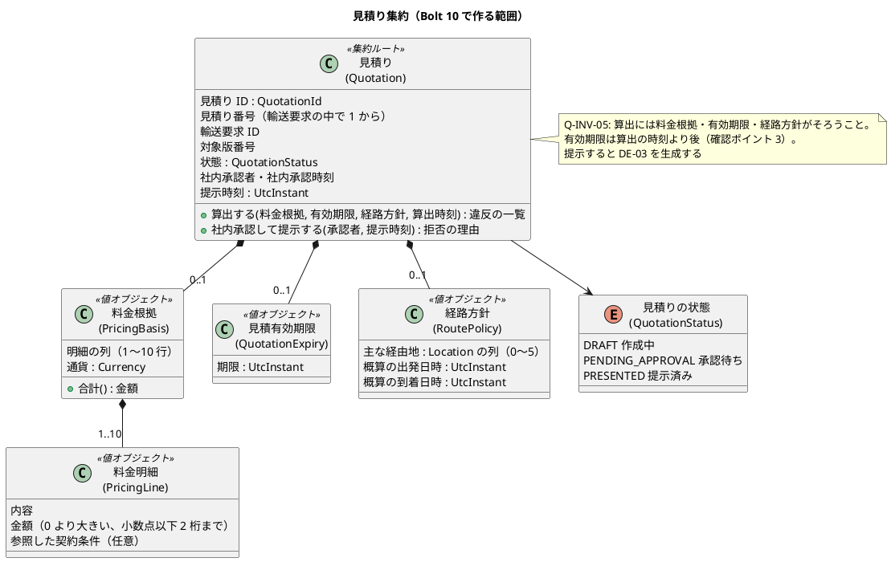
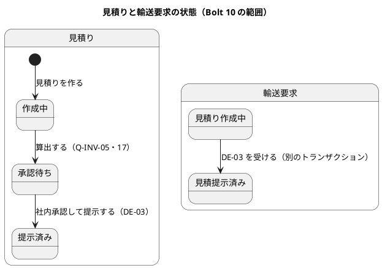
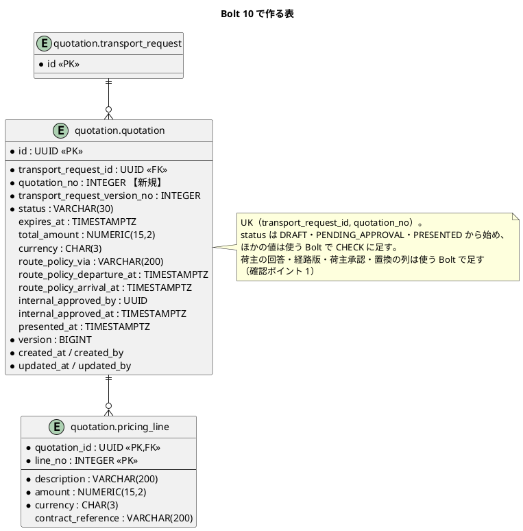
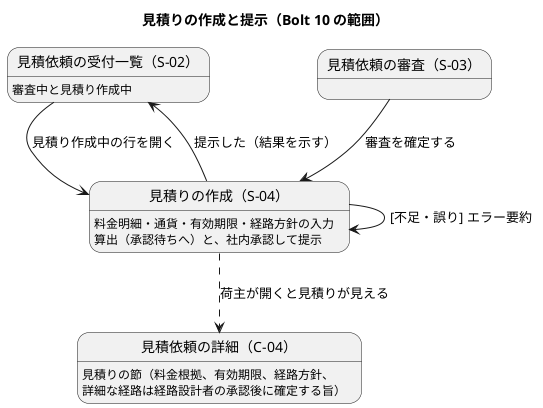

# Bolt 10 計画 - 根拠付き見積りの提示（US-03 AC1〜AC3）

## 基本情報

| 項目 | 内容 |
| :--- | :--- |
| Bolt | 第 10 回 |
| 予定 | W2（2026-10-12 の週。前倒しで 2026-10-05 から）、3〜4 時間 |
| 対象 | U1 輸送要求・見積り。US-03 根拠付き見積りを提示する（AC1〜AC3。AC4・AC5 の失効・置換は Bolt 11） |
| GitHub | [#4 [US-03] 根拠付き見積りを提示する](https://github.com/k2works/practical-domain-driven-design-in-enterpris-application/issues/4)（SP 5）。Bolt 11 の終了報告の承認でクローズする |
| 承認ゲート | U1 の密度。計画の承認、業務のルール（ステップ 2）、スキーマ（ステップ 3）、終了報告（ステップ 4・5 をまとめる）の 4 回 |
| アプローチ | 開発戦略の序盤のアウトサイドイン。業務ルール層の受入シナリオから入り、新しい集約（見積り）は不変条件を単体テストで固めながら内側へ下りる。そのあと表を内側に作り、最後に画面の層を外側から駆動する |
| 前の Bolt | [Bolt 9 終了報告](bolt_09_report.md) |

## Bolt ゴール

営業担当者は、審査を確定した見積依頼に、料金根拠（明細）・有効期限・経路方針を入力して見積りを算出し、社内承認して荷主へ提示できる。料金根拠か有効期限が足りなければ提示できず、足りない項目が示される。荷主は見積依頼の詳細で、料金根拠と、利用者のタイムゾーンと UTC offset を伴う有効期限、経路方針、詳細な経路は経路設計者の承認後に確定する旨を確かめられる。

### 確かめたい仮説

| # | 仮説 | この Bolt で分かること |
| :--- | :--- | :--- |
| H1 | 見積りを輸送要求と別の集約にし、輸送要求の状態（見積提示済み）は DE-03 を受けて別のトランザクションで変えれば、2 つの集約を 1 つのトランザクションで更新せずに済む | 集約の境界（ドメインモデル「見積りを輸送要求の中に入れない理由」）が、コンテキストの中の結果整合で成り立つか |
| H2 | 有効期限を `UtcInstant` で持ち、表示の共通部品（利用者のタイムゾーンと UTC offset）を使えば、AC1 を画面の層の新しい部品なしに満たせる | BR-10 の日時の扱いが、見積りの境界（Bolt 11 の AC4）まで今の部品で通るか |
| H3 | 算出・社内承認・提示を 1 つの集約の状態遷移（作成中 → 承認待ち → 提示済み）として作れば、認証（US-18）の前でも仮の承認者で流れを通せ、後で本人の承認に差し替えられる | 承認者を入れ替えるだけで済む形になっているか |

## ふりかえりと前の Bolt からの引き継ぎ

| 入力 | 内容 | この Bolt での扱い |
| :--- | :--- | :--- |
| 人の決定（2026-10-05、Bolt 10 の開始準備） | US-03 を 2 つの Bolt に分ける。Bolt 10 は提示（AC1〜AC3）、Bolt 11 は失効・置換（AC4・AC5） | 本計画 |
| 人の決定（2026-10-05、W2 の開始準備） | 社内承認の状態（承認待ち）は残し、承認者は認証（US-18）までは設定の仮の営業担当者で記録する。作成者と承認者を分ける職務分離は入れない | ステップ 2・4 |
| Try T-26（Bolt 9） | push した後、次のステップに入る前に CI の結果を確かめる | 全ステップ |
| Try T-27（Bolt 9） | 開始準備でも、最初のコマンドで `date` を実行して開始時刻を残す | 本計画の開始準備（12:47 に開始） |
| Try T-28（Bolt 9。開発戦略に反映済み） | 開発レビューを終了報告の前に行う。省くときは理由を書く | ステップ 5 で `developing-review` を行う |
| Try T-21・T-24・T-25・T-19・T-14 | 画面の層の Red を実行して記録する。時刻は同じコマンドの中の `date`。`passed` 以外を数える。ステップの終わりに `check` を緑にして push | 全ステップ |
| R-38（Bolt 6〜8 レビュー） | Red を確かめたことを履歴に残す | 業務ルール層の Red のシナリオを先にコミットする |
| Bolt 9 の既知の課題 | キー操作のファイルの選択のシナリオが CI で 1 回だけ時間切れになった | 起きたら Playwright の trace を残して調べる |

## スコープ

### 設計の約束（Try T-1）

| 設計の約束 | 出典 | この Bolt |
| :--- | :--- | :--- |
| 見積りは輸送要求と別の集約。見積り ID、輸送要求 ID、対象版番号、状態、料金根拠、有効期限、経路方針、提示時刻を持つ | ドメインモデル「見積りの集約」 | 入れる。荷主の回答・荷主承認・経路版の割当て・置換は入れない |
| 見積りの状態: 作成中 → 承認待ち（算出する）→ 提示済み（社内承認して提示する） | ドメインモデル「見積りの状態遷移」 | 入れる。承認待ちからの差戻し（→ 作成中）は入れない |
| 輸送要求の状態: 見積り作成中 → 見積提示済み（US-03） | ドメインモデル「輸送要求の状態遷移」 | 入れる（確認ポイント 4） |
| Q-INV-05 見積りの算出には料金根拠・有効期限・経路方針が必要。提示した時刻を記録する | ドメインモデル | 入れる |
| 料金根拠は明細の表（`pricing_line`）、有効期限・経路方針は列 | データモデル | 入れる（確認ポイント 1・2） |
| DE-03 見積りを提示した（見積り ID、輸送要求 ID・版番号、有効期限、経路方針、提示時刻） | ドメインモデル「イベント一覧」 | 入れる。KPI 計測（KPI-01 の終了時刻）の購読は US-21（W3）、通知は US-22（R1.0） |
| S-04 見積りの作成（算出、社内承認、提示） | UI 設計 | 入れる（確認ポイント 5） |
| C-04 で見積りを確かめる（AC2）。C-05 見積りへの回答 | UI 設計 | C-04 に見積りの節を入れる。C-05 は US-24 の Bolt |
| 日時表示の共通部品（利用者のタイムゾーンと UTC offset） | UI 設計、BR-10 | 使う（H2） |

### 入れるもの・入れないもの

| 入れる | 入れない（後の Bolt） |
| :--- | :--- |
| 見積りの算出（料金根拠の明細・有効期限・経路方針）と、不足・誤りの検証（AC3） | 見積りの失効（AC4）、置換・再提示・旧版の読み取り専用（AC5）。Bolt 11 |
| 社内承認して提示（仮の承認者）、提示時刻の記録、DE-03 の発行 | 承認待ちからの差戻し、作成者と承認者の職務分離 |
| DE-03 を受けて輸送要求を見積提示済みにする | KPI-01 の終了時刻の記録（US-21）、荷主へのメール（US-22） |
| S-02 に見積り作成中の行、S-03 の審査確定の後に S-04 へ、S-04 の作成と提示 | 見積りの一覧（S-01 の期限間近を含む） |
| C-04 の見積りの節（AC2） | C-05 見積りへの回答（US-24） |
| `quotation`・`pricing_line` の表 | 料金の自動計算（料金規則。後続段階） |

## 設計（この Bolt の範囲）

### ドメインモデル

> 注（設計への反映。ステップ 1 で反映する）: 次は計画を書いた時点でドメインモデルになかった。
>
> - 料金明細（PricingLine）と、料金根拠の明細の数・通貨・合計
> - 見積り番号（輸送要求の中で 1 から。画面と URL には内部の ID の代わりにこれを出す。D-4 と同じ考え方）
> - 算出の検証の不変条件（Q-INV-17: 料金根拠の明細・有効期限・経路方針の形と、有効期限は算出の時刻より後）
> - 見積りを作れるのは、輸送要求が見積り作成中で、対象の版が現在の版のときだけ。1 つの輸送要求に、作成中・承認待ち・提示済みの見積りは 1 つだけ（置換は Bolt 11。Q-INV-18）

### 状態遷移

### データモデル

> 注（設計への反映。ステップ 1 で反映する）: データモデルの `quotation` は `expires_at`・`total_amount`・`currency`・`route_policy_via` を NOT NULL にしている。算出の前（作成中）の見積りを保存するため、これらを NULL 可にし、承認待ち以後は NOT NULL を CHECK で守る。`quotation_no` を足す。どちらもスキーマの変更（確認ポイント 1）。

### 画面遷移

## 開始準備の検証

| 検証 | 見つけたこと | 対応 |
| :--- | :--- | :--- |
| 詳細（ユーザーストーリー） | AC1〜AC3 は「営業担当者が見積りを確定する」。ドメインモデルは算出・社内承認・提示の 3 つ | 確定 = 社内承認して提示とする（W2 の開始準備の人の決定）。ステップ 1 で US-03 の決定に書く |
| 詳細（ドメインモデル） | 料金根拠に属性がない。見積り番号がない。算出の検証の不変条件がない | 上の注。Q-INV-17・18 を足す |
| 詳細（データモデル） | `quotation` の金額・期限・経路方針が NOT NULL で、作成中を保存できない。`quotation_no` がない。`status` の CHECK に Bolt 10 で使わない値が多い | 確認ポイント 1 |
| 詳細（UI 設計） | S-04 の画面イメージと URL がない。S-03 の確定の後は「S-04 ができるまで受付一覧へ戻る（暫定）」 | 確認ポイント 5。ステップ 1 で URL の表と S-03 の行を直す |
| 横断（開発戦略） | 序盤はアウトサイドイン。見積りは新しい集約で不変条件が多い | 受入シナリオから入り、集約は単体テストで固める（Bolt 5 と同じ進め方） |
| 横断（BC の独立性） | 見積りは `quotation` の中。輸送要求と同じコンテキストの別の集約。DE-03 の型は公表された言語のパッケージ（`quotation.domain.events`）に置く | 問題なし |
| 横断（過去の計画との連続性） | 画面に内部の ID を出さない（D-4）。社内の照会は荷主企業で絞らない入力ポートを分ける（Bolt 5 R-10）。日時は利用者のタイムゾーンと UTC offset（Bolt 4） | 見積り番号を使う。社内の見積りの照会は `Staff…` の入力ポートにする（ArchUnit の R-16 の規則が守る） |
| 前の Bolt のレビュー・既知の課題 | Bolt 9 は開発レビューを行っていない（T-28 は Bolt 9 の後に決めた）。既知の課題は上の表のとおり | Bolt 9 の変更は Bolt 6〜8 の指摘の返済で、指摘ごとの対応はレビューに記録した。Bolt 10 のレビューで Bolt 9 の変更も見る |

## 入力

| 成果物 | パス |
| :--- | :--- |
| ユーザーストーリー（US-03、US-02 の決定） | `docs/requirements/cargo-tracker/user_story.md` |
| システムユースケース（UC-03） | `docs/requirements/cargo-tracker/system_usecase.md` |
| ドメインモデル（見積りの集約・状態遷移・Q-INV-05、DE-03） | `docs/design/cargo-tracker/domain_model.md` |
| データモデル（`quotation`、`pricing_line`） | `docs/design/cargo-tracker/data_model.md` |
| UI 設計（S-02・S-03・S-04・C-04、日時表示、エラー要約） | `docs/design/cargo-tracker/ui_design.md` |
| ADR（コンテキスト間の連携、ドメインロジックのパターン） | `docs/adr/cargo-tracker/002-domain-logic-pattern-per-context.md`、`003-inter-context-integration.md` |
| 開発ガイドライン 第 2 章・第 3 章 | `docs/article/02-cargo-domain-model.md`、`docs/article/03-spring-modular-monolith.md` |

## ステップ計画

状態の記号: `[ ]` 未着手、`[-]` 進行中、`[?]` 承認待ち、`[R]` 修正中、`[x]` 完了、`[S]` スキップ。各ステップの終わりに `check` が緑であることを確かめて push し、CI の結果を確かめてから次のステップに入る（T-14、T-26）。

- [x] **1. 決定を設計文書に反映する**（承認はステップ 2 とまとめて受ける）
  - ユーザーストーリー: US-03 の決定（確定 = 社内承認して提示、仮の承認者、料金根拠の明細と通貨、有効期限の入力と境界、経路方針、Bolt 10・11 の分け方）
  - ドメインモデル: 料金明細、見積り番号、Q-INV-17・18、DE-03 の購読（輸送要求の状態）
  - データモデル: `quotation` の NULL 可の列と CHECK、`quotation_no`、`pricing_line`
  - UI 設計: S-04 の画面イメージと URL、S-02 の見積り作成中、S-03 の確定の後の遷移、C-04 の見積りの節
  - 完了の判定: `okf:check` が ERROR 0、`documentationTest` が緑。push する
  - 結果（2026-10-05 13:12〜13:17）: ユーザーストーリー（US-03 の決定）、ドメインモデル（用語に料金根拠の明細と通貨・料金明細・見積り番号、集約の図に見積り番号と料金明細、Q-INV-17・18、DE-03 の購読、見積りの提示の段落）、データモデル（`quotation` の `quotation_no`・NULL 可の列と CHECK・Bolt 10 で作る範囲、`pricing_line` の制約）、UI 設計（S-02・S-03・S-04・C-04 の URL の表、S-04 の画面イメージ）に反映した。`okf:check` ERROR 0、`documentationTest` 緑
- [ ] **2. 見積りの算出と提示（業務ルール層の Red → Green）** 【承認ゲート: 業務のルール（Q-INV-05・17・18）】
  - 業務ルール層の受入シナリオを先に書き、Red をコミットする（`features/quotation/present_quotation.feature`、`@US-03 @must`）
    - 審査を確定した見積依頼に、料金明細 2 行・有効期限・経路方針を入れて算出し、社内承認して提示すると、見積りは提示済みになり、提示時刻と承認者が残り、DE-03 が発行される（AC1）
    - 荷主が見積依頼を照会すると、料金根拠（明細と合計）、有効期限、経路方針、詳細な経路は経路設計者の承認後に確定する旨が示される（AC2）。輸送要求は見積提示済みになる（H1）
    - 料金明細がない・有効期限がない・有効期限が算出の時刻と同じか前、のときは算出できず、足りない項目と誤りがまとめて示される（AC3）
    - 審査中の見積依頼と、すでに見積りのある見積依頼には、見積りを作れない（Q-INV-18）
    - 他社の荷主には見積りは見えない（Q-INV-08）
  - 足りない内側を TDD で作る: `Quotation`、`QuotationId`、`QuotationStatus`、`PricingBasis`、`PricingLine`、`QuotationExpiry`、`RoutePolicy`、`QuotationRepository` とメモリ上の実装、`QuotationCommandService`（作る・算出する・社内承認して提示する）、荷主用と社内用の照会、`QuotationPresented`（DE-03）、DE-03 を受けて輸送要求を見積提示済みにする購読
  - 完了の判定: `check` が緑。push して CI を確かめる。ステップ 1 とあわせて承認を受ける
- [ ] **3. 表（内側の TDD、統合テスト）** 【承認ゲート: スキーマの変更】
  - 統合テスト（PostgreSQL）を先に書く: 見積りと料金明細の保存と読み出し、楽観ロック、UK（輸送要求 ID・見積り番号）、承認待ち以後の NOT NULL の CHECK、`status` の CHECK、DE-03 の配信で輸送要求が見積提示済みになる（別のトランザクション。H1）
  - マイグレーション `V20261005…__create_quotation.sql`（`common`）。H2 のスモークを先に回す（T-15）。表と列に日本語名のコメントを付ける（データモデルの決まり）
  - MyBatis のリポジトリ。見積り番号の採番（輸送要求の中で最大 + 1、同じトランザクション）
  - 完了の判定: `check` が緑。push して CI を確かめる。スキーマの承認を受ける
- [ ] **4. 画面の層（Red → Green）**（承認はステップ 5 とまとめて受ける）
  - 画面の層の受入シナリオを先に書き、`uiTest` で失敗を記録する（T-21。`features/ui/present_quotation_ui.feature`、`@ui @US-03`）
    - 主成功: 営業担当者が S-03 で審査を確定すると S-04 が開き、料金明細・有効期限・経路方針を入れて算出し、社内承認して提示する。荷主が C-04 を開くと見積りの節に料金根拠・有効期限（Asia/Tokyo（UTC+09:00））・経路方針・確定の旨が出る。キー操作だけで行える
    - 画面に固有の条件: 料金明細を空にして算出すると、エラー要約にフォーカスが移り、入力が残る
    - 幅 320 CSS px で横スクロールが出ない。axe-core の違反 0 件
  - S-04（作成・算出・提示）、S-02 の見積り作成中の行、S-03 の確定の後の S-04 への遷移、C-04 の見積りの節
  - 完了の判定: `check` と `uiTest` が緑。push して CI を確かめる
- [ ] **5. 開発レビューと Bolt 終了報告**
  - `developing-review` で Bolt 10 の変更（と Bolt 9 の変更）をレビューし、指摘への対応を決める（T-28）
  - `check`・`uiTest`・CI・SonarQube の品質ゲート（PASS）を確かめる
  - `bolt_10_report.md` を書く（仮説 H1〜H3 の結論、各ステップの開始と完了の時刻、Red の記録）。ステップ 4 の結果をここでまとめて報告する

### 時間の配分と打ち切り

| ステップ | 目安 |
| :--- | :--- |
| 1 | 20 分 |
| 2 | 70 分 |
| 3 | 50 分 |
| 4 | 80 分 |
| 5 | 30 分 |
| 合計 | 250 分 |

4 時間を超えそうなときは、次の順で Bolt 11 に回す。

1. ステップ 4 の幅 320 CSS px のシナリオ
2. S-02 の見積り作成中の行（S-03 の確定の後の遷移だけで S-04 に届く）
3. 経路方針の主な経由地（概算の日程だけを残す）

算出の検証（AC3）、提示時刻と DE-03、C-04 の見積りの節（AC2）、他社に見えないことは削らない。

## 確認ポイント（計画の承認の場でまとめて確認する。Try T-6）

| # | 確認すること | ステップ | 理由 |
| :--- | :--- | :--- | :--- |
| 1 | `quotation` と `pricing_line` の表を新しく作る。`quotation` は Bolt 10 で使う列だけにし、金額・期限・経路方針の列は NULL 可にして、承認待ち以後の NOT NULL を CHECK で守る。`quotation_no`（輸送要求の中で 1 から）と UK を足す。荷主の回答・経路版・荷主承認・置換の列と、`status` のほかの値は、使う Bolt で足す（ALTER） | 1、3 | スキーマの変更。作成中の見積りを保存するため、データモデルの NOT NULL を変える |
| 2 | 料金根拠は明細の表で、1〜10 行。各行は内容（200 文字まで）・金額（0 より大きい、小数点以下 2 桁まで）・参照した契約条件（任意、200 文字まで）。通貨は見積りに 1 つで、USD・EUR・JPY から選ぶ（明細はすべて同じ通貨）。合計は明細の和 | 1、2、4 | 業務のルール。通貨の候補と明細の数は仮の値（業務責任者の確認で見直す） |
| 3 | 有効期限は営業担当者が日本時間の日時で入れ、UTC の時点で保存する。算出の時刻と同じか前なら誤りにする。経路方針は、主な経由地（UN/LOCODE、0〜5 件）と、概算の出発日時・到着日時（必須。到着は出発より後） | 1、2、4 | 業務のルール。AC3 は料金根拠と有効期限の不足だけを挙げるが、Q-INV-05 は経路方針も必要とする |
| 4 | 輸送要求を見積提示済みにするのは、DE-03 を受けた別のトランザクションにする（2 つの集約を 1 つのトランザクションで更新しない。H1）。受け取りは冪等にし、見積り作成中でなければ何もしない。DE-03 の配信は既存の DE-01 と同じ仕組み（Spring Modulith のイベントの記録） | 2、3 | 集約の境界とイベントの扱い（設計判断） |
| 5 | S-04 の URL: 作成 `GET /staff/transport-requests/{業務番号}/quotations/new`・`POST /staff/transport-requests/{業務番号}/quotations`、算出と提示 `GET /staff/transport-requests/{業務番号}/quotations/{見積り番号}`・`POST …/{見積り番号}/calculation`・`POST …/{見積り番号}/presentation`。S-03 で審査を確定したら S-04 の作成へ進む（暫定の受付一覧への戻りをやめる）。作成と算出は 1 つの画面で入力し、送ると算出まで進む（作成中のまま保存する操作は入れない） | 1、4 | 画面の流れと URL |
| 6 | 1 つの輸送要求に、作成中・承認待ち・提示済みの見積りは 1 つだけとする（Q-INV-18）。置換（AC5）は Bolt 11 で入れる | 1、2 | 業務のルール |

決定（2026-10-05、human:kakimomokuri）: 確認ポイント 1〜6 はすべて上の案で決まった。

## AI の仮定

- 見積りの社内承認者と提示時刻は、審査の判断者と同じく設定の仮の営業担当者（`ProvisionalActorProperties`）で記録する。
- 提示時刻は社内承認の時刻と同じとする（社内承認して提示するを 1 つの操作にする）。
- 荷主に見せる料金根拠は、明細の内容・金額・合計・通貨と、参照した契約条件とする。社内承認者は見せない。
- 見積り番号は画面に「TR-2026-0001 見積 1」の形で出す。
- 経路方針の主な経由地は `route_policy_via` に UN/LOCODE をカンマ区切りで入れる（データモデルの VARCHAR(200)）。
- DE-03 の受け取りは、DE-01 の KPI 計測と同じく、配信が失敗しても再配信される（イベントの記録）。

## リスクと対策

| リスク | 影響 | 対策 |
| :--- | :--- | :--- |
| DE-03 の配信が遅れ、提示した直後に荷主の詳細が見積り作成中のまま見える | 荷主が見積りの提示に気づかない | C-04 の見積りの節は見積りの状態（提示済み）から出し、輸送要求の状態に頼らない。統合テストで配信の後に状態が変わることを確かめる |
| 同じ輸送要求に 2 人が同時に見積りを作る | 見積りが 2 つできる（Q-INV-18 の破れ） | UK（輸送要求 ID、見積り番号）と、作成のときの輸送要求の楽観ロックの照合で防ぐ。統合テストで確かめる |
| 金額の丸めと通貨の扱いが業務と違う | 荷主に誤った金額を見せる | 小数点以下 2 桁で、丸めはしない（入力を誤りにする）。通貨の候補と JPY の小数の扱いは、業務責任者の確認で見直す（R1.0 の前） |
| 新しい集約と画面で 4 時間を超える | Bolt が半日を超える | 打ち切りの順を決めた |

## 完了条件

### Definition of Done

- [ ] ステップ 1〜5 が完了し、計画・ステップ 2・ステップ 3・終了報告の承認ゲートを人が通した
- [ ] `./gradlew check` と `./gradlew uiTest` がローカルと CI の両方で緑。各ステップの終わりに push し、CI を確かめた
- [ ] SonarQube の品質ゲートが PASS
- [ ] 業務ルール層で AC1〜AC3 と Q-INV-18・Q-INV-08 のシナリオが緑。画面の層で主成功と画面に固有の条件が緑
- [ ] 確認ポイント 1〜6 の決定が、設計文書から追える
- [ ] 開発レビューを行い、指摘への対応を終了報告に書いた（T-28）
- [ ] `bolt_10_report.md` に仮説 H1〜H3 の結論と、各ステップの時刻と Red の記録を書いた
- [ ] ユーザーマニュアルは更新しない（マニュアルはまだない。認証と主要な画面がそろってから書く）

### デモ項目

| # | デモ | 確かめること |
| :--- | :--- | :--- |
| 1 | `bootRun` で見積依頼を提出し、営業が審査を確定して S-04 で見積りを算出・提示する | S-02 に戻って結果が出る。荷主の C-04 に料金根拠・有効期限（Asia/Tokyo（UTC+09:00））・経路方針・確定の旨が出て、状態が見積提示済みになる |
| 2 | 料金明細を空にして算出する | エラー要約に料金根拠の不足が出て、算出されない |
| 3 | `./gradlew uiTest` | 見積りの画面の層のシナリオが通り、axe-core の違反が 0 件 |

## 更新履歴

| 日付 | 内容 | 作成 | 承認 |
| :--- | :--- | :--- | :--- |
| 2026-10-05 | 初版（人の決定: US-03 を Bolt 10（AC1〜AC3）と Bolt 11（AC4・AC5）に分ける） | anthropic/claude-opus-5-5 | — |
| 2026-10-05 | 計画を承認。確認ポイント 1〜6（表と NULL 可の列、料金根拠の明細と通貨、有効期限と経路方針、DE-03 での状態の更新、S-04 の URL と流れ、見積りは 1 つ）も決まった（Try T-6） | anthropic/claude-opus-5-5 | human:kakimomokuri |

## 関連ドキュメント

- [リリース計画](release_plan.md)（W2）
- [開発戦略](development_strategy.md)（序盤・アウトサイドイン、開発レビュー）
- [Bolt 9 終了報告](bolt_09_report.md)
- [ユーザーストーリー](../../requirements/cargo-tracker/user_story.md)、[ドメインモデル](../../design/cargo-tracker/domain_model.md)、[データモデル](../../design/cargo-tracker/data_model.md)、[UI 設計](../../design/cargo-tracker/ui_design.md)
