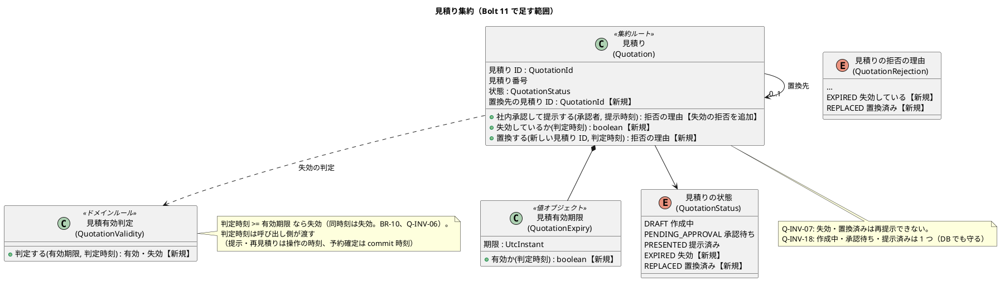
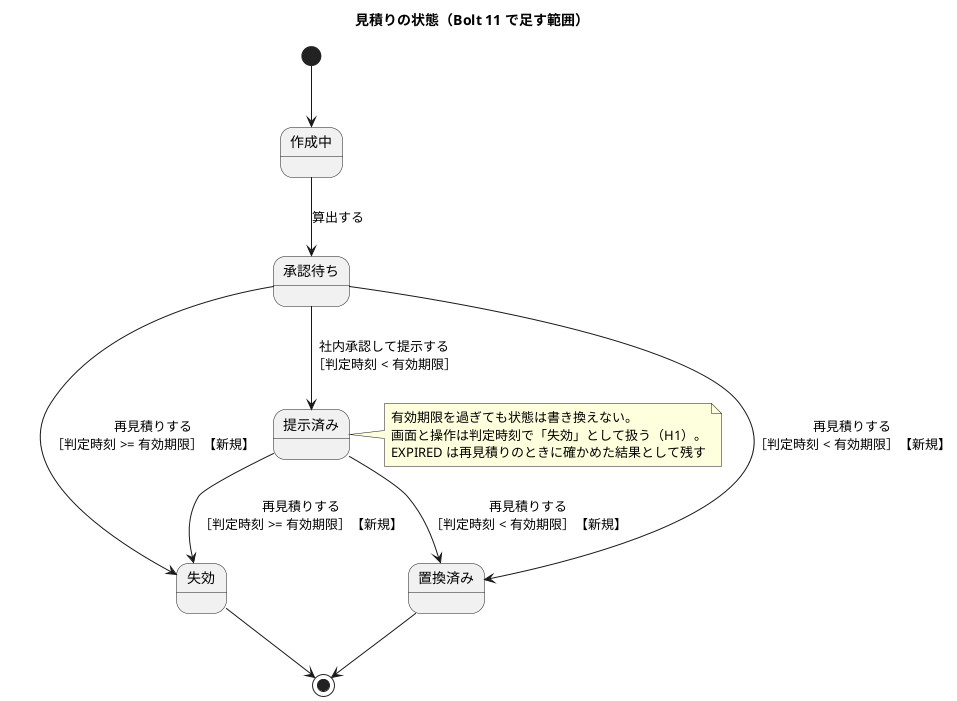
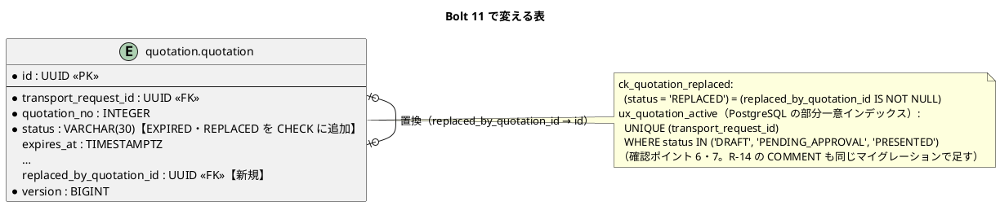
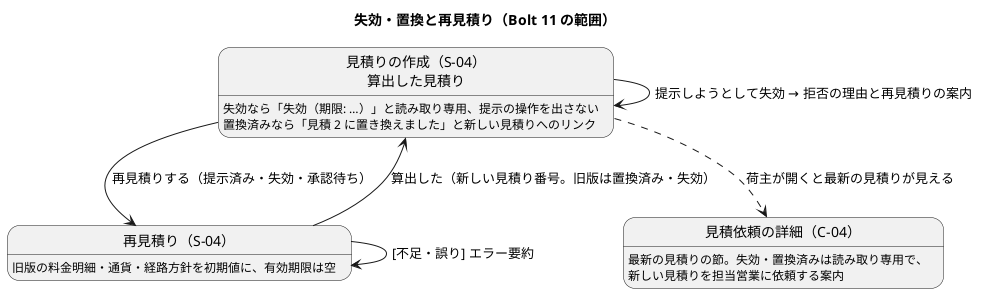

# Bolt 11 計画 - 見積りの失効と置換（US-03 AC4・AC5）

## 基本情報

| 項目 | 内容 |
| :--- | :--- |
| Bolt | 第 11 回 |
| 予定 | W2（2026-10-12 の週。前倒しで 2026-10-05 から）、3〜4 時間 |
| 対象 | U1 輸送要求・見積り。Bolt 9・10 レビューの中・低の指摘の返済と、US-03 根拠付き見積りを提示する（AC4・AC5） |
| GitHub | [#4 [US-03] 根拠付き見積りを提示する](https://github.com/k2works/practical-domain-driven-design-in-enterpris-application/issues/4)（SP 5）。本 Bolt の終了報告の承認でクローズする（確認ポイント 1） |
| 承認ゲート | U1 の密度。計画の承認（確認ポイント 1〜8）、業務のルール（ステップ 2・3）、スキーマ（ステップ 4）、開発レビューの判断、終了報告（ステップ 5・6 をまとめる）の 5 回 |
| アプローチ | 開発戦略の序盤のアウトサイドイン。最初にレビューの指摘を片付け、業務ルール層の受入シナリオから入り、見積りの集約の状態遷移を単体テストで固める。そのあと表を内側に作り、最後に画面の層を外側から駆動する |
| 前の Bolt | [Bolt 10 終了報告](bolt_10_report.md) |

## Bolt ゴール

営業担当者と荷主は、見積りが有効期限を過ぎると失効として扱われ（有効期限と同時刻も失効）、失効した見積りや置換済みの見積りは提示できず、読み取り専用で表示されることを確かめられる。営業担当者は提示済みまたは失効した見積りから再見積りし、新しい見積り番号の見積りを作って旧版を置換済みにできる。荷主には、旧版が読み取り専用であることと、新しい見積りの依頼のしかたが示される。あわせて、Bolt 9・10 レビューの中・低の指摘を片付ける。

### 確かめたい仮説

| # | 仮説 | この Bolt で分かること |
| :--- | :--- | :--- |
| H1 | 失効を状態として書き換えず、判定時刻と有効期限の比較（見積有効判定 `QuotationValidity`。注: ステップ 3 で型を作らず `QuotationExpiry.isValidAt` に置いた）で決めれば（データモデルの方針）、定期処理なしで AC4 の境界（同時刻は失効）と AC5 の拒否を満たせ、予約確定（US-04）も同じ判定を使える | 失効の判定を 1 か所に置けるか。定期処理（DE-19・W10）を待たずに済むか |
| H2 | Q-INV-18（作成中・承認待ち・提示済みの見積りは 1 つ）を PostgreSQL の部分一意インデックスで守れば、置換と失効が入っても、同時の作成・再見積りを DB で止められる | Bolt 9・10 レビューの矛盾事項 1 の結論 |
| H3 | 置換を旧版の状態遷移（置換済みと新しい見積りへの参照）として持てば、旧版を読み取り専用で見せる画面を、照会と表示の追加だけで作れる | 旧版の表示に新しい集約や表が要らないか |

## ふりかえりと前の Bolt からの引き継ぎ

| 入力 | 内容 | この Bolt での扱い |
| :--- | :--- | :--- |
| 人の決定（2026-10-05、Bolt 10 のステップ 5） | Bolt 9・10 レビューの中・低（R-06〜R-10、R-13〜R-24）は Bolt 11 の最初に回す | ステップ 1。R-12 は対応済み。R-13（JPY の整数）は D-34、R-10 の「日付だけ・現地の日付」は D-35 の業務責任者の回答を待ち、この Bolt では扱わない（ヒントだけ足す） |
| Bolt 10 の既知の課題 | Q-INV-18 を DB で守る方法（矛盾事項 1） | 確認ポイント 6、ステップ 4（H2） |
| Bolt 10 の既知の課題 | 業務責任者に確かめる事項（D-28・D-29・D-34〜D-36） | この Bolt では決めない。D-36 のうち「承認待ちのまま有効期限を過ぎた見積りを提示できてよいか」は AC5 にかかわるため、確認ポイント 3 で安全側の仮の決定を置く |
| Try T-29（Bolt 10） | 桁や長さに上限のある列を作るときは、同じ上限を業務の規則として持ち、境界ちょうどと 1 つ超えのテストを書く | ステップ 4。新しい列は UUID と状態の値だけで、長さの上限のある列は作らない。状態の値は CHECK とドメインの enum を合わせる |
| Try T-30（Bolt 10） | テストの件数は `check` の後に全体の結果から数える | 全ステップの結果と終了報告 |
| Try T-31（Bolt 10。開発戦略に反映済み） | デモ項目のシナリオに `@demo` と `@demo-bolt-11/<名前>` の印を付け、終了報告の前に `./gradlew demoVideo` で録画してリンクする | ステップ 5・6 |
| Try T-26・T-27・T-28（Bolt 9） | push の後に CI を確かめる。開始準備でも最初に `date`。開発レビューを終了報告の前に行う | 全ステップ。開始準備は 16:12 JST に開始。ステップ 6 で `developing-review` を行う |
| Try T-21・T-24・T-25・T-19・T-14、R-38 | 画面の層の Red を実行して記録する。時刻は同じコマンドの中の `date`。`passed` 以外を数える。各ステップの終わりに `check` を緑にして push。Red を先にコミットする | 全ステップ |

## スコープ

### 設計の約束（Try T-1）

| 設計の約束 | 出典 | この Bolt |
| :--- | :--- | :--- |
| Q-INV-06 見積りが予約確定に使えるのは、承認済みで、予約確定の commit 時刻が有効期限より前のときだけ。同時刻は失効 | ドメインモデル、BR-10 | 失効の判定（`QuotationValidity`、`QuotationExpiry.有効か(判定時刻)`）を作る。承認済みの状態と予約確定での利用は、US-24（W2〜W3）と US-04（[#10](https://github.com/k2works/practical-domain-driven-design-in-enterpris-application/issues/10)、W4。B-INV-02）で作る（確認ポイント 1） |
| Q-INV-07 失効・置換済みの見積りは再提示・承認・予約確定に使えない。新しい見積りを作る | ドメインモデル、BR-16 | 再提示（社内承認して提示する）の拒否と、再見積りで新しい見積りを作ることを入れる。承認・予約確定の拒否は US-24・US-04 の Bolt |
| 見積りの状態: 提示済み → 置換済み（再見積り）、提示済み → 失効（判定時刻 >= 有効期限） | ドメインモデル「見積りの状態遷移」 | 入れる。詳細設計依頼済み・荷主承認待ち・承認済みからの遷移は US-24 の Bolt |
| 失効は判定時刻と `expires_at` の比較で決め、`EXPIRED` は確認した結果として残す | データモデル「失効」の段落 | 入れる（確認ポイント 2。H1） |
| `quotation.status` の `EXPIRED`・`REPLACED`、`replaced_by_quotation_id`（自己参照の FK） | データモデル | 入れる（確認ポイント 7。注: ステップ 4 で PostgreSQL の遅延の FK に変えた） |
| 失効・置換済みの見積りは読み取り専用で表示し、新しい見積りを依頼する手順を示す | UI 設計（C-05 の段落、業務規則による拒否） | S-04 と C-04 に入れる（確認ポイント 8）。C-05 は US-24 の Bolt |
| 見積りの期限間近（DE-19）、定期処理 | ドメインモデル、UI 設計 | 入れない（US-22・W10） |

### 入れるもの・入れないもの

| 入れる | 入れない（後の Bolt） |
| :--- | :--- |
| Bolt 9・10 レビューの中・低の指摘（R-06〜R-09、R-10 のヒント、R-14〜R-24） | R-13（JPY の整数。D-34）、R-10 の「日付だけ・現地の日付」（D-35） |
| 見積有効判定（同時刻は失効）と、画面の失効の表示 | 予約確定での有効性の判定（US-04、#10）、荷主の承認での判定（US-24） |
| 承認待ち・提示済みの見積りの、失効したときの提示の拒否 | 期限間近の通知と定期の失効の記録（DE-19、W10） |
| 再見積り（置換）: 新しい見積り番号で作り、旧版を置換済み（有効期限を過ぎていれば失効）にする | 条件変更（US-05）による置換、承認済みからの置換（確定後変更） |
| Q-INV-18 を DB で守る（部分一意インデックス）と、同時の再見積りを値で返す | 見積りの一覧（S-01 の期限間近） |
| S-04 の旧版の読み取り専用と再見積り、C-04 の失効・置換済みの表示と依頼の案内 | C-05 見積りへの回答（US-24） |

## 設計（この Bolt の範囲）

### ドメインモデル

> 注（設計への反映。ステップ 2 で反映する）: 次は計画を書いた時点でドメインモデルになかった、または Bolt 11 で決める。
>
> - 承認待ちの見積りも、判定時刻 >= 有効期限なら提示できない（確認ポイント 3。状態遷移に「承認待ち → 失効」を足す）
> - 再見積り（置換）は、旧版の状態遷移と新しい見積りの作成を 1 つのトランザクションで行う（確認ポイント 5。集約のインスタンスをまたぐ例外として理由を書く）
> - Q-INV-18 の「置換は Bolt 11」を、置換と失効の後の規則に書き直す
> - 拒否の理由に「失効している」「置換済み」を足す

### 状態遷移

### データモデル

> 注（設計への反映。ステップ 2 で反映する）: データモデルに Q-INV-18 を守る部分一意インデックスがない。H2 は部分インデックスを作れないため、`postgresql` のマイグレーションに置き、H2 のスモークでは UK（輸送要求 ID、見積り番号）とアプリケーションの確認で守る（`event_publication` と同じく DB ごとのフォルダを使う）。どちらもスキーマの変更（確認ポイント 6・7）。

### 画面遷移

## 開始準備の検証

### 詳細の整合（`validating-iteration-plan`）

| 対象 | 見つけたこと | 対応 |
| :--- | :--- | :--- |
| ユーザーストーリー（US-03 AC4） | 「予約確定に利用する」の利用者（US-04 の予約確定）がまだない。Bolt 11 だけでは AC4 の When を通せない | 確認ポイント 1。失効の判定（境界を含む）を Bolt 11 で作り、予約確定での利用のシナリオは US-04（#10、B-INV-02）の Bolt で書く。US-03 の決定に書く |
| ユーザーストーリー（US-03 AC5） | 「承認」（US-24）と「予約確定」（US-04）の操作がまだない。「再提示」は社内承認して提示する操作で通せる | 確認ポイント 1。再提示の拒否と、読み取り専用の旧版・新しい見積りの作成手順を Bolt 11 で作る |
| ドメインモデル | 見積りの操作に「置換する(新しい見積り ID)」、見積有効期限に「有効か(判定時刻)」、ドメインルールに `QuotationValidity` があるが、コードにはまだない。状態遷移に「承認待ち → 失効」がない。Q-INV-18 に「置換は Bolt 11」とある | 上の注。ステップ 2 で反映する |
| データモデル | `EXPIRED`・`REPLACED`、`replaced_by_quotation_id`、失効の扱い（判定時刻で決める）はある。Q-INV-18 を守るインデックスがない。R-14（承認時刻と提示時刻が同じ）・R-15（作成中はまだ DB に入らない）の記述がない | 確認ポイント 6・7。R-14・R-15 はステップ 1・4 |
| UI 設計 | 失効・置換済みを読み取り専用で示すことは C-05 の段落と「業務規則による拒否」にある。S-04 の再見積りの URL と、C-04 での失効・置換済みの表示がない。S-02 の行の記述が実装と違う（R-21） | 確認ポイント 8。ステップ 2 で URL の表と画面の説明を足す |
| 識別子と命名 | ストーリー ID（US-03）、不変条件（Q-INV-06・07・18）、状態の値（`EXPIRED`・`REPLACED`）、表と列（`quotation.replaced_by_quotation_id`）はデータモデル・ドメインモデルと一致させた | — |

### 横断の整合（`validating-design`）

| 軸 | 見つけたこと | 対応 |
| :--- | :--- | :--- |
| A 開発戦略 | 序盤（W1〜W4）はアウトサイドイン。デモ項目の録画（T-31）と開発レビュー（T-28）は局面を横断する規律 | 受入シナリオから入る。ステップ 5・6 で録画とレビューを行う |
| B 設計トピック | 新しいドメインルール `QuotationValidity` はドメインモデルのドメインルールの表にすでにある。用語集（JIG）の整合テストが新しい型を検査する | 型を足すときに用語集の行も足す |
| C 過去の計画との連続性 | 画面と URL に内部の ID を出さない（D-4。見積り番号を使う）。社内の照会は `Staff…` の入力ポート（Bolt 5 R-10）。業務の拒否は値、壊れた前提は例外（Bolt 4 R-04）。UK 違反はセーブポイントに戻して値で返す（Bolt 10 R-02）。H2 のスモークを先に回す（T-15） | 再見積りの URL は見積り番号で作る。拒否の理由は `QuotationRejection` に足す。部分一意インデックスの違反も R-02 と同じ変換にする。部分インデックスは H2 で作れないため DB ごとのフォルダに置く |
| C BC の独立性 | 見積りの失効・置換は `quotation` の中に閉じる。予約（`booking`）が後で有効性を使うときは、`quotation` の公開 API を通す（この Bolt では作らない） | 問題なし |
| 前の Bolt のレビュー | Bolt 9・10 レビューの中・低が残っている | ステップ 1 |

## 入力

| 成果物 | パス |
| :--- | :--- |
| ユーザーストーリー（US-03 AC4・AC5 と決定） | `docs/requirements/cargo-tracker/user_story.md` |
| ドメインモデル（見積りの状態遷移、Q-INV-06・07・18、`QuotationValidity`） | `docs/design/cargo-tracker/domain_model.md` |
| データモデル（`quotation` の `EXPIRED`・`REPLACED`・`replaced_by_quotation_id`、失効の扱い） | `docs/design/cargo-tracker/data_model.md` |
| UI 設計（S-04・C-04、業務規則による拒否、日時の表示） | `docs/design/cargo-tracker/ui_design.md` |
| Bolt 9・10 開発成果物レビュー（R-06〜R-24、矛盾事項 1） | `docs/review/cargo-tracker/bolt_09-10_review_20261005.md` |
| 開発ガイドライン 第 2 章・第 3 章 | `docs/article/02-cargo-domain-model.md`、`docs/article/03-spring-modular-monolith.md` |

## ステップ計画

状態の記号: `[ ]` 未着手、`[-]` 進行中、`[?]` 承認待ち、`[R]` 修正中、`[x]` 完了、`[S]` スキップ。各ステップの終わりに `check` が緑であることを確かめて push し、CI の結果を確かめてから次のステップに入る（T-14、T-26）。

- [x] **1. Bolt 9・10 レビューの中・低の返済**（承認はステップ 2・3 とまとめて受ける）
  - テスト: R-07（算出と提示の時刻を分ける。シナリオ・`QuotationTest`・統合テスト）、R-08（出し直しの違反で書類を保存しない受入シナリオを戻す）、R-18（テスト名）、R-19（理由の突き合わせ）。直す前に失敗する形にできるもの（R-07）は Red を先にコミットする
  - コード: R-06（DE-03 の受け取りで状態を変えなかったときのログ）、R-16（提示の拒否の文言を理由から決める関数）、R-17（内容の 200 文字を前後の空白を除いて判定。境界のテストから）
  - 画面: R-09（金額の 3 桁区切りのカンマを受け付けて除き、ヒントに書く）、R-10（概算の出発・到着の欄の形式のヒント。日付だけにするかは D-35 の後）、R-20（詳細な経路の説明の言い方）、R-22（経由地がないときは「直行（経由地なし）」）
  - 文書: R-15（データモデルの作成中と NULL 可の列）、R-21（UI 設計の S-02 の行と列名）、R-23（リリース計画の W2 の進捗、Bolt 9 終了報告の期間の終了時刻）。R-14 の COMMENT はステップ 4 のマイグレーションでまとめる。R-24 はステップ 3・5 で守る
  - 完了の判定: `check` と `uiTest` が緑。レビューの「対応結果」に指摘ごとの対応とコミットを書く。push して CI を確かめる
  - 結果（2026-10-05 16:22〜16:35。最後のコミット `b94f6be` の時刻。Bolt 11 レビュー R-05）
    - Red: R-06（ログ 2 件）・R-17（空白を除いた長さ 1 件）のテストと、R-07・R-08・R-18・R-19 のテストを先に書き、3 件だけが失敗することを確かめてコミットした（`296677e`）。画面の R-09・R-10・R-20・R-22 のテストを書き、3 件が失敗することを確かめてコミットした（`a7ed944`）。R-07・R-08 と、区切りの位置の違うカンマの誤りは、今の実装が正しいので最初から通る（テストの強化と、消えたシナリオの復元）
    - Green: R-06・R-09・R-10（ヒントだけ）・R-16・R-17・R-20・R-22 を直した（`92e691a`）。文書の R-15・R-21・R-23 を直した（`874d411`）。R-13 は D-34、R-10 の日付だけは D-35 の回答を待つ。R-14 はステップ 4、R-24 はステップ 3・5
    - 実行中に直した誤り: なし（環境の準備として、JDK 25 を apt で入れ、Gradle をロケール C.UTF-8 で動かした。Maven Central の 429 は取り直した。Playwright 1.63 の Chromium 1243 は `cdn.playwright.dev` が許可されていないため、この環境だけ既存の 1194 で代用した）
    - `check` 緑（`test` 672 件。Bolt 10 の 664 件から +8）、`uiTest` 35 シナリオすべて passed
- [x] **2. 決定を設計文書に反映する**（承認はステップ 3 とまとめて受ける）
  - ユーザーストーリー: US-03 の決定（AC4・AC5 のうち Bolt 11 で作る範囲と、承認・予約確定での利用を US-24・US-04 で確かめること、失効の判定、再見積り）
  - ドメインモデル: 状態遷移（承認待ち → 失効・置換済み）、Q-INV-07・18 の書き直し、拒否の理由、再見積りのトランザクションの例外の理由、`QuotationValidity`
  - データモデル: `ck_quotation_replaced`、`ux_quotation_active`（PostgreSQL）、`EXPIRED` を残す時点
  - UI 設計: S-04 の再見積りの URL と画面イメージ、旧版の読み取り専用、C-04 の失効・置換済みの表示と案内
  - 完了の判定: `okf:check` が ERROR 0、`documentationTest` が緑。push する
  - 結果（2026-10-05 16:35〜16:37）: ユーザーストーリー（US-03 の Bolt 11 の決定）、ドメインモデル（用語の再見積り、状態遷移の承認待ち → 置換済み・失効、Q-INV-07・18、見積りの失効と置換の段落とトランザクションの例外）、データモデル（`EXPIRED`・`REPLACED`、`replaced_by_quotation_id`、`ck_quotation_replaced`、`ux_quotation_active`、`EXPIRED` を残す時点）、UI 設計（S-04 の再見積りの URL と失効・置換済みの表示、C-04 の最新の見積りと旧版）に反映した
- [x] **3. 失効と置換（業務ルール層の Red → Green）** 【承認ゲート: 業務のルール（Q-INV-06 の境界・07・18）】
  - 業務ルール層の受入シナリオを先に書き、Red をコミットする（`features/quotation/expire_and_replace_quotation.feature`、`@US-03 @must`、`@US-03-AC4`・`@US-03-AC5`）
    - 見積有効判定: 判定時刻が有効期限の 1 秒前なら有効、同時刻と 1 秒後なら失効（AC4 の境界。シナリオアウトライン）
    - 承認待ちの見積りを、有効期限と同時刻または後に社内承認して提示しようとすると拒否され、失効と再見積りが必要と示される（AC4・AC5）
    - 提示済みの見積りを再見積りすると、新しい見積り番号の見積り（承認待ち）ができ、旧版は置換済みになって新しい見積りを指す（AC5）
    - 有効期限を過ぎた提示済みの見積りを再見積りすると、旧版は失効として記録される
    - 置換済み・失効の見積りは、社内承認して提示できない（再提示の拒否。AC5）
    - 荷主が見積依頼を照会すると、最新の見積りが示され、旧版は読み取り専用（状態と置換先）で示される（AC5）
    - 1 つの輸送要求に、作成中・承認待ち・提示済みの見積りは 1 つだけ（Q-INV-18）。置換済み・失効の見積りは数えない
  - 足りない内側を TDD で作る: `QuotationExpiry.isValidAt`、`QuotationStatus` の `EXPIRED`・`REPLACED`、`Quotation` の置換と失効の記録と提示の拒否、`QuotationRejection` の理由、`QuotationCommandService` の再見積り（旧版の遷移と新しい見積りの作成を 1 つのトランザクションで）、照会（荷主・社内）の最新と旧版
  - 完了の判定: `check` が緑。push して CI を確かめる。ステップ 1・2 とあわせて承認を受ける
  - 結果（2026-10-05 16:42〜16:48）
    - Red: 受入シナリオ 11 件（`expire_and_replace_quotation.feature`。シナリオアウトラインの 6 例を含む）と、見積りの集約・アプリケーションサービスの単体テストを先に書き、メモリ上の見積りリポジトリに部分一意インデックスと同じ規則を足した。まだない型を呼ぶためのコンパイルの失敗で Red を確かめ、Red のままコミットした（`699d880`。R-38）
    - Green: `QuotationExpiry.isValidAt`（同時刻は失効）、`QuotationStatus` の `EXPIRED`・`REPLACED`、見積りの集約の `isExpiredAt`・`replaceWith`（期限を過ぎていれば失効を記録）・提示の拒否（置換済み・失効・提示の時刻に失効した承認待ち）、`QuotationRejection` の `EXPIRED`・`REPLACED`、`RequoteQuotationCommand`・`RequotationOutcome`・`QuotationCommandService.requote`（旧版の更新を先に、新しい見積りの保存を後に 1 つのトランザクションで）、荷主の照会 `findVisible`（提示した見積りを新しい順に）（`c8ef96a`）
    - 計画からの変更: 失効の判定は `QuotationExpiry.isValidAt` の 1 か所に置き、ルールの型 `QuotationValidity` は作らなかった（同じ判定が 2 か所になるため）。ドメインモデルの「見積有効判定」の行をそれに合わせた。再見積りでは、置換済み・失効の旧版を入力の検証より先に拒否する
    - 実行中に直した誤り: 拒否の文言の `switch` が新しい理由を網羅していない（コンパイラが検出。失効・置換済みの文言を足した）
    - 業務ルール層のシナリオは 69 件すべて passed（Bolt 10 の 57 件から、ステップ 1 の R-08 で +1、この Bolt の 11 件で +11）。`check` 緑（`test` 697 件）。表の列（`replaced_by_quotation_id`）はステップ 4 で足すまで読み出しで空にしている
  - 承認（2026-10-05、human:kakimomokuri）: ステップ 1・2 とあわせて承認された（失効の判定を `QuotationExpiry` に置く変更を含む）
- [x] **4. 表（内側の TDD、統合テスト）** 【承認ゲート: スキーマの変更】
  - 統合テスト（PostgreSQL）を先に書く: 置換済み・失効の保存と読み出し、置換先の FK、`ck_quotation_replaced`、`status` の CHECK、部分一意インデックスで同時の作成・再見積りが止まり値で返る（R-02 と同じ変換）、置換済み・失効は数えない
  - マイグレーション: `common` に状態の値・`replaced_by_quotation_id`・CHECK・COMMENT（R-14 を含む）、`postgresql` に `ux_quotation_active`。H2 のスモークを先に回す（T-15）
  - MyBatis のリポジトリ: 置換先の列、旧版と新しい見積りを同じトランザクションで書く順（旧版の更新を先に）
  - 完了の判定: `check` が緑。push して CI を確かめる。スキーマの承認を受ける
  - 結果（2026-10-05 17:08〜17:14）
    - Red: 統合テスト（置換済みの保存と読み出しと置換先の FK、失効の記録、部分一意インデックスの違反がドメインの例外になる、置換済み・失効は数えない、`ck_quotation_replaced` の 3 例、ない置換先は FK の違反）を先に書いた。同じ輸送要求に有効な見積りを 2 つ保存していた並びのテストは、旧版を置換済みにして保存する形に直した。新しく書いた・直した 9 件だけが失敗することを確かめてコミットした（`fc005f1`）
    - Green: `common` の `V20261005170000__add_quotation_replacement.sql`（`EXPIRED`・`REPLACED`、`replaced_by_quotation_id`、`ck_quotation_replaced`、R-14 の COMMENT）と、`postgresql` の `V20261005170100__add_quotation_active_index_and_replacement_fk.sql`（`ux_quotation_active`、`fk_quotation_replaced_by`）。H2 のスモークを先に回して通した（T-15）。MyBatis の行・マッパー・リポジトリに置換先の列を足した（`0ecf416`）
    - 計画からの変更: 置換先の FK は、ふつうの FK だと再見積りの旧版の更新（新しい見積りの保存より先）で違反になるため、PostgreSQL の遅延の FK（`DEFERRABLE INITIALLY DEFERRED`。コミットの時に確かめる）にした。H2 は遅延の FK を作れないため、部分一意インデックスと同じく `postgresql` のフォルダだけに置いた（確認ポイント 6 と同じ考え方。確認ポイント 7 の形を変えたので、この承認ゲートで確かめてほしい）
    - 実行中に直した誤り: なし（環境: dockerd が待機中に止まっていたため起動し直した）
    - `check` 緑（`test` 705 件。統合テスト +8）
  - 承認（2026-10-05、human:kakimomokuri）: スキーマ（2 つのマイグレーション）と、置換先の FK を PostgreSQL の遅延の FK にした形が承認された
- [x] **5. 画面の層（Red → Green）**（承認はステップ 6 とまとめて受ける）
  - 画面の層の受入シナリオを先に書き、`uiTest` で失敗を記録する（T-21。`features/ui/replace_quotation_ui.feature`、`@ui @US-03`。デモ項目に `@demo @demo-bolt-11/<名前>`）
    - 主成功: 営業担当者が提示済みの見積り（S-04）から再見積りし、旧版の明細を初期値に有効期限を入れて算出する。新しい見積り（見積 2）が承認待ちで開き、旧版（見積 1）は「見積 2 に置き換えました」と読み取り専用で出る。キー操作だけで行える
    - 失効: 有効期限を過ぎた承認待ちの見積りを開くと「失効」と出て提示の操作がなく、再見積りの操作がある
    - 荷主: C-04 で、置換済みの旧版は読み取り専用で、新しい見積りが提示されるまで担当営業に依頼する案内が出る
    - 幅 320 CSS px で横スクロールが出ない。axe-core の違反 0 件
  - S-04 の再見積り（`GET`・`POST …/quotations/{見積り番号}/requotation`）、旧版の読み取り専用と失効の表示、C-04 の失効・置換済みの表示と案内。有効期限のヒント（R-24）の約束を、失効の表示で守る
  - 完了の判定: `check` と `uiTest` が緑。push して CI を確かめる
  - 結果（2026-10-05 17:22〜17:34）
    - Red: 画面の層の受入シナリオ（`replace_quotation_ui.feature`。キー操作だけの再見積りと置換済みの表示・荷主の案内、失効の表示、幅 320 CSS px）と、画面の単体テスト（S-04 の再見積り・失効・置換済み・提示済みの出し分け、C-04 の旧版）を先に書いた。照会 `findAll` がないとコンパイルできないため照会だけを先に足し、実装の前の `uiTest` で新しい 3 件だけ、画面の単体テストで 10 件だけが失敗することを記録し、テストを Red のままコミットした（`43f5e00`。T-21、R-38）。デモ項目の 2 本に `@demo-bolt-11` の印を付けた
    - Green: S-04 の再見積り（`GET`・`POST …/{見積り番号}/requotation`、作成と同じ入力の画面に見出し・送り先・案内を渡す）、算出した見積りの画面の失効の案内と置換先へのリンク、「再見積りする」の出し分け。C-04 の最新の見積りと以前の見積り（読み取り専用）。見積りの表示に表示する時刻での失効の判定を入れ、controller に `Clock` を渡した（`1caeb3d`）
    - 実行中に直した誤り: 画面の単体テストが、有効期限の不足を形式の誤りと思い込んでいた（不足は業務の検証の結果 `Invalid` で返る。テストを直した）
    - 画面の層のシナリオは 38 件すべて passed（Bolt 10 の 35 件から +3）、axe-core の違反 0 件。`check` 緑（`test` 715 件）
- [x] **6. 開発レビューと Bolt 終了報告**
  - `developing-review` で Bolt 11 の変更をレビューし、指摘への対応を決める（T-28）
  - `check`・`uiTest`・CI・SonarQube の品質ゲート（PASS）を確かめる
  - デモ項目のシナリオを `./gradlew demoVideo -PdemoBolt=bolt-11` で録画し、`docs/assets/demo/bolt-11/` に置いて終了報告と開発の索引からリンクする（T-31）
  - `bolt_11_report.md` を書く（仮説 H1〜H3 の結論、各ステップの開始と完了の時刻、Red の記録、テストの件数は全体から数える（T-30））。ステップ 5 の結果をここでまとめて報告する
  - #4 をクローズする（確認ポイント 1）
  - 結果（2026-10-05 17:35〜18:35）: `developing-review` で Bolt 11 の変更をレビューし（[レビュー](../../review/cargo-tracker/bolt_11_review_20261005.md)、`f13bd00`）、人の判断（D-37・D-38・D-40）で高・中の大半・低を直した（Red `522ca88`・`07c4773`、Green `013b3a8`・`8bfa8d5`、文書 `bc930b8`）。SonarQube はこの環境で立ち上げ（終了報告の「環境」）、品質ゲートは 1 回不合格になり（Code Smell 1 件）、直して PASS にした。デモ項目のシナリオ 2 本を `./gradlew demoVideo -PdemoBolt=bolt-11` で録画し、[Bolt 11 終了報告](bolt_11_report.md) と開発の索引からリンクした。`check`・`uiTest`・CI は緑。#4 は終了報告の承認の後にクローズした

### 時間の配分と打ち切り

| ステップ | 目安 |
| :--- | :--- |
| 1 | 45 分 |
| 2 | 15 分 |
| 3 | 60 分 |
| 4 | 35 分 |
| 5 | 60 分 |
| 6 | 35 分 |
| 合計 | 250 分 |

4 時間を超えそうなときは、次の順で次の Bolt に回す。

1. ステップ 5 の幅 320 CSS px のシナリオ
2. ステップ 1 の低の指摘のうち文書だけのもの（R-15、R-21、R-23）
3. 再見積りの初期値（旧版の明細を初期値にせず、空の入力で作る）

失効の判定と境界、再提示の拒否、置換と旧版の読み取り専用、Q-INV-18 の DB での守りは削らない。

## 確認ポイント（計画の承認の場でまとめて確認する。Try T-6）

| # | 確認すること | ステップ | 理由 |
| :--- | :--- | :--- | :--- |
| 1 | AC4・AC5 のうち、予約確定（US-04）と荷主の承認（US-24）での利用の拒否は、その操作を作る Bolt で同じ判定を使って確かめる（US-04 は [#10](https://github.com/k2works/practical-domain-driven-design-in-enterpris-application/issues/10) の B-INV-02、US-24 は Q-INV-10）。Bolt 11 は失効の判定（境界）、再提示の拒否、置換と旧版の読み取り専用、新しい見積りの作成手順を作り、#4 は本 Bolt の終了報告の承認でクローズする | 2、3、6 | 受入条件の範囲。利用する操作がまだない |
| 2 | 失効は状態として書き換えず、判定時刻と有効期限の比較で決める（同時刻は失効）。`EXPIRED` は、再見積りのときに有効期限を過ぎていた旧版にだけ記録する。定期処理での記録は入れない | 2、3 | 業務のルール（データモデルの方針の具体化。H1） |
| 3 | 承認待ちの見積りも、判定時刻 >= 有効期限なら社内承認して提示できない（D-36 の 1 つ。業務責任者の回答までの安全側の仮の決定）。提示しようとすると、失効と再見積りの案内を示す | 2、3、5 | 業務のルール。状態遷移に「承認待ち → 失効」を足す |
| 4 | 再見積りは、承認待ち・提示済み・失効（判定時刻で失効の承認待ち・提示済み）の見積りから始められる。新しい見積りは次の見積り番号で、旧版の料金明細・通貨・経路方針を初期値にし、有効期限は空にする。算出した時点で旧版を置換済み（有効期限を過ぎていれば失効）にし、新しい見積りは承認待ちになる | 2、3、5 | 業務のルール。旧版を新しい見積りの提示まで残す案は、作成中・承認待ちと提示済みが同時に 2 つになり Q-INV-18 が崩れるため採らない |
| 5 | 再見積りでは、旧版の遷移と新しい見積りの作成を 1 つのトランザクションで行う（同じ集約の型の 2 つのインスタンス）。Q-INV-18 がインスタンスをまたぐ規則で、DB の部分一意インデックスで守るため。ドメインモデルに例外として理由を書く | 2、3、4 | 集約とトランザクションの設計判断 |
| 6 | Q-INV-18 を PostgreSQL の部分一意インデックス `ux_quotation_active`（`transport_request_id`、`status` IN 作成中・承認待ち・提示済み）で守る。違反は R-02 と同じく値で返す（「見積りがすでにある」）。H2 は部分インデックスを作れないため `postgresql` のフォルダに置く。代わりの案（輸送要求の行のロック、有効な見積りの列を足して通常の UK）より、宣言的で既存の表を変えない | 4 | スキーマの変更。Bolt 9・10 レビューの矛盾事項 1 |
| 7 | `quotation` の `status` の CHECK に `EXPIRED`・`REPLACED` を足し、`replaced_by_quotation_id`（`quotation.id` への FK、NULL 可）と `ck_quotation_replaced`（置換済みのときだけ値を持つ）を足す。失効の時刻・置換の時刻の列は足さない（監査記録は US-17）。R-14 の COMMENT を同じマイグレーションで足す | 4 | スキーマの変更 |
| 8 | S-04 の再見積りの URL: `GET /staff/transport-requests/{業務番号}/quotations/{見積り番号}/requotation`（初期値の入った入力）・`POST …/requotation`（算出して新しい見積りへ移る）。旧版の S-04 は読み取り専用で、置換済みなら置換先へのリンク、失効なら再見積りの操作を出す。C-04 は最新の見積りの節を出し、置換済み・失効なら読み取り専用の旨と「新しい見積りは担当営業にご依頼ください」の案内を出す（回答の画面は US-24） | 2、5 | 画面の流れと URL、文言 |

決定（2026-10-05、human:kakimomokuri）: 確認ポイント 1〜8 はすべて上の案で決まった。

## AI の仮定

- 判定時刻は、提示と再見積りでは操作の時刻（`Clock`）を使う。画面の失効の表示も、照会した時刻で判定する。
- 置換済みの旧版から、さらに再見積りはできない（置換先から再見積りする）。
- 荷主の C-04 には、提示済み・置換済み・失効の見積りだけを出す（作成中・承認待ちは出さない。Bolt 10 と同じ）。旧版は最新の見積りの下に、見積り番号の降順で読み取り専用で並べる。
- 再見積りは、輸送要求の状態（見積提示済み）を変えない。新しい見積りの提示で DE-03 が出ても、受け取りは冪等で、見積り作成中でなければ何もしない（Bolt 10 の決定のまま）。荷主には C-04 の見積りの節（見積りの状態から出す）で新しい見積りが見える。
- 拒否の文言は、R-16 でまとめた関数に足す。

## リスクと対策

| リスク | 影響 | 対策 |
| :--- | :--- | :--- |
| 失効を判定時刻で決めるため、画面とテストが現在の時刻に依存する | テストが日によって揺れる | 業務ルール層と画面の層は固定の `Clock` と 2099 年の見本を使う（Bolt 10 と同じ）。境界はシナリオアウトラインで 1 秒前・同時刻・1 秒後を書く |
| 部分一意インデックスが H2 にない | ローカルの H2 のスモークでは Q-INV-18 の DB の守りが効かない | 統合テストは PostgreSQL（Testcontainers）で確かめる。H2 はスモークだけに使う（既存の方針） |
| 再見積りで旧版の更新と新しい見積りの挿入の順を誤ると、部分一意インデックスに違反する | 再見積りが失敗する | 旧版の更新を先に書く。統合テストで確かめる |
| 輸送要求の状態（見積提示済み）と、置換して承認待ちになった見積りの食い違い | 社内の受付一覧の見え方が分かりにくい | 受付一覧の表示はこの Bolt では変えない。開発レビューで利用者の視点から確かめる |
| レビューの返済と新しい受入条件で 4 時間を超える | Bolt が半日を超える | 打ち切りの順を決めた |

## 完了条件

### Definition of Done

- [x] ステップ 1〜6 が完了し、計画・ステップ 1〜3・ステップ 4・開発レビューの判断・終了報告の承認ゲートを人が通した
- [x] `./gradlew check` と `./gradlew uiTest` がローカルと CI の両方で緑。各ステップの終わりに push し、CI を確かめた
- [x] SonarQube の品質ゲートが PASS
- [x] 業務ルール層で AC4 の境界（1 秒前・同時刻・1 秒後）、AC5 の再提示の拒否・置換・旧版の読み取り専用、Q-INV-18 のシナリオが緑（`@US-03-AC4`・`@US-03-AC5`）。画面の層で主成功と失効の表示と荷主の案内が緑
- [x] Q-INV-18 の部分一意インデックスを PostgreSQL の統合テストで確かめた
- [x] Bolt 9・10 レビューの中・低の指摘への対応を、レビューの「対応結果」に書いた
- [x] 確認ポイント 1〜8 の決定が、設計文書から追える
- [x] 開発レビューを行い、指摘への対応を終了報告に書いた（T-28）
- [x] デモ項目の動画を撮り、終了報告と開発の索引からリンクした（T-31）
- [x] `bolt_11_report.md` に仮説 H1〜H3 の結論と、各ステップの時刻と Red の記録を書いた
- [x] #4 をクローズした
- [x] ユーザーマニュアルは更新しない（マニュアルはまだない。認証と主要な画面がそろってから書く）

### デモ項目

| # | デモ | 確かめること |
| :--- | :--- | :--- |
| 1 | 提示済みの見積りから再見積りして算出する | 新しい見積り（見積 2）が承認待ちになり、旧版（見積 1）は「見積 2 に置き換えました」と読み取り専用で出る。荷主の C-04 に旧版の読み取り専用と依頼の案内が出る |
| 2 | 有効期限を過ぎた承認待ちの見積りを開く | 「失効」と出て提示の操作がなく、再見積りの操作がある |
| 3 | `./gradlew uiTest` | 見積りの画面の層のシナリオが通り、axe-core の違反が 0 件 |

## 更新履歴

| 日付 | 内容 | 作成 | 承認 |
| :--- | :--- | :--- | :--- |
| 2026-10-05 | 初版（Bolt 10 終了報告の次の Bolt: レビューの中・低の返済と US-03 AC4・AC5） | anthropic/claude-opus-5-5 | — |
| 2026-10-05 | 計画を承認。確認ポイント 1〜8（AC4・AC5 の範囲、失効の判定、承認待ちの失効、再見積り、トランザクション、Q-INV-18 の部分一意インデックス、表の変更、S-04・C-04 の URL と表示）も決まった（Try T-6） | anthropic/claude-opus-5-5 | human:kakimomokuri |
| 2026-10-05 | ステップ 1〜3（レビューの中・低の返済、設計文書への反映、失効と置換の業務のルール）の承認ゲートを通した | anthropic/claude-opus-5-5 | human:kakimomokuri |
| 2026-10-05 | ステップ 4（スキーマ）の承認ゲートを通した（置換先の FK は PostgreSQL の遅延の FK） | anthropic/claude-opus-5-5 | human:kakimomokuri |
| 2026-10-05 | 開発レビューの判断（D-37・D-38・D-40）と、ステップ 5・6 をまとめた終了報告の承認を通し、Bolt を終えた（人の変更依頼 0）。#4 をクローズした | anthropic/claude-opus-5-5 | human:kakimomokuri |

## 関連ドキュメント

- [リリース計画](release_plan.md)（W2）
- [開発戦略](development_strategy.md)（序盤・アウトサイドイン、開発レビュー、デモの動画）
- [Bolt 10 計画](bolt_10_plan.md)、[Bolt 10 終了報告](bolt_10_report.md)
- [Bolt 9・10 開発成果物レビュー](../../review/cargo-tracker/bolt_09-10_review_20261005.md)
- [ユーザーストーリー](../../requirements/cargo-tracker/user_story.md)、[ドメインモデル](../../design/cargo-tracker/domain_model.md)、[データモデル](../../design/cargo-tracker/data_model.md)、[UI 設計](../../design/cargo-tracker/ui_design.md)
