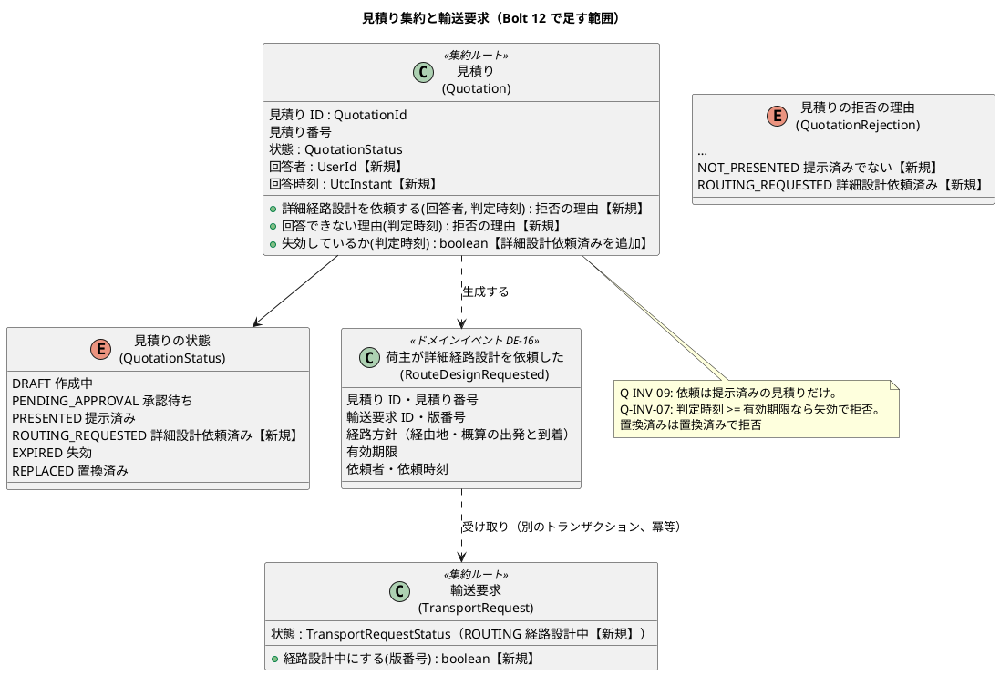
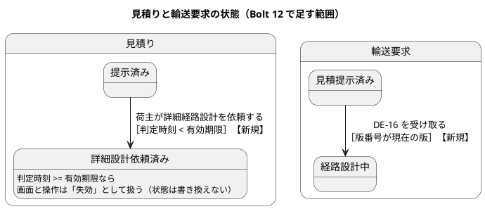
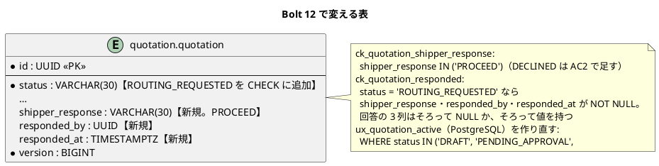
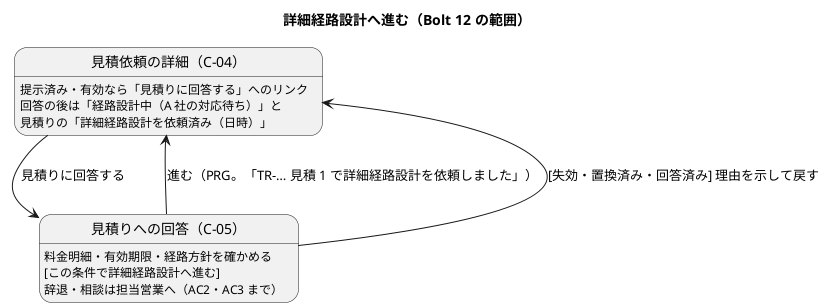

# Bolt 12 計画 - 詳細経路設計へ進む回答（US-24 AC1）

## 基本情報

| 項目 | 内容 |
| :--- | :--- |
| Bolt | 第 12 回 |
| 予定 | W2（2026-10-12 の週。前倒しで 2026-10-06 から）、3〜4 時間 |
| 対象 | U1 輸送要求・見積り。US-24 見積りと経路に回答・承認する（AC1 詳細経路設計へ進む） |
| GitHub | [#5 [US-24] 見積りと経路に回答・承認する（R0.1: AC1・AC4・AC5）](https://github.com/k2works/practical-domain-driven-design-in-enterpris-application/issues/5)（SP 3）。AC4・AC5 は W3 のため、本 Bolt ではクローズせず AC1 のチェックだけを付ける（確認ポイント 1） |
| 承認ゲート | U1 の密度。計画の承認（確認ポイント 1〜9）、業務のルール（ステップ 1・2）、スキーマ（ステップ 3）、開発レビューの判断、終了報告（ステップ 4・5 をまとめる）の 5 回 |
| アプローチ | 開発戦略の序盤のアウトサイドイン。業務ルール層の受入シナリオから入り、見積りの集約の回答の規則と、輸送要求の状態の変更（DE-16 の受け取り）を単体テストで固める。そのあと表を内側に作り、最後に画面の層を外側から駆動する |
| 範囲の決定 | 2026-10-06 に human:kakimomokuri が W2 の残りから US-24 AC1 だけを選んだ。US-18 の一部と TS-01 は後の Bolt |
| 前の Bolt | [Bolt 11 終了報告](bolt_11_report.md) |

## Bolt ゴール

荷主担当者は、提示済みで有効期限内の見積りを C-05 で確かめ、「この条件で詳細経路設計へ進む」と回答できる。回答すると、回答者と回答の時刻が見積りに記録され（詳細設計依頼済み）、経路設計の依頼（DE-16）が発行され、輸送要求は経路設計中になる。失効・置換済み・回答済みの見積りには回答できず、理由が示される。回答の前・最中・後に、荷主（C-04・C-05）と営業（S-02・S-04）がどの画面で何を見て、次に何をするかが分かる（T-32）。

### 確かめたい仮説

| # | 仮説 | この Bolt で分かること |
| :--- | :--- | :--- |
| H1 | 回答を見積りの状態遷移（提示済み → 詳細設計依頼済み）として持ち、輸送要求の経路設計中への変更を DE-16 の受け取り（DE-03 と同じ別のトランザクション・冪等）にすれば、経路設計（U2）のモジュールがなくても AC1 を満たせ、U2 は後で DE-16 を購読するだけで経路設計案件を作れる | 見積りの変更なしに U2 が後から加われるか（R-INV-10 の入口） |
| H2 | 回答できるか（Q-INV-07・09）を集約の「回答できない理由(判定時刻)」に置けば、提示（Bolt 11 R-07）と同じく、画面の操作の出し分けと拒否の判定を 1 か所にできる | 回答の規則が画面とアプリケーション層に散らばらないか |
| H3 | 計画の時点で利用者ごとの前・最中・後の見え方を確認ポイントにすれば（T-32）、開発レビューで利用者の行き止まり・誤解の指摘（Bolt 11 の R-01・R-02 の種類）が高・中で出ない | T-32 の効き目 |

## ふりかえりと前の Bolt からの引き継ぎ

| 入力 | 内容 | この Bolt での扱い |
| :--- | :--- | :--- |
| 人の決定（2026-10-06） | Bolt 12 は US-24 AC1 だけ | スコープ |
| Try T-32（Bolt 11） | 状態を変える操作を計画するときは、操作の前・最中・後に、関係する利用者がどの画面で何を見て次に何をするかを確認ポイントに入れる | 確認ポイント 7・8（下の「利用者の見え方」の表）。H3 |
| Try T-33（Bolt 11） | ステップの結果の時刻は、そのステップの最後のコミットの時刻で書く | 全ステップの結果 |
| Try T-34（Bolt 11。対応済み） | 環境の準備はセッションの開始のフックと手順書 | 準備はフックに任せ、足りなければ手順書を直す |
| Bolt 11 の既知の課題 | 実 DB の 2 つのトランザクションでの同時の再見積り（R-15） | この Bolt では扱わない（範囲の決定）。回答と再見積りの同時の更新は、楽観ロックで拒否することを統合テストで確かめる（確認ポイント 6） |
| Bolt 11 の既知の課題 | US-04 の見積りの有効性の確かめ方（R-19） | 扱わない（US-04 の Bolt の前に ADR） |
| Bolt 11 の既知の課題 | 業務責任者に確かめる事項（[台帳](release_plan.md#業務責任者に確かめる事項の台帳)） | 決めない。D-36-3（有効期限と経路設計にかかる日数）と D-41-3（失効の後の輸送要求の状態）は、詳細設計依頼済みの見積りの失効にかかわるため、確認ポイント 5 で仮の決定を置き、台帳の「影響する文書」に US-24 を足す |
| Try T-26〜T-31、T-21・T-24・T-25・T-19・T-14、R-38 | push の後に CI を確かめる。開始準備でも最初に `date`（09:46 JST）。開発レビューを終了報告の前に行う。件数は全体から数える。デモ項目を録画する。画面の層の Red を実行して記録する。Red を先にコミットする | 全ステップ |

## スコープ

### 設計の約束（Try T-1）

| 設計の約束 | 出典 | この Bolt |
| :--- | :--- | :--- |
| 見積りの状態: 提示済み → 詳細設計依頼済み（荷主が詳細経路設計を依頼する） | ドメインモデル「見積りの状態遷移」 | 入れる |
| 輸送要求の状態: 見積提示済み → 経路設計中（荷主が詳細経路設計を依頼した） | ドメインモデル「輸送要求の状態遷移」 | 入れる（DE-16 の受け取り。確認ポイント 3） |
| Q-INV-09 詳細経路設計の依頼は、提示済みの見積りに対してだけ行える | ドメインモデル | 入れる。辞退（理由と失効）は AC2（W9） |
| Q-INV-07 失効・置換済みの見積りは使えない | ドメインモデル、BR-16 | 回答でも拒否する（確認ポイント 2） |
| Q-INV-08 自社の輸送要求だけを操作できる | ドメインモデル | 回答も荷主企業で絞った照会を通す |
| Q-INV-18 作成中・承認待ち・提示済みの見積りは 1 つ | ドメインモデル | 詳細設計依頼済みも数える（確認ポイント 4。部分一意インデックスを作り直す） |
| DE-16 荷主が詳細経路設計を依頼した（見積り → 経路設計） | ドメインモデル「ドメインイベント」 | 発行する。経路設計の購読（経路設計案件。R-INV-10）は US-06 の Bolt（確認ポイント 3） |
| `quotation.status` の `ROUTING_REQUESTED`、`shipper_response`・`responded_by`・`responded_at` | データモデル | 入れる（確認ポイント 6）。`decline_reason` は AC2 |
| `transport_request.status` の `ROUTING` | データモデル | CHECK にすでにある。表は変えない |
| C-05 見積りへの回答（進む・辞退・相談） | UI 設計 | 「進む」だけを入れる。辞退・相談は AC2・AC3（W9）。画面に「辞退・相談は担当営業にご連絡ください」と書く（確認ポイント 7） |
| 経路設計者の S-05（経路設計案件一覧） | UI 設計 | 入れない（US-06、W3） |

### 入れるもの・入れないもの

| 入れる | 入れない（後の Bolt） |
| :--- | :--- |
| 詳細経路設計へ進む回答（見積りの状態遷移、回答者・回答時刻、DE-16） | 辞退（AC2）・相談（AC3）。W9 |
| 回答の拒否（失効・置換済み・提示済みでない・回答済み） | 荷主の承認（AC4・AC5）と C-17。W3 |
| 輸送要求を経路設計中にする（DE-16 の受け取り、冪等） | 経路設計案件の作成（DE-16 の経路設計の購読、R-INV-10）。US-06 |
| 詳細設計依頼済みの見積りの失効の判定と表示 | 詳細設計依頼済みからの再見積り・置換（条件変更・再見積り。確認ポイント 5） |
| C-05、C-04・C-02 の経路設計中の表示、S-02 の経路設計中の表、S-04 の詳細設計依頼済みの表示 | 荷主への回答の通知（US-22）、KPI の時刻（US-21） |

## 設計（この Bolt の範囲）

### ドメインモデル

> 注（設計への反映。ステップ 1 で反映する）:
>
> - DE-16 の項目に有効期限を足し、「経路条件」は経路設計が見積りの公開 API から読む（US-06 で決める）と書く（確認ポイント 3）
> - Q-INV-18 に詳細設計依頼済みを足す（確認ポイント 4）
> - 詳細設計依頼済みの見積りの失効と、Bolt 12 では再見積りできないことを書く（確認ポイント 5）
> - 拒否の理由に「提示済みでない」「詳細設計依頼済み」を足す

### 状態遷移

### データモデル

> 注（設計への反映。ステップ 1 で反映する）: データモデルの `quotation` の段落に、Bolt 12 で足す値・列・CHECK と、部分一意インデックスの作り直しを書く。`transport_request` は変えない（`ROUTING` は CHECK にある）。

### 画面遷移

URL（確認ポイント 7）: `GET /customer/transport-requests/{業務番号}/quotations/{見積り番号}/response`（C-05）、`POST …/response`（詳細経路設計へ進む。PRG で C-04 へ）。

### 利用者の見え方（T-32）

| 時点 | 荷主（C-04・C-05） | 営業（S-02・S-04） |
| :--- | :--- | :--- |
| 回答の前（提示済み・有効） | C-04 に見積りと「見積りに回答する」。C-05 で確かめて進む | S-02 の見積提示済みの表に行がある。S-04 は提示済みで再見積りできる |
| 回答の前（失効・置換済み） | C-04 は Bolt 11 のまま（読み取り専用と案内）。回答の入口は出さない。C-05 を直接開くと理由を示して C-04 に戻す | Bolt 11 のまま |
| 回答の直後（DE-16 の受け取りの前） | C-04 の見積りの節は見積りの状態から出すので「詳細経路設計を依頼済み」が出て、回答の入口は消える。進み具合は数秒「見積提示済み」のことがある | S-02 の見積提示済みの表に、最新の見積りの状態「詳細設計依頼済み」で出る |
| 回答の後（経路設計中） | C-02・C-04 に「経路設計中（A 社の対応待ち）」。次の操作はない（経路の承認は W3 の C-17）。案内「経路設計者が詳細な経路を設計しています。承認の準備ができたらお知らせします」 | S-02 に「経路設計中」の表（業務番号・見積り番号・依頼時刻・有効期限）。S-04 は「詳細設計依頼済み（依頼者・日時）」と読み取り専用で、提示・再見積りの操作を出さない |
| 経路設計中に有効期限を過ぎた | C-04 の見積りに失効の案内（Bolt 11 と同じ文言）。経路設計中のまま | S-04 に失効と表示。再見積りの操作は出さない（確認ポイント 5） |

## 開始準備の検証

### 詳細の整合（`validating-iteration-plan`）

| 対象 | 見つけたこと | 対応 |
| :--- | :--- | :--- |
| ユーザーストーリー（US-24 AC1） | 「経路設計の依頼が記録され」の記録先が、見積り（詳細設計依頼済み・回答者・回答時刻と DE-16）か経路設計案件（U2）か書かれていない | 確認ポイント 3。見積りの記録と DE-16 で満たし、経路設計案件は US-06 で DE-16 から作る。US-24 の決定に書く |
| ドメインモデル | 状態遷移・Q-INV-09・DE-16 はある。DE-16 の項目の「経路条件」の出どころ、Q-INV-18 の詳細設計依頼済み、詳細設計依頼済みの失効と再見積りの扱い、回答の拒否の理由がない | 上の注。ステップ 1 |
| データモデル | `ROUTING_REQUESTED`・`shipper_response`・`responded_by`・`responded_at` はある。`ux_quotation_active` が詳細設計依頼済みを数えない。回答の列の CHECK がない | 確認ポイント 4・6。ステップ 1・3 |
| UI 設計 | C-05 の画面イメージはあるが URL がない。経路設計中の荷主の表示（進み具合の表）、S-02 の経路設計中、S-04 の詳細設計依頼済みがない。C-04 の仮の案内（「次の更新で画面からできるようになります」）を置き換える | 確認ポイント 7・8。ステップ 1 |
| 識別子と命名 | ストーリー ID（US-24）、不変条件（Q-INV-07・08・09・18）、イベント（DE-16）、状態の値（`ROUTING_REQUESTED`・`ROUTING`）、列（`shipper_response`・`responded_by`・`responded_at`）はデータモデル・ドメインモデルと一致させた。イベントの型名は `RouteDesignRequested`（DE-03 の `QuotationPresented` と同じく過去分詞） | — |

### 横断の整合（`validating-design`）

| 軸 | 見つけたこと | 対応 |
| :--- | :--- | :--- |
| A 開発戦略 | 序盤（W1〜W4）はアウトサイドイン。デモ項目の録画（T-31）と開発レビュー（T-28）は局面を横断する規律 | 受入シナリオから入る。ステップ 5 で録画とレビュー |
| B 設計トピック | 新しいドメインイベント（DE-16）と状態の値。用語集（JIG）の整合テストが新しい型を検査する | 型を足すときに用語集の行も足す |
| C 過去の計画との連続性 | 画面と URL に内部の ID を出さない（D-4）。荷主の照会は荷主企業で絞る（Bolt 4 R-02）。業務の拒否は値（Bolt 4 R-04）。操作の出し分けは集約の問い合わせ（Bolt 11 R-07）。イベントの受け取りは冪等で、変えなかったときは警告のログ（Bolt 9・10 R-06）。部分インデックスは `postgresql` のフォルダ（Bolt 11）。認証までは仮の主体（`ProvisionalActorProperties`） | すべて踏襲する。回答者は仮の荷主の利用者 |
| C BC の独立性 | DE-16 は `quotation` の公開のイベントで、ドメインの型を持たない（DE-03 と同じ）。経路設計（`routing`）はまだなく、後で DE-16 を購読する。`quotation` は `routing` に依存しない | 問題なし |
| 前の Bolt のレビュー | Bolt 11 レビューの残りは R-15（Bolt 12 以降）・R-19（US-04 の前） | 範囲の決定で扱わない。終了報告の既知の課題に残す |

## 入力

| 成果物 | パス |
| :--- | :--- |
| ユーザーストーリー（US-24 AC1） | `docs/requirements/cargo-tracker/user_story.md` |
| ドメインモデル（見積り・輸送要求の状態遷移、Q-INV-07・09・18、DE-16、R-INV-10） | `docs/design/cargo-tracker/domain_model.md` |
| データモデル（`quotation` の回答の列、`transport_request` の `ROUTING`） | `docs/design/cargo-tracker/data_model.md` |
| UI 設計（C-04・C-05、荷主の進み具合、S-02・S-04） | `docs/design/cargo-tracker/ui_design.md` |
| Bolt 11 終了報告・レビュー | `docs/development/cargo-tracker/bolt_11_report.md`、`docs/review/cargo-tracker/bolt_11_review_20261005.md` |
| 開発ガイドライン 第 2 章・第 3 章 | `docs/article/02-cargo-domain-model.md`、`docs/article/03-spring-modular-monolith.md` |

## ステップ計画

状態の記号: `[ ]` 未着手、`[-]` 進行中、`[?]` 承認待ち、`[R]` 修正中、`[x]` 完了、`[S]` スキップ。各ステップの終わりに `check` が緑であることを確かめて push し、CI の結果を確かめてから次のステップに入る（T-14、T-26）。結果の時刻はそのステップの最後のコミットの時刻で書く（T-33）。

- [x] **1. 決定を設計文書に反映する**（承認はステップ 2 とまとめて受ける）
  - ユーザーストーリー: US-24 の Bolt 12 の決定（AC1 の記録先と DE-16、AC2〜AC5 の扱い）
  - ドメインモデル: 状態遷移の注、Q-INV-09・18、DE-16 の項目、詳細設計依頼済みの失効と再見積り、拒否の理由、回答の段落
  - データモデル: `quotation` の Bolt 12 の値・列・CHECK、`ux_quotation_active` の作り直し
  - UI 設計: C-05 の URL と Bolt 12 の範囲、C-04 の回答の入口と経路設計中の案内、荷主の進み具合の表に経路設計中、S-02 の経路設計中の表、S-04 の詳細設計依頼済み
  - リリース計画の台帳: D-36-3・D-41-3 の「影響する文書」に US-24 を足す
  - 完了の判定: `okf:check` が ERROR 0、`documentationTest` が緑。push する
  - 結果（2026-10-06 10:07〜10:09。最後のコミット `0f768b7` の時刻）: ユーザーストーリー（US-24 の Bolt 12 の決定）、ドメインモデル（Q-INV-09・18、荷主の回答の段落、DE-16 の項目と購読者）、データモデル（`quotation` の Bolt 12 の値・列・CHECK、`ux_quotation_active` の作り直し）、UI 設計（C-04 の回答の入口、C-05 の URL と範囲、S-02 の経路設計中の表、S-04 の詳細設計依頼済み、荷主の進み具合の経路設計中）に反映した。台帳の D-36-3・D-41-3 は開始準備で足した。`okf:check` ERROR 0、`documentationTest` 緑
- [?] **2. 回答の業務のルール（業務ルール層の Red → Green）** 【承認ゲート: 業務のルール（Q-INV-07・09・18、DE-16）】
  - 業務ルール層の受入シナリオを先に書き、Red をコミットする（`features/quotation/request_route_design.feature`、`@US-24 @must @US-24-AC1`）
    - 提示済みで有効な見積りに、荷主担当者が詳細経路設計へ進むと回答すると、見積りは詳細設計依頼済みになり回答者と回答時刻が記録され、DE-16 が発行され、輸送要求は経路設計中になる（AC1）
    - 回答の時刻が有効期限の 1 秒前なら進める。同時刻と 1 秒後は失効で拒否される（シナリオアウトライン。Q-INV-07）
    - 置換済みの見積り、承認待ちの見積り、回答済みの見積りには回答できず、理由が示される（Q-INV-09）
    - 他社の輸送要求の見積りには回答できない（見つからない扱い。Q-INV-08）
    - DE-16 が再配信されても輸送要求は経路設計中のままで、ほかの状態の輸送要求は変えない（冪等）
    - 詳細設計依頼済みの見積りがある輸送要求には、新しい見積りを作れない（Q-INV-18）
  - 足りない内側を TDD で作る: `QuotationStatus.ROUTING_REQUESTED`、`Quotation.requestRouteDesign`・`responseRejectionAt`・`isExpiredAt`・`isActive`・`requoteRejection`、`QuotationRejection` の理由、`RouteDesignRequested`（DE-16）、`TransportRequestStatus.ROUTING`・`TransportRequest.markRoutingRequested`、`RouteDesignRequestedEventHandler`、`QuotationCommandService.requestRouteDesign`（荷主企業で絞る）
  - 完了の判定: `check` が緑。push して CI を確かめる。ステップ 1 とあわせて承認を受ける
  - 結果（2026-10-06 10:09〜10:17。最後のコミット `0515eb1` の時刻）
    - Red: 業務ルール層の受入シナリオ 10 件（`request_route_design.feature`。シナリオアウトラインの 3 例を含む）と、見積りの集約・輸送要求・DE-16 の受け取り・荷主の回答の入力ポートの単体テストを先に書いた。まだない型を呼ぶためのコンパイルの失敗で Red を確かめ、Red のままコミットした（`4188c9b`。CI を赤にしないよう push は Green と一緒にした）。再配信のステップ（直前に配信したイベントをもう一度配信する）をテスト用の配信に足した
    - Green: `QuotationStatus.ROUTING_REQUESTED`、`QuotationRejection` の `NOT_PRESENTED`・`ROUTING_REQUESTED`、見積りの集約の `requestRouteDesign`・`responseRejectionAt`・回答者と回答時刻、`isExpiredAt`・`isActive`・`requoteRejection` の詳細設計依頼済み、`RouteDesignRequested`（DE-16）、`TransportRequestStatus.ROUTING`・`markRoutingRequested`、`RouteDesignRequestedEventHandler`、荷主の回答の入力ポート `QuotationResponseService`（`RequestRouteDesignCommand`・`RouteDesignRequestOutcome`）。画面の状態の表示名と拒否の文言は、網羅のために値だけ足した（画面はステップ 4）（`0515eb1`）
    - 計画からの変更: 承認待ちの見積りへの回答は、理由を示す代わりに「見つからない」にした。荷主に提示していない見積りは荷主に見えないため（Bolt 10 の照会の規則と同じ。提示前に置き換えた見積りも同じ）。集約は理由「提示済みでない」を返し、入力ポートが荷主に見えるかで先に絞る。DE-16 は DE-03 より先に届いても輸送要求を経路設計中にする（見積り作成中からも変える）。遅れて届いた DE-03 では戻らない
    - 実行中に直した誤り: 書式の検査（spotless）で 1 回止まった（整形をかけ直した）。業務ルール層のテストの「古い版」の単体テストは今の状態遷移で作れない場面だったため外した
    - 業務ルール層のシナリオはすべて passed（+10）。`check` 緑（`test` 765 件。Bolt 11 の 737 件から +28）。回答の列（`shipper_response` ほか）はステップ 3 で足すまで、読み出しで空にしている
- [?] **3. 表（内側の TDD、統合テスト）** 【承認ゲート: スキーマの変更】
  - 統合テスト（PostgreSQL）を先に書く: 詳細設計依頼済みの保存と読み出し、回答の列の CHECK（そろって NULL・そろって値、詳細設計依頼済みなら必須）、部分一意インデックスが詳細設計依頼済みを数える、回答と再見積りの同時の更新が楽観ロックで拒否される、輸送要求の `ROUTING` の保存
  - マイグレーション: `common` に状態の値・回答の 3 列・CHECK・COMMENT、`postgresql` に `ux_quotation_active` の作り直し。H2 のスモークを先に回す（T-15）
  - MyBatis のリポジトリ: 回答の列、S-02 の経路設計中の読み取りモデル
  - 完了の判定: `check` が緑。push して CI を確かめる。スキーマの承認を受ける
  - 結果（2026-10-06 10:17〜10:21。最後のコミット `48e31d4` の時刻）
    - Red: 統合テスト（詳細設計依頼済みの回答者・回答時刻と `shipper_response` の保存と読み出し、部分一意インデックスが詳細設計依頼済みを数える、回答の列の CHECK の 3 例、回答と再見積りの同時の更新が楽観ロックで止まる、経路設計中の一覧と輸送要求の `ROUTING` の保存）を先に書いた。読み取りモデルの型 `RoutingRequestedSummary` とリポジトリの口（空を返す）だけを先に足し、新しく書いた 7 件だけが失敗することを確かめてコミットした（`83ae352`）
    - Green: `common` の `V20261006100000__add_quotation_shipper_response.sql`（`ROUTING_REQUESTED`、回答の 3 列、`ck_quotation_shipper_response`、`ck_quotation_responded`、COMMENT）と、`postgresql` の `V20261006100100__add_routing_requested_to_quotation_active_index.sql`（`ux_quotation_active` を作り直す）。H2 のスモークを先に回して通した（T-15）。MyBatis の行・マッパー・リポジトリに回答の列と経路設計中の一覧（`selectRoutingRequested`）を足した。`shipper_response` は、回答者があれば `PROCEED` と書く（辞退は AC2 で集約に回答の種類を足す）（`48e31d4`）
    - 実行中に直した誤り: 復元のメソッドの分岐が checkstyle の上限（11 > 10）を超えた（null を扱う小さな関数に分けた）
    - `check` 緑（`test` 772 件。統合テスト +7）
- [x] **4. 画面の層（Red → Green）**（承認はステップ 5 とまとめて受ける）
  - 画面の層の受入シナリオを先に書き、`uiTest` で失敗を記録する（T-21。`features/ui/request_route_design_ui.feature`、`@ui @US-24`。デモ項目に `@demo @demo-bolt-12/<名前>`）
    - 主成功: 荷主が C-04 から「見積りに回答する」で C-05 を開き、キー操作だけで「この条件で詳細経路設計へ進む」を選ぶ。C-04 に結果と「経路設計中（A 社の対応待ち）」、見積りの「詳細経路設計を依頼済み」が出て、回答の入口がない。営業の S-02 の経路設計中の表に出て、S-04 は読み取り専用
    - 失効: 有効期限を過ぎた提示済みの見積りの C-05 を開くと、理由を示して C-04 に戻り、回答の入口がない
    - 幅 320 CSS px で横スクロールが出ない。axe-core の違反 0 件
  - C-05（`GET`・`POST …/quotations/{見積り番号}/response`）、C-04 の回答の入口と仮の案内の置き換え、C-02・C-04 の経路設計中の表示、S-02 の経路設計中の表、S-04 の詳細設計依頼済みの表示
  - 完了の判定: `check` と `uiTest` が緑。push して CI を確かめる
  - 結果（2026-10-06 10:22〜10:33。最後のコミット `303c7a9` の時刻）
    - Red: 画面の層の受入シナリオ（`request_route_design_ui.feature`。キー操作だけの回答と経路設計中・S-02・S-04、失効した見積りへの回答、幅 320 CSS px）と、画面の単体テスト（C-05 の表示・拒否・依頼、C-04 の回答の入口と依頼済み、S-02 の経路設計中の表、S-04 の詳細設計依頼済み）を先に書いた。テストのコンパイルのため、社内の照会 `findRoutingRequestedSummaries` と中身のない C-05 の controller だけを先に足し、実装の前の `uiTest` で新しい 3 件だけ、画面の単体テストで 8 件だけが失敗することを記録し、テストを Red のままコミットした（`dae86f9`。T-21、R-38）。デモ項目の 2 本に `@demo-bolt-12` の印を付けた
    - Green: C-05（`QuotationResponseController`、`response.html`。荷主企業で絞り、回答できない見積りは C-04 に戻して荷主向けの言葉で理由を示す）、C-04 の「見積りに回答する」と依頼した日時、荷主の進み具合の経路設計中と案内、S-02 の経路設計中の表、S-04 の詳細設計依頼済みの案内（失効していれば、依頼済みのため再見積りできない旨）。見積りの表示に回答できるか・詳細設計依頼済みか・回答時刻を足した（`303c7a9`）
    - 計画からの変更: S-04 の「依頼者」は名前を出さず、依頼した日時だけを示した（利用者の名前を引く手段が、利用者の管理（US-16・US-18）までない）
    - 実行中に直した誤り: Bolt 11 の C-04 の単体テストが仮の案内の文言を期待していた（「見積りに回答する」のリンクを期待する形に直した）。画面の層のステップが依頼の案内の文言を実装と違えて期待していた（実装の文言に合わせた）
    - 画面の層のシナリオは 41 件すべて passed（Bolt 11 の 38 件から +3）、axe-core の違反 0 件。`check` 緑（`test` 780 件。+8）
- [ ] **5. 開発レビューと Bolt 終了報告**
  - `developing-review` で Bolt 12 の変更をレビューし、指摘への対応を決める（T-28）。H3 の判定に、利用者の見え方の指摘の数と重さを数える
  - `check`・`uiTest`・CI・SonarQube の品質ゲート（PASS）を確かめる
  - デモ項目のシナリオを `./gradlew demoVideo -PdemoBolt=bolt-12` で録画し、`docs/assets/demo/bolt-12/` に置いて終了報告と開発の索引からリンクする（T-31）
  - `bolt_12_report.md` を書く（仮説 H1〜H3 の結論、各ステップの時刻と Red の記録、テストの件数は全体から数える（T-30））
  - #5 の AC1 にチェックを付け、AC1 のコミットと終了報告をコメントする（確認ポイント 1）

### 時間の配分と打ち切り

| ステップ | 目安 |
| :--- | :--- |
| 1 | 20 分 |
| 2 | 60 分 |
| 3 | 35 分 |
| 4 | 60 分 |
| 5 | 50 分 |
| 合計 | 225 分 |

4 時間を超えそうなときは、次の順で次の Bolt に回す。

1. ステップ 4 の幅 320 CSS px のシナリオ
2. S-02 の経路設計中の表（S-04 の読み取り専用だけ残す）
3. 回答と再見積りの同時の更新の統合テスト

回答の規則（Q-INV-07・09）、DE-16 と輸送要求の経路設計中、Q-INV-18 のインデックスの作り直し、C-05 と C-04 の表示は削らない。

## 確認ポイント（計画の承認の場でまとめて確認する。Try T-6）

| # | 確認すること | ステップ | 理由 |
| :--- | :--- | :--- | :--- |
| 1 | Bolt 12 は AC1 だけを作る。#5（AC1・AC4・AC5）はクローズせず、AC1 にチェックを付ける。AC4・AC5 は W3（経路の確定の後）、AC2・AC3 は W9 | 1、5 | 受入条件の範囲 |
| 2 | 回答（詳細経路設計へ進む）は、提示済みで、回答の時刻 < 有効期限の見積りだけに行える。同時刻は失効で拒否する（Q-INV-07 を回答にも当てる）。拒否の理由は、置換済み・失効・提示済みでない（承認待ちなど）・詳細設計依頼済み（回答済み）。他社の見積りは見つからない扱い | 1、2 | 業務のルール（Q-INV-07・08・09） |
| 3 | AC1 の「経路設計の依頼が記録され」は、見積りの詳細設計依頼済み・回答者・回答時刻と、DE-16 の発行で満たす。輸送要求の経路設計中への変更は、DE-16 を受けた別のトランザクションで行う（DE-03 と同じ。冪等で、見積提示済みかつ同じ版のときだけ変える）。経路設計案件（R-INV-10）は US-06 の Bolt で DE-16 を購読して作る。DE-16 の項目は、見積り ID・番号、輸送要求 ID・版番号、経路方針、有効期限、依頼者、依頼時刻とし、「経路条件」（出発地・目的地・希望到着期限・貨物）は US-06 で経路設計が問い合わせる形を決める | 1、2 | 集約とイベントの設計判断（H1）。代わりの案（この Bolt で `routing` のモジュールと案件の表を作る）は、U2 の設計を先取りし Bolt が半日を超えるため採らない |
| 4 | Q-INV-18 の数える状態に詳細設計依頼済みを足し、`ux_quotation_active` を作り直す（DROP して CREATE。PostgreSQL だけ） | 1、2、3 | スキーマの変更。足さないと、詳細設計依頼済みの輸送要求に 2 つ目の有効な見積りが作れてしまう |
| 5 | 詳細設計依頼済みの見積りも、判定時刻 >= 有効期限なら失効として表示する（状態は書き換えない）。Bolt 12 では、詳細設計依頼済みの見積りからの再見積り（置換）はできない（S-04 に再見積りの操作を出さない。拒否の理由「詳細設計依頼済み」）。経路設計の途中の再見積り・条件変更は、経路設計案件の扱いと一緒に US-05・US-07 の Bolt で決める。業務責任者の D-36-3（有効期限と経路設計にかかる日数）の回答で見直す | 1、2、4 | 業務のルール。経路設計案件がまだないため、置換すると依頼の行き先が分からなくなる |
| 6 | `quotation` の `status` の CHECK に `ROUTING_REQUESTED` を足し、`shipper_response`（VARCHAR(30)、CHECK IN（`PROCEED`）。`DECLINED` は AC2 で足す）・`responded_by`（UUID）・`responded_at`（TIMESTAMPTZ）を足す。回答の 3 列はそろって NULL かそろって値を持ち、詳細設計依頼済みなら値を持つ（`ck_quotation_responded`）。`decline_reason`・`routing_case_id`・`route_version_no`・`shipper_approved_*` は使う Bolt で足す。`transport_request` は変えない | 3 | スキーマの変更 |
| 7 | C-05 の URL は `GET /customer/transport-requests/{業務番号}/quotations/{見積り番号}/response`、`POST …/response`（PRG で C-04 へ、結果「TR-2026-0001 見積 1 で詳細経路設計を依頼しました」）。C-05 は料金明細・有効期限・経路方針と「詳細な経路と日程は経路設計者の承認後に確定します」を示し、ボタンは「この条件で詳細経路設計へ進む」だけ。辞退・相談は「辞退や条件の相談は担当営業にご連絡ください」と書く。確認の領域は挟まない（C-05 自体が確かめる画面で、取り消しの操作は経路設計の前の取下げ（US-05）で行う）。回答できない見積りの C-05 は、理由を示して C-04 に戻す | 1、4 | 画面の流れと URL、文言 |
| 8 | 荷主の進み具合に「経路設計中（A 社の対応待ち）」と案内「経路設計者が詳細な経路を設計しています。承認の準備ができたらお知らせします」を足す。C-04 の仮の案内を「見積りに回答する」へのリンクに置き換える（提示済みで有効なときだけ）。営業の S-02 に「経路設計中」の表（業務番号・見積り番号・依頼時刻・有効期限、依頼時刻の古い順）を足し、S-04 は「詳細設計依頼済み（依頼者・日時）」と読み取り専用にする（上の「利用者の見え方」の表） | 1、4 | 利用者の見え方（T-32）。営業が依頼に気づき、経路設計（W3）の前に追える入口 |
| 9 | 回答者は、認証（US-18）ができるまで仮の荷主の利用者（`ProvisionalActorProperties.userId`）にする | 2、4 | 認証の前の仮の主体（Bolt 1 からの扱い） |

決定（2026-10-06、human:kakimomokuri）: 確認ポイント 1〜9 はすべて上の案で決まった。

## AI の仮定

- 判定時刻は回答の操作の時刻（`Clock`）を使う。画面の失効の表示も、照会した時刻で判定する（Bolt 11 と同じ）。
- DE-16 の受け取りで、輸送要求が見積提示済みでない、または版が違うときは状態を変えず、再配信（すでに経路設計中で同じ版）以外は警告のログを残す（DE-03 と同じ）。
- 荷主の C-04 に出す見積りは Bolt 11 のまま（提示済み・詳細設計依頼済み・置換済み・失効）。詳細設計依頼済みは荷主に「詳細経路設計を依頼済み」と示す。
- 回答の二重送信（同じ見積りへの 2 回目）は「詳細設計依頼済み」で拒否し、C-04 に「この見積りはすでに回答済みです」と示す。
- 拒否の文言は、Bolt 11 R-16 でまとめた関数に足す。

## リスクと対策

| リスク | 影響 | 対策 |
| :--- | :--- | :--- |
| 経路設計のモジュールがないため、Bolt 12 の DE-16 を購読する者がいない（イベントの発行の記録に残らない） | US-06 の前に依頼した輸送要求に、経路設計案件ができない | パイロットの前で本番のデータはない。US-06 の Bolt で、経路設計中の輸送要求から案件を作り直す必要があるかを確かめる（終了報告の既知の課題に書く） |
| 詳細設計依頼済みの見積りが経路設計の途中で失効する | 荷主の承認（W3）ができず、再見積りもできない行き止まり | 確認ポイント 5 で表示だけにし、US-05・US-07 と D-36-3 で決める。終了報告の既知の課題に書く |
| 回答と営業の再見積りが同時に起きる | どちらかの更新が失われる | 楽観ロック（`version`）で後の更新を拒否し、統合テストで確かめる |
| DE-16 の受け取りまでの間、C-04 の進み具合が見積提示済みのまま | 荷主が回答できたか迷う | 見積りの節は見積りの状態から出し、結果の文言を PRG で出す |
| 部分一意インデックスの作り直しを誤る | Q-INV-18 が DB で守られない | 統合テストで詳細設計依頼済みを数えることを確かめる |

## 完了条件

### Definition of Done

- [ ] ステップ 1〜5 が完了し、計画・ステップ 1〜2・ステップ 3・開発レビューの判断・終了報告の承認ゲートを人が通した
- [ ] `./gradlew check` と `./gradlew uiTest` がローカルと CI の両方で緑。各ステップの終わりに push し、CI を確かめた
- [ ] SonarQube の品質ゲートが PASS
- [ ] 業務ルール層で AC1、回答の境界（1 秒前・同時刻・1 秒後）、拒否の理由、DE-16 の冪等、Q-INV-18 のシナリオが緑（`@US-24-AC1`）。画面の層で主成功と失効のシナリオが緑
- [ ] `ux_quotation_active` が詳細設計依頼済みを数えることを PostgreSQL の統合テストで確かめた
- [ ] 確認ポイント 1〜9 の決定が、設計文書から追える
- [ ] 開発レビューを行い、指摘への対応を終了報告に書いた（T-28）
- [ ] デモ項目の動画を撮り、終了報告と開発の索引からリンクした（T-31）
- [ ] `bolt_12_report.md` に仮説 H1〜H3 の結論と、各ステップの時刻と Red の記録を書いた
- [ ] #5 の AC1 にチェックを付けた
- [ ] ユーザーマニュアルは更新しない（マニュアルはまだない。認証と主要な画面がそろってから書く）

### デモ項目

| # | デモ | 確かめること |
| :--- | :--- | :--- |
| 1 | 荷主が提示済みの見積りに、詳細経路設計へ進むと回答する | C-05 から進むと、C-04 に「経路設計中（A 社の対応待ち）」と「詳細経路設計を依頼済み」が出る。営業の S-02 の経路設計中の表に出て、S-04 は読み取り専用 |
| 2 | 有効期限を過ぎた見積りに回答しようとする | 理由が示され、回答の入口がない |
| 3 | `./gradlew uiTest` | 画面の層のシナリオが通り、axe-core の違反が 0 件 |

## 更新履歴

| 日付 | 内容 | 作成 | 承認 |
| :--- | :--- | :--- | :--- |
| 2026-10-06 | 初版（Bolt 11 終了報告の次の Bolt。範囲は人の決定で US-24 AC1 だけ） | anthropic/claude-opus-5-5 | — |
| 2026-10-06 | 計画を承認。確認ポイント 1〜9（AC1 だけの範囲、回答の条件、DE-16 と経路設計中、Q-INV-18、詳細設計依頼済みの失効と再見積り、表の変更、C-05 の URL と文言、経路設計中の見え方、仮の回答者）も決まった（Try T-6） | anthropic/claude-opus-5-5 | human:kakimomokuri |

## 関連ドキュメント

- [リリース計画](release_plan.md)（W2）
- [開発戦略](development_strategy.md)（序盤・アウトサイドイン、開発レビュー、デモの動画）
- [Bolt 11 計画](bolt_11_plan.md)、[Bolt 11 終了報告](bolt_11_report.md)
- [Bolt 11 開発成果物レビュー](../../review/cargo-tracker/bolt_11_review_20261005.md)
- [ユーザーストーリー](../../requirements/cargo-tracker/user_story.md)、[ドメインモデル](../../design/cargo-tracker/domain_model.md)、[データモデル](../../design/cargo-tracker/data_model.md)、[UI 設計](../../design/cargo-tracker/ui_design.md)
