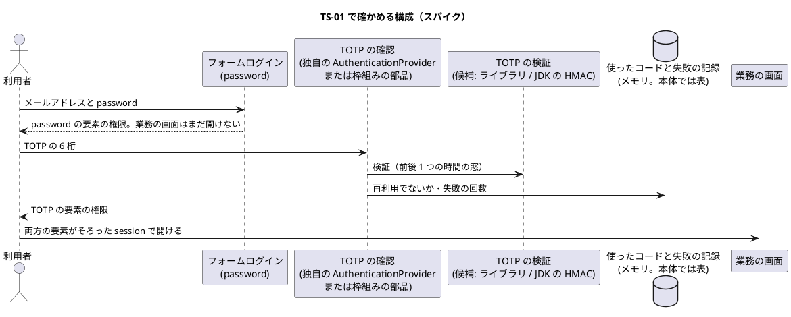
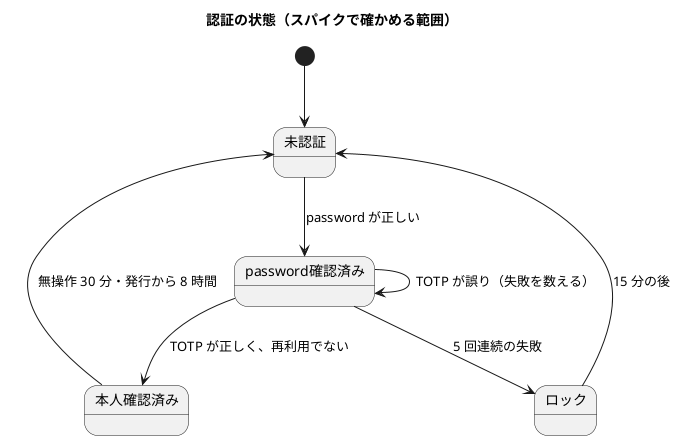

# Bolt 13 計画 - TOTP と Spring Security 7 の多要素認証のスパイク（TS-01）

## 基本情報

| 項目 | 内容 |
| :--- | :--- |
| Bolt | 第 13 回 |
| 予定 | W2（2026-10-12 の週。前倒しで 2026-10-06 から）、2〜3 時間（スパイクの時間箱） |
| 対象 | U4 アクセス・監査。技術的なスパイク TS-01（TOTP ライブラリの決定と、Spring Security 7 の多要素認証との統合方法）。US-18 本人として認証される（W5 で実装）の前提を決める |
| GitHub | ストーリーの Issue はない（スパイクは SP を持たない）。US-18 の Issue（[#6](https://github.com/k2works/practical-domain-driven-design-in-enterpris-application/issues/6) R0.1 の password とセッション、[#13](https://github.com/k2works/practical-domain-driven-design-in-enterpris-application/issues/13) R1.0 の TOTP・ロック・失効・再設定）のうち、#13 に終了報告の後に結論をコメントする（確認ポイント 6） |
| 承認ゲート | 計画の承認（確認ポイント 1〜6）、方式の決定（ステップ 4 の ADR の案）、終了報告の 3 回 |
| アプローチ | 学習テストで確かめる。アプリケーションの本体（`apps/cargo-tracker`）は変えず、別の Gradle プロジェクトで、同じ Spring Boot の版の上に最小の構成を作る。結論は ADR の案と技術スタックに残す |
| 範囲の決定 | 2026-10-06 に human:kakimomokuri が W2 の残りから TS-01 だけを選んだ。US-18 の一部（password によるログインと session）は後の Bolt |
| 前の Bolt | [Bolt 12 終了報告](bolt_12_report.md) |

## Bolt ゴール

US-18（W5）の実装に入る前に、次の 3 つを動くコードで確かめ、ADR の案として人が選べる形にする。

1. TOTP の生成・検証をどのライブラリ（または JDK だけの実装）で行うか。
2. Spring Security 7 の多要素認証の仕組みで、「password の後に TOTP」の 2 段階のログインをどう組むか。
3. US-18 と SEC-04〜10 の要求のうち、方式の選び方を左右するもの（同じコードの再利用の拒否、5 回の失敗でのロック、回復コード、無操作 30 分・最長 8 時間の session）を、その方式で満たせるか。

### 確かめたい仮説

| # | 仮説 | この Bolt で分かること |
| :--- | :--- | :--- |
| H1 | Spring Security 7 の多要素認証の仕組み（要素ごとの権限）を使えば、独自のフィルターの連鎖を書かずに、password の認証の後に TOTP の認証を求め、両方がそろうまで業務の画面を開かせない構成を作れる | 認証の流れを枠組みに任せられるか。US-18 の実装の量 |
| H2 | TOTP の検証は小さな部品で、外部のライブラリに頼らなくても RFC 6238 の試験ベクトルで正しさを確かめられる。保守されていないライブラリに依存するより、JDK の HMAC で実装するか、保守されている小さなライブラリを使う方が安全 | ライブラリの選定。依存の数と保守の状態 |
| H3 | 同じコードの再利用の拒否と、5 回の失敗でのロックは、TOTP の検証の外（アプリケーション側の記録）で持つ必要がある | US-18 の表とドメインモデルに何が要るか |

## ふりかえりと前の Bolt からの引き継ぎ

| 入力 | 内容 | この Bolt での扱い |
| :--- | :--- | :--- |
| 人の決定（2026-10-06） | Bolt 13 は TS-01 だけ | スコープ |
| リスク台帳（リリース計画） | TOTP と Spring Security 7 の統合が想定より難しい（中・中）。W2 でスパイクし、W5 の前に方式を決める | この Bolt の目的 |
| 技術スタック TS-01 | TOTP ライブラリは候補（`dev.samstevens.totp`）を挙げただけで評価していない | ステップ 2 |
| Try T-35（Bolt 12） | 利用者の見え方の表の各行で、示す文言と次に取れる操作を確かめる | 画面を本体に作らないため対象外。ただし ADR の案に、US-18 の画面の流れ（password → TOTP → 初回の登録）で利用者が次に取れる操作を書く |
| Try T-36（Bolt 12） | 承認ゲートを止めずに進める指示を受けたら、ゲートごとに判断と根拠を書き、終了報告の議題の先頭に置く | 指示があったときに守る |
| Try T-37（Bolt 12） | 業務ルール層の Red も、型の骨組みを先に足して実行で失敗を記録する | 学習テストでも、骨組み（空の実装）を先に置き、試験ベクトルのテストが実行で失敗することを記録する |
| Try T-26・T-33（Bolt 9・11） | push の後に CI を確かめる。時刻は最後のコミットの時刻 | 全ステップ。開始準備は 11:53 JST に開始 |
| Bolt 12 の既知の課題 | 経路設計中の失効（D-36-3）、DE-16 の取り込み（US-06）、US-05 との競合 | この Bolt では扱わない |

## スコープ

### 入れるもの・入れないもの

| 入れる | 入れない（後の Bolt） |
| :--- | :--- |
| 別の Gradle プロジェクト `spikes/ts-01-totp/`（本体の build と CI に含めない） | `apps/cargo-tracker` の変更（US-18、W2 の残りと W5） |
| TOTP の候補の比較（RFC 6238 の試験ベクトル、許す時間のずれ、保守・ライセンス・依存） | 本番の利用者の表、password の再設定、メール |
| Spring Security 7 の多要素認証で、password → TOTP の 2 段階のログインの最小の構成（MockMvc の学習テスト） | 画面の作り込み、アクセシビリティ、マニュアル |
| 同じコードの再利用の拒否、失敗の数え方、回復コード、session の時間の制限を満たせるかの確認（できる範囲。時間箱を超えたら結論を「未確認」と書く） | 監査記録（US-17）、ロックの解除の運用 |
| 開発環境だけでログインの画面を入力済みにする仕組み（`dev` プロファイルの設定があるときだけ。既定では入力済みにならない）の確認（人の決定。2026-10-06） | 本体の開発用の利用者の投入（US-18 の Bolt） |
| ADR の案（011。状態は「提案」）、技術スタックの TS-01 の更新 | ADR の確定（W5 の US-18 の計画で、人が採否を決める） |

### 設計（この Bolt の範囲）

本体のドメインモデル・表・画面は変えない。スパイクで確かめる構成を図にする。

> ER 図と画面遷移図は、本体の表と画面を変えないため載せない。US-18 の Bolt で、利用者・TOTP の秘密・回復コード・使ったコードの記録の表と、A-01（ログイン）・TOTP の入力・登録の画面を設計する。

## 開始準備の検証

### 詳細の整合（`validating-iteration-plan`）

| 対象 | 見つけたこと | 対応 |
| :--- | :--- | :--- |
| ユーザーストーリー（US-18） | AC1（password と TOTP で 30 分・8 時間の session）、AC3（5 回の失敗で 15 分のロック）、AC7（初回の TOTP の登録と回復コード）、AC9（回復コード）が方式を左右する | ステップ 2〜3 の確認の項目にした |
| 非機能要件（SEC-04〜10） | SEC-07（Argon2id または bcrypt）、SEC-09（回復コード 10 個）、SEC-10（再登録）。いずれも「提案」の状態 | SEC-07・SEC-09 は確かめる。SEC-10 は運用の手順なので扱わない |
| 技術スタック | 多要素認証の行が「未定」、TS-01 が「最初の Bolt」と書いてある（実際は W2） | ステップ 4 で更新する |
| アーキテクチャ | 認証の成功・失敗・ロックは Spring Security のイベントから同期で監査記録に書く（IA-INV-08）。アクセス・監査は「単純なモデル」で、認証の仕組みは実績のある部品に任せる | ADR の案に、イベントの出どころ（どの部品が失敗を知るか）を書く |
| 識別子と命名 | TS-01、US-18、SEC-04〜10、IA-INV-08、ADR の番号 011 は既存と重ならない | — |

### 横断の整合（`validating-design`）

| 軸 | 見つけたこと | 対応 |
| :--- | :--- | :--- |
| A 開発戦略 | W5（中盤）で TOTP・ロック・session を実装する。W2 はスパイクだけ | 本体を変えない |
| B 設計トピック | 新しいライブラリは外部連携に当たり、採用は確認必須（CLAUDE.md） | スパイクの依存はスパイクのプロジェクトだけに置く。本体への採用は ADR の承認の後（W5） |
| C 過去の計画との連続性 | 認証までは仮の主体（`ProvisionalActorProperties`）。US-18 の Bolt で置き換える | 変えない。ADR の案に置き換えの順を書く |
| C BC の独立性 | 認証はアクセス・監査（`identity`）に置き、ほかのコンテキストは認証方式を知らない（公開ホスト） | ADR の案で、TOTP の部品を `identity` の `infrastructure` に置く前提を書く |

## 入力

| 成果物 | パス |
| :--- | :--- |
| ユーザーストーリー（US-18） | `docs/requirements/cargo-tracker/user_story.md` |
| 非機能要件（SEC-04〜10） | `docs/design/cargo-tracker/non_functional.md` |
| 技術スタック（多要素認証、TS-01） | `docs/design/cargo-tracker/tech_stack.md` |
| アーキテクチャ（アクセス・監査、IA-INV-08） | `docs/design/cargo-tracker/architecture_backend.md`、`docs/design/cargo-tracker/domain_model.md` |
| ADR の一覧 | `docs/adr/cargo-tracker/` |

## ステップ計画

状態の記号: `[ ]` 未着手、`[-]` 進行中、`[?]` 承認待ち、`[x]` 完了。スパイクのプロジェクトは本体の CI の対象外だが、文書の push の後に CI を確かめる（T-26）。結果の時刻は、そのステップの最後のコミットの時刻で書く（T-33）。

- [ ] **1. スパイクのプロジェクトを作る**
  - `spikes/ts-01-totp/`（独立した Gradle プロジェクト。Spring Boot 4.1.1、`spring-boot-starter-security`・`webmvc`・テスト）。本体の Gradle wrapper で動かす。README に目的・動かし方・捨てる時期（US-18 の実装の後に消す）を書く
  - 完了の判定: 空のテストが通る。本体の `check` に影響しない
- [ ] **2. TOTP の候補を比べる（学習テスト）**
  - 候補: (a) JDK の HMAC だけの実装（RFC 6238 の手順）、(b) `com.eatthepath:java-otp`（2026-08 に 1.0.0）、(c) `dev.samstevens.totp`（1.7.1、2020 年が最後）
  - RFC 6238 の付録 B の試験ベクトル（SHA-1、8 桁）を、骨組みを先に置いて実行で失敗させてから通す（T-37）。6 桁・30 秒・前後 1 つの窓での検証、秘密の生成（Base32）、登録用の `otpauth://` URI の組み立て
  - 比べる観点: 正しさ（試験ベクトル）、保守（最後の公開）、ライセンス、推移的な依存、QR の画像の要否、API の分かりやすさ
  - 完了の判定: 比較の表を書ける
- [ ] **3. Spring Security 7 の多要素認証で 2 段階のログインを組む（学習テスト）**
  - password の認証の後は TOTP の入力の画面だけを開け、業務の画面（仮の `/staff`）は開けない
  - TOTP が正しければ業務の画面を開ける。誤り・同じ時間の窓のコードの再利用は拒否する
  - 5 回連続の失敗でロックする（失敗をどこで数えられるか。Spring Security のイベントで分かるか）
  - 回復コード（1 回だけ使える）で TOTP の代わりにできるか
  - session の無操作 30 分（`server.servlet.session.timeout`）と、発行から 8 時間の上限を、どの部品で守れるか（時間箱を超えたら「未確認」）
  - password のハッシュは `DelegatingPasswordEncoder` の既定と Argon2id を確かめる（SEC-07）
  - 開発環境の入力済み（人の決定。2026-10-06）: `dev` プロファイルの設定（例: `cargotracker.dev-login.*`）があるときだけ、ログインの画面にメールアドレスと password が入った状態で出る。設定がないとき（既定）は空で出る。確認ポイント 7 の A-02 の扱いも確かめる
  - 完了の判定: MockMvc の学習テストが、上の振る舞いを確かめて通る。確かめられなかった項目は理由を書く
- [ ] **4. 結論を ADR の案と技術スタックに書く** 【承認ゲート: 方式の決定】
  - `docs/adr/cargo-tracker/011-mfa-totp.md`（状態: 提案）: 背景、選択肢（ライブラリの候補、枠組みの使い方）、決定の案、影響（US-18 の表・画面・ドメインモデルに要るもの、監査記録のイベントの出どころ、仮の主体の置き換えの順）、未確認の項目
  - 技術スタックの多要素認証の行と TS-01 の行、リスク台帳の行を更新する
  - 完了の判定: `okf:check` が ERROR 0。push して CI を確かめる。人が方式の案を選ぶ
- [ ] **5. レビューと Bolt 終了報告**
  - スパイクの規模に合わせ、xp-architect と xp-tester の 2 つの視点で、ADR の案と学習テストをレビューする（T-28 の縮小版。確認ポイント 5）
  - `bolt_13_report.md` を書く（仮説 H1〜H3 の結論、比較の表、未確認の項目、時刻）
  - US-18 の Issue #13 に結論をコメントする（確認ポイント 6）

### 時間の配分と打ち切り

| ステップ | 目安 |
| :--- | :--- |
| 1 | 15 分 |
| 2 | 40 分 |
| 3 | 60 分 |
| 4 | 30 分 |
| 5 | 30 分 |
| 合計 | 175 分 |

3 時間を超えそうなときは、次の順で「未確認」として ADR の案に残す（スパイクは時間箱で止める）。

1. session の発行から 8 時間の上限
2. 回復コード
3. 候補 (c) の比較（保守されていない理由だけで外す）

2 段階のログイン（H1）と TOTP の検証の正しさ（H2）は削らない。

## 確認ポイント（計画の承認の場でまとめて確認する。Try T-6）

| # | 確認すること | ステップ | 理由 |
| :--- | :--- | :--- | :--- |
| 1 | スパイクのコードは `spikes/ts-01-totp/` に独立した Gradle プロジェクトとして置き、コミットする（結論の根拠として残す）。本体の build・CI・SonarQube の対象にしない。US-18 の実装が終わったら消す | 1 | 新しいディレクトリ（構造の変更）。代わりの案（スクラッチパッドで動かしてコミットしない）は、ADR の根拠を後から再現できない |
| 2 | スパイクでは、候補のライブラリと `spring-boot-starter-security` をスパイクのプロジェクトだけに入れる。本体への採用は、ADR を承認した後の US-18 の Bolt で行う | 1〜3 | 外部ライブラリの導入は確認必須。スパイクでの試用と本体への採用を分ける |
| 3 | 候補は (a) JDK の HMAC だけの実装、(b) `java-otp`、(c) `dev.samstevens.totp` の 3 つにする（`googleauth` は 2020 年が最後で (c) と同じ理由で外す） | 2 | 比べる範囲 |
| 4 | ADR は 011 として「提案」の状態で書き、W5 の US-18 の計画の承認で「承認」にする。この Bolt では技術スタックの TS-01 を「スパイク済み（ADR 011 の案）」に更新する | 4 | 方式の確定は、実装の Bolt で人が決める |
| 5 | 本体のコードを変えないため、開発レビューは 5 つの視点でなく xp-architect と xp-tester の 2 つにし、デモの動画と SonarQube は対象外にする。学習テストの実行の結果を終了報告に載せる | 5 | スパイクの規模に合わせる |
| 6 | US-18 の Issue は #6（R0.1）と #13（R1.0。W5）。結論を #13 にコメントする。どちらも状態は変えない | 5 | GitHub の同期 |
| 7 | 開発環境のログインの入力済み（人の決定。2026-10-06）の範囲。A-01 は `dev` プロファイルの設定があるときだけ、開発用の利用者のメールアドレスと password を入力済みにする。A-02（TOTP）は、開発用の利用者に固定の TOTP の秘密を持たせ、`dev` プロファイルだけで現在のコードを入力済みにする案を AI は勧める（TOTP を飛ばす案は、開発と本番で認証の流れが変わり、2 段階のログインを開発環境で確かめられなくなるため採らない）。既定の設定で入力済みにならないことを学習テストで確かめ、ADR 011 の案に書く | 3、4 | セキュリティ（認証）。開発環境の設定が本番に漏れないことを守る |

決定（2026-10-06、human:kakimomokuri）: 確認ポイント 1〜7 はすべて上の案で決まった。

## AI の仮定

- Spring Boot 4.1.1 が管理する Spring Security の版（7 系）を使う。マイルストーンの版（7.2.0-M2）は使わない。
- スパイクは、本体の Gradle wrapper（`apps/cargo-tracker/gradlew -p spikes/ts-01-totp`）で動かす。
- 時間の窓の検証は、テストで固定の時計を使う。

## リスクと対策

| リスク | 影響 | 対策 |
| :--- | :--- | :--- |
| Spring Security 7 の多要素認証の API が想定と違う、または資料が少ない | H1 が確かめられない | 依存の jar の API を直接読む。独自の段階のフィルターで組む代わりの案も、ADR の選択肢に書く |
| Maven Central から候補を取れない（ネットワークの方針） | 候補を比べられない | 取れない候補は「未確認」とし、JDK の実装と比べる |
| スパイクのコードが本体に混ざる | 確かめていない依存が本番に入る | 別のプロジェクトにし、本体の `settings.gradle` に含めない |
| 時間箱を超える | Bolt が半日を超える | 打ち切りの順を決めた |

## 完了条件

### Definition of Done

- [ ] ステップ 1〜5 が完了し、計画・方式の決定・終了報告の承認ゲートを人が通した
- [ ] スパイクの学習テストが通り、実行の結果を終了報告に載せた
- [ ] TOTP の候補の比較の表と、2 段階のログインの構成を、ADR 011 の案に書いた
- [ ] 技術スタックの TS-01 とリスク台帳を更新した
- [ ] 本体の `check` と CI が緑のまま（本体のコードを変えていない）
- [ ] US-18 の Issue に結論をコメントした
- [ ] ユーザーマニュアルは更新しない（本体の画面を変えない）

### デモ項目

| # | デモ | 確かめること |
| :--- | :--- | :--- |
| 1 | スパイクの学習テストを実行する | RFC 6238 の試験ベクトル、2 段階のログイン（password だけでは業務の画面を開けない）、再利用の拒否、失敗の数え方が通る |

## 更新履歴

| 日付 | 内容 | 作成 | 承認 |
| :--- | :--- | :--- | :--- |
| 2026-10-06 | 初版（Bolt 12 終了報告の次の Bolt。範囲は人の決定で TS-01 だけ） | anthropic/claude-opus-5-5 | — |
| 2026-10-06 | 人の決定（開発環境ではログインの画面を入力済みにする）をスコープ・ステップ 3・確認ポイント 7 に足した | anthropic/claude-opus-5-5 | human:kakimomokuri（決定） |
| 2026-10-06 | 計画を承認。確認ポイント 1〜7（スパイクの置き場所、依存の入れ方、候補、ADR 011 の扱い、レビューの縮小、Issue のコメント、開発環境のログインの入力済み）も決まった（Try T-6） | anthropic/claude-opus-5-5 | human:kakimomokuri |

## 関連ドキュメント

- [リリース計画](release_plan.md)（W2、リスク台帳）
- [開発戦略](development_strategy.md)
- [Bolt 12 終了報告](bolt_12_report.md)
- [ユーザーストーリー](../../requirements/cargo-tracker/user_story.md)（US-18）、[非機能要件](../../design/cargo-tracker/non_functional.md)（SEC-04〜10）、[技術スタック](../../design/cargo-tracker/tech_stack.md)（TS-01）
