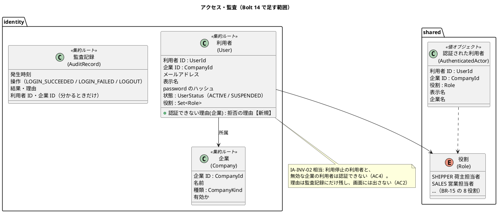
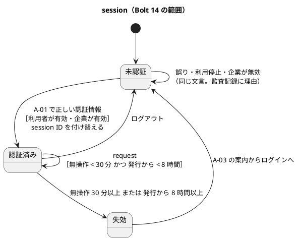
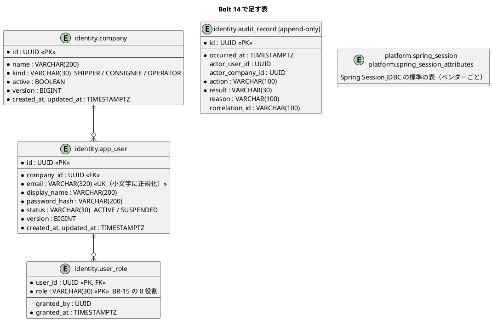
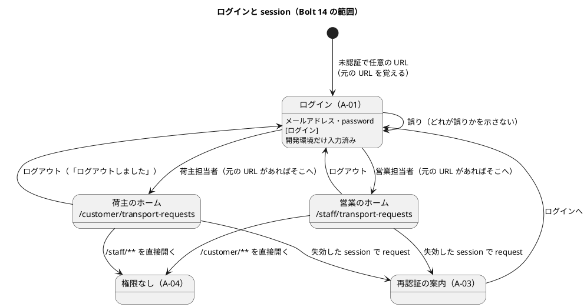

# Bolt 14 計画 - password によるログインと session（US-18 の一部）

## 基本情報

| 項目 | 内容 |
| :--- | :--- |
| Bolt | 第 14 回 |
| 予定 | W2（2026-10-12 の週。前倒しで 2026-10-06 から）、5〜6 時間（Bolt の目安の 2〜4 時間を超える。範囲の決定を参照） |
| 対象 | U4 アクセス・監査。US-18 本人として認証される（password によるログインと session。TOTP は W5） |
| GitHub | [#6 [US-18] 本人として認証される（R0.1: password によるログインと session）](https://github.com/k2works/practical-domain-driven-design-in-enterpris-application/issues/6)（SP 2。AC2）。AC1 の password の部分・AC4・AC5 は R1.0 の [#13](https://github.com/k2works/practical-domain-driven-design-in-enterpris-application/issues/13) の範囲を前倒しする（確認ポイント 1） |
| 承認ゲート | U4 の密度（セキュリティとデータベースを含むため、U1 より 1 つ多い）。計画の承認（確認ポイント 1〜14）、利用者と企業の業務のルールとスキーマ（ステップ 2）、認証の構成（ステップ 3。セキュリティ）、開発レビューの判断、終了報告（ステップ 4・5 をまとめる）の 5 回 |
| アプローチ | インサイドアウト。開発戦略の序盤の既定はアウトサイドインだが、新しい集約と表を作る Bolt はインサイドアウトにする（開発戦略の Bolt の規則）。利用者・企業の業務のルールと表から入り、認証の流れはセキュリティの統合テストで外側から確かめ、最後に画面の層を受入シナリオで駆動する |
| 範囲の決定 | 2026-10-06 に human:kakimomokuri が、W2 の残りの US-18 の一部を分けずに 1 つの Bolt で行うと決めた（AI は 2 つの Bolt に分ける案を推した）。Bolt の目安を超えるため、打ち切りの順を下に置く |
| 前の Bolt | [Bolt 13 終了報告](bolt_13_report.md) |

## Bolt ゴール

荷主担当者と営業担当者は、A-01 でメールアドレスと password を入れてログインし、役割ごとのホーム（荷主は `/customer/transport-requests`、営業は `/staff/transport-requests`）と役割ごとのナビゲーションを使える。誤った認証情報・利用停止の利用者・無効な企業ではログインできず、どれが誤りかは示されない。失敗と成功は監査記録に同期で残る。session は無操作 30 分・発行から 8 時間で失効し、次の request で業務データを出さずに再認証を求める。これまでの仮の主体（`ProvisionalActorProperties`）はなくなり、提出者・回答者・審査者・承認者は認証された利用者になる。開発環境では A-01 に開発用の利用者のメールアドレスと password が入った状態で開く。

### 確かめたい仮説

| # | 仮説 | この Bolt で分かること |
| :--- | :--- | :--- |
| H1 | 認証の主体の型を `shared` に置き、ほかのコンテキストは Spring Security の型を知らずにその型だけを受け取れば（ADR-011 の決定 4）、`quotation` の controller の差し替えは引数の変更だけで済み、モジュールの依存（ApplicationModules の検証）は増えない | 認証の方式を業務の層に埋め込まずに済むか（`architecture_backend.md` の約束） |
| H2 | password の段を Spring Security の標準（form login、`DaoAuthenticationProvider`、`HttpSessionSecurityContextRepository`）で作り、失敗の記録を 1 つの listener に寄せれば、W5 で TOTP（`@EnableMultiFactorAuthentication`）とロックを足すときに、この Bolt の構成を作り直さずに済む | W5 の手戻りの大きさ（終了報告で、W5 で変える箇所を数える） |
| H3 | 範囲を分けずに 1 つの Bolt にしても、打ち切りの順を先に決めておけば、セキュリティの規則（AC2・AC4・AC5、CSRF、session の固定化）は削らずに終えられる | 目安を超える Bolt の扱い方（終了報告で、所要時間と打ち切った項目を記録する） |

## ふりかえりと前の Bolt からの引き継ぎ

| 入力 | 内容 | この Bolt での扱い |
| :--- | :--- | :--- |
| 人の決定（2026-10-06） | Bolt 14 は US-18 の password によるログインと session を、分けずに 1 つの Bolt で行う | スコープ、H3 |
| Try T-38（Bolt 13） | 時間と回数の境界は、直前・同時刻・直後の 3 点で書く。「確かめた」と書くのは、テストで裏付けた範囲だけ | 30 分・8 時間の境界を 3 点で書く（ステップ 3） |
| Try T-39（Bolt 13） | Red の記録では、テストごとに、本命のアサーションで落ちたか前提で落ちたかを書く | 全ステップの Red の記録 |
| Try T-40（Bolt 13） | 認証のフィルターを足すときは、権限が上がる段ごとに、session ID の変化と期限の確認の順をテストで確かめる | ステップ 3 のセキュリティの統合テスト（ログインの前後で session ID が変わる、8 時間の確認が認証より先） |
| ADR-011（提案） | 決定 2（session の固定化、失敗の記録の一か所、時計）、決定 3（開発環境の入力済みの 5 層の守り）、決定 4（主体の型を `shared` に置く、置き換えの順） | 確認ポイント 2・3・11。TOTP の採否は W5 で決める（ADR-011 は提案のまま） |
| Bolt 13 レビュー D-47 | Spring Session JDBC、特性テストは W5 の US-18 に回した | Spring Session JDBC はこの Bolt で入れる（範囲の決定）。`toBuilder()`・`issuedAt` の特性テストは TOTP に係るため W5 のまま |
| D-21（Bolt 5 レビュー） | `same-site=lax` は CSRF のつなぎ。Spring Security の CSRF の防御は US-18 | CSRF の防御を入れる。`same-site=lax` は多層の守りとして残す（確認ポイント 8） |
| 開発戦略の序盤の手順 3 | password によるログインを入れたら、全ルートの仮の画面と役割ごとのナビゲーションを作り、表示・非表示・A-04 を E2E で確かめる | 確認ポイント 10 |
| Try T-26・T-33・T-28・T-31・T-21・R-38 | push の後に CI を確かめる。時刻は最後のコミットの時刻。開発レビューを終了報告の前に。デモ項目を録画する。画面の層の Red を実行して記録する。Red を先にコミットする | 全ステップ。開始準備は 13:35 JST に開始 |

## スコープ

### 設計の約束（Try T-1）

| 設計の約束 | 出典 | この Bolt |
| :--- | :--- | :--- |
| SEC-01 メールアドレス + password + TOTP | 非機能要件 | password まで。TOTP は W5 |
| SEC-02 5 回連続の失敗で 15 分のロック（IA-INV-03） | 非機能要件、ドメインモデル | 入れない（W5）。失敗の回数の列も W5 で足す |
| SEC-03 無操作 30 分、発行から 8 時間で失効（IA-INV-03） | 非機能要件、ドメインモデル | 入れる（AC5） |
| SEC-07 Spring Security の推奨のハッシュ（Argon2id または bcrypt） | 非機能要件 | bcrypt（`PasswordEncoderFactories` の既定）。確認ポイント 6 |
| SEC-04・05 password の強度、SEC-08〜10 再設定・TOTP | 非機能要件 | 入れない。password を決める画面（利用者の登録 US-16、再設定）がまだない |
| SEC-11 どの項目が誤りかを示さない | 非機能要件、AC2 | 入れる |
| SEC-12 認可は request ごとに DB の現在値（IA-INV-04） | 非機能要件 | 入れない（W5。AC6 の権限の取消しと一緒）。この Bolt の役割はログインの時点の値（確認ポイント 9） |
| SEC-17 CSRF、Cookie の Secure・HttpOnly・SameSite、CSP、クリックジャッキング | 非機能要件 | CSRF、HttpOnly、SameSite、`X-Frame-Options: DENY` は入れる。Secure は dev の外で入れる。CSP は外部のスクリプトがないことを確かめて入れる（確認ポイント 8） |
| AUD-01・IA-INV-08 認証の成功・失敗を同期で監査記録へ | 非機能要件、ドメインモデル | 入れる（`audit_record`。確認ポイント 5） |
| 企業・利用者・役割の集約、`company`・`app_user`・`user_role` | ドメインモデル、データモデル | 入れる。利用者の割当・参照許可（`user_assignment`・`access_grant`）は US-16・US-19 |
| `platform.spring_session` | データモデル | 入れる（確認ポイント 7） |
| A-01 ログイン、A-03 再認証の案内、A-04 権限なし、ヘッダーの利用者名とログアウト | UI 設計 | 入れる。A-02（TOTP）・A-05〜A-07 は W5 |

### 入れるもの・入れないもの

| 入れる | 入れない（後の Bolt） |
| :--- | :--- |
| Spring Security の form login（A-01）とログアウト、役割ごとのホームへの振り分け | TOTP（A-02）、初回の登録（A-07）、回復コード。W5 |
| 企業・利用者・役割の集約と表、監査記録の表（認証の成功・失敗・ログアウト） | ロック（AC3）、password の再設定（A-05・A-06）。W5 |
| 利用停止の利用者・無効な企業の拒否（AC4） | 権限の取消しの次の request での反映（AC6）と、request ごとの DB の確かめ（SEC-12）。W5 |
| 無操作 30 分・発行から 8 時間の失効と A-03（AC5）、Spring Session JDBC | 失効 5 分前の警告と入力の保持（ACC-06）。W5 |
| CSRF、session の固定化の防止、Cookie と応答ヘッダー | 利用者と役割の管理の画面（US-16）、利用者のタイムゾーンでの表示 |
| 仮の主体（`ProvisionalActorProperties`）を認証の主体に置き換えて消す | 仮の荷受人（`ProvisionalConsigneeProperties`）。企業マスター（US-16） |
| 役割ごとのナビゲーションの骨格と A-04、開発環境の入力済み | 荷主担当者・営業担当者のほかの 6 役割の画面 |

## 設計（この Bolt の範囲）

### ドメインモデル

> 注（設計への反映。ステップ 1 で反映する）:
>
> - ドメインモデルのアクセス・監査に、`AuthenticatedActor` を共有カーネルに置くこと（ADR-011 の決定 4）と、認証できない理由（利用停止・企業が無効）を書く
> - 役割の型（`Role`）を共有カーネルに置く（`quotation` の controller が役割で振り分けずに済むよう、`shared` の型にする）
> - 監査記録の操作の値に、ログインの成功・失敗・ログアウトを足す

### 状態遷移

利用者の状態（有効・利用停止）を変える操作は US-16 で作る。この Bolt では表の値として持ち、テストの準備で変える。

### データモデル

> 注（設計への反映。ステップ 1 で反映する）: データモデルの `app_user` の `totp_secret_encrypted`・`failed_attempts`・`locked_until` は W5 で足すこと、`audit_record` の対象・変更前後・承認・出典・`event_id` の列は使う Bolt で足すこと、`email` を小文字に正規化して一意にすることを書く。既存の表の `shipper_company_id` などに外部キーは張らない（確認ポイント 4）。

### 画面遷移

URL（確認ポイント 10）: `GET /login`（A-01）、`POST /login`、`POST /logout`、`GET /session-expired`（A-03）、`/` は役割ごとのホームへ振り分ける。A-04 は 403 の応答で出す。

### 利用者の見え方（T-32・T-35）

| 時点 | 荷主担当者 | 営業担当者 |
| :--- | :--- | :--- |
| ログインの前 | どの URL を開いても A-01。示す文言「メールアドレスと password を入力してください」。次の操作はログイン | 同じ |
| 認証情報の誤り・利用停止・企業が無効 | A-01 に「メールアドレスまたは password が正しくありません。」。入れたメールアドレスは残し、password は消す。次の操作は入れ直す（利用停止を知る手段は、担当営業・システム管理者への問い合わせ。A-01 に「ログインできない場合は担当営業にお問い合わせください」） | A-01 に同じ文言。「ログインできない場合はシステム管理者にお問い合わせください」 |
| ログインの後 | 輸送要求の一覧（C-02）。ヘッダーに企業名・利用者名・ログアウト。ナビゲーションは荷主の項目だけ | 見積依頼の受付一覧（S-02）。ヘッダーに役割名・利用者名・ログアウト。ナビゲーションは営業の項目だけ |
| 役割にない URL を直接開く | A-04「この画面を表示する権限がありません」と「ホームへ戻る」 | 同じ |
| まだ作っていない画面をナビゲーションから開く | 仮の画面「この画面は準備中です（予定: W○）」と「ホームへ戻る」 | 同じ |
| 失効の後の request | A-03「一定時間操作がなかったため、またはログインから 8 時間を過ぎたため、ログアウトしました。もう一度ログインしてください」と「ログインへ」。入力の保持は W5（入力中の内容は失われる旨を書かない。W5 で保持を入れる） | 同じ |
| ログアウトの後 | A-01 に「ログアウトしました」 | 同じ |

## 開始準備の検証

### 詳細の整合（`validating-iteration-plan`）

| 対象 | 見つけたこと | 対応 |
| :--- | :--- | :--- |
| ユーザーストーリー（US-18） | AC1 は TOTP を含む。#6 は AC2 だけで、AC1・AC4・AC5 は #13（R1.0）にある | 確認ポイント 1。AC1 の password の部分・AC4・AC5 をこの Bolt で前倒しし、#13 にコメントする |
| ドメインモデル | 企業・利用者の集約と IA-INV-03・04・08 はある。認証の主体の型の置き場所、認証できない理由、役割の型の置き場所がない | 上の注。ステップ 1 |
| データモデル | `company`・`app_user`・`user_role`・`audit_record`・`spring_session` はある。この Bolt で使わない列の扱い、email の正規化、既存の表の外部キーの扱いがない | 確認ポイント 4・5・7。ステップ 1 |
| UI 設計 | A-01・A-03・A-04 の画面一覧と A-01 の画面イメージはある。ログインの URL、A-03・A-04 の URL と文言、役割ごとのホーム、ヘッダーの実装、仮の画面の扱いがない | 確認ポイント 10。ステップ 1 |
| 非機能要件 | SEC-07 は「提案」。SEC-17 の CSP の範囲が未決 | 確認ポイント 6・8 |
| 識別子と命名 | ストーリー ID（US-18）、画面 ID（A-01・A-03・A-04）、不変条件（IA-INV-03・08）、表の名前（`company`・`app_user`・`user_role`・`audit_record`）はデータモデルに合わせた。役割の値はデータモデルの BR-15 の 8 役割を英字にする（`SHIPPER`、`SALES`、`ROUTE_DESIGNER`、`TRACKING_MANAGER`、`DATA_STEWARD`、`CUSTOMER_SUPPORT`、`SYSTEM_ADMIN`、`AUDITOR`） | 確認ポイント 4 |

### 横断の整合（`validating-design`）

| 軸 | 見つけたこと | 対応 |
| :--- | :--- | :--- |
| A 開発戦略 | 序盤はアウトサイドインだが、新しい集約と表の Bolt はインサイドアウト。W2 のデモ項目は「password でのログインと、役割ごとのナビゲーション」（`@US-18`）。序盤の手順 3 で全ルートの仮の画面 | アプローチをインサイドアウトにする。デモ項目を `@demo-bolt-14` で録画する。仮の画面は確認ポイント 10 |
| B 設計トピック | 新しい集約（企業・利用者・監査記録）と値（役割）。用語集（JIG）の整合テストが新しい型を検査する | 型を足すときに用語集の行も足す |
| C 過去の計画との連続性 | 画面と URL に内部の ID を出さない（D-4）。荷主の照会は荷主企業で絞る（Bolt 4 R-02）。業務の拒否は値（Bolt 4 R-04）。部分インデックス・ベンダーごとの DDL は `postgresql`・`h2` のフォルダ（Bolt 11）。追記だけの表は COMMENT の ` [append-only]` で UPDATE・DELETE を取り上げる（Bolt 2） | すべて踏襲する。荷主企業は認証の主体の企業 ID で絞る。`audit_record` に ` [append-only]` を付ける |
| C BC の独立性 | `quotation` が `identity` に依存すると、`identity → quotation::events` と循環する（D-48） | 主体の型と役割は `shared` に置き、`quotation` は `identity` に依存しない。ApplicationModules の検証と ArchUnit で確かめる（確認ポイント 2） |
| 前の Bolt のレビュー | Bolt 13 レビューの W5 への持ち越し（D-47）。AC2 と 2 段の画面の緊張（K-02）は TOTP の段がないこの Bolt では起きない | 範囲の決定どおり。終了報告の既知の課題に残す |

## 入力

| 成果物 | パス |
| :--- | :--- |
| ユーザーストーリー（US-18） | `docs/requirements/cargo-tracker/user_story.md` |
| 非機能要件（SEC-01〜17、AUD-01、RET-08） | `docs/design/cargo-tracker/non_functional.md` |
| ドメインモデル（アクセス・監査、IA-INV-03・04・08） | `docs/design/cargo-tracker/domain_model.md` |
| データモデル（アクセス・監査、`platform`） | `docs/design/cargo-tracker/data_model.md` |
| UI 設計（A-01・A-03・A-04、共通レイアウト、画面遷移） | `docs/design/cargo-tracker/ui_design.md` |
| バックエンドのアーキテクチャ（アクセス・監査を公開ホストにする） | `docs/design/cargo-tracker/architecture_backend.md` |
| ADR-011（提案）、Bolt 13 終了報告・レビュー、スパイク | `docs/adr/cargo-tracker/011-mfa-totp.md`、`docs/development/cargo-tracker/bolt_13_report.md`、`docs/review/cargo-tracker/bolt_13_review_20261006.md`、`spikes/ts-01-totp/` |
| 開発ガイドライン 第 1 章・第 3 章 | `docs/article/01-ddd-fundamentals.md`、`docs/article/03-spring-modular-monolith.md` |

## ステップ計画

状態の記号: `[ ]` 未着手、`[-]` 進行中、`[?]` 承認待ち、`[R]` 修正中、`[x]` 完了、`[S]` スキップ。各ステップの終わりに `check` が緑であることを確かめて push し、CI の結果を確かめてから次のステップに入る（T-14、T-26）。結果の時刻はそのステップの最後のコミットの時刻で書く（T-33）。Red の記録には、テストごとに本命のアサーションで落ちたか前提で落ちたかを書く（T-39）。

- [x] **1. 決定を設計文書に反映し、ADR 012 の案を書く**（承認はステップ 2 とまとめて受ける）
  - ユーザーストーリー: US-18 の Bolt 14 の決定（前倒しする AC、#6 と #13 の分け方）
  - ドメインモデル: `AuthenticatedActor` と `Role` を共有カーネルに置く、認証できない理由、監査記録の操作
  - データモデル: Bolt 14 で足す列と W5 で足す列、email の正規化、既存の表の外部キーを張らない理由、`spring_session` のベンダーごとの DDL
  - UI 設計: ログインの URL、A-01・A-03・A-04 の文言、役割ごとのホーム、ヘッダー、仮の画面
  - 非機能要件: SEC-07 の bcrypt、SEC-17 のこの Bolt で入れる範囲
  - ADR 012「認証の主体と Spring Security・Spring Session の導入」（新規、提案）: 主体の型の置き場所、`SecurityFilterChain` の置き場所、session の保存先、監査の同期の書き込み、開発環境の入力済みの守り。TOTP は ADR-011 のまま
  - 技術スタック: Spring Security・Spring Session JDBC・thymeleaf-extras-springsecurity を「採用」にする
  - 完了の判定: `okf:check` が ERROR 0、`documentationTest` が緑。push する
  - 結果（2026-10-06 13:53〜13:56 JST。最後のコミット `f1173bd` の時刻）: ユーザーストーリー（US-18 の Bolt 14 の決定）、ドメインモデル（`AuthenticatedActor`・`Role` を共有カーネルに、IA-INV-09、監査記録の操作）、データモデル（Bolt 14 で作る列と W5 で足す列、役割の値、外部キーを張らない理由、`db/dev-data/`、`spring_session`）、UI 設計（A-01・ログアウト・A-03・A-04・ホーム・準備中の画面の URL と文言、ヘッダー、開発環境の入力済みの設定）、非機能要件（SEC-07・SEC-17 を確定）、技術スタック（Spring Security・Spring Session JDBC を Bolt 14 で導入）に反映した。[ADR-012](../../adr/cargo-tracker/012-authentication-principal-and-session.md)（提案）を書き、ADR の索引と mkdocs に足した。`okf:check` ERROR 0、`documentationTest` 緑
- [x] **2. 企業・利用者・監査記録の業務のルールと表（内側の TDD、統合テスト）** 【承認ゲート: 業務のルールとスキーマの変更】
  - 単体テストを先に書く: 有効な企業の有効な利用者は認証できる。利用停止の利用者、無効な企業の利用者は理由付きで認証できない。メールアドレスの正規化（前後の空白、大文字）。役割の値が BR-15 の 8 つ
  - 統合テスト（PostgreSQL）を先に書く: 企業・利用者・役割の保存と読み出し、email の一意（大文字小文字を区別しない）、役割の CHECK、`audit_record` の UPDATE・DELETE がアプリの利用者で拒否される、`spring_session` の表がある
  - マイグレーション: `common` に `identity.company`・`app_user`・`user_role`・`audit_record`、`postgresql`・`h2` に `platform.spring_session`。H2 のスモークを先に回す（T-15）
  - 開発用の利用者: `db/dev-data`（dev のときだけ Flyway の場所に足す）に、荷主の企業と利用者 2 人（同じ企業、別の企業）、A 社と営業担当者 1 人を入れる。共通・ベンダーの場所に置かないことをテストで確かめる（ADR-011 の決定 3 の 4 層目）
  - MyBatis のリポジトリ（企業・利用者・監査記録）
  - 完了の判定: `check` が緑。push して CI を確かめる。業務のルールとスキーマの承認を受ける
  - 結果（2026-10-06 13:58〜14:05 JST。最後のコミット `e67b16a` の時刻）
    - Red: 単体テスト（役割の 8 つ、メールアドレスの正規化と検証、利用停止・無効な企業の拒否と優先順、所属外の企業、役割のない利用者、監査記録の作り方）と、統合テスト（PostgreSQL。企業・利用者・役割・監査記録の保存と読み出し、email の一意、表の CHECK の 4 つ、`spring_session` の表、追記専用の印）、開発用のデータの置き場所のテスト、dev の H2 で開発用の利用者がいることを先に書いた。値・集約・リポジトリの骨組み（何もしない実装）と、制約のない表だけを足し、新しいテスト 45 件の失敗を記録してコミットした（`a3075e6`）。T-39 の記録: 監査記録の 5 件は、骨組みが null を返したための NullPointerException（本命の前で落ちた）。統合テストの 2 件（正規化していないメールアドレス、利用状態の値）は、骨組みの企業の登録が何もしないため外部キーの違反で例外になり、本命の CHECK を見ずに通った（Green の後で CHECK で落ちることを確かめた）。ほかは本命のアサーションで落ちた。最初の実行は dockerd が止まっていて統合テストが起動できず、手順書どおりセッションの開始のフックを実行し直した
    - Green: `Role`（共有カーネル）、`EmailAddress`・`CompanyKind`・`UserStatus`・`AuthenticationRejection`・`AuditAction`・`AuditResult`、集約 `Company`・`User`（認証できない理由。利用停止を企業の無効より先に返す）・`AuditRecord`、MyBatis のリポジトリ 3 つ（`IdentityMapper`）。`common` の `V20261006140000__create_identity_users.sql`（4 表、CHECK、email の一意と正規化、COMMENT、監査記録の ` [append-only]`）、`h2`・`postgresql` の `V20261006140100__create_spring_session.sql`（spring-session-jdbc 4.1.1 の DDL を `platform` に）、`db/dev-data/V20261006140900__seed_dev_users.sql`（荷主 A・B、A 社、利用者 3 人。ID は仮の主体を引き継ぐ）と `application-dev.properties` の Flyway の場所（`e67b16a`）
    - 計画からの変更: 利用者の集約の型の名前を、用語集に合わせて `User` にした（表は `app_user`）。`EmailAddress` を用語集に足した。監査記録の `correlation_id` は列だけを作り、埋めるのは使う Bolt にした
    - 実行中に直した誤り: Red のコミットの整形で監査記録の失敗の作り方のシグネチャが折り返され、Green の置き換えが当たらなかった（直した）。用語集に `EmailAddress` がなく `documentationTest` が落ちた（足した）
    - `check` 緑（`test` 825 件。Bolt 12 の 786 件から +39）。push の後の CI（cargo-tracker CI #81）は成功
    - 承認ゲートの扱い（T-36）: 人の指示（`/goal Bolt 14`）により、業務のルールとスキーマの承認ゲートで止まらずにステップ 3 へ進めた（AI の判断）。根拠は、表と規則が計画の確認ポイント 4・5・12（承認済み）の範囲に収まり、計画からの変更は型の名前（`User`）と `correlation_id` を埋めないことだけであること。終了報告の承認の議題の先頭に置く
- [x] **3. 認証の構成（セキュリティの統合テスト、外側から）** 【承認ゲート: セキュリティ】
  - セキュリティの統合テスト（`@SpringBootTest`、PostgreSQL）を先に書く
    - 未認証の `/customer/**`・`/staff/**` は A-01 へ。業務データを返さない
    - 正しい認証情報でログインでき、session ID が変わり、役割ごとのホームへ行く。元の URL があればそこへ（T-40）
    - 誤った password・存在しないメールアドレス・利用停止・企業が無効は、同じ応答（同じ文言、同じ URL）でログインできない（AC2・AC4）
    - 成功・失敗・ログアウトが、同じ request の中で監査記録に書かれる。失敗の理由が分かる。存在しないメールアドレスでは利用者 ID を書かず、メールアドレスも残さない（確認ポイント 5）
    - 無操作 29 分 59 秒は通り、30 分・30 分 1 秒は A-03 へ。発行から 7 時間 59 分 59 秒は通り、8 時間・8 時間 1 秒は A-03 へ（T-38。時計を差し替える）。8 時間の確認は認証の処理より先（T-40）
    - CSRF のトークンのない POST は拒否される。ログアウトは POST だけ
    - 荷主が `/staff/**` を、営業が `/customer/**` を開くと 403 と A-04
    - 応答のヘッダー（`X-Frame-Options`、`X-Content-Type-Options`、CSP）と Cookie（HttpOnly、SameSite）
  - 依存を足す: `spring-boot-starter-security`、`spring-session-jdbc`、`thymeleaf-extras-springsecurity6`（Spring Security 7 に合う版を確かめる）
  - `identity.infrastructure.config` に `SecurityFilterChain`、`identity` に `UserDetailsService`（企業の有効も確かめる）、成功・失敗・ログアウトの監査の listener、8 時間の上限のフィルター。主体は `AuthenticatedActor` を持つ
  - 完了の判定: `check` が緑。push して CI を確かめる。セキュリティの承認を受ける
  - 結果（2026-10-06 14:05〜14:28 JST。最後のコミット `3f34b53` の時刻）
    - Red: セキュリティの統合テスト（`AuthenticationSecurityIntegrationTest`。MockMvc と Spring Session JDBC と PostgreSQL）28 件を先に書き、依存（`spring-boot-starter-security`・`spring-boot-starter-session-jdbc`・`spring-boot-starter-security-test`）、`AuthenticatedActor`、何も守らない構成の骨組みを足した。最初の実行は 28 件中 27 件が Spring Session の表の名前の設定がない前提で落ちたため（T-39）、表の名前の設定を骨組みに足して実行し直し、27 件が本命のアサーション（未認証で 200、ログインできない、ヘッダーがない）で落ちることを記録してコミットした（`e202d31`）。CSRF のないログインの 1 件は、Spring Security の既定で最初から通った
    - Green: `identity.infrastructure.security` に `CargoUserDetails`（session に直列化できる値だけを持ち、`actor()` で `AuthenticatedActor` を渡す）、`CargoUserDetailsService`、`AuthenticationAuditListener`、`SessionLifetime`・`SessionLifetimeFilter`、`RoleHomeAuthenticationSuccessHandler`、`identity.infrastructure.config.SecurityConfiguration`。password を先に照合し、利用停止・無効な企業はその後に拒否する（照合の前に拒否すると、誤った password でも利用停止が応答の時間から分かる）。A-01・A-03 の最小の画面（`LoginController`、`layout/public.html`）、ルートの振り分け（`HomeController`。`static/index.html` を消した）。`application.properties` に Spring Session の表、無操作 30 分、Cookie の HttpOnly・Secure（dev は外す）を足した（`3f34b53`）
    - 計画からの変更: (1) 既存のテストを緑に保つため、ステップ 4 の一部をここで行った。画面の単体テスト 5 クラスは `@AutoConfigureMockMvc(addFilters = false)` でフィルターを外し（認証・認可・CSRF はセキュリティの統合テストで確かめる）、画面の層のシナリオは `BrowserSession.navigate` が A-01 から役割の利用者でログインしてから開く（`UiUsers` がシナリオごとに企業と利用者を作る）。A-01・A-03 の最小の画面とルートの振り分けもここで作った。(2) 発行から 8 時間を過ぎた session のままのログインの送信も A-03 へ移す（スパイクはそのまま続けさせていたが、Spring Session の上では無効な session の扱いと重なり、ログインし直しは A-03 から行う形にした）。(3) session に CSRF のトークンがない古いフォームの送信は、Spring Security が無効な session として A-03 へ移す（403 ではない）。トークンが誤っていれば 403。(4) multipart の上限の超過は、CSRF の確認が送信の本体を読むため controller より前で起き、`UploadLimitAdvice` に届かなくなった。案内を `/error` の 413 の画面（`templates/error/413.html`。荷主の見積依頼への送信のときだけ荷主向けの文言）に移し、`UploadLimitAdvice` と専用の画面を消した。(5) session の Cookie の属性は、Spring Boot が組み込みのサーバーで動くときだけ設定を当てるため、実際の HTTP で確かめるテスト（`SessionCookieIntegrationTest`）に分けた。(6) 元の URL へ戻るときは Spring Security が目印の `?continue` を付ける。(7) Bolt 3 の「ルートを開くと画面の入口の一覧」のシナリオを「ログインした荷主がルートを開くと見積依頼の一覧へ移る」に置き換え、幅 320 CSS px の表の入口の一覧をログインの画面にした
    - 実行中に直した誤り: SpotBugs（親のメソッドが認証を null にできると宣言している。null のときはルートへ移す）
    - `check` 緑（`test` 854 件。+29）。`uiTest` 緑（41 本。A-01 からのログインを経て）
    - 承認ゲートの扱い（T-36）: 人の指示（`/goal Bolt 14`）により、セキュリティの承認ゲートで止まらずにステップ 4 へ進めた（AI の判断）。根拠は、構成が計画の確認ポイント 6〜9・11（承認済み）と ADR-012（提案）に沿い、上の計画からの変更はどれも守りを弱めない（(2)(3) は失効の扱いを厳しくする方向）こと。終了報告の承認の議題の先頭に置く
- [x] **4. 主体の置き換えと画面の層（Red → Green）**（承認はステップ 5 とまとめて受ける）
  - 画面の層の受入シナリオを先に書き、`uiTest` で失敗を記録する（T-21。`features/ui/login_ui.feature`、`@ui @US-18 @US-18-AC2`。デモ項目に `@demo @demo-bolt-14/<名前>`）
    - 荷主が A-01 からログインし、荷主のナビゲーションとヘッダー（企業名・利用者名・ログアウト）が出る。営業の項目は出ず、`/staff/transport-requests` を直接開くと A-04
    - 営業も同じく、営業のナビゲーションが出て、`/customer/transport-requests` は A-04
    - 誤った password で、どれが誤りかを示さない文言が出る
    - ログアウトすると A-01 に「ログアウトしました」
    - キー操作だけでログインできる。幅 320 CSS px で横スクロールが出ない。axe-core の違反 0 件
  - 既存の `@ui` のシナリオは、シナリオごとにテスト用の利用者を作り、A-01 からログインしてから始める（共通のステップ）
  - `quotation` の 4 つの controller（`TransportRequestController`・`QuotationResponseController`・`TransportRequestReviewController`・`StaffQuotationController`）を、`@AuthenticationPrincipal` で `AuthenticatedActor` を受け取る形に 1 つずつ置き換え、controller の単体テストは仮の主体の設定の代わりにテスト用の主体の注釈（`@WithAuthenticatedActor`）を使う。最後に `ProvisionalActorProperties` と設定を消す（ADR-011 の決定 4 の順）
  - A-01・A-03・A-04、共通レイアウトのヘッダー（利用者名・ログアウト）、役割ごとのナビゲーションと仮の画面、`/` の振り分け
  - 開発環境の入力済み: `@Profile("dev")` の部品が A-01 にメールアドレスと password を入れる。dev の外で `cargotracker.dev-login.*` があれば起動を失敗させる。既定の設定で入力済みにならないことをテストで確かめる（ADR-011 の決定 3 の 1〜3 層目）
  - ArchUnit: `quotation` は Spring Security の型に依存しない。`ProvisionalActorProperties` がない
  - 完了の判定: `check` と `uiTest` が緑。push して CI を確かめる
  - 結果（2026-10-06 14:28〜14:47 JST。最後のコミット `c99e348` の時刻）
    - Red: 画面の単体テスト 4 クラスを、仮の主体と違う値の認証された利用者（`@WithAuthenticatedActor`、`TestActors`）で動かす形に書き換えた（仮の主体の設定は残したまま）。画面の層のシナリオ（`login_ui.feature`。荷主・営業のログインとヘッダーとナビと A-04、誤った password、ログアウト、キー操作、準備中の画面）、開発環境の入力済み（dev で入る・既定で入らない）、守りの 2 層目（dev の外・staging・prod との併用で起動させない）、見積りのコンテキストが Spring Security と仮の主体に依存しない規則を先に書いた。`test` で 39 件（画面の単体テスト 30 件は操作者と企業が仮の主体のものになる本命のアサーション、守り 3 件、入力済み 2 件、規則 1 件など）、`uiTest` で新しいシナリオ 5 件の失敗を記録してコミットした（`eb5f227`）。T-39 の記録: 画面の単体テストのうち回答の 1 件は NullPointerException（仮の主体の値が渡らない前提で落ちた）。キー操作のシナリオは、ステップ 3 の A-01 で最初から通った。既定の設定の入力済みのテストは、Thymeleaf が空の値を `value=""` と出すことを誤りと見たテストの誤りで落ちたため、空でない値だけを誤りとするよう直してからコミットした
    - Green: `AuthenticatedActorArgumentResolver`（引数の型だけで渡す。未認証なら null）と `IdentityWebConfiguration`、レイアウトに利用者を渡す `CurrentActorAdvice`。見積りの 4 つのコントローラーを引数の `AuthenticatedActor` に置き換え、`ProvisionalActorProperties` と設定を消した。ヘッダー（荷主は企業名・利用者名、社内は役割名・利用者名、どちらもログアウト）、荷主のナビに予約・追跡の照会・問い合わせ・通知、営業のナビに予約を足し、`PlaceholderController` の準備中の画面につないだ。A-04（`error/403.html`）。ログインに失敗したら入れたメールアドレスだけをフラッシュ属性で残す（`KeepEmailAuthenticationFailureHandler`）。開発環境の入力済み（`DevLoginProperties`・`DevLoginPrefill`（`@Profile("dev")`）・`DevLoginGuard`、`application-dev.properties`）。README に開発用の利用者を書いた（`c99e348`）
    - 計画からの変更: (1) コントローラーは `@AuthenticationPrincipal` を使わず、引数の型だけで受け取る（注釈も Spring Security の型のため。ADR-012 を直した）。(2) 準備中の画面に予定の週は出さない（週は計画の見直しで動くため、画面に古い予定を残さない）。(3) 準備中の画面の URL は、まだ作っていない画面の予定の URL（`/customer/bookings` など）にした。(4) 開発環境の入力済みの部品は、画面の層の部品のため `identity.interfaces.web` に置いた（ADR-011 の決定 3 は「プロファイルの部品」とだけ決めている）
    - 実行中に直した誤り: SpotBugs（起動を止める守りのコンストラクターが例外を投げる。クラスを final にした）。準備中の画面のレイアウトの名前を変数で渡すには前処理（`__${layout}__`）が要った
    - `check` 緑（`test` 864 件。+10）。`uiTest` 緑（47 本。Bolt 12 の 41 本から +6。axe-core の違反 0 件）
- [x] **5. 開発レビューと Bolt 終了報告**
  - `developing-review` で Bolt 14 の変更をレビューし、指摘への対応を決める（T-28）。セキュリティの観点を必ず含める
  - `check`・`uiTest`・CI・SonarQube の品質ゲート（PASS）を確かめる
  - デモ項目のシナリオを `./gradlew demoVideo -PdemoBolt=bolt-14` で録画し、`docs/assets/demo/bolt-14/` に置いて終了報告と開発の索引からリンクする（T-31）
  - `bolt_14_report.md` を書く（仮説 H1〜H3 の結論、各ステップの時刻と Red の記録、テストの件数は全体から数える（T-30）、所要時間と打ち切った項目（H3））
  - #6 の AC2 にチェックを付けてクローズする。#13 に前倒しした AC と残り（TOTP・ロック・再設定・AC6・警告）をコメントする（確認ポイント 1）
  - 結果（2026-10-06 14:47〜15:17 JST）: 5 つの視点でレビューし（[レビュー](../../review/cargo-tracker/bolt_14_review_20261006.md)。高 6・中 12・低 7）、D-49〜D-53（AI の判断。T-36）の範囲で直した（Red `75d8fe6`、Green `89eb6ad`、文書 `16a5967`）。無操作 30 分の設定の鍵が Spring Session に効いていなかったことを、既定と違う値のテストで見つけて直した（D-50）。SonarQube は 2 回不合格になり（Code Smell 20 件、次に H2 のコンソールの道筋の CSRF の除外 1 件）、直して PASS にした（H2 のコンソールは外した。D-52）。デモ項目の 3 本を `./gradlew demoVideo` で録画し、画面がすべてログインを経るため過去の Bolt の動画も撮り直したまま残した。`check`（883 件）・`uiTest`（48 本）は緑。[Bolt 14 終了報告](bolt_14_report.md) を書いた。#6 をクローズし、#13 にコメントした

### 時間の配分と打ち切り

| ステップ | 目安 |
| :--- | :--- |
| 1 | 35 分 |
| 2 | 70 分 |
| 3 | 90 分 |
| 4 | 110 分 |
| 5 | 50 分 |
| 合計 | 355 分 |

6 時間を超えそうなときは、次の順で次の Bolt に回す。

1. まだ作っていない画面の仮の画面（ナビゲーションは作った画面だけにする）
2. 幅 320 CSS px のシナリオ
3. CSP の応答ヘッダー（ほかのヘッダーと Cookie は残す）

AC2・AC4・AC5、CSRF、session の固定化の防止、監査記録、仮の主体の置き換えと削除、開発環境の入力済みの守りは削らない。

## 確認ポイント（計画の承認の場でまとめて確認する。Try T-6）

| # | 確認すること | ステップ | 理由 |
| :--- | :--- | :--- | :--- |
| 1 | #6（AC2）をこの Bolt でクローズする。#13（R1.0）の AC1 の password と session の部分、AC4、AC5 を前倒しして作り、#13 にコメントする（#13 は TOTP・ロック・再設定・AC6・失効の警告の W5 まで開いたまま）。リリース計画の Release 0.1 の US-18 の範囲の行を直す。SP は数え直さない（W5 の見直しで数える） | 1、5 | 受入条件の範囲。人の範囲の決定（全部を 1 つの Bolt）で、#13 の一部が前に来る |
| 2 | 認証の主体の型 `AuthenticatedActor`（利用者 ID・企業 ID・役割・表示名・企業名）と `Role` を `shared` に置く。`quotation` は `@AuthenticationPrincipal` でこの型だけを受け取り、Spring Security の型にも `identity` にも依存しない（ADR-011 の決定 4、D-48） | 1、3、4 | アーキテクチャの決定（H1）。`identity` に置くと `quotation → identity → quotation::events` が循環する |
| 3 | ADR 012（新規、提案）に、主体の型、`SecurityFilterChain` を `identity.infrastructure.config` に置くこと、Spring Session JDBC、監査の同期の書き込み、開発環境の入力済みの守りを書く。ADR-011（TOTP）は提案のまま W5 で採否を決める | 1 | 新規ファイルの作成。ADR-011 は TOTP の方式の ADR で、password の段の構成は TOTP の採否と独立に決まる |
| 4 | 表: `identity.company`（id、name、kind（`SHIPPER`・`CONSIGNEE`・`OPERATOR`）、active、version、created_at、updated_at）、`identity.app_user`（id、company_id FK、email（小文字に正規化して UK）、display_name、password_hash、status（`ACTIVE`・`SUSPENDED`）、version、created_at、updated_at）、`identity.user_role`（user_id・role の PK、role は BR-15 の 8 役割の CHECK、granted_by、granted_at）。TOTP・ロックの列は W5。既存の表の `shipper_company_id` などに外部キーは張らない（企業マスターの US-16 で決める。パイロットの前で本番のデータはない） | 2 | スキーマの変更 |
| 5 | `identity.audit_record`（追記だけ）に、ログインの成功・失敗・ログアウトを同じ request の中で書く。列は id、occurred_at、actor_user_id、actor_company_id、action、result、reason、correlation_id（ほかの列は使う Bolt で足す）。失敗の理由（`BAD_CREDENTIALS`・`UNKNOWN_USER`・`SUSPENDED`・`COMPANY_INACTIVE`）は記録にだけ残す。存在しないメールアドレスは記録しない（個人情報を増やさない。password の打ち間違いをメールアドレスの欄に入れた場合に password が残るのを防ぐ） | 2、3 | スキーマの変更とセキュリティ。AC1・AC4、IA-INV-08 |
| 6 | password のハッシュは `PasswordEncoderFactories.createDelegatingPasswordEncoder()`（既定の bcrypt、強さ 10、`{bcrypt}` の接頭辞）。SEC-07 を bcrypt で確定の案にする。Argon2id は Bouncy Castle が要るため採らない | 1、3 | セキュリティ。接頭辞があるので、後で Argon2id に移せる |
| 7 | session は Spring Session JDBC で `platform.spring_session` に置く（DDL はベンダーごと）。無操作 30 分は session の設定で、8 時間の上限はログインの時刻を session に置いて比べるフィルターで行う。どちらの設定の鍵が効くかは統合テストで確かめる（ADR-011 の未確認の項目） | 2、3 | 外部連携（新しいライブラリ）とデータベース。複数のコンテナで session を共有する（W10 の AWS） |
| 8 | CSRF は Spring Security の既定（同期トークン。Thymeleaf の `th:action` のフォームに自動で入る。htmx の POST は今ない）。`same-site=lax` は多層の守りとして残す（D-21 のつなぎを本物の防御に置き換える）。Cookie の Secure は dev の外で入れる。応答のヘッダーは `X-Frame-Options: DENY`、`X-Content-Type-Options: nosniff`、CSP `default-src 'self'`（外部のスクリプトと inline のスクリプトがないことを確かめてから） | 3 | セキュリティ（SEC-17） |
| 9 | 認可はこの Bolt ではログインの時点の役割で行う（`/customer/**` は `SHIPPER`、`/staff/**` は `SALES`）。request ごとに DB の現在値を確かめる（SEC-12・IA-INV-04）のは、権限の取消し（AC6）とあわせて W5 で入れる。それまでは利用停止しても、その利用者の session は失効まで使える（最長 8 時間）。パイロットの前で本番の利用者はいない | 3 | セキュリティ。SEC-12 は「確定」だが、この Bolt では利用者を止める操作（US-16）がないため、効き目を確かめられない |
| 10 | URL は `GET /login`（A-01）、`POST /login`、`POST /logout`（A-01 へ「ログアウトしました」）、`GET /session-expired`（A-03）、A-04 は 403 の応答の画面。ログインの後は元の URL、なければ荷主は `/customer/transport-requests`、営業は `/staff/transport-requests`。`/` は役割ごとのホームへ（今の `static/index.html` を置き換える）。ヘッダーは荷主が企業名・利用者名、営業が役割名・利用者名と、どちらもログアウト。役割ごとのナビゲーションは UI 設計の画面一覧から荷主・営業の画面を出し、まだ作っていない画面は 1 つの controller と 1 つの template の仮の画面「この画面は準備中です」にする（開発戦略の手順 3。ほかの 6 役割は、その役割の画面を作る Bolt で足す） | 1、4 | 画面の流れと URL、文言（上の「利用者の見え方」の表） |
| 11 | 開発環境の入力済み: `dev` のときだけ、A-01 に `cargotracker.dev-login.email`・`password`（既定は荷主の開発用の利用者）を入れる。開発用の利用者は `db/dev-data` に入れ、password は固定の開発用の値（本物の秘密を使わない）。dev の外、または `staging`・`prod` と一緒に `cargotracker.dev-login.*` があれば起動を失敗させる。営業の開発用の利用者のメールアドレスと password は README に書く（ADR-011 の決定 3。5 層目の staging・prod で dev を拒むのは W10 の IaC） | 2、4 | 人の決定（2026-10-06 の開発環境の入力済み）。セキュリティ |
| 12 | 開発用の利用者は 3 人: 荷主企業 A の荷主担当者 2 人（企業の分離の確かめに 1 人は別の荷主企業 B）、A 社の営業担当者 1 人。ID は今の仮の主体の UUID（企業 …0001、荷主 …0101、営業 …0301）を引き継ぎ、開発環境の既存のデータを読めるようにする | 2 | データ（dev だけ） |
| 13 | ステージング・本番に利用者を作る手段は、この Bolt では作らない（利用者の管理は US-16、W5）。ステージングは W10 | 1 | 運用。それまでステージング・本番ではだれもログインできない |
| 14 | 業務ルール層の受入シナリオ（`features/quotation`）は、今のまま `CompanyId`・`UserId` を直接渡す（認証は画面の層とセキュリティの統合テストで確かめる）。テスト戦略の「共通ステップ（ログイン）」は画面の層の共通のステップとして作る | 4 | テストの層の分け方 |

決定（2026-10-06、human:kakimomokuri）: 確認ポイント 1〜14 はすべて上の案で決まった。

## AI の仮定

- 認証できない理由は `identity` の利用者の集約が返し、`UserDetailsService` は理由を Spring Security の例外（`DisabledException` など）に変えるが、画面の文言はすべて同じにする。応答の時間で利用者の有無が分からないよう、存在しないメールアドレスでもハッシュの比較を行う（`DaoAuthenticationProvider` の既定）。
- 監査記録の書き込みに失敗したら、ログインも失敗にする（IA-INV-08 の「同じ request の中で同期に」）。
- テスト用の利用者は、シナリオごとに一意のメールアドレスで作り、ほかのシナリオと共有しない。
- `/staff/kpi-observations` は営業担当者が開ける（業務責任者の役割は BR-15 にないため）。
- 時計の差し替えは、既存の `Clock` の bean を使う。

## リスクと対策

| リスク | 影響 | 対策 |
| :--- | :--- | :--- |
| Bolt の目安（2〜4 時間）を超える | 疲れによる見落とし、レビューの質の低下 | 打ち切りの順を先に決め、各ステップで push と CI を確かめる。セキュリティの規則は削らない |
| 既存のテスト（controller の単体テスト、`@ui` の 41 本）が一度に壊れる | 置き換えの途中で長く赤になる | 主体の置き換えは controller ごとに 1 つずつ行い、そのたびに `check` を回す。`@ui` は共通のログインのステップを先に作る |
| マルチパートのフォーム（書類の添付）で CSRF のトークンが読めない | 輸送要求の提出が 403 になる | 既存の `@ui` の提出のシナリオで確かめる |
| Spring Session JDBC の無操作の期限の設定の鍵を誤る | 30 分で失効しない | 境界の 3 点の統合テストで確かめる（T-38） |
| 8 時間の上限のフィルターが認証の処理より後に動く | 失効した session でログインの処理が先に動く | フィルターの順を統合テストで確かめる（T-40） |
| 監査記録が個人情報を増やす | 保持の規則（RET）の対象が増える | 存在しないメールアドレスは記録しない（確認ポイント 5） |

## 完了条件

### Definition of Done

- [ ] ステップ 1〜5 が完了し、計画・ステップ 2（業務のルールとスキーマ）・ステップ 3（セキュリティ）・開発レビューの判断・終了報告の承認ゲートを人が通した（ステップ 1〜5 は完了。ステップ 2・3 と開発レビューの判断は、終了報告の承認の場でまとめて受ける。T-36）
- [x] `./gradlew check` と `./gradlew uiTest` がローカルと CI の両方で緑。各ステップの終わりに push し、CI を確かめた
- [x] SonarQube の品質ゲートが PASS
- [x] セキュリティの統合テストで、AC2・AC4・AC5（30 分・8 時間の境界の 3 点）、session ID の変化、CSRF、役割の分離、監査記録の同期の書き込みが緑
- [x] 画面の層で `@US-18-AC2` のシナリオと、ログイン・ナビゲーション・A-04・ログアウトのシナリオが緑。既存の `@ui` のシナリオがログインを経て緑
- [x] `ProvisionalActorProperties` と設定がなくなり、ArchUnit で `quotation` が Spring Security の型に依存しないことを確かめた
- [x] 既定の設定で A-01 が入力済みにならず、dev の外の `cargotracker.dev-login.*` で起動が失敗することをテストで確かめた
- [x] 確認ポイント 1〜14 の決定が、設計文書と ADR 012 から追える
- [x] 開発レビューを行い、指摘への対応を終了報告に書いた（T-28）
- [x] デモ項目の動画を撮り、終了報告と開発の索引からリンクした（T-31）
- [x] `bolt_14_report.md` に仮説 H1〜H3 の結論、各ステップの時刻と Red の記録、所要時間を書いた
- [x] #6 をクローズし、#13 にコメントした
- [x] ユーザーマニュアルは更新しない（マニュアルはまだない。認証と主要な画面がそろってから書く）

### デモ項目

| # | デモ | 確かめること |
| :--- | :--- | :--- |
| 1 | 荷主担当者がログインし、荷主のナビゲーションで輸送要求の一覧を開き、ログアウトする | ヘッダーに企業名・利用者名、営業の項目が出ない。ログアウトで A-01 |
| 2 | 営業担当者がログインし、荷主の画面を直接開く | 営業のナビゲーション。荷主の画面は A-04 |
| 3 | 誤った password でログインしようとする | どれが誤りかを示さない文言 |
| 4 | `./gradlew uiTest` | 画面の層のシナリオがログインを経て通り、axe-core の違反が 0 件 |

## 更新履歴

| 日付 | 内容 | 作成 | 承認 |
| :--- | :--- | :--- | :--- |
| 2026-10-06 | 初版（Bolt 13 終了報告の次の Bolt。範囲は人の決定で US-18 の password によるログインと session を 1 つの Bolt で） | anthropic/claude-opus-5-5 | — |
| 2026-10-06 | 計画を承認。確認ポイント 1〜14（#6 と #13 の分け方、主体の型の置き場所、ADR 012、表、監査記録、bcrypt、Spring Session JDBC、CSRF と応答ヘッダー、ログインの時点の役割での認可、URL と画面、開発環境の入力済み、開発用の利用者、ステージングの利用者、テストの層）も決まった（Try T-6） | anthropic/claude-opus-5-5 | human:kakimomokuri |
| 2026-10-06 | ステップ 1〜5 の結果を記録し、終了報告を書いた（ステップ 2・3 の承認ゲートと開発レビューの判断は、終了報告の承認の場でまとめて受ける。T-36） | anthropic/claude-opus-5-5 | — |

## 関連ドキュメント

- [リリース計画](release_plan.md)（W2）
- [開発戦略](development_strategy.md)（序盤の手順 3、Bolt の規則、開発レビュー、デモの動画）
- [Bolt 13 計画](bolt_13_plan.md)、[Bolt 13 終了報告](bolt_13_report.md)
- [Bolt 13 開発成果物レビュー](../../review/cargo-tracker/bolt_13_review_20261006.md)
- [ADR-011 多要素認証（TOTP）](../../adr/cargo-tracker/011-mfa-totp.md)
- [ユーザーストーリー](../../requirements/cargo-tracker/user_story.md)、[ドメインモデル](../../design/cargo-tracker/domain_model.md)、[データモデル](../../design/cargo-tracker/data_model.md)、[UI 設計](../../design/cargo-tracker/ui_design.md)、[非機能要件](../../design/cargo-tracker/non_functional.md)
