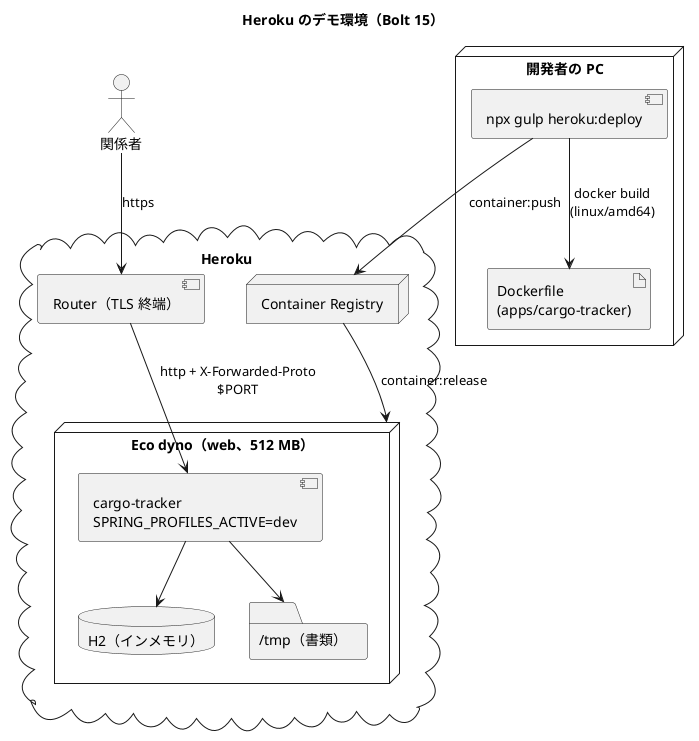

# Bolt 15 計画 - dev プロファイルによる Heroku のデモ環境

## 基本情報

| 項目 | 内容 |
| :--- | :--- |
| Bolt | 第 15 回 |
| 予定 | W3 の前（2026-10-06 から）、3〜4 時間 |
| 対象 | 技術タスク（SP 0）。ストーリーの受入条件は増やさない |
| GitHub | [#38 [技術] dev プロファイルによる Heroku のデモ環境](https://github.com/k2works/practical-domain-driven-design-in-enterpris-application/issues/38)（Milestone は Release 0.1、週は W3、Unit は横断、SP 0。確認ポイント 1） |
| 承認ゲート | 計画の承認（確認ポイント 1〜12）、外部連携（ステップ 3 の Heroku のアプリの作成と初回の配備。人が Heroku にログインする）、終了報告の 3 回 |
| アプローチ | 運用の Bolt。アプリの振る舞いは変えない。コンテナの起動を先にローカルで確かめ（ステップ 2）、同じイメージを Heroku に送る（ステップ 3）。運用の手順は手順書に定義したタスクだけで行う（CLAUDE.md「環境操作は運用手順書に従う」） |
| 範囲の決定 | 2026-10-06 に human:kakimomokuri が、Heroku のデモ環境を dev プロファイルで作ると決めた。アクセスの制限はしない。配備は Container Registry、dyno は Eco、W3 の前の Bolt 15 として行う |
| 前の Bolt | [Bolt 14 終了報告](bolt_14_report.md) |

## Bolt ゴール

関係者は、公開の URL（`https://cargo-tracker-mono-demo-<Heroku が付ける識別子>.herokuapp.com/`）をブラウザで開き、開発環境と同じ dev プロファイルの cargo-tracker を操作できる。ログインの画面で開発用の利用者（荷主担当者 2 人・営業担当者 1 人）を選んでログインし、輸送要求の提出から見積りの提示・詳細経路設計へ進むまでを、ローカルの `bootRun` と同じように試せる。開発者は、手順書に書いた Gulp のタスク 1 つでデモ環境へ配備し、状態とログを確かめられる。データは dyno の再起動で初期状態に戻ることを、利用者と開発者が知っている。

### 確かめたい仮説

| # | 仮説 | この Bolt で分かること |
| :--- | :--- | :--- |
| H1 | dev プロファイルに Heroku 向けの設定を足さず、環境変数（`SPRING_PROFILES_ACTIVE`・`PORT`・`JAVA_TOOL_OPTIONS`）だけで動かせる。Spring Boot は `DYNO` の環境変数で Heroku を検出し、`X-Forwarded-Proto` を読むので、ログインの後のリダイレクトが https のままになる | デモ環境のためにアプリの設定を分ける必要があるか |
| H2 | Java 25 と Spring Boot 4.1 は、JVM のヒープを絞れば Eco dyno（512 MB）で R14（メモリ超過）を出さずに起動し、デモの操作に耐える | dyno の種類の判断（足りなければ Basic・Standard-2X へ変える根拠） |
| H3 | Container Registry で、手元でビルドしたイメージをそのまま送れば、モノレポのまま（`apps/cargo-tracker` を切り出さずに）配備できる | 配備の方式の妥当性。W10 の AWS（ECR・ECS）で同じ Dockerfile を使えるか |

## ふりかえりと前の Bolt からの引き継ぎ

| 入力 | 内容 | この Bolt での扱い |
| :--- | :--- | :--- |
| 人の決定（2026-10-06） | dev プロファイルの Heroku のデモ環境。アクセスの制限なし、Container Registry、Eco dyno、W3 の前の Bolt 15 | スコープ、確認ポイント 2〜6 |
| ADR-008（採用） | ステージング・本番は AWS（ECS Fargate・RDS・S3）。Heroku は「他のクラウド・PaaS」として却下した | デモ環境はステージング・本番ではない。ADR-008 は変えず、ADR 013 で役割の違いを書く（確認ポイント 2） |
| ADR-011 の決定 3、ADR-012 | 開発用の利用者と入力済みは dev だけ。dev の外では `DevLoginGuard` が起動を止める | デモ環境は dev で動かすので守りは働かない。それを ADR 013 に書く（確認ポイント 3） |
| ADR-010 | 書類の保存先はローカルのファイルシステム（`java.io.tmpdir`）。S3 は W10 | dyno の一時的なファイルシステムに置き、再起動で消えることを受け入れる（確認ポイント 7） |
| Try T-41 | 設定の値で決まる振る舞いのテストは、既定と違う値で 1 本書く | 起動の確認で、`PORT` を既定の 8080 と違う値にして確かめる（ステップ 2） |
| Try T-43 | 守りの部品は、守る対象より前に動くかを確かめる | デモ環境では `DevLoginGuard` が働かないことを、ステップ 2 で起動して確かめ、ADR 013 に書く |
| Try T-26・T-33・T-28・T-31 | push の後に CI を確かめる。時刻は最後のコミットの時刻。開発レビューを終了報告の前に。デモ項目を録画する | 全ステップ |

## スコープ

### 入れるもの・入れないもの

| 入れるもの | 入れないもの |
| :--- | :--- |
| 実行用の `apps/cargo-tracker/Dockerfile`（マルチステージ）と `.dockerignore` | PostgreSQL（Heroku Postgres）・S3 互換のストレージ。データは永続化しない |
| Gulp の運用タスク `heroku:*`（`ops/scripts/heroku.js`）と `gulpfile.js` への登録 | GitHub Actions からの自動配備（手元の Gulp のタスクだけ） |
| 手順書 `docs/operation/cargo-tracker/heroku_demo_setup.md` と運用の索引 | アクセスの制限（Basic 認証など）。人の決定で入れない |
| ADR 013（デモ環境の位置づけ）。インフラストラクチャアーキテクチャの環境構成に 1 行足す | 独自ドメイン・TLS の証明書の設定（`herokuapp.com` のまま） |
| Heroku のアプリの作成・Config Vars・初回の配備（人のログインの後） | アプリのコードの変更。H1 が外れたときだけ、ステップ 2 で人に諮る |

### 構成

## 入力

- [リリース計画](release_plan.md)（W2・W3、リスク管理）
- [ADR-008](../../adr/cargo-tracker/008-aws-container-platform.md)、[ADR-010](../../adr/cargo-tracker/010-required-document-storage-transaction.md)、[ADR-011](../../adr/cargo-tracker/011-mfa-totp.md)、[ADR-012](../../adr/cargo-tracker/012-authentication-principal-and-session.md)
- [インフラストラクチャアーキテクチャ](../../design/cargo-tracker/architecture_infrastructure.md)
- [アプリケーション開発環境セットアップ手順書](../../operation/cargo-tracker/application_development_setup.md)
- `apps/cargo-tracker/src/main/resources/application.properties`、`application-dev.properties`
- スキル `operating-setup`、`operating-script`、`operating-deploy`

## ステップ計画

各ステップの終わりに push し、CI を確かめる。

- [x] **1. ADR 013 の案と手順書の骨組みを書き、技術 Issue を立てる**（承認はステップ 3 の外部連携の承認ゲートとまとめて受ける）
  - ADR 013（提案）: デモ環境の目的、dev プロファイルで動かすこと、守りの層（`DevLoginGuard`）が働かないこと、アクセスの制限をしないこと、データが消えること、本物のデータを入れない運用、ADR-008 との役割の違い、やめ方（`heroku apps:destroy`）
  - 手順書 `heroku_demo_setup.md` の骨組み（前提・初回のセットアップ・配備・確認・ログ・停止と削除・費用・制約）
  - インフラストラクチャアーキテクチャの環境構成に、デモ環境（Heroku、dev、永続化なし）を 1 行足す
  - GitHub に技術 Issue を立て、Project のフィールド（リリース・週・Unit なし・SP 0）を設定する
  - 結果（17:00〜17:05 JST）: ADR-013（提案）、手順書の骨組み、インフラストラクチャアーキテクチャの環境構成のデモの行、ADR・運用・開発の索引と `mkdocs.yml`。[#38](https://github.com/k2works/practical-domain-driven-design-in-enterpris-application/issues/38) を立て、Project に Release 0.1・W3・横断・SP 0・In Progress を設定した（Unit は「なし」の値がないため「横断」）。`okf:check` は ERROR 0
- [x] **2. 実行用の Dockerfile を作り、ローカルのコンテナで起動を確かめる**
  - `apps/cargo-tracker/Dockerfile`: ビルドの段は `eclipse-temurin:25-jdk` で `./gradlew bootJar`（テストは CI に任せて飛ばす）、実行の段は `eclipse-temurin:25-jre`。root でない利用者で動かし、`server.port=${PORT:8080}` を起動の引数で渡す
  - `.dockerignore`: `build/`・`.gradle/`・IDE の設定を除く
  - 確かめること（Red の代わりに、まず Dockerfile のない状態で起動の確認のコマンドが失敗することを記録する）:
    - `PORT=5001`（既定と違う値。T-41）、`SPRING_PROFILES_ACTIVE=dev`、`DYNO=web.1`、メモリ 512 MB の制限（`docker run --memory=512m`）で起動し、`/login` が 200
    - `X-Forwarded-Proto: https` を付けたログインの後のリダイレクトの `Location` が https（H1）
    - 開発用の利用者のボタンでログインし、輸送要求の一覧が開く
    - 起動の後と、デモの操作の後の RSS とヒープの使用量（H2）
  - `JAVA_TOOL_OPTIONS` の初期値の案: `-XX:MaxRAMPercentage=60 -XX:+UseSerialGC -Xss512k -XX:ReservedCodeCacheSize=64m -XX:MaxMetaspaceSize=192m`（値は計測で決める）
  - 途中の結果（17:02〜17:16 JST）: Dockerfile のない状態のビルドの失敗を記録した（`failed to read dockerfile`）。bootJar だけのイメージは dev で起動に失敗した（`ClassNotFoundException: org.h2.Driver`）。H2 は `developmentOnly` で、AT-06（`verifyProductionClasspath`）が bootJar に入れないことを守っているため。確認ポイント 9 に従って止め、人に諮った（確認ポイント 13）。スクラッチの試作（bootJar を `jarmode tools extract` で展開し、H2 をクラスパスに足す）で、512 MB の制限・`PORT=5001` の下で 24 秒で起動し、メモリは 346 MiB。`X-Forwarded-Proto: https` でリダイレクトの `Location` が https のまま、開発用の利用者でログインして一覧が 200（H1 は成り立つ見込み）
  - 確認ポイント 13 の決定で作り直す: `build.gradle` に `developmentOnly` の H2 を `build/demo-lib` に写すタスク `copyDemoLibs` を足す（版は Spring Boot の BOM のまま。bootJar と AT-06 は変えない）。Dockerfile は `build`（`bootJar copyDemoLibs` と展開）、`runtime`（H2 なし。W10 の ECR・ECS 用）、`demo`（`runtime` に H2 を足す。Heroku 用）の 3 つのステージにする。Heroku へは `--target demo --provenance=false` でビルドする（Container Registry は provenance の attestation 付きの manifest list を受けないため）
  - 追加で確かめること: `runtime` のステージのイメージに H2 がないこと（dev で起動すると `org.h2.Driver` で失敗する）
  - 結果（17:16〜17:35 JST）:
    - Red: `copyDemoLibs` がない状態で `Task 'copyDemoLibs' not found`。足した後、`build/demo-lib` は `h2-2.4.240.jar` だけ（devtools は写らない）
    - `runtime` のイメージは dev で起動に失敗した（`ClassNotFoundException: org.h2.Driver`。14 秒で停止）。H2 が入っていないことを確かめた
    - `demo` のイメージは、512 MB の制限・`PORT=5001`・`DYNO=web.1` で 24.5 秒で起動した（R10 の 60 秒の内）。起動の後 358 MiB、荷主・営業のログインと画面の操作の後 367 MiB（R14 の 512 MB の内。H2 は成り立つ見込み）
    - `X-Forwarded-Proto: https` で、ログインの前後のリダイレクトの `Location` が https のまま（H1 は成り立つ）。荷主・営業の開発用の利用者でログインし、荷主の一覧・新規が 200、営業の一覧が 200、営業から荷主の画面が 403
    - イメージの大きさは `runtime` 563 MB、`demo` 568 MB。ビルドは初回 3 分半（依存のキャッシュの後は 1 分弱）
    - 途中で、展開した jar の名前が `cargo-tracker-0.0.1-SNAPSHOT.jar` になり、`app.jar` を指す起動が失敗したため、展開の前に `app.jar` に名前を変えた
    - `./gradlew check verifyProductionClasspath` は緑（4 分 20 秒）
- [ ] **3. Heroku のアプリを作り、初回の配備をする** 【承認ゲート: 外部連携】
  - 人が `! heroku login` と `! heroku container:login` を実行する（AI はログインできない）
  - Gulp のタスクを作る（`operating-script` スキルに従う）:

    | タスク | 中身 |
    | :--- | :--- |
    | `heroku:setup` | アプリの作成（stack は `container`、region は確認ポイント 5）、Config Vars の設定、dyno の種類を Eco にする。2 回目以降は差分だけ |
    | `heroku:deploy` | `docker build --platform linux/amd64` → `heroku container:push web` → `heroku container:release web` |
    | `heroku:status` | `heroku ps`、release の一覧、URL |
    | `heroku:logs` | `heroku logs --tail` |
    | `heroku:restart` | `heroku ps:restart`（デモの前にデータを初期状態に戻す） |
    | `heroku:open` | ブラウザで URL を開く |

  - アプリ名と Config Vars（`SPRING_PROFILES_ACTIVE=dev`、`JAVA_TOOL_OPTIONS`）は `ops/scripts/heroku.js` の設定か環境変数で持ち、秘密はない（dev の固定値だけ）
  - `npx gulp heroku:setup` と `npx gulp heroku:deploy` で配備し、`heroku:status` と `heroku:logs` で起動と R14 が出ないことを確かめる
- [ ] **4. デモ環境でデモ項目を確かめ、手順書を仕上げる**
  - 下の「デモ項目」1〜4 を公開の URL で行い、録画する（T-31）
  - 30 分の無アクセスでスリープした後の起動の時間を計る（Eco の制約。手順書の「デモの前に」に書く）
  - 手順書を実際に行ったコマンドと結果で仕上げ、運用の索引（`docs/operation/cargo-tracker/index.md`）とアプリの README に足す
  - `operating-docs` で索引と `mkdocs.yml` を同期し、`apply-okf` で変更した文書に規約を適用する
- [ ] **5. 運用レビューと Bolt 終了報告**
  - `operating-review` で、手順書・Gulp のタスク・Dockerfile・ADR 013 をレビューし、指摘への対応を終了報告に書く（T-28）
  - `bolt_15_report.md` に仮説 H1〜H3 の結論、メモリの計測値、各ステップの時刻、所要時間を書く
  - リリース計画の W3 に Bolt 15 を足し、実績スケジュール・リスク管理（デモ環境のリスク）を更新する。技術 Issue をクローズする

### 時間の配分と打ち切り

| ステップ | 目安 |
| :--- | :--- |
| 1 | 30 分 |
| 2 | 60 分 |
| 3 | 45 分（人のログインの待ちを除く） |
| 4 | 45 分 |
| 5 | 40 分 |
| 合計 | 220 分 |

4 時間を超えそうなときは、次の順で次の Bolt に回す。

1. `heroku:open`・`heroku:restart` のタスク（手順書に `heroku` のコマンドを書いて代える）
2. スリープからの起動の時間の計測

Eco で R14 が続く（H2 が外れる）ときは、ここで止めて dyno の種類の変更を人に諮る。

## 確認ポイント（計画の承認の場でまとめて確認する。Try T-6）

| # | 確認すること | ステップ | 理由 |
| :--- | :--- | :--- | :--- |
| 1 | 新しい技術 Issue を立て、Milestone は Release 0.1、週は W3、SP 0 にする。リリース計画の W3 の主なタスクの先頭に Bolt 15 を足す | 1、5 | 計画の置き場（人の決定） |
| 2 | ADR 013「dev プロファイルによる Heroku のデモ環境」（新規、提案）を書く。ADR-008 は変えない（ステージング・本番は AWS のまま。デモ環境は関係者が触って確かめるための環境で、非機能要件の対象にしない） | 1 | 新規ファイルの作成。外部連携。ADR-008 の「他のクラウド・PaaS は却下」と矛盾しないことを示す |
| 3 | デモ環境は dev で動かすため、`DevLoginGuard` は働かず、固定の password の開発用の利用者で誰でもログインできる。アクセスの制限はしない（人の決定）。代わりに、本物の荷主・利用者のデータを入れないことを手順書と ADR 013 に書き、URL は関係者にだけ伝える | 1、4 | セキュリティ。制限しないことの帰結を記録に残す |
| 4 | 新規ファイルは次の 6 つ: `apps/cargo-tracker/Dockerfile`、`apps/cargo-tracker/.dockerignore`、`ops/scripts/heroku.js`、`docs/operation/cargo-tracker/heroku_demo_setup.md`、`docs/adr/cargo-tracker/013-heroku-demo-environment.md`、`bolt_15_report.md`。既存のリポジトリのルートの `Dockerfile`（開発用のツールのイメージ）とは別にする | 1〜5 | 新規ファイルの作成。ルートの `Dockerfile` は Ubuntu の開発環境で、実行用ではない |
| 5 | アプリ名は `cargo-tracker-mono-demo`（2026-10-06 に human:kakimomokuri が決定。使われていたら作成の前に人に諮る）、region は `us`（Common Runtime で選べるのは `us`・`eu`。日本からの遅さはデモでは許す） | 3 | 外部の資源の名前。URL になる |
| 6 | dyno は Eco（月 5 USD の定額で、アカウントの全 Eco dyno に共通）。費用は人の Heroku のアカウントに付く。30 分アクセスがないとスリープし、次のアクセスで起動を待つ | 3 | 費用（人の決定） |
| 7 | データ（H2 のインメモリ、書類の `/tmp`）は dyno の再起動（1 日 1 回以上の自動の再起動、配備、スリープ）で消え、`db/dev-data` の初期状態に戻る。永続化はしない | 1、4 | データ。デモの前に `heroku:restart` で初期状態に戻せることを利点として使う |
| 8 | イメージは手元の Docker でビルドする（`linux/amd64`）。ビルドの段で `bootJar` だけを行い、テストは CI（`cargo-tracker-ci.yml`）の緑を前提にする。配備は develop の緑のコミットからだけ行うことを手順書に書く | 2、3 | 品質の担保の置き場所 |
| 9 | アプリの設定ファイル（`application*.properties`）は変えない。Heroku 向けの値は Config Vars と起動の引数だけで渡す（H1）。H1 が外れたら（https のリダイレクトが http になるなど）、ステップ 2 で止めて人に諮る | 2 | アプリの変更をしない範囲の決定 |
| 10 | GitHub Actions からの自動配備は作らない。必要になったら、W10 の CI/CD（`operating-cicd`）で AWS と一緒に決める | 3 | 外部連携の範囲を小さく保つ |
| 11 | デモ環境の画面に「デモ環境」の表示（バナー）は出さない（アプリの変更になるため）。必要なら次の Bolt で、dev プロファイルの表示として決める | — | UI の変更をこの Bolt に入れない |
| 12 | Heroku の CLI は 10.16.0 のまま使う（更新は求められれば人が行う）。`heroku login` は対話のため人が行う | 3 | 外部のツール |
| 13 | （ステップ 2 で追加）dev の H2 はデモのイメージにだけ入れる。`build.gradle` に `copyDemoLibs`（`developmentOnly` の H2 を `build/demo-lib` へ）を足し、Dockerfile を `runtime`（H2 なし）と `demo`（H2 あり）のステージに分ける。bootJar と AT-06 は変えない | 2、3 | ビルドの構成の変更。本番の成果物に H2 を入れない約束（ADR-007、AT-06）を守ったまま、dev のデモを動かす |

決定（2026-10-06、human:kakimomokuri）: 確認ポイント 1〜12 はすべて上の案で決まった。

確認ポイント 13 は、ステップ 2 の途中で human:kakimomokuri が 3 つの案（Gradle のタスクと demo のステージ、Dockerfile だけで Maven Central から取る、デモ用の bootJar）から選び、計画の変更の承認で確定した（2026-10-06）。

## AI の仮定

- Heroku の Container Registry は、Eco dyno でも使える。
- Spring Boot 4.1 は `DYNO` の環境変数で Heroku を検出し、forward headers の扱いを有効にする（Spring Boot 2 系からの振る舞いが続いている）。ステップ 2 で確かめる。
- dev の `server.servlet.session.cookie.secure=false` は、Heroku の Router が TLS を終端するので、ブラウザとの間は https のままで問題ない（Secure が付かないだけ）。
- Heroku の Router の 30 秒のタイムアウトと、上り 1 リクエストの大きさに、書類の添付（合計 55 MB まで）が引っかかることがある。デモでは小さいファイルを使い、手順書の制約に書く。

## リスクと対策

| リスク | 影響 | 対策 |
| :--- | :--- | :--- |
| Eco（512 MB）でメモリが足りず R14・R15 になる | 起動しない、デモの途中で落ちる | ステップ 2 で `--memory=512m` の計測をしてから送る。足りなければ人に諮る |
| 起動に 60 秒を超えて R10（起動のタイムアウト）になる | 配備に失敗する | ステップ 2 で起動の時間を計る。Flyway と H2 の初期化の時間を見て、`-XX:TieredStopAtLevel=1` などを試す |
| 誰でもログインでき、だれかが本物のデータや不適切なファイルを入れる | 情報の漏えい、不適切な内容の公開 | 本物のデータを入れない運用を手順書と ADR に書く。再起動で消える。問題があれば `heroku:restart` か `heroku ps:scale web=0` で止める |
| 手元のビルドが CI と違うコミットから行われる | 未検証のコードがデモに出る | 手順書で、develop の緑のコミットから配備すると決める。`heroku:deploy` で作業ツリーに変更があれば止める |
| Heroku の費用が人の想定を超える | 費用 | Eco の定額だけを使う。手順書に費用と削除の手順を書く |

## 完了条件

### Definition of Done

- [ ] ステップ 1〜5 が完了し、計画・外部連携（ステップ 3）・終了報告の承認ゲートを人が通した
- [ ] `./gradlew check` と `./gradlew uiTest` がローカルと CI の両方で緑（アプリのコードは変えていない）
- [ ] ローカルのコンテナ（`PORT=5001`、メモリ 512 MB）で起動し、https のリダイレクトとログインを確かめた
- [ ] 公開の URL でデモ項目 1〜4 を確かめ、録画した
- [ ] `npx gulp heroku:deploy` 1 つで配備でき、手順書のコマンドだけで状態・ログ・再起動・削除を行える
- [ ] ADR 013 と手順書に、dev で動かすこと・アクセスの制限がないこと・データが消えること・本物のデータを入れないことが書かれている
- [ ] 運用レビューを行い、指摘への対応を終了報告に書いた
- [ ] `bolt_15_report.md` に仮説 H1〜H3 の結論、メモリと起動の時間の計測値、所要時間を書いた
- [ ] 技術 Issue をクローズし、リリース計画を更新した

### デモ項目

| # | デモ | 確かめること |
| :--- | :--- | :--- |
| 1 | 公開の URL を開き、荷主担当者の開発用の利用者を選んでログインする | https のまま A-01 から荷主のホームへ移る |
| 2 | 荷主担当者が輸送要求を提出し、営業担当者に切り替えて審査・見積りの提示をする | ローカルの `bootRun` と同じ流れが通る |
| 3 | `npx gulp heroku:restart` の後に開き直す | データが初期状態に戻る |
| 4 | `npx gulp heroku:status`・`heroku:logs` | dyno の状態、release、ログに R14 がない |

## 更新履歴

| 日付 | 内容 | 作成 | 承認 |
| :--- | :--- | :--- | :--- |
| 2026-10-06 | 初版（人の依頼で、W3 の前に dev プロファイルの Heroku のデモ環境を作る。アクセスの制限なし、Container Registry、Eco dyno、Bolt 15 は人の決定） | anthropic/claude-opus-5-5 | — |
| 2026-10-06 | 人の決定で、アプリ名を `cargo-tracker-mono-demo` にした（確認ポイント 5） | anthropic/claude-opus-5-5 | — |
| 2026-10-06 | 計画を承認。確認ポイント 1〜12 も決まった（Try T-6） | anthropic/claude-opus-5-5 | human:kakimomokuri |
| 2026-10-06 | ステップ 2 の途中で、bootJar に H2 がなく dev で起動しないことが分かった。人の選択で確認ポイント 13（`copyDemoLibs` と Dockerfile の `runtime`・`demo` のステージ）を足し、ステップ 2 を直した | anthropic/claude-opus-5-5 | — |
| 2026-10-06 | 計画の変更（確認ポイント 13、ステップ 2）を承認 | anthropic/claude-opus-5-5 | human:kakimomokuri |

## 関連ドキュメント

- [リリース計画](release_plan.md)（W3）
- [開発戦略](development_strategy.md)
- [Bolt 14 計画](bolt_14_plan.md)、[Bolt 14 終了報告](bolt_14_report.md)
- [ADR-008 AWS の ECS Fargate・RDS・S3 で実行する](../../adr/cargo-tracker/008-aws-container-platform.md)、[ADR-012 認証の主体と session](../../adr/cargo-tracker/012-authentication-principal-and-session.md)
- [アプリケーション開発環境セットアップ手順書](../../operation/cargo-tracker/application_development_setup.md)
