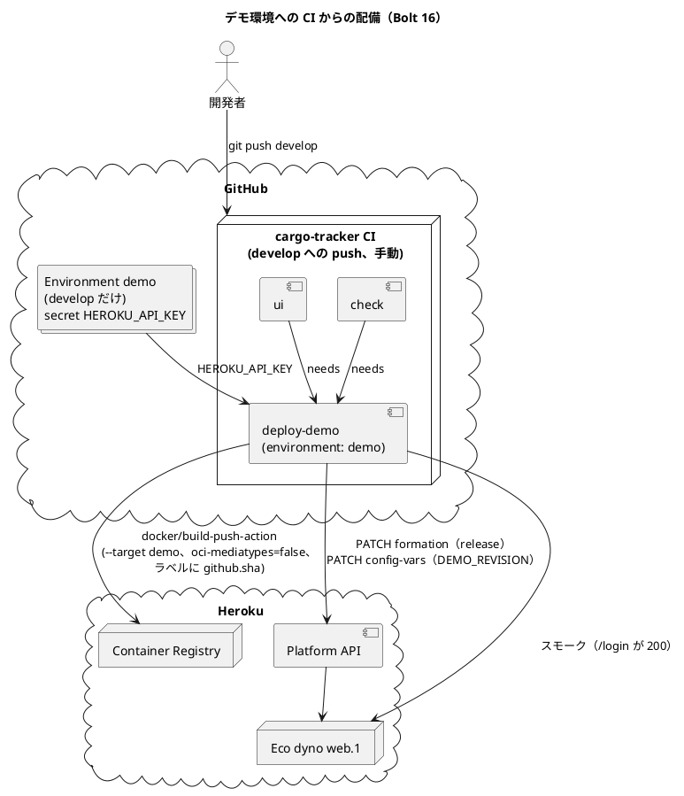

# Bolt 16 計画 - デモ環境への CI からの配備

## 基本情報

| 項目 | 内容 |
| :--- | :--- |
| Bolt | 第 16 回 |
| 予定 | W3 の前（2026-10-07 から）、2〜3 時間 |
| 対象 | 技術タスク（SP 0）。ストーリーの受入条件は増やさない |
| GitHub | [#39 [技術] デモ環境への CI からの配備](https://github.com/k2works/practical-domain-driven-design-in-enterpris-application/issues/39)（Milestone は Release 0.1、週は W3、Unit は横断、SP 0） |
| 承認ゲート | 計画の承認（確認ポイント 1〜12）、外部連携とセキュリティ（ステップ 3。Environment と secret、最初の CI からの配備）、終了報告の 3 回 |
| アプローチ | 運用の Bolt。アプリの振る舞いは変えない。ワークフローの静的な検査（actionlint）を先に通し、最初の develop への push で配備のジョブを動かして確かめる |
| 範囲の決定 | 2026-10-07 に human:kakimomokuri が、develop の CI が緑なら自動で配備する、Heroku の API キーは GitHub の Environment `demo` の secret に置く、W3 の前の Bolt 16 として行う、と決めた |
| 前の Bolt | [Bolt 15 終了報告](bolt_15_report.md) |

## Bolt ゴール

develop にアプリの変更を push すると、cargo-tracker CI の check と ui が緑になった後に、同じワークフローの `deploy-demo` ジョブがデモ環境へ配備する。配備の後、デモ環境の `DEMO_REVISION` は push したコミットになり、ログインの画面が 200 を返す。開発者は手元で `deploy:demo` を実行しなくても、デモ環境が develop の最新の緑のコミットになっていると分かる。API キーは人だけが扱い、develop の外からは使えない。

### 確かめたい仮説

| # | 仮説 | この Bolt で分かること |
| :--- | :--- | :--- |
| H1 | 配備のジョブを check・ui の後ろに置き（`needs`）、Environment `demo` を develop に限れば、手元の `deploy:demo` のガード（作業ツリー・develop・CI の緑）と同じ約束を、Gulp を使わずに CI だけで守れる | ガードを CI の仕組み（`needs`、Environment のブランチの規則）に置き換えられるか |
| H2 | Heroku CLI を入れずに、`docker/build-push-action`（Docker v2 の manifest）と Heroku Platform API（formation の更新と Config Vars）だけで release できる | ランナーへの追加の導入なしで配備できるか。Ubuntu 24.04 のランナーには Heroku CLI がない |
| H3 | buildx の GitHub Actions のキャッシュ（`type=gha`）を使えば、依存が変わらないときの配備のジョブは 5 分以内に終わる | 毎回の push の後、デモ環境に出るまでの時間 |

## ふりかえりと前の Bolt からの引き継ぎ

| 入力 | 内容 | この Bolt での扱い |
| :--- | :--- | :--- |
| 人の決定（2026-10-07） | develop の CI が緑なら自動配備。API キーは Environment `demo` の secret。Bolt 16 | スコープ、確認ポイント 1〜4 |
| Bolt 15 の確認ポイント 10 | 「GitHub Actions からの自動配備は作らない。必要になったら W10 の CI/CD で決める」 | 人の決定で改める。ADR-013 の「配備」を直す（確認ポイント 5） |
| ADR-013 | 配備のガード（develop、`origin/develop`、CI の緑、SHA のラベル、`DEMO_REVISION`）、`oci-mediatypes=false` | CI の配備も同じ約束を守る（確認ポイント 6・7） |
| ADR-008 のコンプライアンス | GitHub Actions に長期のアクセスキーを置かず、AWS へは OIDC で認証する | AWS 向けの約束。Heroku は OIDC に対応しないため長期のキーを置く。範囲を Environment `demo` と develop に限り、期限を付ける（確認ポイント 3） |
| Bolt 15 レビュー R-13・R-24 | CI でのイメージの検証、アクションの SHA の固定 | 配備の後のスモーク（`/login` が 200）を入れる。新しく使うアクションは SHA で固定する。`runtime` の検証は W10 のまま |
| Try T-44 | 資源の設定は目標の環境で計測してから決める | 配備のジョブの時間を実際の実行で計る（H3） |
| Try T-45 | 守りの部品は、変更をコミットしてから確かめる | Environment のブランチの規則は、設定の後に API で読み返して確かめる |
| Try T-46 | 公開の範囲に関わる約束は、置き場所の公開の範囲を確かめてから書く | リポジトリは公開。ワークフローのログは公開で読めるため、キーや Config Vars の値をログに出さない（確認ポイント 8） |

## スコープ

### 入れるもの・入れないもの

| 入れるもの | 入れないもの |
| :--- | :--- |
| `.github/workflows/cargo-tracker-ci.yml` に `deploy-demo` ジョブ（`needs: [check, ui]`、develop の push と手動の実行だけ）と `workflow_dispatch` | main・Pull Request からの配備 |
| GitHub の Environment `demo`（配備のブランチを develop に限る）と secret `HEROKU_API_KEY`（値は人が作って登録する） | Heroku CLI のランナーへの導入 |
| Heroku Platform API での release（formation の更新）と `DEMO_REVISION` の設定、配備の後のスモーク | 配備の失敗の通知（Slack など）。GitHub の通知だけ |
| ADR-013・手順書・インフラストラクチャアーキテクチャの CI/CD の節の更新 | `runtime` のイメージの検証と ECR・ECS（W10 の #28） |
| 手元の `deploy:demo` は残す（CI が止まったとき・手動の確かめ用） | `deploy_demo.js` を CI から呼ぶ形への作り替え |

### 構成

## 入力

- [Bolt 15 計画](bolt_15_plan.md)、[Bolt 15 終了報告](bolt_15_report.md)、[Bolt 15 運用成果物レビュー](../../review/cargo-tracker/bolt_15_review_20261006.md)
- [ADR-013](../../adr/cargo-tracker/013-heroku-demo-environment.md)、[ADR-008](../../adr/cargo-tracker/008-aws-container-platform.md)
- [Heroku デモ環境セットアップ手順書](../../operation/cargo-tracker/heroku_demo_setup.md)
- `.github/workflows/cargo-tracker-ci.yml`、`apps/cargo-tracker/Dockerfile`、`ops/scripts/deploy_demo.js`
- スキル `operating-cicd`、`operating-review`

## ステップ計画

各ステップの終わりに push し、CI を確かめる。

- [x] **1. 決定を ADR-013 と手順書に反映する案を書き、技術 Issue を立てる**（承認はステップ 3 の承認ゲートとまとめて受ける）
  - ADR-013: 「配備」に CI の `deploy-demo` を足し、手元の `deploy:demo` は CI が使えないときの手段にする。ガードの約束を CI の仕組み（`needs`、Environment のブランチの規則）で守ることを書く。ネガティブに長期の API キーを足す。代替案に「自動配備を作らない（Bolt 15 の確認ポイント 10）」を足す
  - 手順書: 「3. 配備」に CI からの配備を先に書き、手元の配備を後に置く。初回のセットアップに Environment と secret の作り方、キーの更新（期限の前）と失効のさせ方を足す
  - インフラストラクチャアーキテクチャの CI/CD の節に、デモ環境の配備を 1 行足す
  - GitHub に技術 Issue を立て、Project のフィールドを設定する
  - 結果（09:58〜10:06 JST）: ADR-013 に改訂の注記、配備・CI の認証・配備のガードの行、代替案 2 つ、ネガティブ 2 つ、コンプライアンス 1 つを足した。手順書に CI からの配備（通常）と手元からの配備、Environment と secret の作り方・キーの更新と失効を足した。インフラストラクチャアーキテクチャの CI/CD の節に 1 行足した。[#39](https://github.com/k2works/practical-domain-driven-design-in-enterpris-application/issues/39) を立て、Project に Release 0.1・W3・横断・SP 0・In Progress を設定した
- [ ] **2. `deploy-demo` ジョブを書き、静的に検査する**
  - Red: ジョブを足す前に、ワークフローに `deploy-demo` がないことと、actionlint（`rhysd/actionlint` のコンテナ）が今のワークフローで通ることを記録する
  - `on` に `workflow_dispatch` を足す（`push` の `paths` は変えない。アプリの変更でだけ配備する）
  - `deploy-demo` ジョブ:
    - `needs: [check, ui]`、`if: github.ref == 'refs/heads/develop' && (github.event_name == 'push' || github.event_name == 'workflow_dispatch')`
    - `environment: { name: demo, url: <デモ環境の URL> }`
    - ジョブの `concurrency: { group: cargo-tracker-demo-deploy, cancel-in-progress: false }`（手元の配備とは排他にできないため、手順書で「CI の実行中は手元で配備しない」と書く）
    - `docker/setup-buildx-action`（v4.4.1、`f87e599`）、`docker/login-action`（v4.6.0、`dbcb813`。`registry.heroku.com`、ユーザー名 `_`、パスワードは secret）、`docker/build-push-action`（v7.4.0、`c3c9e26`。`target: demo`、`platforms: linux/amd64`、`provenance: false`、`sbom: false`、`outputs: type=image,name=registry.heroku.com/cargo-tracker-mono-demo/web,push=true,oci-mediatypes=false`、`labels: org.opencontainers.image.revision=${{ github.sha }}`、`cache-from/to: type=gha,mode=max`）。どれも SHA で固定する
    - release: `curl` で `PATCH https://api.heroku.com/apps/cargo-tracker-mono-demo/formation`（`Accept: application/vnd.heroku+json; version=3.docker-releases`、`updates: [{type: web, docker_image: <build-push-action の imageid>}]`）
    - `PATCH /apps/cargo-tracker-mono-demo/config-vars` で `DEMO_REVISION=${{ github.sha }}`
    - スモーク: `/login` が 200 になるまで最大 120 秒待つ。来なければジョブを失敗にする
    - キーは `env` で渡し、コマンドの引数やログに出さない。`curl` は `--fail-with-body --silent --show-error` にし、応答の本文は出さない
  - actionlint を通す
- [ ] **3. Environment と secret を用意し、最初の CI からの配備を確かめる** 【承認ゲート: 外部連携・セキュリティ】
  - AI が `gh api` で Environment `demo` を作り、配備のブランチの規則を develop だけにする。読み返して確かめる
  - 人が API キーを作って登録する（AI はキーの値に触れない）:
    `! heroku authorizations:create -S -d "GitHub Actions cargo-tracker demo deploy" -e 31536000 | gh secret set HEROKU_API_KEY --env demo`
  - `gh secret list --env demo` で名前だけを確かめる
  - push して CI を見る: check・ui の後に `deploy-demo` が動き、`deploy:demo:status` で `DEMO_REVISION` が push したコミットになり、R14 がないこと
  - 手動の実行（`gh workflow run cargo-tracker-ci.yml --ref develop`）でも配備のジョブが動くこと
- [ ] **4. 手順書を仕上げ、ガードが止める場合を確かめる**
  - develop の外のブランチから `workflow_dispatch` を実行し、`deploy-demo` が動かない（`if` で飛ぶ）ことを確かめる。確かめに使ったブランチは消す
  - 配備のジョブの時間を記録する（H3）
  - 手順書・README・索引を実際の結果で仕上げる。`operating-docs` と `apply-okf` を行う
- [ ] **5. 運用レビューと Bolt 終了報告**
  - `operating-review` でワークフロー・ADR-013・手順書をレビューし、指摘への対応を終了報告に書く
  - `bolt_16_report.md` に仮説 H1〜H3 の結論、各ステップの時刻、所要時間を書く
  - リリース計画の W3 に Bolt 16 を足す。技術 Issue をクローズする

### 時間の配分と打ち切り

| ステップ | 目安 |
| :--- | :--- |
| 1 | 20 分 |
| 2 | 40 分 |
| 3 | 40 分（人のキーの登録と CI の待ちを除く） |
| 4 | 25 分 |
| 5 | 40 分 |
| 合計 | 165 分 |

3 時間を超えそうなときは、次の順で次の Bolt に回す。

1. buildx の GitHub Actions のキャッシュ（H3。毎回すべてをビルドしてもよい）
2. develop の外からの `workflow_dispatch` の確かめ（Environment の規則を API で読み返したことで代える）

`needs`、Environment のブランチの規則、キーをログに出さないこと、スモークは削らない。

## 確認ポイント（計画の承認の場でまとめて確認する）

| # | 確認すること | ステップ | 理由 |
| :--- | :--- | :--- | :--- |
| 1 | 新しい技術 Issue を立て、Milestone は Release 0.1、週は W3、Unit は横断、SP 0 にする。リリース計画の W3 の Bolt 15 の次に Bolt 16 を足す | 1、5 | 計画の置き場（人の決定） |
| 2 | 配備のきっかけは、develop への push（アプリの変更で CI が動いたとき）で check・ui が緑になったとき、と develop での手動の実行（`workflow_dispatch`）。設計文書だけの変更（CI の `paths` の `docs/design/**`）でも CI が動くので、そのときも配備する（イメージは変わらないが、`DEMO_REVISION` は新しいコミットになる） | 2 | 人の決定。CI の `paths` は変えない |
| 3 | API キーは Heroku の authorization（期限 1 年、`-e 31536000`）を人が作り、Environment `demo` の secret に人が登録する。AI はキーの値を見ない・扱わない。スコープは `global` のまま（Container Registry への push に要る）。キーの更新は期限の 1 か月前に手順書のコマンドで行い、漏えいの疑いがあれば `heroku authorizations:revoke` で失効させる | 3 | セキュリティ。長期のキーを置く（ADR-008 の OIDC の約束は AWS 向け） |
| 4 | Environment `demo` の配備のブランチの規則を develop だけにする。必須のレビュアーは付けない（develop の緑で自動に配備する人の決定のため） | 3 | セキュリティと人の決定 |
| 5 | ADR-013 の「配備」を、CI の `deploy-demo` を主とし、手元の `deploy:demo` を CI が使えないときの手段にする、と直す（Bolt 15 の確認ポイント 10 を改める）。ADR は承認済みのまま、更新履歴に足す | 1 | 承認済みの ADR の変更 |
| 6 | CI の配備でも、イメージのラベルと `DEMO_REVISION` に `github.sha` を入れる。手元の `deploy:demo:status` で同じように確かめられる | 2 | Bolt 15 の約束（R-04）を CI にも |
| 7 | Heroku CLI はランナーに入れず、Platform API を `curl` で呼ぶ（formation の更新、Config Vars）。手元の `deploy_demo.js` は変えない | 2 | 追加の導入をしない（H2） |
| 8 | ワークフローのログは公開で読めるため、キー・Config Vars の値・API の応答の本文をログに出さない。`DEMO_REVISION` の値（コミットの SHA）だけは出してよい | 2 | セキュリティ（T-46） |
| 9 | 配備のジョブは、手元の `deploy:demo` と排他にできない。手順書に「CI の配備の実行中は手元で配備しない」と書く。CI の `concurrency`（develop で実行中のものを取り消す）で、配備の途中のジョブが取り消されることがある。そのときは次の push か手動の実行で配備し直す | 2、4 | 運用の約束 |
| 10 | 新しく使う 3 つのアクションは、既存のワークフローの書き方に合わせて SHA で固定し、末尾に版を書く | 2 | 既存の規約（Bolt 15 レビュー R-24） |
| 11 | 新規ファイルは `bolt_16_report.md` だけ（計画は本ファイル）。変えるのは `cargo-tracker-ci.yml`、ADR-013、手順書、インフラストラクチャアーキテクチャ、索引、リリース計画 | 1〜5 | 新規ファイルの作成 |
| 12 | 配備の失敗は、GitHub の Actions の失敗の通知だけで知る。失敗したときは前の release のまま動き続ける（Heroku は失敗した release を出さない） | 2 | 運用 |

決定（2026-10-07、human:kakimomokuri）: 確認ポイント 1〜12 はすべて上の案で決まった。

## AI の仮定

- `docker/build-push-action` の出力 `imageid` は、Heroku の formation の更新に渡す `docker_image`（設定の digest、`sha256:…`）と同じ値である。違えば `docker buildx imagetools inspect` で取り直す。
- Heroku の Container Registry へのログインは、ユーザー名 `_`、パスワードに API キーで通る。
- `ubuntu-latest` のランナーには Docker と buildx がある。
- GitHub Actions のキャッシュ（`type=gha`）は、公開のリポジトリで使える。

## リスクと対策

| リスク | 影響 | 対策 |
| :--- | :--- | :--- |
| API キーの漏えい（ログ、フォークの Pull Request） | 人の Heroku のアカウント全体を操作される | Environment `demo` を develop に限り、Pull Request では配備のジョブを動かさない（`if`）。キーを `env` で渡し、出力しない。期限 1 年。漏えいの疑いで失効 |
| CI の時間が長くなる（毎回ビルドして push） | push の後の待ちが増える | 配備のジョブは check・ui の後に別のジョブで動くので、check・ui の結果は先に分かる。キャッシュ（H3） |
| 手元の配備と CI の配備が重なる | どちらのコミットが出たか分からなくなる | 手順書で手元の配備を「CI が使えないとき」に限る。`DEMO_REVISION` で確かめる |
| Platform API の release の形式の誤り | 配備のジョブが失敗する | 失敗しても前の release のまま。手元の `deploy:demo` で戻せる |

## 完了条件

### Definition of Done

- [ ] ステップ 1〜5 が完了し、計画・外部連携とセキュリティ（ステップ 3）・終了報告の承認ゲートを人が通した
- [ ] actionlint が通り、develop への push で check・ui の後に `deploy-demo` が緑になった
- [ ] 配備の後の `DEMO_REVISION` が push したコミットで、`/login` が 200、R14 がない
- [ ] 手動の実行で配備でき、develop の外からは配備のジョブが動かない
- [ ] キーの値がリポジトリ・ログ・会話に出ていない。Environment `demo` が develop に限られている
- [ ] ADR-013 と手順書に、CI からの配備、キーの作り方・更新・失効、手元の配備との関係が書かれている
- [ ] 運用レビューを行い、指摘への対応を終了報告に書いた
- [ ] `bolt_16_report.md` に仮説 H1〜H3 の結論、配備のジョブの時間、所要時間を書いた
- [ ] 技術 Issue をクローズし、リリース計画を更新した

### デモ項目

| # | デモ | 確かめること |
| :--- | :--- | :--- |
| 1 | develop にアプリの変更を push する | Actions で check・ui の後に `deploy-demo` が動き、Environment `demo` の配備の履歴に URL が出る |
| 2 | `npx gulp deploy:demo:status` | `DEMO_REVISION` が push したコミット |
| 3 | develop の外のブランチから手動で実行する | `deploy-demo` が飛ばされる |

## 更新履歴

| 日付 | 内容 | 作成 | 承認 |
| :--- | :--- | :--- | :--- |
| 2026-10-07 | 初版（人の依頼で、デモ環境を CI から配備する。きっかけ・認証・置き場は人の決定） | anthropic/claude-opus-5-5 | — |
| 2026-10-07 | 計画を承認。確認ポイント 1〜12 も決まった | anthropic/claude-opus-5-5 | human:kakimomokuri |

## 関連ドキュメント

- [リリース計画](release_plan.md)（W3）
- [Bolt 15 計画](bolt_15_plan.md)、[Bolt 15 終了報告](bolt_15_report.md)
- [ADR-013 デモ環境](../../adr/cargo-tracker/013-heroku-demo-environment.md)
- [Heroku デモ環境セットアップ手順書](../../operation/cargo-tracker/heroku_demo_setup.md)
