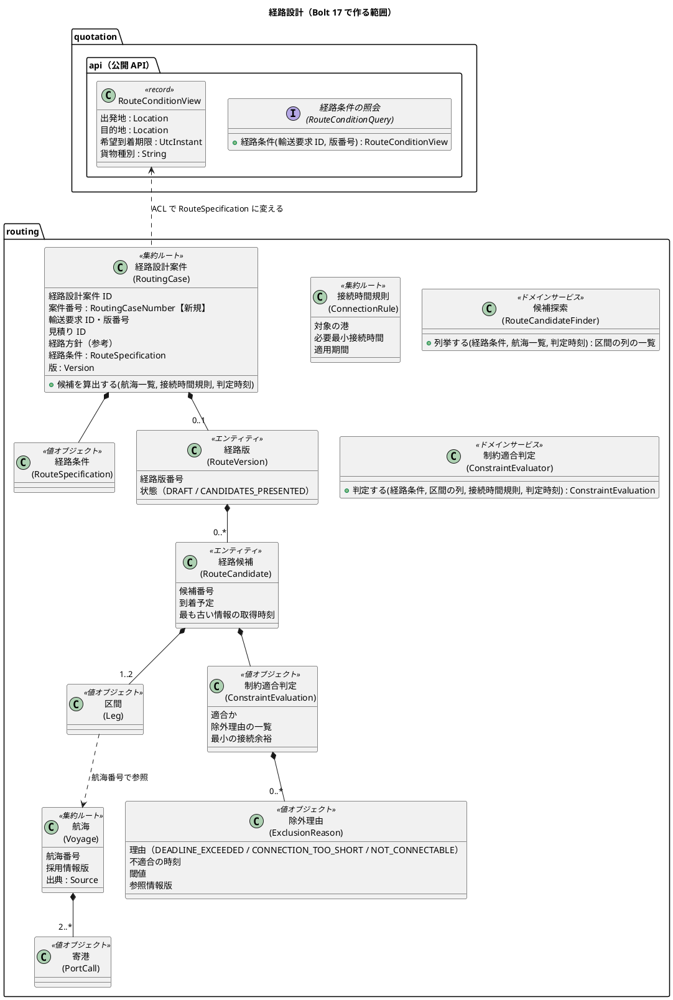
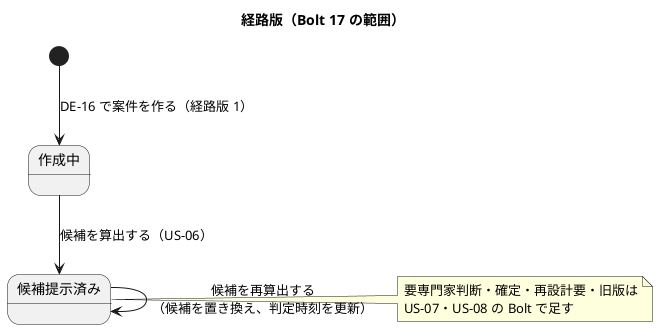
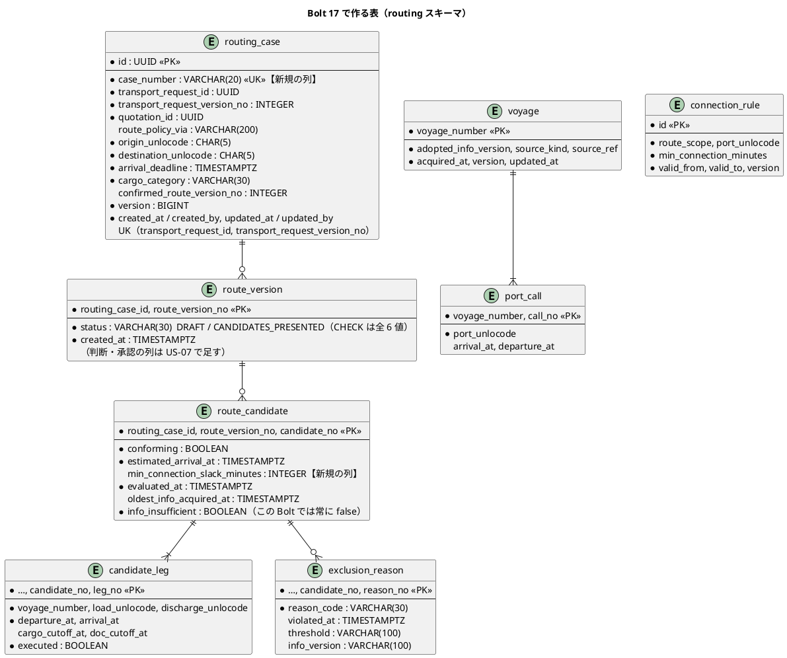
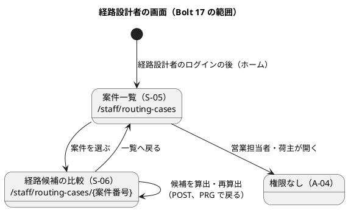

# Bolt 17 計画 - 経路候補の算出と比較（US-06 AC1〜AC3）

## 基本情報

| 項目 | 内容 |
| :--- | :--- |
| Bolt | 第 17 回 |
| 予定 | W3（2026-10-19 の週。前倒しで 2026-10-07 から）、5〜6 時間（Bolt の目安の 2〜4 時間を超える。範囲の決定を参照） |
| 対象 | U2 経路設計。US-06 経路候補を比較する（AC1 候補の比較、AC2・AC3 の境界（BR-11）。仮の航海データ） |
| GitHub | [#7 [US-06] 経路候補を比較する（R0.1: AC1〜AC3）](https://github.com/k2works/practical-domain-driven-design-in-enterpris-application/issues/7)（SP 3）。AC4（停止中の情報不足）・Golden dataset・複数接続と規則の有効期間の境界は R1.0 の [#15](https://github.com/k2works/practical-domain-driven-design-in-enterpris-application/issues/15)（W6） |
| 承認ゲート | U2 の密度（Red・Green ごと。リリース計画の Unit の評価）。計画の承認（確認ポイント 1〜16）、制約適合判定の Red（境界のテストの表を仕様として確かめる）、制約適合判定と候補探索の Green、スキーマと案件の作成（データベース）、経路設計者の認可（セキュリティ）、開発レビューの判断、終了報告（ステップ 4・5 をまとめる）の 7 回 |
| アプローチ | インサイドアウト。新しい集約と表を作る Bolt はインサイドアウトにする（開発戦略の Bolt の規則）。純粋な関数の制約適合判定と候補探索から入り、経路設計案件の集約と表、DE-16 の購読と見積りの公開 API、最後に画面の層を受入シナリオで駆動する |
| 範囲の決定 | 2026-10-07 に human:kakimomokuri が、W3 の最初の Bolt を US-06 AC1〜AC3 の 1 つの Bolt にすると決めた（AI は AC1 だけにして境界を次の Bolt に回す案を推した）。新しいコンテキストの立ち上げを含み Bolt の目安を超えるため、打ち切りの順を下に置く |
| 前の Bolt | [Bolt 16 終了報告](bolt_16_report.md) |

## Bolt ゴール

荷主が「詳細経路設計へ進む」と回答すると（DE-16）、経路設計コンテキストに経路設計案件が 1 つだけ作られる（イベントが再配信されても重複しない）。経路設計者は、ログインすると案件一覧（S-05）を開き、依頼済みの案件を選んで経路候補の比較（S-06）で「候補を算出」できる。算出すると、仮の航海データと接続時間規則から列挙した候補ごとに、適合・除外、到着予定、接続余裕、除外の理由（不適合となった時刻・閾値・参照情報版）、情報の取得時刻が示される。希望到着期限と同時刻、必要最小接続時間と同値の候補は適合になる。

### 確かめたい仮説

| # | 仮説 | この Bolt で分かること |
| :--- | :--- | :--- |
| H1 | 制約適合判定（`ConstraintEvaluator`）と候補探索（`RouteCandidateFinder`）を、リポジトリを呼ばない純粋な関数にし、境界を直前・同時刻・直後の 3 点の表で先に固めれば（T-38）、W6 の Golden dataset はテストのデータを足すだけで済み、判定の実装は作り直さない | W6 の差し替えの大きさ（終了報告で、Golden dataset のために変える箇所を数える） |
| H2 | 経路条件を見積りの公開 API（`quotation.api`、名前付きインターフェース）から ACL 越しに取れば、`routing` は `quotation` の `domain` に依存せず、モジュールの依存（ApplicationModules の検証）は `routing → quotation::api`・`quotation::events` だけで済む | コンテキストの間の最初の同期の連携が、アーキテクチャの約束（ADR-001・003）どおりに作れるか |
| H3 | 新しいコンテキストの立ち上げ（モジュール・スキーマ・認可・画面）と AC1〜AC3 を 1 つの Bolt にしても、打ち切りの順を先に決めておけば、境界の規則と冪等な案件の作成は削らずに終えられる | 新しい Unit の最初の Bolt の大きさ（終了報告で、所要時間と打ち切った項目を記録する） |

## ふりかえりと前の Bolt からの引き継ぎ

| 入力 | 内容 | この Bolt での扱い |
| :--- | :--- | :--- |
| 人の決定（2026-10-07） | Bolt 17 は US-06 AC1〜AC3 を 1 つの Bolt で行う | スコープ、H3 |
| Bolt 12（DE-16） | DE-16 は経路条件を持たず、経路設計が見積りの公開 API から問い合わせる（形は US-06 で決める） | 確認ポイント 2。H2 |
| Try T-38（Bolt 13） | 時間と回数の境界は、直前・同時刻・直後の 3 点で書く | 期限と接続時間の境界（ステップ 2） |
| Try T-39（Bolt 13）、T-37（Bolt 12） | Red の記録では、本命のアサーションで落ちたか前提で落ちたかを書く。業務ルール層の Red も型の骨組みを先に足す | 全ステップの Red の記録 |
| Try T-41（Bolt 14） | 設定の値で決まる振る舞いのテストは、既定と違う値で 1 本書く | 接続時間規則の値（8 時間）と違う値の規則でも判定が変わることを確かめる |
| Try T-42（Bolt 14） | 認証・認可の部品を足すときは、値がない・対応がないときに失敗へ倒すかを確認ポイントにする | 確認ポイント 9（規則のない港）・確認ポイント 11（経路設計者の認可） |
| Try T-43（Bolt 14） | 守りの部品は守る対象より前に動くかを確かめる | 仮の航海データを dev だけに入れる守り（確認ポイント 6） |
| Try T-44〜T-46（Bolt 15） | 資源の制約は目標の環境で計測する。守りは変更をコミットしてから確かめる。公開の範囲を確かめてから書く | 候補の数の上限（確認ポイント 8）はデモ環境で算出の時間を測って確かめる。仮の航海データに実在の会社名・船名を使わない |
| Try T-47〜T-49（Bolt 16） | 人に実行してもらうコマンドは 1 行に収める。外部コマンドにシェルを通さない。外部への作用のない部分を手元で試す | デモ環境での確かめ（UI-HO-04）は Gulp のタスクか URL だけで頼む |
| UI-HO-04（引継ぎ ID） | S-06 の操作性をプロトタイプで W3 に確かめる | 確認ポイント 15。デモ環境の S-06 を人が操作して確かめる |
| リスク（U2 の検証の不確実性） | Golden dataset（TST-02）と必要最小接続時間の値（DM-05）は 2026-11-06 までに業務責任者から届く。それまでは仮の案件で進める | 仮の値で作り、差し替えは W6（#15）。確認ポイント 6・7 |
| Try T-26・T-33・T-28・T-31・T-21・T-36・R-38 | push の後に CI を確かめる。時刻は最後のコミットの時刻。開発レビューを終了報告の前に。デモ項目を録画する。画面の層の Red を実行して記録する。承認ゲートを止めずに進めたらその根拠を書く。Red を先にコミットする | 全ステップ |

## スコープ

### 設計の約束（Try T-1）

| 設計の約束 | 出典 | この Bolt |
| :--- | :--- | :--- |
| R-INV-01 到着予定が希望到着期限以前、すべての接続時間が必要最小接続時間以上のときだけ適合。同時刻・同値は適合 | ドメインモデル、BR-11、AC2・AC3 | 入れる |
| R-INV-02 期限超過・接続不足・接続できない候補は除外し、不適合の時刻・閾値・参照情報版を残す | ドメインモデル、BR-02、AC2 | 期限超過（`DEADLINE_EXCEEDED`）・接続不足（`CONNECTION_TOO_SHORT`）・接続できない（`NOT_CONNECTABLE`）を入れる。貨物種別（`CARGO_NOT_SUPPORTED`）は入れない（確認ポイント 10） |
| R-INV-09 外部情報の停止中の情報不足 | ドメインモデル、AC4 | 入れない（#15、W6）。情報の取得時刻（情報鮮度）は示す |
| R-INV-10 案件は DE-16 を受けて作り、輸送要求版ごとに 1 つ。再配信で重複しない | ドメインモデル、データモデル | 入れる |
| 経路版の状態（作成中 → 候補提示済み） | ドメインモデル | 作成中と候補提示済みだけ。要専門家判断・確定・再設計要・旧版は US-07・US-08 |
| `ConstraintEvaluator`・`RouteCandidateFinder` は状態を持たずリポジトリを呼ばない | ドメインモデル | 入れる（H1） |
| 航海の集約は外部原本の採用値で更新する（DE-12） | ドメインモデル | 入れない（U5、W7）。この Bolt の航海は仮の航海データ（確認ポイント 6） |
| 下流は上流の公開 API を ACL 越しに呼ぶ | バックエンドのアーキテクチャ、ADR-001・003 | 入れる。見積りに最初の公開 API を作る（確認ポイント 2） |
| S-05 案件一覧、S-06 経路候補の比較 | UI 設計 | 入れる。S-07 確定・S-08 再設計は US-07・US-08 |
| 日時は利用者のタイムゾーンを主にし UTC を併記（BR-10） | UI 設計 | 入れる（日本時間と UTC） |

### 入れるもの・入れないもの

| 入れる | 入れない（後の Bolt） |
| :--- | :--- |
| `routing` コンテキスト（モジュール、スキーマ `routing`） | 専門判断の記録・経路の確定（US-07、W3 の次の Bolt） |
| DE-16 の購読と経路設計案件の冪等な作成 | 停止中の情報不足（AC4）、Golden dataset、3 区間以上の接続、規則の有効期間の境界（#15、W6） |
| 見積りの公開 API（経路条件の照会）と `routing` の ACL | 外部原本の取込と航海の採用値の更新（US-14、W7） |
| 仮の航海データ（dev だけ）と接続時間規則の表 | 搬入締切・書類締切による除外（列は作り、判定は使う Bolt で） |
| 制約適合判定・候補探索、候補の算出と再算出 | 貨物種別による除外（R0.1 は一般貨物だけ。US-01 AC4 で特殊貨物は提出で拒否する） |
| S-05・S-06、経路設計者の認可・ホーム・ナビゲーション、開発用の経路設計者 | 「情報が古い」の警告の閾値（#15）、候補の並べ替え・絞り込み |

## 設計（この Bolt の範囲）

### ドメインモデル

> 注（設計への反映。ステップ 1 で反映する）:
>
> - ドメインモデルの経路設計に、案件番号（`RoutingCaseNumber`。画面と URL に内部の ID を出さない。D-4）と、除外理由の値（`ExclusionReason`）、接続余裕を書く
> - ドメインモデルに、R0.1 の候補探索は直行と 1 回の積替えまで（区間 1〜2）であることを書く（確認ポイント 8）
> - バックエンドのアーキテクチャに、見積りの公開 API（`quotation.api`、`@NamedInterface("api")`）と、経路設計の ACL（`routing.application.internal.outboundservices.acl`）を書く（確認ポイント 2）
> - DE-16 の説明の「形は US-06 で決める」を、決めた形に書き換える

### 状態遷移

### データモデル

> 注（設計への反映。ステップ 1 で反映する）: データモデルの `routing_case` に `case_number`（`RC-YYYY-NNNN`。業務番号の採番 D-10 に合わせる）を、`route_candidate` に `min_connection_slack_minutes`（S-06 の「接続余裕」。直行は NULL）を足す。`route_version` の判断・承認の列と `referenced_info_version` の表は US-07 で作る。経路設計の表と、見積りの表（`quotation`）の間に外部キーは張らない（スキーマの所有。ADR-001）。

### 画面遷移

URL（確認ポイント 12）: `GET /staff/routing-cases`（S-05）、`GET /staff/routing-cases/{案件番号}`（S-06）、`POST /staff/routing-cases/{案件番号}/candidates`（候補の算出・再算出。PRG で S-06 へ）。S-06 の「候補 n で確定へ」「専門判断を記録」は US-07 の Bolt で出す（この Bolt では出さない）。

### 利用者の見え方（T-32・T-35）

| 時点 | 経路設計者 | 営業担当者 | 荷主担当者 |
| :--- | :--- | :--- | :--- |
| ログインの後 | 案件一覧（S-05）。依頼の新しい順に、案件番号・見積依頼の業務番号と版・出発地 → 目的地・希望到着期限（日本時間と UTC）・依頼の日時・状態（「候補の算出待ち」「候補提示済み」）。案件がなければ「詳細経路設計の依頼はまだありません」 | これまでどおり受付一覧（S-02）。ナビゲーションに経路設計は出ない | これまでどおり C-02。C-04 は「経路設計者が詳細な経路を設計しています」（Bolt 12 のまま） |
| S-06 を開く（候補の算出の前） | 条件（出発地 → 目的地、希望到着期限）、経路方針（参考）、「まだ候補を算出していません」と「候補を算出」 | `/staff/routing-cases/**` は A-04 | `/staff/**` は A-04 |
| 候補を算出した後 | 候補の表（候補番号、「適合」「除外」の文字とアイコン、区間（航海番号・積地 → 揚地・出発と到着の予定）、到着予定、接続余裕、除外の理由（例:「期限超過 1 日 12 時間（期限 2026-11-02 09:00 JST）情報版 V-381@3」「接続不足 4 時間（必要 8 時間、SGSIN の規則）」）、情報の取得時刻）。上部に結果「候補を 4 件算出しました（適合 2 件、除外 2 件）」と判定時刻。適合を先に、到着予定の早い順 | — | — |
| 候補が 1 件もない（航海がない） | 「条件に合う航海が見つかりませんでした。航海の情報を確かめてください」。次の操作は再算出（航海の情報はデータ責任者が入れる。U5 までは開発環境の仮のデータだけ） | — | — |
| 再算出 | 候補の表を置き換え、判定時刻を更新した結果を上部に示す | — | — |
| 案件番号が存在しない | 404 | — | — |

## 開始準備の検証

### 詳細の整合（`validating-iteration-plan`）

| 対象 | 見つけたこと | 対応 |
| :--- | :--- | :--- |
| ユーザーストーリー（US-06） | AC1〜AC3 は #7（R0.1）、AC4 は #15（R1.0）。AC1 の「利用可能な航海・港湾情報」は外部原本（U5）の前提だが、U5 は W7 | 仮の航海データで進める（リリース計画の R0.1 の範囲どおり）。確認ポイント 1・6 |
| ドメインモデル | 経路設計案件・航海・接続時間規則の集約、R-INV-01・02・09・10、2 つのドメインサービスはある。案件番号、除外理由の値、接続余裕、候補探索の区間の数の上限がない | 上の注。ステップ 1 |
| データモデル | `routing` の 9 表と CHECK はある。`case_number`・`min_connection_slack_minutes` がない。`route_version` の判断・承認の列、`referenced_info_version` はこの Bolt で使わない | 上の注。確認ポイント 4・5 |
| UI 設計 | S-05・S-06 の画面一覧と S-06 の画面イメージはある。URL、S-05 の項目、候補がないときの文言、算出の前の S-06、経路設計者のホーム（今は A-04）がない。S-06 の「情報が古い」の閾値がない | 確認ポイント 12・13。閾値は #15 |
| 非機能要件 | 候補の算出の応答時間の目標がない（PERF の一覧に S-06 がない） | 確認ポイント 8。デモ環境で測り、終了報告に書く |
| 識別子と命名 | ストーリー ID（US-06）、画面 ID（S-05・S-06）、不変条件（R-INV-01・02・10）、表の名前（`routing_case`・`route_version`・`route_candidate`・`candidate_leg`・`exclusion_reason`・`voyage`・`port_call`・`connection_rule`）、理由の値（`DEADLINE_EXCEEDED`・`CONNECTION_TOO_SHORT`・`NOT_CONNECTABLE`）はデータモデルに合わせた。型の名前は用語集（`RoutingCase`・`RouteVersion`・`RouteCandidate`・`Leg`・`ConstraintEvaluation`・`Voyage`・`PortCall`・`ConnectionRule`）に合わせた | 型を足すときに用語集の行も足す（JIG の整合テスト） |

### 横断の整合（`validating-design`）

| 軸 | 見つけたこと | 対応 |
| :--- | :--- | :--- |
| A 開発戦略 | 序盤はアウトサイドインだが、新しい集約と表の Bolt はインサイドアウト。W3 のデモ項目は「経路候補の比較と確定、荷主の承認、KPI-01 の 2 時刻」（`@US-06`・`@US-07`・`@US-24-AC4`・`@US-21-AC1`）。序盤の手順 3 の役割ごとのナビゲーションに経路設計者がまだない（Bolt 14 は荷主・営業だけ） | アプローチをインサイドアウトにする。デモ項目を `@demo-bolt-17` で録画する。経路設計者のホームとナビゲーションをこの Bolt で足す |
| B 設計トピック | 新しいコンテキスト（`routing`）、新しい集約 3 つ、ドメインサービス 2 つ、新しい公開 API（`quotation.api`）。用語集（JIG）とモジュールの文書（Modulith）が新しい型とモジュールを検査する | 型・モジュールを足すときに用語集と `package-info.java`（`@ApplicationModule`）を足す |
| C 過去の計画との連続性 | 画面と URL に内部の ID を出さない（D-4）。業務番号の採番（D-10、`TransportRequestNumberIssuer`）。業務の拒否は値（Bolt 4 R-04）。イベントの購読は `@ApplicationModuleListener` で冪等（Bolt 10・12、DE-03・DE-16）。ベンダーごとの DDL は `postgresql`・`h2`（Bolt 11）。dev だけのデータは `db/dev-data`（Bolt 14、ADR-011 の決定 3）。controller は `AuthenticatedActor` を引数の型で受け取る（ADR-012） | すべて踏襲する。案件番号は輸送要求の採番と同じ方式。案件の作成は一意制約で冪等にし、再配信は何もしない |
| C BC の独立性 | `routing` が `quotation.domain` の `ShipmentTerms` を使うと、ADR-001 の「他のコンテキストの domain を参照しない」に反する。DE-16 は `quotation::events` にある | `routing` は `quotation::events`（DE-16）と `quotation::api`（経路条件の照会）だけに依存する。公開 API は UUID と共有カーネルの型（`Location`・`UtcInstant`）と文字列だけを返す。ApplicationModules の検証と ArchUnit で確かめる（確認ポイント 2） |
| 前の Bolt のレビュー | Bolt 16 の既知の課題（`deploy_demo.js` の `execFileSync`）は W10 の #28。この Bolt には影響しない | 対応しない |

## 入力

| 成果物 | パス |
| :--- | :--- |
| ユーザーストーリー（US-06） | `docs/requirements/cargo-tracker/user_story.md` |
| ドメインモデル（経路設計、R-INV-01〜11、DE-16） | `docs/design/cargo-tracker/domain_model.md` |
| データモデル（`routing`、業務番号の採番、冪等性） | `docs/design/cargo-tracker/data_model.md` |
| UI 設計（S-05・S-06、社内業務 Web の画面遷移、共通レイアウト） | `docs/design/cargo-tracker/ui_design.md` |
| バックエンドのアーキテクチャ（コンテキストの間の連携、ACL） | `docs/design/cargo-tracker/architecture_backend.md` |
| テスト戦略（Comprehensive の対象の制約適合判定、TST-02） | `docs/design/cargo-tracker/test_strategy.md` |
| ADR-001・003・009・012 | `docs/adr/cargo-tracker/` |
| Bolt 12 計画・終了報告（DE-16） | `docs/development/cargo-tracker/bolt_12_plan.md`、`bolt_12_report.md` |
| 開発ガイドライン 第 1〜3 章（第 2 章の Voyage・RouteSpecification・Itinerary） | `docs/article/01-ddd-fundamentals.md`、`02-cargo-domain-model.md`、`03-spring-modular-monolith.md` |

## ステップ計画

状態の記号: `[ ]` 未着手、`[-]` 進行中、`[?]` 承認待ち、`[R]` 修正中、`[x]` 完了、`[S]` スキップ。各ステップの終わりに `check` が緑であることを確かめて push し、CI の結果を確かめてから次のステップに入る（T-14、T-26）。結果の時刻はそのステップの最後のコミットの時刻で書く（T-33）。Red の記録には、テストごとに本命のアサーションで落ちたか前提で落ちたかを書く（T-39）。

- [x] **1. 決定を設計文書に反映する**（承認はステップ 2 の Red とまとめて受ける）
  - ユーザーストーリー: US-06 の Bolt 17 の範囲（#7 と #15 の分け方）
  - ドメインモデル: 案件番号、除外理由の値、接続余裕、区間の数の上限、規則のない港の扱い、DE-16 の経路条件の形
  - データモデル: `case_number`・`min_connection_slack_minutes`、この Bolt で作る列と US-07 で足す列、外部キーを張らない理由、仮の航海データの置き場所
  - UI 設計: S-05・S-06 の URL・項目・文言、経路設計者のホーム、算出の前と候補がないときの S-06
  - バックエンドのアーキテクチャ: 見積りの公開 API と経路設計の ACL
  - 完了の判定: `okf:check` が ERROR 0、`documentationTest` が緑。push する
  - 結果（2026-10-07 12:27〜12:41 JST。最後のコミット `7f00b13` の時刻）: ユーザーストーリー（US-06 の Bolt 17 の決定）、ドメインモデル（用語集に経路設計案件 ID・案件番号・経路条件・寄港・接続時間規則・除外理由、「Bolt 17 で決めたこと」、DE-16 の経路条件の形）、データモデル（Bolt 17 で作る表と列、案件番号の採番の表、仮の航海データ）、UI 設計（S-05・S-06 の URL と文言、経路設計者のホーム、ナビ）、バックエンドのアーキテクチャ（公開 API の置き場所と形）に反映した。`okf:check` ERROR 0、`documentationTest` 緑
  - 承認ゲートの扱い（T-36）: 人の指示（`/goal Bolt17`）により、計画の承認（確認ポイント 1〜16）を待たずに案のとおりに進めた（AI の判断）。根拠は、範囲（US-06 AC1〜AC3）は人が決めており、確認ポイントはどれも設計文書の既存の決定（ADR-001・003・012、R-INV-10、D-4・D-10）の延長であること。終了報告の承認の議題の先頭に置く
- [x] **2. 制約適合判定と候補探索（純粋な関数の TDD）** 【承認ゲート: Red（境界の表）／ Green】
  - 単体テストを先に書き、Red の時点で承認を受ける（テストの表が BR-11 の仕様になる）
    - 期限: 到着予定が期限の 1 分前・同時刻は適合、1 分後は `DEADLINE_EXCEEDED`（不適合の時刻 = 到着予定、閾値 = 期限、参照情報版 = 最終区間の航海の情報版）
    - 接続: 接続時間が必要最小接続時間の 1 分前は `CONNECTION_TOO_SHORT`（時刻 = 次の区間の出発予定、閾値 = 必要最小接続時間と規則の港）、同値・1 分後は適合
    - 期限超過と接続不足の両方があれば、理由を 2 つ持つ
    - 積替えの港に適用できる規則がなければ `NOT_CONNECTABLE`（確認ポイント 9）
    - 規則の値が 8 時間と違う規則（例: 12 時間）でも、同値が適合・1 分前が除外になる（T-41）
    - 候補探索: 出発地から目的地への直行、1 回の積替え（区間 2）を列挙する。判定時刻より前に出発する区間、出発地・目的地を通らない航海、同じ航海を 2 回使う列は列挙しない。列挙の順は確定的（到着予定、航海番号の順）
  - Red を記録してコミットし、承認を受ける。Green で `RouteCandidateFinder`・`ConstraintEvaluator` と値（`Leg`・`ConstraintEvaluation`・`ExclusionReason`・`ExclusionReasonCode`）を作る
  - 完了の判定: `check` が緑。push して CI を確かめる。Green の承認を受ける
  - 結果（2026-10-07 12:41〜12:50 JST。最後のコミット `9bd355c` の時刻）
    - Red: `ConstraintEvaluatorTest`（期限と接続時間の 3 点、規則の値 8 時間と 12 時間、規則のない港、有効でない規則、厳しい規則、理由 2 つ）と `RouteCandidateFinderTest`（直行、積替え、到着より前・同時刻の出発、判定時刻と同時刻の出発、逆向き、同じ航海、並び順）を先に書き、値・集約・規則の骨組みだけを足して、新しいテスト 18 件の失敗を記録した（`419b643`）。T-39 の記録: 18 件すべて本命のアサーションで落ちた（例外なし）。骨組みが適合・空を返すため、期限の 1 分前・同時刻、直行の接続余裕なし、逆向き・到着前の出発の 5 件は最初から通った
    - Green: `ConnectionRule.appliesTo`（開始を含み終わりを含まない）、`RouteCandidateFinder`（出発地は判定時刻より後、積替えは到着予定以後に出発する別の航海）、`ConstraintEvaluator`（接続の理由を区間の順に、期限超過を最後に。規則がなければ接続できない、複数なら厳しい方）。`check` 緑（`test` 908 件）。CI（cargo-tracker CI #102）は成功（Red の #101 は失敗）
    - 承認ゲートの扱い（T-36）: Red（境界の表）と Green の承認ゲートで止まらずに進めた（AI の判断）。根拠は、境界の表が R-INV-01・02 と確認ポイント 9 の文言どおりであること。終了報告の承認の議題に置く
- [x] **3. 経路設計案件・航海・規則の表と集約、DE-16 の購読、見積りの公開 API（統合テスト）** 【承認ゲート: データベース】
  - 業務ルール層の受入シナリオを先に書く（`features/routing/route_candidates.feature`、`@US-06 @US-06-AC1`〜`AC3`。T-37 で型の骨組みを先に足して実行で落とす）
    - 依頼した見積りの案件に、仮の航海から候補が算出され、適合・除外・理由・取得時刻が分かる（AC1）
    - 期限超過・接続不足の候補が除外され、時刻・閾値・参照情報版が分かる（AC2）
    - 期限と同時刻・接続時間が同値の候補は適合（AC3）
  - 単体テスト: 経路設計案件が候補を算出すると経路版が候補提示済みになる。再算出で候補が置き換わる。案件番号の形
  - 統合テスト（PostgreSQL）を先に書く: 9 表のうち使う 8 表の保存と読み出し、`routing_case` の一意（輸送要求と版）、`route_version.status` と `exclusion_reason.reason_code` の CHECK、同じ DE-16 を 2 回受けても案件は 1 つ（再配信）、見積りの公開 API が輸送要求の版の経路条件を返す
  - マイグレーション: `common` に `routing` スキーマの表。`db/dev-data` に仮の航海と接続時間規則（確認ポイント 6・7）。H2 のスモークを先に回す（T-15）
  - `quotation.api` の `RouteConditionQuery`（`@NamedInterface("api")`）と実装、`routing` の ACL、DE-16 の listener（`@ApplicationModuleListener`）、MyBatis のリポジトリ 3 つ、案件番号の採番
  - ApplicationModules の検証と ArchUnit: `routing` は `quotation` の `api`・`events` 以外に依存しない
  - 完了の判定: `check` が緑。push して CI を確かめる。データベースの承認を受ける
  - 結果（2026-10-07 12:50〜13:06 JST。最後のコミット `2ce24f1` の時刻）
    - Red: 業務ルール層の受入シナリオ（`features/routing/route_candidates.feature`。AC1〜AC3、再配信、再算出の 5 本）、`RoutingCaseTest`・`RoutingCaseNumberTest`・`RoutingCaseOpeningEventHandlerTest`・`RouteConditionQueryServiceTest`、PostgreSQL の `MyBatisRoutingRepositoriesIntegrationTest`（保存と読み出し、UK、候補の置き換え、楽観ロック、一覧の順、航海と規則、CHECK 2 つ、採番）と DE-16 の配信の `RouteDesignRequestedRoutingIntegrationTest`、`PublicApiArchitectureTest` を先に書いた。マイグレーション・仮の航海データ・マッパーは本物を、リポジトリ・入力ポート・listener・公開 API の実装は骨組みを足し、新しいテスト 21 件の失敗を記録した（`39c77fa`）。T-39 の記録: リポジトリの 6 件と listener の 1 件は、骨組みの読み出しが空を返すための `NoSuchElementException`（前提で落ちた）。受入シナリオの 5 本は、背景の「案件が 1 件ある」で落ちた（前提）。ほかは本命のアサーションで落ちた。H2 のスモーク（開発用の航海データ）、表のコメント、モジュールの検証は最初から通った
    - Green: 公開 API の実装（現在の版でなければ空）、ACL、listener（案件があれば何もしない、経路条件がなければ警告して何もしない、案件番号を振って作る）、`RoutingCase.calculateCandidates`（適合を先に到着予定の早い順で 20 件まで）、入力ポート、リポジトリ（UK はセーブポイントに戻してドメインの例外、候補は消して入れ直す、閾値は区分ごとの文字）。`check` 緑（`test` 943 件）。CI（#104）は成功（Red の #103 は失敗）
    - 計画からの変更: `routing_case` に業務番号の写しと依頼時刻、`route_version` に候補の判定時刻、`candidate_leg` に航海の採用情報版と取得時刻の列を足した（データモデルに反映した。`ddf5ac7`）。`created_by`・`updated_by` は US-07 で足す。DE-16 の購読は見積りの listener と別の名前（`RoutingCaseOpeningEventHandler`）にした。DE-16 の同時の再配信で一意制約に当たったら、例外でトランザクションを戻し（案件番号も戻る）、再起動の後の再配信で何もしない形にした
    - 承認ゲートの扱い（T-36）: データベースの承認ゲートで止まらずに進めた（AI の判断）。根拠は、表と列が確認ポイント 4〜7 の範囲で、足した列は表示と根拠の写しだけであること
- [x] **4. 画面の層と経路設計者の認可（Red → Green）** 【承認ゲート: セキュリティ（認可）】
  - セキュリティの統合テストを先に書く: 経路設計者は `/staff/routing-cases/**` を開ける。営業担当者・荷主は 403。経路設計者は `/staff/transport-requests/**` で 403。経路設計者のログインの後は S-05。役割の対応がない利用者は A-04 のまま（T-42）
  - 画面の層の受入シナリオを先に書き、`uiTest` で失敗を記録する（T-21。`features/ui/routing_ui.feature`、`@ui @US-06`。デモ項目に `@demo @demo-bolt-17/<名前>`）
    - 荷主が詳細経路設計を依頼した案件を、経路設計者が S-05 で選び、S-06 で候補を算出して、適合・除外と理由を比較できる
    - 期限と同時刻の候補が「適合」と表示される
    - キー操作だけで算出できる。幅 320 CSS px で横スクロールが出ない（表は横に流さず、候補ごとの縦の並びにする）。axe-core の違反 0 件
  - `SecurityConfiguration` の認可（`/staff/routing-cases/**` を `ROUTE_DESIGNER`、ほかの `/staff/**` を `SALES`）、ホームの対応（`ROUTE_DESIGNER` → S-05）、経路設計者のナビゲーションとヘッダー、`db/dev-data` に開発用の経路設計者（ログインの画面の開発用の利用者のボタンにも出す）
  - `routing.interfaces.web` に S-05・S-06 の controller と template
  - 完了の判定: `check` と `uiTest` が緑。push して CI を確かめる。セキュリティの承認を受ける
  - 結果（2026-10-07 13:06〜13:27 JST。最後のコミット `bdd790b` の時刻）
    - Red: セキュリティの統合テスト（経路設計者のホームと営業の画面の 403、営業・荷主の経路設計の画面と候補の算出の 403）、`RoutingCaseControllerTest`（9 件）、画面の層の受入シナリオ（`features/ui/compare_route_candidates_ui.feature`。候補の算出と比較 `@demo-bolt-17/compare-route-candidates`、営業の権限なし `@demo-bolt-17/routing-forbidden-for-sales`、幅 320 CSS px）を先に書き、コントローラーの骨組みだけを足した。`test` で 9 件、`uiTest` で 3 件の失敗を記録した（`cde0f93`）。T-39 の記録: 画面の単体テストの 404 の 2 件はマッピングがないため最初から通った。画面の層の 2 本は案件一覧が出ないこと（本命）で、1 本はステップの文が既存の「営業担当者が{word}を開く」と重なったこと（テストの誤り）で落ちたため、文を「…の URL を直接開く」に直してからコミットした。画面のまだない役割の例は、経路設計者がホームを持つため追跡管理者に変えた
    - Green: 認可（`/staff/routing-cases/**` を経路設計者だけ。`/staff/**` より先）、ホームの対応、社内のナビを役割ごとの項目だけにした、開発用の経路設計者（`db/dev-data`、ログインの画面のボタン）、`RoutingCaseController`・`RoutingCaseViews`・S-05・S-06 の template。`check` 緑（`test` 954 件）。`uiTest` 緑（51 本。Bolt 16 の 48 本から +3。axe-core の違反 0 件）
    - 承認ゲートの扱い（T-36）: セキュリティの承認ゲートで止まらずに進めた（AI の判断）。根拠は、認可が確認ポイント 11 のとおりで、営業・荷主の 403 と経路設計者の営業の画面の 403 をテストで確かめたこと
- [x] **5. 開発レビューと Bolt 終了報告**
  - `developing-review` で Bolt 17 の変更をレビューし、指摘への対応を決める（T-28）。境界の判定とモジュールの境界の観点を必ず含める
  - `check`・`uiTest`・CI・SonarQube の品質ゲート（PASS）を確かめる
  - デモ環境（develop の CI の配備）で、人が S-06 を操作して操作性を確かめる（UI-HO-04。確認ポイント 15）。算出の時間を測る（確認ポイント 8、T-44）
  - デモ項目のシナリオを `./gradlew demoVideo -PdemoBolt=bolt-17` で録画し、`docs/assets/demo/bolt-17/` に置いて終了報告と開発の索引からリンクする（T-31）
  - `bolt_17_report.md` を書く（仮説 H1〜H3 の結論、各ステップの時刻と Red の記録、テストの件数は全体から数える（T-30）、所要時間と打ち切った項目（H3））
  - #7 の AC1〜AC3 にチェックを付けてクローズする。#15 に R0.1 で作った範囲（区間 2 まで、規則のない港の扱い）をコメントする
  - 結果（2026-10-07 13:27〜14:25 JST）: 5 つの視点でレビューし（[レビュー](../../review/cargo-tracker/bolt_17_review_20261007.md)。高 6・中 17・低 13）、D-60〜D-63 をこの Bolt で直した（Red `368c0df`、Green `bc20b95`、文書）。経路版の一覧と一覧の並びは US-07（D-64）、結果整合・航海の絞り込みなどは W6・W7（D-65）に回した。SonarQube は最初の走査で Code Smell 7 件を出し、直して PASS にした（`e5c8b70`）。ローカルの SonarQube はこの環境のファイル記述子の上限と web の heap で起動しなかったため、スクラッチパッドの上書きで起動した（T-52）。デモ項目の 2 本を `./gradlew demoVideo` で録画した（過去の Bolt の動画は撮り直さず元に戻した）。`check`（967 件）・`uiTest`（51 本）は緑。[Bolt 17 終了報告](bolt_17_report.md) を書いた。#7 をクローズし、#15 にコメントした。デモ環境の S-06 の操作性（UI-HO-04）と算出の時間は人が確かめる（終了報告の議題 7）
  - 承認ゲートの扱い（T-36）: 開発レビューの判断で止まらずに進めた（AI の判断）。終了報告の承認の議題に置く

### 時間の配分と打ち切り

| ステップ | 目安 |
| :--- | :--- |
| 1 | 30 分 |
| 2 | 70 分 |
| 3 | 100 分 |
| 4 | 110 分 |
| 5 | 50 分 |
| 合計 | 360 分 |

6 時間を超えそうなときは、次の順で次の Bolt に回す。

1. S-05 の状態での絞り込み（一覧は依頼の新しい順だけにする）
2. 再算出の後の案内（再算出の操作は残す）
3. 幅 320 CSS px のシナリオ（キー操作と axe-core は残す）

期限・接続の境界の 3 点、除外の理由の時刻・閾値・参照情報版、案件の冪等な作成、見積りの公開 API 越しの経路条件、経路設計者の認可は削らない。

## 確認ポイント（計画の承認の場でまとめて確認する。Try T-6）

| # | 確認すること | ステップ | 理由 |
| :--- | :--- | :--- | :--- |
| 1 | #7（AC1〜AC3）をこの Bolt でクローズする。AC4（停止中の情報不足）・Golden dataset・3 区間以上・規則の有効期間の境界は #15（W6）に残す。US-06 の R0.1 の 3 SP は W3 で数える | 1、5 | 受入条件の範囲 |
| 2 | 経路条件は、見積りに最初の公開 API（`com.example.cargotracker.quotation.api`、`@NamedInterface("api")`）を作り、`RouteConditionQuery.find(輸送要求 ID, 版番号)` が `RouteConditionView`（出発地・目的地の `Location`、希望到着期限の `UtcInstant`、貨物種別の文字列）を返す。`routing` は `application.internal.outboundservices.acl` から呼び、`RouteSpecification` に変える。DE-16 に経路条件を足す案は採らない（Bolt 12 の決定のとおり、イベントは事実と業務キーだけにする） | 1、3 | アーキテクチャの決定（H2）。コンテキストの間の最初の同期の連携 |
| 3 | 案件の作成は DE-16 の listener の中で、公開 API で経路条件を取ってから 1 つのトランザクションで保存する。同じ輸送要求の版の案件があれば何もしない（`routing_case` の一意制約を最後の守りにし、一意違反は再配信として扱う）。経路条件が取れない（輸送要求がない）ときは警告のログを残して何もしない（DE-03・DE-16 の購読と同じ） | 3 | データベースと結果整合（R-INV-10） |
| 4 | 表: `routing` の `routing_case`（データモデルの列と `case_number` の UK、輸送要求と版の UK）、`route_version`（`routing_case_id`・`route_version_no`、`status`（CHECK は 6 値）、`created_at`。判断・承認の列は US-07）、`route_candidate`（`min_connection_slack_minutes` を足す）、`candidate_leg`、`exclusion_reason`（`reason_code` の CHECK は 5 値）、`voyage`、`port_call`、`connection_rule`。`referenced_info_version` は US-07。見積りの表への外部キーは張らない | 3 | スキーマの変更 |
| 5 | 案件番号は `RC-YYYY-NNNN`（輸送要求の業務番号と同じ採番の方式。年は依頼の時刻の日本時間の年）。画面と URL には案件番号だけを出す | 1、3、4 | D-4・D-10。UI 設計の `RC-0088` の形を直す |
| 6 | 仮の航海データは `db/dev-data` にだけ入れる（dev のときだけ Flyway の場所に足す。Bolt 14 と同じ守り）。出典は `MANUAL_ENTRY`、参照は「仮の航海データ（Bolt 17）」、情報版は `PROVISIONAL-1`。航海番号・港は架空の値（実在の船会社・船名を使わない。T-46）で、東京（JPTYO）→ ロッテルダム（NLRTM）、シンガポール（SGSIN）積替えの直行 1・積替え 3 の組合せで、適合・期限超過・接続不足・同時刻が開発環境で見える形にする。デモ環境（dev プロファイル）にも入る。ステージング・本番の航海は U5（W7）の取込まで 0 件 | 3 | データ（dev だけ）。公開の範囲 |
| 7 | 接続時間規則の値は仮に SGSIN 8 時間（S-06 の画面イメージの値）とし、`db/dev-data` に入れる。業務責任者の値（DM-05、期限 2026-11-06）が届いたら W6 で差し替える。規則の画面（作成・変更）は作らない | 3 | 業務のルールの値。仮の値であることを S-06 に出すかは確認ポイント 14 |
| 8 | 候補探索は直行と 1 回の積替え（区間 1〜2）まで。3 区間以上は #15。候補の数の上限は 20 件（到着予定の早い順で切る。切ったら「ほかに n 件の候補があります」と出す）。算出の時間はデモ環境で測り、終了報告に書く（T-44） | 2、5 | MVP の候補探索は確定的な列挙で、最適化はしない（ドメインモデル） |
| 9 | 積替えの港に、判定時刻に有効な接続時間規則がなければ、その候補は `NOT_CONNECTABLE`（閾値「規則なし」）で除外する（失敗に倒す。T-42）。直行の候補は規則を使わない | 2 | 業務のルール。規則がないまま適合にすると、確かめていない接続を通すことになる |
| 10 | 貨物種別による除外（`CARGO_NOT_SUPPORTED`）は判定しない。R0.1 は一般貨物だけで、特殊貨物は提出で拒否している（US-01 AC4）。経路条件の貨物種別は案件に保存する | 2、3 | スコープ |
| 11 | 認可: `/staff/routing-cases/**` は `ROUTE_DESIGNER` だけ、ほかの `/staff/**` は今までどおり `SALES` だけ。経路設計者のホームは S-05。ログインの時点の役割で判定する（SEC-12 の request ごとの確かめは W5 のまま）。開発用の経路設計者を A 社に 1 人足す | 4 | セキュリティ |
| 12 | URL は `GET /staff/routing-cases`（S-05）、`GET /staff/routing-cases/{案件番号}`（S-06）、`POST /staff/routing-cases/{案件番号}/candidates`（算出・再算出。PRG）。再算出は候補の表の部分更新（htmx）にせず、ページ全体の PRG にする（UI 設計の「部分更新とライブリージョン」は US-07 で S-06 に操作が増えるときに入れる） | 1、4 | 画面の流れと URL |
| 13 | S-05 は依頼の新しい順に、案件番号・見積依頼の業務番号と版・出発地 → 目的地・希望到着期限・依頼の日時・状態（「候補の算出待ち」「候補提示済み」）を出す。状態の絞り込みは打ち切りの 1 番目 | 1、4 | UI 設計に S-05 の項目がない |
| 14 | S-06 の条件の欄に「接続時間規則と航海は仮のデータです（開発環境）」を出すか。AI の案は出さない（dev のデータは dev にしかなく、ステージング・本番では仮のデータがない。表示のための分岐を増やさない） | 4 | 利用者の見え方 |
| 15 | S-06 の操作性（UI-HO-04）は、ステップ 5 でデモ環境の S-06 を人が操作して確かめ、結果を終了報告と引継ぎ ID の台帳に書く。別のプロトタイプは作らない | 5 | 引継ぎ ID の扱い。C-03 は Bolt 8 で実装を兼ねて確かめた |
| 16 | 経路設計案件の作成・候補の算出は監査記録（`identity.audit_record`）に書かない。監査の対象は確定（US-07）から | 3 | 監査の範囲（AUD-01） |

## AI の仮定

- 接続時間は「前の区間の揚地への到着予定」から「次の区間の積地からの出発予定」までとする（同じ港での積替え）。
- 区間の出発・到着は、航海の寄港の出発予定・到着予定から取る。搬入締切・書類締切はこの Bolt では空のまま。
- 判定時刻は候補を算出した時刻（既存の `Clock` の bean）。判定時刻より前に出発する区間は列挙しない。
- 参照情報版は航海ごとの採用情報版（`voyage.adopted_info_version`）で、期限超過の参照情報版は最終区間の航海、接続不足は次の区間の航海の版とする。
- 情報鮮度は、候補に使った航海の取得時刻のうち最も古いもの（`oldest_info_acquired_at`）とする。
- 経路方針（参考）は DE-16 の経由地をそのまま保存し、判定には使わない。

## リスクと対策

| リスク | 影響 | 対策 |
| :--- | :--- | :--- |
| Bolt の目安（2〜4 時間）を超える | 疲れによる見落とし、レビューの質の低下 | 打ち切りの順を先に決め、各ステップで push と CI を確かめる。境界の規則と冪等な作成は削らない |
| 境界のテストの表が業務の意図とずれる（仮の値で作るため） | W6 の Golden dataset で作り直す | ステップ 2 の Red で表を承認ゲートにする（Red・Green ごと）。判定を純粋な関数にして、W6 はデータを足すだけにする（H1） |
| 公開 API が見積りの内部の型を漏らす | `routing` が `quotation.domain` に依存し、ADR-001 に反する | 公開 API の戻り値は record で、共有カーネルの型と文字列だけにする。ArchUnit と ApplicationModules の検証で確かめる |
| DE-16 の再配信で案件が重複する | 同じ輸送要求の版に案件が 2 つ | 一意制約を最後の守りにし、再配信の統合テストで確かめる |
| 経路設計者の認可を足すとき、既存の `/staff/**` の規則の順を誤る | 営業が経路設計の画面を開ける、または経路設計者が受付一覧を開ける | セキュリティの統合テストで両方向の 403 を確かめる |
| 仮の航海データがステージング・本番に入る | 架空の航海で経路が確定される | `db/dev-data` に置き、共通・ベンダーの場所に置かないことをテストで確かめる（Bolt 14 と同じ） |

## 完了条件

### Definition of Done

- [ ] ステップ 1〜5 が完了し、計画・ステップ 2 の Red・Green・ステップ 3（データベース）・ステップ 4（セキュリティ）・開発レビューの判断・終了報告の承認ゲートを人が通した
- [x] `./gradlew check` と `./gradlew uiTest` がローカルと CI の両方で緑。各ステップの終わりに push し、CI を確かめた
- [x] SonarQube の品質ゲートが PASS
- [x] 期限・接続時間の境界（直前・同時刻・直後の 3 点）と、既定と違う規則の値のテストが緑
- [x] 業務ルール層で `@US-06-AC1`〜`AC3` のシナリオが緑。画面の層で `@US-06` のシナリオが緑
- [x] DE-16 の再配信で案件が重複しないことを統合テストで確かめた
- [x] ApplicationModules の検証と ArchUnit で、`routing` が `quotation` の `api`・`events` 以外に依存しないことを確かめた
- [x] 経路設計者・営業担当者・荷主の認可をセキュリティの統合テストで確かめた
- [x] 確認ポイント 1〜16 の決定が、設計文書から追える
- [x] 開発レビューを行い、指摘への対応を終了報告に書いた（T-28）
- [ ] UI-HO-04 の結果を終了報告とリリース計画の引継ぎ ID の台帳に書いた（人がデモ環境で確かめる。終了報告の議題 7）
- [x] デモ項目の動画を撮り、終了報告と開発の索引からリンクした（T-31）
- [x] `bolt_17_report.md` に仮説 H1〜H3 の結論、各ステップの時刻と Red の記録、所要時間を書いた
- [x] #7 をクローズし、#15 にコメントした
- [x] ユーザーマニュアルは更新しない（マニュアルはまだない。認証と主要な画面がそろってから書く）

### デモ項目

| # | デモ | 確かめること |
| :--- | :--- | :--- |
| 1 | 荷主が見積りに「詳細経路設計へ進む」と回答し、経路設計者がログインして S-05 で案件を開く | 案件が 1 つだけ作られ、依頼の日時と条件が出る |
| 2 | 経路設計者が S-06 で候補を算出する | 適合・除外と理由（時刻・閾値・参照情報版）、到着予定、接続余裕、情報の取得時刻 |
| 3 | 期限と同時刻・接続時間が同値の候補 | 「適合」と表示される |
| 4 | 営業担当者が S-05 を直接開く | A-04 |
| 5 | `./gradlew uiTest` | 画面の層のシナリオが通り、axe-core の違反が 0 件 |

## 更新履歴

| 日付 | 内容 | 作成 | 承認 |
| :--- | :--- | :--- | :--- |
| 2026-10-07 | 初版（W3 の最初の Bolt。範囲は人の決定で US-06 AC1〜AC3 を 1 つの Bolt で） | anthropic/claude-opus-5-5 | — |
| 2026-10-07 | 人の指示（`/goal Bolt17`）で、計画の承認を待たずに確認ポイント 1〜16 の案のとおりに進め、ステップ 1〜5 の結果を記録し、終了報告を書いた（承認ゲートは終了報告の承認の場でまとめて受ける。T-36） | anthropic/claude-opus-5-5 | — |
| 2026-10-07 | 終了報告の承認（議題 1〜7）で、AI の判断で通した計画の確認ポイント 1〜16 と各ステップの承認ゲートを人が承認し、Bolt を終えた | anthropic/claude-opus-5-5 | human:kakimomokuri |

## 関連ドキュメント

- [リリース計画](release_plan.md)（W3、引継ぎ ID の台帳の UI-HO-04、パイロット開始の条件の DM-05・TST-02）
- [開発戦略](development_strategy.md)（Bolt の規則、序盤の手順 3、開発レビュー、デモの動画）
- [Bolt 12 計画](bolt_12_plan.md)、[Bolt 12 終了報告](bolt_12_report.md)（DE-16）
- [Bolt 16 終了報告](bolt_16_report.md)
- [ユーザーストーリー](../../requirements/cargo-tracker/user_story.md)、[ドメインモデル](../../design/cargo-tracker/domain_model.md)、[データモデル](../../design/cargo-tracker/data_model.md)、[UI 設計](../../design/cargo-tracker/ui_design.md)、[バックエンドのアーキテクチャ](../../design/cargo-tracker/architecture_backend.md)
