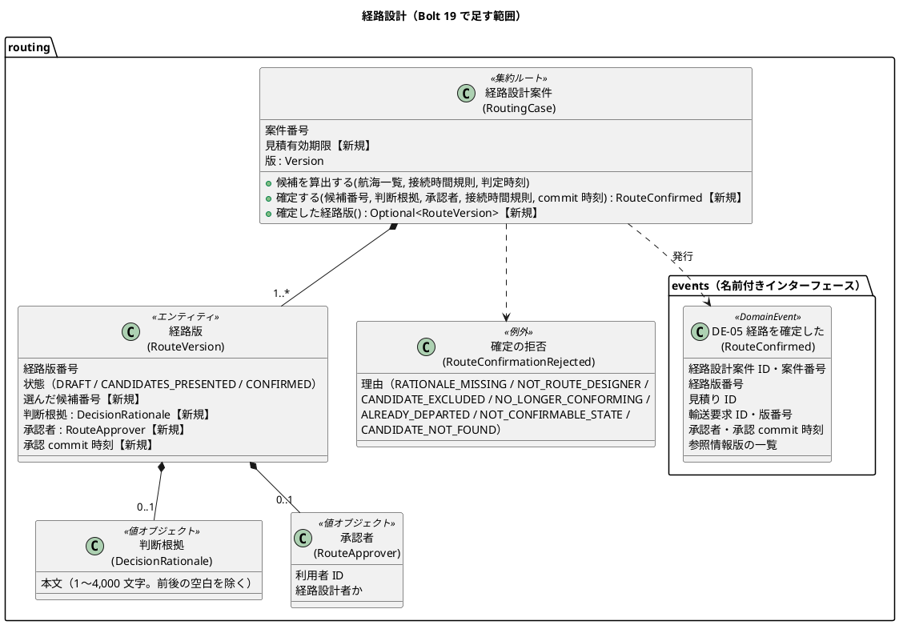
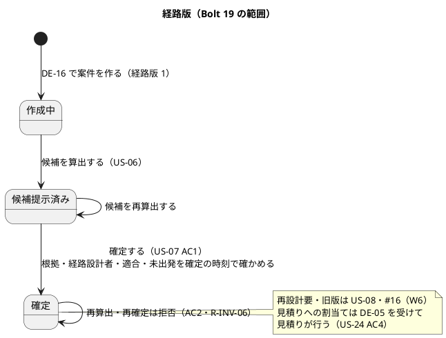
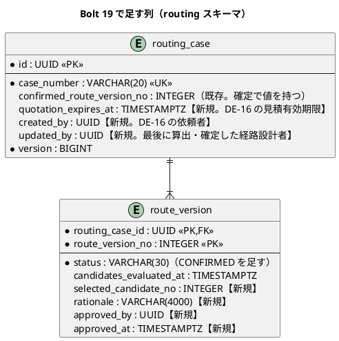
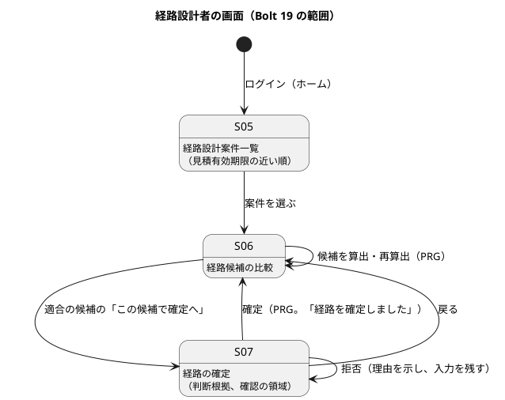

# Bolt 19 計画 - 判断根拠を記録して経路を確定する（US-07 AC1・AC2）

## 基本情報

| 項目 | 内容 |
| :--- | :--- |
| Bolt | 第 19 回 |
| 予定 | W3（2026-10-19 の週。前倒しで 2026-10-07 から）、3〜4 時間 |
| 対象 | U2 経路設計。US-07 専門判断を伴う経路を確定する（AC1 確定、AC2 根拠・権限の不足） |
| GitHub | [#8 [US-07] 専門判断を伴う経路を確定する（R0.1: AC1・AC2）](https://github.com/k2works/practical-domain-driven-design-in-enterpris-application/issues/8)（SP 3）。AC3〜AC5（承認中の情報版の更新、再設計要・旧版）は R1.0 の [#16](https://github.com/k2works/practical-domain-driven-design-in-enterpris-application/issues/16)（W6） |
| 承認ゲート | U2 の密度（Red・Green ごと）。計画の承認（確認ポイント 1〜12）、確定の規則の Red（拒否の表を仕様として確かめる）、確定の規則の Green、表の変更とイベント（データベース）、S-07 と確定の操作（画面）、開発レビューの判断、終了報告の 7 回 |
| アプローチ | インサイドアウト（開発戦略の Bolt の規則。既存の集約に振る舞いと表の列を足す Bolt）。集約の確定の規則から入り、表とイベント、最後に画面の層を受入シナリオで駆動する |
| 範囲の決定 | 2026-10-07 に human:kakimomokuri が、Bolt 19 を US-07 AC1・AC2（D-64 を含む）にし、Try T-52 をこの Bolt で正式化すると決め、計画（確認ポイント 1〜12）を承認した（`y`） |
| 前の Bolt | [Bolt 17 終了報告](bolt_17_report.md)、[Bolt 18 計画](bolt_18_plan.md) |

## Bolt ゴール

経路設計者が S-06 で適合の候補の「この候補で確定へ」を押すと、経路の確定（S-07）が開く。判断根拠を入れて確認の領域で確定すると、確定の時刻で候補が再検証され、経路版が「確定」になり、根拠・承認者・承認 commit 時刻・参照情報版が記録される。経路の確定のイベント（DE-05）が発行される。根拠がない、経路設計者でない、除外の候補、確定の時刻に適合しなくなった・出発済みの候補、確定済みの経路版、古い画面からの操作は、確定せず理由を示す。

### 確かめたい仮説

| # | 仮説 | この Bolt で分かること |
| :--- | :--- | :--- |
| H1 | 確定の再検証を、Bolt 17 の制約適合判定（`ConstraintEvaluator`）を確定の時刻で呼び直すだけで作れれば、AC3（承認中の情報版の更新、W6）は「参照情報版の比較」を足すだけで済み、判定は作り直さない | 確定の再検証のために `ConstraintEvaluator` を変えた箇所の数（終了報告で数える） |
| H2 | 経路版を一覧で持つ形（D-64）に変えても、Bolt 17 のテスト（候補の算出・再算出・保存）は振る舞いを変えずに通る | Bolt 17 のテストのうち、書き換えが要ったテストの数 |
| H3 | 経路の確定のイベント（DE-05）を `routing :: events` に置けば、見積りの割当て（US-24 AC4、次の Bolt）は購読を足すだけで作れ、`routing` は見積りに依存を増やさない | ApplicationModules の検証で、`routing` の依存が増えないこと |

## ふりかえりと前の Bolt からの引き継ぎ

| 入力 | 内容 | この Bolt での扱い |
| :--- | :--- | :--- |
| 人の決定（2026-10-07） | Bolt 19 は US-07 AC1・AC2。T-52 をこの Bolt で正式化する | スコープ |
| Bolt 17 レビュー D-64 | 経路版の一覧を集約に持たせ、候補提示済みの版だけを書き直す。画面のフォームに版を持たせて古い画面からの再算出を競合にする。一覧に見積りの有効期限を足し期限の近い順に並べる。省いた候補の件数を常に示す。`created_by`・`updated_by` | 確認ポイント 2・9・10。荷主名は企業マスター（US-16）の後のまま |
| Bolt 17 確認ポイント 16 | 案件の作成と候補の算出は監査記録に書かない。監査の対象は確定から | 確認ポイント 8 |
| Bolt 12 レビュー D-42 | 経路設計の途中の見積りの失効の扱いを US-07 の Bolt で決める | 確認ポイント 7 |
| Try T-50（Bolt 17） | 共有の DB にデータを入れるテストは、消す手順か交わらないキーを同じ変更で書く | 画面の層の確定のシナリオ（確定した案件を残さない） |
| Try T-51（Bolt 17） | 複数の置換は、すべての置換の前の文字列があることを確かめてから書き込む | 全ステップ |
| Try T-52（Bolt 17） | ローカルの SonarQube の起動の上書きを正式なタスクにするか人に確かめる | 人が正式化を決めた。調べると、上書きは Bolt 11（T-34）で `ops/docker/sonarqube-local/docker-compose.cloud.yml` と手順書の 9 節に正式化済みだった。Bolt 17 では手順書を読まずにスクラッチパッドに同じ上書きを作り直した（AI の誤り）。この Bolt では、`sonar-local:start` がクラウドの実行環境（`CLAUDE_CODE_REMOTE=true`）で上書きを自動で重ねるようにし、手順書の 9 節の手作業の起動をタスクに置き換える（ステップ 1） |
| Try T-38・T-39・T-41・T-42 | 時刻の境界は 3 点。Red の記録に本命か前提かを書く。既定と違う値で 1 本。値・対応がないときに失敗へ倒すかを確認ポイントにする | 確定の時刻と出発の時刻の 3 点（確認ポイント 4）。役割がない・根拠が空は拒否（確認ポイント 5・6） |
| Try T-26・T-33・T-28・T-31・T-21・T-36・R-38 | push の後に CI を確かめる。時刻は最後のコミットの時刻。開発レビューを終了報告の前に。デモ項目を録画する。画面の層の Red を実行して記録する。承認ゲートを止めずに進めたらその根拠を書く。Red を先にコミットする | 全ステップ |
| Bolt 18 | デモ環境に RC-2026-0902（候補算出済み）がある | デモ環境で人が確定を試せる。確定したサンプルは足さない（確認ポイント 11） |

## スコープ

### 設計の約束（Try T-1）

| 設計の約束 | 出典 | この Bolt |
| :--- | :--- | :--- |
| R-INV-03 確定は承認の commit 時点で再検証する | ドメインモデル、US-07 AC1 | 再検証を入れる（確認ポイント 3・4）。参照情報版が承認中に更新されたときの拒否（AC3）は入れない（#16、W6） |
| R-INV-04 確定には判断根拠と経路設計者の役割が必要 | ドメインモデル、BR-15、US-07 AC2 | 入れる（確認ポイント 5・6） |
| R-INV-05 「確定」の経路版は案件に 1 つだけ | ドメインモデル、データモデル | 入れる。`routing_case.confirmed_route_version_no` を使う |
| R-INV-06 旧版・再設計要の経路版は再確定に使えない | ドメインモデル、US-07 AC5 | 確定済みの経路版の再確定・再算出の拒否だけ入れる。旧版・再設計要は US-08・#16 |
| R-INV-11 確定したら見積りに経路版を割り当てる（DE-05） | ドメインモデル、BR-01 | DE-05 の発行まで。見積りの割当て（荷主承認待ち）は US-24 AC4 の Bolt（確認ポイント 7） |
| 経路版の状態（候補提示済み → 確定） | ドメインモデル | 確定を足す。要専門家判断・再設計要・旧版は入れない |
| S-07 経路の確定。確定は確認の領域を経る（BR-13） | UI 設計 | 入れる |
| 日時は利用者のタイムゾーンを主にし UTC を併記（BR-10） | UI 設計 | 入れる |

### 入れるもの・入れないもの

| 入れる | 入れない（後の Bolt） |
| :--- | :--- |
| `RoutingCase.confirm`（確定の再検証と拒否）、経路版の一覧（D-64） | 承認中の情報版の更新の拒否（AC3）、再設計要・旧版（AC4・AC5）（#16、W6） |
| `route_version` の判断・承認の列、`routing_case` の `quotation_expires_at`・`created_by`・`updated_by` | 要専門家判断の状態と「専門判断を記録」の操作（自動判定できない候補は R0.1 にない） |
| DE-05 経路を確定した（`routing :: events`） | 見積りへの経路版の割当てと荷主承認待ち（US-24 AC4、W3 の次の Bolt） |
| S-07、S-06 の「この候補で確定へ」と確定の後の表示、S-05 の見積有効期限と並び | 荷主へのメールの通知（US-23、W9）、監査証跡への記録（US-17） |
| 古い画面からの算出・確定を版で競合にする（D-64） | S-05 の状態の絞り込み、再算出の部分更新（htmx）とライブリージョン |
| `sonar-local:start` のクラウドの上書き（T-52） | — |

## 設計（この Bolt の範囲）

### ドメインモデル

> 注（設計への反映。ステップ 1 で反映する）:
>
> - ドメインモデルの「Bolt 19 で決めたこと」に、確定の再検証（確認ポイント 3・4）、拒否の理由、経路版の一覧（D-64）、DE-05 の項目と発行の時点を書く
> - ドメインモデルの経路版の状態遷移に、R0.1 は「候補提示済み → 確定」だけで、確定の後の再算出は拒否することを書く
> - 用語集に判断根拠（DecisionRationale）・承認者（RouteApprover）を足す

### 状態遷移

### データモデル

- 確定の時は `selected_candidate_no`・`rationale`・`approved_by`・`approved_at` がそろって値を持ち、`status = 'CONFIRMED'` と一致する（CHECK `ck_route_version_confirmed`）。参照情報版は選んだ候補の区間（`candidate_leg.info_version`）から読み、写しを持たない（確認ポイント 3）
- 既存の行は `quotation_expires_at`・`created_by` が NULL になる。列は NULL を許し、DE-16 から作る案件だけが値を持つ（開発用のサンプルは Bolt 18 のシードに値を足す）
- `route_version.status` の CHECK は既存（Bolt 17）で 6 値を許しているため、変えない

### 画面遷移

| 画面 | URL | この Bolt で決めること |
| :--- | :--- | :--- |
| S-05 | `GET /staff/routing-cases` | 見積有効期限（日本時間と UTC）の列を足し、期限の近い順（同じなら依頼の古い順）に並べる。期限を過ぎた案件は「見積りの期限切れ」と示す。状態に「確定済み」を足す |
| S-06 | `GET /staff/routing-cases/{案件番号}` | 適合の候補に「この候補で確定へ」（除外の候補には出さない）。確定の後は確定した候補に「確定」と承認者・承認時刻・根拠を示し、算出・確定の操作を出さない。候補の算出のフォームに版を持たせる。省いた候補の件数を常に示す |
| S-07 | `GET /staff/routing-cases/{案件番号}/confirmation?candidate={候補番号}`、`POST /staff/routing-cases/{案件番号}/confirmation` | 選んだ候補の要約（区間、到着予定、接続余裕、根拠、参照情報版）、判断根拠（必須、4,000 文字まで）、確認の領域（「この経路で確定しますか」）。フォームは版と候補番号を持つ。拒否は理由をエラー要約で示し、入力を残す。競合は「ほかの経路設計者が先にこの案件を更新しました。最新の候補を確かめてください。」 |

## ステップ計画

状態の記号: `[ ]` 未着手、`[-]` 進行中、`[?]` 承認待ち、`[R]` 修正中、`[x]` 完了、`[S]` スキップ。各ステップの終わりに `check` が緑であることを確かめて push し、CI の結果を確かめてから次のステップに入る（T-14、T-26）。結果の時刻はそのステップの最後のコミットの時刻で書く（T-33）。Red の記録には、テストごとに本命のアサーションで落ちたか前提で落ちたかを書く（T-39）。

- [x] **1. 決定を設計文書に反映し、SonarQube の起動のタスクを直す**（承認はステップ 2 の Red とまとめて受ける）
  - ドメインモデル・データモデル・UI 設計（S-05〜S-07）・ユーザーストーリー（US-07 の R0.1 の範囲）に、確認ポイントの決定を書く
  - `ops/scripts/sonar_local.js` の `sonar-local:start`（と `restart`）が、`CLAUDE_CODE_REMOTE=true` のとき `docker-compose.cloud.yml` を重ねて起動する。手順書（`application_development_setup.md` の 9 節）の手作業の `docker compose` をタスクに置き換え、コマンドリファレンス（`docs/operation/cargo-tracker/index.md`）に書く（T-52）
  - 完了の判定: `okf:check` が ERROR 0、`documentationTest` が緑。`npx gulp sonar-local:start` でこの環境の SonarQube が起動する。push する
  - 結果（2026-10-07 19:15〜19:23 JST）: ドメインモデル（用語集に判断根拠・経路の承認者、「Bolt 19 で決めたこと」、DE-05 の項目）、データモデル（Bolt 19 で足す列と CHECK）、UI 設計（S-07 の URL と文言、S-05・S-06 の変更）、ユーザーストーリー（US-07 の Bolt 19 の決定）に反映した。`sonar_local.js` の `dockerCompose` が、`CLAUDE_CODE_REMOTE=true` で `docker-compose.cloud.yml` を重ねるようにし（`start` だけでなく `stop`・`status`・`logs` も同じ設定ファイルの組で動く）、手順書の 9 節とコマンドリファレンスを直した。`npx gulp sonar-local:start` で起動し、コンテナに上書きの環境変数が入り UP になった。`okf:check` ERROR 0、`documentationTest` 緑
- [x] **2. 経路版の一覧と確定の規則（集約の TDD）** 【承認ゲート: Red（拒否の表）／ Green】
  - 単体テストを先に書き、Red を記録する（テストの表が R-INV-03・04・05・06 の仕様になる）
    - 確定: 適合の候補、根拠、経路設計者で確定すると、経路版が確定になり、選んだ候補・根拠・承認者・承認 commit 時刻を持ち、DE-05 が返る。参照情報版は候補の区間の採用情報版
    - 根拠: 空・空白だけは `RATIONALE_MISSING`、1 文字・4,000 文字は確定、4,001 文字は `RATIONALE_MISSING`（長すぎる）
    - 権限: 経路設計者でない承認者は `NOT_ROUTE_DESIGNER`（T-42）
    - 候補: 除外の候補は `CANDIDATE_EXCLUDED`、ない候補番号は `CANDIDATE_NOT_FOUND`
    - 再検証（確認ポイント 3・4）: 確定の時刻で有効な規則で判定し直して不適合なら `NO_LONGER_CONFORMING`（判定の後に厳しい規則が有効になった例。T-41）。最初の区間の出発予定が確定の時刻の 1 分後は確定、同時刻・1 分前は `ALREADY_DEPARTED`（T-38）
    - 状態: 作成中は `NOT_CONFIRMABLE_STATE`。確定の後の確定・再算出は `NOT_CONFIRMABLE_STATE`（R-INV-06）
    - 経路版の一覧（D-64）: 案件は経路版の一覧を持ち、算出は最新の経路版だけを書き換える。確定した経路版は 1 つだけ（R-INV-05）
  - Red をコミットし、Green で `RoutingCase.confirm`・`RouteVersion` の確定・`DecisionRationale`・`RouteApprover`・`RouteConfirmationRejected`・`RouteConfirmed` を作る。Bolt 17 のテストは振る舞いを変えずに通す（H2）
  - 完了の判定: `check` が緑。push して CI を確かめる
  - 結果（Red。2026-10-07 19:27 JST。`6db18cb`）
    - `RoutingCaseConfirmationTest`（24 件）を先に書いた。確定と DE-05 の項目、根拠（空・空白・null、1 文字・4,000 文字・4,001 文字）、経路設計者でない承認者、除外の候補、ない候補（0・4・99）、確定の時刻で有効になった厳しい規則（12 時間）での不適合と同値（10 時間）の適合、最初の区間の出発の 1 分前・同時刻・1 分後、作成中、確定し直し、確定の後の算出、経路版の一覧と最新の経路版だけの書き換え、確定の経路版は案件に 1 つ、確定と確定の記録の対応
    - 骨組み: `RoutingCase.confirm`（null を返す）・`routeVersions`（最新だけ）・`confirmedRouteVersion`（空）、`RouteVersion` の確定の記録の成分、`DecisionRationale`・`RouteApprover`・`RouteConfirmation`・`RouteConfirmationRejectionReason`・`RouteConfirmationRejected`、`routing.domain.events.RouteConfirmed`。`reconstitute` は経路版の一覧を受け取る形に変え、呼び出し 3 か所（MyBatis のリポジトリ、テストのインメモリのリポジトリ、`RoutingCaseTest` の 1 件）を直した（H2 の数に入れる）
    - 新しいテスト 24 件の失敗を記録した。T-39 の記録: 22 件は本命のアサーションで落ちた（拒否の例外が出ない、確定にならない、経路版の一覧が 1 つだけ）。「確定した経路版は確定し直せない」「確定した経路版の候補は算出し直せない」の 2 件は、前の確定が骨組みで何もしないために落ちた（前提）。前提のアサーション（候補 3 は除外）は通った。既存の routing のテスト 174 件は通った
    - 計画からの変更: 根拠が 4,000 文字を超えるときの理由を、`RATIONALE_MISSING` ではなく `RATIONALE_TOO_LONG` に分けた（画面の文言を分けるため）。確定の後の算出は、Bolt 17 のとおり `IllegalStateException` で拒否する（計画の「NOT_CONFIRMABLE_STATE」は確定し直しだけ）
  - 結果（Green。2026-10-07 20:06 JST。`2a4e243`）
    - `RoutingCase` が経路版の一覧を持ち（経路版番号は 1 から順、確定は 1 つだけ）、算出・確定は最新の経路版だけを置き換える。`confirm` は、経路設計者 → 状態（候補提示済みで、確定した経路版がない）→ 候補の有無 → 適合 → 根拠（前後の空白を除いて 1〜4,000 文字。文字数はコードポイントで数える）→ 出発（最初の区間の出発予定が確定の時刻より後）→ 確定の時刻で判定し直す、の順に確かめ、DE-05 を返す。`RouteVersion` は、確定なら確定の記録を持ち、作成中・候補提示済み・要専門家判断は持たない（再設計要・旧版は確定の後の状態なので持てる）。記録の候補は経路版にある。`DecisionRationale` は自分の値（前後の空白なし、1〜4,000 文字）を確かめる
    - `check` 緑（`test` 996 件）。CI（cargo-tracker CI #113）は check・ui・deploy-demo とも成功（Red の #112 は失敗）。途中で、Checkstyle の循環的複雑度（`RouteVersion` の検証を別のメソッドに分けた）、用語集のテスト（`RouteConfirmation` を用語集に「確定の記録」で足した）、SpotBugs の `CT_CONSTRUCTOR_THROW`（`RouteConfirmationRejected` を final にした）で落ち、直した
    - H1: `ConstraintEvaluator` は変えていない（0 か所）。確定の再検証は判定を確定の時刻で呼び直すだけで作れた
    - H2（途中）: Bolt 17 のテストで書き換えたのは 1 件（`RoutingCaseTest` の算出できない状態の例。経路版の一覧で組み立て、確定の記録を持たない確定は作れなくなったため旧版にした）と、テストのインメモリのリポジトリ 1 か所（経路版の一覧を写す）。ほかの Bolt 17 のテストは変えずに通った
- [x] **3. 表の列・リポジトリ・DE-05・入力ポート（統合テスト）** 【承認ゲート: データベース】
  - 業務ルール層の受入シナリオを先に書く（`features/routing/confirm_route.feature`、`@US-07 @US-07-AC1`・`AC2`）
    - 経路設計者が適合の候補を根拠を付けて確定すると、経路版が確定し、根拠・承認者・commit 時刻・参照情報版が記録される（AC1）
    - 根拠がない・経路設計者でないと確定されず、理由が示される（AC2）
  - 統合テスト（PostgreSQL）を先に書く: 確定の列の保存と読み出し、`ck_route_version_confirmed`、`confirmed_route_version_no`、確定した経路版を算出で書き換えない（R-INV-06）、古い版での保存は競合、DE-05 の発行（イベントの発行記録）、DE-16 から `quotation_expires_at`・`created_by` が入る
  - マイグレーション（`common` に列と CHECK を足す。H2 のスモークを先に回す。T-15）、Bolt 18 のシードに見積有効期限と依頼者の値を足す
  - `ConfirmRouteCommand`・入力ポート（確定の時刻は `Clock`。承認者は認証の主体と役割から作る）、リポジトリの確定の保存、`routing.domain.events`（`@NamedInterface("events")`。見積りの `quotation.domain.events` と同じ形）に `RouteConfirmed`
  - ApplicationModules の検証: `routing` の依存は増えない（H3）
  - 完了の判定: `check` が緑。push して CI を確かめる
  - 結果（2026-10-07 21:47〜21:52 JST。Red `31cc382`、Green `3e36589`）
    - Red: 業務ルール層の受入シナリオ（`features/routing/confirm_route.feature`。AC1 の確定と DE-05、AC2 の根拠の不足・経路設計者でない、除外の候補、出発済み、確定済み、古い版の競合の 7 本）と、PostgreSQL の統合テスト（DE-16 の写しの保存、確定の記録と確定した経路版の番号と操作者、確定した経路版の再更新、見つけた候補の数、確定の記録の CHECK 2 件、一覧の並び）を先に書いた。マイグレーション（`V20261007130000`）は本物を、入力ポートの確定（NotFound を返す）とリポジトリ（新しい列を書かない）は骨組みを足し、12 件の失敗を記録した（`31cc382`）。T-39 の記録: 受入シナリオの 7 本は、入力ポートの骨組みが NotFound を返すため本命のアサーション（結果の型）で落ちた。統合テストの 5 件のうち、確定の 2 件は骨組みのリポジトリが確定の記録を書かずに CHECK（`ck_route_version_confirmed`）に当たって落ち（本命）、3 件は値が残らない・並びが違うことで落ちた（本命）。CHECK の 2 件は最初から通った。途中で、Docker が止まって統合テストが一斉に落ちた（フックで起動し直した）。CHECK のテストを 1 本に 2 つの違反を書いたため、PostgreSQL のトランザクションが 1 つ目で中断されて 2 つ目が別の例外になった（テストの誤り。2 本に分けてからコミットした）
    - Green: 入力ポート `confirm`（案件がなければ NotFound、版が違えば Conflict、集約の拒否は Rejected、保存の競合は Conflict、保存の後に DE-05 を発行）。リポジトリは、経路版の一覧を読み、更新で確定した経路版の番号と最終更新者を書き、`updateRouteVersion` は作成中・候補提示済みの行だけを書き直す（確定のときは状態と確定の記録だけを書き、候補は書き直さない）。一覧は最新の経路版の状態を、見積有効期限の近い順（NULL は後ろ）、依頼の古い順に返す。DE-16 の購読は見積有効期限と依頼者を写す。`db/dev-data` の `V20261007130900` で Bolt 18 のサンプルの案件に写しを入れた。`check` 緑（`test` 1,009 件）。DE-16 の写しのアサーションを購読のテストと開発用のサンプルのテストに足した
    - 計画からの変更: `route_version.candidates_found`（見つけた候補の数）を足した（D-64 の「省いた候補の件数を常に示す」のため。ステップ 2 の報告で確認を求めていた列）。`CalculateCandidatesCommand` に操作者を足し（最終更新者のため）、リポジトリの `update` は操作者を受け取る。H3: `routing` の `allowedDependencies` は変えずに済み、ApplicationModules の検証は緑
    - 承認ゲートの扱い（T-36）: 人の指示（`/goal Bolt19`）により、ステップ 2 の Green とこのステップのデータベースの承認ゲートで止まらずに進めた（AI の判断）。根拠は、列と CHECK が計画の確認ポイント 2・3・8・10 とデータモデルのとおりで、足した列（`candidates_found`）は D-64 の範囲であること。終了報告の承認の議題に置く
- [x] **4. S-07 と確定の操作、S-05・S-06 の変更（画面の層の Red → Green）** 【承認ゲート: 画面】
  - 画面の単体テストと画面の層の受入シナリオを先に書き、`uiTest` で失敗を記録する（T-21。`features/ui/confirm_route_ui.feature`、`@ui @US-07`。デモ項目に `@demo @demo-bolt-19/<名前>`）
    - 経路設計者が S-06 の適合の候補から S-07 を開き、根拠を入れて確認の領域で確定すると、S-06 に「経路を確定しました」と確定した候補が示される
    - 根拠を入れずに確定すると、エラー要約に理由が示され入力が残る
    - キー操作だけで確定できる。幅 320 CSS px で横スクロールが出ない。axe-core の違反 0 件
    - シナリオで確定した案件と航海はシナリオの後に消す（T-50）
  - S-05 の見積有効期限の列と並び、S-06 の確定へのリンクと確定の後の表示、版を持つフォーム、S-07 の controller と template。営業・荷主は S-07 で 403（Bolt 17 の認可のまま）
  - 完了の判定: `check` と `uiTest` が緑。push して CI を確かめる
  - 結果（2026-10-07 22:04〜22:28 JST。Red `241e3d9`、Green `d91ebf2`）
    - Red: 画面の単体テスト（S-05 の見積有効期限・期限切れ・確定済み、S-06 の確定への入口・算出のフォームの版・示さなかった候補の数・確定の後の表示、S-07 の表示・除外の候補・ない候補と案件の 404・確定・拒否のエラー要約と入力の保持・根拠の不足・競合の 11 件）、セキュリティの統合テスト（営業・荷主は S-07 を開けず送れない）、画面の層の受入シナリオ（`features/ui/confirm_route_ui.feature`。確定 `@demo-bolt-19/confirm-route`、根拠なし `@demo-bolt-19/confirm-route-without-rationale`、幅 320 CSS px）を先に書いた。骨組みは、算出のコマンドに版を足し、コントローラーが算出で版を受け取る（フォームはまだ版を持たない）ところまで。`test` で 10 件、`uiTest` で 5 本の失敗を記録した（`241e3d9`）。T-39 の記録: 画面の単体テストの 10 件は、S-07 のマッピングがない（404）か表示がない（本命）で落ちた。`uiTest` の 5 本は、算出のフォームが版を送らず 400 になったため、候補の算出（前提）で落ちた（Bolt 17 の 2 本を含む）。セキュリティのテストは最初から通った（`/staff/routing-cases/**` の認可が S-07 も覆う）。確定した案件の表示のテストは、テストで接続時間規則を渡し忘れて確定の再判定で拒否されたため、直してからコミットした（テストの誤り）
    - Green: コントローラー（S-05 は時計で期限切れを判定、S-07 の表示と確定、拒否の理由ごとの文言、入力で直せる理由は S-07 に、ほかは S-06 に戻して示す）、表示の値（`RoutingCaseViews`）、テンプレート（S-05 の見積有効期限の列、S-06 の確定した経路の欄・確定への入口・示さなかった候補の数・算出のフォームの版、S-07）、算出の入力ポートの版の照合。`check` 緑、`uiTest` 緑（54 本。Bolt 18 の 51 本から +3。axe-core の違反 0 件）
    - 途中で直したこと: 判断根拠を候補のまとまりではなく「確定した経路」の欄に示す構成に合わせて、画面の層の手順の文を直した。textarea の `required` でブラウザが送信を止め、サーバーのエラー要約が出なかったため、`required` を外し `aria-required` にした（見積依頼の画面と同じくサーバーで確かめる）。エラー要約に Bootstrap の `alert-danger` を使って色のコントラストの違反になったため、見積依頼の画面と同じ書き方にした。算出の競合の文言を、確認ポイント 9 のとおり確定と同じ「ほかの経路設計者が先にこの案件を更新しました。…」にし、Bolt 17 の画面の単体テスト 1 件と UI 設計を直した（H2 の数に入れる）
    - 計画からの変更: 確定の画面（S-07）は、見積りへの回答（C-05）と同じく画面そのものを確認の領域にした（別のダイアログは挟まない）。承認者は利用者の名前を引く仕組みが経路設計にないため「経路設計者（利用者 ID …）」と示す（開発レビューの論点にする）。画面の層で確定した案件はシナリオの後に消さない（業務番号でシナリオごとに分かれ、ほかのシナリオと交わらない。T-50。航海はこれまでどおり消す）
    - 承認ゲートの扱い（T-36）: 画面の承認ゲートで止まらずに進めた（AI の判断）。根拠は、文言と構成が計画の確認ポイント 5・7・9・10 と UI 設計の S-07 の行のとおりであること
- [ ] **5. 開発レビューと Bolt 終了報告**
  - `developing-review` で Bolt 19 の変更をレビューし、指摘への対応を決める（T-28）。確定の再検証の時刻と、集約の形の変更（D-64）の観点を必ず含める
  - `check`・`uiTest`・CI・SonarQube の品質ゲート（PASS。ステップ 1 のタスクで起動する）を確かめる
  - デモ項目のシナリオを `./gradlew demoVideo -PdemoBolt=bolt-19` で録画し、`docs/assets/demo/bolt-19/` に置く（過去の Bolt の動画は元に戻す。T-31）
  - `bolt_19_report.md` を書く（仮説 H1〜H3 の結論、各ステップの時刻と Red の記録、テストの件数は全体から数える（T-30））
  - #8 の AC1・AC2 にチェックを付けてクローズする。#16 に R0.1 で作った範囲（再検証の時刻、確定の後の拒否）をコメントする
  - デモ環境で、人が RC-2026-0902 の候補を確定して S-07 の操作性を確かめる

### 時間の配分と打ち切り

| ステップ | 目安 |
| :--- | :--- |
| 1 | 30 分 |
| 2 | 50 分 |
| 3 | 60 分 |
| 4 | 70 分 |
| 5 | 50 分 |
| 合計 | 260 分 |

半日（4 時間半）を超えそうなときは、次の順で次の Bolt に回す。

1. S-05 の見積有効期限の列と並び（D-64 の一覧の部分）
2. 省いた候補の件数を常に示す表示（D-64）
3. 幅 320 CSS px のシナリオ（キー操作と axe-core は残す）

確定の再検証（規則と出発の時刻）、根拠・権限の拒否、確定の後の再算出・再確定の拒否、版による競合、DE-05 の発行は削らない。

## 確認ポイント（2026-10-07 に human:kakimomokuri が承認）

| # | 確認すること | ステップ | 理由 |
| :--- | :--- | :--- | :--- |
| 1 | #8（AC1・AC2）をこの Bolt でクローズする。AC3〜AC5 は #16（W6）に残す。US-07 の R0.1 の 3 SP は W3 で数える | 1、5 | 受入条件の範囲 |
| 2 | 経路版を一覧で持つ形に変える（D-64）。R0.1 は案件に経路版 1 つのまま運用する（新しい経路版を作るのは US-08 の再設計）が、集約と表は一覧を前提にし、算出は最新の経路版だけを書き換える | 2、3 | US-08 で作り直さないため |
| 3 | 確定の再検証は、選んだ候補の区間（保存済み）を、確定の時刻で有効な接続時間規則と希望到着期限で `ConstraintEvaluator` にかけ直す。航海を読み直して情報版を比べる（承認中の情報版の更新、AC3）は W6（#16）。参照情報版は候補の区間の採用情報版を DE-05 に載せ、経路版に写しを持たない | 2 | AC1 の「承認 commit 時点で再検証」と AC3 の境界 |
| 4 | 最初の区間の出発予定が確定の時刻と同時刻または前なら `ALREADY_DEPARTED` で拒否する（候補探索の「判定時刻より後に出発する」と同じ向き） | 2 | 出発済みの経路を確定させないため。T-38 の 3 点 |
| 5 | 判断根拠は必須で、前後の空白を除いて 1〜4,000 文字（審査の根拠 Q-INV-14 と同じ） | 2、4 | AC2「判断根拠の不足」 |
| 6 | 「専門家権限」は経路設計者の役割（BR-15）とする。URL の認可（Bolt 17）に加えて、集約でも承認者が経路設計者かを確かめる（二重に守る） | 2 | AC2「専門家権限の不足」。特殊貨物の専門家承認は OQ-03 の後（US-07 の AI の仮定） |
| 7 | 経路設計は見積りの有効期限で確定を拒否しない。期限を S-05・S-07 に示し、期限切れは「見積りの期限切れ」と示す。失効した見積りへの割当てと荷主の承認の拒否は見積り側（US-24 AC4・AC5、次の Bolt）で行う。DE-05 は発行するだけで、この Bolt では購読者を作らない | 2、4 | D-42 の決定（経路設計の途中の失効）。コンテキストの責務の分け方 |
| 8 | 確定の記録は経路版の列（根拠・承認者・承認時刻）で残し、監査証跡（US-17）にはまだ書かない | 3 | 監査証跡の形は US-17 で決める |
| 9 | S-06 の候補の算出と S-07 の確定のフォームは、案件の版を持ち、違えば競合として「ほかの経路設計者が先にこの案件を更新しました。最新の候補を確かめてください。」を示す（D-64） | 3、4 | 古い画面からの操作で確定済みの経路を書き換えないため |
| 10 | S-05 に見積有効期限を足し、期限の近い順（同じなら依頼の古い順）に並べる。期限は DE-16 の `expiresAt` を `routing_case.quotation_expires_at` に写す。`created_by` は DE-16 の依頼者、`updated_by` は最後に算出・確定した経路設計者 | 3、4 | D-64。経路設計者が急ぐ案件を先に扱えるように |
| 11 | Bolt 18 のサンプルは RC-2026-0902 を候補算出済みのまま残し、確定したサンプルは足さない（デモ環境で人が確定を試せるように。再起動で戻る） | 3 | デモ環境での確かめ |
| 12 | `sonar-local:start`・`restart` が `CLAUDE_CODE_REMOTE=true` のときだけ `docker-compose.cloud.yml` を重ねる。開発者の PC の起動は変えない | 1 | T-52。Bolt 17 で手順書を読まずに上書きを作り直したことの再発防止 |

## 完了条件

- [ ] US-07 AC1・AC2 の受入シナリオ（業務ルール層・画面の層）が通る
- [ ] 確定の拒否の表（根拠・権限・候補・再検証・出発・状態）の単体テストが通る
- [ ] `check` と `uiTest` が緑。push して CI とデモ環境の配備を確かめた
- [ ] SonarQube の Quality Gate が PASS（`sonar-local:start` で起動した）
- [ ] 設計文書（ドメインモデル・データモデル・UI 設計・ユーザーストーリー）と手順書に決定を書いた
- [ ] 開発レビューと終了報告を書き、#8 をクローズした

## 更新履歴

| 日付 | 内容 | 作成 | 承認 |
| :--- | :--- | :--- | :--- |
| 2026-10-07 | 初版（範囲は人が決めた） | anthropic/claude-opus-5-5 | — |
| 2026-10-07 | 計画（確認ポイント 1〜12）を承認した | anthropic/claude-opus-5-5 | human:kakimomokuri |

## 関連ドキュメント

- [Bolt 17 終了報告](bolt_17_report.md)（D-64、Try T-50〜T-52）
- [Bolt 17 開発レビュー](../../review/cargo-tracker/bolt_17_review_20261007.md)
- [ドメインモデル](../../design/cargo-tracker/domain_model.md)（経路設計）
- [データモデル](../../design/cargo-tracker/data_model.md)
- [UI 設計](../../design/cargo-tracker/ui_design.md)（S-05〜S-07）
- [ユーザーストーリー](../../requirements/cargo-tracker/user_story.md)（US-07）
- [リリース計画](release_plan.md)（W3）
