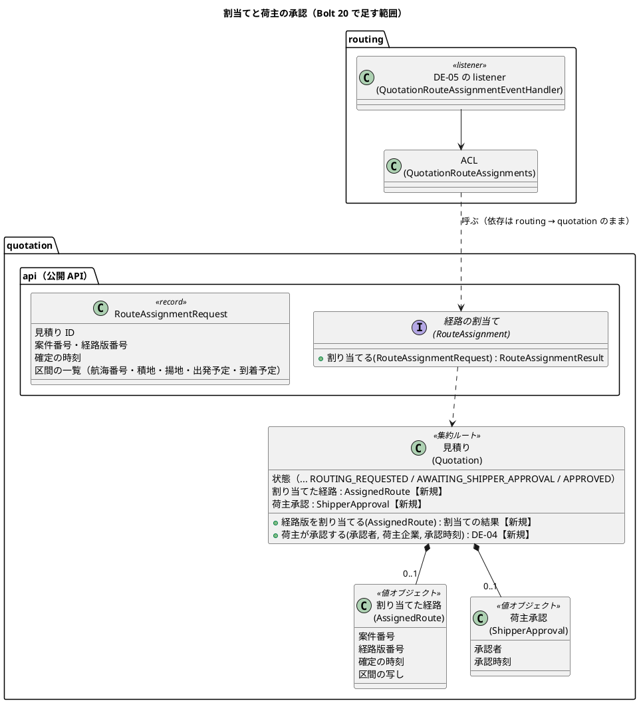
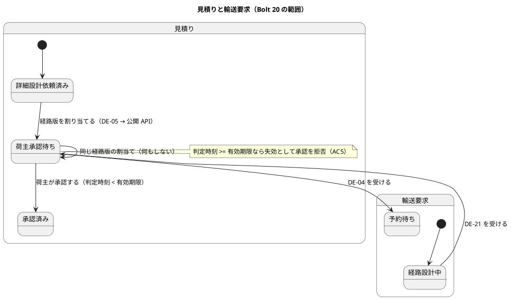
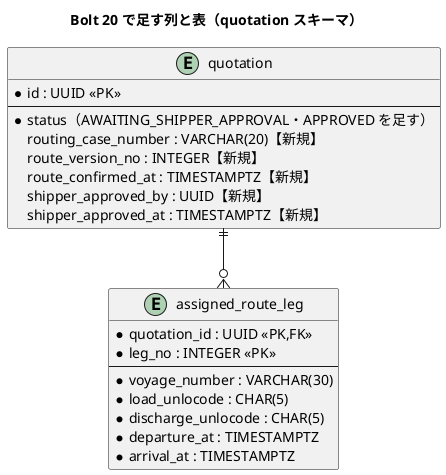
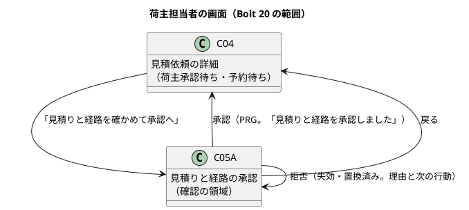

# Bolt 20 計画 - 確定した経路の割当てと荷主の承認（US-24 AC4・AC5）

## 基本情報

| 項目 | 内容 |
| :--- | :--- |
| Bolt | 第 20 回 |
| 予定 | W3（2026-10-19 の週。前倒しで 2026-10-08 から）、3〜4 時間 |
| 対象 | U1 見積り（US-24 AC4 承認、AC5 失効時の拒否）と、U2 経路設計からの割当ての連携（R-INV-11、DE-05 の購読） |
| GitHub | [#5 [US-24] 見積りと経路に回答・承認する（R0.1: AC1・AC4・AC5）](https://github.com/k2works/practical-domain-driven-design-in-enterpris-application/issues/5)（R0.1 の 1 SP。AC1 は Bolt 12 で済み）。AC2・AC3（辞退・相談）は W9 |
| 承認ゲート | 計画の承認（確認ポイント 1〜12）、ADR-014（アーキテクチャ）、見積りの規則の Red・Green、表の変更と公開 API（データベース・モジュールの境界）、C-05 の承認の画面、開発レビューの判断、終了報告 |
| アプローチ | インサイドアウト（既存の集約に振る舞いと表の列を足す Bolt）。ADR で連携の向きを決め、見積りの集約の規則から入り、公開 API と経路設計の listener、最後に画面の層を受入シナリオで駆動する |
| 範囲の決定 | 2026-10-08 に human:kakimomokuri が、Bolt 20 を US-24 AC4・AC5 にすると決めた。D-71 は AI の推奨の形を採ると、Bolt 19 終了報告の承認で決めた |
| 承認ゲートの扱い | 人の指示（`/goal Bolt20`）により、承認ゲートで止まらずに進める。止まらなかったゲートごとに根拠を書き、終了報告の承認の議題に置く（T-36） |
| 前の Bolt | [Bolt 19 終了報告](bolt_19_report.md) |

## Bolt ゴール

経路設計者が経路を確定すると（DE-05）、経路設計の中の listener が見積りの公開 API を呼び、依頼元の見積りに確定した経路版（案件番号・経路版番号・区間の写し）が割り当てられて荷主承認待ちになり、輸送要求も荷主承認待ちになる。荷主担当者は見積依頼の詳細（C-04）から承認の画面を開き、料金・有効期限と確定した経路（区間・到着予定）を確かめて承認する。承認者・承認時刻・承認した経路版が記録され、輸送要求は予約待ちになる。失効（判定時刻が有効期限と同時刻または後）・置換済みの見積りへの承認は拒否され、新しい見積りが必要と示される。

### 確かめたい仮説

| # | 仮説 | この Bolt で分かること |
| :--- | :--- | :--- |
| H1 | 下流から上流への通知を「下流の listener が上流の公開 API を呼ぶ」形にすれば（ADR-014）、モジュールの依存は `routing → quotation :: api・events` のままで、DE-06・DE-07 も同じ形で足せる | ApplicationModules の検証（循環の検出）が緑のまま。`routing` の `allowedDependencies` を変えず、`quotation` は `routing` に依存しない（`quotation` は `allowedDependencies` を宣言していないため、ArchUnit で固定する） |
| H2 | 荷主の承認の画面に要る経路の情報を、割当ての時に写して見積りが持てば（event-carried state transfer の API 版）、見積りは経路設計に問い合わせずに C-05 を描ける | 見積りのコードから `routing` を参照しないこと（ArchUnit） |
| H3 | 割当てを冪等にすれば（同じ経路版の割当ては何もしない）、DE-05 の再配信と Bolt 19 の後に確定した案件の扱いは、再配信だけで済む | 再配信のシナリオが通ること |

## ふりかえりと前の Bolt からの引き継ぎ

| 入力 | 内容 | この Bolt での扱い |
| :--- | :--- | :--- |
| 人の決定（2026-10-08） | Bolt 20 は US-24 AC4・AC5。D-71 は推奨の形 | スコープ、ADR-014（ステップ 1） |
| Bolt 19 レビュー D-71 | 見積りが DE-05 を購読すると循環する。購読者のない間に確定した案件の扱い。イベントの発行の仕方（集約がためるか戻り値か） | ADR-014 に書く。デモ環境は再起動で戻るため、Bolt 19 の後に確定した案件の割当ての補いはしない（確認ポイント 3）。発行の仕方は ADR-014 で「集約の操作がイベントを返すかためるかは集約ごとに選び、発行はアプリケーションサービス」と書く |
| Bolt 19 レビュー D-72 | 承認者の名前、競合で根拠を残す、S-05 の残り時間など | この Bolt では扱わない |
| Try T-53（Bolt 19） | ステップの Green の完了の判定に「計画からの変更を設計文書に反映したか」を入れる | 全ステップの完了の判定 |
| Try T-54（Bolt 19） | コンテキストの間のイベントを足すときは、購読する側の依存（循環しないか）を確認ポイントにする | 確認ポイント 2・5・6 |
| Try T-55（Bolt 19） | 置換のスクリプトは整形の後のファイルに当てる | 全ステップ |
| Try T-56（Bolt 19） | 環境の操作の前に手順書を読む | SonarQube（`sonar-local:start`）、デモ環境 |
| Try T-50・T-51・T-38・T-39・T-41・T-42・T-26・T-33・T-28・T-31・T-21・T-36・R-38 | これまでのとおり | 全ステップ |
| Bolt 19 の S-07・S-06 の文言 | 「割当てと荷主の承認の仕組みは準備中。担当営業に伝える」 | 割当てができるので文言を直す（確認ポイント 10） |

## スコープ

### 設計の約束（Try T-1）

| 設計の約束 | 出典 | この Bolt |
| :--- | :--- | :--- |
| R-INV-11 経路が確定したら依頼元の見積りに経路版を割り当てる（DE-05）。荷主の承認は割り当てた後 | ドメインモデル | 入れる（ADR-014 の形） |
| 見積りの状態: 詳細設計依頼済み → 荷主承認待ち → 承認済み | ドメインモデル | 入れる |
| 輸送要求の状態: 経路設計中 → 荷主承認待ち → 予約待ち | ドメインモデル | 入れる（見積りのイベントを受けた別のトランザクション。Bolt 10・12 と同じ形） |
| Q-INV-10 荷主の承認は、割り当てた経路版が確定済みで、再設計要・旧版でなく、有効期限内のときだけ。承認した経路版を記録する | ドメインモデル | 有効期限・状態・荷主企業を確かめる。再設計要・旧版の判定は、経路の再設計（US-08）と DE-06 を作る W6 で足す（確認ポイント 4） |
| Q-INV-07 失効・置換済みの見積りは承認に使えない。失効は判定時刻 >= 有効期限 | ドメインモデル | 入れる（AC5） |
| DE-04 見積りを荷主が承認した | ドメインモデル | 入れる（輸送要求を予約待ちにする） |
| BR-01 荷主の承認は荷主担当者 1 名で足りる | 要件定義 | 入れる |
| BR-13 見積りと経路の承認は確認の領域を経る | UI 設計 | 入れる（画面そのものを確認の領域にする。C-05・S-07 と同じ形） |

### 入れるもの・入れないもの

| 入れる | 入れない（後の Bolt） |
| :--- | :--- |
| ADR-014（下流から上流への通知の形） | 再設計要・旧版の経路版への承認の拒否（W6、DE-06） |
| `quotation.api` の割当てのポート（`RouteAssignment`）と経路設計の DE-05 の listener | 荷主へのメールの通知（US-23、W9） |
| `Quotation` の経路版の割当てと荷主の承認、DE-21（経路版を見積りに割り当てた。新規）と DE-04 | 本予約の確定（US-04、W4） |
| 輸送要求の荷主承認待ち・予約待ち | 辞退・相談（AC2・AC3、W9） |
| 見積りの表の列（経路版の参照、承認者・承認時刻）と、割り当てた経路の区間の写しの表 | 承認の取消し |
| C-05 の承認の画面、C-04 の承認への入口と状態、S-02 の状態の表示 | S-02 の「予約の確定待ち」の新しい表（US-04 の Bolt） |
| S-07・S-06 の文言の更新 | — |

## 設計（この Bolt の範囲）

### ドメインモデル

> 計画からの変更（ステップ 1。T-53）: UI 設計では荷主の承認の画面は C-17（見積りと経路の承認）で、C-05 は回答の画面のため、この計画の「C-05 の承認」は C-17 として作る（URL は計画のとおり `/approval`）。輸送要求の状態の値は、データモデルの既存の値に合わせて `AWAITING_APPROVAL`（荷主承認待ち）・`READY_TO_BOOK`（予約待ち）にする。割り当てた区間を値オブジェクト（AssignedRouteLeg）にして用語集に足した。
>
> 注（設計への反映。ステップ 1 で反映する）:
>
> - ADR-014 を書く（確認ポイント 2）。ドメインモデルの「上流は下流に依存しない」の説明（DE-05・DE-07 の段落）を ADR-014 の形に直す
> - ドメインモデルに DE-21（経路版を見積りに割り当てた）を足し、DE-05 の購読者を「経路設計の listener が見積りの公開 API を呼ぶ」に、DE-04 の購読者に「見積り: 輸送要求を予約待ちにする」を書く。用語集に割り当てた経路（AssignedRoute）を足す
> - データモデルに、見積りの経路版の参照と荷主承認の列、割り当てた経路の区間の表、状態の値の追加を書く
> - UI 設計に C-05 の承認（URL・文言）と C-04 の入口・状態、S-02 の状態の表示を書く

### 状態遷移

### データモデル

- 経路版の参照は経路設計の業務番号（案件番号）と経路版番号で持ち、`routing` の表に外部キーは張らない（スキーマの所有。ADR-001）。データモデルの ER 図の `routing_case_id` は、画面と URL に内部の ID を出さない（D-4）ため案件番号に変える（確認ポイント 5）
- 荷主承認待ち以後は経路版の参照 3 列が値を持ち、承認済みなら承認者と承認時刻が値を持つ（CHECK）
- `transport_request.status` に `AWAITING_SHIPPER_APPROVAL`・`AWAITING_BOOKING` を足す

### 画面遷移

| 画面 | URL | この Bolt で決めること |
| :--- | :--- | :--- |
| C-04 | `GET /customer/transport-requests/{業務番号}` | 状態「荷主承認待ち」（いま誰の対応待ち: あなた）と「予約待ち」（担当営業）を示す。荷主承認待ちのとき「見積りと経路を確かめて承認へ」 |
| C-05（承認） | `GET /customer/transport-requests/{業務番号}/quotations/{見積り番号}/approval`、`POST …/approval` | 料金明細と合計、有効期限、確定した経路（区間・到着予定。案件番号と経路版を示す）、「この見積りと経路で承認しますか」、承認で本予約が確定するのではなく担当営業が本予約を確定すること、「この見積りと経路で承認する」。失効・置換済みは理由と「担当営業に新しい見積りを依頼してください」 |
| S-02 | `GET /staff/transport-requests` | 詳細経路設計の依頼の表の状態に「荷主承認待ち」「荷主承認済み（予約待ち）」を示す |
| S-06・S-07 | 経路設計 | 「確定した経路は見積りに割り当てられ、荷主の承認に進みます」に直す（Bolt 19 の暫定の文言を戻す） |

## ステップ計画

状態の記号: `[ ]` 未着手、`[-]` 進行中、`[?]` 承認待ち、`[x]` 完了。各ステップの終わりに `check` が緑であることを確かめて push し、CI の結果を確かめてから次のステップに入る（T-14、T-26）。結果の時刻はそのステップの最後のコミットの時刻（T-33）。Red の記録には本命・前提・テストの誤りを書く（T-39）。Green の完了の判定に、計画からの変更を設計文書に反映したかを含める（T-53）。

- [x] **1. ADR-014 と設計文書** 【承認ゲート: アーキテクチャ】
  - `docs/adr/cargo-tracker/014-downstream-to-upstream-notification.md`（下流から上流への通知は、下流の listener が上流の公開 API を呼ぶ。DE-05・DE-06・DE-07 に適用。イベントの発行の仕方の基準）
  - ドメインモデル・データモデル・UI 設計・バックエンドのアーキテクチャ・ユーザーストーリー（US-24 の Bolt 20 の決定）に、確認ポイントの決定を書く
  - 完了の判定: `okf:check` ERROR 0、`documentationTest` 緑。push する
  - 結果（2026-10-08）: ADR-014 を書き、ドメインモデル（DE-05 の購読者、DE-21、DE-04、下流から上流への通知の段落、割当てと承認の段落、Q-INV-10、用語集の割り当てた経路・割り当てた区間）、データモデル（案件番号の参照、確定の時刻、荷主承認、`assigned_route_leg`、輸送要求の状態）、UI 設計（C-17、C-04、S-02、S-07・S-06 の文言、状態の表示）、バックエンドのアーキテクチャ（コンテキストマップ、公開 API の操作）、US-24 の決定に書いた。計画からの変更（C-17、輸送要求の状態の値）は設計の注に書いた。`okf:check` ERROR 0、`documentationTest` 緑
    - 承認ゲートの扱い（T-36）: アーキテクチャの承認ゲートで止まらずに進めた（AI の判断）。根拠は、ADR-014 の決定が D-71 で人が採った推奨の形のとおりであること。終了報告の承認の議題に置く
- [x] **2. 見積りと輸送要求の規則（集約の TDD）** 【承認ゲート: Red／Green】
  - 単体テストを先に書く
    - 割当て: 詳細設計依頼済みに割り当てると荷主承認待ちになり、割り当てた経路を持ち、DE-21 が返る。同じ経路版の割当ては何もしない（冪等）。別の経路版の割当ては拒否（R0.1 は経路版 1 だけ。再設計は US-08）。置換済み・作成中などへの割当ては拒否。失効（有効期限を過ぎた）でも割り当てる（確認ポイント 3）
    - 承認: 荷主承認待ちで、承認時刻が有効期限の 1 分前は承認、同時刻・1 分後は失効で拒否（T-38）。他社の荷主は拒否（Q-INV-08）。置換済み・詳細設計依頼済み（未割当て）・承認済みは拒否。承認者・承認時刻・承認した経路版が記録され、DE-04 が返る
    - 輸送要求: 経路設計中 → 荷主承認待ち（DE-21）、荷主承認待ち → 予約待ち（DE-04）。冪等
  - 完了の判定: `check` 緑。push して CI を確かめる
  - 結果（2026-10-08 10:32〜10:37 JST。Red `7d019bd`、Green `8bab034`）
    - Red: 見積りの割当て（荷主承認待ち・DE-21、同じ経路版の冪等、承認済みへの同じ経路版、別の経路版、詳細設計依頼済みでない・置換済み・失効、期限の後の割当て）と承認（承認済み・DE-04、期限の 1 分前／同時刻／1 分後、割当ての前・置換済み・失効・承認済み、再見積りできない、時刻で失効し数える）、輸送要求の荷主承認待ち・予約待ち（冪等・現在の版・遅れたイベント）、割り当てた経路の値を先に書いた。骨組みは、状態・拒否・割当ての結果の値、割り当てた経路・区間・荷主承認の値、DE-21・DE-04、集約の操作（割り当てない・承認しない）。15 件の失敗を記録した。T-39 の記録: 14 件は本命のアサーション（割当ての結果・承認の理由・状態を変えたか）で落ちた。「荷主承認待ちと承認済みの見積りは再見積りできない」は骨組みが割り当てないため状態の確認（前提）で落ちた。「荷主承認待ちと承認済みの見積りは有効期限と同時刻から失効」は、骨組みでは詳細設計依頼済みのまま同じ結果になるため最初から通った（前提が成り立たない空振り。Green で荷主承認待ちになって意味を持つ）。値オブジェクトのテストは最初から通った
    - Green: `Quotation.assignRoute`・`approveByShipper`・`approvalRejectionAt`、`QuotationStatus.isRoutingStarted`（荷主承認待ち・承認済みも時刻で失効し、再見積りできない）、`TransportRequest.markAwaitingApproval`・`markReadyToBook`。輸送要求は、見積りのイベントで進める状態の並びで先へだけ進める判定にそろえ、既存の DE-03・DE-16 の受け取りも同じ判定にした（振る舞いは変えない）。画面の状態の表示名と拒否の文言は、列挙の網羅のために足した（画面の確かめはステップ 4）。社内の拒否の文言の分岐が Checkstyle の循環的複雑度を超えたため、荷主の承認の 2 つの理由を 1 つの文言にまとめた
    - 計画からの変更: 他社の荷主の拒否（Q-INV-08）は、見積りが荷主企業を持たないため集約ではなく、荷主企業で絞った照会を通すアプリケーション層で確かめる（ステップ 3・4 のテスト）
    - `check` 緑（`test` 1,068 件）
    - 承認ゲートの扱い（T-36）: Red と Green の承認ゲートで止まらずに進めた（AI の判断）。根拠は、テストの表が計画の確認ポイント 3・4・7 と Q-INV-07・10 のとおりであること
- [x] **3. 表・公開 API・経路設計の listener・イベントの購読（統合テスト）** 【承認ゲート: データベース・モジュールの境界】
  - 業務ルール層の受入シナリオを先に書く（`features/quotation/approve_quotation_and_route.feature`、`@US-24-AC4`・`AC5`）: 経路設計者が確定すると見積りが荷主承認待ちになり、荷主が承認すると承認済み・輸送要求が予約待ちになる。有効期限と同時刻の承認は失効で拒否。DE-05 の再配信で割当ては重複しない
  - 統合テスト（PostgreSQL）を先に書く: 見積りの列と区間の表の保存と読み出し、CHECK、状態の値。DE-05 の確定から割当てまでを、イベントの発行の記録を経て非同期に通す（Bolt 17 の DE-16 と同じ形）
  - マイグレーション、`quotation.api.RouteAssignment`（`@NamedInterface("api")`）と実装、経路設計の listener と ACL、DE-21・DE-04 の listener（見積りの中）、入力ポート（荷主の承認）
  - ApplicationModules の検証と ArchUnit: `quotation` は `routing` に依存しない。`routing` の依存は増えない（H1・H2）
  - 完了の判定: `check` 緑。push して CI を確かめる
  - 結果（2026-10-08 10:46〜10:49 JST。Red `8faa42f`、Green `b3ac216`）
    - Red: 業務ルール層の受入シナリオ（`features/quotation/approve_quotation_and_route.feature`。割当てと荷主承認待ち、DE-05 の再配信、承認と予約待ち、期限の 3 点、割当ての前、承認済み、他社の 10 本）、PostgreSQL の統合テスト（割り当てた経路と区間・荷主承認の保存、ID での読み出し、部分一意インデックス、CHECK 3 件、輸送要求の新しい状態）、DE-05 から予約待ちまでの非同期の統合テスト（`RouteConfirmedAssignmentIntegrationTest`。実行ごとに別の航海番号の直行の航海を入れて算出・確定する）、ArchUnit（見積りは経路設計に依存しない）を先に書いた。マイグレーションは本物、ほかは骨組み。13 件の失敗を記録した。T-39 の記録: 受入シナリオの 8 本は、骨組みの割当てが何もしない（荷主承認待ちにならない）か、骨組みの承認の入力ポートが「見つからない」を返すため本命のアサーションで落ちた。PostgreSQL の 3 件は、骨組みのリポジトリが経路版の列を書かずに CHECK（`ck_quotation_route_assigned`）に当たって落ちた（本命）。非同期の統合テストは割当てが起きず本命で落ちた。既存の CHECK のテスト 1 件は「まだ使わない状態」に APPROVED を使っていたため落ちた（仕様の変更。見積りにない値に直した）。他社のシナリオ、CHECK の 3 件、ない ID、ArchUnit、輸送要求の新しい状態の保存は最初から通った（他社は骨組みが「見つからない」を返すため空振り。Green でも通ることを確かめた）
    - Green: `RouteAssignmentService`（公開 API の実装。見積りを ID で読み、割り当てたら保存して DE-21 を発行する。競合の例外は listener のトランザクションごと戻して再配信に任せる）、経路設計の `QuotationRouteAssignmentEventHandler`（DE-05 の経路版の確定の記録の候補の区間を ACL で渡す。割り当てなかった理由は警告のログ）、見積りの DE-21・DE-04 の listener、荷主の承認の入力ポート（`QuotationResponseService.approve`。荷主企業で絞った照会、提示した見積りだけ）、MyBatis の列と区間の表（区間は割当ての後に書き直さない）。業務ルール層の組み立ては、発行する部品（公開 API の実装）と購読する部品が互いに依存するため、購読の登録を別の部品（`EventSubscriptions`）に分けた
    - 計画からの変更: 輸送要求の状態の値はデータモデルの CHECK に初めからあったため、マイグレーションで足さなかった（データモデルの記述を直した）
    - `check` 緑（`test` 1,087 件）。ApplicationModules の検証は緑で、`routing` の `allowedDependencies` は変えていない（H1）。見積りのコードは経路設計を参照しない（ArchUnit。H2）。再配信のシナリオが通った（H3）
    - 承認ゲートの扱い（T-36）: データベース・モジュールの境界の承認ゲートで止まらずに進めた（AI の判断）。根拠は、列・CHECK・表がデータモデルとこの計画の設計のとおりで、公開 API の形がバックエンドアーキテクチャと ADR-014 のとおりであること
- [x] **4. C-05 の承認・C-04・S-02・S-06・S-07（画面の層）** 【承認ゲート: 画面】
  - 画面の単体テストと画面の層の受入シナリオを先に書く（`features/ui/approve_quotation_and_route_ui.feature`、デモ項目 `@demo-bolt-20/approve-quotation-and-route`）: 荷主が依頼 → 経路設計者が算出・確定 → 荷主が C-04 から承認の画面を開いてキー操作だけで承認 → C-04 が予約待ち。幅 320 CSS px。axe-core 0 件。営業・経路設計者は承認の画面を開けない
  - 完了の判定: `check` と `uiTest` 緑。push して CI を確かめる
  - 結果（2026-10-08 11:01〜11:15 JST。Red `4c1c096`、Green は次のコミット）
    - Red: 画面の単体テスト（C-17 の表示・承認できない見積り・承認・拒否と競合の文言、C-04 の確定した経路と承認の入口・承認済み・承認の前の失効、S-02 の荷主承認待ち・荷主承認済み（予約待ち）、S-07・S-06 の文言）、PostgreSQL の統合テスト（経路設計中の表の新しい状態）、セキュリティの統合テスト（営業・経路設計者は C-17 を開けず送れない）、画面の層の受入シナリオ（`features/ui/approve_quotation_and_route_ui.feature`。承認 `@demo-bolt-20/approve-quotation-and-route`、幅 320 CSS px）を先に書いた。骨組みは C-17 のコントローラー（操作なし）と、S-02 の読み取りモデルの状態（詳細設計依頼済みの決め打ち）。`test` で 11 件、`uiTest` で 2 本の失敗を記録した。T-39 の記録: 画面の単体テストの 10 件は表示や文言がない・マッピングがない（本命）、PostgreSQL の 1 件は状態の決め打ち（本命）で落ちた。`uiTest` の 2 本は C-04 に承認の入口が出ない（本命）で落ちた。セキュリティのテストと「業務番号の形でない番号」は最初から通った（`/customer/**` の認可と 404 が覆う）。Bolt 19 の確定の画面の層のシナリオが、このシナリオの足した航海で候補の番号が変わって落ちた（ステップが候補 1 を決め打ちしていた。テストの誤り。番号を問わないように直してからコミットした）
    - Green: `QuotationApprovalController`（C-17）と `approval.html`、割り当てた経路の断片（`assigned-route.html`。C-04 と C-17 で共通）、C-04 の確定した経路・承認の入口・承認済み・承認の前の失効、荷主に見せる状態の表示名（「見積りと経路の承認待ち」「承認済み」）、S-02 の読み取りモデルと SQL（荷主承認待ち・予約待ちの見積依頼）、S-04 の経路設計に進んだ見積りの案内、S-07・S-06 の文言。画面の層のステップの文「荷主が見積りと経路の承認を開く」が既存の「荷主が{word}を開く」と重なった（テストの誤り。言い換えた）
    - 計画からの変更: 画面の番号は C-17（ステップ 1 の注）。C-17 に「条件を見直したい場合は、承認せずに業務番号を添えて担当営業にご連絡ください。」を足し、UI 設計に書いた。営業・経路設計者が開けないことは、画面の層ではなくセキュリティの統合テストで確かめた（`/customer/**` の認可）
    - `check` 緑（`test` 1,097 件）、`uiTest` 緑（56 本）
    - 承認ゲートの扱い（T-36）: 画面の承認ゲートで止まらずに進めた（AI の判断）。根拠は、文言と構成が計画の確認ポイント 7〜10 と UI 設計の C-17・C-04・S-02 の行のとおりであること
- [ ] **5. 開発レビューと終了報告**
  - `developing-review`（連携の向き・冪等・期限の境界・荷主の画面の文言を観点に含める）、SonarQube（`sonar-local:start`）、デモの動画（過去の Bolt の動画は元に戻す）、`bolt_20_report.md`、#5 の AC4・AC5 にチェックを付けてクローズ（R0.1 の範囲。AC2・AC3 は W9 の新しい Issue か #5 の残りとして扱う。確認ポイント 1）
  - デモ環境で、人が RC-2026-0902 を確定し、荷主 A（TR-2026-0905）で承認する流れを確かめる
  - 終了報告の承認の後、人が `DEMO_BOLT=bolt-20 DEMO_ISSUE=5 npx gulp issue:attach-demo` で受入動画を #5 に添付する（gh v2.99.0 以上。運用のコマンドリファレンスの「Issue への受入動画の添付」）

### 時間の配分と打ち切り

| ステップ | 目安 |
| :--- | :--- |
| 1 | 40 分 |
| 2 | 50 分 |
| 3 | 70 分 |
| 4 | 60 分 |
| 5 | 50 分 |
| 合計 | 270 分 |

半日を超えそうなときは、次の順で次の Bolt に回す。

1. S-02 の状態の表示
2. 幅 320 CSS px のシナリオ（キー操作と axe-core は残す）

割当ての冪等、承認の期限の境界、他社の拒否、モジュールの依存の向きは削らない。

## 確認ポイント（計画の承認の場でまとめて確認する。Try T-6）

| # | 確認すること | ステップ | 理由 |
| :--- | :--- | :--- | :--- |
| 1 | #5 は R0.1 の範囲（AC1・AC4・AC5）が済むのでクローズし、AC2・AC3（W9）は新しい Issue にする。US-24 の R0.1 の残りの 1 SP を W3 で数える | 5 | 受入条件の範囲 |
| 2 | ADR-014: 下流から上流への通知は、下流のコンテキストの listener がイベントを受け、上流の公開 API（`api` の名前付きインターフェース）を呼ぶ。上流は下流のイベントを購読しない。DE-05・DE-06・DE-07 に適用する。listener は Spring Modulith の発行の記録を経た別のトランザクションで動き、上流の API は冪等にする | 1 | D-71（循環を避ける）。Bolt 19 終了報告の承認で推奨の形に決まった |
| 3 | 割当ては、見積りが詳細設計依頼済みなら有効期限を過ぎていても行う（荷主承認待ちにし、承認で失効として拒否する）。置換済みなどの割り当てられない見積りは、割り当てずに警告のログを残す（DE-16 の listener と同じ。経路設計の確定は戻さない）。Bolt 19 の後・この Bolt の前に確定した案件は、デモ環境が再起動で戻るため補わない | 2、3 | 期限の判定は承認の時点（Q-INV-07・10）。経路設計の確定と見積りの状態は結果整合（ADR-003） |
| 4 | 再設計要・旧版の経路版への承認の拒否（AC5 の後半、Q-INV-10）は、再設計（US-08）と DE-06 を作る W6 で足す。R0.1 では確定した経路版が変わらないため起きない | 2 | 範囲 |
| 5 | 見積りは経路版を案件番号・経路版番号で参照し、割当ての時に確定の時刻と区間を写す（C-05 で経路設計に問い合わせない）。データモデルの `routing_case_id` は案件番号に変える | 1、3 | H2。内部の ID を画面に出さない（D-4） |
| 6 | 見積りの中のイベントとして DE-21（経路版を見積りに割り当てた）を新しく足し、輸送要求の listener が荷主承認待ちにする。DE-04 で予約待ちにする（Bolt 10・12 と同じ、集約ごとのトランザクション） | 3 | 1 つのトランザクションで 1 つの集約 |
| 7 | 荷主の承認は、ログインした荷主担当者（自社の輸送要求）だけ。承認の時刻は Clock。有効期限と同時刻は失効（Q-INV-07） | 2、4 | BR-01、BR-10 |
| 8 | C-05 の承認は回答（Bolt 12）と同じく画面そのものを確認の領域にし、別の URL（`/approval`）にする。承認は本予約の確定ではない（担当営業が確定する。US-04）と示す | 4 | BR-13、誤読を防ぐ |
| 9 | S-02 は詳細経路設計の依頼の表の状態に「荷主承認待ち」「荷主承認済み（予約待ち）」を示すだけにする。予約の確定待ちの表は US-04 の Bolt | 4 | 範囲 |
| 10 | S-07 と確定の後の S-06 の文言を、割当てができたことに合わせて直す（「確定した経路は見積りに割り当てられ、荷主の承認に進みます」） | 4 | Bolt 19 の暫定の文言 |
| 11 | DE-04・DE-21 の監査証跡への記録は US-17 | 3 | 範囲 |
| 12 | デモ環境のサンプルは足さない（RC-2026-0902 を確定すれば、荷主 A が TR-2026-0905 を承認できる） | 5 | デモ環境での確かめ |

## 完了条件

- [ ] US-24 AC4・AC5 の受入シナリオ（業務ルール層・画面の層）が通る
- [ ] DE-05 の確定から割当て・承認・輸送要求の予約待ちまでが PostgreSQL の統合テストで通る
- [ ] ApplicationModules の検証が緑で、`quotation` は `routing` に依存しない
- [ ] `check` と `uiTest` が緑。push して CI とデモ環境の配備を確かめた
- [ ] SonarQube の Quality Gate が PASS
- [ ] ADR-014 と設計文書に決定を書き、計画からの変更も設計文書に戻した（T-53）
- [ ] 開発レビューと終了報告を書き、#5 をクローズした

## 更新履歴

| 日付 | 内容 | 作成 | 承認 |
| :--- | :--- | :--- | :--- |
| 2026-10-08 | 初版（範囲は人が決めた。確認ポイント 1〜12 は承認待ち） | anthropic/claude-opus-5-5 | — |
| 2026-10-08 | 人の指示（`/goal Bolt20`）により、計画の承認ゲートで止まらずに確認ポイント 1〜12 を推奨のまま採って進めた（AI の判断。T-36。終了報告の承認の議題に置く） | anthropic/claude-opus-5-5 | — |

## 関連ドキュメント

- [Bolt 19 終了報告](bolt_19_report.md)（D-71、Try T-53〜T-56）
- [Bolt 19 開発レビュー](../../review/cargo-tracker/bolt_19_review_20261007.md)
- [Bolt 12 計画](bolt_12_plan.md)（US-24 AC1）
- [ドメインモデル](../../design/cargo-tracker/domain_model.md)
- [データモデル](../../design/cargo-tracker/data_model.md)
- [UI 設計](../../design/cargo-tracker/ui_design.md)
- [ユーザーストーリー](../../requirements/cargo-tracker/user_story.md)（US-24）
- [リリース計画](release_plan.md)（W3）
