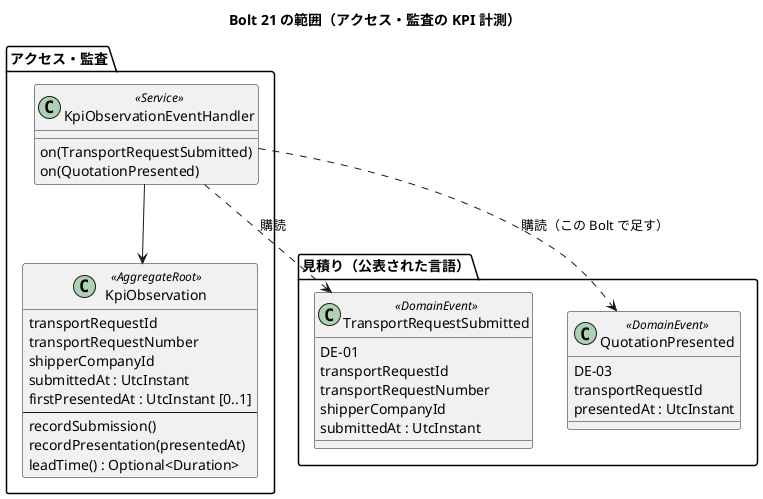
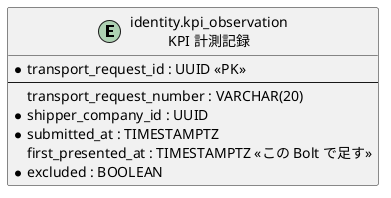

# Bolt 21 計画 - KPI-01 の提示時刻とリードタイム（US-21 AC1）

## 基本情報

| 項目 | 内容 |
| :--- | :--- |
| Bolt | 第 21 回 |
| 予定 | W3（2026-10-19 の週。前倒しで 2026-10-08 から）、3〜3.5 時間 |
| 対象 | U4 アクセス・監査の KPI 計測（US-21 AC1 KPI-01 の 2 時刻）と、U1 見積りの DE-03 の購読 |
| GitHub | [#9 [US-21] パイロットの KPI を計測する（R0.1: AC1 KPI-01 の時刻）](https://github.com/k2works/practical-domain-driven-design-in-enterpris-application/issues/9)（SP 2）。AC2〜AC5（KPI-02、週次の照会、基準値）は W9 の #24 |
| 承認ゲート | 計画の承認（確認ポイント 1〜10）、KPI 計測記録の規則の Red・Green、表の変更（データベース）、S-22 の前身の画面、開発レビューの判断、終了報告 |
| アプローチ | インサイドアウト（ウォーキングスケルトンの集約に振る舞いと表の列を足す Bolt）。集約の規則から入り、表と listener、最後に画面の層を受入シナリオで駆動する |
| 範囲の決定 | リリース計画の W3 の残り（US-21 AC1）。2026-10-08 に human:kakimomokuri が Bolt 21 の計画を作るよう指示した |
| 前の Bolt | [Bolt 20 終了報告](bolt_20_report.md) |

## Bolt ゴール

見積りが荷主に提示されると（DE-03）、アクセス・監査の listener が KPI 計測記録にその輸送要求の最初の提示時刻を UTC で記録する。再見積りで 2 回目以降の提示があっても、最初の提示時刻は変わらない。KPI 計測記録は、版 1 の提出時刻（Bolt 1 で記録済み）と最初の提示時刻から、輸送要求ごとの KPI-01 のリードタイムを求める。社内の KPI 計測記録の画面（S-22 の前身）に、業務番号・提出時刻・最初の提示時刻・リードタイムが示される。

### 確かめたい仮説

| # | 仮説 | この Bolt で分かること |
| :--- | :--- | :--- |
| H1 | KPI の計測は、見積りの公表された言語（DE-01・DE-03）を購読するだけで作れる。見積りの側は変えない | `identity` の `allowedDependencies`（`shared`、`quotation :: events`）を変えずに済むこと。見積りのコードに差分がないこと |
| H2 | 最初の提示時刻を「まだ無いか、届いた時刻のほうが早いときだけ書く」条件付きの更新にすれば、DE-03 の再配信と順序の入れ替わりは、受信側の冪等性だけで済む | 再配信と順序の入れ替わりのテストが通ること |

## ふりかえりと前の Bolt からの引き継ぎ

| 入力 | 内容 | この Bolt での扱い |
| :--- | :--- | :--- |
| リリース計画（W3） | 残りは US-21 AC1（KPI-01 の時刻） | スコープ |
| Bolt 3 レビュー D-11 | KPI-01 の終点の「有効な」の定義。推奨は「誤りで取り消した見積りは数えない。荷主の条件変更で出し直した見積りは最初の提示を終点のまま」。ドメインモデルの KPI-INV-01 は「人が決める」のまま | 確認ポイント 2 で決める |
| UI 設計（S-22 の前身） | 日時を UTC だけで示している。利用者のタイムゾーンを主にし UTC を併記する共通部品は「US-21 の Bolt で適用する」 | ステップ 4 で適用する |
| データモデル（`kpi_observation`） | DE-03 で最初の提示時刻だけを記録する（2 回目以降は更新しない）。`first_presented_at` は未作成 | ステップ 3 で列を足す |
| Try T-57（Bolt 20） | 状態の列挙に値を足すときは、その状態を見る判定を洗い出す | この Bolt は状態の列挙に値を足さない（確認ポイント 9） |
| Try T-58（Bolt 20） | listener を足すときは、受入テストとは別に、拒否と警告のログの経路の単体テストを Red に入れる | ステップ 3（提出の記録がない DE-03 の経路） |
| Try T-59（Bolt 20） | 画面の層のステップは、ほかのシナリオが足したデータで変わる値を決め打ちしない | ステップ 4（一覧の行の数・順番を決め打ちしない） |
| Try T-60（Bolt 20） | テンプレートで値の有無を見るときは `!= null` を書く | ステップ 4（未提示の行） |
| Try T-53〜T-56・T-50・T-51・T-38・T-39・T-41・T-42・T-26・T-33・T-28・T-31・T-21・T-36・R-38 | これまでのとおり | 全ステップ |

## スコープ

### 設計の約束（Try T-1）

| 設計の約束 | 出典 | この Bolt |
| :--- | :--- | :--- |
| KPI-INV-01 KPI-01 は、版 1 を最初に提出した時刻と、最初の有効な見積り・経路方針の提示時刻から求める。差戻し・再提出・新しい版で開始時刻を戻さない（D-3） | ドメインモデル | 入れる。「有効な」は確認ポイント 2 |
| Q-INV-05 見積りの提示した時刻を記録する（KPI-01） | ドメインモデル | 見積りの側は済み（Bolt 10、DE-03 の `presentedAt`）。この Bolt は購読するだけ |
| DE-03 の購読者に KPI 計測（KPI-01 の終了時刻） | ドメインモデル | 入れる |
| `kpi_observation` は DE-01 で作り、DE-03 で最初の提示時刻だけを記録する | データモデル | 入れる |
| 時刻は UTC で記録する | US-21 AC1 | 入れる（`UtcInstant`、`TIMESTAMP WITH TIME ZONE`） |
| 日時表示の共通部品（利用者のタイムゾーンを主にし UTC を併記） | UI 設計 | S-22 の前身に入れる |
| PV-01 の除外（訓練データ、顧客都合の取消し） | KPI-INV-01 | 入れない（W9。確認ポイント 6） |

### 入れるもの・入れないもの

| 入れる | 入れない（後の Bolt） |
| :--- | :--- |
| `KpiObservation` の最初の提示時刻の記録と KPI-01 のリードタイム | KPI-02 と照会記録（AC2・AC3、W9） |
| DE-03 の listener（アクセス・監査の中） | 週次の中央値・90 パーセンタイルと母集団の絞り込み（AC4、W9） |
| `kpi_observation.first_presented_at` の列 | 基準値の登録（AC5、`kpi_baseline`、`kpi:baseline:register`、W9） |
| S-22 の前身の画面に、最初の提示時刻・リードタイムと日時表示の共通部品 | PV-01 の除外の操作（`excluded` の入力） |
| デモ環境のサンプルの提示時刻 | S-22 の監査担当者への認可（確認ポイント 5） |

## 設計（この Bolt の範囲）

### ドメインモデル

- `recordPresentation(presentedAt)`: 最初の提示時刻がまだ無いか、届いた提示時刻のほうが早いときだけ書く。提出時刻より前の提示時刻は拒否する（あり得ない順序。確認ポイント 4）
- `leadTime()`: 最初の提示時刻があるときだけ、提出時刻からの経過時間を返す。単位の換算と丸めは画面の側で行う（確認ポイント 3）

### 状態遷移

KPI 計測記録は状態の列挙を持たない（最初の提示時刻の有無だけ）。状態遷移図は省く。

### データモデル

- マイグレーション（`common`）で `first_presented_at` を NULL を許す列として足し、日本語のコメントを付ける。CHECK（`first_presented_at IS NULL OR first_presented_at >= submitted_at`）を足す
- 記録は `UPDATE ... SET first_presented_at = #{presentedAt} WHERE transport_request_id = #{id} AND (first_presented_at IS NULL OR first_presented_at > #{presentedAt})` の条件付きの更新にする（H2・PostgreSQL の両方で動く形。ADR-007）
- `exclusion_reason`・`excluded_by` は PV-01 の除外を作る W9 で足す（データモデルのとおり）

### 画面遷移

画面遷移は変わらない（社内のナビの「KPI 計測記録」→ `GET /staff/kpi-observations`）。一覧の列だけを変える。

| 列 | 内容 |
| :--- | :--- |
| 業務番号 | 今のまま（業務番号のない古い記録は「（業務番号なし）」） |
| 提出時刻 | 日時表示の共通部品（例: 2026-10-05 10:00 Asia/Tokyo（UTC+09:00）（UTC 2026-10-05 01:00）） |
| 最初の提示時刻 | 同じ部品。未提示は「未提示」 |
| KPI-01 リードタイム | 時間と分（例: 26 時間 30 分）。未提示は「—」と、読み上げ用に「未提示のため算出しない」 |

表の見出しに `scope="col"` を付け、caption を「輸送要求ごとの KPI-01 の時刻とリードタイム」にする。

## ステップ計画

状態の記号: `[ ]` 未着手、`[-]` 進行中、`[?]` 承認待ち、`[x]` 完了。各ステップの終わりに `check` が緑であることを確かめて push し、CI の結果を確かめてから次のステップに入る（T-14、T-26）。結果の時刻はそのステップの最後のコミットの時刻（T-33）。Red の記録には本命・前提・テストの誤りを書く（T-39）。Green の完了の判定に、計画からの変更を設計文書に反映したかを含める（T-53）。

- [ ] **1. 設計文書** 【承認ゲート: 計画の確認ポイントの反映】
  - ドメインモデル（KPI-INV-01 の「有効な」の決定、DE-03 の購読者）、データモデル（`first_presented_at` の CHECK と条件付きの更新）、UI 設計（S-22 の前身の列）、ユーザーストーリー（US-21 の Bolt 21 の決定）に、確認ポイントの決定を書く
  - 完了の判定: `okf:check` ERROR 0、`documentationTest` 緑。push する
- [ ] **2. KPI 計測記録の規則（集約の TDD）** 【承認ゲート: Red／Green】
  - 単体テストを先に書く
    - 提示の記録: 未提示に記録すると最初の提示時刻になる。より遅い提示時刻は無視する（再見積り）。より早い提示時刻は書き換える（順序の入れ替わり）。同じ時刻は何もしない（再配信）。提出時刻より前の提示時刻は拒否する。提出時刻と同時刻は受け付ける（T-38 の境界）
    - リードタイム: 未提示は空。提出の 1 分後・26 時間 30 分後の提示で、その経過時間を返す。版 2 の提出（DE-01 の 2 回目）は開始時刻を変えない（D-3。既存のテストを確かめる）
  - 完了の判定: `check` 緑。push して CI を確かめる
- [ ] **3. 表・listener（統合テスト）** 【承認ゲート: データベース】
  - 業務ルール層の受入シナリオを先に書く（`features/identity/kpi_01_lead_time.feature`、`@US-21-AC1`）: 荷主が提出し、営業担当者が見積りを提示すると、KPI 計測記録に提出時刻と最初の提示時刻が UTC で記録され、リードタイムが求まる。再見積りで 2 回目の提示があっても最初の提示時刻は変わらない。DE-03 の再配信で記録は変わらない
  - ウォーキングスケルトンのシナリオ（`walking_skeleton.feature`）は今のまま残す（提出の記録だけを見る）
  - 統合テスト（PostgreSQL）を先に書く: 列の保存と読み出し、CHECK、条件付きの更新（未提示・遅い・早い・同じ時刻）。DE-03 から記録までを、イベントの発行の記録を経て非同期に通す
  - listener の単体テスト（T-58）: 提出の記録がないときの DE-03 は警告のログを残して例外を投げ、発行の記録を未完了のまま残す（確認ポイント 4）。提出時刻より前の提示時刻も同じ
  - マイグレーション、リポジトリの契約テストと実装（MyBatis・テスト用のメモリ）、listener
  - ApplicationModules の検証: `identity` の依存は増えない（H1）。見積りのコードに差分がない
  - 完了の判定: `check` 緑。push して CI を確かめる
- [ ] **4. S-22 の前身の画面** 【承認ゲート: 画面】
  - 画面の層の受入シナリオを先に書く（`features/ui/kpi_observations_ui.feature`、`@ui @US-21-AC1`）: 営業担当者が KPI 計測記録を開くと、提示済みの輸送要求の行に提出時刻・最初の提示時刻・リードタイムが、未提示の行に「未提示」が示される。行の数と順番は決め打ちしない（T-59）。axe-core の違反 0 件、幅 320 CSS px で横に流れない
  - コントローラーの単体テスト、表示の値（`KpiObservationView`）、テンプレート（`!= null`。T-60）
  - 日時表示は、`identity` から見積りの画面の部品（`TransportRequestLabels`）を参照しないよう、同じ書式を `identity.interfaces.web` に置くか `shared` に移す（確認ポイント 7）
  - 完了の判定: `check`・`uiTest` 緑。push して CI とデモ環境の配備を確かめる
- [ ] **5. デモ環境・開発レビュー・終了報告** 【承認ゲート: 開発レビューの判断、終了報告】
  - デモ環境のサンプル（`db/dev-data`）の提示済みの輸送要求に、最初の提示時刻を入れる（確認ポイント 8）
  - 5 視点の開発レビュー、SonarQube の Quality Gate、デモ項目と動画、終了報告。#9 をクローズし、リリース計画の W3 を締める準備をする
  - 完了の判定: 終了報告の承認

### 時間の配分と打ち切り

| ステップ | 目安 |
| :--- | :--- |
| 1 | 20 分 |
| 2 | 30 分 |
| 3 | 60 分 |
| 4 | 50 分 |
| 5 | 50 分 |
| 合計 | 210 分 |

半日を超えそうなときは、次の順で次の Bolt に回す。

1. 幅 320 CSS px のシナリオ（キー操作と axe-core は残す）
2. デモ環境のサンプルの提示時刻

最初の提示時刻の冪等と順序の入れ替わり、提出の記録がないときの扱い、リードタイムの算出は削らない。

## 確認ポイント（計画の承認の場でまとめて確認する。Try T-6）

| # | 確認すること | ステップ | 理由 |
| :--- | :--- | :--- | :--- |
| 1 | #9 は AC1 が済むのでクローズし、US-21 の R0.1 の 2 SP を W3 で数える。W3 は 11 SP（計画 10 SP）で締める | 5 | 受入条件の範囲 |
| 2 | D-11 を推奨のとおりに決める: KPI-01 の終点は、その輸送要求で最初に提示した見積りの DE-03 の提示時刻。荷主の条件変更・再見積りで出し直しても最初の提示を終点のままにする。「誤りで取り消した見積り」を数えない規則は、見積りの取消しの操作がまだ無いため、取消しを作るときに足す（ドメインモデルに注で書く） | 1、2 | KPI-INV-01 の「人が決める」を閉じる |
| 3 | リードタイムは暦の経過時間（営業日・営業時間に換算しない）で、画面には時間と分で示す（分未満は切り捨て）。週次の中央値・90 パーセンタイルの単位は W9 で決める | 2、4 | KPI-01 の算式に営業時間の定めがない。D-28 で対応待ちを含めて測ると決めた |
| 4 | 提出の記録がないまま DE-03 が届いたとき（DE-01 の処理の遅れ・失敗）は、警告のログを残して例外を投げ、イベントの発行の記録を未完了のまま残す（起動のときの再配信で記録できる。ADR-014 の再配信と同じ）。提出時刻より前の提示時刻も同じ扱い | 2、3 | 記録を黙って捨てると KPI-01 の母集団が欠ける |
| 5 | S-22 の監査担当者への認可は、この Bolt では入れない。KPI 計測記録の画面は今のまま営業担当者（`/staff/**`）が見る。監査担当者の利用者・認可と S-22 の本体（週次の値）は W9 の US-21 の残りで作る | 4 | 範囲。認可の変更はセキュリティの承認ゲートで、監査担当者の利用者もまだいない |
| 6 | PV-01 の除外（`excluded` の操作、除外の理由・判断者の列）は W9 | 3 | 範囲 |
| 7 | 日時表示の書式は `identity` の画面の中に置き、見積りの画面の部品を参照しない（モジュールの境界）。同じ書式が 3 つ目のモジュールで要るようになったら `shared` に移す | 4 | `identity` は `quotation :: events` にしか依存できない |
| 8 | デモ環境のサンプルは、Bolt 18 の提示済み以降の状態の輸送要求に、相対の日時で最初の提示時刻を入れる。行は足さない | 5 | デモ環境で KPI-01 を確かめられるように |
| 9 | 状態の列挙に値を足さないので、T-57 の洗い出しは要らない | — | Try T-57 |
| 10 | 見積りの DE-03 の中身は変えない（`presentedAt` と `transportRequestId` だけを使う） | 3 | H1 |

## 完了条件

- [ ] US-21 AC1 の受入シナリオ（業務ルール層・画面の層）が通る
- [ ] DE-03 から最初の提示時刻の記録までが PostgreSQL の統合テストで通り、再配信と順序の入れ替わりで記録が変わらない
- [ ] ApplicationModules の検証が緑で、`identity` の依存が増えていない
- [ ] `check` と `uiTest` が緑。push して CI とデモ環境の配備を確かめた
- [ ] SonarQube の Quality Gate が PASS
- [ ] 設計文書に決定を書き、計画からの変更も設計文書に戻した（T-53）
- [ ] 開発レビューと終了報告を書き、#9 をクローズした

ユーザーマニュアル（`docs/manual`）はまだ無いため、この Bolt では更新の作業を持たない。

## 更新履歴

| 日付 | 内容 | 作成 | 承認 |
| :--- | :--- | :--- | :--- |
| 2026-10-08 | 初版（範囲はリリース計画の W3 の残り。確認ポイント 1〜10 は承認待ち） | anthropic/claude-opus-5-5 | — |

## 関連ドキュメント

- [Bolt 20 終了報告](bolt_20_report.md)（Try T-57〜T-60）
- [Bolt 1 計画](bolt_01_plan.md)（ウォーキングスケルトン、KPI 計測記録の提出時刻）
- [Bolt 3 開発レビュー](../../review/cargo-tracker/bolt_03_review_20261002.md)（R-20、D-11）
- [ドメインモデル](../../design/cargo-tracker/domain_model.md)（KPI-INV-01、DE-03）
- [データモデル](../../design/cargo-tracker/data_model.md)（`kpi_observation`）
- [UI 設計](../../design/cargo-tracker/ui_design.md)（S-22）
- [ユーザーストーリー](../../requirements/cargo-tracker/user_story.md)（US-21）
- [リリース計画](release_plan.md)
