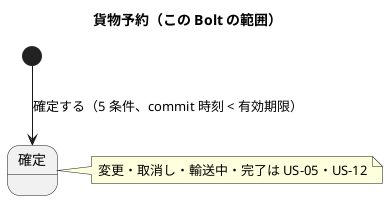
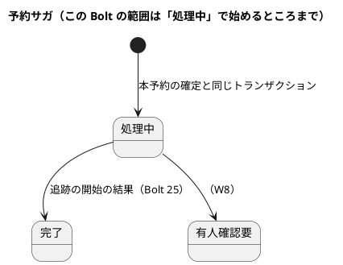
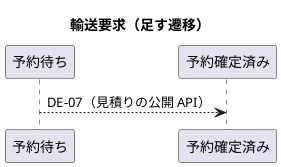
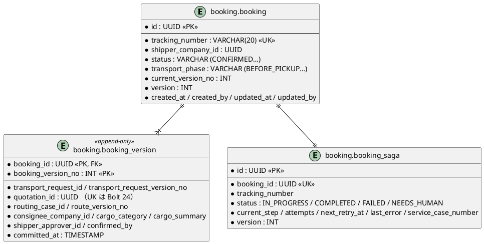
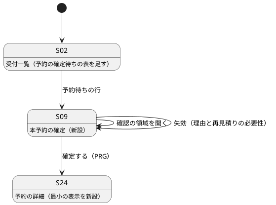

# Bolt 23 計画 - 本予約の確定と失効（US-04 AC1・AC2）

## 基本情報

| 項目 | 内容 |
| :--- | :--- |
| Bolt | 第 23 回 |
| 予定 | W4（2026-10-26 の週。前倒しで 2026-10-08 から）、3.5〜4 時間。半日を超えそうならステップ 6 で切る（下の「時間の配分と打ち切り」） |
| 対象 | U6 予約管理（新設の `booking` モジュール）と、U1 見積りの公開 API・輸送要求の予約確定済み |
| GitHub | [#10 [US-04] 予約を確定する（R0.1: AC1・AC2・AC4・重複確定の防止）](https://github.com/k2works/practical-domain-driven-design-in-enterpris-application/issues/10)（SP 5 は #10 をクローズする Bolt 25 で数える） |
| 承認ゲート | 計画の承認（確認ポイント 1〜14）、ADR（アーキテクチャ）、確定の規則の Red・Green（U6 の密度）、スキーマ（データベース）、見積りの公開 API と listener（モジュールの境界）、画面と認可（セキュリティ）、開発レビューの判断、終了報告。W4 の計画どおり `/goal` は使わない |
| アプローチ | インサイドアウト（開発戦略の「Bolt ごとのアプローチの決め方」の「新しい集約・新しいスキーマを作る」）。データ → ドメイン → アプリケーション → 画面の順に、層の境界を承認ゲートにする。業務ルール層の受入シナリオはステップ 4 でアプリケーション層の入口として書く |
| 範囲の決定 | W4 の計画（2026-10-08 に human:kakimomokuri が承認）の Bolt 23 の行 |
| 前の Bolt | [Bolt 22 終了報告](bolt_22_report.md) |

## Bolt ゴール

営業担当者が予約待ちの見積りを S-09 で開き、BR-01 の確定条件（有効な見積り、必須貨物情報、荷主担当者 1 名の承認、承認済み経路版、営業担当者による確認）がそろっていることを確かめて本予約を確定すると、貨物予約と予約版 1 が記録され、推測されにくい一意な追跡番号と commit 時刻が残り、予約サガが「処理中」で始まる。DE-07（本予約を確定した）が発行され、見積りの listener が輸送要求を予約確定済みにする。commit 時刻が見積有効期限と同時刻以後なら確定せず、失効と再見積りの必要性を示す。

### 確かめたい仮説

| # | 仮説 | この Bolt で分かること |
| :--- | :--- | :--- |
| H1 | 予約は見積りの公開 API だけで確定条件をそろえられる（経路版の状態は、見積りが割り当てた経路の写しで足りる）。`booking` の依存は `shared`・`platform :: web`・`quotation :: api`・`quotation :: events` だけで済み、`routing` に依存しない | ModularityTest が通ること。`booking` の `allowedDependencies` に `routing` がないこと |
| H2 | 失効の判定（BR-10、Q-INV-06）を見積りの 1 か所に置き、予約は commit 時刻を渡して結果を受けるだけにすれば、予約の側に期限の規則の写しは要らない | 予約のコードに有効期限の比較がないこと。境界（1 分前・同時刻・1 分後）のテストが見積りの API の側で通ること |
| H3 | DE-07 の見積りの側の受け口は、Bolt 22 の割り込みの部品（楽観ロックの競合での読み直し）を使えば、DE-04 の listener との競合に耐える | DE-04 と DE-07 を並行に動かす統合テストが通ること |

## ふりかえりと前の Bolt からの引き継ぎ

| 入力 | 内容 | この Bolt での扱い |
| :--- | :--- | :--- |
| W4 の計画（設計の決定） | 予約サガと追跡の開始: 追跡の listener が DE-07 を購読し、結果を予約の公開 API へ返す。依存は `tracking → booking` だけ。予約から見積りの確定可否: 見積りの公開 API に commit 時刻を渡して判定を受ける | ステップ 1 の ADR-015・ADR-016 |
| Bolt 11 レビュー R-19 | 見積りに「予約確定に使えるか（commit 時刻）」を置き、問い合わせ方を ADR で決める | ADR-016 |
| Bolt 3 レビュー R-31 | 本予約で業務番号を引き継ぐか | 確認ポイント 6 |
| Bolt 20 レビュー D-78 | S-02 の予約の確定待ちの表（割当て時刻・承認時刻の列、有効期限の近い順）、「上流は下流に依存しない」の ArchUnit の規則の一般化。DE-21・DE-04 の再配信のシナリオは Bolt 24 | ステップ 5（表）とステップ 3（規則） |
| Bolt 22 終了報告（既知の課題・次の Bolt） | DE-07 の見積りの側の受け口に、輸送要求を進める部品（`TransportRequestProgression`）を使うか。予約・追跡のモジュールは最初から `allowedDependencies` を明示する。社内の画面は `DateTimeDisplay.staff` | 確認ポイント 8・ステップ 3 |
| Try T-54（Bolt 19） | コンテキストの間のイベントを足すときは、購読する側の依存が循環しないか | 確認ポイント 2・ステップ 3 |
| Try T-55（Bolt 19） | 置換は `spotlessApply` の後のファイルに当てる | 全ステップ |
| Try T-57（Bolt 20） | 状態の列挙に値を足すときは、その状態を見る判定を洗い出す | 輸送要求に `BOOKED` を足す（ステップ 3）。洗い出した箇所は下の「設計の約束」 |
| Try T-58（Bolt 20） | listener と公開 API には、業務の拒否と警告のログの経路の単体テストを Red に入れる | ステップ 3 |
| Try T-61〜T-63（Bolt 21） | メモリのリポジトリは写しを返す、listener の欠けを「再配信で直るか」で分ける、「N 個目で」の規則は N 個目の計画に入れる | ステップ 2〜4 |
| Try T-64（Bolt 22） | ArchUnit の禁止の規則は、コードを grep して正当な使い道がないか確かめてから書く | ステップ 3 の「上流は下流に依存しない」の一般化 |
| Try T-65（Bolt 22） | CI を赤にする Red のコミットはローカルにためて、Green と同じ push にまとめる | 全ステップ |
| Try T-26・T-36・T-38 ほか | これまでのとおり（境界の 3 点は T-38） | 全ステップ |

## スコープ

### 設計の約束（Try T-1）

| 設計の約束 | 出典 | この Bolt |
| :--- | :--- | :--- |
| 貨物予約（Booking）は予約 ID で識別し、予約版・追跡番号を持つ。予約版は不変（B-INV-08） | domain_model.md の貨物予約 | 作る（変更・取消申請、輸送段階の遷移は US-05・US-12） |
| B-INV-01 5 条件がそろったときだけ確定する | domain_model.md | 確定条件の値（`BookingConditions`）と、そろわないときの拒否を作る。不足条件の一覧の表示と AC3 の受入シナリオは W6 |
| B-INV-02 有効性は commit 時刻で判定し、同時刻以後は失効 | domain_model.md、BR-10、Q-INV-06 | 判定は見積りの公開 API（ADR-016）。予約は commit 時刻を渡す |
| B-INV-03 再送で重複しない、B-INV-11 1 つの見積りから予約は 1 件 | domain_model.md | Bolt 24（`processed_command`、`booking_version.quotation_id` の UK） |
| B-INV-04 特殊貨物は確定しない、B-INV-05 再設計要・旧版の経路版を使わない | domain_model.md | W6（AC5、US-08）。R0.1 の確定条件には入れない（見積りの提出の段階で特殊貨物は拒否済み） |
| B-INV-10 カスタマーサポートは確定できない | domain_model.md、architecture_backend.md | `/staff/bookings/**` を営業担当者に限り、アプリケーション層でも役割を確かめる |
| 追跡番号は推測されにくい一意な番号（TrackingNumberIssuer） | domain_model.md、architecture_backend.md | 作る（形式は確認ポイント 5） |
| 予約サガの状態を永続化し、後続が完了するまで成功と表示しない | architecture_backend.md、ui_design.md の処理中表示 | 「処理中」で始める表と値を作る。追跡の開始と「完了」への遷移は Bolt 25 |
| DE-07 は ADR-014 の形で見積りに通知する | ADR-014、domain_model.md | 予約の listener が自分の DE-07 を受け、見積りの公開 API で輸送要求を予約確定済みにする |
| 輸送要求の状態に予約確定済み（`BOOKED`）を足す（DB の CHECK にはすでにある） | data_model.md | 足す。T-57 で洗い出す箇所: `TransportRequest` の進行の表と `markReadyToBook`・`hasReached`、`TransportRequestLabels` の表示名（社内・荷主）、`QuotationMapper.xml` の S-02 の `IN` |
| 社内の日時は `DateTimeDisplay.staff` | Bolt 22 | S-09・S-24 |

### 入れるもの・入れないもの

| 入れる | 入れない |
| :--- | :--- |
| ADR-015（予約サガと追跡の開始）、ADR-016（予約から見積りの確定可否）と、矛盾する設計文書の修正 | 追跡の開始・`tracking` モジュール（Bolt 25） |
| `booking` モジュール、`booking` スキーマの `booking`・`booking_version`（追記専用）・`booking_saga` | `processed_command`・`booking_version.quotation_id` の UK（Bolt 24） |
| 貨物予約・予約版・確定条件・追跡番号・予約サガの状態の型と規則 | 予約サガの再試行（RTY-02）・有人確認要・有人案件の起票（W8 の US-20、W4 の計画どおり） |
| 見積りの公開 API: 確定に使える見積りの照会（commit 時刻を渡す）と、予約確定済みの通知の受け口。輸送要求の `BOOKED` | 不足条件の一覧の表示と AC3、特殊貨物の AC5（W6） |
| S-09 本予約の確定（確定条件の表と営業担当者の確認、確認の領域）、確定後の S-24 の最小の表示（追跡番号・予約版・commit 時刻・サガの「処理中」） | S-24 の「追跡の開始: 処理中・完了」の表示の更新（Bolt 25） |
| S-02 の予約の確定待ちの表（D-78。割当て時刻・承認時刻の列、有効期限の近い順） | 社内のナビの「予約」の一覧（`/staff/bookings` の準備中の画面は残す） |
| 業務ルール層と画面の層の受入シナリオ（`@US-04-AC1`・`@US-04-AC2`・`@BR-10`） | ユーザーマニュアル（W4 の完了の後に作る。W4 の計画） |

## 設計（この Bolt の範囲）

### ドメインモデル

```plantuml
@startuml
package "booking" {
  class Booking <<集約ルート>> {
    予約 ID
    荷主企業 ID
    追跡番号
    状態 = 確定
    版
    {static} 確定する(確定条件, commit 時刻, 追跡番号, 確定者): 確定の結果
  }
  class BookingVersion <<エンティティ・不変>> {
    予約版番号 = 1
    輸送要求 ID・版
    見積り ID
    経路版（案件 ID・版番号）
    荷受人・貨物区分・貨物の要約（写し）
    荷主承認者
    確定者
    commit 時刻
  }
  class BookingConditions <<値>> {
    有効な見積り
    必須貨物情報
    荷主の承認
    承認済み経路版
    営業担当者の確認
    不足条件()
  }
  class TrackingNumber <<値>>
  class BookingSaga <<サガの状態>> {
    予約 ID
    状態 = 処理中
    現在の段階
  }
  interface TrackingNumberIssuer <<ファクトリ>>
  Booking *-- "1..*" BookingVersion
  Booking --> TrackingNumber
  Booking ..> BookingConditions
  BookingSaga --> Booking
}
package "quotation :: api" as qa {
  interface BookableQuotationQuery {
    確定に使えるか(見積り ID, commit 時刻): 確定に使える見積り | 使えない理由
  }
  interface BookingNotification {
    予約確定済みにする(輸送要求 ID, 見積り ID, 予約 ID): 受付の結果
  }
}
package "quotation :: events" as qe
Booking ..> qa : 確定の時に照会
BookingSaga ..> qa : DE-07 の listener が通知
@enduml
```

- 名前は案（確認ポイント 4）。`BookableQuotationQuery` の戻り値は、承認済みで commit 時刻が有効期限より前のときだけ、確定条件に要る写し（輸送要求 ID・版、荷主企業、荷受人、貨物区分・要約、荷主承認者、割り当てた経路版）を返し、それ以外は理由（失効・未承認・置換済み・見つからない）を返す（ADR-014 の「業務の拒否は結果の値で返す」）
- DE-07 の payload: 予約 ID、予約版番号、追跡番号、見積り ID、輸送要求 ID、経路版、commit 時刻、発行元の集約の版（B-INV-12。domain_model.md に足す）

### 状態遷移







### データモデル



列と制約は [データモデル](../../design/cargo-tracker/data_model.md) の `booking` スキーマのとおり。業務番号の列は確認ポイント 6 で決める。`{vendor}`（PostgreSQL・H2）の Flyway と `afterMigrate` の追記専用の権限・印は既存のスキーマにそろえる。

### 画面遷移



URL（ui_design.md の URL の表に足す。確認ポイント 9）: S-09 `GET/POST /staff/bookings/new?quotation={業務番号}`、S-24 `GET /staff/bookings/{追跡番号}`。

## ステップ計画

状態の記号: `[ ]` 未着手、`[-]` 進行中、`[?]` 承認待ち、`[x]` 完了。各ステップの終わりに `check` が緑であることを確かめ、Green と同じ push にまとめて CI を確かめる（T-26、T-65）。

- [ ] **1. ADR-015・ADR-016 と設計文書** 【承認ゲート: アーキテクチャ】
  - ADR-015 予約サガと追跡の開始: 追跡の listener が DE-07 を購読して追跡を開始し、結果を予約の公開 API で返す。依存は `tracking → booking` だけ。サガの状態は予約に置く。追跡の開始の再試行は追跡の側の再配信と冪等で担い、予約のサガは「処理中」の滞留を見て有人確認要にする（W8）
  - ADR-016 予約から見積りの確定可否: 予約は commit 時刻を渡して見積りの公開 API で照会し、判定（Q-INV-06・BR-10）は見積りの 1 か所に置く。確定に要る写しを戻り値で受け、予約は見積りに問い合わせ直さない
  - 設計文書を直す: architecture_backend.md の予約サガの図と表・:313 の再試行の記述、domain_model.md の DE-07 の購読者と予約サガの流れ・B-INV-02 の注記・DE-07 の payload に発行元の版、B-INV-06 の向き（US-05 で直すと注記）、test_strategy.md の US-04 の Gherkin の例のタグと境界の 3 点、data_model.md（確認ポイント 6 の決定）、ui_design.md の URL の表
  - 完了の判定: `okf:check` ERROR 0、`documentationTest` 緑
- [ ] **2. 貨物予約の規則（集約の TDD）** 【承認ゲート: Red／Green（確定）】
  - 単体テストを先に書く: 5 条件がそろうと確定し、予約版 1・追跡番号・commit 時刻・確定者を持ち、DE-07 が返る。条件が 1 つでも欠けると確定しない（B-INV-01。欠けた条件を結果に持つ）。確定条件の値の不足条件。追跡番号の形式と発行（衝突したら引き直す）。予約サガは「処理中」で始まる
  - 完了の判定: `check` 緑
- [ ] **3. 見積りの公開 API・輸送要求の予約確定済み・DE-07 の listener** 【承認ゲート: Red／Green、モジュールの境界】
  - 単体テストを先に書く: 確定に使えるかの判定の境界（有効期限の 1 分前は使える、同時刻・1 分後は失効。T-38）、未承認・置換済み・見つからない。輸送要求の予約待ち → 予約確定済み（冪等。予約待ちでないときは警告のログ。T-58）
  - `quotation.api` に照会と通知の受け口を足し、実装を見積りの `application.internal.commandservices` に置く。輸送要求を進める処理は Bolt 22 の割り込みの部品を使う（確認ポイント 8）
  - 予約の `application.internal.eventhandlers` に DE-07 の listener と ACL
  - 統合テスト（PostgreSQL）: DE-07 の発行から輸送要求の予約確定済みまで。DE-04 と DE-07 の listener の並行（H3）
  - ArchUnit: 「上流は下流に依存しない」を見積りと予約の組にも一般化する（D-78。T-64 で既存の依存を grep してから書く）。ModularityTest のモジュール名に `booking`
  - 完了の判定: `check` 緑
- [ ] **4. 表と確定のユースケース（統合テストと業務ルール層の受入シナリオ）** 【承認ゲート: データベース】
  - 統合テストを先に書く: `booking`・`booking_version`・`booking_saga` の保存と読み出し、CHECK、追跡番号の UK、`booking_version` の UPDATE・DELETE の拒否（追記専用）
  - マイグレーション（`common`・`{vendor}`）、MyBatis のマッパー、`afterMigrate`
  - 業務ルール層の受入シナリオ（`features/booking/confirm_booking.feature`。`@US-04-AC1`・`@US-04-AC2`・`@BR-10`）: 確定、期限の 1 分前・同時刻・1 分後、未承認の見積り
  - 確定のアプリケーションサービス（commit 時刻は `Clock` から。営業担当者の役割を確かめる。B-INV-10）
  - 完了の判定: `check` 緑
- [ ] **5. S-09・S-24・S-02 の画面と認可** 【承認ゲート: セキュリティ・画面】
  - 画面の層の受入シナリオを先に書く（`@ui`）: 営業担当者がキー操作だけで S-02 の予約の確定待ちの行から S-09 を開き、確定条件を確かめて確認の領域で確定すると S-24 に追跡番号が出る。失効の見積りでは理由と再見積りの必要性が示され確定の入口がない。荷主担当者・経路設計者は `/staff/bookings/**` を開けない。幅 320 CSS px、axe-core
  - S-02 の予約の確定待ちの表（D-78）、S-09、S-24 の最小の表示、`SecurityConfiguration`（`/staff/bookings/**` は営業担当者）、`db/dev-data` のサンプル（予約待ちの見積り）
  - 完了の判定: `check` と `uiTest` が緑
- [ ] **6. 開発レビューと終了報告** 【承認ゲート: 開発レビューの判断、終了報告】
  - `developing-review`（プログラマー・テスター・アーキテクト・利用者代表）、SonarQube、デモの動画、終了報告。#10 は Bolt 25 まで開いたまま、終わった受入条件にチェックを付ける

### 時間の配分と打ち切り

| # | 目安 | 打ち切り |
| :--- | :--- | :--- |
| 1 | 30 分 | — |
| 2 | 40 分 | — |
| 3 | 50 分 | H3 の並行の統合テストが安定しなければ、単体の競合のテスト（Bolt 22 の割り込みと同じ形）にして既知の課題に置く |
| 4 | 50 分 | — |
| 5 | 50 分 | 累計が 3.5 時間を超えたら、S-02 の予約の確定待ちの表（D-78）を Bolt 24 に回す（確認ポイント 13） |
| 6 | 30 分 | — |

## 確認ポイント（計画の承認の場でまとめて確認する。Try T-6）

| # | 確認すること | ステップ | 推奨 |
| :--- | :--- | :--- | :--- |
| 1 | アプローチ | 全体 | 開発戦略の規則どおりインサイドアウト（新しい集約・スキーマ）。業務ルール層の受入シナリオはステップ 4 で、アプリケーション層の入口として書く |
| 2 | ADR-015 の形 | 1 | W4 の計画の決定のとおり。加えて、追跡の開始の再試行は追跡の側（再配信と冪等）が担い、予約のサガは状態を持つだけにする（予約から追跡を呼ばない。T-54） |
| 3 | ADR-016 の形 | 1 | W4 の計画の決定のとおり。照会の戻り値に確定に要る写しを入れ、予約は確定の後に見積りへ問い合わせ直さない（上流の変化は予約版に影響しない。B-INV-08） |
| 4 | 名前 | 2・3 | `Booking`・`BookingVersion`・`BookingConditions`・`TrackingNumber`・`TrackingNumberIssuer`・`BookingSaga`（domain_model.md のとおり）。見積りの API は `BookableQuotationQuery`・`BookingNotification` |
| 5 | **追跡番号の形式** | 2 | 推奨は `CT` と、紛らわしい文字（0・O・1・I・L）を除いた英大文字・数字 12 桁（`SecureRandom`）の 14 文字。UK の衝突は引き直す（上限 3 回）。業務番号（TR-…）や連番から推測できない（BR-07） |
| 6 | **本予約で業務番号を引き継ぐか**（Bolt 3 レビュー R-31） | 1・4 | 推奨は予約版に輸送要求の業務番号の写し（`transport_request_number`）を持つ。社内の画面と照会で業務番号から予約をたどれるようにする（D-4: 内部の ID を画面に出さない）。予約の識別は追跡番号のまま。data_model.md に列を足す |
| 7 | 経路版の確かめ方 | 3 | 推奨は見積りが割り当てた経路の写し（Bolt 20）を使い、`routing` に API を作らない（H1）。W4 の計画の Living Documentation の「`booking` → 経路設計の `api`」は「見積りの `api`・`events`」に直す。再設計要・旧版の拒否（B-INV-05）は W6 で、見積りの側の DE-06 の扱い（Bolt 20 の確認ポイント 4）とあわせて足す |
| 8 | DE-07 の受け口と輸送要求を進める部品 | 3 | 推奨は `TransportRequestProgression` を見積りの `application.internal` の共通の場所に移し、listener（DE-03・DE-16・DE-21・DE-04）と公開 API の実装（DE-07）の両方から使う。上限 3 回の読み直しはそのまま |
| 9 | S-09・S-24 の URL | 5 | `GET/POST /staff/bookings/new?quotation={業務番号}`、`GET /staff/bookings/{追跡番号}`。ui_design.md の URL の表に足す |
| 10 | S-09 の確定条件の表示 | 5 | 5 条件の表はこの Bolt で出す（画面イメージのとおり）。R0.1 の確定の入口は予約待ちの見積りからだけなので、条件が欠けるのは失効のときだけになる。欠けた条件の一覧（AC3）は W6 |
| 11 | 確定後の遷移先 | 5 | S-24 を最小の表示（追跡番号、予約版、commit 時刻、予約サガの「処理中」）で作る。処理中を完了と表示しない（ui_design.md の処理中表示）。追跡の開始の表示は Bolt 25 |
| 12 | 輸送要求の `BOOKED` | 3 | 足す（T-57 の洗い出しは「設計の約束」の表）。社内の表示名は「予約確定済み」、荷主の画面は「予約確定済み（追跡の開始の準備中）」 |
| 13 | 打ち切り | 5 | 累計が 3.5 時間を超えたら S-02 の表（D-78）を Bolt 24 に回す |
| 14 | 承認ゲート | 全体 | W4 の計画どおり。ADR、確定の Red・Green、スキーマ、公開 API とモジュールの境界、画面と認可、開発レビュー、終了報告で止まる |

## 完了条件

- [ ] US-04 AC1・AC2 の受入シナリオ（業務ルール層・画面の層。`@US-04-AC1`・`@US-04-AC2`・`@BR-10`）が通る
- [ ] 境界（有効期限の 1 分前・同時刻・1 分後）の単体テストが見積りの API の側にある
- [ ] DE-07 の発行から輸送要求の予約確定済みまでが PostgreSQL の統合テストで通る
- [ ] ApplicationModules の検証が緑で、`booking` は `routing` に依存せず、`quotation` は `booking` に依存しない
- [ ] `check` と `uiTest` が緑。push して CI とデモ環境の配備を確かめた
- [ ] SonarQube の Quality Gate が PASS
- [ ] ADR-015・ADR-016 と設計文書に決定を書き、計画からの変更も設計文書に戻した（T-53）
- [ ] 開発レビューと終了報告。#10 の AC1・AC2 にチェックを付けた

### デモ項目

営業担当者が S-02 の予約の確定待ちの行から S-09 を開き、確定条件を確かめて本予約を確定すると、S-24 に追跡番号と「処理中」が出る。失効した見積りでは確定できず、理由と再見積りの必要性が示される（`@demo-bolt-23/…`）。

## 更新履歴

| 日付 | 更新内容 | 更新者 |
| :--- | :--- | :--- |
| 2026-10-08 | 初版作成（承認待ち） | anthropic/claude-opus-5-5 |

## 関連ドキュメント

- [リリース計画](release_plan.md)（W4）
- [開発戦略](development_strategy.md)
- [Bolt 22 終了報告](bolt_22_report.md)
- [ドメインモデル](../../design/cargo-tracker/domain_model.md)
- [データモデル](../../design/cargo-tracker/data_model.md)
- [バックエンドアーキテクチャ](../../design/cargo-tracker/architecture_backend.md)
- [UI 設計](../../design/cargo-tracker/ui_design.md)
- [テスト戦略](../../design/cargo-tracker/test_strategy.md)
- [ADR-014](../../adr/cargo-tracker/014-downstream-to-upstream-notification.md)
