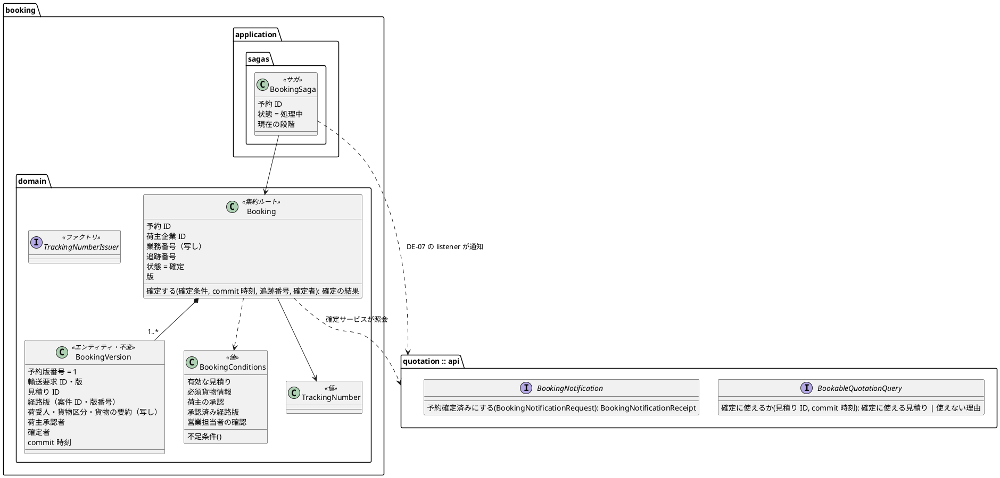
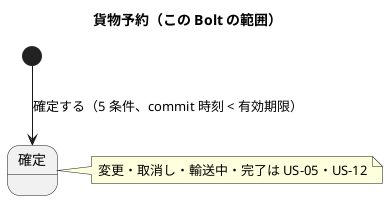
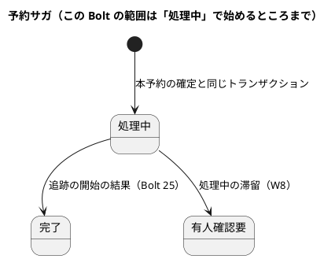
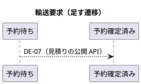
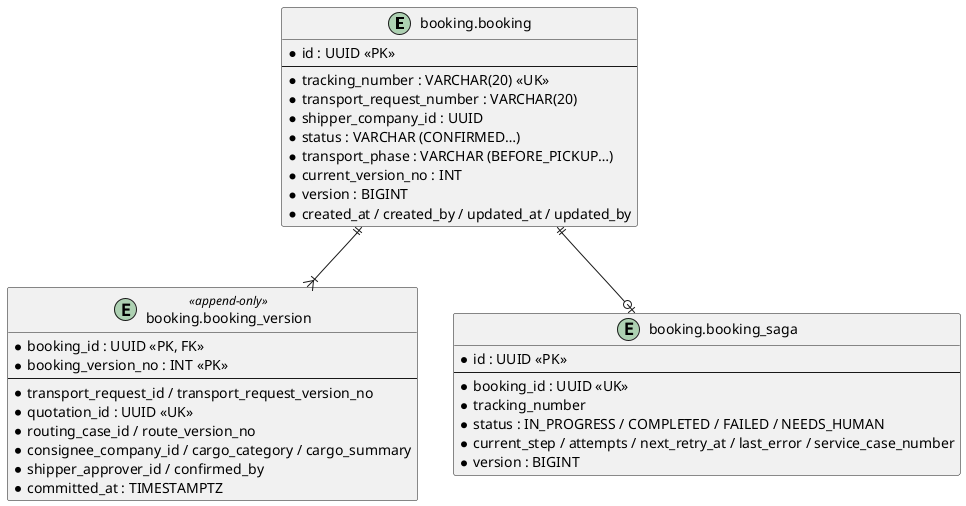

# Bolt 23 計画 - 本予約の確定と失効（US-04 AC1・AC2）

## 基本情報

| 項目 | 内容 |
| :--- | :--- |
| Bolt | 第 23 回 |
| 予定 | W4（2026-10-26 の週。前倒しで 2026-10-08 から）、作業 2.5〜3 時間（承認ゲートの待ち時間を除く） |
| 対象 | U6 予約管理（新設の `booking` モジュール）と、U1 見積りの公開 API・輸送要求の予約確定済み |
| GitHub | [#10 [US-04] 予約を確定する（R0.1: AC1・AC2・AC4・重複確定の防止）](https://github.com/k2works/practical-domain-driven-design-in-enterpris-application/issues/10)（SP 5 は #10 をクローズする Bolt 25 で数える） |
| 承認ゲート | 計画の承認（確認ポイント 1〜15）、ADR（アーキテクチャ）、スキーマ（データベース）、確定の規則の Red・Green（U6 の密度）、確定サービスの Red・Green、見積りの公開 API と listener（モジュールの境界）、開発レビューの判断、終了報告 |
| 承認ゲートの扱い | 人の指示（`/goal Bolt23 承認`、2026-10-08）により、計画を承認し、承認ゲートで止まらずに進める。W4 の計画はリスク台帳に従い Bolt 23 を止める Bolt としていたが、人が `/goal` を選んだ。止まらなかったゲートごとに根拠を書き、終了報告の承認の議題に置く（T-36） |
| アプローチ | インサイドアウト（開発戦略の「Bolt ごとのアプローチの決め方」の「新しい集約・新しいスキーマを作る」）。データ（表）→ ドメイン（集約）→ アプリケーション（確定サービスと業務ルール層の受入シナリオ）→ 見積りとの連携（公開 API と listener）の順に、層の境界を承認ゲートにする。画面は Bolt 23b |
| 範囲の決定 | W4 の計画の Bolt 23 の行。2026-10-08 に human:kakimomokuri が、画面（S-09・S-24・S-02）を Bolt 23b に分け、B-INV-11 の UK だけをこの Bolt に前倒しすると決めた（開始準備の整合性検証の後） |
| 前の Bolt | [Bolt 22 終了報告](bolt_22_report.md) |

## Bolt ゴール

予約待ちの見積りに対して、営業担当者の確認を含む BR-01 の確定条件（有効な見積り、必須貨物情報、荷主担当者 1 名の承認、承認済み経路版、営業担当者による確認）がそろうと本予約を確定でき、貨物予約と予約版 1 が記録され、推測されにくい一意な追跡番号と commit 時刻が残り、予約サガが「処理中」で始まる。DE-07（本予約を確定した）が発行され、予約の listener が見積りの公開 API で輸送要求を予約確定済みにする。commit 時刻が見積有効期限と同時刻以後なら確定せず、失効と再見積りの必要性を結果で返す。これらを業務ルール層の受入シナリオと PostgreSQL の統合テストで確かめる（画面は Bolt 23b）。

### 確かめたい仮説

| # | 仮説 | この Bolt で分かること |
| :--- | :--- | :--- |
| H1 | 予約は見積りの公開 API だけで確定条件をそろえられる（経路版は見積りが割り当てた経路の写しで足りる）。`booking` の依存は `shared`・`platform :: web`・`quotation :: api` だけで済み、`routing` に依存しない | ModularityTest が通ること。`booking` の `allowedDependencies` |
| H2 | 失効の判定（BR-10、Q-INV-06）を見積りの 1 か所に置き、予約は commit 時刻を渡して結果を受けるだけにすれば、予約の側に期限の規則の写しは要らない | 予約のコードに有効期限の比較がないこと。境界（1 分前・同時刻・1 分後）のテストが見積りの側で通ること |
| H3 | DE-07 の見積りの側の受け口は、Bolt 22 の割り込みの部品（楽観ロックの競合での読み直し）を使えば、DE-04 の listener との競合に耐える | DE-04 と DE-07 の受け口を並行に動かす統合テストが通ること |

## ふりかえりと前の Bolt からの引き継ぎ

| 入力 | 内容 | この Bolt での扱い |
| :--- | :--- | :--- |
| W4 の計画（設計の決定） | 予約サガと追跡の開始: 追跡の listener が DE-07 を購読し、結果を予約の公開 API へ返す。依存は `tracking → booking` だけ。予約から見積りの確定可否: 見積りの公開 API に commit 時刻を渡す | ステップ 1 の ADR-015・ADR-016 |
| ADR-003（2026-10-01） | 予約サガはオーケストレーション型で、業務上の再試行はサガがコマンドで直接呼ぶ。コレオグラフィ型は不採用 | ADR-015 で決定 3 と「再試行の担い手」を改訂する（2026-10-08 に human:kakimomokuri が決定）。状態は予約のサガ 1 か所に残すので、不採用の理由（状態が散る）は当たらない |
| Bolt 11 レビュー R-19 | 見積りに「予約確定に使えるか（commit 時刻）」を置き、問い合わせ方を ADR で決める | ADR-016 |
| Bolt 3 レビュー R-31 | 本予約で業務番号を引き継ぐか | 確認ポイント 6 |
| Bolt 20 レビュー D-78 | 「上流は下流に依存しない」の ArchUnit の規則の一般化（W4 の DE-07）。S-02 の予約の確定待ちの表は Bolt 23b、DE-21・DE-04 の再配信のシナリオは Bolt 24 | ステップ 5 |
| Bolt 22 終了報告 | DE-07 の見積りの側の受け口に、輸送要求を進める部品を使うか。新しいモジュールは最初から `allowedDependencies` を明示する | 確認ポイント 8・ステップ 5 |
| Try T-54 | コンテキストの間のイベントを足すときは、購読する側の依存が循環しないか | 確認ポイント 2 |
| Try T-55 | 置換は `spotlessApply` の後のファイルに当てる | 全ステップ |
| Try T-57 | 状態の列挙に値を足すときは、その状態を見る判定を洗い出す | 輸送要求の `BOOKED`（下の「設計の約束」に洗い出した箇所） |
| Try T-58 | listener と公開 API には、業務の拒否と警告のログの経路の単体テストを Red に入れる | ステップ 5 |
| Try T-61〜T-63 | メモリのリポジトリは写しを返す、listener の欠けを「再配信で直るか」で分ける、「N 個目で」の規則は N 個目の計画に入れる | ステップ 3〜5 |
| Try T-64 | ArchUnit の禁止の規則は、コードを grep して正当な使い道がないか確かめてから書く | ステップ 5 の規則の一般化 |
| Try T-65 | CI を赤にする Red のコミットはローカルにためて、Green と同じ push にまとめる | 全ステップ |
| Try T-26・T-36・T-38 ほか | これまでのとおり（境界の 3 点は T-38） | 全ステップ |

## スコープ

### 設計の約束（Try T-1）

| 設計の約束 | 出典 | この Bolt |
| :--- | :--- | :--- |
| 貨物予約（Booking）は予約 ID で識別し、予約版・追跡番号を持つ。予約版は不変（B-INV-08） | domain_model.md の貨物予約 | 作る（変更・取消申請、輸送段階の遷移は US-05・US-12） |
| B-INV-01 5 条件がそろったときだけ確定する | domain_model.md、BR-01 | 確定条件の値（`BookingConditions`）と、そろわないときの拒否（欠けた条件を結果に持つ）。不足条件の一覧の表示と AC3 の受入シナリオは W6 |
| B-INV-02 有効性は commit 時刻で判定し、同時刻以後は失効 | domain_model.md、BR-10、Q-INV-06 | 判定は見積りの公開 API（ADR-016）。予約は commit 時刻を渡す。domain_model.md の B-INV-02 に「判定は Q-INV-06 の 1 か所」と注記する |
| B-INV-03 同じコマンド ID の再送で重複しない | domain_model.md | Bolt 24（`processed_command`、AC4） |
| B-INV-11 1 つの見積りから予約は 1 件 | domain_model.md、data_model.md | UK（`booking_version.quotation_id`）だけをこの Bolt の表に入れる（2026-10-08 に human:kakimomokuri が前倒し）。違反は確定の失敗として扱う。重複の確定に既存の追跡番号を返す振る舞いと受入シナリオは Bolt 24 |
| B-INV-04 特殊貨物、B-INV-05 再設計要・旧版の経路版 | domain_model.md | W6（AC5、US-08） |
| B-INV-10 カスタマーサポートは確定できない | domain_model.md、architecture_backend.md | 確定サービスで営業担当者の役割を確かめる（URL の認可は `/staff/**` で営業担当者に限られている。画面は Bolt 23b） |
| B-INV-12 古い版のイベントは適用しない | domain_model.md | DE-07 の payload に発行元の集約の版を持たせる |
| 追跡番号は推測されにくい一意な番号（TrackingNumberIssuer） | domain_model.md、architecture_backend.md、BR-07 | 作る（形式は確認ポイント 5） |
| 予約サガの状態を予約に永続化し、後続が完了するまで成功と表示しない | ADR-003（改訂後）、architecture_backend.md、data_model.md | 「処理中」で始める表と値。完了への遷移は Bolt 25、有人確認要は W8 |
| DE-07 は ADR-014 の形で見積りに通知する | ADR-014、domain_model.md | 予約の listener が自分の DE-07 を受け、見積りの公開 API で輸送要求を予約確定済みにする |
| 輸送要求の状態に予約確定済み（`BOOKED`）を足す（DB の CHECK にはすでにある） | data_model.md | 足す。T-57 で洗い出した箇所: `TransportRequest` の進行の表（QUOTATION_PROGRESSION）と `markReadyToBook`・`hasReached`、`TransportRequestLabels` の表示名（社内・荷主）、`QuotationMapper.xml` の S-02 の `IN` |
| 新しいスキーマの権限・コメント | data_model.md、Bolt 1・7 | `afterMigrate__grant_app_user.sql`（PostgreSQL だけ）の対象のスキーマ、`AppendOnlyGrantIntegrationTest`・`SchemaCommentIntegrationTest` のスキーマの一覧に `booking` を足す。表と列の日本語コメント、`booking_version` の `[append-only]` |

### 入れるもの・入れないもの

| 入れる | 入れない |
| :--- | :--- |
| ADR-015（予約サガと追跡の開始。ADR-003 の改訂）、ADR-016（予約から見積りの確定可否）と、矛盾する設計文書・非機能要件の修正 | 追跡の開始・`tracking` モジュール（Bolt 25） |
| `booking` モジュール、`booking` スキーマの `booking`・`booking_version`（追記専用、`quotation_id` の UK）・`booking_saga` | `processed_command` と AC4 の再送（Bolt 24） |
| 貨物予約・予約版・確定条件・追跡番号・予約サガの状態の型と規則 | 予約サガの「完了」（Bolt 25）・有人確認要と有人案件の起票（W8） |
| 確定サービスと業務ルール層の受入シナリオ（`@US-04-AC1`・`@US-04-AC2`・`@BR-10`） | 画面（S-09・S-24・S-02 の予約の確定待ちの表）と `@ui`（Bolt 23b） |
| 見積りの公開 API: 確定に使える見積りの照会（commit 時刻を渡す）と、予約確定済みの通知の受け口。輸送要求の `BOOKED` | 不足条件の一覧（AC3）と特殊貨物（AC5）（W6） |
| DE-07 と予約の listener、DE-04 との並行の統合テスト | ユーザーマニュアル（W4 の完了の後） |

## 設計（この Bolt の範囲）

### ドメインモデル

- 名前は案（確認ポイント 4）。既存の `RouteAssignment`・`…Request`・`…Receipt` にそろえる
- `BookableQuotationQuery` は、承認済みで commit 時刻が有効期限より前のときだけ、確定条件に要る写し（輸送要求 ID・版、業務番号、荷主企業、荷受人、貨物区分・要約、荷主承認者、割り当てた経路版）を返し、それ以外は理由（失効・未承認・置換済み・見つからない）を返す（ADR-014 の「業務の拒否は結果の値で返す」）
- DE-07 の payload: 予約 ID、予約版番号、追跡番号、見積り ID、輸送要求 ID・版、経路版、commit 時刻、発行元の集約の版（B-INV-12）。domain_model.md の DE-07 の行を直す
- 通知の引数: 輸送要求 ID・版、見積り ID、予約 ID（`TransportRequestProgression` は版の一致で判定する）

### 状態遷移

### データモデル

列と制約は [データモデル](../../design/cargo-tracker/data_model.md) の `booking` スキーマのとおり。足すのは `booking.transport_request_number`（確認ポイント 6）と、その索引。`booking_version.quotation_id` の UK はこの Bolt に入れる。Flyway の `common`・`{vendor}` の置き方は既存のスキーマにそろえる。

### 画面遷移

この Bolt は画面を作らない（Bolt 23b）。

## ステップ計画

状態の記号: `[ ]` 未着手、`[-]` 進行中、`[?]` 承認待ち、`[x]` 完了。各ステップの終わりに `check` が緑であることを確かめ、Green と同じ push にまとめて CI を確かめる（T-26、T-65）。

- [x] **1. ADR-015・ADR-016 と設計文書** 【承認ゲート: アーキテクチャ】
  - ADR-015 予約サガと追跡の開始（ADR-003 の決定 3 と補足の決定「再試行の担い手」を改訂する）: 追跡の listener が DE-07 を購読して追跡を開始し、結果を予約の公開 API で返す。依存は `tracking → booking` だけ。サガの状態（処理中・完了・失敗・有人確認要）は予約のサガ 1 か所に置く。追跡の開始の再試行はイベントの再配信（RTY-01）と追跡の側の冪等で担い、予約のサガは処理中の滞留時間を見て有人確認要にする（W8）
  - ADR-016 予約から見積りの確定可否: 予約は確定のトランザクションの中で、保存の直前に `Clock` から取った時刻を commit 時刻とし、同じ値で見積りの公開 API に照会し、`committed_at` に記録する（判定と記録を同じ値にする）。判定（Q-INV-06・BR-10）は見積りの 1 か所。確定に要る写しを戻り値で受け、確定の後に見積りへ問い合わせ直さない（B-INV-08）
  - 設計文書を直す:
    - ADR-003（決定 3・補足の決定の改訂の経緯、ステータス）と ADR の索引（ADR-015・016）、mkdocs
    - non_functional.md の RTY-02（予約サガの再試行）と OBS-04 を ADR-015 に合わせる
    - architecture_backend.md の予約サガの図と表、再試行の担い手の記述
    - domain_model.md の DE-07（購読者、payload の輸送要求 ID・版と発行元の版）、予約サガの流れ、B-INV-02 の注記、B-INV-06 の向き（US-05 で直すと注記）、用語集に「確定条件」「予約サガ」
    - data_model.md の `booking.transport_request_number` と索引
    - test_strategy.md の US-04 の Gherkin の例のタグ（`@US-04-ACm`）と境界の 3 点
    - ui_design.md の遷移の「S-01 から」を「S-02 から」（S-09 の URL の行は Bolt 23b）
    - W4 の計画の Living Documentation の「`booking` → 経路設計の `api`」を「見積りの `api`」に（確認ポイント 7）
  - 完了の判定: `okf:check` ERROR 0、`documentationTest` 緑
  - 結果（2026-10-08）: ADR-015・ADR-016 を書き、ADR-003（決定 3・再試行の担い手・ステータス・改訂の経緯）、ADR の索引、mkdocs、non_functional.md（RTY-02 を「処理中の滞留の上限」に、OBS-04）、architecture_backend.md（再試行の担い手、予約サガの節と図）、domain_model.md（ADR の表、用語集に確定条件・予約サガ、B-INV-02 の注記、B-INV-06 の注記、DE-07 の payload と購読者、業務の流れの図と表）、data_model.md（`booking.transport_request_number`、索引、追跡番号の形式、業務番号の写し）、test_strategy.md（US-04 の Gherkin の例のタグと境界）、ui_design.md（S-01 を作るまでは S-02 から）を直した。`okf:check` ERROR 0、`documentationTest` 緑
    - 計画からの追加: 検証で見つかった食い違い 2 件に注記を入れた。DE-09・DE-10（予約が追跡のイベントを購読する形）は ADR-015 の依存の向きと循環するので、US-12 の残り（W7）で ADR-014 の形にそろえる。B-INV-06（予約が追跡の公開 API を同期で確かめる）は US-05（W11）で決め直す
    - 承認ゲートの扱い（T-36）: アーキテクチャの承認ゲートで止まらずに進めた（AI の判断）。根拠は、ADR-015・016 の決定が W4 の開始準備と Bolt 23 の開始準備で人が決めた形のとおりであること。終了報告の承認の議題に置く
- [ ] **2. booking スキーマ（統合テスト）** 【承認ゲート: データベース】
  - 統合テスト（PostgreSQL）を先に書く: `booking`・`booking_version`・`booking_saga` の CHECK、追跡番号の UK、`quotation_id` の UK、`booking_saga.booking_id` の UK、`booking_version` の UPDATE・DELETE の拒否（追記専用）、表と列のコメント
  - マイグレーション（`common`・`{vendor}`）、`afterMigrate__grant_app_user.sql`（PostgreSQL）、`AppendOnlyGrantIntegrationTest`・`SchemaCommentIntegrationTest` のスキーマの一覧
  - 完了の判定: `check` 緑
- [ ] **3. 貨物予約の規則（集約の TDD）** 【承認ゲート: Red／Green（確定）】
  - 単体テストを先に書く: 5 条件がそろうと確定し、予約版 1・追跡番号・業務番号・commit 時刻・確定者を持ち、DE-07（輸送要求の版と発行元の版を含む）が返る。条件が 1 つでも欠けると確定しない（欠けた条件を結果に持つ）。確定条件の不足条件。追跡番号の形式。予約サガは「処理中」で始まる
  - `package-info`（`allowedDependencies = {"shared", "platform :: web", "quotation :: api"}`）、`@AggregateRoot` などの注釈、`@Saga`
  - 完了の判定: `check` 緑
- [ ] **4. 確定サービスとリポジトリ（業務ルール層の受入シナリオ）** 【承認ゲート: Red／Green（確定）】
  - 業務ルール層の受入シナリオを先に書く（`features/booking/confirm_booking.feature`。`@US-04-AC1`・`@US-04-AC2`・`@BR-10`）: 確定、期限の 1 分前・同時刻・1 分後、未承認の見積り、カスタマーサポートの拒否（B-INV-10）。見積りの前提は見積りの公開 API を通して作る（業務ルール層のステップ定義は他のコンテキストの公開 API だけを使う）
  - 確定サービス（commit 時刻は ADR-016 のとおり）、追跡番号の発行（発行の前に存在を確かめて引き直す。上限 3 回。UK の違反は確定の失敗）、MyBatis のマッパー、リポジトリ（期待版で保存）
  - 完了の判定: `check` 緑
- [ ] **5. 見積りの公開 API・輸送要求の予約確定済み・DE-07 の listener** 【承認ゲート: Red／Green、モジュールの境界】
  - 単体テストを先に書く: 確定に使えるかの判定の境界（有効期限の 1 分前は使える、同時刻・1 分後は失効。T-38）、未承認・置換済み・見つからない。輸送要求の予約待ち → 予約確定済み（冪等。予約待ちでないときは警告のログ。T-58）
  - `quotation.api` に照会と通知の受け口を足し、実装を見積りの `application.internal.commandservices` に置く。輸送要求を進める処理は Bolt 22 の割り込みの部品を使う（確認ポイント 8）。`quotation.api` の `package-info` の説明（「照会だけ」）を直す
  - 予約の `application.internal.eventhandlers` に DE-07 の listener と `outboundservices.acl`
  - 統合テスト（PostgreSQL）: 確定から DE-07 の発行、輸送要求の予約確定済みまで。DE-04 と DE-07 の受け口の並行（H3）
  - ArchUnit: 「上流は下流に依存しない」を見積りと予約の組にも一般化する（D-78。T-64 で既存の依存を grep してから書く）。ModularityTest と `ModuleDocumentationTest` のモジュール名に `booking`、`DomainEventSerializationContractTest` に DE-07
  - 完了の判定: `check` と `documentationTest` が緑
- [ ] **6. 開発レビューと終了報告** 【承認ゲート: 開発レビューの判断、終了報告】
  - `developing-review`（プログラマー・テスター・アーキテクト）、SonarQube、終了報告。デモは業務ルール層のシナリオの通過で示し、受入動画は Bolt 23b で撮る。#10 は Bolt 25 まで開いたまま、終わった受入条件にコメントする

### 時間の配分と打ち切り

時間は作業の時間で、承認ゲートの待ち時間を含まない。

| # | 目安 | 打ち切り |
| :--- | :--- | :--- |
| 1 | 30 分 | — |
| 2 | 30 分 | — |
| 3 | 30 分 | — |
| 4 | 40 分 | — |
| 5 | 40 分 | H3 の並行の統合テストが安定しなければ、単体の競合のテスト（Bolt 22 の割り込みと同じ形）にして既知の課題に置く |
| 6 | 30 分 | — |

## 確認ポイント（計画の承認の場でまとめて確認する。Try T-6）

| # | 確認すること | ステップ | 推奨 |
| :--- | :--- | :--- | :--- |
| 1 | アプローチ | 全体 | 開発戦略の規則どおりインサイドアウト（新しい集約・スキーマ）。表 → 集約 → 確定サービス（業務ルール層の受入シナリオ）→ 見積りとの連携 |
| 2 | ADR-015 の形 | 1 | ADR-003 の決定 3 と「再試行の担い手」を改訂する（2026-10-08 に決定）。予約から追跡を呼ばない（T-54） |
| 3 | ADR-016 の形 | 1 | commit 時刻は確定のトランザクションの中で保存の直前に取り、判定と記録に同じ値を使う。照会の戻り値に確定に要る写しを入れる |
| 4 | 名前 | 3・5 | `Booking`・`BookingVersion`・`BookingConditions`・`TrackingNumber`・`TrackingNumberIssuer`・`BookingSaga`。見積りの API は `BookableQuotationQuery`（`…Request`・結果）と `BookingNotification`（`…Request`・`…Receipt`） |
| 5 | **追跡番号の形式** | 4 | `CT` と、紛らわしい文字（0・O・1・I・L）を除いた英大文字・数字 12 桁（`SecureRandom`）の 14 文字（約 59 bit）。発行の前に存在を確かめて引き直す（上限 3 回）。業務番号や連番から推測できない（BR-07） |
| 6 | **本予約で業務番号を引き継ぐか**（R-31） | 1・2 | 貨物予約に輸送要求の業務番号の写し（`booking.transport_request_number`）を持ち、索引を張る。予約版が変わっても変わらない。社内の画面と照会で業務番号から予約をたどれる（D-4）。予約の識別は追跡番号のまま |
| 7 | 経路版の確かめ方 | 5 | 見積りが割り当てた経路の写し（Bolt 20）を使い、`routing` に API を作らない（H1）。再設計要・旧版の拒否（B-INV-05）は W6 |
| 8 | DE-07 の受け口と輸送要求を進める部品 | 5 | `TransportRequestProgression` を見積りの `application.internal` の共通の場所に移し、listener（DE-03・DE-16・DE-21・DE-04）と公開 API の実装（DE-07）の両方から使う |
| 9 | B-INV-11 の UK の前倒し | 2・4 | UK だけこの Bolt の表に入れる（2026-10-08 に決定）。違反は確定の失敗。既存の追跡番号を返す振る舞いは Bolt 24 |
| 10 | 輸送要求の `BOOKED` | 5 | 足す。社内の表示名は「予約確定済み」、荷主の画面は「予約確定済み（追跡の開始の準備中）」 |
| 11 | 画面の分割 | 全体 | 画面（S-09・S-24・S-02 の予約の確定待ちの表）と `@ui`・受入動画は Bolt 23b（2026-10-08 に決定）。W4 の計画に Bolt 23b の行を足す |
| 12 | `booking` の依存 | 3 | `{"shared", "platform :: web", "quotation :: api"}`。`quotation :: events` は使わないので入れない（T-64）。`platform :: web` は Bolt 23b の画面のため |
| 13 | 承認ゲート | 全体 | W4 の計画どおり（上の「基本情報」） |
| 14 | ユーザーマニュアル | — | W4 の完了の後（W4 の計画） |
| 15 | SP | — | US-04 の SP 5 は #10 をクローズする Bolt 25 で数える。W4 の計画の Bolt 23 の SP の欄（3）は目安のまま |

## 完了条件

- [ ] US-04 AC1・AC2 の業務ルール層の受入シナリオ（`@US-04-AC1`・`@US-04-AC2`・`@BR-10`）が通る
- [ ] 境界（有効期限の 1 分前・同時刻・1 分後）の単体テストが見積りの API の側にある
- [ ] 確定から DE-07 の発行、輸送要求の予約確定済みまでが PostgreSQL の統合テストで通る
- [ ] ApplicationModules の検証が緑で、`booking` は `routing` に依存せず、`quotation` は `booking` に依存しない
- [ ] `check`・`documentationTest`・`uiTest` が緑。push して CI とデモ環境の配備を確かめた
- [ ] SonarQube の Quality Gate が PASS
- [ ] ADR-015・ADR-016 と設計文書に決定を書き、計画からの変更も設計文書に戻した（T-53）
- [ ] 開発レビューと終了報告。#10 に AC1・AC2 の業務ルール層までの結果をコメントした

### デモ項目

業務ルール層の受入シナリオの通過で示す（予約待ちの見積りを確定すると追跡番号が出て予約サガが処理中になる、期限と同時刻以後は失効で確定できない）。画面のデモと受入動画は Bolt 23b。

## 更新履歴

| 日付 | 更新内容 | 更新者 |
| :--- | :--- | :--- |
| 2026-10-08 | 初版作成（承認待ち） | anthropic/claude-opus-5-5 |
| 2026-10-08 | 計画（確認ポイント 1〜15 は推奨のまま）を承認した（`/goal Bolt23 承認`） | anthropic/claude-opus-5-5、承認 human:kakimomokuri |
| 2026-10-08 | 開始準備の整合性検証の指摘を反映した（ステップの順、ADR-003 の改訂、輸送要求の版、ゲート、Living Documentation、afterMigrate、URL、commit 時刻、追跡番号、業務番号の置き場所）。画面を Bolt 23b に分け、B-INV-11 の UK を前倒しした（human:kakimomokuri が決定） | anthropic/claude-opus-5-5 |

## 関連ドキュメント

- [リリース計画](release_plan.md)（W4）
- [開発戦略](development_strategy.md)
- [Bolt 22 終了報告](bolt_22_report.md)
- [ドメインモデル](../../design/cargo-tracker/domain_model.md)
- [データモデル](../../design/cargo-tracker/data_model.md)
- [バックエンドアーキテクチャ](../../design/cargo-tracker/architecture_backend.md)
- [UI 設計](../../design/cargo-tracker/ui_design.md)
- [テスト戦略](../../design/cargo-tracker/test_strategy.md)
- [非機能要件](../../design/cargo-tracker/non_functional.md)
- [ADR-003](../../adr/cargo-tracker/003-inter-context-integration.md)
- [ADR-014](../../adr/cargo-tracker/014-downstream-to-upstream-notification.md)
