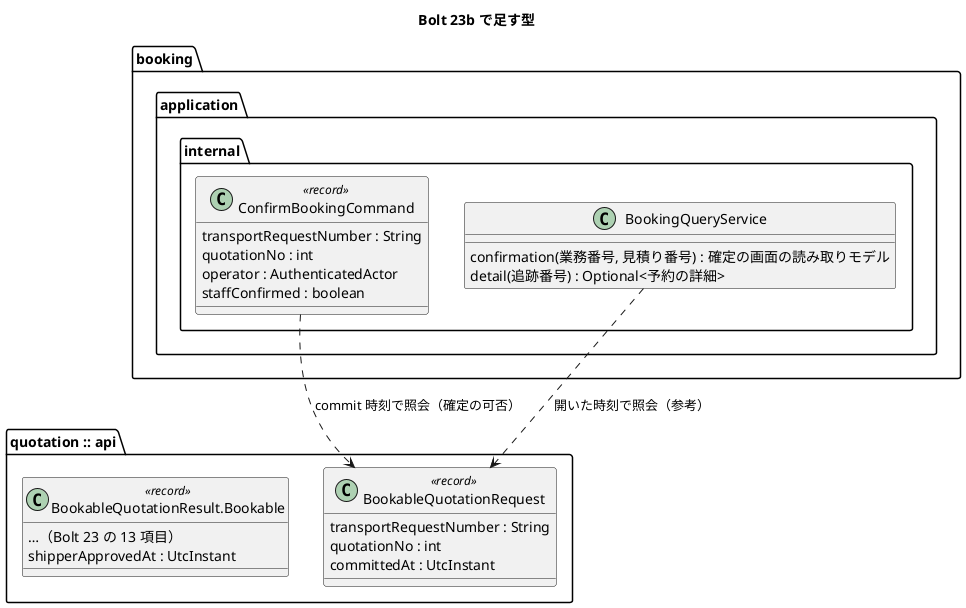
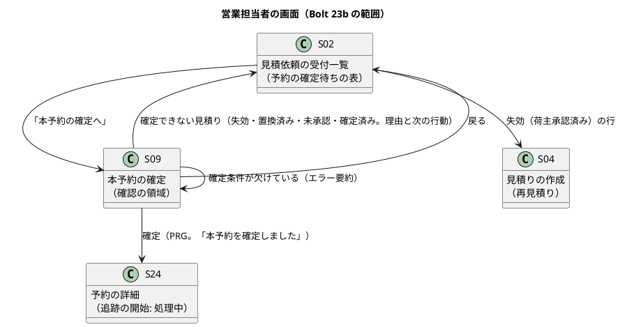

# Bolt 23b 計画 - 本予約の確定の画面（US-04 AC1・AC2）

## 基本情報

| 項目 | 内容 |
| :--- | :--- |
| Bolt | 第 23b 回（Bolt 23 の画面を分けた Bolt） |
| 予定 | W4（2026-10-26 の週。前倒しで 2026-10-08 から）、作業 2〜2.5 時間（承認ゲートの待ち時間を除く） |
| 対象 | U6 予約管理の画面（`booking.interfaces.web`）、U1 見積りの S-02 と公開 API |
| GitHub | [#10 [US-04] 予約を確定する](https://github.com/k2works/practical-domain-driven-design-in-enterpris-application/issues/10)（SP 0。US-04 の SP 5 は #10 をクローズする Bolt 25 で数える） |
| 承認ゲート | 計画の承認（確認ポイント 1〜12）、見積りの公開 API の変更（モジュールの境界）、確定の画面の Red・Green、認可、開発レビューの判断、終了報告 |
| 承認ゲートの扱い | 人の指示（`/goal Bolt23b`、2026-10-08）により、計画を承認し、承認ゲートで止まらずに進める。止まらなかったゲートごとに根拠を書き、終了報告の承認の議題に置く（T-36）。表の変更はないので T-67（スキーマのステップは止める）は当たらない。表の変更が要るとわかったら止める |
| アプローチ | アウトサイドイン（開発戦略の「Bolt ごとのアプローチの決め方」の「既存の集約に受入条件を足す」。新しい集約・表はない）。画面の層の受入シナリオ → 画面（コントローラーとテンプレート）→ アプリケーション（照会）→ 見積りの公開 API の順 |
| 前の Bolt | [Bolt 23 終了報告](bolt_23_report.md) |

## Bolt ゴール

営業担当者が S-02 の「予約の確定待ち」の表（有効期限の近い順）から S-09 を開き、BR-01 の確定条件と、有効期限の判定は確定の時刻で行うことを確かめ、契約条件と照合したことを示して本予約を確定すると、S-24 に追跡番号・予約版 1・commit 時刻・「追跡の開始: 処理中」が出る。有効期限と同時刻以後に確定しようとすると確定せず、失効と再見積りの必要性が示される。これを画面の層のシナリオ（キー操作だけ、幅 320 CSS px、axe-core 0 件）と受入動画で確かめる。

### 確かめたい仮説

| # | 仮説 | この Bolt で分かること |
| :--- | :--- | :--- |
| H1 | 画面の URL に内部の ID を出さず（D-4）、業務番号と見積り番号で S-09 を開けば、予約は見積りの公開 API だけで確定条件を示せる | `booking` の依存が増えないこと（ModularityTest）。S-09 の URL に UUID がないこと |
| H2 | S-09 の表示（参考の判定）と POST の判定（commit 時刻）を分けて示せば、表示の後に失効した見積りでも利用者が迷わない | 表示の後・確定の前に期限を越える画面の層のシナリオで、確定せずに理由と次の行動が出ること |

## ふりかえりと前の Bolt からの引き継ぎ

| 入力 | 内容 | この Bolt での扱い |
| :--- | :--- | :--- |
| Bolt 23 終了報告の既知の課題（Bolt 23b） | 予約サガが処理中なら画面に「完了」と出さない。S-09 の表示は参考で、確定の可否は POST の照会で決まる（ADR-016）ことを画面に示す。S-02 の予約の確定待ちの表と `TransportRequestLabels` の `BOOKED` の表示を、画面の層のシナリオで確かめる | ステップ 3・4、確認ポイント 4・6 |
| Bolt 20 レビュー D-78 | S-02 の割当て時刻・承認時刻の列と有効期限の近い順（US-04） | ステップ 2・4、確認ポイント 2 |
| Bolt 23 の Try T-66 | 状態を進める処理を足すときは「前提にした状態より前に届く」場合を表に入れる | 画面は届き順を前提にしない。確定の後、DE-07 の配信で輸送要求が予約確定済みになるまで S-02 に行が残り、その行から開くと確定済みとして S-02 に戻る（確認ポイント 2・6）。S-02 の表は見積りの承認済みを正にし、DE-04 の配信を待たない |
| Bolt 23 の Try T-67 | `/goal` で進めるときもスキーマ（確認必須）のステップは止める | この Bolt に表の変更はない（S-02 は既存の列を読む）。表を足す必要が出たら止める |
| Bolt 23 の Try T-68 | 層の規則が開発ガイドラインの置き場所を拒否したら、規則の例外を人に諮る | 画面は `booking.interfaces.web`、照会は `booking.application.internal.queryservices`（開発ガイドライン第 3 章） |
| Try T-65 | CI を赤にする Red はローカルにためて Green と同じ push にまとめる | 全ステップ |
| Try T-26・T-36・T-38・T-57 ほか | これまでのとおり（境界の 3 点、状態の列挙を見る判定の洗い出し） | 全ステップ |

## スコープ

### 設計の約束（Try T-1）

- 画面の URL に内部の ID（見積り ID・予約 ID）を出さない（D-4）。S-09 は業務番号と見積り番号、S-24 は追跡番号で開く
- 確定の可否は POST の照会（commit 時刻）だけで決める。S-09 の表示は開いた時刻での参考の判定で、画面にそう書く（ADR-016）
- 予約サガが処理中のあいだ、S-24 に「完了」と出さない（ADR-015）
- 社内の画面の日時は `DateTimeDisplay.staff`（利用者のタイムゾーンと UTC を併記）を使う（Bolt 22）
- `booking` の `allowedDependencies` は `{"shared", "quotation :: api", "platform :: web"}` のまま

### 入れるもの・入れないもの

| 入れる | 入れない（後の Bolt） |
| :--- | :--- |
| S-02 の「予約の確定待ち」の表（見積りの承認済み。有効期限の近い順。行から S-09） | S-01 業務ホーム（S-01 を作るまでは S-02 から開く） |
| S-09 本予約の確定（確定条件の表、営業担当者の確認、画面そのものを確認の領域にする） | 同じ見積りの重複の確定に既存の追跡番号を返す（AC4、B-INV-03。Bolt 24） |
| S-24 予約の詳細の最小の表示（追跡番号、業務番号、予約版、commit 時刻、経路版、追跡の開始） | 変更・取消申請（US-05。W11）、追跡の開始の完了の表示（Bolt 25） |
| 見積りの公開 API を業務番号と見積り番号で引けるようにし、荷主の承認時刻を結果に足す | S-10 予約一覧（確認ポイント 7） |
| 画面の層のシナリオ（`@ui`）と受入動画 | 荷主へのメールの通知、荷主の承認者の名前（D-72 と同じ） |

## 設計（この Bolt の範囲）

### ドメインモデル

新しい集約・値オブジェクトはない。見積りの公開 API と、予約の照会の読み取りモデルだけを足す。

### 状態遷移

状態は変えない。画面に出す状態の対応は次のとおり。

| 対象 | 状態 | 画面の表示 |
| :--- | :--- | :--- |
| 見積り（S-02 予約の確定待ち） | 承認済みで有効期限の前 | 「荷主承認済み」と「本予約の確定へ」 |
| 見積り（S-02 予約の確定待ち） | 承認済みで有効期限と同時刻以後 | 「失効（荷主承認済み）」。行から S-04 の再見積りへ（確定の入口は出さない） |
| 予約サガ（S-24） | 処理中 | 「追跡の開始: 処理中（追跡の開始を待っています）」 |
| 予約サガ（S-24） | 完了・失敗・有人確認要 | この Bolt では起きない（Bolt 25・W8）。表示名だけ用意する |

### データモデル

表の変更はない。S-02 の「予約の確定待ち」の表は、`quotation.quotation`（`status = 'APPROVED'`、`shipper_approved_at`、`expires_at`、`routing_case_number`・`route_version_no`）と `quotation.transport_request`（`status` が予約確定済みでない）を読む。S-24 は `booking.booking`・`booking_version`・`booking_saga` を読む。

### 画面遷移

| 画面 | URL | この Bolt で決めること |
| :--- | :--- | :--- |
| S-02 | `GET /staff/transport-requests` | 「予約の確定待ち」の表を足す。列は見積り（業務番号と見積り番号）、経路（案件番号と経路版）、荷主の承認（日時）、有効期限（失効なら「失効（荷主承認済み）」）。有効期限の近い順。経路設計中・荷主承認待ちの表から承認済みを外し、経路の確定の時刻の列を足す（D-78） |
| S-09 | `GET /staff/bookings/new?transportRequest={業務番号}&quotation={見積り番号}`、`POST /staff/bookings` | 確定条件（BR-01）の表、「有効期限の判定は確定の時刻で行います。期限と同時刻以後は確定できません。」、確認の領域の項目（対象、変更内容、影響、回復手段）、「契約条件と照合した」のチェックと「本予約を確定する」。確定すると PRG で S-24 |
| S-24 | `GET /staff/bookings/{追跡番号}` | 追跡番号、業務番号、状態（確定済み）、予約版 1（commit 時刻、経路の案件番号と経路版、貨物の要約）、追跡の開始（処理中）。確定の直後は上部に結果の文言 |

## ステップ計画

状態の記号: `[ ]` 未着手、`[-]` 進行中、`[?]` 承認待ち、`[x]` 完了。各ステップの終わりに `check` が緑であることを確かめ、Green と同じ push にまとめて CI を確かめる（T-26、T-65）。Red は実行して失敗を確かめてから実装する（Bolt 23 の Problem）。

- [ ] **1. UI 設計と設計文書** 【承認ゲート: 画面の設計】
  - ui_design.md の URL の表に S-09・S-24 の行を足し、S-02 の行に予約の確定待ちの表を書く。S-09 の節を「画面そのものを確認の領域にする」形に直す（確認ポイント 4）
  - ui_design.md の画面一覧の S-24 の行に US-04 と「最小の表示（Bolt 23b）」を足す
  - architecture_backend.md の見積りの公開 API の操作（業務番号と見積り番号での照会、荷主の承認時刻）。ADR-016 の決定の「照会」の行を「見積り ID」から「業務番号と見積り番号」に置き換え、改訂の経緯に書く（確認ポイント 3）
  - release_plan.md の Bolt 23b の行の「割当て時刻」を「経路の確定の時刻」に直す（確認ポイント 2）
  - 完了の判定: `okf:check` ERROR 0、`documentationTest` 緑
- [ ] **2. 見積りの公開 API と S-02 の読み取りモデル（単体・統合テスト）** 【承認ゲート: モジュールの境界】
  - 単体テストを先に書く: 業務番号と見積り番号で引ける（見つからない・番号の形でない）、結果に荷主の承認時刻。確定のコマンドを業務番号と見積り番号で受ける
  - 影響範囲: `BookableQuotationRequest`・`BookableQuotationResult`・`BookableQuotationQueryService` とそのテスト、予約の `QuotationBookability.check`、`ConfirmBookingCommand`・`BookingCommandService`・`BookingCommandServiceTest`、受入シナリオの `BookingSteps`、`RouteConfirmedAssignmentIntegrationTest`
  - 予約の照会 `BookingQueryService` に、見積り（`booking.quotation_id`）の予約がすでにあるかを足す（S-09 を開いたときの確定済みの判定。確認ポイント 6）
  - 統合テスト（PostgreSQL）を先に書く: S-02 の予約の確定待ちの表（承認済みだけ、有効期限の近い順、予約確定済みの輸送要求は出ない、荷主承認待ちの輸送要求でも見積りが承認済みなら出る）、経路設計中・荷主承認待ちの表の経路の確定の時刻（詳細設計依頼済みは NULL）
  - 完了の判定: `check` 緑
- [ ] **3. S-09・S-24（画面の単体テストと認可）** 【承認ゲート: Red／Green（確定の画面）、認可】
  - 画面の単体テストを先に書く（`@WebMvcTest` の形は既存の画面にそろえる）: S-09 の表示（確定条件の表、参考の判定の文言、確認の領域）、確定 → S-24 への PRG と文言、確定条件の欠け（エラー要約、チェックを外したとき）、確定できない見積り（失効・置換済み・未承認・見つからない・確定済み）は S-02 に戻して理由、S-24 の表示（処理中を完了と出さない）、ない追跡番号は 404
  - セキュリティの統合テスト: 営業担当者だけが S-09・S-24 を開ける（荷主・経路設計者は A-04）。CSRF
  - `booking.interfaces.web`（コントローラーとテンプレート）、`BookingQueryService`、`PlaceholderController` の営業の `bookings` は S-10 の準備中のまま残す（確認ポイント 7）
  - 完了の判定: `check` 緑
- [ ] **4. S-02 の表と画面の層のシナリオ** 【承認ゲート: 画面】
  - 画面の層の受入シナリオを先に書く（`features/ui/confirm_booking_ui.feature`、`@US-04-AC1`・`@US-04-AC2`、デモ項目 `@demo @demo-bolt-23b/confirm-booking`）: 荷主の承認の後、営業担当者が S-02 の予約の確定待ちの表から S-09 を開き、キー操作だけで確認して確定 → S-24 に追跡番号と「追跡の開始: 処理中」。S-02 から行が消える（DE-07 の配信を待つので、開き直しながら待つ）。失効（荷主承認済み）の行は確定の入口を出さない。幅 320 CSS px。axe-core 0 件
  - S-02 のテンプレートと読み取りモデル、`TransportRequestLabels` の `BOOKED` の確かめ
  - 完了の判定: `check` と `uiTest` 緑
- [ ] **5. 開発レビューと終了報告** 【承認ゲート: 開発レビューの判断、終了報告】
  - `developing-review`（プログラマー・テスター・アーキテクト・インタラクションデザイナー・ユーザー代表）、SonarQube、受入動画（`./gradlew demoVideo`。過去の Bolt の動画は元に戻す）、`bolt_23b_report.md`。#10 に画面の結果をコメントする（クローズは Bolt 25）

### 時間の配分と打ち切り

| # | 目安 | 打ち切り |
| :--- | :--- | :--- |
| 1 | 20 分 | — |
| 2 | 30 分 | — |
| 3 | 40 分 | — |
| 4 | 40 分 | — |
| 5 | 30 分 | — |

## 確認ポイント（計画の承認の場でまとめて確認する。Try T-6）

| # | 確認すること | ステップ | 推奨 |
| :--- | :--- | :--- | :--- |
| 1 | アプローチ | 全体 | アウトサイドイン（既存の集約に画面を足す。新しい表はない） |
| 2 | **S-02 の予約の確定待ちの表** | 2・4 | 見積りの承認済みを正にした別の表にする（DE-04 の配信を待たない。T-66）。列は見積り、経路、荷主の承認の日時、有効期限。有効期限の近い順。失効した行は「失効（荷主承認済み）」で、確定の入口は出さず S-04（再見積り）へ。経路設計中・荷主承認待ちの表には経路の確定の時刻の列を足す（D-78 の「割当て時刻」は割当ての時刻を持たないので、`route_confirmed_at`（確定の時刻の写し）で代える。詳細設計依頼済みの行は「—」と凡例。release_plan の行も直す）。確定の後、DE-07 の配信で輸送要求が予約確定済みになるまでは行が残る |
| 3 | **S-09 の URL と見積りの引き方** | 1・2 | `GET /staff/bookings/new?transportRequest={業務番号}&quotation={見積り番号}`、`POST /staff/bookings`（作成は `/new`、提出後は資源の ID の下。UI 設計の URL の規則）。見積りの公開 API の照会を、見積り ID から業務番号と見積り番号に置き換え（呼び出し元は予約だけ）、確定のコマンドも業務番号と見積り番号で受ける（D-4）。ADR-016 の照会の行を改訂する |
| 4 | **S-09 の確認の領域** | 1・3 | C-17・S-07 と同じく、画面そのものを確認の領域にする（別のダイアログを挟まない。BR-13）。確定条件の表の下に、対象（TR-2026-0001 見積 1）、変更内容（本予約を確定し、追跡番号を発行する）、影響（以後の変更・取消しは申請と営業の承認が必要）、回復手段（「確定の後の変更・取消しは申請で行います。申請の画面は準備中です」）を示し、「契約条件と照合した」のチェックと「本予約を確定する」。UI 設計の S-09 の図（「確定へ進む」→ 確認の領域）を直す |
| 5 | 確定条件の表の内容 | 3 | 有効な見積り（承認済み・有効期限）、必須貨物情報（貨物の要約）、荷主担当者の承認（日時。名前は出さない。D-72）、承認済み経路版（案件番号と経路版）、営業担当者の確認（チェック）。開いた時刻で判定した参考であることを示す |
| 6 | **確定できないときの戻り先** | 3 | 確定条件の欠け（チェックなし、貨物の要約が空）は S-09 にエラー要約で残す。見積りが確定に使えない（失効・置換済み・未承認・見つからない）と確定済みは、開いても送っても S-02 に戻して理由と次の行動を示す（C-17 と同じ形）。確定済みは見積りの公開 API では分からないので、開いたときは予約の照会（`booking.quotation_id`）で、送ったときは確定サービスの `AlreadyBooked` で判定する。文言は「…はすでに本予約を確定しています」に留め、既存の追跡番号を示すのは AC4 の Bolt 24。失効は「TR-2026-0001 見積 1 は有効期限（…）を過ぎたため本予約を確定できません。再見積りしてください。」 |
| 7 | S-10 予約一覧 | 3 | 作らない。営業のナビの「予約」は準備中のまま（S-10 は US-05 の W11）。S-24 は確定の直後の PRG と URL で開く。Bolt 25 で S-24 の「追跡の開始: 完了」を確かめるときに、入口が要るなら S-10 の最小の一覧を足すかを決める |
| 8 | S-24 の表示 | 3 | 追跡番号、業務番号、状態「確定済み」、予約版 1（commit 時刻、経路の案件番号と経路版、貨物の要約）、「追跡の開始: 処理中（追跡の開始を待っています）」。確定者の名前と荷主・荷受人の名前は出さない（名前の照会がまだない） |
| 9 | 確定の結果の文言 | 3 | 「TR-2026-0001 見積 1 で本予約を確定しました。追跡番号は CTxxxxxxxxxxxx です。追跡の開始を待っています。」 |
| 10 | 画面の層のシナリオの失効 | 4 | 画面の層には時刻を進める `Clock` がないので、既存の手段（`QuotationUiSteps` の SQL で `expires_at` を過去にする）を使う。S-09 を開いた後に期限を過去にして送り、確定せずに S-02 に理由が出ること（H2）と、失効（荷主承認済み）の行に確定の入口がないことを確かめる |
| 11 | 承認ゲート | 全体 | 上の「基本情報」のとおり各ゲートで止める。`/goal` で進めるなら、止まらなかったゲートを終了報告の議題に置く（T-36） |
| 12 | ユーザーマニュアル | — | W4 の完了の後（W4 の計画） |

## 完了条件

- [ ] 画面の層の受入シナリオ（`@ui`、`@US-04-AC1`・`@US-04-AC2`）が通り、受入動画を撮った
- [ ] S-09・S-24 を営業担当者だけが開ける（セキュリティの統合テスト）
- [ ] S-02 の予約の確定待ちの表が有効期限の近い順に出る（PostgreSQL の統合テスト）
- [ ] ApplicationModules の検証が緑で、`booking` の依存は増えていない
- [ ] `check`・`documentationTest`・`uiTest` が緑。push して CI とデモ環境の配備を確かめた
- [ ] SonarQube の Quality Gate が PASS
- [ ] UI 設計と設計文書に決定を書き、計画からの変更も設計文書に戻した（T-53）
- [ ] 開発レビューと終了報告。#10 に画面の結果をコメントした

### デモ項目

営業担当者が S-02 の予約の確定待ちの表から S-09 を開いて本予約を確定し、S-24 に追跡番号と「追跡の開始: 処理中」が出る（`@demo-bolt-23b/confirm-booking`）。

## 更新履歴

| 日付 | 更新内容 | 更新者 |
| :--- | :--- | :--- |
| 2026-10-08 | 計画（確認ポイントは決定と推奨のまま）を承認した（`/goal Bolt23b`） | anthropic/claude-opus-5-5、承認 human:kakimomokuri |
| 2026-10-08 | 確認ポイント 4（S-09 は画面そのものを確認の領域にする）、7（S-10 は準備中のまま）、3（見積りの公開 API の照会を業務番号と見積り番号に置き換え、ADR-016 を改訂する）を推奨のとおり決めた | anthropic/claude-opus-5-5、決定 human:kakimomokuri |
| 2026-10-08 | 開始準備の整合性検証の指摘 8 件を反映した（DE-07 の非同期と S-02 の行、画面の層の失効の手段、ADR-016 の改訂、変更の影響範囲、確定済みの判定、経路の確定の時刻、S-24 の画面一覧の行） | anthropic/claude-opus-5-5 |
| 2026-10-08 | 初版作成（承認待ち） | anthropic/claude-opus-5-5 |

## 関連ドキュメント

- [リリース計画](release_plan.md)（W4）
- [Bolt 23 計画](bolt_23_plan.md)
- [Bolt 23 終了報告](bolt_23_report.md)
- [Bolt 20 開発レビュー](../../review/cargo-tracker/bolt_20_review_20261008.md)（D-78）
- [UI 設計](../../design/cargo-tracker/ui_design.md)
- [ADR-015](../../adr/cargo-tracker/015-booking-saga-starts-tracking-by-event.md)
- [ADR-016](../../adr/cargo-tracker/016-booking-checks-quotation-at-commit-time.md)
- [開発戦略](development_strategy.md)
