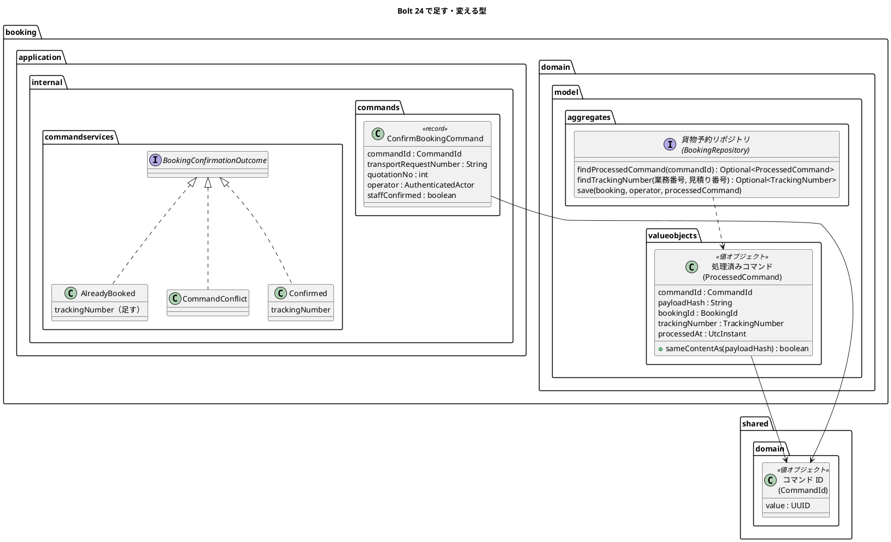
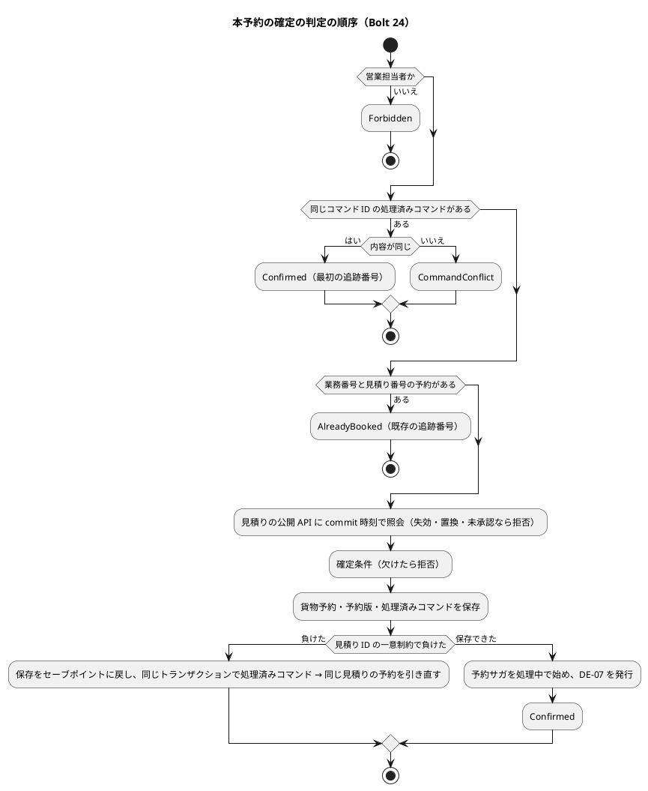
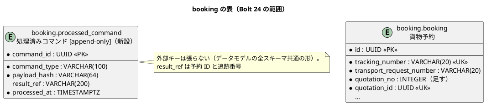
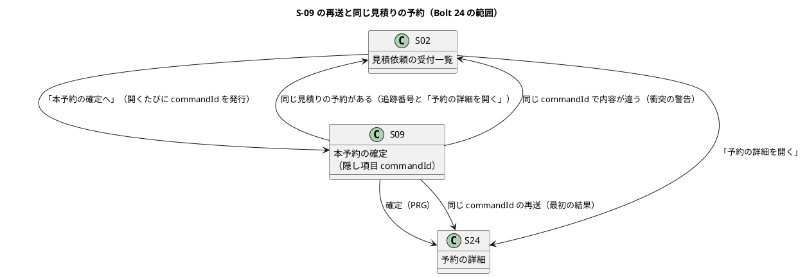

# Bolt 24 計画 - 本予約の確定の再送と重複確定の防止（US-04 AC4、B-INV-03・B-INV-11）

## 基本情報

| 項目 | 内容 |
| :--- | :--- |
| Bolt | 第 24 回 |
| 予定 | W4（2026-10-26 の週。前倒しで 2026-10-09 から）、作業 2.5〜3 時間（承認ゲートの待ち時間を除く） |
| 対象 | U6 予約管理（`booking` の確定サービス・貨物予約リポジトリ・永続化・S-09）、共有カーネル（`shared.domain` のコマンド ID） |
| GitHub | [#10 [US-04] 予約を確定する](https://github.com/k2works/practical-domain-driven-design-in-enterpris-application/issues/10)（SP 0。US-04 の SP 5 は #10 をクローズする Bolt 25 で数える。release_plan の Bolt 24 の 2 SP は「Bolt 23・24・25 の SP の分け方は目安」の目安で、Bolt 23 の 3 SP と同じく Bolt 25 で数える） |
| 承認ゲート | 計画の承認（確認ポイント 1〜16）、設計文書、冪等・重複防止の Red・Green（ステップ 2・3・4）、スキーマ（`booking.processed_command` の新設と `booking.booking.quotation_no` の追加）、画面、開発レビューの判断、終了報告 |
| 承認ゲートの扱い | 人の指示（`/goal Bolt24`、2026-10-09）により、承認ゲートで止まらずに進める。止まらなかったゲートごとに根拠を書き、終了報告の承認の議題に置く（T-36）。ただしスキーマのステップ 3 は、マイグレーションを見せて止める（T-67） |
| アプローチ | アウトサイドイン（開発戦略の「Bolt ごとのアプローチの決め方」の「既存の集約に受入条件を足す」）。処理済みコマンドの表は、既存の `booking` スキーマに 1 つ足す表で、新しいスキーマではない（release_plan の W4 の「新しいスキーマ」は Bolt 23 の `booking`、Bolt 25 の `tracking`）。集約でもなく、規則は既存の貨物予約と確定サービスにある。受入シナリオ → 確定サービス → 貨物予約リポジトリと永続化 → 画面の順 |
| 前の Bolt | [Bolt 23b 終了報告](bolt_23b_report.md) |

## Bolt ゴール

営業担当者が S-09 で本予約を確定した後、同じフォームを送り直しても（二重送信、ブラウザーの戻る → 再送、応答の前の再送）、予約は 1 件のままで、最初の確定と同じ追跡番号の S-24 が示される。同じ見積りを別のコマンド ID・別の営業担当者で確定しようとしても 2 件目はできず、既存の予約の追跡番号と S-24 への導線が示される。確定の後に見積りが失効していても、失効ではなくこの 2 つの結果になる。同じコマンド ID で内容の違う要求は衝突として拒否する。これを業務ルール層の受入シナリオ、PostgreSQL の同時実行の統合テスト、画面の層のシナリオで確かめる。

### 確かめたい仮説

| # | 仮説 | この Bolt で分かること |
| :--- | :--- | :--- |
| H1 | 確定済みの判定（処理済みコマンド → 業務番号と見積り番号で引いた同じ見積りの予約）を見積りの照会より前に置けば、確定の後に見積りが失効・置換されても、再送は最初の結果を、別の確定は既存の追跡番号を返せる | 確定の後に有効期限を過ぎてから再送・別の確定をする受入シナリオで、結果が「失効」にならないこと（Bolt 23b の A-中1・P-3・U-7） |
| H2 | 同時の確定（同じコマンド ID・別のコマンド ID）は、どちらも貨物予約の見積り ID の一意制約で片方が負け、負けた側は保存をセーブポイントに戻した後の同じトランザクションの読み直しで、最初の結果か既存の予約を返せる（処理済みコマンドの主キーに頼らずに済む） | PostgreSQL の同時実行の統合テストで、予約 1 件・処理済みコマンド 1 件・両方の応答が同じ追跡番号になること |

## ふりかえりと前の Bolt からの引き継ぎ

| 入力 | 内容 | この Bolt での扱い |
| :--- | :--- | :--- |
| Bolt 23b の既知の課題（Bolt 24） | 確定済みの判定を見積りの照会より前に置き、確定済みの通知に既存の追跡番号と S-24 への導線を付ける。S-09 のフォームにコマンド ID を足す（A-中1・P-3・U-7） | ステップ 2・4、確認ポイント 4・8・10 |
| Bolt 23b の未決（議題 5） | 承認の後に失効した見積りの再見積りの規則（経路を設計し直すか、承認済みの経路を引き継ぐか） | この Bolt の範囲に入れず、台帳に D-85 として載せる（確認ポイント 14） |
| Bolt 23b の P-7（後に回した） | 入力の形の誤りで 404 と 400 が混ざる | 隠し項目 `commandId` の欠け・形の誤りは利用者が入れる値ではないので 400 にする。業務番号・見積り番号の 404 は変えない。P-7 は後に回したまま（確認ポイント 7） |
| Bolt 20 レビュー D-78 | 受入シナリオで DE-21・DE-04 の再配信 | ステップ 2。DE-07 の再配信もあわせて確かめる（確認ポイント 12） |
| Bolt 23 の Try T-66 | 状態を進める処理を足すときは「前提にした状態より前に届く」場合を表に入れる | 再配信のシナリオで、DE-07 の配信の前後に再送しても結果が同じこと（ステップ 2） |
| Bolt 23 の Try T-67 | `/goal` で進めるときもスキーマのステップは止める | ステップ 3 は必ず止める |
| Bolt 23 の Try T-68・Bolt 22 の Try T-64 | 層の規則が開発ガイドラインの置き場所を拒否したら人に諮る。ArchUnit の規則を書く・変えるときは、対象をコードで grep して正当な使い道を確かめる | 処理済みコマンドは貨物予約リポジトリの操作にし、層の規則（D-5 の例外は `application.sagas` だけ）を変えない（確認ポイント 3）。規則を変える必要が出たら止める |
| Bolt 23b の Try T-69 | 次の行動を案内する文言は、その行動の画面と規則が今あるかをコードで確かめ、画面の層のシナリオは案内の先まで進める | 確定済みの通知の「予約の詳細を開く」は S-24 まで進めて確かめる（ステップ 4） |
| Bolt 23b の Try T-70 | 欄の値を `hasText` で確かめる欄に案内の文を足さない。開発レビューの対応の後も push の前に `uiTest` を流す | 確定済みの通知のリンクはお知らせの文の外に置く（ステップ 4・5） |
| Try T-65・T-26・T-36・T-38・T-39・T-54・T-55・T-57・T-58・T-61〜T-63 | これまでのとおり（Red は本命のアサーションで落とす、境界の 3 点、状態の列挙を見る判定の洗い出し、業務の拒否と警告のログの経路の単体テスト、メモリのリポジトリは写しを返す） | 全ステップ |

## スコープ

### 設計の約束（Try T-1）

- 確定のコマンドはコマンド ID を持つ（ARCH-HO-01）。S-09 を開くたびに新しい UUID を発行し、隠し項目で送る。UI 設計の C-03 も隠し項目に `commandId` を持つが未実装（`SubmitTransportRequestCommand` は「後の Bolt で足す」）で、S-09 が最初の実装になる
- 確定の判定の順序は、役割 → 処理済みコマンド（コマンド ID）→ 同じ見積りの予約（業務番号と見積り番号）→ 見積りの公開 API の照会（commit 時刻）→ 確定条件。確定済みの判定は見積りの照会より前に置く
- 貨物予約は見積り番号の写しを持つ（業務番号の写しと同じ。R-31）。見積りの公開 API は変えない
- 処理済みコマンドは確定に成功したときだけ、予約の保存と同じトランザクションで、貨物予約リポジトリが記録する。拒否（失効・条件の欠け）は記録しない（同じフォームを直して送り直せる）
- 同じコマンド ID で内容（業務番号・見積り番号・操作者）が違えば衝突として拒否する
- `booking` の `allowedDependencies` は `{"shared", "quotation :: api", "platform :: web"}` のまま。層の規則（`LayerArchitectureTest`）も変えない

### 入れるもの・入れないもの

| 入れる | 入れない（後の Bolt） |
| :--- | :--- |
| 共有カーネルのコマンド ID（`CommandId`）と確定のコマンドのコマンド ID | 他のコマンド（提出・審査・見積り）へのコマンド ID の展開（それぞれの Bolt で） |
| `booking.processed_command` の新設と `booking.booking.quotation_no` の追加（ADR なし。データモデルの「冪等性」と R-31 の写しの方針のとおり） | 期待版（`expectedVersion`）の照合。確定は新しい予約を作るので当たらない（変更・取消しの US-05、W11） |
| 再送に最初の結果を返す（AC4、B-INV-03）、同じ見積りの別の確定に既存の追跡番号を返す（B-INV-11）、同じ ID で内容違いの衝突 | 予約サガの再試行・有人確認要（RTY-02、W8） |
| S-09 の隠し項目、再送の結果の表示、確定済みの通知と S-24 への導線、画面の層の二重送信のシナリオ | S-10 予約一覧（Bolt 25 で入口を決める）、エラー要約へのフォーカス（社内の画面の共通の部品で）、404 と 400 の混在（P-7） |
| 受入シナリオでの DE-21・DE-04・DE-07 の再配信（D-78） | 未完了の発行を定期で再配信するタスクと監視（W10） |
| — | 貨物予約の `@CoreConcept`（W4 の Living Documentation）。注釈がまだないので、貨物予約と追跡記録をそろえて Bolt 25 で入れる（確認ポイント 15） |

## 設計（この Bolt の範囲）

### ドメインモデル

新しい集約はない。共有カーネルにコマンド ID を、予約に処理済みコマンドの値オブジェクトを足し、確定の結果を直す。

言葉を分ける（用語集に足す）:

| 言葉 | 意味 | 結果の型 |
| :--- | :--- | :--- |
| 再送 | 同じコマンド ID・同じ内容の確定の要求をもう一度受けること。最初の結果を返す | `Confirmed`（最初と同じ追跡番号。画面では区別しない） |
| 同じ見積りの予約がある | 別のコマンド ID で、同じ見積りの貨物予約がすでにある（B-INV-11） | `AlreadyBooked(trackingNumber)`（既存の型に追跡番号を足す） |
| 衝突 | 同じコマンド ID で内容が違う | `CommandConflict` |

輸送要求の「予約確定済み」（BOOKED）・経路の「確定済み経路版」と混ざらないよう、結果の言葉に「確定済み」を使わない。

| 結果 | 画面 |
| :--- | :--- |
| `Confirmed` | S-24 へ PRG。「TR-2026-0001 見積 1 で本予約を確定しました。追跡番号は CT… です。追跡の開始を待っています。」（再送も同じ。確認ポイント 9） |
| `AlreadyBooked(trackingNumber)` | S-02 へ PRG。結果のお知らせ「TR-2026-0001 見積 1 は既に予約に使われています（追跡番号 CT…）。」と、文の外に「予約の詳細を開く」（S-24）。今の「…はすでに本予約を確定しています。」を置き換える |
| `CommandConflict` | S-02 へ PRG。警告のお知らせ「この操作はすでに別の内容で受け付けています。開き直してください。」と警告のログ |

### 状態遷移

貨物予約・予約サガの状態は変えない。処理済みコマンドは状態を持たない（記録するだけ）。確定の判定の流れは次のとおり。

### データモデル

| 変更 | 内容 |
| :--- | :--- |
| `booking.processed_command`（新設） | データモデル「冪等性（ARCH-HO-01）」の形。`command_type` は `ConfirmBooking`、`payload_hash` は業務番号・見積り番号・操作者の利用者 ID の SHA-256（確認ポイント 5）、`processed_at` は commit 時刻と同じ値。追記専用の印（`COMMENT ON TABLE … IS '処理済みコマンド [append-only]'`）を付ける。`afterMigrate` は変えない（印で権限を外す） |
| `booking.booking.quotation_no`（足す） | 見積り番号の写し（業務番号の写しと同じ。R-31）。既存の行は `booking_version.quotation_id` から `quotation.quotation` を引いて埋め、NOT NULL にする。UK（`transport_request_number`、`quotation_no`）で引く（確認ポイント 4） |
| マイグレーション | `db/migration/common/V20261009xxxxxx__add_booking_processed_command.sql`（1 本に 2 つの変更） |
| 同時の確定 | 貨物予約の `uk_booking_quotation` で片方が負ける（同じコマンド ID も同じ見積りなので、処理済みコマンドの主キーより先に当たる）。data_model.md の共通の「冪等性」の節は書き換えず、`booking` の制約の表に書く |

### 画面遷移

| 画面 | URL | この Bolt で決めること |
| :--- | :--- | :--- |
| S-09 | `GET /staff/bookings/new?transportRequest={業務番号}&quotation={見積り番号}`、`POST /staff/bookings` | 隠し項目 `commandId`。開いたときに同じ見積りの予約があれば、見積りの照会より前に判定して S-02 に戻す。送ったときの結果は上の表のとおり。`commandId` の欠け・形の誤りは 400 |
| S-02 | `GET /staff/transport-requests` | 同じ見積りの予約があるお知らせ（結果）と、文の外の「予約の詳細を開く」。表の変更はない |

## ステップ計画

状態の記号: `[ ]` 未着手、`[-]` 進行中、`[?]` 承認待ち、`[x]` 完了。各ステップの終わりに `check` が緑であることを確かめ、Green と同じ push にまとめて CI を確かめる（T-26、T-65）。Red は実行して本命のアサーションで失敗することを確かめてから実装する（T-39）。

- [x] **1. 設計文書** 【承認ゲート: 設計文書】
  - domain_model.md: 用語集に「コマンド ID｜CommandId」「処理済みコマンド｜ProcessedCommand」「再送」を足す（`LivingGlossaryConsistencyTest` は `@ValueObject` の英語名が用語集にあることを求める）。共有カーネルの不変条件の表にコマンド ID（null 不可、UUID）。B-INV-11 の「予約版の見積り ID の一意制約」を「貨物予約の見積り ID の一意制約」に。リポジトリの表の貨物予約リポジトリ（「コマンド ID で確定結果を取得」）に「業務番号と見積り番号で予約を取得、処理済みコマンドを予約と同じトランザクションで記録」。予約の節に確定の判定の順序と結果（再送・同じ見積りの予約がある・衝突）
  - data_model.md: `booking` の ER 図と制約の表に `processed_command` と `quotation_no`、同時の確定の負けた側の読み直し。追記専用の表に `booking.processed_command`
  - ui_design.md: S-09 の行（隠し項目 `commandId`、再送、「既存の追跡番号を示すのは Bolt 24」に留めた記述を書き換え）、S-02 の行（同じ見積りの予約があるお知らせと導線）、エラーと例外の表（「同じ見積りからの別の確定」の文言をこの計画の文言に、衝突の行と隠し項目の誤りの 400 の行を足す）
  - test_strategy.md: B-INV-03 の行、B-INV-11 の行の画面の列（`@ui` を足す）、`@US-04-AC4` の例
  - release_plan.md の「業務責任者に確かめる事項の台帳」に D-85（承認の後に失効した見積りの再見積りの規則。仮の決定は Bolt 23b の画面の暫定の案内のまま。期限は W6 の開始準備）を足す（確認ポイント 14）
  - 完了の判定: `okf:check` ERROR 0、`documentationTest` 緑、図の構文を PlantUML で確かめる
  - 結果（2026-10-09）: domain_model.md（用語集にコマンド ID・処理済みコマンド・再送、共有カーネルの不変条件、B-INV-03・B-INV-11、確定の判定の順序、貨物予約リポジトリの操作）、data_model.md（ER 図に `processed_command` と `quotation_no`、制約の表、追記専用の表、索引）、ui_design.md（S-02・S-09 の行、エラーと例外の表に衝突と隠し項目の 400）、test_strategy.md（B-INV-03・B-INV-11 の行）、release_plan.md の台帳に D-85 を書いた。`okf:check` ERROR 0、`documentationTest` 緑、data_model.md・domain_model.md の図 22 枚の構文を PlantUML で確かめた
    - 承認ゲートの扱い（T-36）: 設計文書の承認ゲートで止まらずに進めた（AI の判断）。根拠は、書いた内容が計画の確認ポイント 2〜11・14 の推奨のとおりであること
- [x] **2. 業務ルール層の受入シナリオと確定サービス（単体テスト）** 【承認ゲート: Red／Green（冪等・重複防止）】
  - 受入シナリオを先に書く（`features/booking/confirm_booking.feature`）: `@US-04-AC4 @B-INV-03` 同じコマンド ID の再送で予約は 1 件・同じ追跡番号・DE-07 は 1 回、確定の後に有効期限を過ぎてから再送しても同じ（H1）、同じ ID で内容が違えば衝突。既存の「`@US-04-AC1 @B-INV-11` 同じ見積りで二度目の確定はしない」を書き換え、別のコマンド ID・別の営業担当者で既存の追跡番号を返し予約は 1 件、確定の後に有効期限を過ぎても同じ（H1）。D-78: DE-21・DE-04・DE-07 を 2 回配信しても輸送要求の状態と予約は変わらない（T-66: DE-07 の配信の前後で再送しても同じ）
  - 単体テストを先に書く: `CommandId`（null）、`ProcessedCommand`（内容の照合）、確定サービスの判定の順序、拒否は処理済みコマンドに記録しない、衝突の警告のログ（T-58）
  - `CommandId`（`shared.domain`、`@ValueObject`）、`ProcessedCommand`（`booking.domain.model.valueobjects`）、`ConfirmBookingCommand` の `commandId`、`BookingConfirmationOutcome` の `AlreadyBooked(trackingNumber)`・`CommandConflict`、`BookingRepository` の 2 つの照会と保存、メモリの実装（写しを返す。T-61）。「Bolt 24 で足す」と書いた Javadoc（`ConfirmBookingCommand`・`DuplicateBookingException`・`BookingConfirmationOutcome`）を直す
  - 型の名前での洗い出し（T-57）: `BookingConfirmationOutcome.AlreadyBooked` と `BookingConfirmationPage.AlreadyBooked` を見る `BookingController`・`BookingQueryService`・`BookingSteps`・`BookingControllerTest`・`BookingQueryServiceTest`。見積り側の `BookingNotificationReceipt.AlreadyBooked` は別の概念なので対象外
  - 完了の判定: `check` 緑（PostgreSQL の実装はステップ 3）
  - 結果（2026-10-09）
    - Red: 業務ルール層の受入シナリオ 6 本（再送、確定の後に失効してからの再送、衝突、別のコマンド ID・別の営業担当者、確定の後に失効してからの別の確定、DE-21・DE-04・DE-07 の 2 回の配信）、`CommandIdTest`・`ProcessedCommandTest`、確定サービスの単体テスト 6 件（再送、衝突と警告のログ、同じ見積りの予約、拒否は記録しない、処理済みコマンドの記録、同時の確定の負け）、照会の単体テスト（同じ見積りの予約を見積りの照会より前に判定）を先に書いた。骨組み（照会値は空、判定の順序は前のまま）で 14 件の失敗を確かめた。どれも本命のアサーション（結果の型・追跡番号・照合値）で落ちた（T-39）。再配信のシナリオは骨組みでも通った（listener は前から冪等。DE-07 の listener の冪等も確かめられた）
    - Green: `CommandId`（`shared.domain`）、`ProcessedCommand`（照合値は業務番号・見積り番号・操作者を改行でつないだ SHA-256）、予約条件と貨物予約の見積り番号、貨物予約リポジトリの 2 つの照会と処理済みコマンドを伴う保存、確定サービスの判定の順序と同時の確定の負けの読み直し、照会の判定の順序、`AlreadyBooked(trackingNumber)`・`CommandConflict`。「Bolt 24 で足す」と書いた Javadoc を直した
    - 計画からの変更: 確認ポイント 6 の負けた側の読み直しは、トランザクションを分けずに同じトランザクションで行う。`MyBatisBookingRepository.save` が見積り ID の一意制約の違反をセーブポイント（`Propagation.NESTED`）に戻してドメインの例外にしているため、トランザクションは中断しない（Bolt 23 の実装）。`existsByQuotationId` は `findTrackingNumber` に置き換えて消した
    - 画面（`BookingController`）はステップ 4 までの仮で、送ったときにコマンド ID を発行し、衝突は 409 にしている
    - 単体テスト・業務ルール層の受入シナリオ・ArchUnit・ModularityTest・用語集の整合テスト・`documentationTest` は緑。PostgreSQL の実装（`MyBatisBookingRepository` の 2 つの照会）はステップ 3 なので、DB を使う統合テストと画面の層は赤のまま。push はステップ 3 の Green と一緒にする（T-65）
    - 承認ゲートの扱い（T-36）: Red／Green（冪等・重複防止）の承認ゲートで止まらずに進めた（AI の判断）。根拠は、判定の順序と結果が設計文書（ステップ 1）と確認ポイント 3〜5・9・10 のとおりであること
- [x] **3. スキーマと永続化（統合テスト）** 【承認ゲート: スキーマ（必ず止める。T-67）、Red／Green（冪等・重複防止）】
  - マイグレーション（`processed_command` の新設と `quotation_no` の追加・既存の行の埋め込み）。マイグレーションの SQL を見せて止める
  - PostgreSQL の統合テストを先に書く: 処理済みコマンドの記録と取得、業務番号と見積り番号で予約を引く、追記専用（`AppendOnlyGrantIntegrationTest` の `APPEND_ONLY_TABLES` に `booking.processed_command` を足す）、同じコマンド ID で内容が違えば衝突、同じコマンド ID の同時の確定で予約 1 件・処理済みコマンド 1 件・両方が同じ追跡番号、別のコマンド ID の同時の確定で予約 1 件・負けた側は `AlreadyBooked(既存の追跡番号)`（H2）
  - MyBatis の実装、確定サービスの負けた側の読み直し（セーブポイントに戻した後の同じトランザクションの読み取り。確認ポイント 6）
  - 完了の判定: `check` 緑、ModularityTest・ArchUnit 緑（層の規則を変えていない）
  - 状況（2026-10-09）: マイグレーション `V20261009100000__add_booking_processed_command.sql` の下書きを書き、スキーマの承認ゲートで止めた（T-67）。既存の行の見積り番号は、見積りの表から 1 回だけ埋める（H2 と PostgreSQL の両方で流れる相関副問合せ）
  - 承認: 人が `y` で承認した（2026-10-09。停止フックの指摘の末尾に `y` が付いて届いたものを承認として受け取った。終了報告の議題に置く）
  - 結果（2026-10-09）
    - Red: PostgreSQL の統合テスト（処理済みコマンドの記録と取得、業務番号と見積り番号での照会、同じ見積りの 2 件目では処理済みコマンドも記録せずトランザクションは続けて使える、コマンド ID の重なりは技術の失敗）、同時の確定の統合テスト `BookingConfirmationConcurrentIntegrationTest`（同じコマンド ID・別のコマンド ID。2 つのトランザクションを見積りの照会の中でラッチでそろえる）、追記専用の一覧に `booking.processed_command` を先に書いた。最初はステップ 2 で `BookingRow` に足した見積り番号をマッパーの結果の対応に足していなかったため、コンテキストの読み込みで落ちた（本命のアサーションではない）。列の対応だけを直して流し直し、骨組みの未実装（`UnsupportedOperationException`）とコマンド ID の重なりのアサーションで 7 件が落ちることを確かめた（T-39 の記録。本命のアサーションで落ちたのは 1 件）
    - Green: `ProcessedCommandRow`、マッパーの `insertProcessedCommand`・`findProcessedCommand`・`findTrackingNumber`（`existsByQuotationId` は消した）、`MyBatisBookingRepository` の処理済みコマンドの保存と取得、同じ見積りの UK を 2 つ（見積り ID、業務番号と見積り番号）とも同じ見積りの予約の例外にする
    - 表を直接使う既存のテスト（`AppendOnlyGrantIntegrationTest`、`BookingSchemaIntegrationTest`）の INSERT に見積り番号を足し、業務番号をテストごとに変えた。スキーマのテストに業務番号と見積り番号の一意、見積り番号は 1 から、処理済みコマンドの一意とコマンドの種類を足した
    - 同時実行のテストを `--rerun` で 3 回流して、3 回とも緑だった。`check` 緑
- [x] **4. S-09 の再送と同じ見積りの予約の表示、画面の層のシナリオ** 【承認ゲート: 画面、Red／Green（冪等・重複防止）】
  - 画面の単体テストを先に書く: S-09 の隠し項目、再送で S-24 へ、同じ見積りの予約（開いたとき・送ったとき）は S-02 に追跡番号と「予約の詳細を開く」、衝突、`commandId` の欠け・形の誤りは 400
  - 画面の層の受入シナリオを先に書く（`features/ui/confirm_booking_ui.feature`、`@US-04-AC4`、デモ項目 `@demo @demo-bolt-24/resend-booking`）: 確定の後にブラウザーで戻って同じフォームを送り直すと、同じ追跡番号の S-24 が出て予約は 1 件。同じ営業担当者が確定の前に開いておいた別のタブの S-09（別のコマンド ID）から送ると、同じ見積りの予約があるお知らせが出て、「予約の詳細を開く」で S-24 まで進む（T-69。開発データの営業担当者は 1 名なので、別の利用者は業務ルール層と統合テストで確かめる。確認ポイント 11）。キー操作だけ、幅 320 CSS px、axe-core 0 件
  - 完了の判定: `check` と `uiTest` 緑
  - 途中経過（2026-10-09。スキーマの承認を待つ間に、DB を使わない部分だけ進めた）
    - Red: 画面の単体テスト（開くたびに新しいコマンド ID、確定条件の欠けで戻るときは送ったコマンド ID を残す、コマンド ID が確定のコマンドに渡る、同じ見積りの予約のお知らせと導線を開いたとき・送ったとき、衝突、コマンド ID の欠け・形の誤りは 400）と、S-02 のお知らせの文の外のリンクのテストを先に書いた。8 件が本命のアサーションで落ちることを確かめた（400 のテストは確定サービスまで届いてしまう形で落ちた）
    - Green: `BookingController`（隠し項目のコマンド ID、`AlreadyBooked` の追跡番号と導線、衝突の警告）、`new.html` の隠し項目、S-02 の `list.html` に結果のお知らせの文の外のリンク（見積りは予約の Java に依存しない。フラッシュ属性の文字列だけ）。セキュリティの統合テストの送信にもコマンド ID を足した
    - 画面の層の受入シナリオ（ステップ 3 の後）: `confirm_booking_ui.feature` に 2 本（`@demo @demo-bolt-24/resend-booking` 確定の後に同じフォームを送り直すと最初と同じ追跡番号の S-24、開いておいた S-09 から送る前に同じ見積りが確定されていると追跡番号と「予約の詳細を開く」の導線が出てキー操作で S-24 まで進む。T-69）。二重送信と別のタブは、ブラウザーの「戻る」が読み直しの有無で揺れるため、控えたフォームの値（隠し項目と CSRF のトークン）をブラウザーと同じ Cookie の HTTP の要求で送る形にした（計画の「ブラウザーで戻って送り直す」からの変更）
    - T-39 の記録: 画面の層のシナリオは、画面の実装（上の Green）の後に書いたので、Red を確かめていない（画面の単体テストで同じ振る舞いの Red を確かめた）
    - `check` 緑、`uiTest` 緑（64 本、失敗 0）
    - 承認ゲートの扱い（T-36）: 画面と Red／Green の承認ゲートで止まらずに進めた（AI の判断）。根拠は、文言と構成が UI 設計の S-02・S-09 の行（ステップ 1）のとおりであること
- [ ] **5. 開発レビューと終了報告** 【承認ゲート: 開発レビューの判断、終了報告】
  - `developing-review`（プログラマー・テスター・アーキテクト・インタラクションデザイナー・ユーザー代表）、SonarQube、受入動画（`./gradlew demoVideo`。過去の Bolt の動画は元に戻す）、`bolt_24_report.md`。#10 に結果をコメントする（クローズは Bolt 25）
  - 開発レビューの対応の後も push の前に `uiTest` を流す（T-70）

### 時間の配分と打ち切り

| # | 目安 | 打ち切り |
| :--- | :--- | :--- |
| 1 | 25 分 | — |
| 2 | 50 分 | 再配信のシナリオで listener の不具合が見つかったら、直さずに既知の課題にして人に諮る（割り込みにしない） |
| 3 | 45 分 | 同時実行のテストが不安定なら、1 回の再実行で決めず原因を書いて止める |
| 4 | 40 分 | — |
| 5 | 30 分 | — |

## 確認ポイント（計画の承認の場でまとめて確認する。Try T-6）

| # | 確認すること | ステップ | 推奨 |
| :--- | :--- | :--- | :--- |
| 1 | アプローチ | 全体 | アウトサイドイン。処理済みコマンドは既存の `booking` スキーマに足す表で新しいスキーマではなく、集約でもない（開発戦略の表の「既存の集約に受入条件を足す」）。スキーマのゲートはステップ 3 で止める |
| 2 | **コマンド ID の置き場所** | 2 | `shared.domain.CommandId`（ドメインモデルの共有カーネルの図にある）。業務規則を持たない基本型なので共有カーネルの方針に合う。他のコマンドへの展開はそれぞれの Bolt で |
| 3 | **処理済みコマンドの置き場所**（検証の指摘） | 2・3 | ドメインモデルのリポジトリの表（「貨物予約リポジトリ: コマンド ID で確定結果を取得」）のとおり、貨物予約リポジトリ（domain）の操作にし、処理済みコマンドは予約の値オブジェクトにする。`application` に別のポートを置くと、層の規則「合成ルートの外の infrastructure は application に依存しない」（例外は `application.sagas` だけ）に必ず違反するため。規則は変えない |
| 4 | **同じ見積りの予約を見積りの照会より前に引く鍵**（検証の指摘） | 1・3 | 貨物予約に見積り番号の写し `quotation_no` を足し、業務番号と見積り番号で引く（業務番号の写しと同じ。R-31、D-4）。見積り ID は見積りの公開 API が「使える」と答えたときしか得られず、失効・置換の後は引けないため。代わりの案は、(b) 見積りの公開 API に状態によらず見積り ID を返す照会を足す（モジュールの境界の変更）、(c) 照会より前に置くのは処理済みコマンドだけにし、別のコマンド ID の判定は照会の後に残す（H1 の範囲が狭まり、確定の後に失効した見積りを開くと「失効」と出る Bolt 23b の A-中1 が残る） |
| 5 | 衝突の判定に使う内容 | 2 | 業務番号・見積り番号・操作者の利用者 ID の SHA-256。`staffConfirmed` は成功した要求では常に true なので入れない |
| 6 | 同時の確定の負けた側 | 3 | 一意制約の違反で PostgreSQL のトランザクションは中断するが、`MyBatisBookingRepository.save` はセーブポイント（`Propagation.NESTED`）に戻してドメインの例外にする（Bolt 23）ので、同じトランザクションで処理済みコマンド → 同じ見積りの予約の順に引き直す（ステップ 2 で決めた。初版は「トランザクションを分ける」だった） |
| 7 | 隠し項目の誤りと衝突の HTTP | 4 | `commandId` の欠け・形の誤りは 400（利用者が入れる値ではない）。衝突は正しい画面の操作では起きない（開くたびに新しい ID）ので、既存の画面の拒否と同じく S-02 へ PRG し警告。404 と 400 の混在（P-7）は後に回したまま |
| 8 | **同じ見積りの予約があるお知らせ** | 4 | 開いたとき・送ったとき、どちらも S-02 に戻し、結果のお知らせ「TR-2026-0001 見積 1 は既に予約に使われています（追跡番号 CT…）。」（UI 設計のエラーの表の文言に業務番号と追跡番号を足す）。リンク「予約の詳細を開く」はお知らせの文の外に置く（T-70）。見積りが失効・置換済みでも、こちらを優先する（H1） |
| 9 | 再送の画面の結果 | 4 | 最初の結果と同じく S-24 へ PRG し、同じ文言を出す（UI 設計「同じ `commandId` の再送には最初の結果を表示する」）。再送と分かる文言にはせず、結果の型も分けない。「追跡の開始を待っています」は、追跡の開始が完了した後の再送では事実と合わなくなるので、Bolt 25 で文言を見直す（既知の課題） |
| 10 | 拒否を処理済みコマンドに記録するか | 2 | 記録しない。失効・条件の欠けは、同じフォームを直して送り直せる。成功だけが「最初の結果」になる |
| 11 | 画面の層の「別の確定」 | 4 | 開発データの営業担当者は 1 名なので、2 つのタブ（別のコマンド ID）で同じ営業担当者が確かめる。別の利用者は業務ルール層の受入シナリオと PostgreSQL の統合テストで確かめる。2 人目の開発データは足さない |
| 12 | 再配信のシナリオの範囲（D-78） | 2 | DE-21・DE-04（見積り → 輸送要求）と DE-07（予約 → 輸送要求を予約確定済み）を 2 回配信しても状態が変わらないことを、業務ルール層の受入シナリオで確かめる。不具合が見つかったら既知の課題にして人に諮る |
| 13 | 承認ゲート | 全体 | 上の「基本情報」のとおり各ゲートで止める。`/goal` で進める指示があっても、ステップ 3（スキーマ）は止める（T-67） |
| 14 | **承認の後に失効した見積りの再見積りの規則（Bolt 23b 議題 5、未決）** | 1 | この Bolt では扱わない。台帳に D-85 として載せ、W6（経路設計・予約の完成。US-04 の残りと、経路の再設計要・旧版で承認済みの見積りの見せ方を扱う週）の開始準備で決める。経路の再設計そのもの（US-08）は W13 なので、W6 で決めるのは「承認済みの経路を引き継いで再見積りするか」まで |
| 15 | 貨物予約の `@CoreConcept` | — | 注釈がまだないので、この Bolt では入れない。貨物予約と追跡記録をそろえて Bolt 25 で入れる（W4 の Living Documentation） |
| 16 | ユーザーマニュアル | — | W4 の完了の後（W4 の計画） |

## 完了条件

- [ ] 業務ルール層の受入シナリオ（`@US-04-AC4`、`@B-INV-03`、`@B-INV-11`、再配信）が通る
- [ ] PostgreSQL の同時実行の統合テストで、同じ見積りの予約が 1 件になり、両方の応答が同じ追跡番号を示す
- [ ] 画面の層の受入シナリオ（`@ui`、`@US-04-AC4`）が通り、受入動画を撮った
- [ ] ApplicationModules の検証と ArchUnit が緑で、`booking` の依存と層の規則は変わっていない
- [ ] `check`・`documentationTest`・`uiTest` が緑。push して CI とデモ環境の配備を確かめた
- [ ] SonarQube の Quality Gate が PASS
- [ ] 設計文書に決定を書き、計画からの変更も設計文書に戻した（T-53）。台帳に D-85
- [ ] 開発レビューと終了報告。#10 に結果をコメントした

### デモ項目

営業担当者が本予約を確定した後にブラウザーで戻って同じフォームを送り直すと、同じ追跡番号の S-24 が出る。確定の前に開いておいた別のタブから送ると、既存の予約の追跡番号と S-24 への導線が出る（`@demo @demo-bolt-24/resend-booking`）。

## 更新履歴

| 日付 | 更新内容 | 更新者 |
| :--- | :--- | :--- |
| 2026-10-09 | `/goal Bolt24` の指示で、確認ポイントを推奨のまま進めることにした（計画の verify は人が行う） | anthropic/claude-opus-5-5 |
| 2026-10-09 | 開始準備の整合性検証（計画と設計 14 件、横断 16 件）の指摘を反映した（同じ見積りの予約を引く鍵、処理済みコマンドの置き場所と層の規則、用語集、ER 図と判定の順序の図、衝突の HTTP、お知らせの文言、議題 5 を回す週の根拠、台帳 D-85、追記専用の一覧、型の名前での洗い出し） | anthropic/claude-opus-5-5 |
| 2026-10-09 | 初版作成（承認待ち） | anthropic/claude-opus-5-5 |

## 関連ドキュメント

- [リリース計画](release_plan.md)（W4、業務責任者に確かめる事項の台帳）
- [Bolt 23 終了報告](bolt_23_report.md)
- [Bolt 23b 終了報告](bolt_23b_report.md)
- [Bolt 20 開発レビュー](../../review/cargo-tracker/bolt_20_review_20261008.md)（D-78）
- [ユーザーストーリー](../../requirements/cargo-tracker/user_story.md)（US-04）
- [ドメインモデル](../../design/cargo-tracker/domain_model.md)（B-INV-03、B-INV-11、共有カーネル、リポジトリ）
- [データモデル](../../design/cargo-tracker/data_model.md)（冪等性、追記専用）
- [UI 設計](../../design/cargo-tracker/ui_design.md)（S-09、エラーと例外の扱い）
- [テスト戦略](../../design/cargo-tracker/test_strategy.md)（B-INV-03、B-INV-11）
- [バックエンドアーキテクチャ](../../design/cargo-tracker/architecture_backend.md)（ARCH-HO-01）
- [開発戦略](development_strategy.md)
