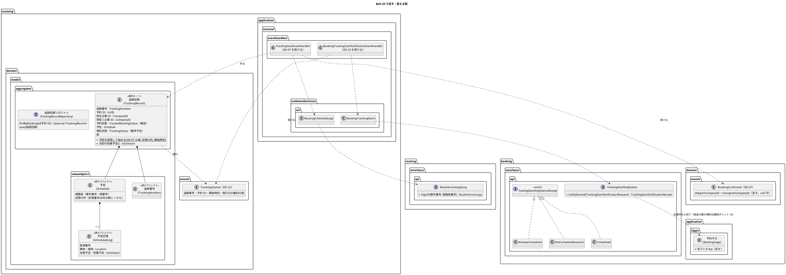
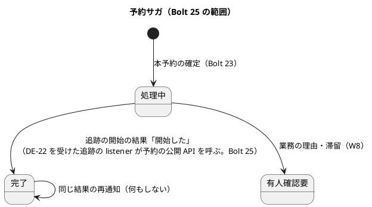
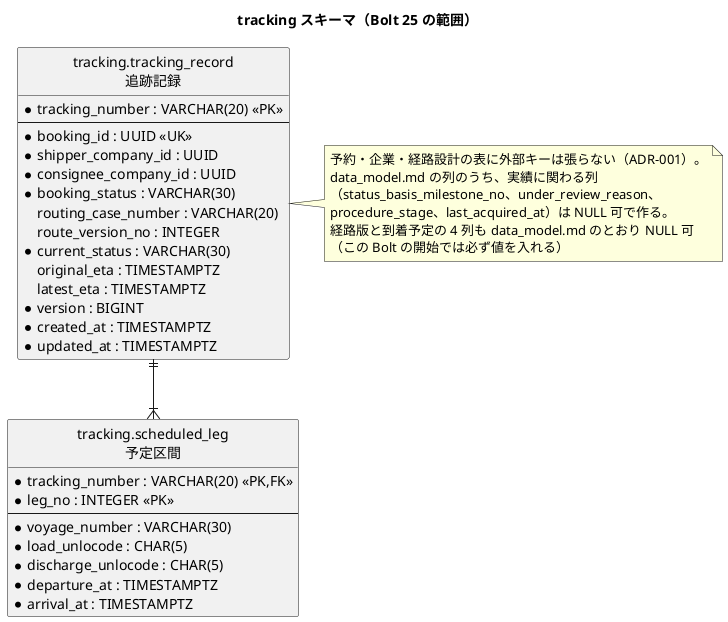
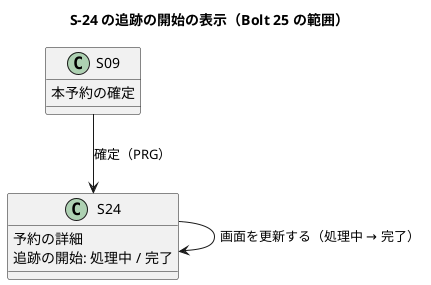

# Bolt 25 計画 - 追跡の開始と予約サガの成功の経路（US-04、ADR-015、#10）

## 基本情報

| 項目 | 内容 |
| :--- | :--- |
| Bolt | 第 25 回 |
| 予定 | W4（2026-10-26 の週。前倒しで 2026-10-09 から）、作業 4〜4.5 時間（承認ゲートの待ち時間を除く。AT-04 を入れたため半日に近い。ステップ 4 の打ち切りで分ける） |
| 対象 | U3 基本追跡（新しい `tracking` モジュール、追跡記録の集約、DE-07 の listener、DE-22 追跡を開始した）、U6 予約管理（`booking :: api` の新設、予約サガの完了、S-24、DE-07 の属性）、U2 経路設計（`routing :: api` の新設。経路版の区間の照会） |
| GitHub | [#10 [US-04] 予約を確定する](https://github.com/k2works/practical-domain-driven-design-in-enterpris-application/issues/10)（US-04 の SP 5 をこの Bolt で数え、#10 の R0.1 の範囲（AC1・AC2・AC4・重複確定の防止）をクローズする。残りの AC3・AC5（W6）は新しい Issue にする。US-24 の前例。確認ポイント 14） |
| 承認ゲート | 計画の承認（確認ポイント 1〜21）、設計文書（ADR-015 のコンプライアンスの決定）、スキーマ（`tracking` スキーマの新設。必ず止める。T-67）、モジュールの境界（`booking :: api`・`routing :: api` の新設、`tracking` の `allowedDependencies`、DE-07 の属性の追加、DE-22 の新設）、新しい注釈（`@CoreConcept`）、Red／Green（追跡の開始・サガの遷移・冪等）、画面（S-24）、開発レビューの判断、終了報告 |
| アプローチ | インサイドアウト（開発戦略の「Bolt ごとのアプローチの決め方」の「新しい集約・新しいスキーマを作る」。release_plan の W4 の表のとおり）。`tracking` スキーマと追跡記録の集約から作り、listener と公開 API、最後に S-24 の表示と受入シナリオ |
| 前の Bolt | [Bolt 24 終了報告](bolt_24_report.md) |

## Bolt ゴール

営業担当者が本予約を確定すると、追跡が DE-07 を受け、経路設計の公開 API から確定した経路版の区間を引いて追跡記録を作り、予定として採用する。追跡は DE-22（追跡を開始した）を発行し、それを受けた追跡の別の listener が予約の公開 API で結果を返して、予約サガが「処理中」から「完了」になる。S-24 を開き直すと「追跡の開始: 完了」が出る。DE-07・DE-22 を再配信しても追跡記録は 1 件で、予約サガは完了のまま。これを追跡記録の単体テスト、PostgreSQL の統合テスト（確定から予約サガの完了まで）、業務ルール層の受入シナリオで確かめ、#10 をクローズする。

### 確かめたい仮説

| # | 仮説 | この Bolt で分かること |
| :--- | :--- | :--- |
| H1 | DE-07 に荷主・荷受人の企業 ID だけを足し（小さな属性）、区間は経路設計の公開 API で経路版（不変）を引けば、DE-07 の payload を小さく保ったまま（H2 の発行記録の 4,000 文字）、確定した経路版の区間を予定にできる。依存は Unit の DAG（U3 → U6、U3 → U2）のとおりで、`booking` も `routing` も `tracking` に依存しない | ModularityTest が通り、追跡の listener の単体テストが経路設計の公開 API の結果から追跡記録を作ること |
| H2 | 追跡の開始を予約 ID で冪等にし（追跡記録の予約 ID の一意制約）、予約の公開 API を「処理中のときだけ完了にする」冪等な操作にすれば、DE-07・DE-22 の再配信でも追跡記録 1 件・予約サガ完了 1 回になる | PostgreSQL の統合テストで、DE-07・DE-22 を 2 回配信しても追跡記録・予定区間・予約サガの版が変わらないこと |

## ふりかえりと前の Bolt からの引き継ぎ

| 入力 | 内容 | この Bolt での扱い |
| :--- | :--- | :--- |
| ADR-015 のコンプライアンス | `booking :: api` を作る。追跡記録に要る荷主・荷受人の企業 ID と予定の区間の取得元を決める。ModularityTest で `booking` が `tracking` に依存しないことを確かめる。追跡の開始から予約サガの完了までを PostgreSQL の統合テストで確かめる | ステップ 1・4、確認ポイント 2・3・4・11 |
| Bolt 23 の既知の課題・A-11 | 「予約は追跡に依存しない」を ModularityTest に足す | ステップ 1（確認ポイント 4） |
| Bolt 23b の U-1（高、後に回した） | 確定の後に S-24 へ戻る入口がない | 確認ポイント 8。S-10 の最小の一覧は Bolt 25b に分ける案を推奨する |
| Bolt 23b の A-低3〜5 | 読み取りモデルが集約を包む、照会の結果の型が 3 段、一覧の読み取りモデルがドメイン層に増える（投影や照会専用のポートを ADR で諮る） | 入れない。S-10 の一覧を作る Bolt 25b で諮る |
| Bolt 24 の既知の課題（Bolt 25） | 送り直しの文言「追跡の開始を待っています」は、追跡の開始が完了した後の再送では事実と合わない | ステップ 5（確認ポイント 7） |
| Bolt 24 の A-11 | `afterMigrate` の権限の付与のスキーマの一覧に `tracking` を足す | ステップ 2（確認ポイント 6） |
| Bolt 24 の A-10（高、スコープ外） | AT-04（マッパーの SQL が自スキーマだけを参照する検査）が未実装。この Bolt で `tracking` のマッパーが増える | 入れる（確認ポイント 18。2026-10-09 の決定）。ステップ 2 で、新しい `tracking` のマッパーを足す前に検査を書く |
| Bolt 24 の確認ポイント 15・W4 の Living Documentation | 貨物予約と追跡記録の `@CoreConcept`、`tracking` の `package-info` の `allowedDependencies`、ModularityTest のモジュール名、用語集の整合テスト、`DomainEventSerializationContractTest` | ステップ 1・3・4。`@CoreConcept` の注釈はまだないので、作り方を人に諮る（確認ポイント 17） |
| Bolt 24 の Try T-71 | 行の型（`*Row`）に列を足したら、同じステップでマッパーの XML の結果の対応と INSERT・SELECT の列もそろえ、コンテキストを読み込むテストを 1 本流す | ステップ 2（追跡記録）、ステップ 4（予約サガの期待版の UPDATE） |
| Bolt 24 の Try T-72 | 画面の層のシナリオは、画面の単体テストと同じステップで先に書き、骨組みで落ちることを確かめる | ステップ 5 |
| Bolt 24 の Try T-73 | エスケープを含む編集は heredoc の Python に入れず、Edit で当てる | 全ステップ |
| Bolt 23 の Try T-66・T-67・T-68 | 前提にした状態より前に届く場合を表に入れる。スキーマのステップは止める。層の規則が開発ガイドラインの置き場所を拒否したら人に諮る | 状態遷移の節の表。ステップ 2 は必ず止める。`booking :: api` の実装の置き場所を諮る（確認ポイント 16） |
| Bolt 23b の Try T-69・T-70 | 次の行動を案内する文言はその画面と規則が今あるかを確かめる。`hasText` で確かめる欄に案内の文を足さない。レビューの対応の後も push の前に `uiTest` | S-24 の「画面を更新して確かめてください」の案内は、完了の後は出さない（ステップ 5）。ステップ 6 |
| Try T-54・T-55・T-56・T-57・T-58・T-60〜T-64・T-39 | 購読する側の依存が循環しないか、置換は `spotlessApply` の後、デモ環境の配備の前に手順書を読む、状態の列挙を見る判定の洗い出し、listener と公開 API の拒否と警告のログの経路の単体テスト、テンプレートで null を `!= null` で見る、メモリのリポジトリは写しを返す、ArchUnit の規則を書く前に grep、Red は本命のアサーションで落とす | 全ステップ。T-57 の対象: `BookingSagaStatus.COMPLETED` を見る `BookingSaga.isCompleted`、`BookingViews.trackingStart` の switch と処理中の判定、`BookingQueryService`、S-24 のテンプレート、`BookingSteps`、見積りの `TransportRequestLabels` の「予約確定済み（追跡の開始の準備中）」（US-09 の Bolt 27 まで残す） |

## スコープ

### 設計の約束（Try T-1）

- 依存は `tracking → booking :: events`（DE-07）・`booking :: api`（結果を返す）・`routing :: api`（経路版の区間）だけ。`booking` と `routing` は `tracking` に依存しない。Unit の依存 U3 → U6・U3 → U2 のとおり（ADR-015 の「依存は `tracking → booking` だけ」を改める。確認ポイント 2）
- DE-07 に足すのは荷主・荷受人の企業 ID だけ（予約条件の写しから。null 可）。区間は載せない（architecture_backend.md の「payload を小さく保ち、詳細は購読側が照会する」）。経路版は不変なので、開始の時に引いても確定した区間と同じ
- 追跡の開始は追跡の `application.internal.eventhandlers` の listener が行う。追跡記録を作って予定を採用し、同じトランザクションで DE-22（追跡を開始した）を発行する。DE-22 を受けた追跡の別の listener が、追跡の ACL 越しに予約の公開 API を呼んで予約サガを完了にする（ADR-014 の「下流の listener が自分のイベントを受けて上流の公開 API を呼ぶ」形。2 つのコンテキストの集約を 1 つのトランザクションで更新しない）
- 冪等: 追跡記録は予約 ID で一意。同じ予約の DE-07 の再配信は追跡記録を作らず、DE-22 も発行しない。予約の公開 API は、処理中の予約サガだけを完了にし、完了済みには何もしない（ADR-015 の「冪等」）
- 追跡の開始の業務の理由による失敗（有人案件の起票）と、処理中の滞留の有人確認要は W8。この Bolt の予約の公開 API は「開始した」の結果だけを受ける（確認ポイント 5）
- 追跡番号は、追跡のコンテキスト固有の値オブジェクトにする（予約の `TrackingNumber` を参照しない。BC 独立性。表記の形は同じ）

### 入れるもの・入れないもの

| 入れる | 入れない（後の Bolt） |
| :--- | :--- |
| `tracking` モジュール（`package-info`、`allowedDependencies`）、ModularityTest・ArchUnit・用語集の整合テスト | 追跡管理者のナビ・ホーム・認可と `db/dev-data` の追跡管理者の利用者（追跡管理者の画面を最初に使う Bolt 26 に移す案を推奨。確認ポイント 9） |
| 追跡記録（`TrackingRecord`）・予定（`Schedule`）・予定区間（`ScheduledLeg`）・追跡番号・追跡記録リポジトリ。`@CoreConcept`（追跡記録と貨物予約。確認ポイント 17） | 主要実績・訂正・現在状態の導出（US-12 の Bolt 26、US-13 の W12）。現在状態は「集荷予定」の固定値（予定を採用した直後）だけ |
| `tracking` スキーマの `tracking_record`・`scheduled_leg`、`afterMigrate` の権限の一覧に `tracking` | `milestone`・`correction`・`service_case` などほかの `tracking` の表、荷主・荷受人の索引（照会の Bolt 27） |
| DE-07 の購読、追跡の開始、DE-22、`booking :: api`（追跡の開始の結果）、予約サガの完了、`routing :: api`（経路版の区間） | 追跡の開始の失敗と有人確認要（W8）、定期の再配信（W10）。Bolt 23・24 で確定済みの予約（デモ環境）の追跡の開始（確認ポイント 19） |
| S-24 の「追跡の開始: 完了」、送り直しの文言の見直し | S-10 予約一覧の最小の表示（Bolt 25b に分ける案を推奨。確認ポイント 8）、S-12 追跡の詳細（Bolt 26 以後）、S-24 の自動の更新と通知領域 |
| 業務ルール層の受入シナリオ（確定から追跡の開始まで、DE-07 の再配信）、PostgreSQL の統合テスト（確定から予約サガの完了まで）、S-24 の画面の層のシナリオ | 荷主の照会（US-09 の Bolt 27） |

## 設計（この Bolt の範囲）

### ドメインモデル

| 規則（足す） | 内容 |
| :--- | :--- |
| T-INV-11（足す） | 追跡記録は予約 1 件に 1 件。同じ予約の DE-07 の再配信は追跡記録を作らない（ADR-015 の冪等） |
| T-INV-12（足す。予定の妥当性） | 区間は 1 件以上で、列の順に区間番号を 1 から振る。各区間の到着予定は出発予定より後、前の区間の揚地は次の区間の積地と同じ。経路版は経路設計で検査済みだが、追跡の予定の規則として追跡の側でも守る。経路版が見つからない・区間が不正・DE-07 の企業 ID が null（Bolt 23・24 の形のイベント）のときは、警告のログを残して開始しない（再配信で直らない欠け。T-62。予約サガは処理中のまま、W8 の有人確認要が拾う） |
| 当初の到着予定 | 最後の区間の到着予定（T-INV-10 の `original_eta`）。最新の見込み（`latest_eta`）は同じ値で始める |
| 現在状態「集荷予定」 | 要件定義の追跡状態モデルの遷移「予約確定 → 集荷予定（予定を採用する）」。T-INV-08 の「現在状態は採用済みの実績だけから導出」の、予定の採用による唯一の例外として書く。状態名は業務責任者の確認前の候補（要件定義の注記） |

### 状態遷移

予約サガは「処理中 → 完了」の遷移を足す。追跡記録の現在状態は、予定を採用した直後の「集荷予定」で始める（実績による遷移は Bolt 26 から）。

| 前提にした状態より前に届く場合（T-66）・同時の場合 | 扱い |
| :--- | :--- |
| 予約サガの保存より前に DE-07 が届く | 起きない。予約サガは本予約の確定と同じトランザクションで保存し、DE-07 は commit の後に配信する（Spring Modulith のイベントの発行の記録） |
| 追跡記録の保存より前に DE-22 が届く | 起きない。DE-22 は追跡記録の保存と同じトランザクションで発行し、commit の後に配信する |
| 予約の公開 API に、予約サガのない予約 ID が届く | 警告のログを残して `NotCompleted(SAGA_NOT_FOUND)` を返す（再配信で直らない欠けなので例外にしない。T-62） |
| 同じ予約の DE-07 が同時に 2 回届く | 負けた側は追跡記録の予約 ID の一意制約で失敗し、例外のままトランザクションを戻す。再配信（RTY-01）のときは既存の追跡記録を見つけ、何もしない（DE-22 は勝った側が発行済み。再配信で直る欠け。T-62） |
| 同じ予約の DE-22 が同時に 2 回届く | 負けた側は予約サガの楽観ロックで失敗し、例外のまま戻す。再配信のときは完了済みなので `AlreadyCompleted` |

予約サガの完了は `booking_saga` の `status` と `updated_at`（完了の時刻を兼ねる）を期待版で UPDATE する。完了時刻の列は足さない（`booking` スキーマは変えない）。`current_step` は `START_TRACKING` のまま（段階は 1 つだけで、状態が完了を示す）。今の `MyBatisBookingSagaRepository.save` は INSERT だけなので、期待版の UPDATE をマッパーと統合テストに足す（ステップ 4。T-71）。

### データモデル

| 変更 | 内容 |
| :--- | :--- |
| `tracking` スキーマ（新設） | `db/migration/common/V20261009xxxxxx__create_tracking.sql`。`tracking_record` と `scheduled_leg` の 2 つ。data_model.md の列のとおりに作る |
| 一意制約（足す） | `uk_tracking_record_booking`（`booking_id`）。T-INV-11 の冪等の正。data_model.md の制約の表に足す（注: 設計への反映が必要） |
| 状態の CHECK | `ck_tracking_record_booking_status`（`CONFIRMED`、`CANCELLED`、`COMPLETED`）、`ck_tracking_record_current_status`（要件定義の追跡状態モデルの値。集荷予定は `PICKUP_SCHEDULED`）。値の英語名はステップ 1 で data_model.md に決める |
| 予定区間の CHECK | `ck_scheduled_leg_no`（`leg_no >= 1`）、`ck_scheduled_leg_arrival`（`arrival_at > departure_at`）。見積りの `assigned_route_leg` と同じ |
| 監査列 | `created_by`・`updated_by` を持たない（システムが作る記録のため）。data_model.md の監査列の規約の例外として書く（注: 設計への反映が必要） |
| 索引 | 荷主・荷受人の索引（data_model.md の索引の表）は照会を作る Bolt 27 で足す |
| 追記専用 | どちらも追記専用にしない（`tracking_record` は版で更新する。`scheduled_leg` は予約の変更で置き換える W11） |
| `afterMigrate` | GRANT のスキーマの一覧に `tracking` を足す（Bolt 24 の A-11）。一覧の書き漏れを統合テストで捕まえる。検査は名指しの一覧ではなく、DB にある業務のスキーマ（`pg_namespace` から Flyway・システムのスキーマを除いたもの）から導く（今の `AppendOnlyGrantIntegrationTest` の名指しの一覧は `routing` も漏れている。確認ポイント 6） |

### 画面遷移

画面の遷移は変えない。S-24 の表示だけを変える。

| 画面 | URL | この Bolt で決めること |
| :--- | :--- | :--- |
| S-24 | `GET /staff/bookings/{追跡番号}` | 予約サガが完了なら「追跡の開始: 完了」（完了の時刻は出さない。完了時刻の列を持たないため）。「画面を更新して確かめてください」の案内は処理中のときだけ出す（T-69）。処理中なら今の表示 |
| S-09 | `POST /staff/bookings` | 確定の後の結果のお知らせを「TR-… 見積 N で本予約を確定しました。追跡番号は CT… です。」にし、追跡の開始の状態はお知らせではなく S-24 の欄で示す（送り直しのときも事実と合う。確認ポイント 7） |

ui_design.md の業務シナリオ（「予約サガが完了したら『完了』に更新し、通知領域で知らせる」）の自動の更新と通知領域は作らず、画面の更新で確かめる形を注として書き直す（自動の更新は社内の画面の共通の部品の Bolt で）。

## ステップ計画

状態の記号: `[ ]` 未着手、`[-]` 進行中、`[?]` 承認待ち、`[x]` 完了。各ステップの終わりに `check` が緑であることを確かめ、Green と同じ push にまとめて CI を確かめる（T-26、T-65）。Red は実行して本命のアサーションで失敗することを確かめてから実装する（T-39）。

- [ ] **1. 設計文書とモジュールの骨組み** 【承認ゲート: 設計文書、モジュールの境界、新しい注釈】
  - ADR-015: 決定の「依存の向き」を `tracking → booking（events・api）、routing（api）` に改め、コンプライアンスに決定を書く（企業 ID は DE-07、区間は `routing :: api`、DE-22 を挟んで別のトランザクションで返す、`booking :: api` の操作）。ADR-015 の改訂として扱う（確認ポイント 2・11）
  - domain_model.md: 用語集に「予定｜Schedule」「予定区間｜ScheduledLeg」、追跡番号の行の所属に「追跡（コンテキスト固有の値オブジェクト）」、区間の行の「写しは追跡」を予定区間に合わせる。現在状態と予約状態の型（enum の定義行。`TrackingStatus`、`TrackedBookingStatus`）。追跡記録の集約の図に荷受人企業 ID・予定区間、予定の経路版の「案件 ID」を「案件番号」に（Bolt 23 の A-6 の取りこぼし）。T-INV-08 に予定の採用の例外の注、T-INV-11・T-INV-12。イベント一覧に DE-07 の属性（荷主・荷受人の企業 ID）と DE-22（追跡を開始した）。リポジトリの表（予約 ID で取得）
  - data_model.md: `tracking_record` の `uk_tracking_record_booking`、`booking_status`・`current_status` の値、監査列の例外、索引は Bolt 27
  - architecture_backend.md: 予約サガの図と表（DE-22、完了の遷移、`booking :: api`）、モジュールの依存の表に `tracking`、公開 API の一覧に `booking :: api`・`routing :: api`（置き場所は `<コンテキスト>.interfaces.api`。確認ポイント 16・21）、「payload を小さく保つ」の例として DE-07 の企業 ID
  - units.md: U3 → U2「有効な経路予定と版」の契約を `routing :: api` の経路版の区間の照会と書く
  - ui_design.md: S-24 の行（「追跡の開始: 完了」、案内は処理中だけ）、S-09 の行（結果のお知らせの文言）、業務シナリオの「通知領域で知らせる」の注、S-10・準備中の画面の行に「Bolt 25b で最小の一覧」の注
  - test_strategy.md: T-INV-11・T-INV-12、予約サガの完了の行
  - user_story.md: US-04 の決定に「AC1 の『追跡可能な輸送を開始する』は、予約サガの完了（追跡の開始）までを R0.1 の範囲とする」を書く（受入条件は変えない。受入シナリオのタグは `@ADR-015`・`@T-INV-11`。確認ポイント 12）
  - release_plan.md の W4: Bolt 25 の行（範囲から追跡管理者のナビ・ホーム・認可・開発データを外し、承認ゲートの「認可」を外す。SP は 5）、Bolt 25b の行（確認ポイント 8）、Bolt 26 の行（追跡管理者のナビ・ホーム・認可・開発データと承認ゲートの「認可」）、主なタスク
  - `@CoreConcept` の注釈（新しいファイル）の作り方を決める（確認ポイント 17）
  - `tracking` の `package-info`（`allowedDependencies = {"shared", "booking :: events", "booking :: api", "routing :: api"}`）。ModularityTest のモジュール名に `tracking` を足すアサーションを先に書き、`tracking` がないので落ちることを確かめる（Red）。「`booking`・`routing` は `tracking` に依存しない」の規則は、既存の `noClasses()` の形で最初から通る見張りのテストとして書く（T-39 の記録に分けて書く）
  - 完了の判定: `okf:check` ERROR 0、`documentationTest` 緑、図の構文を PlantUML で確かめる
- [ ] **2. スキーマと追跡記録の永続化（統合テスト）** 【承認ゲート: スキーマ（必ず止める。T-67）】
  - AT-04 の検査を先に書く（確認ポイント 18）: マッパーの XML の SQL が自分のスキーマ（と `platform` の許可された表）以外を参照しない。既存のマッパーで通ること、他のスキーマを参照する見本で落ちることを確かめる。test_strategy.md の AT-04 の行と ADR-001 のコンプライアンスを「実装済み」に直す
  - マイグレーション（`tracking` スキーマ、`tracking_record`・`scheduled_leg`）と `afterMigrate` の GRANT の一覧。マイグレーションの SQL を見せて止める
  - PostgreSQL の統合テストを先に書く: 追跡記録と予定区間の保存と取得、予約 ID の一意制約、区間の CHECK、業務のスキーマの GRANT の漏れの検査（DB のスキーマから導く）
  - 行の型・マッパーの XML の結果の対応と INSERT・SELECT の列を同じステップでそろえ、コンテキストを読み込むテストを 1 本流す（T-71）
  - 完了の判定: `check` 緑
- [ ] **3. 追跡記録の集約と予定（単体テスト）** 【承認ゲート: Red／Green（追跡の開始）】
  - 単体テストを先に書く: 予定区間（到着は出発の後）、予定（1 件以上、区間番号は列の順、揚地と積地のつながり）、追跡記録の開始（予約状態は確定、現在状態は集荷予定、当初の到着予定と最新の見込みは最後の区間の到着予定、DE-22 を 1 回発行）、追跡番号の形
  - `TrackingRecord`（`@AggregateRoot`・`@CoreConcept`）、`Schedule`・`ScheduledLeg`・`TrackingNumber`（`@ValueObject`）、`TrackingStatus`・`TrackedBookingStatus`、DE-22、`TrackingRecordRepository`、MyBatis の実装、メモリの実装（写しを返す。T-61）。貨物予約に `@CoreConcept` を足す
  - 完了の判定: `check` 緑、用語集の整合テスト緑
- [ ] **4. DE-07 の購読、経路設計と予約の公開 API、予約サガの完了** 【承認ゲート: モジュールの境界、Red／Green（サガの遷移・冪等）】
  - 単体テストを先に書く: DE-07 の listener（経路設計の公開 API の区間で追跡記録を作る、同じ予約の再配信は作らない、経路版が見つからない・区間が不正・企業 ID が null は警告のログで開始しない。T-58）、DE-22 の listener（予約の公開 API を呼ぶ、`NotCompleted` は警告のログ）、予約サガの完了（処理中 → 完了、完了済みは何もしない）、予約の公開 API（予約サガがなければ警告のログと `NotCompleted(SAGA_NOT_FOUND)`）、経路設計の公開 API（確定した経路版の区間を区間の順に返す、ない経路版は空）
  - DE-07 に荷主・荷受人の企業 ID（null 可）を足す。`DomainEventSerializationContractTest` に、Bolt 23・24 の形の JSON（企業 ID なし）から null として復元できるテストと DE-22 を足す。H2 の発行記録の 4,000 文字に収まることを確かめる
  - 予約サガの期待版の UPDATE をマッパーと統合テストに足す（T-71）
  - 業務ルール層の受入シナリオ（`features/booking/confirm_booking.feature`、`@ADR-015 @T-INV-11`）: 本予約を確定すると追跡記録ができ、予定は承認済みの経路版の区間で、予約サガは完了。DE-07 を 2 回配信しても追跡記録は 1 件。受入の配線（`AcceptanceTestConfiguration`・`ScenarioReset`）にメモリの追跡記録リポジトリと、DE-07・DE-22 を追跡の listener へ同期で配る組み直しを足し、既存の予約のシナリオが追跡の開始を伴っても通ることを確かめる
  - PostgreSQL の統合テスト: 確定から追跡の開始・予約サガの完了まで（イベントの発行の記録の完了を待つ）、DE-07・DE-22 の再配信で追跡記録・予定区間・予約サガの版が変わらない（仮説 H2）
  - 公開 API は `booking.interfaces.api`・`routing.interfaces.api` に置く（確認ポイント 16）。層の規則の例外（確認ポイント 21）は、人の承認の後に、追跡の ACL が他のコンテキストの公開 API を参照するところで先に Red を確かめてから足す
  - 完了の判定: `check` 緑、ModularityTest・ArchUnit・PublicApiArchitectureTest 緑
- [ ] **5. S-24 の「追跡の開始: 完了」と文言、画面の層のシナリオ** 【承認ゲート: 画面】
  - 画面の層のシナリオと画面の単体テストを先に書き、骨組みで落ちることを確かめる（T-72）: 確定の後に S-24 を開き直すと「追跡の開始: 完了」が出る（デモ項目 `@demo @demo-bolt-25/start-tracking`。イベントの発行の記録の完了を待ってから開き直す）。キー操作だけ、幅 320 CSS px、axe-core 0 件
  - 既存の画面の層のシナリオ（`features/ui/confirm_booking_ui.feature`）は、確定の直後の S-24 を「処理中」と確かめている。追跡の開始が非同期で先に終わりうるので、期待を「処理中または完了（完了と出すのは予約サガが完了のときだけ）」に直す。処理中の表示は画面の単体テストで決定的に確かめる（確認ポイント 20）
  - 結果のお知らせから「追跡の開始を待っています」を外す（Bolt 24 の既知の課題）
  - 完了の判定: `check` と `uiTest` 緑
- [ ] **6. 開発レビューと終了報告** 【承認ゲート: 開発レビューの判断、終了報告】
  - `developing-review`（プログラマー・テスター・アーキテクト・インタラクションデザイナー・ユーザー代表）。SonarQube（`sonar-local:check`）、受入動画（`./gradlew demoVideo`。過去の Bolt の動画は元に戻す）、`bolt_25_report.md`
  - #10 に結果をコメントし、終了報告の承認の後にクローズする。US-04 の AC3・AC5（W6）の Issue を新しく作る。受入動画の添付先（`ops/scripts/issue_demo.js` の `BOLT_ISSUES` と手順書の表）に `bolt-25 → #10` を足す
  - デモ環境の配備の前に手順書を読む（T-56）。Bolt 23・24 で確定済みのデモ環境の予約は処理中のまま残ることを、終了報告と手順書の見本の一覧に書く（確認ポイント 19）
  - 開発レビューの対応の後も push の前に `uiTest` を流す（T-70）

### 時間の配分と打ち切り

| # | 目安 | 打ち切り |
| :--- | :--- | :--- |
| 1 | 35 分 | — |
| 2 | 55 分 | AT-04 の検査で既存のマッパーに違反が見つかったら、直さずに一覧を書いて人に諮る（ADR-001 の例外か直すか） |
| 3 | 35 分 | — |
| 4 | 70 分 | 経路設計の公開 API と DE-07 の属性の追加が 25 分を超えたら、そこで区切ってステップ 4a として分け、計画を直す。イベントの発行の記録の完了を待つ統合テストが不安定なら、1 回の再実行で決めず原因を書いて止める |
| 5 | 25 分 | — |
| 6 | 35 分 | — |

## 確認ポイント（計画の承認の場でまとめて確認する。Try T-6）

| # | 確認すること | ステップ | 推奨 |
| :--- | :--- | :--- | :--- |
| 1 | アプローチ | 全体 | インサイドアウト（新しい集約・新しいスキーマ）。release_plan の W4 の表のとおり |
| 2 | **追跡記録に要る値の取得元**（ADR-015 のコンプライアンス。ADR-015 の改訂） | 1・4 | **決定（2026-10-09、human:kakimomokuri）: 推奨のとおり**。荷主・荷受人の企業 ID は DE-07 に足し（小さな属性、null 可）、区間は追跡が `routing :: api`（新設。案件番号と経路版番号で、確定した経路版の区間を返す）で引く。Unit の依存 U3 → U2「有効な経路予定と版」のとおりで、経路版は不変なので確定した区間と同じ。ADR-015 の「依存は `tracking → booking` だけ」を改める。代わりの案は、(b) DE-07 に区間を載せる（architecture_backend.md の「payload を小さく保つ」の規則の例外になり、H2 の発行記録の 4,000 文字の上限に区間の数が当たる。見積りの公開 API の照会の結果に区間を足すことにもなる）、(c) 追跡が `booking :: api` で照会する（予約に区間の写しを持たせることになる） |
| 3 | `tracking` の `allowedDependencies` | 1 | `{"shared", "booking :: events", "booking :: api", "routing :: api"}`。見積り・`platform :: web` には依存しない（この Bolt では追跡の画面を作らない） |
| 4 | 「予約・経路設計は追跡に依存しない」の確かめ方 | 1 | ModularityTest に既存の `noClasses()` の形で足す。`allowedDependencies` だけでは、相手の宣言を書き換えれば通るため |
| 5 | **`booking :: api` の操作と結果** | 1・4 | `TrackingStartNotification.notifyStarted(TrackingStartNotificationRequest(予約 ID, 追跡番号, 開始時刻))` → `TrackingStartNotificationReceipt`（sealed interface と record の `Completed`・`AlreadyCompleted`・`NotCompleted(reason)`、理由の定数 `SAGA_NOT_FOUND`）。見積りの `BookingNotification`・`BookingNotificationReceipt` と同じ形（公開 API はインターフェースか record。PublicApiArchitectureTest）。コマンド ID・期待版（ARCH-HO-01）は持たない（予約 ID で冪等で、処理中のときだけ完了にする）。業務の理由で開始できない結果（有人案件の起票）は W8 で足す |
| 6 | **スキーマ** | 2 | `tracking` スキーマに `tracking_record`・`scheduled_leg` の 2 つだけ。data_model.md の列のとおりで、実績に関わる列は NULL 可。予約 ID の一意制約を足す。`afterMigrate` の GRANT の一覧に `tracking` を足し、業務のスキーマの GRANT の漏れを、DB のスキーマから導く統合テストで捕まえる（Bolt 24 の A-11） |
| 7 | 送り直しの文言 | 5 | 確定の結果のお知らせから「追跡の開始を待っています。」を外す。追跡の開始の状態は S-24 の欄（処理中・完了）が示す。送り直しのときも事実と合う |
| 8 | **S-24 に後から戻る入口**（Bolt 23b の U-1、高） | 1 | **決定（2026-10-09、human:kakimomokuri）: 推奨のとおり**。この Bolt に入れず、Bolt 25b（S-10 予約一覧の最小の表示: 追跡番号・業務番号・見積り・確定時刻・追跡の開始、新しい順、営業のナビの「予約」を有効にする。アウトサイドイン、SP 0。Bolt 23b の A-低3〜5 の読み取りモデルの諮りも）に分ける。Bolt 25 は新しいモジュール・スキーマ・2 つの公開 API で 3.5〜4 時間の見込みのため（半日を超える Bolt は分ける）。代わりの案は、(b) Bolt 25 に入れる（半日に近づく）、(c) W11 の S-10（US-05）まで待ち、デモは確定の直後の S-24 で見せる |
| 9 | **追跡管理者のナビ・ホーム・認可と追跡管理者の開発データ**（release_plan の Bolt 25 の範囲） | 1 | **決定（2026-10-09、human:kakimomokuri）: 推奨のとおり**。Bolt 26（US-12 実績の登録。追跡管理者が最初に画面を使う Bolt）に移す。Bolt 25 は追跡管理者の画面を作らず、認可の対象がないため。release_plan の W4 の表を直す。Bolt 26 は主要実績の表・S-12・S-13・ナビ・認可・開発データで半日を超えるおそれがあるので、Bolt 26 の開始準備で分け方を決める |
| 10 | 前提にした状態より前に届く場合・同時の場合（T-66） | 4 | 状態遷移の節の表のとおり |
| 11 | **追跡の開始と予約サガの完了のトランザクション** | 1・4 | **決定（2026-10-09、human:kakimomokuri）: 推奨のとおり**。分ける。追跡記録の保存と DE-22 の発行を 1 つのトランザクションで行い、DE-22 を受けた追跡の別の listener が予約の公開 API を呼ぶ（ADR-014 の形。ADR-014 が退けた「1 つのトランザクションで 2 つのコンテキストの集約を更新する」を避ける）。代わりの案は、(b) DE-07 の listener の 1 つのトランザクションで追跡記録の保存と予約サガの完了を行う（イベントが 1 つ少ないが、ADR-014 との違いを ADR-015 に書いて例外にすることになる） |
| 12 | 受入条件とタグ | 1・4 | US-04 の受入条件は変えない（AC1 の Then は予約版・追跡番号・commit 時刻）。追跡の開始はストーリーの目的（追跡可能な輸送を開始する）と ADR-015 の約束なので、受入シナリオは `@ADR-015 @T-INV-11` で `features/booking/confirm_booking.feature` に置く（test_strategy の置き場所）。user_story.md の US-04 の決定に R0.1 の範囲として書く |
| 13 | 承認ゲート | 全体 | 上の「基本情報」のとおり各ゲートで止める。`/goal` で進める指示があっても、ステップ 2（スキーマ）は止める（T-67） |
| 14 | SP と #10 | 1・6 | US-04 の SP 5 をこの Bolt で数える（release_plan の W4 の表の SP を直す）。終了報告の承認の後に #10 をクローズし、AC3（不足条件）・AC5（特殊貨物）の W6 の Issue を新しく作る（US-24 の前例）。W4 の残りは US-12（3）、US-09（3） |
| 15 | ユーザーマニュアル | — | W4 の完了の後（W4 の計画） |
| 16 | **公開 API の置き場所**（人の指示、2026-10-09: 「公開 API の配置は開発ガイドに準拠して interfaces 以下に配置する」） | 1・4 | 開発ガイドライン第 3 章のインターフェース層（「プロトコルで分類した全てのインバウンドサービス」）に従い、新しい公開 API は `booking.interfaces.api`・`routing.interfaces.api`（`@NamedInterface("api")`。名前付きインターフェースの名前は `api` のままなので、`allowedDependencies` の `booking :: api`・`routing :: api` は変えない）に置く。公開 API の型（インターフェースと record）と、それを実装するインバウンドアダプター（アプリケーションサービスに委ねるだけ）を同じパッケージに置く（interfaces → application の向き）。予約の側のアプリケーションサービスは `booking.application.internal.commandservices` に置き、予約サガのリポジトリで読んで「完了にする」を呼ぶ。見積りの公開 API（`quotation.api`、実装は `application.internal.commandservices`）は今の置き場所のまま残し、移すかは確認ポイント 21 で決める |
| 21 | **層の規則の例外**（CLAUDE.md の規則: 層の規則がガイドラインの置き場所を拒否したら、規則の例外を人に諮る） | 1・4 | **決定（2026-10-09、human:kakimomokuri）: 推奨のとおり**。今の層の規則は、ガイドラインの置き場所を 2 か所で拒否する。(1) `LayerArchitectureTest` の「interfaces はどの層からも参照されない」は、追跡の ACL（`tracking.application.internal.outboundservices.acl`）が `booking.interfaces.api`・`routing.interfaces.api` を参照するのを拒否する。(2) `PublicApiArchitectureTest` は公開 API を `*.api` だけとして検査する。推奨は、(1) に「他のコンテキストの `application.internal.outboundservices.acl` は `..interfaces.api..` を参照してよい」の例外を 1 つ足し（D-5 と同じく理由を `because` に書く）、(2) の対象に `*.interfaces.api..` を足す。どちらも規則を書く前に対象を grep して正当な使い道を確かめる（T-64）。見積りの `quotation.api` を `quotation.interfaces.api` に移すのは別の技術タスク（Bolt 25b か W4 の締めの前）にし、移すまでは 2 つの置き場所を規則で許す。architecture_backend.md の「公開 API の置き場所と形」と ADR-014 の実装の置き場所の記述を直す |
| 17 | **`@CoreConcept` の注釈**（新しいファイル） | 1・3 | **決定（2026-10-09、human:kakimomokuri）: 作る**。`shared/annotation/ddd/CoreConcept.java` を新しく作り、追跡記録と貨物予約に付ける。JIG の用語集で中核の概念として示す使い道だけにし、テストでは検査しない。代わりの案は、W4 の Living Documentation から外し、JIG の設定で集約ルートを中核として扱う |
| 18 | AT-04（Bolt 24 の A-10） | 2 | **決定（2026-10-09、human:kakimomokuri）: Bolt 25 に入れる**。マッパーの XML を読み、各コンテキストの SQL が自分のスキーマ（と `platform` の許可された表）以外を参照しないことを検査するテスト（test_strategy の AT-04）。新しい `tracking` のマッパーを足す前に書き、既存のマッパーで通ることを確かめる（見張りのテスト。Red は、他のスキーマを参照する SQL の見本で落ちることで確かめる） |
| 19 | Bolt 23・24 で確定済みの予約（デモ環境） | 6 | 追跡の listener ができる前に DE-07 を配信し終えているので、予約サガは処理中のまま残る。この Bolt では扱わず（W8 の処理中の滞留の有人確認要が拾う）、デモは見本（TR-2026-0906・0907）で新しく確定した予約で見せる。終了報告と手順書に書く |
| 20 | 既存の画面の層のシナリオの「処理中」 | 5 | 期待を「処理中または完了」に直し、処理中の表示は画面の単体テストで確かめる。代わりの案は、画面の層のテストで追跡の listener を止める設定を足す（本物の流れから外れる） |

## 完了条件

- [ ] 追跡記録の単体テスト、業務ルール層の受入シナリオ（確定から追跡の開始まで、DE-07 の再配信）が通る
- [ ] PostgreSQL の統合テストで、本予約の確定から追跡の開始・予約サガの完了までが通り、DE-07・DE-22 の再配信で追跡記録・予約サガが変わらない
- [ ] ApplicationModules の検証と ArchUnit が緑で、`booking`・`routing` は `tracking` に依存しない
- [ ] 画面の層の受入シナリオ（S-24 の「追跡の開始: 完了」）が通り、受入動画を撮った
- [ ] `check`・`documentationTest`・`uiTest` が緑。push して CI とデモ環境の配備を確かめた
- [ ] SonarQube の Quality Gate が PASS
- [ ] 設計文書に決定を書き、計画からの変更も設計文書に戻した（T-53）
- [ ] 開発レビューと終了報告。#10 に結果をコメントし、承認の後にクローズした。AC3・AC5 の Issue を作った

### デモ項目

営業担当者が本予約を確定し、S-24 を開き直すと「追跡の開始: 完了」が出る（`@demo @demo-bolt-25/start-tracking`）。

## 更新履歴

| 日付 | 更新内容 | 更新者 |
| :--- | :--- | :--- |
| 2026-10-09 | 確認ポイントの回答を反映した（1〜3 は推奨のまま、`@CoreConcept` は作る、AT-04 は Bolt 25 に入れる。回答は計画の承認ではない） | anthropic/claude-opus-5-5、回答 human:kakimomokuri |
| 2026-10-09 | 人の指示「公開 API の配置は開発ガイドに準拠して interfaces 以下に配置する」を反映した（`booking.interfaces.api`・`routing.interfaces.api`、層の規則の例外を確認ポイント 21 に） | anthropic/claude-opus-5-5、指示 human:kakimomokuri |
| 2026-10-09 | 開始準備の整合性検証（計画と設計 27 件、横断 19 件）の指摘を反映した（2 つのコンテキストを 1 つのトランザクションで更新しない DE-22、区間は `routing :: api`、既存の画面の層のシナリオの「処理中」、公開 API の受領の型、ACL、listener の名前、予約サガの UPDATE と完了の時刻、`@CoreConcept`、受入条件とタグ、release_plan の Bolt 25・25b・26、#10 の残りの Issue、デモ環境の既存の予約、GRANT の検査、AT-04） | anthropic/claude-opus-5-5 |
| 2026-10-09 | 初版作成（承認待ち） | anthropic/claude-opus-5-5 |

## 関連ドキュメント

- [リリース計画](release_plan.md)（W4）
- [Bolt 24 終了報告](bolt_24_report.md)
- [Bolt 23 終了報告](bolt_23_report.md)、[Bolt 23b 終了報告](bolt_23b_report.md)
- [ADR-015](../../adr/cargo-tracker/015-booking-saga-starts-tracking-by-event.md)、[ADR-014](../../adr/cargo-tracker/014-downstream-to-upstream-notification.md)、[ADR-001](../../adr/cargo-tracker/001-modular-monolith.md)
- [ユーザーストーリー](../../requirements/cargo-tracker/user_story.md)（US-04）、[Unit 定義](../../requirements/cargo-tracker/units.md)（U3）
- [ドメインモデル](../../design/cargo-tracker/domain_model.md)（追跡の集約、T-INV、DE-07、予約サガ）
- [データモデル](../../design/cargo-tracker/data_model.md)（`tracking`）
- [UI 設計](../../design/cargo-tracker/ui_design.md)（S-09、S-24）
- [バックエンドアーキテクチャ](../../design/cargo-tracker/architecture_backend.md)（予約サガ、公開 API、ACL）
- [開発戦略](development_strategy.md)
