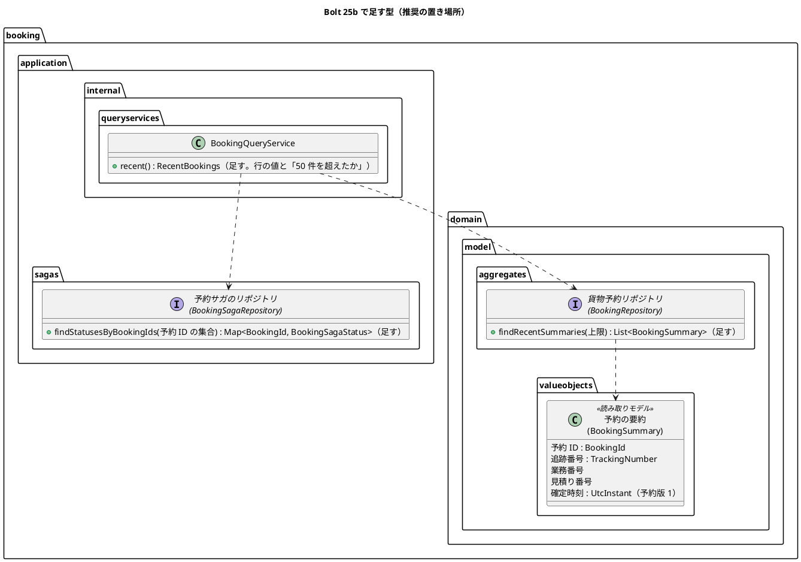
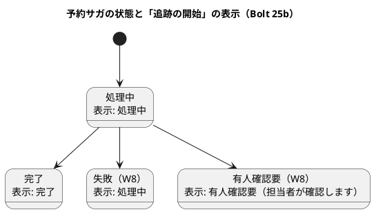
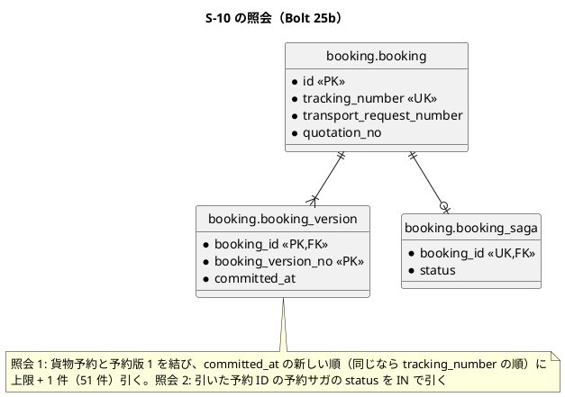
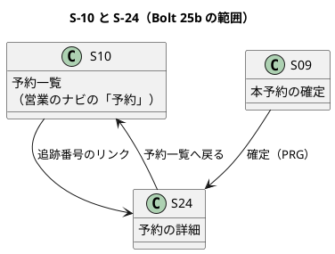

# Bolt 25b 計画 - S-10 予約一覧の最小の表示（S-24 へ戻る入口）

## 基本情報

| 項目 | 内容 |
| :--- | :--- |
| Bolt | 第 25b 回（Bolt 25 から分けた。2026-10-09 に human:kakimomokuri が決定） |
| 予定 | W4（2026-10-26 の週。前倒しで 2026-10-09 から）、作業 2.5〜3 時間（承認ゲートの待ち時間を除く） |
| 対象 | U6 予約管理（S-10 予約一覧、貨物予約リポジトリと予約サガのリポジトリの照会、S-24 の戻る導線） |
| GitHub | Issue なし（Bolt 23b の開発レビュー U-1（高）を返す画面の補い。SP 0。受入動画は #10 に添付する。US-05 の S-10 の本体（変更・取消申請の状況）は W11） |
| 承認ゲートの扱い | 人の指示（`/goal Bolt 25b`、2026-10-09。ステップ 1 の画面のゲートの後）により、承認ゲートで止まらずに進める。止まらなかったゲートごとに根拠を書き、終了報告の承認の議題に置く（T-36） |
| 承認ゲート | 計画の承認（確認ポイント 1〜12）、画面、Red／Green ごと（照会）、開発レビューの判断、終了報告。スキーマは変えないので、スキーマのゲートはない |
| アプローチ | アウトサイドイン（開発戦略の「Bolt ごとのアプローチの決め方」の「既存の集約に受入条件を足す」。新しい集約・スキーマは作らない）。画面の層の受入シナリオ → 画面 → 照会 → 永続化の順 |
| 前の Bolt | [Bolt 25 終了報告](bolt_25_report.md) |

## Bolt ゴール

営業担当者が営業のナビの「予約」を開くと、確定した予約の一覧（S-10 の最小の表示）が新しい順に出る。各行は追跡番号・見積り・確定時刻・追跡の開始（処理中・完了・有人確認要）を示し、追跡番号のリンクで S-24 を開ける。S-24 からは「予約一覧へ戻る」で S-10 に戻れる。確定の後に一度 S-24 を離れても、後から追跡の開始の完了を確かめられる。これを画面の層の受入シナリオ（キー操作だけ、幅 320 CSS px、axe-core 0 件）で確かめる。

### 確かめたい仮説

| # | 仮説 | この Bolt で分かること |
| :--- | :--- | :--- |
| H1 | 一覧は、予約の要約（貨物予約と予約版 1 の 1 本の SELECT）と、予約サガの状態（件数の上限の中の IN の 1 本の SELECT）の 2 本で引け、行ごとの照会（N+1）にならない | 照会のサービスの単体テストで、予約が 3 件あってもリポジトリの照会がそれぞれ 1 回であること。マッパーに一覧の select が 2 つだけであること |

## ふりかえりと前の Bolt からの引き継ぎ

| 入力 | 内容 | この Bolt での扱い |
| :--- | :--- | :--- |
| Bolt 23b の U-1（高、後に回した） | 確定の後に S-24 へ戻る入口がない | この Bolt の目的 |
| Bolt 23b の A-低5 | 一覧の読み取りモデルがドメイン層に増える（投影や照会専用のポートを ADR で諮る） | 確認ポイント 2 で置き場所を諮る |
| Bolt 23b の A-低3・A-低4 | 読み取りモデルが集約を包む（`BookingDetail`）、照会の結果の型が 3 段で同じ形 | A-低3 は扱わない（W11 の S-10 の本体で）。A-低4 は、照会のサービスが画面の行の値と「50 件を超えたか」だけを返し、同じ形の型を 3 段に重ねない（確認ポイント 2） |
| Bolt 23b の U-9 | 追跡番号の区切りの表示 | 入れない（S-10 は追跡番号を並べるが、表示の形は S-24 と同じにする） |
| Bolt 25 の U-6 | 「処理中（追跡の開始を待っています）」は欄の名前と重なって冗長 | S-24・S-10 とも「処理中」にする（確認ポイント 5） |
| Bolt 25 のスコープ外の発見 | S-24 で営業のナビの「予約」に `aria-current="page"` が付くのに、そのリンクは準備中の画面を開く | S-10 を作るので解消する。画面の層のシナリオで、S-10・S-24 でナビの「予約」が現在の項目として示されることを確かめる |
| Bolt 25 の既知の制約 | Bolt 25 より前に確定した予約は追跡の開始が起きない | デモ環境は再起動で初期化されるので、S-10 に処理中のまま残る予約は出ない |
| Bolt 25 の既知の課題 | 画面の層の揺れ（必要書類の添付のシナリオ） | 揺れたら 1 回流し直し、同じシナリオが 2 回続けて落ちたら原因を調べる |
| Bolt 24 の Try T-71・T-72・T-73 | 行の型に列を足したらマッパーもそろえる。画面の層のシナリオを先に書き、骨組みで落ちることを確かめる時点を計画に書く。エスケープを含む編集は heredoc の Python に入れない | ステップ 1（`uiTest` を骨組みで流して Red を確かめる）・3。全ステップ |
| Bolt 25 の Try T-74・T-75・T-76 | 値オブジェクトを作る呼び出しを同じ try に入れる。Playwright の正規表現に JavaScript にない構文を使わない。遅れて届くものを表にする | T-74・T-76 は当たらない（listener と通知を作らない）。T-75 は画面の層のシナリオで守る |
| Try T-39・T-57・T-58・T-61・T-69・T-70 | Red は本命のアサーションで、状態の列挙の判定の洗い出し、listener の警告のログ、メモリのリポジトリは写しを返す、案内の文言は先の画面があるか確かめる、レビューの対応の後も push の前に `uiTest` | T-57: `BookingSagaStatus` の 4 つの値の表示を単体テストで網羅する（`BookingViews.trackingStart` と `DetailView.trackingStartPending`）。T-58 は当たらない（listener を作らない）。ほかは全ステップ |

## スコープ

### 設計の約束（Try T-1）

- S-10 は確定した予約の最小の一覧で、絞り込み・ページ送りは作らない。確定時刻の新しい順（同じ時刻なら追跡番号の順）に最大 50 件を示し、50 件を超えたら「新しい 50 件だけを示しています。」と示す（確認ポイント 3）
- 予約の要約は予約の表（貨物予約・予約版 1）だけから引き、予約サガの状態は照会のサービスが予約サガのリポジトリから件数の上限の中の IN でまとめて引く（確認ポイント 2）。予約サガのない予約は、S-24 と同じく不変条件の違反として例外にする
- 社内の画面なので荷主企業で絞らない（S-02 と同じ）
- 追跡の開始の表示は S-24 と同じ部品（`BookingViews.trackingStart`）を使い、処理中を完了と示さない（ADR-015）
- 準備中の画面の `/staff/bookings` を S-10 に置き換え、`PlaceholderController` の営業の画面の処理と表を消す（荷主の画面は残す）
- スキーマは変えない（新しい索引も足さない。確認ポイント 4）

### 入れるもの・入れないもの

| 入れる | 入れない（後の Bolt） |
| :--- | :--- |
| S-10 の最小の表示（追跡番号・見積り・確定時刻・追跡の開始）、S-24 の「予約一覧へ戻る」 | 絞り込み・ページ送り・変更・取消申請の状況（US-05、W11） |
| 貨物予約リポジトリの要約の照会、予約サガのリポジトリの複数の予約 ID での照会 | 荷主の予約一覧（顧客 Web の「予約」。荷主の照会の Bolt 27 以後） |
| 「処理中」の表示を S-24 と S-10 でそろえる（Bolt 25 の U-6）、「失敗」の表示を UI 設計にそろえる（確認ポイント 6） | 「完了」の後の次の行動の文言（Bolt 25 の U-7。荷主の照会の Bolt 27）、追跡番号の区切りの表示（Bolt 23b の U-9） |
| 画面の層の受入シナリオ（デモ項目 `@demo @demo-bolt-25b/booking-list`） | 業務ホーム（S-01）からの導線（業務ホームを作る Bolt で）、`BookingDetail` が集約を包む形（Bolt 23b の A-低3。W11） |

## 設計（この Bolt の範囲）

### ドメインモデル

新しい集約・値オブジェクトはない。予約の要約（読み取りモデル）を足す。

`BookingSummary` は前例（`RoutingCaseSummary` など、ドメイン層の一覧の読み取りモデル）と同じく DDD の注釈を付けず、用語集にも足さない（`LivingGlossaryConsistencyTest` は注釈を付けた型だけを見る）。

### 状態遷移

状態を変える処理はない（照会だけ）。予約サガの状態の表示は次のとおり（T-57。UI 設計の共通部品「処理中表示」に合わせる。確認ポイント 6）。

### データモデル

スキーマは変えない。一覧の照会は次の 2 本。

### 画面遷移

| 画面 | URL | この Bolt で決めること |
| :--- | :--- | :--- |
| S-10 予約一覧（社内） | `GET /staff/bookings` | 見出し「予約一覧」。表の caption「確定した予約（確定時刻の新しい順）」、表は横スクロールの囲み（`.table-scroll`、`role="region"`、`aria-labelledby` で caption に結ぶ。routing の案件一覧と同じ）。列は追跡番号（S-24 へのリンク）・見積り（「TR-2026-0001 見積 1」。S-02 の列名にそろえる）・確定時刻（最初の確定の時刻。社内の日時表示の部品）・追跡の開始。予約がなければ「確定した予約はまだありません。」。50 件を超えたら表の上に「新しい 50 件だけを示しています。」。処理中の行の案内は出さない（追跡番号のリンクで S-24 の案内に届く。画面のゲートで確かめる） |
| S-24 予約の詳細（社内） | `GET /staff/bookings/{追跡番号}` | 「見積依頼の受付一覧へ戻る」の前に「予約一覧へ戻る」を足す。「処理中（追跡の開始を待っています）」を「処理中」にする（案内の文が説明を担う） |

## ステップ計画

状態の記号: `[ ]` 未着手、`[-]` 進行中、`[?]` 承認待ち、`[x]` 完了。各ステップの終わりに `check` が緑であることを確かめ、Green と同じ push にまとめて CI を確かめる（T-26、T-65）。Red は実行して本命のアサーションで失敗することを確かめてから実装する（T-39）。

- [x] **1. 画面の層の受入シナリオと画面（S-10・S-24）** 【承認ゲート: 画面】
  - 画面の層の受入シナリオを先に書く（T-72）: `features/ui/confirm_booking_ui.feature`（機能のタグは `@ui @US-04 @must` のまま）に 1 本を足す（`@demo @demo-bolt-25b/booking-list @US-04-AC1`。背景と `BookingUiSteps` の確定のステップを再利用する）。営業担当者が本予約を確定し、受付一覧へ戻ってから営業のナビの「予約」を開くと、確定した予約が一覧の先頭に出て、ナビの「予約」が現在の項目として示される（`LayoutUiSteps` の既存のステップ）。追跡番号のリンクで S-24 を開け、S-24 の「予約一覧へ戻る」で S-10 に戻る。キー操作だけ、幅 320 CSS px、axe-core 0 件
  - 画面の骨組み（S-10 の見出しだけ）で `uiTest` のこのシナリオを流し、本命のアサーション（一覧の行）で落ちることを確かめる（T-72 の Red を確かめる時点）
  - 画面の単体テストを先に書く: 一覧の列と並び、追跡の開始の 4 つの状態の表示（T-57）、予約がないときの文言、50 件を超えたときの文言、S-24 の戻るリンクと「処理中」
  - 既存のテストを直す: `AuthenticationSecurityIntegrationTest` の「営業担当者はナビの予約を開くと準備中の画面になる」を S-10 の 200（見出し「予約一覧」）に、荷主・経路設計者の `GET /staff/bookings` は 403 であることを足す。画面の層・画面の単体テストの「処理中（追跡の開始を待っています）」の期待を「処理中」に
  - `BookingController` に `GET /staff/bookings`、`list.html`、`PlaceholderController` の営業の画面の処理と表を消す
  - 完了の判定: `check` 緑（画面の層はステップ 3 の後に緑）
  - 結果（2026-10-09）
    - Red: 画面の層のシナリオ 2 本（予約一覧から予約の詳細を開き直す `@demo-bolt-25b/booking-list`、幅 320 CSS px）を `confirm_booking_ui.feature` に先に書き、S-10 の骨組み（見出しだけ）で `uiTest` を流して、本命のアサーション（予約一覧の表がない）で落ちることを確かめた（T-72）。幅 320 CSS px のシナリオは、狭い幅ではナビがメニューのボタンに畳まれるのにメニューを開いていなかったので、既存のステップ「メニューのボタンを押す」を足した（シナリオの誤り）。画面の単体テスト 8 件（一覧の列と並び、予約がない、50 件を超えた、追跡の開始の 4 つの状態、S-24 の戻るリンクと「処理中」）は、実装を書いた後に実装を外して流し、レスポンスの中身のアサーションで落ちることを確かめた（T-39。Gradle が画面の層の実行で使えない間に実装まで進めたため）
    - Green: `BookingController` の `GET /staff/bookings`、`BookingViews.list`、`list.html`（caption「確定した予約（確定時刻の新しい順）」、横スクロールの囲み）、S-24 の「予約一覧へ戻る」と「処理中」、追跡の開始の表示を UI 設計の共通部品にそろえた（失敗は「処理中」）。`PlaceholderController` の営業の画面の処理と表を消した。セキュリティの統合テストを、営業担当者は S-10 の 200、荷主と経路設計者は 403 に直した
    - 照会（`BookingQueryService.recent`）はステップ 2 までの骨組み（空を返す）。画面の層の新しいシナリオはステップ 3 の後に緑になるので、push はステップ 3 と一緒にする
    - `check` 緑
    - 承認ゲートの扱い（T-36）: 人の指示（`/goal Bolt 25b`、2026-10-09）により、画面のゲートで止まらずに進めた（AI の判断）。根拠は、画面の構成と文言が計画の確認ポイントの決定（2026-10-09 承認）のとおりであること
- [x] **2. 一覧の照会（単体テスト）** 【承認ゲート: Red／Green（照会）】
  - 単体テストを先に書く: 照会のサービスが要約を上限 51 件で 1 回、予約サガの状態を IN で 1 回引き、50 件を超えるかを返す（仮説 H1）。予約サガのない予約は例外。メモリのリポジトリは新しい順で写しを返す（T-61）
  - `BookingSummary`、`BookingRepository.findRecentSummaries`、`BookingSagaRepository.findStatusesByBookingIds`、`BookingQueryService.recent`、メモリの実装（`InMemoryBookingRepository`・`InMemoryBookingSagaRepository`）、`RandomTrackingNumberIssuerTest` の仮の実装、受入の配線
  - 完了の判定: `check` 緑
  - 結果（2026-10-09）: 照会のサービスの単体テスト 4 件（新しい順と予約サガの状態、上限 50 件と超えたこと、要約と状態をそれぞれ 1 回の照会で引く（仮説 H1）、予約サガのない予約は例外）を先に書き、骨組み（空を返す）で 4 件が本命のアサーションで落ちることを確かめてから実装した。予約サガのリポジトリを使う既存の単体テストの仮の実装にも照会を足した。受入の配線は既存のメモリのリポジトリのままで変更は要らなかった
    - 承認ゲートの扱い（T-36）: Red／Green（照会）のゲートで止まらずに進めた（AI の判断）。根拠は、置き場所と引き方が確認ポイント 2 の決定のとおりであること
- [x] **3. 永続化（PostgreSQL の統合テスト）** 【承認ゲート: Red／Green（照会）】
  - 統合テストを先に書く: 新しい順（同じ時刻は追跡番号の順）、上限、予約版 1 の確定時刻、予約サガの状態の IN
  - マッパーの `findRecentSummaries`・`findSagaStatusesByBookingIds`（T-71 のとおり行の型と結果の対応を同じステップでそろえる。AT-04 の自スキーマの検査を通す）
  - 完了の判定: `check`・`uiTest` 緑
  - 結果（2026-10-09）: 統合テスト 2 件（確定時刻の新しい順・同じ時刻は追跡番号の順・上限、予約サガの状態の IN と空の集合）を先に書いた。Red は骨組みの未実装の例外で落ち、本命のアサーションではなかった（T-39 の記録）。マッパーの `findRecentSummaries`（貨物予約と予約版 1 の 1 本の SELECT）・`findSagaStatusesByBookingIds`（IN の 1 本。空の集合は照会しない）と行の型・結果の対応を同じステップでそろえた（T-71）。AT-04 の検査は通った。`check` 緑、`uiTest` 67 本緑（新しい 2 本を含む）
    - 統合テストの実行で、私のコマンドの誤り（移動の先の誤りと、結果のファイルがないときに `grep` が標準入力を待ち続けた）で 10 分止まった（Problem）
- [x] **4. 開発レビューと終了報告** 【承認ゲート: 開発レビューの判断、終了報告】
  - `developing-review`（プログラマー・テスター・アーキテクト・インタラクションデザイナー・ユーザー代表）、SonarQube（`sonar-local:check`）、受入動画（`./gradlew demoVideo`。過去の Bolt の動画は元に戻す）、`bolt_25b_report.md`
  - 設計文書: ui_design.md（URL の表に S-10 の行を新設、画面一覧の S-10 の対応に US-04、社内業務 Web の画面遷移図に S-10 と S-24 → S-10 とナビ → S-10、S-24 の行の「処理中」と戻る導線、準備中の画面の行、共通部品「処理中表示」の失敗の扱い、共通部品「画面幅」の表の扱いを横スクロールの囲みにそろえる注）、domain_model.md（リポジトリの表の予約の行に要約の照会、予約サガのリポジトリの照会、予約の本文に一覧の読み取りモデルの説明）、data_model.md（索引の表に確定時刻の索引は W11 で決める注）（T-53）
  - 終了報告の承認の後に、受入動画の添付先（`ops/scripts/issue_demo.js` の `BOLT_ISSUES` と手順書の表）に `bolt-25b → #10` を足す
  - 開発レビューの対応の後も push の前に `uiTest` を流す（T-70）
  - 結果（2026-10-09）: 2 つの観点でレビューし、中 4 件・低 4 件を直し、U-3（幅 320 CSS px の確定時刻）を人に諮る議題にした（[Bolt 25b 終了報告](bolt_25b_report.md)）。設計文書（ui_design.md・domain_model.md・data_model.md）を書いた。SonarQube は新しい指摘 1 件で FAIL だったので直し、PASS になった。直した後に `check`・`uiTest`（67 本）を流した（T-70）
    - 承認ゲートの扱い（T-36）: 開発レビューの判断で止まらずに進めた（AI の判断）。終了報告の承認の議題に置く

### 時間の配分と打ち切り

| # | 目安 | 打ち切り |
| :--- | :--- | :--- |
| 1 | 60 分 | — |
| 2 | 30 分 | — |
| 3 | 30 分 | — |
| 4 | 40 分 | — |

## 確認ポイント（計画の承認の場でまとめて確認する。Try T-6）

| # | 確認すること | ステップ | 推奨 |
| :--- | :--- | :--- | :--- |
| 1 | アプローチ | 全体 | アウトサイドイン（既存の集約の照会を足す。新しい集約・スキーマは作らない） |
| 2 | **一覧の読み取りモデルの置き場所と引き方**（Bolt 23b の A-低5。開始準備の検証の指摘） | 2・3 | **決定（2026-10-09、human:kakimomokuri）: 推奨のとおり**。予約の要約（`booking.domain.model.valueobjects.BookingSummary`。予約 ID・追跡番号・業務番号・見積り番号・確定時刻）は予約の表だけから `BookingRepository.findRecentSummaries` で引き、予約サガの状態は照会のサービスが `BookingSagaRepository.findStatusesByBookingIds` で件数の上限の中の IN で引く（SELECT は 2 本、N+1 にしない）。ドメイン層の一覧の読み取りモデルの前例（5 つ。どれも自分の集約の表だけを結ぶ）と同じ形で、予約サガの状態は型（`BookingSagaStatus`）のまま扱え、層の規則の例外も要らない（永続化の実装から `application.sagas` を参照するのは既存の例外の中）。照会のサービスは画面の行の値と「50 件を超えたか」だけを返し、同じ形の型を 3 段に重ねない（A-低4）。ADR は書かない（前例の形に収まるため）。代わりの案は、(b) 1 本の SELECT で予約サガまで結び、状態を文字列で `BookingSummary` に持つ（集約の外を結ぶ最初の読み取りモデルになり、状態の型を失う）、(c) 照会専用のポート（層の規則 D-5 の例外を足す）、(d) 予約サガのリポジトリに一覧の照会を置く（予約の一覧を予約サガが持つことになる） |
| 3 | 件数の上限 | 1・3 | 最大 50 件、確定時刻の新しい順（同じ時刻は追跡番号の順）。50 件を超えたら文言で示す。ページ送りと絞り込みは W11 の S-10 の本体で作る |
| 4 | 索引 | 3 | 足さない。予約は R0.1 では数十件で、確定時刻の索引は W11 で一覧の本体を作るときに決める（data_model.md の索引の表に注を書く） |
| 5 | 「処理中」の表示（Bolt 25 の U-6） | 1 | S-24・S-10 とも「処理中」にする。S-24 では案内の文が「自動では変わらない」「開き直す」を説明する |
| 6 | **「失敗」の表示**（開始準備の検証の指摘。UI 設計とコードの食い違い） | 1 | **決定（2026-10-09、human:kakimomokuri）: 推奨のとおり**。UI 設計の共通部品「処理中表示」（表示は処理中・完了・有人確認要の 3 つ。非同期処理の遅れ・失敗は「処理中」のまま示し、有人確認要で受付番号を示す）にそろえ、`FAILED` は「処理中」と示す（今のコードの「失敗（担当者が確認します）」を直す）。`FAILED` は W8 まで起きない。代わりの案は、コードのまま「失敗」を示し、UI 設計を直す |
| 7 | 確定時刻 | 3 | 予約版 1 の commit 時刻（最初の確定の時刻）。S-24 は現在の予約版の確定時刻を示すので、変更（US-05）で予約版が増えると食い違う。ui_design.md の S-10 の行に「最初の確定の時刻」と書き、S-24 との違いを注にする |
| 8 | 画面の層のシナリオの置き場所 | 1 | `confirm_booking_ui.feature` に足す（背景と確定のステップを再利用する。Bolt 24・25 と同じ）。シナリオのタグは `@US-04-AC1`（確定の後に予約を確かめる。受入条件の数の照合に入れる） |
| 9 | 営業の準備中の画面 | 1 | `PlaceholderController` の営業の画面の処理と表を消す（営業のナビで準備中の項目はなくなる）。荷主の画面は残す |
| 10 | 承認ゲート | 全体 | 上の「基本情報」のとおり各ゲートで止める。release_plan の W4 の Bolt 25b の行の承認ゲートを「画面、Red・Green ごと（照会）」に直す |
| 11 | 受入動画の添付先 | 4 | #10（US-04。確定の後の確かめのため）。クローズ済みの Issue にもコメントできる。終了報告の承認の後に添付先の表に足す |
| 12 | ユーザーマニュアル | — | W4 の完了の後（W4 の計画）。S-10 は営業の章に入れる |

## 完了条件

- [x] 画面の層の受入シナリオ（`@demo-bolt-25b/booking-list`）が通り、受入動画を撮った
- [x] 照会のサービスの単体テストで、一覧が 2 本の照会で引けることを確かめ（仮説 H1）、PostgreSQL の統合テストで並びと上限を確かめた
- [x] `check`・`documentationTest`・`uiTest` が緑。push して CI とデモ環境の配備を確かめた
- [x] SonarQube の Quality Gate が PASS
- [x] 設計文書（ui_design.md、domain_model.md、data_model.md。ステップ 4 の一覧）に決定を書いた（T-53）
- [ ] 開発レビューと終了報告。承認の後に受入動画の添付先を足した

### デモ項目

営業担当者が本予約を確定し、受付一覧へ戻ってから営業のナビの「予約」を開くと、確定した予約が一覧の先頭に出て、追跡番号のリンクで S-24 を開ける（`@demo @demo-bolt-25b/booking-list`）。

## 更新履歴

| 日付 | 更新内容 | 更新者 |
| :--- | :--- | :--- |
| 2026-10-09 | 計画を承認した（確認ポイントはすべて推奨のとおり） | anthropic/claude-opus-5-5、承認 human:kakimomokuri |
| 2026-10-09 | 開始準備の整合性検証（計画と設計 19 件、横断 17 件）の指摘を反映した（読み取りモデルの引き方を 2 本の照会に、「失敗」の表示、壊れる既存のテスト、設計文書の範囲、シナリオの置き場所とタグ、caption と列名、同じ時刻の並び、予約サガのない予約、状態遷移の図、Try の扱い） | anthropic/claude-opus-5-5 |
| 2026-10-09 | 初版作成（承認待ち） | anthropic/claude-opus-5-5 |

## 関連ドキュメント

- [リリース計画](release_plan.md)（W4）
- [Bolt 25 終了報告](bolt_25_report.md)、[Bolt 23b 終了報告](bolt_23b_report.md)
- [UI 設計](../../design/cargo-tracker/ui_design.md)（S-10、S-24、準備中の画面、共通部品）
- [データモデル](../../design/cargo-tracker/data_model.md)（`booking`、索引）
- [ドメインモデル](../../design/cargo-tracker/domain_model.md)（予約、リポジトリ）
- [開発戦略](development_strategy.md)
