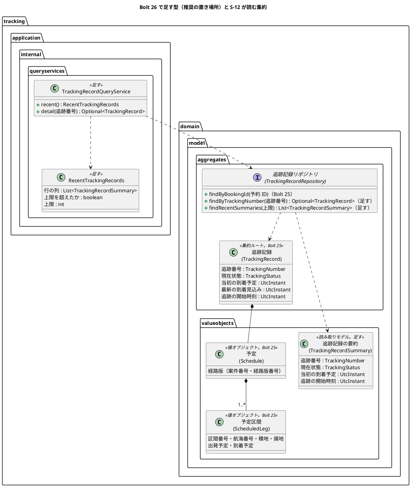
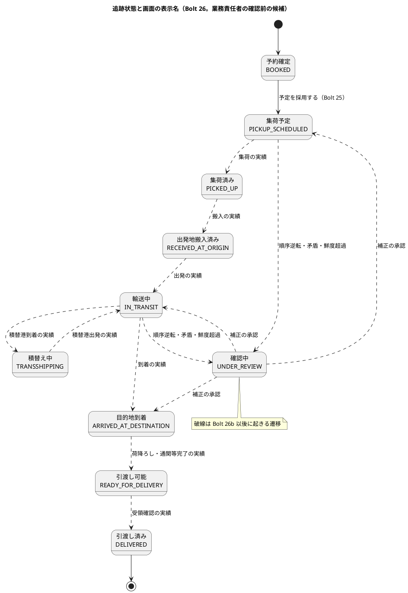
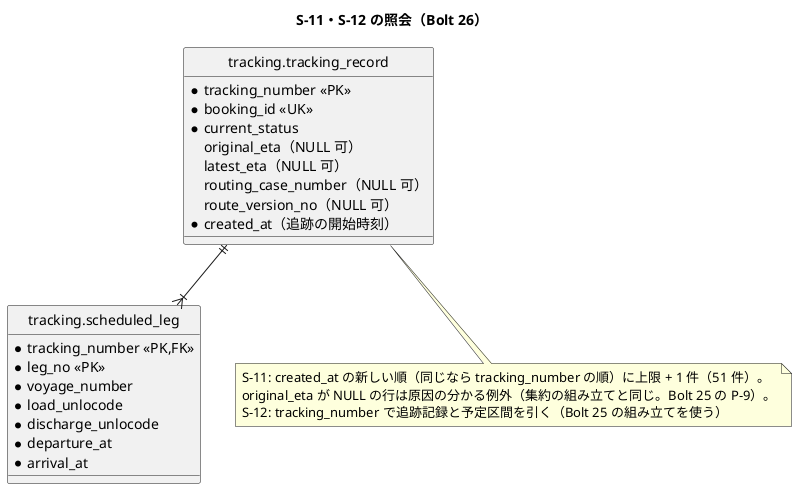
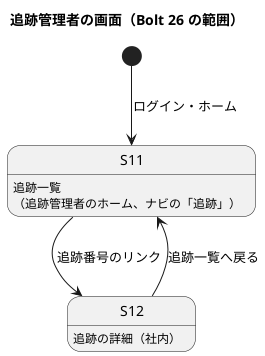

# Bolt 26 計画 - 追跡管理者の入口（S-11 追跡一覧・S-12 追跡の詳細の最小の表示）

## 基本情報

| 項目 | 内容 |
| :--- | :--- |
| Bolt | 第 26 回（release_plan の Bolt 26 を 26 と 26b に分ける案。確認ポイント 1） |
| 予定 | W4（2026-10-26 の週。前倒しで 2026-10-09 から）、作業 2.5〜3 時間（承認ゲートの待ち時間を除く） |
| 対象 | U3 追跡（S-11 追跡一覧・S-12 追跡の詳細の最小の表示、追跡記録リポジトリの照会）、`identity`（認可・ホーム・開発用の利用者）、社内のレイアウト（ナビの「追跡」） |
| GitHub | [#11](https://github.com/k2works/practical-domain-driven-design-in-enterpris-application/issues/11)（US-12）の前提。SP 0（US-12 の SP 3 は AC1・AC2 を作る Bolt 26b で数え、#11 は 26b で閉じる）。受入動画は #11 に添付する |
| 承認ゲートの扱い | 人の指示（`/goal Bolt26`、2026-10-09。計画の初版の報告の後）により、計画を推奨のとおり進め、承認ゲートで止まらずに進める。止まらなかったゲートごとに根拠を書き、確認ポイントの決定とあわせて終了報告の承認の議題に置く（T-36）。計画の人の検証（`verify`）は終了報告の承認のときに行う |
| 承認ゲート | 計画の承認（確認ポイント 1〜15）、認可（ステップ 1）、モジュールの境界（`platform :: web`。ステップ 3）、画面、Red／Green ごと（照会）、開発レビューの判断、終了報告。ゲートの密度は release_plan の W4 の決定（「スキーマと認可をステップごとに止める」）に従う。U4 の行の「認証・認可は Red・Green ごと」より W4 の決定を優先する（W4 の開始準備で決め直したため）。スキーマは変えないので、スキーマのゲートはない（`db/dev-data` の利用者の追加は開発環境だけの初期データで、スキーマを変えない） |
| アプローチ | アウトサイドイン（開発戦略の「Bolt ごとのアプローチの決め方」の「既存の集約に受入条件を足す」に当てはめる。この Bolt は受入条件を足さないが、US-12 の受入条件の前提になる照会で、既存の集約を読むだけで新しい集約・スキーマを作らないため）。認可 → 画面の層の受入シナリオ → 画面 → 照会 → 永続化の順（画面の層のシナリオがログインの直後で落ちないよう、認可とホームを先に作る） |
| 前の Bolt | [Bolt 25b 終了報告](bolt_25b_report.md)、[Bolt 25 終了報告](bolt_25_report.md) |

## Bolt ゴール

追跡管理者が開発用の利用者でログインすると、ホームの S-11 追跡一覧に、追跡を開始した予約の追跡記録が新しい順に出る。各行は追跡番号・現在状態・当初の到着予定・追跡の開始時刻を示し、追跡番号のリンクで S-12 追跡の詳細を開ける。S-12 は現在状態・到着予定（当初と最新の見込み）・予定区間（確定した経路版の区間）を示し、主要実績はまだないことを示す。ほかの役割は S-11・S-12 を開けず（A-04）、ナビにも「追跡」が出ない。追跡管理者はほかの役割の画面を開けず、ナビにも出ない。これを画面の層の受入シナリオ（キー操作だけ、幅 320 CSS px、axe-core 0 件）で確かめる。

### 確かめたい仮説

| # | 仮説 | この Bolt で分かること |
| :--- | :--- | :--- |
| H1 | 追跡一覧は、追跡記録の要約（追跡記録の表だけの 1 本の SELECT）で引け、行ごとの照会（N+1）にならない。S-10（Bolt 25b）と同じ形で、読み取りモデルを足すだけで済む | 照会のサービスの単体テストで、追跡記録が 3 件あってもリポジトリの照会が 1 回であること。マッパーに一覧の select が 1 つだけであること |

## ふりかえりと前の Bolt からの引き継ぎ

| 入力 | 内容 | この Bolt での扱い |
| :--- | :--- | :--- |
| Bolt 25 の既知の課題（Bolt 26） | 追跡管理者のナビ・ホーム・認可・開発データ | この Bolt の目的 |
| Bolt 25 の既知の課題（Bolt 26） | 追跡状態の名前の業務責任者の確認 | 画面に初めて追跡状態の名前を出すので、確認ポイント 6 で諮る |
| Bolt 25 の既知の課題（Bolt 26） | `tracking_record` の NULL 可の列（Bolt 25 の P-9・A-9。経路版・到着予定の 4 列を NOT NULL にするか） | スキーマを変えるので、主要実績の表を足す Bolt 26b のスキーマのゲートで決める（確認ポイント 1）。この Bolt の要約の照会は、集約の組み立てと同じく NULL の行を原因の分かる例外にする（確認ポイント 13） |
| Bolt 25 の P-12 | listener がアプリケーションサービスを持たない | 主要実績の登録のアプリケーションサービスを作る Bolt 26b で判断する |
| Bolt 25b の Try T-77・T-78 | `grep` に `</dev/null`、長い処理に `timeout`。置換のスクリプトは `spotlessApply` の後のファイルを読んでから書く | 全ステップ |
| Bolt 25b の既知の課題 | 配下の画面のナビの `aria-current`（U-1）、幅 320 CSS px の日時の表記（未決） | S-12 も同じ形（ナビの「追跡」に `aria-current="page"`）にし、課題は社内の画面の共通の部品で直す（この Bolt では変えない）。S-11 の日時も社内の日時表示の部品のまま（議題が決まったら合わせる） |
| Bolt 25b の既知の課題 | 読み取りモデルの置き場所（`valueobjects` の外に分けるか、ADR にするか。W11） | 前例どおり `valueobjects` に置く。ドメイン層の読み取りモデルが 1 つ増える。置き場所の見直しは W11 の既知の課題のまま |
| Bolt 25b の既知の課題 | 「一覧の先頭に」はシナリオを逐次に実行し、時刻が実時間で増えることが前提 | S-11 の「先頭に出る」も同じ前提に立つ（並列にすると壊れる）。シナリオに注記する |
| Bolt 25b の Problem | 画面の単体テストの Red を実装の後に確かめた | ステップ 3 で画面の単体テストを実装の前に流して Red を確かめる時点を書く（T-39） |
| Bolt 24 の Try T-71・T-72・T-73 | 行の型に列を足したらマッパーもそろえる。画面の層のシナリオを先に書き、骨組みで落ちることを確かめる。エスケープを含む編集は heredoc の Python に入れない | ステップ 2（`uiTest` を骨組みで流して Red を確かめる）・4。全ステップ |
| Bolt 25 の Try T-75・T-76 | Playwright の `hasText` の正規表現に JavaScript にない構文を使わない。状態の列挙の値ごとに遅れて届くもので例外にならないかを表にする | T-75 はステップ 2 のシナリオで守る。T-76 は T-57 と一緒に扱う（この Bolt は照会だけで、遅れて届くものはない。追跡状態の 10 個の値の表示名を網羅する） |
| Try T-39・T-53・T-57・T-60・T-61・T-69・T-70 | Red は本命のアサーションで、計画からの変更を設計文書に反映したかを各ステップの完了の判定に入れる、状態の列挙の判定の洗い出し、テンプレートで値の有無は `!= null`、メモリのリポジトリは写しを返す、案内の文言は先の画面があるか確かめる、レビューの対応の後も push の前に `uiTest` | T-53: 各ステップの完了の判定に入れる。T-57: `TrackingStatus` の 10 個の値の表示名を画面の単体テストで網羅する。T-60: S-12 の最新の到着見込みの有無の判定。T-69: S-12 の「主要実績はまだありません。」に「実績を登録」の案内を添えない（S-13 は Bolt 26b）。ほかは全ステップ |

## スコープ

### 設計の約束（Try T-1）

- 追跡管理者の開発用の利用者（`tracking-manager@dev.cargo-tracker.example`、A 社（開発）、`dev-password-staff`）を `db/dev-data` に足し、開発用ログインの入力済みの一覧（`cargotracker.dev-login.accounts`）にも足す（確認ポイント 3）
- `/staff/tracking-records/**` は追跡管理者だけが開ける（`SecurityConfiguration`。`/staff/**` の営業担当者の規則より前に置く）。カスタマーサポートの照会は有人案件の Bolt（W8）で足す（確認ポイント 4）
- ホーム（`/`）は追跡管理者を S-11 へ移す（`HomeController` の役割とホームの対応に足す）。社内のナビに「追跡」を足し、追跡管理者にだけ出す
- S-11 は追跡記録の最小の一覧で、絞り込み（確認中・鮮度超過・訂正承認待ち）は作らない。追跡の開始時刻の新しい順（同じ時刻なら追跡番号の順）に最大 50 件を示し、50 件を超えたら「新しい 50 件だけを示しています。」と示す（S-10 と同じ。確認ポイント 5）
- S-12 は現在状態・到着予定・経路版・予定区間だけを示す。主要実績の一覧と「実績を登録」は Bolt 26b、訂正履歴・顧客への表示・有人案件のタブは後の Bolt
- 現在状態は文字で示す。共通部品「状態バッジ」（文字 + アイコン）は、確認中・実績が起きて区別が要る Bolt 26b 以後で使う（確認ポイント 14）
- 追跡記録の要約は追跡記録の表だけから引く（予約・経路設計の表を結ばない。スキーマの所有、ADR-001）
- 日時の表示は社内の日時表示の部品（`platform.web.DateTimeDisplay`）を `tracking.interfaces.web` から使う。`tracking` の `allowedDependencies` に `platform :: web` を足す（確認ポイント 12。予約・経路設計と同じ）
- スキーマは変えない（新しい索引も足さない）

### 入れるもの・入れないもの

| 入れる | 入れない（後の Bolt） |
| :--- | :--- |
| 追跡管理者の開発用の利用者、認可、ホーム、ナビの「追跡」 | カスタマーサポートの S-12 の照会（W8）、業務ホーム（S-01） |
| S-11 の最小の表示（追跡番号・現在状態・当初の到着予定・追跡の開始時刻） | S-11 の絞り込み・確認中・鮮度超過・訂正承認待ち（W7 以後） |
| S-12 の最小の表示（現在状態・当初の到着予定・最新の到着見込み・経路版・予定区間） | 主要実績の一覧と登録（S-13）・重複の扱い（Bolt 26b）、訂正（US-13）、顧客への表示のタブ（US-11）、予約の業務番号の表示（予約の公開 API を引く。必要になった Bolt で）、状態バッジ（Bolt 26b 以後） |
| 追跡記録リポジトリの要約の照会と追跡番号での取得、照会のサービス（`TrackingRecordQueryService`） | `tracking_record` の NULL 可の列の見直し（Bolt 26b のスキーマのゲート） |
| 画面の層の受入シナリオ（デモ項目 `@demo @demo-bolt-26/tracking-records`）と、画面の層のテストの部品の追跡管理者 | — |

## 設計（この Bolt の範囲）

### ドメインモデル

新しい集約・値オブジェクトはない。追跡記録の要約（読み取りモデル）を足す（Bolt 25b の `BookingSummary` と同じ形）。S-12 は Bolt 25 の集約（追跡記録・予定・予定区間）をそのまま画面の値に変える。

`TrackingRecordSummary` は前例（`BookingSummary`・`RoutingCaseSummary` など）と同じく DDD の注釈を付けず、用語集にも足さない。照会のサービスの名前は前例（`BookingQueryService`・`RoutingCaseQueryService`。集約の名前）にそろえて `TrackingRecordQueryService` にする。`detail` は集約をそのまま返す（Bolt 23b の `BookingDetail` のように集約を包む型は作らない。予約サガのような別の状態を足さないため）。

### 状態遷移

状態を変える処理はない（照会だけ）。画面に出す追跡状態の名前は次のとおり（T-57。ドメインモデルの追跡状態の候補の名前。確認ポイント 6）。遷移はドメインモデルの「追跡記録の現在状態」の図と同じで、この Bolt までに起きるのは Bolt 25 の「予約確定 → 集荷予定」だけ（実線）。ほかは Bolt 26b 以後に起きる（破線）。

### データモデル

スキーマは変えない。一覧の照会は追跡記録の表だけの 1 本、詳細は Bolt 25 の追跡記録の組み立て（追跡記録と予定区間）を追跡番号で引く。

### 画面遷移

| 画面 | URL | この Bolt で決めること |
| :--- | :--- | :--- |
| S-11 追跡一覧 | `GET /staff/tracking-records` | 追跡管理者のホーム。見出し「追跡一覧」。表の caption「追跡記録（追跡の開始時刻の新しい順）」、表は横スクロールの囲み（`.table-scroll`、`role="region"`、`aria-labelledby` で caption に結ぶ。S-10 と同じ）。列は追跡番号（S-12 へのリンク）・現在状態・当初の到着予定・追跡の開始時刻（社内の日時表示の部品）。「追跡の開始」は S-10 では状態の列名なので、S-11 は「追跡の開始時刻」とする。追跡記録がなければ「追跡中の貨物はまだありません。」。50 件を超えたら表の上に「新しい 50 件だけを示しています。」 |
| S-12 追跡の詳細（社内） | `GET /staff/tracking-records/{追跡番号}` | 見出し「追跡の詳細」と追跡番号。現在状態、当初の到着予定、最新の到着見込み、経路版（案件番号と経路版番号）。予定区間は区間ごとの順序付きのリスト（「区間 1　航海 V-001　JPTYO → SGSIN　出発予定 …　到着予定 …」。確認ポイント 15）。「主要実績」の見出しの下に「主要実績はまだありません。」。「追跡一覧へ戻る」。存在しない追跡番号と形式の誤った追跡番号は 404（`BookingViews.parseTrackingNumber` と同じ） |
| ホーム | `GET /` | 追跡管理者は S-11（`/staff/tracking-records`）へ移す |
| A-04 権限なし | 403 | 追跡管理者以外の `/staff/tracking-records/**`、追跡管理者のほかの `/staff/**` と `/customer/**` |

## ステップ計画

状態の記号: `[ ]` 未着手、`[-]` 進行中、`[?]` 承認待ち、`[x]` 完了。各ステップの終わりに `check` が緑であることと、計画からの変更を設計文書に反映したこと（T-53）を確かめ、Green と同じ push にまとめて CI を確かめる（T-26、T-65）。Red は実行して本命のアサーションで失敗することを確かめてから実装する（T-39）。

- [x] **1. 認可・ホーム・ナビ・開発用の利用者** 【承認ゲート: 認可】
  - 統合テストを先に書く（`AuthenticationSecurityIntegrationTest`）: 追跡管理者はログインの後に S-11 へ移る、追跡管理者は `/staff/tracking-records` を開ける、荷主・営業担当者・経路設計者は 403、追跡管理者は `/staff/bookings`・`/staff/routing-cases`・`/customer/transport-requests` が 403。ナビの表示: 営業担当者・経路設計者のナビに「追跡」が出ない、追跡管理者のナビに「見積依頼」「予約」「経路設計」が出ない（開発戦略のナビの骨格の確かめ）
  - 壊れる既存のテストを直す: 「画面のまだない役割の利用者は…ホームは権限なし」（`AuthenticationSecurityIntegrationTest`。例が追跡管理者）の例を、ホームのない役割（`DATA_STEWARD`）に替えて残す（Bolt 17 の前例と同じ）。`HomeController` の Javadoc の「画面のまだない役割」の説明も直す
  - `db/dev-data` に追跡管理者の利用者の移行（`V20261009140900__seed_dev_tracking_manager.sql`。経路設計者の前例と同じ形）、`application-dev.properties` の `cargotracker.dev-login.accounts[4]`、`SecurityConfiguration` の `/staff/tracking-records/**`、`HomeController` の対応、`layout/staff.html` のナビの「追跡」（S-11 はステップ 3 まで見出しだけの骨組み）
  - 開発用ログインのテスト（`DevLoginPrefillDevProfileTest`・`H2DevProfileSmokeTest`）に追跡管理者の行を足す（一覧の抜けを拾うため）。`DevDataLocationTest` は一般の検査で、新しい移行もそのまま通る
  - 画面の層のテストの部品に追跡管理者を足す: `BrowserSession`（`/staff/tracking-records` → 追跡管理者）、`UiUsers`（表示名「追跡 管理」）
  - 完了の判定: `check` 緑、T-53
  - 結果（2026-10-09）
    - Red: セキュリティの統合テスト 4 件（追跡管理者のホームと 403、ほかの役割の 403、社内のナビの表示、画面のまだない役割の例をデータ責任者に替えたもの）と、開発用ログインのテスト 3 件を先に書き、6 件が本命のアサーション（ホームの行き先、403 の代わりの 404、開発用の利用者がいない、ナビの「追跡」がない）で落ちることを確かめた。ナビの表示のテストは、経路設計者の「経路設計」でも落ちた。現在の項目では `aria-current` が `href` の後に付くのに、属性の順を決め打ちしていたため（テストの誤り）。属性の順によらない正規表現で探す形に直した
    - Green: 開発用の追跡管理者（`V20261009140900__seed_dev_tracking_manager.sql`、`cargotracker.dev-login.accounts[4]`）、`SecurityConfiguration` の `/staff/tracking-records/**`、`HomeController` の対応、社内のナビの「追跡」、S-11 の骨組み（`TrackingRecordController` と見出しだけの `list.html`。`tracking.interfaces`・`tracking.interfaces.web` の package-info）、画面の層のテストの部品（`BrowserSession`・`UiUsers`）の追跡管理者
    - `check` 緑。設計文書の反映はステップ 5 の一覧のとおり（計画からの変更はない）
    - 承認ゲートの扱い（T-36）: 認可のゲートで止まらずに進めた（AI の判断）。根拠は、範囲が確認ポイント 4 の推奨（追跡管理者だけ、ほかの役割の画面を開けない）のとおりで、経路設計者（Bolt 17）と同じ形であること
- [x] **2. 画面の層の受入シナリオ** 【承認ゲート: 画面】
  - 画面の層の受入シナリオを先に書く（T-72）: `features/ui/register_milestone_ui.feature`（新設。機能のタグは `@ui @US-12 @must`。確認ポイント 8）に 2 本を足す。(a) `@demo @demo-bolt-26/tracking-records`: 営業担当者が本予約を確定し、予約の詳細を更新して追跡の開始が完了するのを待つ（`BookingUiSteps` の既存のステップ。追跡の開始は DE-07 の非同期の購読で起きるため）。追跡管理者がログインすると S-11 が開き、確定した予約の追跡番号が一覧の先頭に出て、ナビの「追跡」が現在の項目として示される（「先頭」はシナリオを逐次に実行する前提。Bolt 25b と同じ）。追跡番号のリンクで S-12 を開くと、現在状態「集荷予定」と予定区間が出て、「追跡一覧へ戻る」で S-11 に戻る。(b) 幅 320 CSS px で同じ流れが横スクロールなしで読める（狭い幅ではメニューのボタンでナビを開く）。キー操作だけ、axe-core 0 件。正規表現に JavaScript にない構文を使わない（T-75）
  - 航海を消すフック（`RoutingUiSteps` の `(@US-06 or @US-07) and @ui`）の条件に `@US-12` を足す（背景で航海を入れるため。Bolt 17 の D-62）
  - 骨組み（S-11 の見出しだけ）で `uiTest` のこのシナリオを流し、本命のアサーション（一覧の行）で落ちることを確かめる（T-72 の Red を確かめる時点。認可とホームはステップ 1 で作ってあるので、ログインの直後では落ちない）
  - 完了の判定: シナリオが本命のアサーションで落ちる、T-53
  - 結果（2026-10-09）
    - `register_milestone_ui.feature` に 2 本（`@demo-bolt-26/tracking-records`、幅 320 CSS px）を書いた。確定と追跡の開始の待ちは背景に入れた（2 本とも同じ前提のため）。追跡番号は、追跡の開始の完了を待つステップで `UiScenarioState` に控え、追跡管理者のステップ（`TrackingUiSteps`。新設）が使う。航海を消すフックの条件に `@US-12` を足した
    - Red: `@US-12` に絞って `uiTest` を流し（環境変数 `CUCUMBER_FILTER_TAGS`）、2 本が本命のアサーション（追跡一覧の表の先頭の行の追跡番号のリンクがない）で落ちることを確かめた（T-72）。ログインとホームの移動は通った
    - 承認ゲートの扱い（T-36）: 画面のゲートで止まらずに進めた（AI の判断）。根拠は、画面の構成と文言が計画の S-11・S-12 の表のとおりであること
- [x] **3. 画面（S-11・S-12）と照会（単体テスト）** 【承認ゲート: モジュールの境界、Red／Green（照会）】
  - 画面の単体テストを先に書き、実装の前に流して Red を確かめる（Bolt 25b の Problem）: S-11 の列と並び・追跡記録がない・50 件を超えた、追跡状態の 10 個の表示名（T-57・T-76）、S-12 の現在状態・到着予定・経路版・予定区間のリスト・「主要実績はまだありません。」・戻るリンク、存在しない追跡番号と形式の誤った追跡番号は 404
  - 照会のサービスの単体テストを先に書く: 要約を上限 51 件で 1 回引き（仮説 H1）、50 件を超えるかと上限を返す、ちょうど 50 件は超えていない、0 件は空（Bolt 25b のレビュー P-1・P-5 を最初から入れる）、詳細は追跡番号で引く。メモリのリポジトリは新しい順で写しを返す（T-61）
  - `tracking` の `package-info` の `allowedDependencies` に `platform :: web` を足し、Javadoc の依存先の説明を直す（確認ポイント 12。モジュールの境界のゲート）
  - `TrackingRecordSummary`、`TrackingRecordRepository.findRecentSummaries`・`findByTrackingNumber`、`TrackingRecordQueryService`、`RecentTrackingRecords`、`TrackingRecordController`（`tracking.interfaces.web`）、`TrackingRecordViews`（追跡状態の表示名、日時の表示）、`tracking/staff/tracking-records/list.html`・`show.html`、新しいパッケージの `package-info.java`（`tracking.interfaces`・`tracking.interfaces.web`・`tracking.application.internal.queryservices`。開発ガイドの層の名前と役割の言葉）、`TrackingConfiguration` の組み立て、テストのメモリのリポジトリ
  - 完了の判定: `check` 緑（ModularityTest・ArchUnit を含む）、T-53
  - 結果（2026-10-09）
    - Red: 照会のサービスの単体テスト 6 件（新しい順、1 回の照会（仮説 H1）、上限 50 件と超えたこと、ちょうど 50 件、0 件、追跡番号での詳細）と画面の単体テスト 17 件（S-11 の列と並び・ない・上限を超えた、追跡状態の 10 個の表示名、S-12 の表示、ない追跡番号と形式の誤りの 404）を、型の骨組み（照会は空を返す）で実装の前に流し、19 件が本命のアサーションで落ちることを確かめた（Bolt 25b の Problem を直した）。0 件と 404 の 2 件は骨組みでも通る見張りのテスト
    - Green: `TrackingRecordSummary`、リポジトリの 2 つの照会の口、`TrackingRecordQueryService`、`RecentTrackingRecords`（行は要約をそのまま使う）、`TrackingRecordController`、`TrackingRecordViews`、`list.html`・`show.html`、`tracking.application.internal.queryservices` の package-info、組み立て、メモリのリポジトリの照会。`tracking` の `allowedDependencies` に `platform :: web` を足した
    - 追跡状態の表示名の `switch` が循環的複雑度の上限（10）を超えたので、`EnumMap` の表にした（10 個の値の網羅は画面の単体テストで守る）
    - 計画からの変更: S-12 の戻るリンクの名前を「追跡一覧へ戻る」から「追跡一覧」にした（Bolt 25b のレビュー U-2 で S-24 を行き先の名前にしたのにそろえる。S-12 は Bolt 26b 以後に入口が増える）。経路版の表記は S-24 と同じ「RC-2026-0001 版 1」、S-12 の見出しは「追跡の詳細 追跡番号」（S-24 と同じ形）
    - `check` はこのステップの範囲で緑（PostgreSQL のセキュリティの統合テスト 2 件は、ステップ 4 のマッパーの骨組みに当たって落ちたので、ステップ 4 と一緒に確かめた）
    - 承認ゲートの扱い（T-36）: モジュールの境界と Red／Green（照会）のゲートで止まらずに進めた（AI の判断）。根拠は、`platform :: web` の依存が確認ポイント 12 の推奨（予約・経路設計と同じ形で、`interfaces.web` からだけ使う）のとおりで、ModularityTest・ArchUnit が通ったこと
- [x] **4. 永続化（PostgreSQL の統合テスト）** 【承認ゲート: Red／Green（照会）】
  - 統合テストを先に書く: 追跡の開始時刻の新しい順（同じ時刻は追跡番号の順）、上限、`original_eta` が NULL の行は原因の分かる例外、追跡番号で追跡記録と予定区間を引く、ない追跡番号は空
  - マッパーの `findRecentSummaries`・`findByTrackingNumber`（Bolt 25 の組み立ての select を使えるなら使う。T-71 のとおり行の型と結果の対応を同じステップでそろえる。AT-04 の自スキーマの検査を通す）
  - 完了の判定: `check`・`uiTest` 緑（ステップ 2 のシナリオが通る）、T-53
  - 結果（2026-10-09）
    - 統合テスト 3 件（追跡番号で予定区間とあわせて読む・ない追跡番号は空、追跡の開始時刻の新しい順・同じ時刻は追跡番号の順・上限、当初の到着予定のない行は原因の分かる例外）を先に書いた。Red は骨組みの未実装の例外で落ち、本命のアサーションではなかった（T-39 の記録）
    - マッパーの `findTrackingRecordByTrackingNumber`・`findRecentSummaries`（追跡記録の表だけの 1 本）と、行の型 `TrackingRecordSummaryRow`・結果の対応を同じステップでそろえた（T-71）。AT-04 の検査は通った
    - `check` 緑、`uiTest` 69 本が緑（ステップ 2 の新しい 2 本を含む）
- [ ] **5. 開発レビューと終了報告** 【承認ゲート: 開発レビューの判断、終了報告】
  - `developing-review`（プログラマー（テスター・アーキテクトの観点を含む）とインタラクションデザイナー（ユーザー代表の観点を含む）の 2 つの観点。Bolt 25b と同じ）、SonarQube（`sonar-local:check`）、受入動画（`./gradlew demoVideo`。過去の Bolt の動画は元に戻す）、`bolt_26_report.md`
  - 設計文書（T-53）: ui_design.md（URL の表に S-11・S-12 の行を新設、ホーム・A-01・A-04 の行と A-01 の節の開発用の利用者の本文に追跡管理者、社内のナビの項目に「追跡: 追跡管理者（Bolt 26）」とナビの実装の段落、画面一覧の S-11・S-12 の Bolt 26 の範囲、社内業務 Web（追跡）の画面遷移図に S-12 → S-11 の戻り、S-12 の画面イメージの下に「Bolt 26 の最小の表示は予約の業務番号とタブを出さない」の注、共通部品「画面幅」に予定区間のリストの扱い）、domain_model.md（リポジトリの表の追跡の行に要約の照会だけを足す（追跡番号での取得は既にある）、追跡状態の表示名の確認の結果）、data_model.md（`tracking_record` の行に `created_at` を追跡の開始時刻として S-11 の並びに使う注、索引の表に追跡の開始時刻の索引は足さない注）、test_strategy.md（US-12 の `@ui` を ○）、release_plan.md（W4 の Living Documentation の `tracking` の依存先に `platform :: web`）
  - 終了報告の承認の後に、受入動画の添付先（`ops/scripts/issue_demo.js` の `BOLT_ISSUES` と手順書の表）に `bolt-26 → #11` を足す
  - 開発レビューの対応の後も push の前に `uiTest` を流す（T-70）

### 時間の配分と打ち切り

| # | 目安 | 打ち切り |
| :--- | :--- | :--- |
| 1 | 40 分 | 削らない（認可の 403・ホームの移動・ナビの表示） |
| 2 | 30 分 | 削らない（デモ項目） |
| 3 | 50 分 | 時間を超えたら、S-11 の「50 件を超えた」の文言と経路版の表示を後に回す |
| 4 | 20 分 | — |
| 5 | 40 分 | 幅 320 CSS px の表記の作り込みは、レビューの指摘でも既知の課題に回す |

## 確認ポイント（計画の承認の場でまとめて確認する。Try T-6）

| # | 確認すること | ステップ | 推奨 |
| :--- | :--- | :--- | :--- |
| 1 | **Bolt 26 の分け方**（release_plan の「開始準備で分け方を決める」） | 全体 | **2 つに分ける**。Bolt 26（この計画、SP 0、2.5〜3 時間）: 追跡管理者の入口（開発用の利用者・認可・ホーム・ナビ）と S-11・S-12 の最小の表示。Bolt 26b（SP 3）: US-12 AC1 登録・AC2 重複。主要実績の表（`tracking.milestone`）と `tracking_record` の NULL 可の列の見直し（スキーマのゲート）、出典（`Source`、共有カーネル）、主要実績（`Milestone`）と現在状態の導出、S-13 の登録と S-12 の主要実績の一覧、重複のとき既存の記録を示す、P-12 の判断。26b の計画は Bolt 26 の後に `opening-iteration` で作る。26b も 4 時間を超えるおそれがあるので（範囲の重なりからの見積り）、26b の開始準備で超えると見えたら、AC2 の重複（S-13 で既存の記録を示す画面）と NULL 可の列の見直しを Bolt 26c に回す。理由: 1 つにすると、新しい表・共有カーネルの型・集約の振る舞い・画面 3 つ・認可が重なり、半日（4 時間）を超える。入口は SP を持たないが、Release 0.1 のデモの縦の流れ（追跡管理者が実績を登録する）の前提になる。代わりの案は、(b) 分けずに 1 つの Bolt（5〜7 時間）、(c) 入口を Bolt 26b に寄せ、Bolt 26 は S-11 を作らずに S-12 だけ（追跡番号の入力で開く） |
| 2 | アプローチ | 全体 | アウトサイドイン（既存の集約の照会を足す。新しい集約・スキーマは作らない）。認可を先に作る |
| 3 | 開発用の追跡管理者 | 1 | `tracking-manager@dev.cargo-tracker.example`、表示名「追跡 管理（開発）」、A 社（開発）、password は社内の開発用の固定の値（`dev-password-staff`）。経路設計者（Bolt 17）と同じ形 |
| 4 | **認可の範囲** | 1 | `/staff/tracking-records/**` は追跡管理者だけ。UI 設計の S-12 はカスタマーサポートの照会も挙げるが、カスタマーサポートの画面（有人案件）を作る W8 で足す。追跡管理者は営業・経路設計者の画面を開けない（役割の画面を分ける。Bolt 17 と同じ） |
| 5 | S-11 の並びと上限 | 3・4 | 追跡の開始時刻（`created_at`）の新しい順、同じなら追跡番号の順、最大 50 件。S-10 と同じ形。UI 設計の S-11 の目的（確認中・鮮度超過・訂正承認待ちを一覧する）は、その状態が起きる W7 以後に絞り込みとして足す |
| 6 | **追跡状態の画面の表示名**（Bolt 25 の既知の課題「業務責任者の確認」） | 3 | ドメインモデルの候補の名前のまま出す（予約確定・集荷予定・集荷済み・出発地搬入済み・輸送中・積替え中・目的地到着・引渡し可能・引渡し済み・確認中）。荷主に見せる名前（US-09、Bolt 27）も同じにする。業務責任者として確かめてほしい。違う名前にするなら、ここで決めた名前を画面とドメインモデルの両方に書く |
| 7 | S-12 の範囲 | 3 | 現在状態・当初の到着予定・最新の到着見込み・経路版・予定区間と「主要実績はまだありません。」。UI 設計のタブ（実績と予定・訂正履歴・顧客への表示・有人案件）は、中身を作る Bolt で足す（空のタブを出さない）。予約の業務番号（UI 設計の画面イメージの「予約 BK-0311」）は追跡記録が持たないので出さない（ui_design.md に注を書く） |
| 8 | 画面の層のシナリオの置き場所とタグ | 2 | `features/ui/register_milestone_ui.feature` を新設する（機能のタグ `@ui @US-12 @must`。荷主の照会（US-09、Bolt 27）と分けるため、US-12 の名前にする）。この Bolt のシナリオは受入条件のタグ（`@US-12-AC1`）を付けない（受入条件をまだ満たさないため。受入条件の数の照合の仕組みはまだないが、作ったときに数えられないようにする）。Bolt 26b で AC1・AC2 のシナリオを同じファイルに足す |
| 9 | 照会の置き場所と名前 | 3 | `tracking.application.internal.queryservices.TrackingRecordQueryService`、画面は `tracking.interfaces.web.TrackingRecordController`・`TrackingRecordViews`（開発ガイドの置き場所。前例（`BookingQueryService`・`RoutingCaseQueryService`）と同じく集約の名前）。追跡記録の要約は `tracking.domain.model.valueobjects.TrackingRecordSummary`（Bolt 25b の `BookingSummary` と同じ） |
| 10 | 索引 | 4 | 足さない。追跡記録は R0.1 では数十件。一覧の本体（絞り込み）を作るときに決める |
| 11 | 承認ゲート | 全体 | 上の「基本情報」のとおり各ゲートで止める（W4 の決定。認可・モジュールの境界はステップごと）。release_plan の W4 の Bolt 26 の行を 26・26b の 2 行に直し、26b の承認ゲートは「スキーマ、Red・Green ごと（業務のルール）」にする |
| 12 | **`tracking` から `platform :: web` への依存**（開始準備の検証の指摘） | 3 | `allowedDependencies` に `platform :: web` を足し、`tracking.interfaces.web` からだけ日時表示の部品（`DateTimeDisplay`）を使う。予約・経路設計と同じ形で、Bolt 22 の規則（`platform` の Web の部品は各コンテキストの `interfaces.web` から使う）の範囲。代わりの案は、追跡の画面で日時を独自に整形する（社内の日時の表記が画面ごとに分かれる） |
| 13 | 要約の NULL の行 | 4 | `original_eta` が NULL の行は、集約の組み立てと同じく原因の分かる例外にする（Bolt 25 の P-9。追跡の開始では必ず値が入る）。列を NOT NULL にするかは Bolt 26b のスキーマのゲートで決める |
| 14 | 状態バッジ | 3 | 使わない（現在状態を文字で示す）。共通部品「状態バッジ」は予定・実績・確認中を区別するためのもので、区別が要るのは実績・確認中が起きる Bolt 26b 以後。そこで使う |
| 15 | **S-12 の予定区間の形**（開始準備の検証の指摘。UI 設計の共通部品「画面幅」） | 3 | 区間ごとの順序付きのリストにする（どの幅でも同じ形）。UI 設計は「時系列の表は狭い画面で時系列のリストに切り替える」としており、予定区間は時系列の並びなので、表を作って切り替えるより、最初からリストにするほうが単純で、幅 320 CSS px の決まりを例外なしで満たす。Bolt 26b で主要実績を足すときに、予定と実績の並び（UI 設計の S-12「区分」の列）の形を決め直す。代わりの案は、(b) 表を横スクロールの囲みに入れる（一覧の表の例外を時系列の表にも広げることになり、UI 設計の決まりと食い違う）、(c) 表を作り、600px 未満でリストに切り替える |

## 完了条件

- [ ] 画面の層の受入シナリオ（`@demo-bolt-26/tracking-records`）が通り、受入動画を撮った
- [ ] セキュリティの統合テストで、追跡管理者のホームと、役割ごとの 403 とナビの表示を確かめた
- [ ] 照会のサービスの単体テストで、一覧が 1 本の照会で引けることを確かめ（仮説 H1）、PostgreSQL の統合テストで並びと上限を確かめた
- [ ] `check`・`documentationTest`・`uiTest` が緑。push して CI とデモ環境の配備を確かめた
- [ ] SonarQube の Quality Gate が PASS
- [ ] 設計文書（ui_design.md、domain_model.md、data_model.md、test_strategy.md、release_plan.md。ステップ 5 の一覧）に決定を書いた（T-53）
- [ ] 開発レビューと終了報告。承認の後に受入動画の添付先を足した

### デモ項目

営業担当者が本予約を確定した後に、追跡管理者がログインすると追跡一覧の先頭に追跡番号が出て、追跡の詳細で現在状態「集荷予定」と予定区間を確かめられる（`@demo @demo-bolt-26/tracking-records`）。

## 更新履歴

| 日付 | 更新内容 | 更新者 |
| :--- | :--- | :--- |
| 2026-10-09 | 人の指示（`/goal Bolt26`）で推奨のとおり進める。ステップ 1 を終えた | anthropic/claude-opus-5-5、指示 human:kakimomokuri |
| 2026-10-09 | 開始準備の整合性検証（計画と設計 19 件、横断 20 件）の指摘を反映した（壊れる既存のテスト、認可を先にするステップの順、追跡の開始の待ち、`platform :: web` の依存、予定区間の形、ナビの表示のテスト、テストの部品、列名「追跡の開始時刻」、NULL の行、形式の誤りの 404、名前を前例にそろえる、状態遷移の図、設計文書の範囲、26b の打ち切りの順、Try の取りこぼし） | anthropic/claude-opus-5-5 |
| 2026-10-09 | 初版作成（承認待ち） | anthropic/claude-opus-5-5 |

## 関連ドキュメント

- [リリース計画](release_plan.md)（W4）
- [Bolt 25 終了報告](bolt_25_report.md)、[Bolt 25b 終了報告](bolt_25b_report.md)、[Bolt 17 計画](bolt_17_plan.md)（経路設計者の入口の前例）
- [UI 設計](../../design/cargo-tracker/ui_design.md)（S-11、S-12、ホーム、A-04、ナビゲーション、共通部品）
- [データモデル](../../design/cargo-tracker/data_model.md)（`tracking`）
- [ドメインモデル](../../design/cargo-tracker/domain_model.md)（追跡、リポジトリ）
- [ユーザーストーリー](../../requirements/cargo-tracker/user_story.md)（US-12）
- [テスト戦略](../../design/cargo-tracker/test_strategy.md)（US-12）
- [開発戦略](development_strategy.md)
