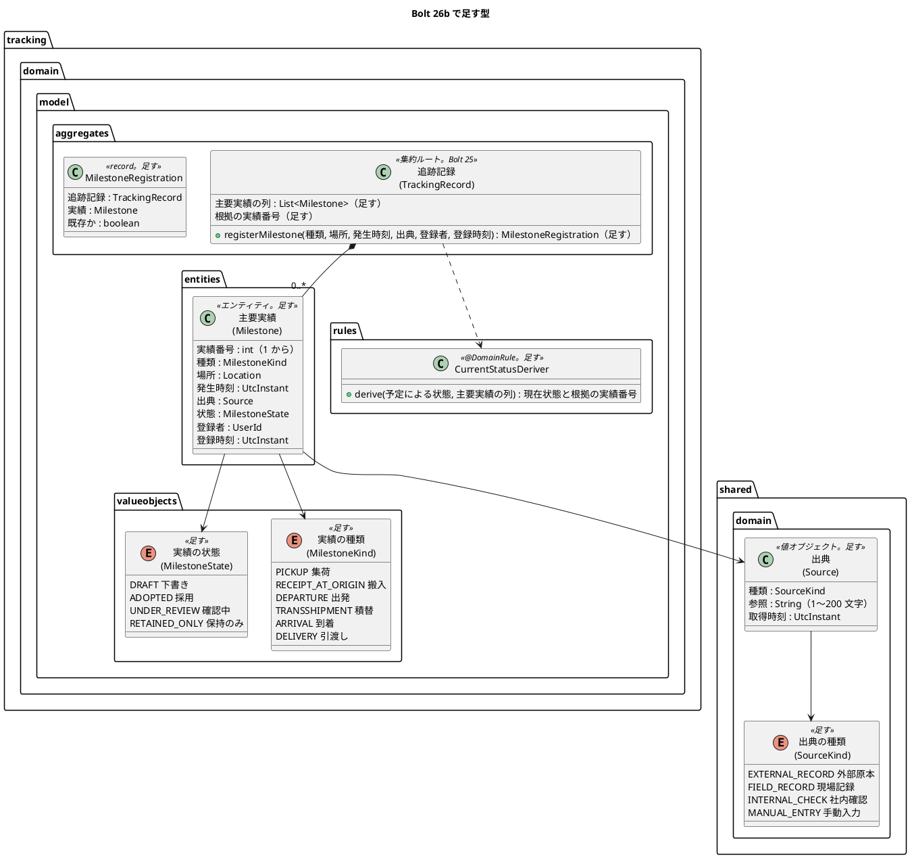
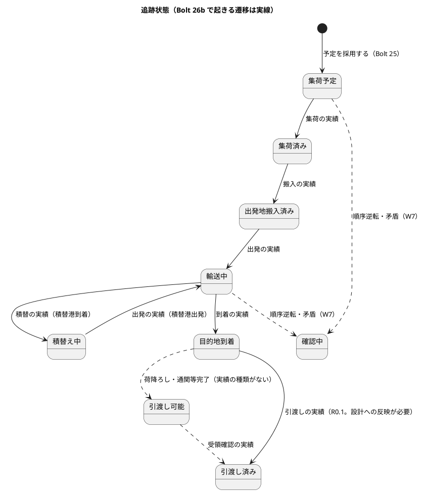
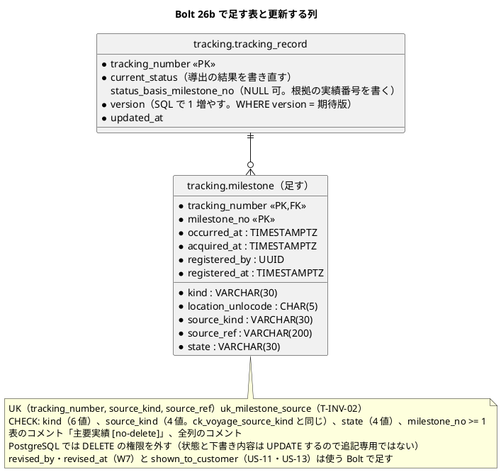

# Bolt 26b 計画 - 主要実績の登録の業務のルールと永続化（US-12 AC1・AC2）

## 基本情報

| 項目 | 内容 |
| :--- | :--- |
| Bolt | 第 26b 回（release_plan の Bolt 26b を 26b（業務のルールと永続化）と 26c（画面）に分ける案。確認ポイント 1。Bolt 23・23b と同じ分け方） |
| 予定 | W4（2026-10-26 の週。前倒しで 2026-10-10 から）、作業 2.5〜3 時間（承認ゲートの待ち時間を除く。時間の配分の表の合計 170 分） |
| 対象 | U3 追跡（主要実績の登録、現在状態の導出、重複の出典の扱い、`tracking.milestone` の表と永続化）、共有カーネル（出典） |
| GitHub | [#11](https://github.com/k2works/practical-domain-driven-design-in-enterpris-application/issues/11)（US-12 R0.1: AC1・AC2）。US-12 の SP 3 は、画面の層のシナリオがそろって #11 を閉じる Bolt 26c で数える（確認ポイント 1）。この Bolt は SP 0 |
| 承認ゲートの扱い | 人の指示（`/goal Bolt26b`、2026-10-10。計画の報告の後）により、計画を推奨のとおり進め、承認ゲートで止まらずに進める。止まらなかったゲートごとに根拠を書き、確認ポイントの決定とあわせて終了報告の承認の議題に置く（T-36）。計画の人の検証（`verify`）は終了報告の承認のときに行う。ただし Try T-80 に従い、CLAUDE.md の「確認必須」に当たるゲート（この Bolt ではスキーマ）は、計画の承認の場で人の判断を受ける（確認ポイント 3・4）。ここで判断を受けていない確認必須のゲートは、`/goal` の指示があっても止まる |
| 承認ゲート | 計画の承認（確認ポイント 1〜15）、業務のルールの層のシナリオ（ステップ 1）、Red／Green ごと（業務のルール。ステップ 2・3）、スキーマ（ステップ 4）、開発レビューの判断、終了報告。release_plan の W4 の決定（「スキーマと認可をステップごとに止める」）と、Bolt 26b の行の「スキーマ、Red・Green ごと（業務のルール）」に従う。認可と画面は変えないので、そのゲートはない |
| アプローチ | アウトサイドイン（開発戦略の「Bolt ごとのアプローチの決め方」の「既存の集約に受入条件を足す」）。既存の `tracking` スキーマに表を 1 つ足すのは「新しい集約・スキーマを作る」に当たらない（Bolt 24 の計画の解釈と同じ）。業務のルールの層の受入シナリオ → アプリケーション → ドメイン → 永続化（スキーマはこのステップ。Bolt 24 と同じ）の順 |
| 前の Bolt | [Bolt 26 終了報告](bolt_26_report.md) |

## Bolt ゴール

追跡管理者が追跡記録に、出典（種類・参照・取得時刻）と発生時刻を伴う主要実績を登録すると、実績が採用済みとして保存され、現在状態が採用済みの実績から導出し直される（集荷なら「集荷済み」）（AC1）。同じ出典識別子（出典の種類と参照）の実績を再び登録すると、新しい実績を作らず、既存の実績を返す（AC2 の業務のルール。既存の記録を画面に示すのは Bolt 26c）。これを業務のルールの層の受入シナリオ（`@US-12-AC1`・`@US-12-AC2`）、ドメインの単体テスト、PostgreSQL の統合テスト（一意制約・DELETE の権限なし・楽観ロック）で確かめる。

### 確かめたい仮説

| # | 仮説 | この Bolt で分かること |
| :--- | :--- | :--- |
| H1 | 集約を不変のまま、実績の登録が新しい追跡記録と登録した実績を返す形で書ける。保存は `update(追跡記録)` の 1 本（新しい実績の INSERT と、版を SQL で増やす追跡記録の UPDATE）で済み、メモリのリポジトリの写し（Bolt 26 の P-6）は要らない | ドメインの単体テストで、登録の前の追跡記録が変わらないこと。PostgreSQL の統合テストで、古い版での保存が競合になること |
| H2 | 現在状態の導出を、ドメインの規則のクラス 1 つ（採用済みの実績のうち発生時刻が最も新しいものの種類 → 追跡状態）に閉じ込められる。W7 の確認中（AC3）・保持のみ（AC5）は、この規則に入力を足すだけで済む | 規則の単体テストの表（種類ごとの導出、実績がないときは予定のまま）と、W7 の計画での追加の形 |

## ふりかえりと前の Bolt からの引き継ぎ

| 入力 | 内容 | この Bolt での扱い |
| :--- | :--- | :--- |
| Bolt 26 の確認ポイント 1 | 26b が 4 時間を超えると見えたら、AC2 の画面と NULL 可の列の見直しを 26c に回す | 見積りは、業務のルールの層のシナリオを入れると 5 時間を超える。release_plan の字句（AC2 の画面だけを回す）に従っても 4 時間半になる。そのため、業務のルール（AC1・AC2）と画面（S-13・S-12、AC2 の画面を含む）で分ける（確認ポイント 1） |
| Bolt 26 の既知の課題（Bolt 26b） | `tracking_record` の NULL 可の列（経路版・到着予定の 4 列） | Bolt 26c に回す（確認ポイント 1）。この Bolt の UPDATE はその 4 列を書かない |
| Bolt 26 の既知の課題（Bolt 26b） | 予定と実績の並べ方（Bolt 26 の確認ポイント 15 の決め直し）、U-3 一覧の到着の列、U-4「→」の読み上げ、U-6 戻るリンクの位置 | 画面の課題なので Bolt 26c に回す。U-3 は最新の到着見込みを動かす W7（この Bolt は `latest_eta` を動かさない） |
| Bolt 26 の既知の課題（社内の画面の共通の部品・UI 設計との食い違い） | 配下の画面のナビの `aria-current`、幅 320 CSS px の日時の表記、場所の表記（UN/LOCODE だけ） | 画面を作らないので扱わない。Bolt 26c の計画の入力にする |
| Bolt 26 の P-6 | メモリのリポジトリの写し（26b で集約が可変になる） | 集約を不変のまま保つ（確認ポイント 6、仮説 H1）。写しは要らなくなり、T-61 の前提のまま |
| Bolt 25 の P-12 | listener がアプリケーションサービスを持たない | 主要実績の登録のコマンドサービス（`TrackingRecordCommandService`）を作る。既存の DE-07 の listener は変えない（確認ポイント 8） |
| Bolt 26 の Try T-79 | 画面の層のテストの結果の数え方 | この Bolt は画面の層のテストを足さない。ステップ 5 で `uiTest` の全体を流すときに数え方を守る |
| Bolt 26 の Try T-80 | 確認必須のゲートは計画の承認の場で人の判断を受ける | 基本情報の「承認ゲートの扱い」。スキーマの判断を確認ポイント 3・4 に置く |
| Try T-29 | 列の上限の境界をテストする | 出典の参照の 200 文字ちょうどと 201 文字（ステップ 3） |
| Try T-37・T-39 | 型の骨組みで Red を確かめる、Red は本命のアサーション | ステップ 1〜4 |
| Try T-53・T-57・T-61・T-70・T-71・T-73・T-77・T-78 | 設計文書への反映、状態の列挙の判定の洗い出し、写し、push の前の `uiTest`、行の型とマッパー、エスケープを含む編集、`/dev/null`・`timeout`、`spotlessApply` の後に読む | T-57: 実績の種類（6 個）ごとの導出を網羅する。ほかは全ステップ |
| Try T-50・T-59 | 共有 DB の画面の層のテストのデータ | この Bolt は画面の層のテストを足さない。Bolt 26c で扱う |

## スコープ

### 設計の約束（Try T-1）

- 出典（`Source`）と出典の種類（`SourceKind`）を共有カーネル（`shared.domain`）に足す。出典の種類の値は、既存の `routing.voyage` の CHECK（`ck_voyage_source_kind`）と同じ 4 値（`EXTERNAL_RECORD` 外部原本、`FIELD_RECORD` 現場記録、`INTERNAL_CHECK` 社内確認、`MANUAL_ENTRY` 手動入力）。出典は種類・参照（1〜200 文字）・取得時刻を必須とする（ドメインモデルの共有カーネルの不変条件）。航海の出典の列を共有カーネルの型に移すことは、この Bolt ではしない
- 主要実績（`Milestone`）は追跡記録の集約の中のエンティティで、`tracking.domain.model.entities` に置く（第 3 章のドメイン層。前例 `BookingVersion`・`RouteVersion`）。実績番号は追跡記録の中で 1 から振る
- 追跡管理者が登録した実績は採用済み（`ADOPTED`）で保存する。下書き（`DRAFT`）は外部原本の取込（DE-13、W7）で使う（確認ポイント 5）
- 現在状態は採用済みの実績から導出する（T-INV-08）。導出は `tracking.domain.model.rules` の規則のクラス（`CurrentStatusDeriver`。ドメインモデルの名前、`@DomainRule`）に置き、集約が使う（確認ポイント 7）
- 同じ出典識別子（`source_kind`・`source_ref`）の実績があれば、集約は新しい実績を作らず既存の実績を返す（T-INV-02）。表の一意制約 `uk_milestone_source` で守る（同時の登録は一意制約の違反になり、競合として扱う）
- 発生時刻が登録時刻より後（未来）の実績は拒否する（ドメインの規則として足す。設計への反映が必要。確認ポイント 7）
- 集約は不変のまま。版はドメインで増やさず、更新の SQL（`version = version + 1 WHERE version = #{expectedVersion}`）で増やす（前例 `QuotationMapper.xml`）。競合は `ConcurrentTrackingRecordUpdateException`
- コマンドサービスは業務の拒否を sealed の結果（`MilestoneRegistrationOutcome`）で返す（architecture_backend.md の「業務の拒否は戻り値の値で返す」。前例 `BookingConfirmationOutcome`）
- ドメインイベントは発行しない。DE-09 は ADR-014 の形に直す W7 の Bolt で、DE-18 は確認中が起きる W7 で足す（確認ポイント 10）。新しいイベントがないので、`DomainEventSerializationContractTest` は変えない。`tracking` の `allowedDependencies` も変えない（`shared` は既存）
- `latest_eta`・`last_acquired_at` は動かさない（到着見込みと鮮度は W7。確認ポイント 3）

### 入れるもの・入れないもの

| 入れる | 入れない（後の Bolt） |
| :--- | :--- |
| 業務のルールの層の受入シナリオ（`features/tracking/register_milestone.feature`、`@US-12-AC1`・`@US-12-AC2`） | 画面の層のシナリオ（`@ui`）と受入動画（Bolt 26c） |
| 出典・出典の種類（共有カーネル）、主要実績、実績の種類、実績の状態、現在状態の導出の規則、未来の発生時刻の拒否、同じ出典の既存の実績を返す規則 | 下書きの修正・採用（W7）、訂正（US-13）、時系列の矛盾の確認中（AC3）、取消済みの拒否（AC4）、完了後の保持のみ（AC5）（W7）、到着見込み・鮮度の更新（W7） |
| `TrackingRecordCommandService.registerMilestone`、`RegisterMilestoneCommand`、`MilestoneRegistrationOutcome` | DE-09・DE-18 の発行（W7）、監査記録（US-17） |
| `tracking.milestone` の表（UK、CHECK、DELETE の権限なし）、`TrackingRecordRepository.update`、マッパー | `tracking_record` の NULL 可の列の見直し、S-13 の登録・S-12 の主要実績の一覧・AC2 の既存の記録の表示（Bolt 26c）、`correction` の表（US-13） |

## 設計（この Bolt の範囲）

### ドメインモデル

- `Milestone` は `@Entity`、`Source` は `@ValueObject` を付ける。Javadoc は「主要実績」「出典」で始める（用語集の整合テストは注釈の付いた型を見る）
- enum（`SourceKind`・`MilestoneKind`・`MilestoneState`）は、`TrackingStatus` の前例どおり注釈を付けず、用語集には行を足す（確認ポイント 14）
- アプリケーション層: `tracking.application.internal.commandservices.TrackingRecordCommandService`（`@Service`、`registerMilestone`）、`tracking.application.internal.commands.RegisterMilestoneCommand`（`@Command`）、`MilestoneRegistrationOutcome`（sealed: `Registered`（実績番号・現在状態）、`AlreadyRegistered`（既存の実績番号。AC2）、`NotFound`、`Conflict`）

### 状態遷移

この Bolt で起きる遷移は実線、W7 以後は破線。R0.1 の決定は次の 2 つで、どちらもドメインモデルの状態遷移の図への反映が必要（確認ポイント 7）。

- 目的地到着から、引渡しの実績で引渡し済みへ直接進める（引渡し可能は作らない）
- 積替港での到着は「積替」の実績、積替港からの出発は「出発」の実績として登録する

### データモデル

- マイグレーションは `db/migration/common/V20261010HHMMSS__create_tracking_milestone.sql`（方言によらない DDL）
- `afterMigrate__grant_app_user.sql` に、表のコメントが `[no-delete]` の表から DELETE だけを外す規則を足す（`[append-only]` と同じく名指ししない。確認ポイント 4）。`AppendOnlyGrantIntegrationTest` に設計の一覧 `NO_DELETE_TABLES`（`tracking.milestone`）を足し、印・権限と一致することを確かめる
- 更新は `update(TrackingRecord)` の 1 本。新しい実績だけを INSERT し、`tracking_record` の `current_status`・`status_basis_milestone_no`・`version`・`updated_at` を UPDATE する。0 行なら `ConcurrentTrackingRecordUpdateException`。`uk_milestone_source` の違反も競合として扱う（同じ出典の同時の登録）

### 画面遷移

この Bolt では画面を作らない（S-13 の登録と S-12 の主要実績の一覧は Bolt 26c）。

## ステップ計画

状態の記号: `[ ]` 未着手、`[-]` 進行中、`[?]` 承認待ち、`[x]` 完了。各ステップの終わりに `check` が緑であることと、計画からの変更を設計文書に反映したこと（T-53）を確かめ、Green と同じ push にまとめて CI を確かめる（T-26、T-65）。Red は型の骨組みで実行し、本命のアサーションで失敗することを確かめてから実装する（T-37、T-39）。

- [x] **1. 業務のルールの層の受入シナリオ** 【承認ゲート: シナリオ】
  - `features/tracking/register_milestone.feature`（新設。機能のタグは `@US-12 @must`）を先に書く: (a) `@US-12-AC1`: 追跡を開始した追跡記録に、集荷・JPTYO・発生時刻・出典（現場記録、参照 F-118）を登録すると、実績 1 が採用済みで保存され、現在状態が集荷済みになる。(b) `@US-12-AC2 @T-INV-02`: 同じ出典の種類と参照で再び登録すると、実績は 1 件のままで、既存の実績 1 が返る
  - ステップ定義は `tracking/acceptance` に足す（メモリのリポジトリ。既存の `TrackingSteps` の形）
  - 型の骨組み（`TrackingRecordCommandService.registerMilestone` は未実装の例外）で流し、本命のアサーションで落ちることを確かめる
  - 完了の判定: シナリオが本命のアサーションで落ちる、T-53
  - 結果（2026-10-10）
    - `register_milestone.feature` に 2 本（`@US-12-AC1`・`@US-12-AC2`）、ステップ定義 `MilestoneSteps`（背景で `TrackingRecord.start` の追跡記録を置く）、受入テストの組み立てにコマンドサービスを足した
    - Red: コマンドサービスの骨組み（`NotFound` を返す）で流し、2 本が本命のアサーション（結果が `Registered`・`AlreadyRegistered` でない）で落ちることを確かめた。最初の実行では、同じ文に `@前提` と `@もし` を付けて定義が二重になり、既存の予約のシナリオ 3 本も巻き込んで落ちた（Cucumber はキーワードを区別しない）。注釈を 1 つにして直した
    - 承認ゲートの扱い（T-36）: シナリオのゲートで止まらずに進めた（AI の判断）。根拠は、シナリオが受入条件 AC1・AC2 の文のとおりで、計画のステップ 1 の (a)・(b) のとおりであること
- [x] **2. 主要実績の登録のコマンドサービス** 【承認ゲート: Red／Green（業務のルール）】
  - 単体テストを先に書く（メモリのリポジトリ）: 追跡番号で引いて登録し、`update` で保存する（`Registered` と現在状態）。同じ出典の 2 件目は `AlreadyRegistered`（既存の実績番号）で保存しない。ない追跡番号は `NotFound`。`ConcurrentTrackingRecordUpdateException` は `Conflict`
  - `TrackingRecordCommandService`、`RegisterMilestoneCommand`、`MilestoneRegistrationOutcome`、`TrackingRecordRepository.update`、`ConcurrentTrackingRecordUpdateException`、メモリのリポジトリの `update`（期待版の検査。不変なので写しは要らない）、`TrackingConfiguration` の組み立て
  - 完了の判定: `check` 緑（ArchUnit の `@Service`・`@Command` の規則を含む）、ステップ 1 のシナリオはドメインの骨組みで落ちたまま、T-53
  - 結果（2026-10-10）: 成功の経路はステップ 3 の集約の振る舞いがないと Green にならないので、ステップ 2・3 の単体テストを先にまとめて書き、型の骨組みで 23 件が本命のアサーションで落ちることを確かめてから、2・3 をまとめて実装した（計画からの変更。見張りのテスト（見つからない・200 文字ちょうど・発生時刻と登録時刻が同時刻など）は骨組みでも通った）
    - `TrackingRecordCommandService`、`RegisterMilestoneCommand`（`expectedVersion` を持つ。経路設計の前例と同じく画面を開いたときの版）、`MilestoneRegistrationOutcome`（計画の 4 つに、未来の発生時刻の `Rejected` を足した）、`TrackingRecordRepository.update`、`ConcurrentTrackingRecordUpdateException`、メモリのリポジトリの `update`（期待版の検査、版を増やして組み立て直す）。同じ出典の判定を版の照合より先に置き、二重送信にも既存の実績を返す
    - 承認ゲートの扱い（T-36）: Red／Green のゲートで止まらずに進めた（AI の判断）。根拠は、結果の形と名前が確認ポイント 8 の推奨のとおりであること
- [x] **3. 出典と主要実績、現在状態の導出（ドメイン）** 【承認ゲート: Red／Green（業務のルール）】
  - 単体テストを先に書く: `Source` の必須（種類・参照・取得時刻）と参照の 200 文字ちょうど・201 文字（T-29）、空白だけの参照。`registerMilestone` で実績番号が 1 から増える、登録の前の追跡記録は変わらない（仮説 H1）、同じ出典の既存の実績を返す（T-INV-02）、発生時刻が登録時刻より後は拒否・同時刻は受け付ける（境界）。`CurrentStatusDeriver`: 種類 6 個ごとの導出（T-57）、実績がないときは集荷予定のまま、登録の順と発生時刻の順が違うときは発生時刻が最も新しい実績で導出、採用済みでない実績は導出に入れない、根拠の実績番号
  - `Source`・`SourceKind`（`shared.domain`）、`Milestone`（`entities`）、`MilestoneKind`、`MilestoneState`、`MilestoneRegistration`、`CurrentStatusDeriver`（`rules`）、`TrackingRecord` の主要実績の列・根拠の実績番号・`reconstitute` の引数
  - 完了の判定: `check` 緑（用語集の整合テストを含む）、ステップ 1 のシナリオが通る、T-53
  - 結果（2026-10-10）
    - `Source`・`SourceKind`、`Milestone`（`entities`、`@Entity`）、`MilestoneKind`、`MilestoneState`、`MilestoneRegistration`、`MilestoneRegistrationRejected`・`MilestoneRejectionReason`（ドメインの拒否の前例 `RouteConfirmationRejected` と同じ形）、`DerivedStatus`、`CurrentStatusDeriver`（`rules`、`@DomainRule`）、`TrackingRecord` の主要実績の列・根拠の実績番号・`reconstitute` の引数（呼び出し元の MyBatis のリポジトリは、ステップ 4 まで空の列を渡す）
    - 導出の規則に「発生時刻が同じなら実績番号の大きい後の登録」を足した（同時刻の扱いが計画になかった）
    - `check`・`documentationTest` 緑（用語集に実績の種類・実績の状態・出典の種類の行を足し、主要実績・出典の行を直した）。ステップ 1 のシナリオが通った
    - 承認ゲートの扱い（T-36）: Red／Green のゲートで止まらずに進めた（AI の判断）。根拠は、導出の規則・種類の対応・未来の発生時刻の拒否が確認ポイント 5〜7 の推奨のとおりであること
- [x] **4. スキーマと永続化（PostgreSQL の統合テスト）** 【承認ゲート: スキーマ、Red／Green（業務のルール）】
  - 統合テストを先に書く: 主要実績を INSERT し、追跡記録の現在状態・根拠の実績番号・版を UPDATE する。追跡番号で読むと主要実績が実績番号の順で戻る。古い版での `update` は `ConcurrentTrackingRecordUpdateException`。同じ追跡番号・出典の種類・参照の 2 件目は一意制約の違反を競合にする。CHECK（種類・出典の種類・状態）。アプリケーションの DB 利用者は `tracking.milestone` を DELETE できない・UPDATE はできる（`AppendOnlyGrantIntegrationTest` の `NO_DELETE_TABLES`）。表と列のコメント（`SchemaCommentIntegrationTest`）
  - マイグレーション（`common`。表と全列のコメント）、`afterMigrate` の `[no-delete]` の規則と冒頭の注釈、マッパーの `insertMilestone`・`updateTrackingRecord`・`findMilestones`（`findTrackingRecordByTrackingNumber`・`findByBookingId` の組み立てに主要実績を足す）、行の型 `MilestoneRow` と結果の対応（T-71）。AT-04 の自スキーマの検査を通す
  - 完了の判定: `check` 緑（H2 の起動とマイグレーションを含む）、`uiTest` の全体が緑（既存の画面が壊れていない。T-79 で数える）、T-53
  - 結果（2026-10-10）
    - スキーマのゲートは T-80 により止まり、確認ポイント 3・4 を人に諮った。2026-10-10 に human:kakimomokuri が推奨のとおり（使う列だけの 11 列、`[no-delete]` の印）と決めた
    - 統合テストを先に書いた: 主要実績の追加と現在状態・根拠の実績番号・版の書き直し、読み直して 2 件目、古い版の競合、同じ出典の同時の登録（一意制約の違反）の競合、CHECK（種類・出典の種類・状態）、`[no-delete]` の印と権限の一致、アプリケーション利用者は追加・更新できるが削除できない。Red は表がない・`update` が未実装・印がないことで 7 件が落ちた（本命のアサーションで落ちたのは印と権限の一致の 1 件。ほかは表がないことの例外。T-39 の記録）
    - マイグレーション `V20261010090000__create_tracking_milestone.sql`（表と全列のコメント、印 `[no-delete]`）、`afterMigrate` の `[no-delete]` の規則と冒頭の注釈、`AppendOnlyGrantIntegrationTest` の `NO_DELETE_TABLES`、行の型 `MilestoneRow` と `TrackingRecordRow` の根拠の実績番号、マッパーの `updateTrackingRecord`・`insertMilestone`・`findMilestones`、リポジトリの `update`（`Propagation.NESTED` のセーブポイント。貨物予約の保存の前例）と組み立て、`TrackingConfiguration` のコマンドサービス
    - 計画からの変更: 追加する実績は「表にない実績番号」で選ぶ（件数で選ぶと、同時に別の番号で書かれた行があるときに取りこぼす）。CHECK のテストは制約ごとに分けた（PostgreSQL は制約違反でトランザクションを中断し、同じテストの 2 つ目の文が別の例外になる）
    - `check`・`documentationTest` 緑。`uiTest` の全体は実行時間のある方の XML で 69 本が通り、失敗 0（T-79）
    - 承認ゲートの扱い（T-36）: スキーマのゲートは止まって人の判断を受けた。Red／Green のゲートは止まらずに進めた（AI の判断。根拠は、保存の形が確認ポイント 6・12 の推奨と前例のとおりであること）
- [x] **5. 開発レビューと終了報告** 【承認ゲート: 開発レビューの判断、終了報告】
  - `developing-review`（プログラマー（テスター・アーキテクトの観点を含む）の観点。画面を変えないので、インタラクションデザイナーの観点は置かない）、SonarQube（`sonar-local:check`）、`bolt_26b_report.md`。受入動画は撮らない（画面がない。Bolt 23 と同じ）
  - 設計文書（T-53）
    - domain_model.md: 用語集に出典の種類・実績の種類・実績の状態の行、追跡記録の操作「実績を登録する」の Bolt 26b の範囲（手動で登録した実績は採用、同じ出典は既存を返す）、状態遷移の図の改訂（目的地到着 → 引渡し済みの R0.1 の直結、積替・出発の実績の名前）、実績の種類と追跡状態の対応、未来の発生時刻の拒否の規則、`CurrentStatusDeriver` の導出の規則、リポジトリの表の `update`
    - data_model.md: `milestone` の Bolt 26b の列（使う列だけ。後の列の Bolt）、追記専用の表の節に `[no-delete]` の印と規則（L1111 あたり）、`tracking_record` の UPDATE の列の注
    - architecture_backend.md: 共有カーネルの表に出典・出典の種類を足す（ドメインモデルで設計済みなので ADR は要らない）
    - test_strategy.md: US-12 の AC1・AC2 の業務のルールの層
    - release_plan.md: W4 の表の 26b・26c の行、Living Documentation（新しいイベントなし、依存の変更なし）
  - 開発レビューの対応の後も push の前に `uiTest` を流す（T-70）
  - 結果（2026-10-10）: プログラマーの観点でレビューし、マージの前に直すべき欠陥はなかった。中 2 件・低 3 件を直し、低 7 件を後に回した（[Bolt 26b 終了報告](bolt_26b_report.md)）。SonarQube は新しい指摘で 2 回 FAIL になり、直して PASS になった。設計文書（domain_model.md・data_model.md・architecture_backend.md・test_strategy.md・release_plan.md）を書いた。直した後に `check`・`documentationTest`・`uiTest` を流した（T-70・T-79）
    - 計画の誤りの訂正: ステップ 4 の結果の「件数で選ぶと取りこぼす」は誤り（レビュー P-3）。正しい理由は終了報告の議題 4
    - 承認ゲートの扱い（T-36）: 開発レビューの判断で止まらずに進めた（AI の判断）。終了報告の承認の議題に置く

### 時間の配分と打ち切り

| # | 目安 | 打ち切り |
| :--- | :--- | :--- |
| 1 | 20 分 | 削らない（受入条件のシナリオ） |
| 2 | 25 分 | — |
| 3 | 50 分 | 削らない（導出の規則と重複の規則） |
| 4 | 45 分 | 削らない（スキーマと DELETE の権限） |
| 5 | 30 分 | レビューの低の指摘は既知の課題に回す |

## 確認ポイント（計画の承認の場でまとめて確認する。Try T-6）

| # | 確認すること | ステップ | 推奨 |
| :--- | :--- | :--- | :--- |
| 1 | **Bolt 26b の分け方**（release_plan の「4 時間を超えると見えたら、AC2 の画面と NULL 可の列の見直しを 26c に回す」） | 全体 | **業務のルールと画面で分ける**。理由は、業務のルールの層のシナリオ（テスト戦略の「受入条件の数だけ」）を入れると全体は 5 時間を超え、release_plan の字句どおりに AC2 の画面だけを回しても 26b が 4 時間半になるため。Bolt 23（業務のルール）・23b（画面）と同じ分け方。 - Bolt 26b（この計画、SP 0、2.5〜3 時間）: AC1・AC2 の業務のルール、スキーマ、永続化。 - Bolt 26c（SP 3、3〜3.5 時間）: S-13 の登録、S-12 の主要実績の一覧、AC2 の既存の記録の表示、画面の層のシナリオと受入動画、`tracking_record` の NULL 可の 4 列の NOT NULL 化（スキーマのゲート）、Bolt 26 の画面の既知の課題（U-3 を除く U-4・U-6、予定と実績の並べ方）。26c で #11 を閉じ、SP 3 を数える。 代わりの案は 2 つ。(b) release_plan の字句どおり（26b に S-13・S-12 の AC1 の画面まで入れ、AC2 の画面と NULL 可の列だけを 26c へ。26b は 4 時間半）。(c) 分けずに 1 つの Bolt（5 時間超。半日を超える） |
| 2 | アプローチと順序 | 全体 | アウトサイドイン。既存のスキーマに表を足すのは「新しいスキーマ」に当たらない（Bolt 24 の解釈）。業務のルールの層のシナリオ → アプリケーション → ドメイン → 永続化（スキーマを含む）。Bolt 24 と同じ |
| 3 | **スキーマ（T-80。確認必須）** | 4 | `tracking.milestone` を、データモデルの ER 図の列のうち、この Bolt で使う列だけで作る。作るのは `tracking_number`、`milestone_no`、`kind`、`location_unlocode`、`occurred_at`、`source_kind`、`source_ref`、`acquired_at`、`state`、`registered_by`、`registered_at`。凍結までは使う列だけを作る規約（data_model.md）に従う。`revised_by`・`revised_at` は下書きの修正（W7）、`shown_to_customer` は顧客への表示（US-11・US-13）で足す。UK は `uk_milestone_source`（`tracking_number`、`source_kind`、`source_ref`）。`tracking_record` は列を変えず、`current_status`・`status_basis_milestone_no`・`version`・`updated_at` を UPDATE する。`last_acquired_at` は鮮度を扱う W7 まで書かない。荷主の照会（Bolt 27）の取得時刻は、実績ごとの出典の取得時刻で示す |
| 4 | **DELETE の権限の外し方（T-80。確認必須）** | 4 | 表のコメントに `[no-delete]` を付け、`afterMigrate` で DELETE だけを外す規則を足す（`[append-only]` と同じく、名指しせずに印で選ぶ）。根拠は、データモデルの追記専用の表の `tracking.milestone` の行（INSERT、SELECT、状態と下書き内容の UPDATE。DELETE の権限を外す）。代わりの案は、`afterMigrate` で `tracking.milestone` を名指しして REVOKE する（印の仕組みと分かれる） |
| 5 | 登録した実績の状態 | 3 | 追跡管理者が登録した実績は採用（`ADOPTED`）にし、現在状態の導出に入れる。BR-05 の二者確認は訂正（T-INV-06）にかかる規則で、登録にはかからない。「採用前の下書き」（T-INV-07）は外部原本の取込（DE-13 の「主要実績を登録する（下書き）」、W7）で作る実績に使う。domain_model.md の「実績を登録する」に「手動で登録した実績は採用」を書く |
| 6 | 集約を不変のまま保つか（Bolt 26 の P-6） | 2・3 | 不変のまま。`registerMilestone` は新しい追跡記録と実績（`MilestoneRegistration`）を返す（`TrackingRecord.start` が `TrackingStart` を返すのと同じ形）。版はドメインで増やさず SQL で増やす（前例）。メモリのリポジトリの写しは要らない |
| 7 | **現在状態の導出の規則と実績の種類**（業務責任者として確かめてほしい） | 3 |  - 種類はドメインモデルの 6 個（集荷・搬入・出発・積替・到着・引渡し）。 - 導出は「発生時刻が最も新しい採用済みの実績の種類に対応する状態」。対応は、集荷 → 集荷済み、搬入 → 出発地搬入済み、出発 → 輸送中、積替 → 積替え中、到着 → 目的地到着、引渡し → 引渡し済み。 - 積替港での到着は「積替」、積替港からの出発は「出発」として登録する（場所では判定しない）。 - R0.1 では、目的地到着から引渡しの実績で引渡し済みへ直接進める。引渡し可能（荷降ろし・通関等完了）は、その実績の種類と手続き中の段階（`procedure_stage`）を作る Bolt で足す。 - 時系列に反する実績は、この Bolt では発生時刻の順で導出するだけで、確認中にしない（AC3、W7）。 - 発生時刻が登録時刻より後の実績は拒否する。 - 導出は `tracking.domain.model.rules.CurrentStatusDeriver`（ドメインモデルの名前、`@DomainRule`）に置く。 以上のうち、状態遷移の図と規則は domain_model.md への反映が必要 |
| 8 | **コマンドサービスの名前と結果の形**（Bolt 25 の P-12） | 2 | `TrackingRecordCommandService.registerMilestone`（集約の名前。前例 `BookingCommandService`・`RoutingCaseCommandService`、対の `TrackingRecordQueryService`）。コマンドは `tracking.application.internal.commands.RegisterMilestoneCommand`（`@Command`）。業務の拒否は sealed の `MilestoneRegistrationOutcome`（`Registered`・`AlreadyRegistered`・`NotFound`・`Conflict`）で返す（前例 `BookingConfirmationOutcome`）。既存の DE-07 の listener は変えない（P-12 の listener 側は、listener を触る W7 の DE-09 の Bolt で見直す） |
| 9 | 認可 | — | 変えない（画面を作らない。S-13 は Bolt 26c で `/staff/tracking-records/**` の規則の内側に作る） |
| 10 | ドメインイベント | 2・3 | 発行しない。DE-09（集荷実績を採用した）は予約の購読が依存の循環になるため、ADR-014 の形に直す W7 の Bolt で足す（architecture_backend.md の注）。DE-18（確認中になった）は確認中が起きる W7。出典の型は DE-13（W7）でイベントの契約に入る（そのとき `DomainEventSerializationContractTest` に足す） |
| 11 | 主要実績を読む順 | 4 | 追跡記録の組み立てでは実績番号の順に読む（集約の中の列の順）。画面の並び（発生時刻の順）は Bolt 26c で決める |
| 12 | 同じ出典の同時の登録 | 2・4 | 一意制約の違反を競合（`Conflict`）にする。利用者が再び登録すると、集約の規則で既存の実績が返る（AC2） |
| 13 | 荷主の照会（Bolt 27）への影響 | — | 登録で現在状態が変わると、荷主の照会（Bolt 27）に出る。登録した実績を荷主に見せるかどうか（`shown_to_customer`、T-INV-09）は Bolt 27 の計画で決める。この Bolt は荷主の画面を変えない |
| 14 | 用語集 | 3 | 出典の種類（SourceKind）、実績の種類（MilestoneKind）、実績の状態（MilestoneState）を domain_model.md の用語集に足す。テストは注釈の付いた型（`Milestone`・`Source`）だけを見るが、enum も業務の言葉なので用語集に載せる（`TrackingStatus` と同じ） |
| 15 | 出典の取得時刻 | 2 | コマンドで受け取る（呼び出し元が決める）。Bolt 26c の S-13 では登録時刻を渡す案を、26c の計画で決める。外部原本の取込（W7）は受信記録の受信時刻を渡す |

## 完了条件

- [x] 業務のルールの層の受入シナリオ（`@US-12-AC1`・`@US-12-AC2`）が通る
- [x] ドメインの単体テストで、種類ごとの導出、同じ出典の既存の実績、登録の前の追跡記録が変わらないこと（仮説 H1）を確かめた
- [x] PostgreSQL の統合テストで、一意制約・DELETE の権限なし・楽観ロック・表と列のコメントを確かめた
- [x] `check`・`documentationTest`・`uiTest` が緑。push して CI とデモ環境の配備を確かめた
- [x] SonarQube の Quality Gate が PASS
- [x] 設計文書（ステップ 5 の一覧）に決定を書いた（T-53）
- [x] 開発レビューと終了報告

### デモ項目

画面がないのでデモの動画は撮らない。終了報告に、業務のルールの層のシナリオの結果（AC1 で現在状態が集荷済みになる、AC2 で既存の実績が返る）を載せる。

### ユーザーマニュアル

この Bolt では作らない（画面がない。W4 の完了の後に `docs/manual` を作る。2026-10-08 の決定）。

## 更新履歴

| 日付 | 更新内容 | 更新者 |
| :--- | :--- | :--- |
| 2026-10-10 | 人の指示（`/goal Bolt26b`）で推奨のとおり進める。スキーマのゲート（ステップ 4）は T-80 により止まって判断を仰ぐ | anthropic/claude-opus-5-5、指示 human:kakimomokuri |
| 2026-10-10 | 開始準備の整合性検証（計画と設計 14 件、横断 19 件）の指摘を反映した。主な修正は次のとおり。 - 範囲: 業務のルールと画面で分け、業務のルールの層のシナリオを足した。 - 出典の種類の値: 既存の CHECK にそろえた。 - 置き場所と名前: `entities`・`rules`・`TrackingRecordCommandService`・Outcome。 - 版: SQL で増やす。 - 使う列だけを作る。 - 状態遷移: 図の改訂を設計への反映にした。 - `[no-delete]` の一覧と表・列のコメント。 - 設計文書の反映先: architecture_backend.md。 | anthropic/claude-opus-5-5 |
| 2026-10-10 | 初版作成（承認待ち） | anthropic/claude-opus-5-5 |

## 関連ドキュメント

- [リリース計画](release_plan.md)（W4）
- [Bolt 26 計画](bolt_26_plan.md)、[Bolt 26 終了報告](bolt_26_report.md)、[Bolt 23 計画](bolt_23_plan.md)・[Bolt 24 計画](bolt_24_plan.md)（業務のルールと画面の分け方、スキーマを永続化のステップに置く前例）
- [ユーザーストーリー](../../requirements/cargo-tracker/user_story.md)（US-12）
- [ドメインモデル](../../design/cargo-tracker/domain_model.md)（追跡、共有カーネル、T-INV-01〜08）
- [データモデル](../../design/cargo-tracker/data_model.md)（`tracking`、追記専用）
- [アーキテクチャ（バックエンド）](../../design/cargo-tracker/architecture_backend.md)（共有カーネル、DE-09 の注）
- [テスト戦略](../../design/cargo-tracker/test_strategy.md)（US-12）
- [開発戦略](development_strategy.md)
