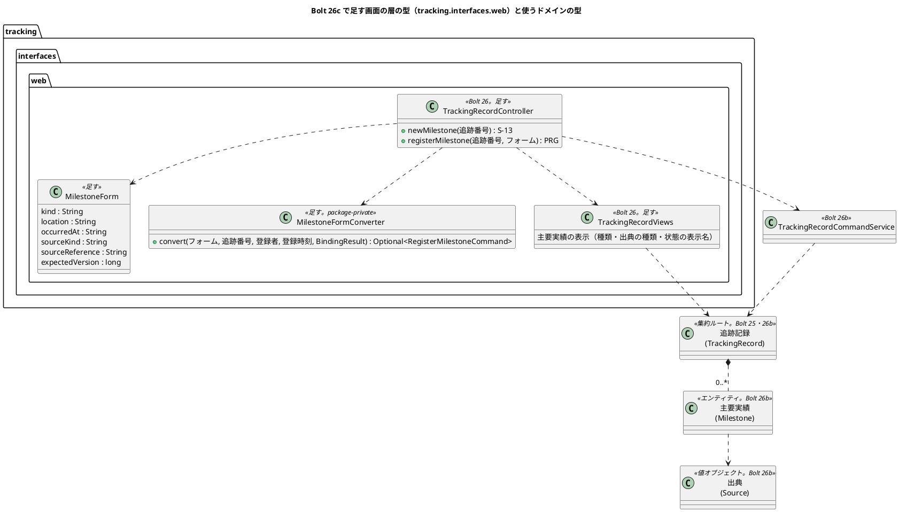
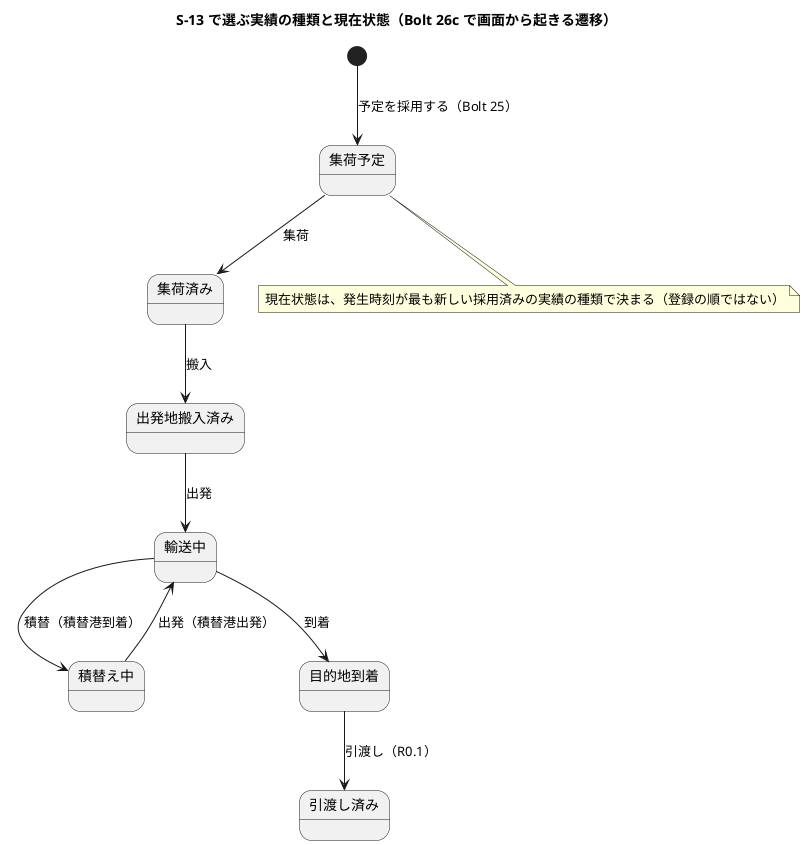
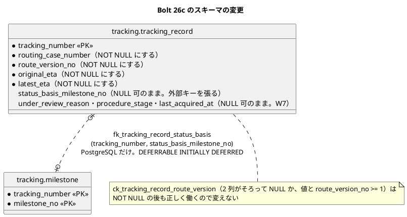
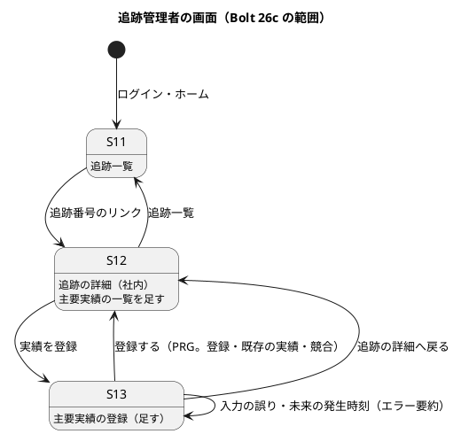

# Bolt 26c 計画 - 主要実績の登録の画面（US-12 AC1・AC2。S-13 の登録と S-12 の主要実績の一覧）

## 基本情報

| 項目 | 内容 |
| :--- | :--- |
| Bolt | 第 26c 回（release_plan の Bolt 26b を業務のルールと画面に分けた後半） |
| 予定 | W4（2026-10-26 の週。前倒しで 2026-10-10 から）、作業 3.5 時間（承認ゲートの待ち時間を除く。時間の配分の表の合計 210 分） |
| 対象 | U3 追跡（S-13 主要実績の登録、S-12 の主要実績の一覧、`tracking_record` のスキーマ）、社内の画面の「→」の読み上げ（S-12、経路設計の S-05・S-06） |
| GitHub | [#11](https://github.com/k2works/practical-domain-driven-design-in-enterpris-application/issues/11)（US-12 R0.1: AC1・AC2）。この Bolt で閉じ、US-12 の R0.1 の SP 3 を数える。受入動画を #11 に添付し、結果をコメントしてから閉じる（Bolt 25 の #10 の前例） |
| 承認ゲートの扱い | Try T-80 に従い、確認必須のゲート（この Bolt ではスキーマ）は計画の承認の場で人の判断を受ける（確認ポイント 3・4）。ここで判断を受けていないゲートは、`/goal` の指示があっても止まる |
| 承認ゲート | 計画の承認（確認ポイント 1〜18）、画面（ステップ 1・2）、Red／Green ごと（入力の検証。ステップ 2）、スキーマ（ステップ 3）、開発レビューの判断、終了報告。認可は変えない（S-13 は Bolt 26 の `/staff/tracking-records/**` の規則の内側。確認ポイント 9）ので、認可のゲートはない |
| アプローチ | アウトサイドイン（開発戦略の「Bolt ごとのアプローチの決め方」の「既存の集約に受入条件を足す」）。画面の層の受入シナリオ → 画面（S-13・S-12）→ スキーマ（NULL 可の列と外部キー）の順。業務のルールとコマンドサービスは Bolt 26b で作ってある。スキーマの変更は画面と独立なので最後に置く |
| 前の Bolt | [Bolt 26b 終了報告](bolt_26b_report.md)、[Bolt 26 終了報告](bolt_26_report.md) |

## Bolt ゴール

追跡管理者が S-12 追跡の詳細の「実績を登録」から S-13 主要実績の登録を開き、種類・場所・発生時刻・出典の種類・出典の参照を入れて登録すると、S-12 に戻って「実績 1 を登録しました。」が示され、主要実績の一覧に実績が出て、現在状態が「集荷済み」に変わる（AC1）。同じ出典の種類と参照で再び登録すると、新しい実績を作らず、S-12 に戻って既存の実績を結果として示し、その実績への導線を添える（AC2）。入力の誤りはエラー要約と項目の下に示し、入力値を保持する。これを画面の層の受入シナリオ（`@US-12-AC1`・`@US-12-AC2`、キー操作だけ、幅 320 CSS px、axe-core 0 件）で確かめ、#11 を閉じる。

### 確かめたい仮説

| # | 仮説 | この Bolt で分かること |
| :--- | :--- | :--- |
| H1 | Bolt 26b のコマンドサービスの結果（`Registered`・`AlreadyRegistered`・`Rejected`・`NotFound`・`Conflict`）を、画面の文言と行き先にそのまま対応させられ、画面の層に業務の判定を持ち込まずに済む | 画面の単体テストで、結果ごとの行き先と文言。コントローラーに業務の分岐（同じ出典の判定、未来の判定）がないこと |

## ふりかえりと前の Bolt からの引き継ぎ

| 入力 | 内容 | この Bolt での扱い |
| :--- | :--- | :--- |
| Bolt 26b の既知の課題（Bolt 26c） | S-13 の登録と S-12 の主要実績の一覧、AC2 の既存の記録の表示 | この Bolt の目的 |
| Bolt 26b の確認ポイント 1（承認済み） | 26c に Bolt 26 の画面の既知の課題（U-3 を除く U-4・U-6、予定と実績の並べ方）を入れる | U-4 は確認ポイント 17、U-6 は確認ポイント 18、並べ方は確認ポイント 11 |
| Bolt 26b の P-4 | 出典の参照を正規化しない | 画面の入力の変換で前後の空白を除く。大文字と小文字は区別したまま（確認ポイント 10） |
| Bolt 26b の P-10・Bolt 26 の既知の課題 | 根拠の実績番号の外部キー、`tracking_record` の NULL 可の 4 列 | 4 列を NOT NULL にし（確認ポイント 3）、外部キーを PostgreSQL だけに張る（確認ポイント 4） |
| Bolt 26b の確認ポイント 15 | 出典の取得時刻 | S-13 では登録時刻を渡す（確認ポイント 7） |
| Bolt 26b の P-12 | コマンドサービスを PostgreSQL の上で通すテストがない | 画面の層のシナリオ（PostgreSQL の上で動く）で、登録から AC2 までを通して確かめる |
| Bolt 26 の U-3 | 一覧の到着の列 | 最新の到着見込みを動かす W7 |
| Bolt 26 の既知の課題（社内の画面の共通の部品） | 配下の画面のナビの `aria-current`（Bolt 25b の U-1）、幅 320 CSS px の日時の表記（未決）、場所の表記（UN/LOCODE だけ。港の名前の併記） | S-13 も S-12 と同じ形（ナビの「追跡」が現在の項目）。課題は共通の部品で直す（この Bolt では変えない）。S-12 の主要実績の場所も UN/LOCODE だけで、既知の課題のまま |
| Bolt 23b の U-3 | 送信の失敗のときにエラー要約へフォーカスを移す（社内の画面の共通の部品の既知の課題） | 社内の S-03・S-04 と同じく `transport-request-form.js` を S-13 でも使う（確認ポイント 16） |
| Bolt 26b の Try T-81 | スキーマのステップは、本命のアサーションで Red を取る | ステップ 3 は既存の表の変更なので、統合テストの Red（NULL を入れられる・外部キーがない）を変更の前に本命のアサーションで取れる |
| Bolt 26b の Try T-82 | ステップ定義の注釈は 1 文に 1 つ、ファイルは Write で書く | 全ステップ |
| Try T-50・T-59 | 共有 DB の画面の層のテストのデータ | シナリオは自分で本予約を確定して追跡記録を作り、その追跡番号だけを使う（Bolt 26 の背景と同じ）。同じ出典の一意制約は追跡記録ごとなので、ほかのシナリオの記録とぶつからない |
| Try T-29・T-39・T-53・T-57・T-60・T-63・T-69・T-70・T-72・T-75・T-79 | 列の上限の境界、Red は本命のアサーション、設計文書への反映、表示名の網羅、テンプレートの値の有無、3 か所目で抽出、案内の先の画面、push の前の `uiTest`、画面の層のシナリオを先に、JavaScript の正規表現、結果の数え方 | T-57: 実績の種類 6 個・出典の種類 4 個・実績の状態 4 個の表示名を画面の単体テストで網羅する。T-69: 空のときの案内は S-13 があるので添える。ほかは全ステップ |

## スコープ

### 設計の約束（Try T-1）

- S-13 は `GET /staff/tracking-records/{追跡番号}/milestones/new`、`POST /staff/tracking-records/{追跡番号}/milestones`（新規作成の画面の前例 `/new`）。テンプレートは `tracking/staff/milestones/new.html`（S-04 の `quotation/staff/quotations/new.html` の前例）
- 画面はコマンドサービスの結果を文言と行き先に変えるだけで、業務の判定を持たない（仮説 H1）
- フォームと変換の部品は `tracking.interfaces.web` の直下に置く（`quotation` の `TransportRequestForm`・`TransportRequestFormConverter` の前例。第 3 章の `viewadapters` はコードでは使っていない。確認ポイント 12）
- 入力の変換: 日時は見積依頼（C-03）と同じ 1 つのテキスト欄で、書式は `TransportRequestFormConverter.DEADLINE_PATTERN` と同じ形（`uuuu-MM-dd HH:mm`、`ResolverStyle.STRICT`）、タイムゾーンは `DateTimeDisplay.ZONE`（`ZoneId.of` を使わない。architecture_backend.md の日時の規則と ArchUnit）。場所は見積依頼と同じ規則（前後の空白を除き、英字を大文字にそろえる）。出典の参照は前後の空白を除く
- 画面を開いたときの追跡記録の版を隠し項目で送る（競合の検出）。コマンド ID は持たない。主要実績の登録は、出典識別子（出典の種類と参照）が冪等の鍵の役を果たす（T-INV-02。ARCH-HO-01 の「コマンドはコマンド ID と期待版を持つ」の例外として設計文書に書く）
- `tracking_record` の経路版の 2 列と到着予定の 2 列を NOT NULL にし、リポジトリの NULL の行の例外（Bolt 25 の P-9）を外す。根拠の実績番号から主要実績へ、PostgreSQL だけに DEFERRABLE の外部キーを張る

### 入れるもの・入れないもの

| 入れる | 入れない（後の Bolt） |
| :--- | :--- |
| S-13 の登録（入力・エラー要約・PRG・結果ごとの文言） | 訂正（US-13）、下書きの修正（W7）、確認の領域（訂正で使う。確認ポイント 6） |
| S-12 の主要実績の一覧と「実績を登録」、AC2 の既存の記録の表示 | 状態バッジ（確認中・下書きが起きる W7）、S-12 のタブ、予約の業務番号、場所の名前の併記 |
| 「→」の読み上げ（S-12、経路設計の S-05・S-06。確認ポイント 17） | 共通部品「競合表示」の差分の表示（確認ポイント 14） |
| 画面の層の受入シナリオ（`@US-12-AC1`・`@US-12-AC2`、デモ項目 `@demo @demo-bolt-26c/register-milestone`）と受入動画 | 荷主の照会（US-09、Bolt 27） |
| `tracking_record` の NULL 可の 4 列の NOT NULL 化、根拠の実績番号の外部キー（PostgreSQL） | 確認中・手続き中・最終取得時刻の列の扱い（W7） |

## 設計（この Bolt の範囲）

### ドメインモデル

新しいドメインの型はない（Bolt 26b で作った。破線）。画面の層に足す型は次のとおり。

### 状態遷移

画面での登録で起きる遷移（Bolt 26b の対応。終了報告の議題 2 で承認済み）。S-13 の種類の選択肢と説明はこの対応に従う。

### データモデル

- NOT NULL は `db/migration/common/V20261010HHMMSS__tracking_record_not_null.sql`（`ALTER TABLE ... ALTER COLUMN ... SET NOT NULL` を 1 列ずつ。前例 `V20261009100000` の `booking.booking.quotation_no`。H2 は `MODE=PostgreSQL`）
- 外部キーは `db/migration/postgresql/V20261010HHMMSS__tracking_record_status_basis_fk.sql`（PostgreSQL だけ。前例 `V20261005170100` の `fk_quotation_replaced_by ... DEFERRABLE INITIALLY DEFERRED`。理由も同じく、追跡記録の UPDATE を実績の INSERT より先に行うため）
- 既存の行: デモ環境（Heroku）・開発・`uiTest` は、どれも H2 のインメモリか空の PostgreSQL に移行を流して作る（heroku_demo_setup.md。配備ごとに初期化）。`db/dev-data` に追跡記録の行はない（利用者だけ）。追跡の開始（Bolt 25）は 4 列に必ず値を入れる。ステージングはまだない（W10）。そのため NULL の行は残っておらず、DB を照会して確かめる手順は要らない（独自のスクリプトも書かない）

### 画面遷移

| 画面 | URL | この Bolt で決めること |
| :--- | :--- | :--- |
| S-13 主要実績の登録 | `GET /staff/tracking-records/{追跡番号}/milestones/new`、`POST /staff/tracking-records/{追跡番号}/milestones` | 見出しと title は「主要実績の登録 追跡番号」。項目: 種類（ラジオボタン。集荷・搬入・出発・積替・到着・引渡し。「積替港での到着は積替、積替港からの出発は出発を選んでください」の説明）、場所（UN/LOCODE。例: JPTYO）、発生時刻（日本時間。例: 2026-11-01 11:30。タイムゾーンは Asia/Tokyo（UTC+09:00））、出典の種類（ラジオボタン。現場記録・社内確認・手動入力。確認ポイント 8）、出典の参照（1〜200 文字。例: 港湾の受付番号、現場の記録番号）。ボタン「登録する」、リンク「追跡の詳細へ戻る」（フォームの画面の前例）。入力の誤りは画面の上部のエラー要約（件数と各項目へのリンク、フォーカスを移す）と項目の下に示し、入力値を保持する。未来の発生時刻（`Rejected`）は発生時刻の項目の誤り「発生時刻は現在より前の時刻を入れてください」。存在しない追跡番号と形式の誤りは 404 |
| S-12 追跡の詳細（社内） | `GET /staff/tracking-records/{追跡番号}` | 見出し「主要実績」の下に、発生時刻の順（同じ時刻は実績番号の順）の順序付きのリスト。各項目は「実績 1、集荷、JPTYO」と発生時刻・出典（「現場記録 F-118（取得 …）」）・状態（「採用」）で、`id="milestone-1"` を付ける。空のときは「主要実績はまだありません。実績を登録すると、現在状態が更新されます。」。「実績を登録」のリンク（S-13）。PRG の後の結果は `role="status"`（Bolt 24 の「すでに予約に使われています」の前例: 望んだ結果が成り立つので警告でなく結果として示し、導線を文の外に置き、リンクの名前に識別子を入れる）: 登録は「実績 1 を登録しました。」、既存の実績は「出典（現場記録 F-118）の実績はすでに登録されています（実績 1）。」と、文の外のリンク「実績 1 を一覧で見る」（`#milestone-1`）。競合は `role="alert"` で「ほかの追跡管理者が先にこの追跡記録を更新しました。最新の主要実績を確かめてください。」（経路設計の前例の文の型） |

## ステップ計画

状態の記号: `[ ]` 未着手、`[-]` 進行中、`[?]` 承認待ち、`[x]` 完了。各ステップの終わりに `check` が緑であることと、計画からの変更を設計文書に反映したこと（T-53）を確かめ、Green と同じ push にまとめて CI を確かめる（T-26、T-65）。Red は実行して本命のアサーションで失敗することを確かめてから実装する（T-39）。

- [ ] **1. 画面の層の受入シナリオ** 【承認ゲート: 画面】
  - `features/ui/register_milestone_ui.feature` に足す（T-72）。説明文の古い記述（「この Bolt のシナリオは受入条件のタグを付けない」「主要実績の登録（S-13）と重複の扱いは Bolt 26b で足す」）を書き換える: (a) `@US-12-AC1 @demo @demo-bolt-26c/register-milestone`: 追跡管理者が S-12 の「実績を登録」で S-13 を開き、集荷・JPTYO・発生時刻・現場記録・参照を入れて登録すると、S-12 に「実績 1 を登録しました。」、主要実績の一覧に「実績 1、集荷、JPTYO」、現在状態「集荷済み」。S-11 に戻ると先頭の行の現在状態が「集荷済み」。(b) `@US-12-AC2`: 同じ出典の種類と参照で再び登録すると、S-12 に既存の実績を示す結果と「実績 1 を一覧で見る」が出て、主要実績は 1 件のまま。(c) 入力の誤り（場所の形式・参照なし）でエラー要約にフォーカスが移り、入力値が残る。(d) 幅 320 CSS px で S-13 と S-12 の主要実績が横スクロールなしで読める。キー操作だけ、axe-core 0 件。正規表現に JavaScript にない構文を使わない（T-75）
  - 骨組み（S-12 に「実績を登録」のリンク、S-13 は見出しだけ）で `uiTest` を流し、本命のアサーション（登録の結果・主要実績の一覧）で落ちることを確かめる。絞り込みが効いたかは実行の件数で確かめる（T-79）
  - 完了の判定: シナリオが本命のアサーションで落ちる、T-53
- [ ] **2. 画面（S-13・S-12）と「→」の読み上げ** 【承認ゲート: 画面、Red／Green（入力の検証）】
  - 画面の単体テストを先に書き、実装の前に流して Red を確かめる: S-13 の項目とラベルと説明、種類 6 個・出典の種類 3 個（画面で選べるもの）の表示名、隠し項目の版、入力の誤り（必須、場所の形式、場所の小文字と前後の空白は直して送る、日時の形式・存在しない日付、参照の 200 文字・201 文字（T-29）、参照の前後の空白を除いた値で送る、選択肢にない値）、結果ごとの行き先と文言（`Registered`・`AlreadyRegistered`・`Rejected`・`NotFound`・`Conflict`）、ない追跡番号と形式の誤りの 404、S-12 の主要実績のリスト（発生時刻の順、出典の種類 4 個と実績の状態 4 個の表示名（T-57）、`id`）、空のときの案内、「実績を登録」のリンク、S-12・S-06 の区間の表記と S-05 の列名に「→」がないこと
  - セキュリティの統合テストに、ほかの役割は S-13 の GET・POST が 403 の例を足す（確認ポイント 9）
  - `MilestoneForm`、`MilestoneFormConverter`、`TrackingRecordController` の 2 つの口、`TrackingRecordViews` の主要実績の表示と区間の表記、`tracking/staff/milestones/new.html`（`transport-request-form.js` でエラー要約へフォーカス）、`show.html` の主要実績と結果、経路設計の `RoutingCaseViews` の区間の表記と S-05 の列名
  - 完了の判定: `check` 緑、`uiTest` でステップ 1 のシナリオが通る、T-53
- [ ] **3. `tracking_record` の NULL 可の列と根拠の実績番号の外部キー** 【承認ゲート: スキーマ】
  - 統合テストを先に書く: 経路版の 2 列・到着予定の 2 列は NULL を入れられない、根拠の実績番号はない実績を指せない（PostgreSQL。コミットのときに検査される DEFERRABLE なので、テストのトランザクションの中で `SET CONSTRAINTS ALL IMMEDIATE` で確かめる）。変更の前に流し、本命のアサーション（NULL を入れても・ない実績を指しても例外にならない）で落ちることを確かめる（T-81）
  - マイグレーション 2 つ、リポジトリの NULL の行の例外の除去（組み立てと要約）と、それを確かめていた統合テストの書き換え、権限のテスト（`AppendOnlyGrantIntegrationTest`）で入れる追跡記録の行に 4 列の値を足す
  - 完了の判定: `check`・`uiTest` 緑、T-53
- [ ] **4. 開発レビューと終了報告** 【承認ゲート: 開発レビューの判断、終了報告】
  - `developing-review`（プログラマー（テスター・アーキテクトの観点を含む）とインタラクションデザイナー（ユーザー代表の観点を含む）の 2 つの観点）、SonarQube（`sonar-local:check`）、受入動画（`./gradlew demoVideo`。過去の Bolt の動画は元に戻す）、`bolt_26c_report.md`
  - 設計文書（T-53）
    - ui_design.md: URL の表に S-13 の行、S-12 の行に主要実績の一覧と結果の文言、画面一覧の S-12・S-13 の Bolt 26c の範囲、社内業務 Web（追跡）の画面遷移図に S-12 → S-13、S-13 → S-12（登録・戻る）、S-13 → S-13（入力の誤り）、S-13 の画面イメージ（salt）を足す、S-12 の画面イメージを主要実績のリストの形に改める（タブと操作の列は後の Bolt の注）、共通部品「画面幅」の S-12 の並べ方の決め直し（どの幅でもリスト。Bolt 26 の第一案を覆した理由）、S-13 が確認の領域を経ない理由、S-13 の競合が共通部品「競合表示」「フォーム項目」から外れること（既知の課題）、区間の表記の決まり（「→」でなく「から」）
    - domain_model.md: 用語集の「出典」に、画面で選べる出典の種類（外部原本は取込だけ）、取得時刻（S-13 では登録時刻）、参照の前後の空白を除くこと。ARCH-HO-01 の例外（主要実績の登録は出典識別子が冪等の鍵）
    - data_model.md: `tracking_record` の 4 列の NOT NULL と、根拠の実績番号の外部キー（PostgreSQL だけ、DEFERRABLE）
    - test_strategy.md: T-INV-01〜05 の行の画面の層（`@US-12-AC1`・`@US-12-AC2`）
    - release_plan.md: W4 の 26c の行と進捗
  - 終了報告の承認の後に、受入動画の添付先（`ops/scripts/issue_demo.js` の `BOLT_ISSUES` と手順書の表）に `bolt-26c → #11` を足し、#11 に結果をコメントして AC1・AC2 にチェックを付けて閉じる。#11 の完了の定義の「支援技術による手動確認」は人が行う（終了報告の議題に置く。Bolt 20 の前例）
  - 開発レビューの対応の後も push の前に `uiTest` を流す（T-70）

### 時間の配分と打ち切り

| # | 目安 | 打ち切り |
| :--- | :--- | :--- |
| 1 | 30 分 | 削らない（デモ項目と AC1・AC2） |
| 2 | 100 分 | 時間を超えたら、S-12 の出典の取得時刻の表示を後に回す（AC2 の既存の実績へのリンクは削らない） |
| 3 | 35 分 | 削らない（スキーマ） |
| 4 | 45 分 | 幅 320 CSS px の表記の作り込みは、レビューの指摘でも既知の課題に回す |

## 確認ポイント（計画の承認の場でまとめて確認する。Try T-6）

| # | 確認すること | ステップ | 推奨 |
| :--- | :--- | :--- | :--- |
| 1 | 範囲 | 全体 | S-13・S-12・AC2 の表示・画面の層のシナリオと受入動画・「→」の読み上げ（U-4）・NULL 可の列と外部キー。Bolt 26b の確認ポイント 1（承認済み）のとおり、U-4・U-6・予定と実績の並べ方をこの Bolt で扱う。U-3 は W7 |
| 2 | アプローチと順序 | 全体 | アウトサイドイン。画面の層のシナリオ → 画面 → スキーマ。スキーマの変更は画面と独立しているので最後に置く |
| 3 | **`tracking_record` の 4 列を NOT NULL にする（T-80。確認必須）** | 3 | `routing_case_number`・`route_version_no`・`original_eta`・`latest_eta` を NOT NULL にする。理由は、追跡の開始（Bolt 25）で必ず値が入り、集約も必ず持つので、表で守ると NULL の行の例外（Bolt 25 の P-9）を消せる。2 列そろいの CHECK は NOT NULL の後も正しく働くので変えない。既存の行は、どの環境も配備ごとに空の DB から作るので NULL の行はない（データモデルの節）。代わりの案は、NULL 可のまま残す（リポジトリの例外で守り続ける） |
| 4 | **根拠の実績番号の外部キー（T-80。確認必須。Bolt 26b の P-10）** | 3 | PostgreSQL だけに `(tracking_number, status_basis_milestone_no)` → `milestone` の DEFERRABLE INITIALLY DEFERRED の外部キーを張る。前例は `fk_quotation_replaced_by`（PostgreSQL 専用の移行、理由も「旧い行を先に更新し、新しい行を後に保存する」で同じ）。H2 では張らない（開発・単体の検査は集約の不変条件で守る）。代わりの案は、張らない（整合を集約だけで守る。表を直接書き換えたときに根拠が宙に浮くおそれが残る） |
| 5 | S-13 の URL とテンプレート | 2 | `GET …/milestones/new`、`POST …/milestones`、`tracking/staff/milestones/new.html`（新規作成の画面の前例） |
| 6 | S-13 の確認の領域 | 2 | 経ない。BR-13 が実行前の確認を求めるのは実績の「訂正」で、登録は対象外（requirements_definition.md の BR-13）。UI 設計の社内業務 Web（追跡）の画面遷移図も、訂正だけが「訂正の確認」を経て、登録はそのまま追跡の詳細へ戻る。UI 設計の S-13 の「登録、訂正（確認の領域を経る）」は訂正にかかると読み、ui_design.md に書く |
| 7 | 出典の取得時刻 | 2 | 登録時刻にする（入力の項目を増やさない。追跡管理者が出典を見て入れた時刻）。S-12 では出典に「（取得 …）」を添える |
| 8 | **S-13 で選べる出典の種類** | 2 | 現場記録・社内確認・手動入力の 3 つ。外部原本は外部原本の取込（W7、US-14）だけが作る（取込の受信記録を伴う）。代わりの案は 4 つすべてを選べるようにする |
| 9 | 認可 | 2 | 変えない（`/staff/tracking-records/**` は追跡管理者だけ。Bolt 26）。セキュリティの統合テストに、ほかの役割は S-13 の GET・POST が 403 の例を足し、完了条件に入れる |
| 10 | 出典の参照の正規化（Bolt 26b の P-4） | 2 | 画面の入力の変換で前後の空白を除く。大文字と小文字は区別したまま（参照は外部の識別子で、区別が意味を持ちうる）。共有カーネルの `Source` は変えない（航海にも及ぶため。外部原本の取込（W7）で必要になったら、そこで決める） |
| 11 | **S-12 の予定と実績の並べ方**（Bolt 26 の確認ポイント 15 の決め直し） | 2 | 予定区間のリストはそのまま。見出し「主要実績」の下に、発生時刻の順の順序付きのリスト（区間に結び付けない）。Bolt 26 の終了報告で第一案とした「区間ごとに予定と実績を並べる形」を覆す。理由は、集荷・搬入・引渡しは区間の外の実績で、区間ごとに並べると置き場所がないこと。共通部品「画面幅」は「時系列の表は狭い画面でリストに切り替える」だが、S-12 は予定区間（Bolt 26）と同じく、どの幅でもリストにする（表とリストの 2 つの形を持たない）。ui_design.md の共通部品と S-12 の画面イメージを直す。操作の列（訂正・確認）は US-13・W7 で足す |
| 12 | 日時の入力と部品の置き場所 | 2 | 見積依頼（C-03）と同じ 1 つのテキスト欄で、書式は `DEADLINE_PATTERN` と同じ形、タイムゾーンは `DateTimeDisplay.ZONE`。変換は `tracking.interfaces.web` の直下に置く（前例の `quotation.interfaces.web` と同じ。第 3 章の `viewadapters` はコードでは使っていないので、前例に合わせる）。`platform.web` への日時の入力の部品の抽出は 3 か所目で行う（T-63） |
| 13 | **AC2 の示し方** | 2 | PRG で S-12 に戻り、`role="status"` の結果「出典（現場記録 F-118）の実績はすでに登録されています（実績 1）。」と、文の外のリンク「実績 1 を一覧で見る」（`#milestone-1`）。前例は Bolt 24 の「すでに予約に使われています」（望んだ結果が成り立つので警告でなく結果として示し、導線を文の外に置き、リンクの名前に識別子を入れる。WCAG 2.4.4）。S-13 に留まって誤りとして示す形は取らない |
| 14 | 競合の示し方 | 2 | PRG で S-12 に戻り、`role="alert"` で「ほかの追跡管理者が先にこの追跡記録を更新しました。最新の主要実績を確かめてください。」（経路設計の前例の文の型）。入力は残らないが、S-12 で最新の実績を見てから入れ直せる。これは共通部品「競合表示」（差分を示す）と「フォーム項目」（入力値を保持する）から外れる（見積り・経路設計の前例も同じ）ので、ui_design.md に既知の課題として書く |
| 15 | 状態バッジ | 2 | 使わない（実績の状態はまだ「採用」だけ。区別が要るのは確認中・下書きが起きる W7） |
| 16 | エラー要約へのフォーカス（Bolt 23b の U-3） | 2 | 社内の S-03・S-04 と同じく `transport-request-form.js` を S-13 でも読み込む（送信の失敗のときにエラー要約へフォーカスを移す）。共通の部品への移し替えは既知の課題のまま |
| 17 | **「→」の読み上げ（Bolt 26 の U-4）** | 2 | 区間の表記を「JPTYO から KRPUS」にし、「→」を使わない（スクリーンリーダーが「右矢印」と読むため）。S-12 の予定区間と、同じ表記の経路設計の S-06（確定の画面の区間）・S-05（一覧の列名「出発地 → 目的地」を「出発地・目的地」に）をそろえる。代わりの案は、「→」を `aria-hidden` にして読み上げ用の「から」を添える（見た目は変わらないが、文字列を組む部品をテンプレートの断片に変える必要がある） |
| 18 | **「追跡一覧」へのリンクの位置（Bolt 26 の U-6）** | 2 | S-12 の末尾のままにする。S-24・S-10 と同じ位置で、画面ごとに位置を変えない。S-12 に「実績を登録」が増えても、主要実績の見出しの下に置くので、末尾の「追跡一覧」と紛れない。代わりの案は、見出しの直後にも置く（パンくずの形は W7 以後に社内の画面で共通に決める） |

## 完了条件

- [ ] 画面の層の受入シナリオ（`@US-12-AC1`・`@US-12-AC2`、`@demo-bolt-26c/register-milestone`）が通り、受入動画を撮った
- [ ] 画面の単体テストで、入力の誤り・結果ごとの行き先と文言・表示名の網羅を確かめた。セキュリティの統合テストで、ほかの役割の S-13 の 403 を確かめた
- [ ] PostgreSQL の統合テストで、4 列の NOT NULL と根拠の実績番号の外部キーを確かめた
- [ ] `check`・`documentationTest`・`uiTest` が緑。push して CI（JIG・Modulith の文書の生成を含む）とデモ環境の配備を確かめた
- [ ] SonarQube の Quality Gate が PASS
- [ ] 設計文書（ステップ 4 の一覧）に決定を書いた（T-53）
- [ ] 開発レビューと終了報告。承認の後に受入動画の添付先を足し、#11 に結果をコメントして閉じた。支援技術による手動確認は人が行う（終了報告の議題）

### デモ項目

追跡管理者が追跡の詳細から主要実績（集荷）を出典付きで登録すると、主要実績の一覧に出て、現在状態が「集荷済み」に変わる。同じ出典で再び登録すると、既存の実績が示される（`@demo @demo-bolt-26c/register-milestone`）。

### ユーザーマニュアル

この Bolt では作らない。W4 の完了の後に `docs/manual` を作る（2026-10-08 の決定。release_plan の W4）。S-13 の操作はそこで書く。

## 更新履歴

| 日付 | 更新内容 | 更新者 |
| :--- | :--- | :--- |
| 2026-10-10 | 開始準備の整合性検証（計画と設計 15 件、横断 17 件）の指摘を反映した。主な修正は次のとおり。 - U-4・U-6 を 26b の承認済みの決定どおり範囲に戻した。 - デモ環境の DB の確認の手順を事実に合わせて外した。 - 外部キーを PostgreSQL だけに張る案にした（前例 `fk_quotation_replaced_by`）。 - AC2 の前例を Bolt 24 に差し替えた。 - 競合の文言を経路設計の型にそろえた。 - 競合表示からの逸脱を記録した。 - エラー要約へのフォーカス。 - `DateTimeDisplay.ZONE`。 - 場所の規則。 - 状態遷移図とドメインの型。 - 設計文書の一覧（domain_model.md、画面遷移図、S-13 の salt）。 - ARCH-HO-01 の例外。 - 403 のテスト。 - #11 のコメント。 | anthropic/claude-opus-5-5 |
| 2026-10-10 | 初版作成（承認待ち） | anthropic/claude-opus-5-5 |

## 関連ドキュメント

- [リリース計画](release_plan.md)（W4）
- [Bolt 26b 計画](bolt_26b_plan.md)、[Bolt 26b 終了報告](bolt_26b_report.md)、[Bolt 26 終了報告](bolt_26_report.md)、[Bolt 24 終了報告](bolt_24_report.md)（既にある結果の示し方）
- [ユーザーストーリー](../../requirements/cargo-tracker/user_story.md)（US-12）
- [UI 設計](../../design/cargo-tracker/ui_design.md)（S-05、S-06、S-12、S-13、共通部品）
- [データモデル](../../design/cargo-tracker/data_model.md)（`tracking_record`）
- [ドメインモデル](../../design/cargo-tracker/domain_model.md)（追跡、出典）
- [テスト戦略](../../design/cargo-tracker/test_strategy.md)（US-12）
- [開発戦略](development_strategy.md)
