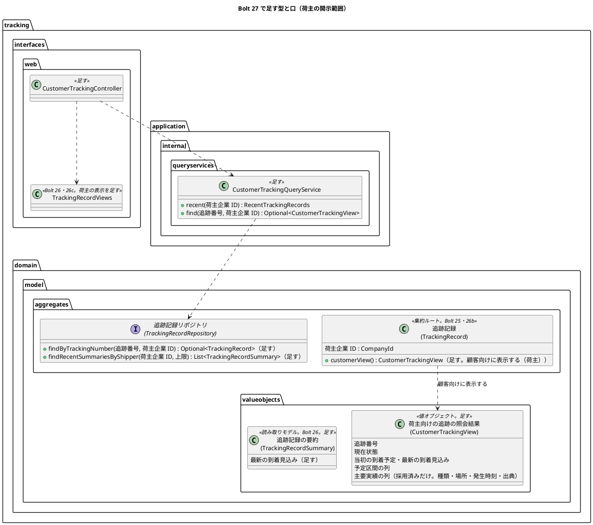
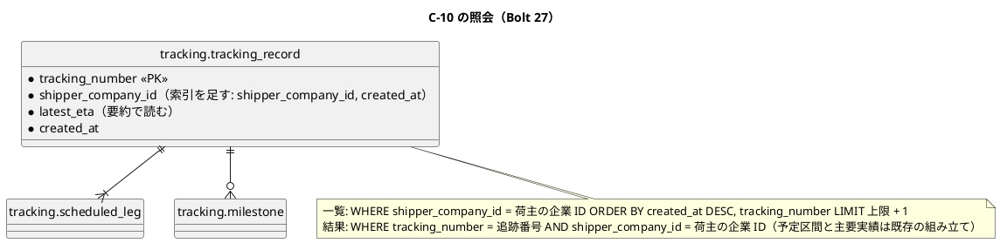
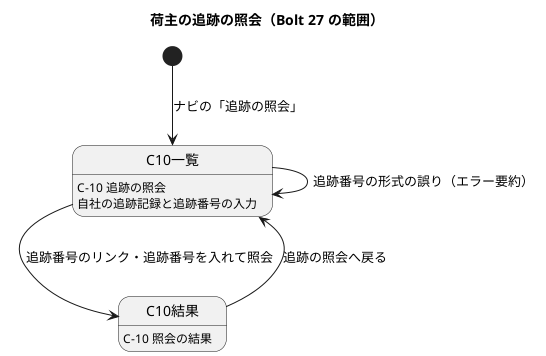

# Bolt 27 計画 - 荷主の追跡の照会（US-09 AC1。C-10 追跡の照会）

## 基本情報

| 項目 | 内容 |
| :--- | :--- |
| Bolt | 第 27 回 |
| 予定 | W4（2026-10-26 の週。前倒しで 2026-10-10 から）、作業 4 時間（承認ゲートの待ち時間を除く。時間の配分の表の合計 240 分。半日を超えると見えたら、確認ポイント 1 の打ち切りで画面の層の入力の誤りのシナリオを後に回す） |
| 対象 | U3 追跡（C-10 追跡の照会、荷主の開示範囲、荷主企業での照会）、`identity`（荷主のナビの「追跡の照会」を準備中から外す） |
| GitHub | [#12](https://github.com/k2works/practical-domain-driven-design-in-enterpris-application/issues/12)（US-09 R0.1: AC1）。この Bolt で閉じ、US-09 の R0.1 の SP 3 を数える。受入動画は #12 に添付する |
| 承認ゲートの扱い | 人の指示（`/goal Bolt27`、2026-10-10。計画の報告の後）により、計画を推奨のとおり進め、承認ゲートで止まらずに進める。止まらなかったゲートごとに根拠を書き、確認ポイントの決定とあわせて終了報告の承認の議題に置く（T-36）。計画の人の検証（`verify`）は終了報告の承認のときに行う。確認必須の索引（確認ポイント 4）と認可（確認ポイント 9）は、`/goal` の後に人に諮り、2026-10-10 に human:kakimomokuri が推奨のとおりと決めた（T-80）。Try T-80 に従い、確認必須のゲート（この Bolt ではスキーマ（索引）と認可）は計画の承認の場で人の判断を受ける（確認ポイント 4・9）。ここで判断を受けていないゲートは、`/goal` の指示があっても止まる |
| 承認ゲート | 計画の承認（確認ポイント 1〜18）、業務のルールの層のシナリオ（ステップ 1）、画面（ステップ 2・4）、Red／Green ごと（開示制御。ステップ 3・5）、認可（ステップ 4）、スキーマ（ステップ 5）、開発レビューの判断、終了報告。release_plan の W4 の決定（「U3 の開示制御を Red・Green ごとに、スキーマと認可をステップごとに止める」）に従い、開示の照会（ステップ 3）と画面・認可（ステップ 4）を分ける（Bolt 25b・26 の前例） |
| アプローチ | アウトサイドイン（開発戦略の「既存の集約に受入条件を足す」。新しい集約・スキーマは作らない。索引を 1 つ足すのは Bolt 24 の解釈で「新しいスキーマ」に当たらない）。業務のルールの層のシナリオ → 画面の層のシナリオ → 開示の照会 → 画面と認可 → 永続化（索引を含む）の順 |
| 前の Bolt | [Bolt 26c 終了報告](bolt_26c_report.md)、[Bolt 26b 終了報告](bolt_26b_report.md)、[Bolt 26 終了報告](bolt_26_report.md) |

## Bolt ゴール

荷主担当者が荷主のナビの「追跡の照会」（C-10）を開くと、自社の追跡記録が新しい順に並び、追跡番号を選ぶか追跡番号を入れて照会すると、現在状態・当初の到着予定・最新の到着見込み・予定区間・主要実績（採用済み）と、各実績の出典・取得時刻が示される（AC1）。他社の追跡番号は、存在しない番号と同じ応答（404）になり、他社の追跡記録は一覧にも出ない（BR-07）。これを業務のルールの層の受入シナリオ（`@US-09-AC1`）、画面の層の受入シナリオ（キー操作だけ、幅 320 CSS px、axe-core 0 件）、開示の Web テストで確かめ、#12 を閉じる。

### 確かめたい仮説

| # | 仮説 | この Bolt で分かること |
| :--- | :--- | :--- |
| H1 | 開示範囲（荷主）の判定を、照会の入口（荷主企業での絞り込み。一覧も詳細もリポジトリの SQL で絞る）と、集約の 1 つの操作（荷主向けの照会結果。採用済みの実績だけ、社内の識別子を含めない）に閉じ込められ、画面は判定を持たない | 荷主の照会のサービスの単体テストで、他社の追跡番号が空になること。集約の単体テストで、荷主向けの照会結果に採用済みでない実績と経路版が含まれないこと。コントローラーに企業の比較がないこと |

## ふりかえりと前の Bolt からの引き継ぎ

| 入力 | 内容 | この Bolt での扱い |
| :--- | :--- | :--- |
| Bolt 26b の確認ポイント 13、Bolt 26c の次の Bolt | 主要実績を荷主に見せるかどうか（`shown_to_customer`、T-INV-09） | 確認ポイント 3 |
| Bolt 26 の既知の課題（荷主の照会） | 追跡状態の表示名の置き場所（`tracking.interfaces.web` の package-private のクラス） | 荷主の画面も `tracking.interfaces.web` に置き、`TrackingRecordViews` を共有する（確認ポイント 10） |
| Bolt 26 の既知の課題（UI 設計との食い違い） | 追跡番号の区切りの表示、場所の表記（UN/LOCODE だけ） | 変えない（確認ポイント 12） |
| Bolt 26 の既知の課題（社内の画面の共通の部品） | 幅 320 CSS px の日時の表記（未決）、配下の画面のナビの `aria-current` | 荷主の日時表示（UTC を併記しない）は社内より短いので、幅 320 CSS px の折り返しの課題は荷主の画面では小さい。結果の画面のナビの「追跡の照会」は現在の項目にする（一覧と同じ `active`。配下の画面の `aria-current` の課題を荷主の画面では起こさない） |
| Bolt 26 の既知の課題（読み取りモデルの置き場所、W11） | ドメイン層の一覧の読み取りモデル | 荷主の一覧も既存の `TrackingRecordSummary` を使う（新しい読み取りモデルを足さない）。荷主向けの照会結果（`CustomerTrackingView`）は集約の操作の戻り値として `valueobjects` に置く。置き場所の見直しは W11 の既知の課題のまま |
| Bolt 26 の既知の課題（画面の層の前提） | 「一覧の先頭」はシナリオを逐次に実行する前提 | 荷主の一覧の「先頭」も同じ前提。シナリオに注記する |
| Bolt 26c の U-5・U-13 | 出典の「取得」が S-13 では登録時刻、「実績」と「主要実績」の語の揺れ | U-5: 荷主の画面でも「取得」と示す（AC1 が取得時刻を求める）。登録と取得の示し分けは W7 のまま。U-13: 荷主の画面の見出しは「主要実績」、項目の語は「集荷、JPTYO」とし、「実績」を単独で使わない |
| Try T-79〜T-84 | 結果の数え方、確認必須のゲートは計画の承認で、スキーマの Red、ステップ定義の注釈は 1 つ・ファイルは Write、骨組みを直したら流し直す、ステップのファイルだけをステージ | 全ステップ。T-83 はステップ 1・2 の Red、T-84 は各コミット |
| Try T-29・T-39・T-53・T-57・T-69・T-70・T-72・T-75 | 境界、Red は本命のアサーション、設計文書への反映、表示名の網羅、案内の先の画面、push の前の `uiTest`、画面の層のシナリオを先に、JavaScript の正規表現 | T-57: 荷主の画面で追跡状態・実績の種類・出典の種類の表示名を使うことを確かめる。T-69: 一覧が空のときの案内は、本予約の確定を待つことを書く |

## スコープ

### 設計の約束（Try T-1）

- C-10 の URL は `GET /customer/tracking-records`（自社の追跡記録の一覧と追跡番号の入力。入力は同じ URL に `?trackingNumber=` で送り、形式が正しければ結果へリダイレクトする）と `GET /customer/tracking-records/{追跡番号}`（結果）。URL の規則（資源を英語の複数形、1 画面 = 1 URL）に従う。荷主のナビの「追跡の照会」のリンクと現在の項目のキーを `tracking-records` に改め、準備中の画面（`PlaceholderController`）から `tracking` を外す（確認ポイント 1）
- 開示範囲（荷主）: 照会の入口で荷主企業に絞る。一覧はリポジトリの SQL で `shipper_company_id` を絞り、詳細もリポジトリの `findByTrackingNumber(追跡番号, 荷主企業 ID)` の SQL で絞る（見積りの `TransportRequestRepository.findByNumber(number, shipperCompanyId)` の前例）。他社は存在しない追跡番号と同じ 404（状態と本文を同じにする）
- 荷主の照会のサービスは社内と別のクラス `CustomerTrackingQueryService`（見積りの `TransportRequestQueryService`／`StaffTransportRequestQueryService` の前例）。社内の `TrackingRecordQueryService` は荷主の画面から使わない
- 荷主向けの照会結果: 集約の操作 `TrackingRecord.customerView()`（ドメインモデルの「顧客向けに表示する(開示範囲) : 照会結果」）が `CustomerTrackingView` を返す。現在状態・当初の到着予定・最新の到着見込み・予定区間・採用済みの主要実績だけを持ち、経路版（案件番号と版）・実績番号・実績の状態・登録者を持たない。開示範囲の型（`DisclosureScope`）は、立場が荷主だけのいまは作らず、荷受人の照会（US-10、R1.1）で作る（確認ポイント 5）
- 日時は荷主の日時表示（`DateTimeDisplay.customer`。UTC を併記しない）
- 照会記録（IR-INV-01。KPI-02）は作らない（W9。確認ポイント 7）
- 荷主の一覧のため、`tracking_record` に（`shipper_company_id`、`created_at`）の索引を足す（確認ポイント 4）。要約（`TrackingRecordSummary`）に最新の到着見込みを足す（荷主の一覧の列。S-11 は表示を変えない。確認ポイント 17）

### 入れるもの・入れないもの

| 入れる | 入れない（後の Bolt） |
| :--- | :--- |
| C-10 の一覧（自社の追跡記録、新しい順）と追跡番号の入力、照会の結果（現在状態・到着予定・予定区間・主要実績・出典・取得時刻） | AC2（矛盾・確認中・判明事実・未確定事項・次の行動・次回更新日時・担当窓口）・AC3（停止中・鮮度）（R1.0、W7 以後）、問い合わせ（US-23、W8） |
| 荷主の開示範囲（自社だけ、採用済みの実績だけ、社内の識別子を出さない）と他社の 404 | 荷受人の照会と `DisclosureScope`（US-10、R1.1）、照会記録（W9） |
| 業務のルールの層・画面の層の受入シナリオ、受入動画 | 見積依頼の詳細（C-04）・予約の詳細（C-07）からの導線（C-07 を作る Bolt。確認ポイント 2） |
| `tracking_record` の（`shipper_company_id`、`created_at`）の索引、要約の最新の到着見込み | `shown_to_customer` の列（顧客への表示（US-11）と訂正（US-13）で足す。確認ポイント 3）、荷受人の索引（US-10） |

## 設計（この Bolt の範囲）

### ドメインモデル

`CustomerTrackingView` は `@ValueObject` を付け、用語集に「荷主向けの追跡の照会結果」の行を足す（用語集の整合テスト）。

### 状態遷移

状態を変える処理はない（照会だけ）。荷主に見せる現在状態は、社内と同じ追跡状態の表示名（Bolt 26 の確認ポイント 6 で、荷主にも同じ名前を使うと決めた）。

### データモデル

- 索引は `db/migration/common/V20261010HHMMSS__add_tracking_record_shipper_index.sql`（`CREATE INDEX ix_tracking_record_shipper ON tracking.tracking_record (shipper_company_id, created_at)`。H2 と PostgreSQL の両方で通る形）

### 画面遷移

| 画面 | URL | この Bolt で決めること |
| :--- | :--- | :--- |
| C-10 追跡の照会（一覧） | `GET /customer/tracking-records`（`?trackingNumber=` を付けると結果へリダイレクト） | 見出し「追跡の照会」。追跡番号の入力（ラベル「追跡番号」、例: CTABCDEFGH2345、ボタン「照会する」。前後の空白を除き大文字にそろえる）。形式の誤りはエラー要約（「追跡番号: 英大文字と数字 14 文字（CT で始まる）で入力してください」の形。項目の名前で始めない）と項目の下に示し、入力値を保持し、エラー要約へフォーカスを移す。その下に自社の追跡記録の表（caption「追跡中の貨物（追跡の開始の新しい順）」、横スクロールの囲み、列は追跡番号（結果へのリンク）・現在状態・最新の到着見込み）。上限 50 件と超えたときの文言は S-11 と同じ。ないときは「追跡中の貨物はまだありません。担当営業が本予約を確定すると、ここに出ます。」 |
| C-10 照会の結果 | `GET /customer/tracking-records/{追跡番号}` | 見出しと title は「追跡の照会 追跡番号」。現在の状態、当初の到着予定、最新の到着見込み（荷主の日時表示）。見出し「予定」の下に予定区間のリスト（「区間 1、航海 V100、JPTYO から KRPUS」と出発予定・到着予定）、見出し「主要実績」の下に採用済みの主要実績のリスト（「発生時刻の順に示します。」。「集荷、JPTYO」と「発生 …」「出典 現場記録 F-118（取得 …）」）。予定と実績は見出しと語で分ける（色に頼らない。T-INV-08、BR-13）。主要実績がなければ「主要実績はまだありません。」。「追跡の照会へ戻る」。存在しない・他社・形式の誤りの追跡番号は 404（状態と本文を同じにする）。追跡番号を入れて照会して見つからないときも、結果の URL の 404 になる |

## ステップ計画

状態の記号: `[ ]` 未着手、`[-]` 進行中、`[?]` 承認待ち、`[x]` 完了。各ステップの終わりに `check` が緑であることと、計画からの変更を設計文書に反映したこと（T-53）を確かめ、Green と同じ push にまとめて CI を確かめる（T-26、T-65）。コミットの前に、そのステップのファイルだけをステージしているか確かめる（T-84）。Red は実行して本命のアサーションで失敗することを確かめてから実装し、骨組みや待ち方を直したら流し直す（T-39、T-83）。

- [x] **1. 業務のルールの層の受入シナリオ** 【承認ゲート: シナリオ】
  - `features/tracking/query_tracking.feature`（新設。`@US-09 @must`）: (a) `@US-09-AC1`: 荷主担当者の追跡記録に集荷の実績（採用）がある。荷主担当者が追跡番号で照会すると、現在状態「集荷済み」・予定区間・主要実績（集荷、出典、取得時刻）が示される。(b) `@BR-07 @T-INV-09`: 他社の荷主担当者が同じ追跡番号で照会すると、見つからない（存在しない番号と同じ）。(c) `@BR-07`: 荷主担当者の一覧には自社の追跡記録だけが出る
  - ステップ定義は `tracking/acceptance` に足し、他社は前例どおり定数 `OTHER_SHIPPER` と「他社の荷主担当者」の語で組む。受入テストの組み立て（`AcceptanceTestConfiguration`）に `CustomerTrackingQueryService` を足す
  - 型の骨組み（荷主の照会のサービスは空を返す）で流し、本命のアサーションで落ちることを確かめる
  - 結果（2026-10-10）
    - `query_tracking.feature` に 3 本（`@US-09-AC1`、`@BR-07 @T-INV-09` の他社の照会、`@BR-07` の自社だけの一覧）。ステップ定義は `tracking/acceptance/CustomerTrackingSteps`、受入テストの組み立てに `CustomerTrackingQueryService` を足した
    - Red: 型の骨組み（照会のサービスは空を返す）で流し、AC1 と一覧の 2 本が本命のアサーションで落ちた。他社の照会は骨組みでも通る見張りのシナリオ（空を返すので）
    - 承認ゲートの扱い（T-36）: シナリオのゲートで止まらずに進めた（AI の判断。人の指示 `/goal Bolt27` で推奨のとおり進める）。根拠は、シナリオが計画の (a)〜(c) のとおりであること
- [x] **2. 画面の層の受入シナリオ** 【承認ゲート: 画面】
  - `features/ui/query_tracking_ui.feature`（新設。`@ui @US-09 @must`）。背景は `register_milestone_ui.feature` と同じく本予約の確定と追跡の開始の完了まで、と追跡管理者の集荷の実績の登録（既存のステップ）。(a) `@US-09-AC1 @demo @demo-bolt-27/query-tracking`: 荷主担当者がナビの「追跡の照会」を開くと一覧の先頭に追跡番号が出て、キー操作だけで結果を開くと現在状態「集荷済み」・予定・主要実績と出典が示され、「追跡の照会へ戻る」で一覧に戻る（「先頭」は逐次に実行する前提）。(b) 追跡番号の形式の誤りでエラー要約にフォーカスが移り、入力値が残る。(c) 幅 320 CSS px で一覧と結果が横スクロールなしで読める。axe-core 0 件
  - 骨組み（C-10 の見出しだけ）で `uiTest` を流し、本命のアサーション（一覧の行）で落ちることを確かめる（T-72・T-83）
  - 結果（2026-10-10）
    - `query_tracking_ui.feature` に 3 本（`@US-09-AC1 @demo @demo-bolt-27/query-tracking`、入力の誤り、幅 320 CSS px）。ステップ定義は `ui/CustomerTrackingUiSteps`。`RoutingUiSteps` の After フック（データの片付け）の条件に `@US-09` を足した
    - Red: 骨組み（C-10 の見出しだけ）で `uiTest` を流した。1 回目と 2 回目は、入力の誤りのシナリオが本命のアサーションではなく axe の注入の失敗（入力欄がない骨組みで送信の後の移動を待たずに検査していた）で落ちたので、送信の後に行き先の URL を待つ形に直して流し直した（T-83）。3 回目で 3 本とも本命のアサーション（一覧の行、エラー要約、結果の見出し）で落ちることを確かめた
    - 承認ゲートの扱い（T-36）: 画面のゲートで止まらずに進めた（AI の判断）。根拠は、シナリオが計画の (a)〜(c) と C-10 の表のとおりであること
- [x] **3. 開示の照会（荷主の照会のサービスと集約）** 【承認ゲート: Red／Green（開示制御）】
  - 単体テストを先に書く: `TrackingRecord.customerView()` は採用済みの実績だけを発生時刻の順で持ち、経路版・実績番号・状態・登録者を持たない（下書き・確認中・保持のみの実績を入れた追跡記録で確かめる）。`CustomerTrackingQueryService` は自社の追跡記録だけを返し（一覧・詳細）、他社の追跡番号は空。メモリのリポジトリの荷主の照会
  - `CustomerTrackingView`、`TrackingRecord.customerView()`、`TrackingRecordRepository` の荷主の口 2 つ、`TrackingRecordSummary` の最新の到着見込み（S-11 の画面は変えない）、`CustomerTrackingQueryService`、組み立て、用語集
  - 完了の判定: `check` 緑（用語集の整合テストを含む）、ステップ 1 のシナリオが通る、T-53
  - 結果（2026-10-10）
    - Red: `TrackingRecordCustomerViewTest`（3 件）と `CustomerTrackingQueryServiceTest`（5 件）を骨組みで流し、本命のアサーションで落ちることを確かめた
    - Green: `CustomerMilestone`・`CustomerTrackingView`（値オブジェクト。経路版・実績番号・状態・登録者を持たない）、`TrackingRecord.customerView()`（採用済みの実績だけ、発生時刻の順、同じ時刻は実績番号の順）、リポジトリの荷主の口 2 つ（`findByTrackingNumber(追跡番号, 荷主企業)`・`findRecentSummariesByShipper`）、`TrackingRecordSummary` の最新の到着見込み、`CustomerTrackingQueryService`（一覧の上限 50）、メモリのリポジトリ、組み立て、用語集 2 行。ステップ 1 のシナリオが通った
    - 承認ゲートの扱い（T-36）: 開示制御の Red／Green のゲートで止まらずに進めた（AI の判断）。根拠は、他社は空・採用済みだけという判定が計画と T-INV-09 のとおりであること
- [x] **4. 画面と認可（Web テスト）** 【承認ゲート: 画面、認可】
  - 画面の単体テストを先に書き、実装の前に流して Red を確かめる: 一覧の列と並び・空・上限、追跡番号の入力（形式の誤りはエラー要約・理由と直し方・値の保持、正しければ結果へリダイレクト、前後の空白と小文字）、結果の項目（荷主の日時表示、予定区間、主要実績と出典・取得時刻、ないとき）、表示名（T-57）、存在しない・他社・形式の誤りの追跡番号は 404 で状態と本文が同じ、HTML に社内の情報（経路版の案件番号、実績番号、UTC の併記）が出ないこと
  - セキュリティの統合テスト: 荷主担当者は `/customer/tracking-records` を開ける、社内の役割は 403、荷主のナビの「追跡の照会」が準備中でなくなり現在の項目になる
  - `CustomerTrackingController`、`TrackingRecordViews` の荷主の表示、`tracking/tracking-records/{list,show}.html`（見積りの荷主の画面 `quotation/transport-requests/*` の前例）、`layout/customer.html` のナビのキー、`PlaceholderController` から `tracking` を外す、`tracking` の package-info の `platform :: web` の説明（荷主の画面でも使う）
  - 完了の判定: `check` 緑、`uiTest` でステップ 2 のシナリオが通る、T-53
  - 結果（2026-10-10）
    - Red: 画面の単体テスト `CustomerTrackingControllerTest`（10 件）を骨組みで流し、9 件が本命のアサーションで落ちた（残る 1 件は社内の役割の除外を確かめる見張り）
    - Green: `CustomerTrackingController`（`GET /customer/tracking-records`。追跡番号を受けたら前後の空白と小文字を直して結果へリダイレクトし、形式の誤りはエラー要約。`GET /customer/tracking-records/{追跡番号}` は存在しない・他社・形式の誤りをどれも同じ 404）、`TrackingNumberForm`、`TrackingRecordViews` の荷主の表示（区間の要約は社内と共通にした）、`tracking/tracking-records/{list,show}.html`、`layout/customer.html` のナビのキー、`PlaceholderController` から `tracking` を外した
    - 手順の逸脱: セキュリティの統合テスト（荷主は開ける、社内の役割は 403）を足す前にナビの変更を入れたので、2 件は最初から通った（Red を確かめていない。終了報告の議題）。うち 1 件はリポジトリの MyBatis の骨組みで落ち、ステップ 5 で通った
    - 承認ゲートの扱い（T-36）: 画面・認可のゲートは、確認ポイント 9 を計画の承認で人が決めてあるので止まらずに進めた（T-80）
- [x] **5. 永続化と索引（PostgreSQL の統合テスト）** 【承認ゲート: スキーマ、Red／Green（開示制御）】
  - 統合テストを先に書く: 荷主企業の要約は自社の追跡記録だけを新しい順に上限まで返し最新の到着見込みを持つ、追跡番号と荷主企業で引くと他社は空、索引がある（`pg_indexes`。T-81: 移行の前に本命のアサーションで落ちる）
  - マイグレーション、マッパーの `findRecentSummariesByShipper`・`findTrackingRecordByTrackingNumberAndShipper`、要約の行の型と結果の対応（T-71）。AT-04 の自スキーマの検査を通す
  - 完了の判定: `check`・`uiTest` 緑、T-53
  - 結果（2026-10-10）
    - Red: 統合テストに 3 件（荷主企業の要約は自社だけを新しい順に上限まで返し最新の到着見込みを持つ、追跡番号と荷主企業で引くと他社は空、索引 `ix_tracking_record_shipper` がある）を足し、移行の前に流して 3 件が本命のアサーションで落ちた（T-81）
    - Green: マイグレーション `common/V20261010150000__add_tracking_record_shipper_index.sql`（`(shipper_company_id, created_at)`）、マッパーの `findTrackingRecordByTrackingNumberAndShipper`・`findRecentSummariesByShipper`（`WHERE shipper_company_id` で絞る。並びと上限は S-11 と同じ）、リポジトリの 2 つの口
    - `check`・`documentationTest` 緑。`uiTest` は実行時間のある方の XML で 76 本（+3）が通り、失敗 0（T-79）
    - 承認ゲートの扱い（T-36）: スキーマのゲートは、確認ポイント 4 を計画の承認で人が決めてあるので止まらずに進めた（T-80）
- [x] **6. 開発レビューと終了報告** 【承認ゲート: 開発レビューの判断、終了報告】
  - `developing-review`（プログラマー（テスター・アーキテクトの観点を含む）とインタラクションデザイナー（ユーザー代表の観点を含む））、SonarQube（`sonar-local:check`）、受入動画（`./gradlew demoVideo`。過去の Bolt の動画は元に戻す）、`bolt_27_report.md`
  - 設計文書（T-53）
    - ui_design.md: 画面一覧の C-10 の行（自社の追跡記録の一覧を持つこと）、URL の表に C-10 の 2 行、顧客 Web の画面遷移図（ナビ → C-10 の一覧 → 結果、形式の誤り）、C-10 の画面イメージ（salt）を一覧と結果の 2 つに描き直す（予定と主要実績を見出しで分けたリスト。確認中・判明事実・次の行動・問い合わせは後の Bolt と区別して示す）、荷主と荷受人の表示の違いの節（Bolt 27 は荷主だけ）、準備中の画面の行から「追跡の照会」を外す、荷主のナビのリンク
    - domain_model.md: 追跡記録の操作「顧客向けに表示する」の Bolt 27 の範囲（`customerView()`、荷主だけ）、開示範囲（`DisclosureScope`）は荷受人の照会で作ること、用語集の「荷主向けの追跡の照会結果」、リポジトリの荷主の口、T-INV-09 の荷主の範囲、IR-INV-01 を W9 まで満たさないこと、`shown_to_customer` の扱い（US-11・US-13）
    - data_model.md: 索引の行を、複合の索引（`created_at` を含む。荷主の一覧の並び）を Bolt 27 で足したことと、荷受人の索引を US-10 に回したことに改める
    - test_strategy.md: US-09 の AC1、開示テスト（荷主、他社の 404）、荷受人の立場のテストは R1.1、IR-INV-01 の照会記録は W9
    - release_plan.md: W4 の 27 の行（承認ゲートに「スキーマ（索引）」を足す）と進捗、Living Documentation の `platform :: web` の説明、W9 の入力に「W9 より前の荷主の照会は KPI-02 の分母に入らない」
  - 終了報告の承認の後に、受入動画の添付先（`ops/scripts/issue_demo.js` の `BOLT_ISSUES` と手順書の表）に `bolt-27 → #12` を足して添付し、#12 の AC1 にチェックを付け、結果をコメントして閉じる。支援技術による手動確認は終了報告の議題に置く（人が行う）
  - 開発レビューの対応の後も push の前に `uiTest` を流す（T-70）
  - 結果（2026-10-10）
    - 2 つの観点のレビューを受け、開発レビューの判断のゲートで人に諮った（C-10 の 404 の案内を作るか、区切りを受け付けるか）。人の判断は「C-10 専用の 404」「区切りは除いて受け付ける」。確認ポイント 12（追跡番号の区切り）と 18（見つからないときの応答）を、この判断で改めた
    - 対応（Red を確かめてから実装）: 404 の本文の一致を、フィルターと実際のエラー処理を通るセキュリティの統合テストで確かめる（画面の単体テストでは本文が空どうしの比較だった）、照会結果の項目の見張りのテスト（社内の情報を持たないことを型の部品名で確かめる。画面の単体テストの空振りの確認を置き換えた）、荷受人の企業で荷主の口を引いても出ないこと、C-10 の 404 の案内（`not-found.html`）、区切りの除去と誤りの文言、見出し 2 つと `role="search"`、キャプションの語、上限の直し方、列名の揺れ、出典と取得時刻の行を分ける、入力欄の属性、URI の定数・必須の文言・予定区間の組み立て・上限の判定の重複、画面の層のシナリオに見つからない案内から戻る 1 本
    - 設計文書（T-53）: ui_design.md・domain_model.md・data_model.md・test_strategy.md・release_plan.md・tracking の package-info に反映した

### 時間の配分と打ち切り

| # | 目安 | 打ち切り |
| :--- | :--- | :--- |
| 1 | 25 分 | 削らない（受入条件と開示） |
| 2 | 35 分 | 時間を超えたら (b) 入力の誤りのシナリオを後に回す（画面の単体テストでは確かめる） |
| 3 | 40 分 | 削らない（開示） |
| 4 | 70 分 | 時間を超えたら、一覧の「上限を超えた」の文言を後に回す（開示のテストは削らない） |
| 5 | 25 分 | — |
| 6 | 45 分 | — |

## 確認ポイント（計画の承認の場でまとめて確認する。Try T-6）

| # | 確認すること | ステップ | 推奨 |
| :--- | :--- | :--- | :--- |
| 1 | **C-10 の URL** | 2・4 | `GET /customer/tracking-records`（一覧と入力。入力は同じ URL に `?trackingNumber=` で送り、結果へリダイレクト）、`GET /customer/tracking-records/{追跡番号}`（結果）。URL の規則（資源を英語の複数形、1 画面 = 1 URL）に従う。荷主のナビの「追跡の照会」のリンク（いまは準備中の `/customer/tracking`）を改める。代わりの案は、ナビの既存のリンク `/customer/tracking` をそのまま使う（規則の例外として URL の表に書く） |
| 2 | **荷主が追跡番号を知る導線** | 2・4 | C-10 の一覧に自社の追跡記録を並べ、そこから開ける形にする（Release 0.1 のデモで荷主が自分で辿れる）。追跡番号を入れて照会する口も置く（電話・メールで伝えられた番号）。UI 設計の C-10 は「追跡番号で見る」だけなので、画面一覧の行と画面遷移図に一覧を足す（設計の変更）。C-04・C-07 からのリンクは、予約の荷主向けの公開 API と C-07 を作る Bolt で足す。代わりの案は、C-04 に追跡番号を出す（見積りが予約の追跡番号を知る必要があり、予約から見積りへの通知の公開 API を変える） |
| 3 | **荷主に見せる主要実績**（Bolt 26b の確認ポイント 13） | 3 | 採用済み（`ADOPTED`）の実績だけを見せる（荷主向けの照会結果に入れる）。`shown_to_customer` の列は足さない（意味は「顧客に表示した事実の記録」で、顧客への表示（US-11）と、採用済み・顧客表示済みの実績の訂正の二者確認（T-INV-06、US-13）で使う。その Bolt で、照会のときに記録するかを決める）。代わりの案は、いま `shown_to_customer` を足し、照会のときに立てる（照会のたびに書き込みが要り、使い道がまだない） |
| 4 | **索引（T-80。確認必須のスキーマ）** | 5 | `tracking_record` に（`shipper_company_id`、`created_at`）の索引 `ix_tracking_record_shipper` を足す。データモデルの索引の表は（`shipper_company_id`）と（`consignee_company_id`）を「照会を作る Bolt 27 で足す」としているが、荷主の一覧は荷主企業で絞って追跡の開始の新しい順に並べるので、並びの列を含めた複合の索引にする。荷受人の索引は荷受人の照会（US-10、R1.1）で足す。代わりの案は、索引を足さない（R0.1 では数十件） |
| 5 | **開示範囲の実装（ドメインモデルの「顧客向けに表示する(開示範囲)」と `DisclosureScope`）** | 3 | 集約の操作 `customerView()` が荷主向けの照会結果（`CustomerTrackingView`）を返す（ドメインモデルの「顧客向けに表示する」の荷主の分）。開示範囲の型（`DisclosureScope`）は、立場が荷主だけのいまは作らず、荷受人の照会（US-10、R1.1）で、荷主と荷受人で表示する項目を分けるときに作る（そのとき `customerView()` を `viewFor(開示範囲)` にする）。代わりの案は、いま `DisclosureScope`（荷主だけの値）を作る（使う立場が 1 つで、分岐のない型になる） |
| 6 | **照会の入口と前例** | 3・5 | 見積りの前例にそろえる: 荷主の照会のサービスを社内と別のクラス（`CustomerTrackingQueryService`）にし、荷主企業での絞り込みはリポジトリの SQL で行う（一覧は `findRecentSummariesByShipper`、詳細は `findByTrackingNumber(追跡番号, 荷主企業 ID)`）。コントローラーに企業の比較を置かない。他社・存在しない・形式の誤りの追跡番号は、どれも 404 で状態と本文を同じにする（テスト戦略の「他社のデータ」） |
| 7 | 照会記録（IR-INV-01、KPI-02） | — | 作らない。IR-INV-01（顧客 Web の追跡照会は自動で照会記録にする）を W9（US-21 の残り）まで満たさない。W9 より前の荷主の照会は KPI-02 の分母に入らない（パイロットの前なので影響は社内のデモだけ）。domain_model.md と test_strategy.md に注を書き、release_plan の W9 の入力に残す |
| 8 | 予定と実績の示し方 | 4 | 見出し「予定」と「主要実績」で分けた 2 つのリスト（S-12 と同じ形）。UI 設計の C-10 の画面イメージは「区分」の列のある表で、600px 未満でリストに切り替えるとしているが、S-12 と同じく、どの幅でもリストにする（表とリストの 2 つの形を持たない）。ui_design.md の C-10 の画面イメージを描き直す |
| 9 | **認可（T-80。確認必須）** | 4 | `SecurityConfiguration` は変えない（`/customer/**` は荷主担当者だけ。既存の規則）。`PlaceholderController` の準備中の画面から `tracking` を外し、荷主のナビのリンクを改める。セキュリティの統合テストで、荷主担当者が開け、社内の役割が 403 になることを確かめる。荷受人の役割と立場のテストは荷受人の照会（R1.1） |
| 10 | 置き場所と名前 | 3・4 | 荷主の画面は `tracking.interfaces.web.CustomerTrackingController`（社内の `TrackingRecordController` と同じパッケージで、表示名の表 `TrackingRecordViews` を共有する）。テンプレートは `tracking/tracking-records/{list,show}.html`（見積りの荷主の画面 `quotation/transport-requests/*` と同じく、荷主の画面は `customer` の段を持たない。社内は `tracking/staff/tracking-records/*`）。照会のサービスは `tracking.application.internal.queryservices.CustomerTrackingQueryService` |
| 11 | 荷主に見せる項目 | 3・4 | 現在状態・当初の到着予定・最新の到着見込み・予定区間（航海・積地・揚地・出発予定・到着予定）・採用済みの主要実績（種類・場所・発生時刻・出典の種類と参照・取得時刻）。出さないもの: 経路版（案件番号と版。社内の識別子）、実績番号・実績の状態・登録者・登録時刻、UTC の併記。料金・契約条件・書類は追跡記録が持たない |
| 12 | 追跡番号の区切りと場所の名前 | 4 | 変えない（追跡番号は区切りなし、場所は UN/LOCODE だけ。Bolt 26 の既知の課題のまま） |
| 13 | 状態バッジ | 4 | 使わない（確認中が起きる W7 で、社内と荷主の画面にあわせて使う） |
| 14 | 業務のルールの層のシナリオの置き場所と語 | 1 | `features/tracking/query_tracking.feature`（テスト戦略の US-09 の置き場所 `tracking/`）。他社は前例どおり「他社の荷主担当者」の語と定数 `OTHER_SHIPPER` |
| 15 | 承認ゲート | 全体 | 基本情報のとおり。開示の照会（ステップ 3）と画面・認可（ステップ 4）を分け、スキーマ（索引。ステップ 5）を足す。確認必須のスキーマと認可は、確認ポイント 4・9 で事前に判断を受ける（T-80） |
| 16 | ユーザーマニュアル | — | 作らない（W4 の完了の後に `docs/manual` を作る。2026-10-08 の決定）。荷主の照会の操作はそこで書く |
| 17 | 一覧の到着の列 | 3・5 | 荷主の一覧は最新の到着見込みを示す（荷主には当初の予定より最新の見込みが役に立つ）。要約（`TrackingRecordSummary`）に最新の到着見込みを足し、要約の SQL・行の型・メモリのリポジトリをそろえる。S-11 の表示は変えない（Bolt 26 の U-3 は W7）。代わりの案は、荷主の一覧も当初の到着予定にする（要約を変えない） |
| 18 | 追跡番号を入れて見つからないとき | 4 | 結果の URL の 404 にする（存在しない・他社を区別しない）。一覧の画面に留めて「見つかりません」と示す形は取らない（他社の番号の存在を漏らさない応答を 1 つにする） |

## 完了条件

- [x] 業務のルールの層の受入シナリオ（`@US-09-AC1`、他社の照会、自社だけの一覧）と画面の層の受入シナリオ（`@demo-bolt-27/query-tracking`）が通り、受入動画を撮った
- [x] 単体テストで、荷主向けの照会結果（採用済みの実績だけ、社内の識別子なし）と荷主の照会のサービス（他社は空）を確かめた
- [x] 画面の単体テストで、項目・開示（他社・存在しない番号の 404 と本文の一致、社内の情報が出ないこと）・表示名・入力の誤りを確かめた。セキュリティの統合テストで、荷主の可否と社内の役割の 403 を確かめた
- [x] PostgreSQL の統合テストで、荷主企業の一覧と追跡番号の照会と索引を確かめた
- [x] `check`・`documentationTest`・`uiTest` が緑。push して CI とデモ環境の配備を確かめた
- [x] SonarQube の Quality Gate が PASS
- [x] 設計文書（ステップ 6 の一覧）に決定を書いた（T-53）
- [x] 開発レビューと終了報告。承認の後に受入動画を #12 に添付し、結果をコメントして #12 を閉じた。支援技術による手動確認は人が行う

### デモ項目

追跡管理者が集荷の実績を登録した後、荷主担当者が「追跡の照会」から自社の貨物を開くと、現在状態「集荷済み」と予定・主要実績（出典付き）が示される（`@demo @demo-bolt-27/query-tracking`）。

## 更新履歴

| 日付 | 更新内容 | 更新者 |
| :--- | :--- | :--- |
| 2026-10-10 | 終了報告の承認とあわせて計画を承認した（`/goal` で進めたので、計画の承認は終了報告の承認の場で受けた） | anthropic/claude-opus-5-5、承認 human:kakimomokuri |
| 2026-10-10 | ステップ 1〜6 の結果を記録した。開発レビューの判断で人が決めた 2 点（C-10 専用の 404 の案内、追跡番号の空白とハイフンを除いて受け付ける）により、確認ポイント 12・18 の推奨を改めた | anthropic/claude-opus-5-5、判断 human:kakimomokuri |
| 2026-10-10 | 人の指示（`/goal Bolt27`）で推奨のとおり進める。確認ポイント 4・9 は人が推奨のとおりと決めた（T-80） | anthropic/claude-opus-5-5、指示 human:kakimomokuri |
| 2026-10-10 | 開始準備の整合性検証（計画と設計 13 件、横断 12 件）の指摘を反映した。主な修正は次のとおり。 - 開示範囲: 集約の操作 `customerView()` と、`DisclosureScope` は荷受人の照会で作る判断。 - 照会の入口: 前例どおり、荷主用の照会のサービスとリポジトリの SQL で絞る。 - URL: 規則どおり `/customer/tracking-records`。 - テンプレートの置き場所: 前例どおり。 - ステップ: 開示の照会と画面・認可を分けた。 - 要約の最新の到着見込み。 - 入力の誤りの扱い。 - 受入テストの組み立てと「他社の荷主担当者」。 - IR-INV-01 を W9 まで満たさない影響。 - 設計文書の反映の一覧（画面遷移図、salt の描き直し、準備中の行、package-info）。 - 受入動画の手順。 - 既知の課題の扱い。 | anthropic/claude-opus-5-5 |
| 2026-10-10 | 初版作成（承認待ち） | anthropic/claude-opus-5-5 |

## 関連ドキュメント

- [リリース計画](release_plan.md)（W4）
- [Bolt 26c 終了報告](bolt_26c_report.md)、[Bolt 26b 計画](bolt_26b_plan.md)（確認ポイント 13）、[Bolt 26 終了報告](bolt_26_report.md)
- [ユーザーストーリー](../../requirements/cargo-tracker/user_story.md)（US-09）
- [UI 設計](../../design/cargo-tracker/ui_design.md)（C-10、荷主のナビ、日時表示）
- [ドメインモデル](../../design/cargo-tracker/domain_model.md)（T-INV-08・09、開示範囲、IR-INV-01）
- [データモデル](../../design/cargo-tracker/data_model.md)（`tracking_record` の索引）
- [テスト戦略](../../design/cargo-tracker/test_strategy.md)（US-09、開示制御）
- [開発戦略](development_strategy.md)
