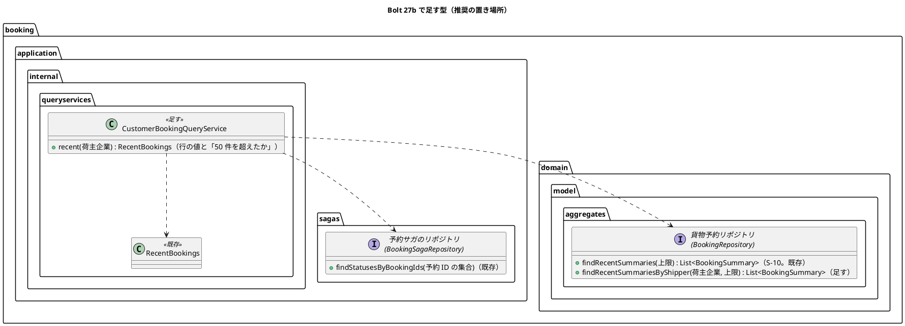
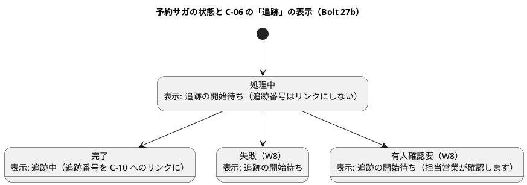
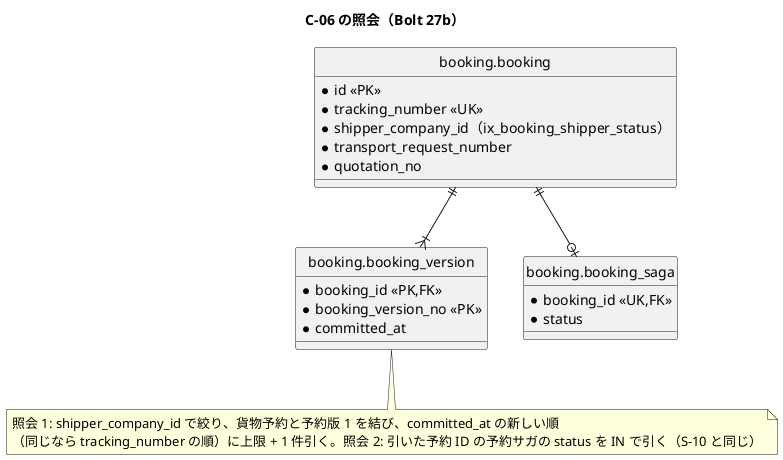
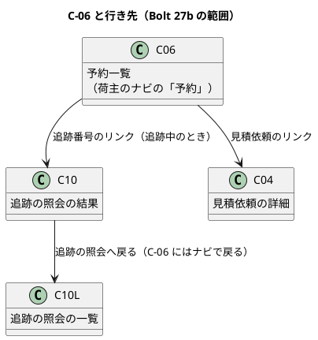

# Bolt 27b 計画 - C-06 予約一覧の最小の表示（荷主）

## 基本情報

| 項目 | 内容 |
| :--- | :--- |
| Bolt | 第 27b 回（Bolt 27 の終了報告の承認の場で、荷主のナビの「予約」が準備中のままと指摘され、2026-10-10 に human:kakimomokuri が足すと決めた） |
| 予定 | W4（Bolt 28 の前）、作業 2.5〜3 時間（承認ゲートの待ち時間を除く） |
| 対象 | U6 予約管理（C-06 予約一覧、貨物予約リポジトリの荷主企業の照会、荷主のナビの「予約」） |
| GitHub | Issue なし（Bolt 27 の承認の場の指摘を返す画面の補い。SP 0。Bolt 25b の前例）。受入動画は #10（US-04。確定した予約を荷主が確かめる）に添付する。C-06 の本体（絞り込み、C-07 予約の詳細、変更・取消申請の状況）は US-05（W11） |
| 承認ゲートの扱い | 人の指示（ステップ 1 の画面のゲートの承認のとき、2026-10-10）により、ステップ 2 以後の承認ゲートで止まらずに進める。止まらなかったゲートごとに根拠を書き、終了報告の承認の議題に置く（T-36）。終了報告では止める |
| 承認ゲート | 計画の承認（確認ポイント 1〜16）、画面、Red／Green ごと（照会と開示制御）、認可、開発レビューの判断、終了報告。スキーマは変えないので、スキーマのゲートはない。認可は確認必須なので、計画の承認で判断を受ける（T-80。確認ポイント 8） |
| アプローチ | アウトサイドイン（開発戦略の「既存の集約に受入条件を足す」。新しい集約・スキーマは作らない）。画面の層の受入シナリオ → 荷主の照会 → 画面と認可 → 永続化の順 |
| 前の Bolt | [Bolt 27 終了報告](bolt_27_report.md) |

## Bolt ゴール

荷主担当者が荷主のナビの「予約」を開くと、自社の本予約の一覧（C-06 の最小の表示）が新しい順に出る。各行は追跡番号・見積依頼（業務番号と見積り）・確定時刻・追跡を示す。追跡が始まっていれば追跡番号のリンクで C-10 の照会の結果を開け、見積依頼のリンクで C-04 を開ける。他社の予約は出ない（BR-07）。荷主のナビの準備中の項目は問い合わせ・通知だけになる。これを画面の層の受入シナリオ（キー操作だけ、幅 320 CSS px、axe-core 0 件）と、開示の Web テスト・統合テストで確かめる。

### 確かめたい仮説

| # | 仮説 | この Bolt で分かること |
| :--- | :--- | :--- |
| H1 | 荷主の一覧は、S-10 の 2 本の照会（予約の要約、予約サガの状態の IN）に荷主企業の条件を足すだけで引け、開示制御（自社だけ）を照会の入口に閉じ込められる。画面は企業を比べない | 照会のサービスの単体テストで、他社の予約が返らないことと、照会がそれぞれ 1 回であること。コントローラーに企業の比較がないこと |

## ふりかえりと前の Bolt からの引き継ぎ

| 入力 | 内容 | この Bolt での扱い |
| :--- | :--- | :--- |
| Bolt 27 の承認の場の指摘 | 荷主のナビの「予約」（C-06）が準備中のまま。どの週の計画にもなかった | この Bolt の目的 |
| Bolt 25b の入れないもの | 荷主の予約一覧（荷主の照会の Bolt 27 以後） | この Bolt で作る（S-10 の照会と画面の部品を使う） |
| Bolt 27 の決定 | C-10 の照会の結果は `GET /customer/tracking-records/{追跡番号}`。追跡が始まっていない番号は 404 の案内になる | 追跡が始まるまでは追跡番号をリンクにしない（確認ポイント 3） |
| Bolt 27 の既知の課題 | ほかの画面の 404 は既定のエラーページのまま | 扱わない（C-06 は一覧だけで、URL に番号を取らない） |
| Bolt 25 の U-6・Bolt 25b の決定 | 追跡の開始の表示は共通部品「処理中表示」（処理中・完了・有人確認要。失敗は処理中） | 荷主の語に直して使う（確認ポイント 4） |
| Bolt 25b の既知の課題（人の判断、未決） | 幅 320 CSS px での確定時刻の列の表記（一覧だけ短い表記にするか） | C-06 は荷主の日時表示（UTC を併記しない）なので S-10 より短い。決めずに同じ部品を使い、幅 320 CSS px のシナリオで横スクロールが出ないことを確かめる |
| Bolt 23b の U-9 | 追跡番号の区切りの表示 | 入れない（C-10 の入力は区切りを受け付けるが、表示は区切りなし） |
| Try T-79〜T-84 | 結果の数え方、確認必須のゲートは計画の承認で、スキーマの Red、ステップ定義の注釈は 1 つ・ファイルは Write、骨組みを直したら流し直す、ステップのファイルだけをステージ | 全ステップ。T-80 は確認ポイント 8（認可）、T-81 はスキーマを変えないので当たらない、T-83 はステップ 1 の Red、T-84 は各コミット |
| Try T-85（Bolt 27） | 本文や状態を比べるテストは、比べる値が空や既定値でないことも確かめる。土台で値が変わるものは統合テストで確かめる | ステップ 3: 他社の予約が出ないことは、照会のサービスの単体テストと PostgreSQL の統合テストで確かめ、画面の単体テストは「出ていないこと」だけに頼らない（自社の行が出ていることと組にする） |
| Try T-86（Bolt 27） | 画面の文言を変えたら、`src/test` 全体（ステップ定義の定数を含む）でその文言を検索してから `uiTest` を流す | ステップ 3: 準備中の画面の文言・ナビのテストを探す |
| Try T-39・T-57・T-61・T-69・T-70・T-72 | Red は本命のアサーション、状態の列挙の表示の網羅、メモリのリポジトリは写しを返す、案内の文言は先の画面があるか確かめる、レビューの対応の後も push の前に `uiTest`、画面の層のシナリオを先に | T-57: `BookingSagaStatus` の 4 つの値の荷主の表示を画面の単体テストで網羅する。T-69: 空のときの案内は、担当営業が確定すると出ることを示す（先の画面はない）。ほかは全ステップ |

## スコープ

### 設計の約束（Try T-1）

- C-06 は荷主の本予約の最小の一覧で、絞り込み・ページ送り・C-07 予約の詳細は作らない。確定時刻の新しい順（同じ時刻なら追跡番号の順）に最大 50 件を示し、50 件を超えたら「新しい 50 件だけを示しています。」と示す（S-10 と同じ。確認ポイント 5）
- 荷主企業での絞り込みは、リポジトリの SQL（`WHERE b.shipper_company_id`）で行う。照会のサービスは荷主用に分け、コントローラーは企業を比べない（Bolt 27 の C-10 の前例。BR-07）
- 予約サガの状態は S-10 と同じく、照会のサービスが件数の上限の中の IN でまとめて引く。予約サガのない予約は不変条件の違反として例外にする
- 荷主に社内の識別子（予約 ID、予約サガの状態の英語の値）を出さない。日時は荷主の日時表示（UTC を併記しない）
- 準備中の画面の `/customer/bookings` を C-06 に置き換え、`PlaceholderController` の荷主の画面の表と `@GetMapping` の正規表現（`bookings|inquiries|notifications`）の両方から `bookings` を外す（問い合わせ・通知は残す）。Javadoc の「追跡の照会は C-10 に置き換えた（Bolt 27）」に予約を足す
- C-10 と C-04 へのリンクは URL の文字列（`/customer/tracking-records/{追跡番号}`・`/customer/transport-requests/{業務番号}`）で組み立て、追跡・見積りの型を参照しない。「追跡中」は予約サガの完了（`COMPLETED`）から出し、追跡の照会を呼ばない。`booking` の `allowedDependencies`（`shared`、`quotation :: api`、`platform :: web`）は変えない（BC の独立）
- スキーマは変えない（既存の索引 `ix_booking_shipper_status` で荷主企業を絞れる。確認ポイント 6）

### 入れるもの・入れないもの

| 入れる | 入れない（後の Bolt） |
| :--- | :--- |
| C-06 の最小の表示（追跡番号・見積依頼・確定時刻・追跡）、行から C-10 の照会の結果と C-04 へのリンク | 絞り込み・ページ送り・C-07 予約の詳細・変更・取消申請の状況（US-05、W11）、確認書（C-13）、荷受人の招待（US-19） |
| 貨物予約リポジトリの荷主企業の要約の照会、荷主用の照会のサービス | 荷受人の予約の照会（荷受人には C-06 を出さない。ナビは「ホームと追跡の照会だけ」） |
| 荷主のナビの「予約」を C-06 に向け、準備中から外す | C-04 から予約への導線（UI 設計の「予約があれば予約へのリンク」。C-07 を作る W11 で） |
| 画面の層の受入シナリオ（デモ項目 `@demo @demo-bolt-27b/customer-booking-list`） | ほかの画面の 404 の案内（Bolt 27 の既知の課題） |

## 設計（この Bolt の範囲）

### ドメインモデル

新しい集約・値オブジェクトはない。S-10 の予約の要約（`BookingSummary`）をそのまま使い、リポジトリに荷主企業の口を足す。

### 状態遷移

状態を変える処理はない（照会だけ）。予約サガの状態の荷主の表示（「追跡」の列）は次のとおり（T-57。確認ポイント 4）。

### データモデル

スキーマは変えない。一覧の照会は S-10 と同じ 2 本で、1 本目に荷主企業の条件を足す。

### 画面遷移

| 画面 | URL | この Bolt で決めること |
| :--- | :--- | :--- |
| C-06 予約一覧（荷主） | `GET /customer/bookings` | 見出し「予約一覧」。表の caption「確定した予約（確定時刻の新しい順）」、横スクロールの囲み（`.table-scroll`、`role="region"`、`aria-labelledby` で caption に結ぶ。S-10・C-10 と同じ）。列は追跡番号（追跡中なら C-10 の照会の結果へのリンク、追跡の開始待ちなら文字だけ）・見積依頼（業務番号「TR-2026-0001」を C-04 へのリンクにし、続けて「見積 1」。リンクの名前を行き先の見積依頼にそろえる。確認ポイント 15）・確定時刻（最初の確定の時刻。荷主の日時表示）・追跡（「追跡中」「追跡の開始待ち」「追跡の開始待ち（担当営業が確認します）」）。予約がなければ「確定した予約はまだありません。担当営業が本予約を確定すると、ここに出ます。」。50 件を超えたら「新しい 50 件だけを示しています。」 |

## ステップ計画

状態の記号: `[ ]` 未着手、`[-]` 進行中、`[?]` 承認待ち、`[x]` 完了。各ステップの終わりに `check` が緑であることと、計画からの変更を設計文書に反映したこと（T-53）を確かめ、Green と同じ push にまとめて CI を確かめる（T-26、T-65）。コミットの前に、そのステップのファイルだけをステージしているか確かめる（T-84）。Red は実行して本命のアサーションで失敗することを確かめてから実装し、骨組みや待ち方を直したら流し直す（T-39、T-83）。

- [x] **1. 画面の層の受入シナリオ** 【承認ゲート: 画面】
  - `features/ui/confirm_booking_ui.feature` に 2 本を足す（背景と `BookingUiSteps` の確定のステップ、追跡の開始の完了を待つ既存のステップ（`BookingUiSteps`）を再利用する。デモと幅を分けるのは前例どおりで、受入動画を幅 320 CSS px で撮らないため）: (a) `@demo @demo-bolt-27b/customer-booking-list @US-04-AC1`: 営業担当者が本予約を確定し、追跡の開始が完了したあと、荷主担当者が荷主のナビの「予約」を開くと、確定した予約が一覧の先頭に「追跡中」で出て、ナビの「予約」が現在の項目として示される。追跡番号のリンクで C-10 の照会の結果を開ける。(b) 幅 320 CSS px で C-06 が横スクロールなしで読める。キー操作だけ、axe-core 0 件
  - 既存の「追跡の開始が完了するのを待つ」ステップ（`BookingUiSteps`）は社内の S-24 で待つだけなので、荷主担当者に切り替えて C-06 を開く新しいステップが要る。荷主担当者として C-06 を開くステップと一覧の行を確かめるステップは、新しいステップ定義のクラス `ui/CustomerBookingUiSteps` に置く（C-10 の `CustomerTrackingUiSteps` の前例。注釈は 1 文に 1 つ。T-82）
  - 既存のシナリオを直す: `login_ui.feature` の「まだ作っていない画面をナビから開くと準備中と示される」が選ぶ項目を「予約」から「問い合わせ」に変える（C-06 に置き換えると落ちる。T-86）
  - 骨組み（C-06 の見出しだけ）で `uiTest` を流し、本命のアサーション（一覧の行）で落ちることを確かめる（T-72・T-83。絞り込みが効いたかは実行の件数で確かめる。T-79）
  - 完了の判定: シナリオが本命のアサーションで落ちる、T-53
  - 結果（2026-10-10）
    - `confirm_booking_ui.feature` に 2 本（`@demo @demo-bolt-27b/customer-booking-list @US-04-AC1`、幅 320 CSS px の `@US-04-AC1`）。ステップ定義は `ui/CustomerBookingUiSteps`（荷主担当者に切り替えて C-06 を開く、一覧の先頭の行、追跡番号から C-10 の結果を開く）
    - Red: 骨組み（`CustomerBookingController` と C-06 の見出しだけ、`PlaceholderController` から予約を外した）で `uiTest` を流し、新しい 2 本が本命のアサーション（一覧の表の行がない）で落ちた。`login_ui.feature` の準備中のシナリオも計画どおり落ちたので、選ぶ項目を「問い合わせ」に直した（T-86）。実行時間のある方の XML で 76 本が通り、失敗 3（T-79）
- [x] **2. 荷主の照会（単体テスト）** 【承認ゲート: Red／Green（照会と開示制御）】
  - 単体テストを先に書く: `CustomerBookingQueryService.recent(荷主企業)` は自社の予約だけを新しい順に上限まで返し、50 件を超えたかを示す。他社の予約は返らない。要約と予約サガの状態をそれぞれ 1 回の照会で引く（仮説 H1）。予約サガのない予約は例外。メモリのリポジトリの荷主企業の照会は写しを返す（T-61）
  - `BookingRepository.findRecentSummariesByShipper`、`RecentBookings` の組み立て（上限の判定。確認ポイント 7）、`CustomerBookingQueryService`、組み立て（`BookingConfiguration`）、貨物予約リポジトリの仮の実装の 2 つ（`acceptance/InMemoryBookingRepository`、`RandomTrackingNumberIssuerTest` の中の仮の `BookingRepository`）
  - 完了の判定: `check` 緑、T-53
  - 結果（2026-10-10）
    - Red: 照会のサービスの単体テスト 7 件を骨組み（空を返す）で流し、5 件が本命のアサーションで落ちた（他社だけで空・行の項目の見張りの 2 件は骨組みでも通る見張り）。層の規則（`LayerArchitectureTest`）で `@Service` の印が要ることも分かった
    - Green: `BookingRepository.findRecentSummariesByShipper`、`RecentBookings.LIMIT` と `RecentBookings.of`（上限・1 件多く引く・予約サガの状態の IN・予約サガのない予約の例外を集めた。`BookingQueryService.recent` も使う）、`CustomerBookingQueryService`、`BookingConfiguration`、メモリのリポジトリ（S-10 と並べ方を共有）、`RandomTrackingNumberIssuerTest` の仮の実装。リポジトリの MyBatis の実装はステップ 4 までの骨組み（未実装の例外）
    - 承認ゲートの扱い（T-36）: Red／Green（照会と開示制御）のゲートで止まらずに進めた（人の指示）。根拠は、置き場所と引き方が確認ポイント 7 のとおりであること
- [x] **3. 画面と認可（Web テスト）** 【承認ゲート: 画面、認可】
  - 画面の単体テストを先に書き、実装の前に流して Red を確かめる: 一覧の列と並び、追跡の 4 つの状態の表示とリンクの有無（T-57）、見積依頼のリンク、荷主の日時表示（UTC を併記しない）、予約がないときの文言、50 件を超えたときの文言、予約サガの状態の英語の値と UTC の併記が出ないこと（自社の行が出ていることと組にする。T-85）。照会の結果の型（`RecentBookings` の行）が予約 ID などの社内の識別子を持たないことは、型の部品名を許可した一覧と比べる見張りのテストで確かめる（Bolt 27 の P-2。もともと持たない値を画面で探すテストにしない）
  - セキュリティの統合テスト: 荷主担当者は `/customer/bookings` を開け、ナビの「予約」が準備中でなくなり現在の項目になる（ナビの変更の前に書いて Red を確かめる。Bolt 27 の議題 3 の再発防止）。社内の役割は 403
  - `CustomerBookingController`（`booking.interfaces.web`）、`BookingViews` の荷主の表示、`templates/booking/bookings/list.html`（荷主の画面の前例 `quotation/transport-requests/*`・`tracking/tracking-records/*`）、`PlaceholderController` の荷主の表から予約を外す。準備中の画面の文言のテストを `src/test` 全体で探して直す（T-86）
  - 完了の判定: `check` 緑、T-53
  - 結果（2026-10-10）
    - Red: 画面の単体テスト 7 件（列と並び、追跡の 3 つの状態の表示とリンクの有無、英語の値と UTC の併記が出ない、空、上限）を実装の前に流し、7 件とも落ちた。テストの追跡番号に使えない文字（L）を入れていたので直した
    - Green: `CustomerBookingController`（企業を比べない）、`BookingViews.customerList`・荷主の追跡の表示、`templates/booking/bookings/list.html`
    - セキュリティの統合テスト（荷主は C-06 を開けてナビの「予約」が現在の項目、社内の役割は 403）は、ステップ 1 の Red のために C-06 の骨組みと準備中の画面の変更を先に入れたので、最初から通った（Red を確かめていない。終了報告の議題）。うち 1 件はリポジトリの MyBatis の骨組みで落ち、ステップ 4 で通った
    - 承認ゲートの扱い（T-36）: 画面のゲートは止まらずに進めた（人の指示）。認可のゲートは確認ポイント 8 を計画の承認で人が決めてある（T-80）
- [x] **4. 永続化（PostgreSQL の統合テスト）** 【承認ゲート: Red／Green（照会と開示制御）】
  - 統合テストを先に書く: 荷主企業の要約は自社の予約だけを新しい順（同じ時刻は追跡番号の順）に上限まで返す、他社の予約は出ない
  - マッパーの `findRecentSummariesByShipper`（S-10 の SELECT に `WHERE b.shipper_company_id = #{shipperCompanyId}`。結果の対応は既存の `bookingSummaryRow`。T-71）。AT-04 の自スキーマの検査を通す
  - 完了の判定: `check`・`uiTest` 緑（ステップ 1 のシナリオが通る）、T-53
  - 結果（2026-10-10）
    - Red: 統合テスト 1 件（荷主企業の要約だけを新しい順・同じ時刻は追跡番号の順に上限まで、他社の予約は出ない）を先に書いた。Red は骨組みの未実装の例外で落ち、本命のアサーションではなかった（Bolt 25b のステップ 3 と同じ。終了報告の議題）
    - Green: マッパーの `findRecentSummariesByShipper`（S-10 の SELECT に `WHERE b.shipper_company_id`）、リポジトリの実装（要約の組み立てを S-10 と共有）。AT-04 の検査は通った
    - `check`・`documentationTest` 緑。`uiTest` は実行時間のある方の XML で 79 本（+2）が通り、失敗 0（T-79）
    - 承認ゲートの扱い（T-36）: Red／Green（照会と開示制御）のゲートは止まらずに進めた（人の指示）
- [x] **5. 開発レビューと終了報告** 【承認ゲート: 開発レビューの判断、終了報告】
  - `developing-review`（プログラマー（テスター・アーキテクトの観点を含む）とインタラクションデザイナー（ユーザー代表の観点を含む））、SonarQube（`sonar-local:check`）、受入動画（`./gradlew demoVideo`。過去の Bolt の動画は元に戻す）、`bolt_27b_report.md`
  - 設計文書（T-53）
    - ui_design.md: URL の表に C-06 の行、画面一覧の C-06 の行（Bolt 27b の範囲と、対応に US-04）、共通部品「処理中表示」の行に荷主の語（C-06 の「追跡の開始待ち」「追跡中」）、顧客 Web の画面遷移図（予約一覧 → 追跡の結果・詳細）、準備中の画面の行（荷主の準備中は問い合わせ・通知）、ナビの実装の段落
    - domain_model.md: リポジトリの表の予約の行に荷主企業の要約の照会（BR-07）。予約の節に荷主の照会の段落（`CustomerBookingQueryService` で荷主企業を絞って BR-07 を守る。追跡の前例と同じ）。`BookingSummary`・`RecentBookings` の Javadoc に C-06 でも使うことを足す
    - data_model.md: 索引の表の `booking.booking` の行に、`ix_booking_shipper_status` を C-06（Bolt 27b）で使い始め、索引は足さないことを足す
    - test_strategy.md: 顧客向けの開示テストに C-06（他社の予約が出ない）
    - release_plan.md: W4 の 27b の行の結果と進捗（承認ゲートと局面の列挙は開始準備の同期で直してある）
  - 終了報告の承認の後に、受入動画の添付先（`ops/scripts/issue_demo.js` の `BOLT_ISSUES` と手順書の表）に `bolt-27b → #10` を足して添付する。支援技術による手動確認は終了報告の議題に置く（人が行う）
  - 開発レビューの対応の後も push の前に `uiTest` を流す（T-70）
  - 結果（2026-10-10）
    - 2 つの観点でレビューした（プログラマー: 必須 0・推奨 4・任意 7、インタラクションデザイナー: 必須 1（UI 設計の反映。レビューの時点ではまだだった）・推奨 4・任意 4）。計画からの変更: caption を「自社の確定した予約（確定時刻の新しい順）」、列名「追跡」を「追跡の状況」に（C-10 の「現在の状態」と取り違えない）、表の前にリンクになる行とならない行が混ざる理由と開始待ちが一時的なことを示す 1 文、上限の文言に次の一手（追跡の照会）、空のときに見積依頼の一覧への道。コードは上限と「1 件多く引く」を `RecentBookings.of` に集め、見積りの表記と「追跡中」の判定を 1 か所に、表示の部品の名前を `customerTracking` に、社内の役割の 403 を役割ごとのテストに、既定値どうしの比較を消した（T-85）
    - 設計文書（T-53）: ui_design.md（URL の表・画面一覧・処理中表示・画面遷移図・準備中の画面）、domain_model.md、data_model.md、test_strategy.md、`BookingSummary`・`RecentBookings` の Javadoc
    - SonarQube: 新しい指摘 1 件（上限の定数の名前）で FAIL だったので直し、PASS。受入動画を撮った（過去の Bolt の動画は元に戻した）。終了報告は [Bolt 27b 終了報告](bolt_27b_report.md)

### 時間の配分と打ち切り

| # | 目安 | 打ち切り |
| :--- | :--- | :--- |
| 1 | 30 分 | 時間を超えたら幅 320 CSS px の確認を後に回す（画面の単体テストで列は確かめる） |
| 2 | 30 分 | 削らない（開示） |
| 3 | 50 分 | 時間を超えたら 50 件を超えたときの文言を後に回す（開示のテストは削らない） |
| 4 | 20 分 | — |
| 5 | 45 分 | — |

## 確認ポイント（計画の承認の場でまとめて確認する。Try T-6）

| # | 確認すること | ステップ | 推奨 |
| :--- | :--- | :--- | :--- |
| 1 | アプローチ | 全体 | アウトサイドイン（既存の集約の照会を足す。新しい集約・スキーマは作らない） |
| 2 | **C-06 の URL と置き場所** | 3 | `GET /customer/bookings`（準備中の画面の URL をそのまま使う。URL の決まりの「領域の下に資源の複数形」）。コントローラーは `booking.interfaces.web.CustomerBookingController`、テンプレートは `booking/bookings/list.html`（社内は `booking/staff/bookings/*`。荷主の画面の前例 `quotation/transport-requests/*`・`tracking/tracking-records/*` と同じ形） |
| 3 | **行の行き先** | 3 | 追跡が始まっていれば追跡番号を C-10 の照会の結果へのリンクに、始まっていなければ文字だけにする（追跡記録がまだないと C-10 は 404 の案内になり、打ち間違いと区別できないため）。見積依頼は C-04 へのリンク。C-07 予約の詳細は作らない（W11）。代わりの案は、(b) いつも C-10 へリンクする（準備中だと 404 になる）、(c) リンクを置かず追跡番号だけを示す |
| 4 | **追跡の列の荷主の表示**（T-57） | 3 | 完了 → 「追跡中」、処理中・失敗 → 「追跡の開始待ち」、有人確認要 → 「追跡の開始待ち（担当営業が確認します）」。「準備中」は準備中の画面（「この画面は準備中です」）の語なので使わない（詳細の検証の指摘）。社内の S-10 の「追跡の開始」（処理中・完了・有人確認要）は社内の語なので、荷主には「追跡」の列で貨物の側の状態として示す（共通部品「処理中表示」の考え方: 失敗は利用者に処理中と示し、有人確認要は人が確認することを示す） |
| 5 | 件数の上限と並び | 2・4 | S-10 と同じ。最大 50 件、確定時刻（予約版 1）の新しい順、同じ時刻は追跡番号の順。50 件を超えたら文言で示す |
| 6 | 索引 | 4 | 足さない。既存の `ix_booking_shipper_status`（`shipper_company_id`、`status`）で荷主企業を絞れる。確定時刻の並びの索引は W11 の一覧の本体で決める（Bolt 25b の決定のまま） |
| 7 | **照会の入口** | 2 | 荷主用の照会のサービス `CustomerBookingQueryService`（`booking.application.internal.queryservices`）を分け、リポジトリの SQL で荷主企業を絞る（Bolt 27 の `CustomerTrackingQueryService` の前例）。結果の型は S-10 の `RecentBookings` をそのまま使う（同じ形の型を重ねない。Bolt 23b の A-低4）。上限（50）と「上限を超えたか」の組み立ては、Bolt 27 の `RecentTrackingRecords.of` の前例にならって `RecentBookings` に寄せ、`BookingQueryService` と新しい照会のサービスで重ねない（Bolt 25b の P-2、Bolt 27 の P-7）。代わりの案は、既存の `BookingQueryService` に荷主企業を引数に取る口を足す（社内と荷主の照会が 1 つのクラスに混ざる） |
| 8 | **認可（T-80。確認必須）** | 3 | `SecurityConfiguration` は変えない（`/customer/**` は荷主担当者だけ。既存の規則）。`PlaceholderController` の荷主の表から予約を外し、荷主のナビの「予約」は既存のキー `bookings` のまま C-06 を指す。荷受人の画面は R1.1（US-10）で、いまは荷受人の役割もナビもない（`Role` にない） |
| 9 | 業務のルールの層のシナリオ | — | 足さない。C-06 は既存の予約の照会で、業務のルールを足さない（Bolt 25b の前例）。開示（自社だけ）は照会のサービスの単体テスト・PostgreSQL の統合テスト・画面の単体テストで確かめる |
| 10 | 画面の層のシナリオの置き場所とタグ | 1 | `confirm_booking_ui.feature` に足す（背景と確定のステップを再利用する。Bolt 25b と同じ）。タグは `@US-04-AC1`（確定した予約を確かめる。受入条件の数の照合に入れる） |
| 11 | 受入動画の添付先 | 5 | #10（US-04。クローズ済みの Issue にもコメントできる。Bolt 25b と同じ）。終了報告の承認の後に添付先の表に足す |
| 12 | 荷主の準備中の画面 | 3 | 予約を外し、問い合わせ・通知は残す |
| 13 | 承認ゲート | 全体 | 基本情報のとおり各ゲートで止める。開始準備の同期で、release_plan の W4 の Bolt 27b の行の承認ゲートを「画面、Red・Green ごと（照会と開示制御）、認可」に直し、W4 の「局面とアプローチ」のアウトサイドインの列挙に 27b を足す |
| 14 | ユーザーマニュアル | — | 作らない（W4 の完了の後に `docs/manual` を作る。C-06 は荷主の章に入れる） |
| 15 | 見積依頼の列とリンクの名前 | 3 | 列名は「見積依頼」、業務番号「TR-2026-0001」を C-04 へのリンクにし、続けて「見積 1」を文字で示す（S-10 の列名「見積り」・表記「TR-2026-0001 見積 1」と違うのは、荷主のリンクの行き先が見積依頼の詳細 C-04 で、リンクの名前を行き先にそろえるため） |
| 16 | C-10 から C-06 への戻り | 3 | 足さない。C-10 の結果の「追跡の照会へ戻る」は C-10 の一覧に戻る（Bolt 27 の決定）。C-06 にはナビの「予約」で戻れる。どこから来たかで戻り先を変える仕組みは作らない |

## 完了条件

- [x] 画面の層の受入シナリオ（`@demo-bolt-27b/customer-booking-list`）が通り、受入動画を撮った
- [x] 照会のサービスの単体テストで、自社の予約だけを 2 本の照会で引けることを確かめ（仮説 H1）、PostgreSQL の統合テストで荷主企業の絞り込みと並びと上限を確かめた
- [x] 画面の単体テストで、列・追跡の 4 つの状態の表示とリンク・空・上限・社内の識別子が出ないことを確かめた。セキュリティの統合テストで、荷主の可否・ナビの「予約」・社内の役割の 403 を確かめた
- [x] `check`・`documentationTest`・`uiTest` が緑。push して CI とデモ環境の配備を確かめた
- [x] SonarQube の Quality Gate が PASS
- [x] 設計文書（ステップ 5 の一覧）に決定を書いた（T-53）
- [x] 開発レビューと終了報告。承認の後に受入動画を #10 に添付した。支援技術による手動確認は人が行う

### デモ項目

営業担当者が本予約を確定し、追跡が始まったあと、荷主担当者が荷主のナビの「予約」を開くと、確定した予約が一覧の先頭に「追跡中」で出て、追跡番号のリンクで追跡の照会の結果を開ける（`@demo @demo-bolt-27b/customer-booking-list`）。

## 更新履歴

| 日付 | 更新内容 | 更新者 |
| :--- | :--- | :--- |
| 2026-10-10 | 終了報告を承認し、完了条件をすべて満たした（CI 緑、SonarQube PASS、受入動画、支援技術による手動確認は問題なし） | anthropic/claude-opus-5-5、承認 human:kakimomokuri |
| 2026-10-10 | ステップ 1〜5 の結果を記録した。開発レビューで列名を「追跡の状況」、caption を「自社の確定した予約」に変え、表の前の案内・上限の次の一手・空のときの道を足した | anthropic/claude-opus-5-5 |
| 2026-10-10 | ステップ 1 の画面のゲートを承認した。以後のゲートは止めずに進め、終了報告で止める | anthropic/claude-opus-5-5、承認 human:kakimomokuri |
| 2026-10-10 | 計画を承認した（確認ポイントはすべて推奨のとおり。確認必須の認可（確認ポイント 8）は事前に判断を受けた。T-80） | anthropic/claude-opus-5-5、承認 human:kakimomokuri |
| 2026-10-10 | 開始準備の整合性検証（計画と設計 12 件、横断 11 件）の指摘を反映した。主な修正は次のとおり。 - 準備中の画面: `login_ui.feature` の準備中のシナリオの項目を直す、`@GetMapping` の正規表現からも外す。 - 追跡の列の語: 「準備中」をやめ「追跡の開始待ち」に。 - 上限の判定: `RecentBookings` に寄せて重ねない。 - BC の独立: リンクは URL の文字列、`allowedDependencies` は変えない。 - 画面の層: デモと幅 320 CSS px のシナリオを分ける、荷主に切り替えるステップ。 - 社内の識別子: 型の部品名の見張りのテスト。 - 確認ポイント 15（見積依頼の列とリンクの名前）・16（C-10 からの戻り）を足した。 - 引き継ぎ: Bolt 25b の確定時刻の表記（未決）。 - 設計文書の反映の一覧（処理中表示、予約の節、索引、Javadoc）。 - 承認ゲートと局面の列挙は開始準備の同期で release_plan を直す。 | anthropic/claude-opus-5-5 |
| 2026-10-10 | 初版作成（承認待ち） | anthropic/claude-opus-5-5 |

## 関連ドキュメント

- [リリース計画](release_plan.md)（W4）
- [Bolt 27 終了報告](bolt_27_report.md)、[Bolt 25b 計画](bolt_25b_plan.md)
- [UI 設計](../../design/cargo-tracker/ui_design.md)（C-06、C-10、準備中の画面、共通部品）
- [データモデル](../../design/cargo-tracker/data_model.md)（`booking`、索引）
- [ドメインモデル](../../design/cargo-tracker/domain_model.md)（予約、リポジトリ）
- [開発戦略](development_strategy.md)
