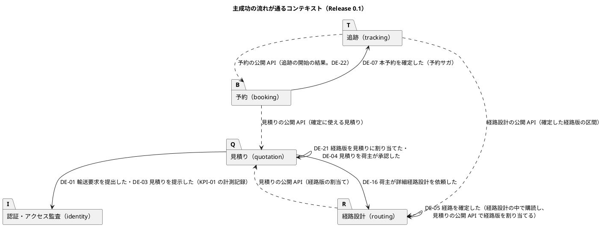
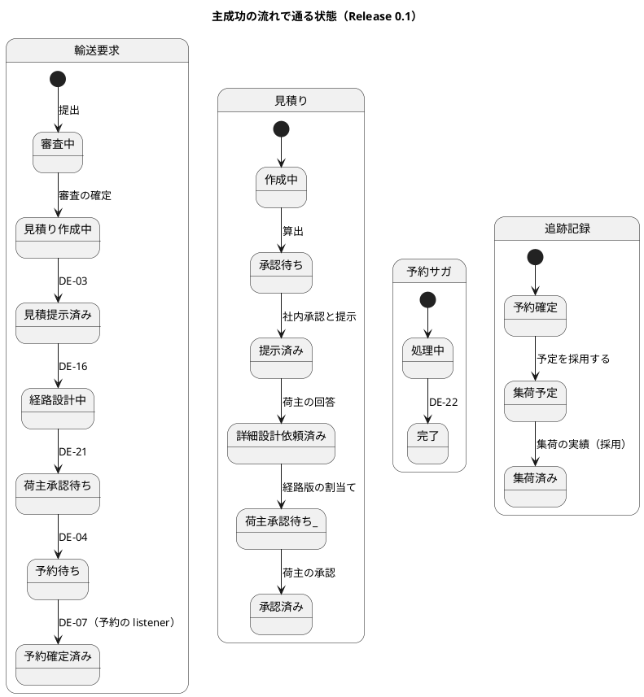
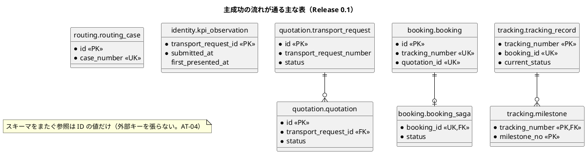
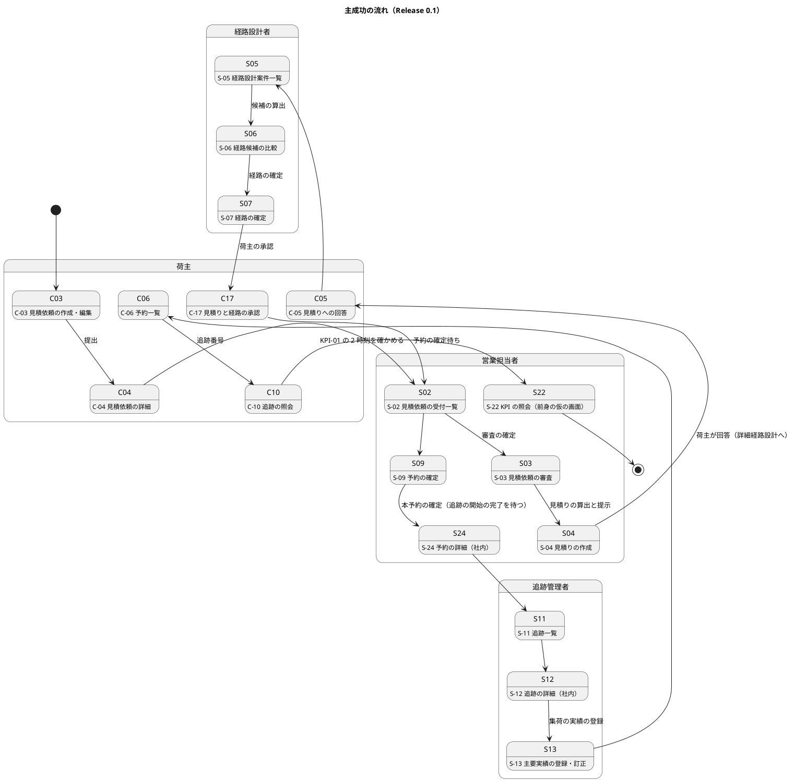

# Bolt 28 計画 - 主成功の流れの `@ui` シナリオと Release 0.1 のデモ

## 基本情報

| 項目 | 内容 |
| :--- | :--- |
| Bolt | 第 28 回（W4 の最後の Bolt。Release 0.1 の締めの Bolt） |
| 予定 | W4（2026-10-26 の週。前倒しで 2026-10-10 から）、作業 2.5〜3.5 時間（承認ゲートと社内デモの待ち時間を除く） |
| 対象 | 横断（画面の層の主成功の流れ、受入条件とシナリオの照合、Release 0.1 のリリース条件の確認、社内デモ） |
| GitHub | Issue を 1 件作る（確認ポイント 2。題名「[技術] 主成功の流れの @ui シナリオと Release 0.1 のデモ」、ラベル `technical`、マイルストーン「Release 0.1 最初の縦の流れ」、W4、SP 0。#36〜#41 の前例）。受入動画を添付し、社内デモの結果をコメントして閉じる |
| 承認ゲート | 計画の承認（確認ポイント 1〜13）、社内デモ（人が流れを確かめる。Release 0.1 のリリース条件）、終了報告。release_plan の W4 の決定（「`/goal` で止めずに進めるのは Bolt 22 と Bolt 28（`@ui` とデモ）だけ」）に従い、ステップ 1〜3 のゲートは止めずに進め、根拠を終了報告の議題に置く（T-36）。スキーマと認可は変えない |
| アプローチ | アウトサイドイン（開発戦略の序盤の最後の手順「主成功の流れの `@ui` シナリオを通す」「Release 0.1 のデモ」）。新しい業務の振る舞いは作らない |
| 前の Bolt | [Bolt 27b 終了報告](bolt_27b_report.md)、[Bolt 27 終了報告](bolt_27_report.md) |

## Bolt ゴール

一般貨物 1 件が、荷主の提出 → 営業の審査と見積りの作成・提示 → 荷主の回答（詳細経路設計へ） → 経路設計者の経路の確定 → 荷主の承認 → 営業の本予約の確定 → 追跡の開始 → 追跡管理者の実績の登録 → 荷主の予約一覧と追跡の照会まで画面で縦に通り、KPI 計測記録に KPI-01 の 2 時刻（提出時刻と最初の提示時刻）が残ることを、1 本の画面の層のシナリオ（主成功の流れ。axe-core 0 件）で確かめる。あわせて、Release 0.1 の範囲の受入条件ごとにシナリオがあることを機械で照合し、Release 0.1 のリリース条件をすべて確かめ、社内デモで human:kakimomokuri が流れを確かめる。

### 確かめたい仮説

| # | 仮説 | この Bolt で分かること |
| :--- | :--- | :--- |
| H1 | W1〜W4 の Bolt で作った画面の層のステップ定義だけで、主成功の流れを 1 本のシナリオとして組める（新しいステップ定義も本番のコードも要しない。開始準備の検証で、提示の手順が審査の確定を含むことなどを確かめ、見込みは 0 個） | 主成功の流れのシナリオに、新しいステップ定義がいくつ要ったか。本番のコードの変更が 0 か |
| H2 | Release 0.1 の範囲の受入条件（マイルストーンの Issue の題名の範囲）に、すべて `@US-nn-ACm` のシナリオ（またはテスト戦略が認めたセキュリティの統合テストへの移し先）がある | 照合のテストが通ること。手作業の突き合わせ（開始準備で実施）と同じ結果になること |

## ふりかえりと前の Bolt からの引き継ぎ

| 入力 | 内容 | この Bolt での扱い |
| :--- | :--- | :--- |
| 開発戦略の序盤の完了条件 | W1〜W4 のデモ項目の受入シナリオが通る、ナビゲーションの骨格の E2E、主成功の流れの `@ui`、AT-01〜06、JIG と Modulith の生成物、Release 0.1 のリリース条件 | ステップ 3 で 1 項目ずつ確かめ、終了報告に根拠を表で示す |
| Release 0.1 のリリース条件（リリース計画） | 範囲の受入シナリオがすべて通る、主成功の流れの `@ui` 1 本、AT-01〜06、H2 で起動でき PostgreSQL の統合テストが通る、社内デモで human:kakimomokuri が確かめる | ステップ 1〜4 |
| Bolt 2 のレビュー R-17（持ち越し） | 受入条件の数との照合（テスト戦略の「CI で受入条件の数と照合して確かめる（ADR-009 のコンプライアンス）」）が未実装。Bolt 4・5 で移し先を決めたまま実装されていない | ステップ 2 で作る（確認ポイント 1） |
| 画面の層の後片付けのフックの漏れ（開始準備の検証） | 航海を消す After フックの条件が `(@US-06 or @US-07 or @US-12 or @US-09) and @ui` で、`@US-04` の画面の層のシナリオ（航海を作る背景を持つ）と新しい主成功の流れが入っていない | ステップ 1 で条件を広げる（確認ポイント 4） |
| Bolt 27b の Try T-87 | ステップ定義の `tabUntilFocused` の重複を `BrowserSession` に寄せる技術タスクを Release 0.1 の後の返済枠に入れる | この Bolt では行わない。ステップ 4 で Issue を起票し、W4 の締めで人が優先順位を決める |
| Bolt 27b の Try T-88 | 骨組みで最初から通るテストは計画に「見張り」と書き、Red の対象から外す | 主成功の流れのシナリオは既存の振る舞いの組み合わせなので、最初から通る見込みの「確認のシナリオ」として扱う（確認ポイント 3）。照合のテストは、表に存在しない受入条件を 1 つ足して落ちることを確かめてから正しい表にする（Red の代わり） |
| Try T-79〜T-86 | 結果の数え方、確認必須のゲートは計画で、骨組みを直したら流し直す、ステップのファイルだけをステージ、空や既定値どうしの比較をしない、文言を変えたら `src/test` 全体を探す | 全ステップ。T-79 は `uiTest` の件数、T-84 は各コミット、T-85 は照合のテスト（表が空でないことも確かめる） |
| Bolt 27b の Problem | レビューの依頼を設計文書の反映より先に出したので、必須の指摘が反映の前の状態に向いた | ステップ 4 で、設計文書の反映を開発レビューの依頼の前に置く |
| Bolt 25b からの未決 | 幅 320 CSS px での確定時刻の列の表記（一覧だけ短い表記にするか） | 扱わない。リリース完了報告書（W4 の締め）に Release 0.1 の未決として集める |
| Bolt 27・27b の既知の課題 | ほかの画面の 404、混在した追跡の状況の表、C-04 から予約への導線など | 扱わない（Release 1.0・1.1）。リリース完了報告書に Release 0.1 の既知の課題として集める |
| ユーザーマニュアル | Bolt 28 の次に `docs/manual` を作る（2026-10-10 に human:kakimomokuri が決定） | この Bolt では作らない。主成功の流れのシナリオと受入動画を、マニュアルの画面の撮影の手本にする |
| ウォーキングスケルトンのガイドツアーの記事 | ユーザーマニュアルの次に `docs/article` に足す（2026-10-10 に human:kakimomokuri が決定） | この Bolt では作らない。主成功の流れのシナリオ（全統合点を通る縦の流れ）を、記事の道筋の手本にする |

## スコープ

### 設計の約束（Try T-1）

- 主成功の流れのシナリオは、既存のステップ定義を組み合わせる。既存の手順にはキー操作だけで進めるものがあり、そのまま使うが、主成功の流れのシナリオとして「キー操作だけで通る」ことは主張しない（キー操作だけ・幅 320 CSS px は画面ごとのシナリオで確かめてある）
- 本番のコードは変えない（変える必要が出たら、その理由を終了報告の議題に置く）
- 受入条件の照合は、テスト戦略に足す「Release 0.1 の受入条件」の表と、`features/` の `@US-nn-ACm`・`@B-INV-nn` のタグを突き合わせる。表の各行は「確かめるもの」に、シナリオのタグか、セキュリティの統合テストなどへの移し先（テストのクラス名）を書く。移し先の行は、そのクラスが実在することだけを確かめる
- 照合は `documentationTest`（`@Tag("documentation")`。`LivingGlossaryConsistencyTest` の前例）で CI に入れる。タスクの入力に test_strategy.md と `src/test/resources/features` を足し、test_strategy.md の場所をシステムプロパティで渡す（足さないと、表やタグを変えても最新とみなされて照合が飛ばされる）。Release 1.0 では表を Must の全受入条件に広げる

### 入れるもの・入れないもの

| 入れる | 入れない（後で） |
| :--- | :--- |
| 主成功の流れの `@ui` シナリオ 1 本（`@demo @demo-bolt-28/main-flow`） | 新しい画面・業務の振る舞い |
| 画面の層の後片付けのフックの条件（`@US-04` と主成功の流れ） | 後片付けの仕組みの見直し（T-87 とあわせて） |
| Release 0.1 の受入条件とシナリオの照合（テスト戦略の表と照合のテスト、`documentationTest` の入力） | Release 1.0 の受入条件の照合（Release 1.0 の範囲を作る週で表を広げる） |
| Release 0.1 のリリース条件と序盤の完了条件の確認（根拠の表） | Release 0.1 のリリース完了報告書・Release 1.0 の計画の引き直し（W4 の締め） |
| 社内デモ（デモ環境で人が流れを確かめる）とデモの台本 | ユーザーマニュアル（Bolt 28 の次）、ガイドツアーの記事（その次） |
| T-87 の技術タスクの Issue の起票 | `tabUntilFocused` の抽出そのもの |

## 設計（この Bolt の範囲）

### ドメインモデル

新しい型はない。主成功の流れが通るコンテキストと、コンテキストの間のイベント・公開 API は次のとおり（既存。ドメインモデルのイベントの表を正とする）。

### 状態遷移

状態を変える新しい処理はない。主成功の流れで通る状態は次のとおり（既存。ドメインモデルの状態遷移を正とする）。

### データモデル

スキーマは変えない。主成功の流れが通る主な表は次のとおり（列は主要なものだけ。各スキーマの ER 図は SchemaSpy の生成物を正とする）。

### 画面遷移

主成功の流れのシナリオが通る画面は次のとおり（既存。UI 設計の画面一覧の名前）。

KPI 計測記録（S-22 の前身の仮の画面）は、US-21 では監査担当者の画面だが、Release 0.1 では営業担当者が開ける前身の画面で確かめる（デモの台本に明記する）。

## ステップ計画

状態の記号: `[ ]` 未着手、`[-]` 進行中、`[?]` 承認待ち、`[x]` 完了。各ステップの終わりに `check` が緑であることと、計画からの変更を設計文書に反映したこと（T-53）を確かめ、push して CI を確かめる（T-26、T-65）。コミットの前に、そのステップのファイルだけをステージしているか確かめる（T-84）。

- [ ] **1. 主成功の流れの `@ui` シナリオ** 【承認ゲート: なし（`/goal`）】
  - `features/ui/main_flow_ui.feature`（新設。機能のタグは `@ui @must @main-flow`）に 1 本（`@demo @demo-bolt-28/main-flow`）。背景は使わず、流れの全段階をシナリオの手順として書く: 航海と接続時間規則がある → 荷主が見積依頼を提出 → 営業担当者が審査を確定し見積りを算出して提示 → 荷主が見積りへの回答で詳細経路設計へ進む → 経路設計者が候補を算出して直行の候補で確定 → 荷主が見積りと経路を承認 → 営業担当者が予約の確定待ちから本予約を確定し追跡の開始の完了を待つ → 追跡管理者が集荷の実績を登録 → 荷主担当者が予約一覧の先頭の追跡番号から照会の結果を開き、現在の状態「集荷済み」と主要実績「集荷、JPTYO」と出典を確かめる → 営業担当者が KPI 計測記録で提出時刻と最初の提示時刻を確かめる。axe-core 0 件
  - 既存のステップの文言をそのまま使う（仮説 H1。足すステップ定義は 0 の見込み。足したら数と理由を結果に書く）
  - 後片付けのフック（`RoutingUiSteps` の After）の条件に `@US-04` と `@main-flow` を足す（航海を作る背景・手順のシナリオで航海が残らないように）
  - Red の扱い（T-88）: 既存の振る舞いの組み合わせなので、最初から通る見込みの「確認のシナリオ」とする。ステップの文言を書き終えた時点で一度流し、未定義のステップ（Undefined）があればそれを Red として確かめてから足す
  - 完了の判定: `uiTest` でこのシナリオが通る（実行時間のある方の XML で件数を数える。T-79）
- [ ] **2. Release 0.1 の受入条件とシナリオの照合** 【承認ゲート: なし（`/goal`）】
  - テスト戦略に「Release 0.1 の受入条件」の表を足す（ストーリー・受入条件・確かめるもの）。範囲は Release 0.1 のマイルストーンの Issue の題名のとおり: US-01 AC1・AC2・AC4、US-02 AC1〜AC3、US-03 AC1〜AC5、US-24 AC1・AC4・AC5、US-06 AC1〜AC3、US-07 AC1・AC2、US-21 AC1、US-04 AC1・AC2・AC4 と重複確定の防止（`@B-INV-11`）、US-12 AC1・AC2、US-09 AC1、US-18 AC2（#6）。US-18 の AC1 の password と session の部分・AC4・AC5 は Release 1.0 の #13 から前倒しした分で、Release 0.1 の範囲の外として表の注に移し先（`AuthenticationSecurityIntegrationTest`・`SessionLifetimeFilterTest`・`UserTest`・`AuditRecordTest`）を書く（照合の数に入れない）
  - 照合のテスト（`documentation` パッケージ、`@Tag("documentation")`）: 表の受入条件のうちシナリオで確かめるものに、そのタグのシナリオがあり、`@wip` のシナリオがないこと。移し先の行は、そのテストのクラスが実在すること。表が空でないこと（T-85）。`build.gradle` の `documentationTest` の入力に test_strategy.md と `src/test/resources/features` を足し、test_strategy.md の場所をシステムプロパティで渡す
  - Red の代わり（T-88）: 表に存在しない受入条件（例: `US-09-AC9`）を一時的に足して落ちることを確かめてから外す
  - 完了の判定: `check`（`documentationTest` を含む）緑、T-53
- [ ] **3. Release 0.1 のリリース条件と序盤の完了条件の確認** 【承認ゲート: なし（`/goal`）】
  - `check`（`documentationTest`・AT-01〜06・ModularityTest・ArchUnit・PostgreSQL の統合テスト・H2 の起動の確認を含む）と `uiTest`（ナビゲーションの骨格の E2E とデモ項目のシナリオを含む）を流す
  - 生成物はワークフローごとに確かめる: JIG と Modulith の文書は cargo-tracker の CI（または `documentationTest` の生成）、ER 図（SchemaSpy）は mkdocs の配備のワークフロー（開発戦略では週次の生成）
  - リリース条件と序盤の完了条件の各項目に、根拠（テストのクラス・シナリオのタグ・件数・CI の実行）を対応させた表を作る（終了報告に置く）
  - 完了の判定: すべての項目に根拠がある。欠けがあれば人に諮る
- [ ] **4. 社内デモと終了報告** 【承認ゲート: 社内デモ、終了報告】
  - 設計文書（T-53。開発レビューの依頼より先に反映する。Bolt 27b の Problem）: test_strategy.md（Release 0.1 の受入条件の表、タグの規約に `@main-flow`（主成功の流れ。`@US-nn` を付けない例外。前例は `layout_ui.feature`）、`@ui` の主要フローの「見積依頼から本予約まで」の行に Bolt 28 の主成功の流れ（Release 0.1 はメール通知（US-22）を含まない。照会と KPI まで進む）と対応に US-09・US-12・US-21、US-21 の `@ui` の欄（`kpi_observations_ui.feature` がある））、development_strategy.md（序盤の完了条件のチェック）、release_plan.md（Release 0.1 のリリース条件のチェック、W4 の 28 の行と進捗）
  - 開発レビュー（`developing-review`。プログラマー（照合のテストとステップ定義。テスター・アーキテクトの観点を含む）とテクニカルライター（デモの台本、シナリオの読みやすさ））、SonarQube（`sonar-local:check`）、受入動画（`./gradlew demoVideo`。過去の Bolt の動画は元に戻す）
  - デモの台本（デモ環境の URL、役割ごとの利用者、主成功の流れの手順と見るところ。KPI 計測記録は前身の仮の画面を営業担当者で見ること）を終了報告に置き、人がデモ環境で流れを確かめる（Release 0.1 のリリース条件。社内デモの結果を記録する）
  - T-87 の技術タスクの Issue を起票する（Release 1.0 のマイルストーン、ラベル `technical`、週は W4 の締めで人が決める）
  - `bolt_28_report.md`。終了報告の承認の後に、受入動画の添付先（`ops/scripts/issue_demo.js` の `BOLT_ISSUES` と手順書の表）に `bolt-28 → 新しい Issue` を足して添付し、社内デモの結果をコメントして Issue を閉じる

### 時間の配分と打ち切り

| # | 目安 | 打ち切り |
| :--- | :--- | :--- |
| 1 | 45 分 | 足すステップ定義が 3 つを超えたら、既存のステップを組み直さずに足し、組み直しは T-87 の技術タスクに回す |
| 2 | 60 分 | 時間を超えたら照合のテストを後に回し、表と手作業の突き合わせだけを残す（人に諮る） |
| 3 | 30 分 | — |
| 4 | 60 分（社内デモの待ちを除く） | — |

## 確認ポイント（計画の承認の場でまとめて確認する。Try T-6）

| # | 確認すること | ステップ | 推奨 |
| :--- | :--- | :--- | :--- |
| 1 | **受入条件の照合（Bolt 2 R-17 の持ち越し）** | 2 | この Bolt で機械の照合を作る。テスト戦略に Release 0.1 の受入条件の表を足し、`documentationTest` でタグと突き合わせる（Release 0.1 のリリース条件「範囲の受入シナリオがすべて通る」の根拠を機械で示すため。テスト戦略は CI で照合すると決めている）。代わりの案は、(b) この Bolt では手作業の対応表だけを終了報告に置き、機械の照合は Release 1.0 の範囲を作る週に回す |
| 2 | **GitHub の Issue** | 4 | Release 0.1 のマイルストーンに Bolt 28 の Issue を 1 件作る（題名「[技術] 主成功の流れの @ui シナリオと Release 0.1 のデモ」、ラベル `technical`、W4、SP 0）。受入動画と社内デモの結果を残す場所にし、終了報告の承認の後に閉じる。代わりの案は、Issue を作らず動画を #12（US-09）に添付する |
| 3 | 主成功の流れのシナリオの Red（T-88） | 1 | 既存の振る舞いの組み合わせなので、最初から通る見込みの確認のシナリオとして扱う。未定義のステップがあればそれを Red とする |
| 4 | **シナリオの置き場所とタグ、後片付け** | 1 | `features/ui/main_flow_ui.feature` を新設する。機能のタグは `@ui @must @main-flow`（`@main-flow` はテスト戦略のタグの規約に足す。`@US-nn` を付けない例外は `layout_ui.feature` の前例）、シナリオに `@demo @demo-bolt-28/main-flow`。個々の受入条件のタグ（`@US-nn-ACm`）は付けない（受入条件ごとのシナリオは既存。照合の数を水増ししない）。後片付けのフックの条件に `@US-04` と `@main-flow` を足す |
| 5 | キー操作だけにするか | 1 | 主張しない。既存の手順はキー操作だけのものもそのまま使うが、主成功の流れは流れの通しを確かめるシナリオで、キー操作だけ・幅 320 CSS px は画面ごとのシナリオで確かめてある。axe-core は表示したすべての画面で確かめる |
| 6 | 背景を使うか | 1 | 使わない。全段階をシナリオの手順に書き、主成功の流れを 1 本で読めるようにする（受入動画にも全段階が写る） |
| 7 | 本番のコード | 全体 | 変えない。主成功の流れで不具合が見つかったら、直すかを人に諮る（直すときは TDD で、その Bolt の範囲として議題に置く） |
| 8 | 社内デモの場所 | 4 | デモ環境（Heroku。CI が develop の push で配備する）で、デモの台本に沿って人が確かめる。代わりの案は、ローカルの `bootRun`（dev プロファイル） |
| 9 | 承認ゲート | 全体 | 基本情報のとおり。ステップ 1〜3 は止めずに進め（release_plan の W4 の決定）、社内デモと終了報告で止める |
| 10 | 開発レビューの観点 | 4 | プログラマー（照合のテストとステップ定義）とテクニカルライター（デモの台本、シナリオの読みやすさ）。画面を変えないのでインタラクションデザイナーの観点は外す |
| 11 | T-87（`tabUntilFocused` の抽出） | 4 | この Bolt では抽出しない。技術タスクの Issue を起票し、W4 の締めで人が優先順位と週を決める |
| 12 | US-18 の範囲 | 2 | Release 0.1 は #6 の AC2 だけを照合に入れる。Bolt 14 で #13 から前倒しした AC1 の一部・AC4・AC5 は、表の注に移し先のテストを書いて照合から外す（Release 1.0 の表に入れる） |
| 13 | ユーザーマニュアルとガイドツアーの記事 | — | この Bolt では作らない（Bolt 28 の次にユーザーマニュアル、その次にウォーキングスケルトンのガイドツアーの記事。2026-10-10 に human:kakimomokuri が決定） |

## 完了条件

- [ ] 主成功の流れの `@ui` シナリオ（`@demo-bolt-28/main-flow`）が通り、受入動画を撮った
- [ ] Release 0.1 の受入条件とシナリオの照合のテストが `documentationTest` で通る（表が空でないことも確かめる）
- [ ] `check`・`uiTest` が緑。push して CI とデモ環境の配備を確かめた
- [ ] Release 0.1 のリリース条件と序盤の完了条件の各項目に根拠を示した
- [ ] 社内デモで human:kakimomokuri が流れを確かめた
- [ ] SonarQube の Quality Gate が PASS
- [ ] 設計文書（ステップ 4 の一覧）に決定を書いた（T-53）
- [ ] 開発レビューと終了報告。承認の後に受入動画を Issue に添付し、社内デモの結果をコメントして閉じた

### デモ項目

一般貨物 1 件が、荷主の提出から営業の審査と見積りの提示・経路設計者の経路の確定・荷主の承認・本予約の確定・追跡の開始・実績の登録を経て、荷主の予約一覧と追跡の照会まで画面で縦に通り、KPI 計測記録に KPI-01 の 2 時刻が残る（`@demo @demo-bolt-28/main-flow`。Release 0.1 のデモ）。

## 更新履歴

| 日付 | 更新内容 | 更新者 |
| :--- | :--- | :--- |
| 2026-10-10 | 開始準備の整合性検証（計画と設計 13 件、横断 13 件）の指摘を反映した。主な修正は次のとおり。 - イベントの番号と向き（詳細経路設計は DE-16、予約が見積りの公開 API に依存、KPI-01 は DE-01・DE-03）。 - 状態遷移を予約確定済みまで延ばし、見積りの状態を足した。 - 主成功の流れが通る表の ER 図を足した。 - 画面の名前と S-04・S-22・S-02 の経由。 - 照合の範囲（重複確定の防止 `@B-INV-11`、US-18 は #6 の AC2 だけで前倒し分は移し先を注に）。 - `documentationTest` の入力に test_strategy.md と features を足す。 - 後片付けのフックの条件（`@US-04` の既存の漏れと主成功の流れ）。 - タグ `@main-flow` を規約に足し、`@release-0.1` をやめた。 - キー操作だけを主張しないことの書き分け。 - 設計文書の反映を開発レビューの前に。 - Issue の題名・ラベル・マイルストーン。 - 生成物を確かめるワークフローの書き分け。 | anthropic/claude-opus-5-5 |
| 2026-10-10 | 初版作成（承認待ち） | anthropic/claude-opus-5-5 |

## 関連ドキュメント

- [リリース計画](release_plan.md)（Release 0.1 のリリース条件、W4）
- [開発戦略](development_strategy.md)（序盤の完了条件）
- [テスト戦略](../../design/cargo-tracker/test_strategy.md)（タグの規約、ユーザーストーリーとシナリオの対応、`@ui` の主要フロー）
- [Bolt 27b 終了報告](bolt_27b_report.md)、[Bolt 27 終了報告](bolt_27_report.md)
- [UI 設計](../../design/cargo-tracker/ui_design.md)（画面一覧）
- [ドメインモデル](../../design/cargo-tracker/domain_model.md)（イベント、状態遷移）
