# Bolt 29 計画 - 画面の層のステップ定義のキー操作の部品を 1 か所に集める（#45）

## 基本情報

| 項目 | 内容 |
| :--- | :--- |
| Bolt | 第 29 回（W5 の最初の Bolt。Release 1.0 の最初の Bolt） |
| 予定 | W5（2026-11-02 の週。前倒しで着手できる）、作業 1.5〜2 時間（承認ゲートの待ち時間を除く） |
| 対象 | 横断（画面の層のステップ定義。テストのコードだけで、本番のコードは変えない） |
| GitHub | [#45](https://github.com/k2works/practical-domain-driven-design-in-enterpris-application/issues/45)（`technical`、Release 1.0、W5、SP 0）。終了報告の承認の後に閉じる |
| 承認ゲート | 計画の承認（確認ポイント 1〜9）と終了報告。W4 の締めの決定（Release 1.0 の既定は計画と終了報告で止める）に従う。スキーマ・認可・外部連携・セキュリティは変えない |
| アプローチ | リファクタリング（Red-Green-Refactor の Refactor だけ）。安全網は既存の画面の層のシナリオ（`uiTest`。Bolt 28 の時点で 80 本、失敗 0） |
| 前の Bolt | [Bolt 28 終了報告](bolt_28_report.md)、[Bolt 27b 終了報告](bolt_27b_report.md)（P-9、T-87） |

## Bolt ゴール

画面の層のステップ定義で、Tab でフォーカスを目的の要素まで進める部品（`tabUntilFocused`）と、ラジオボタンのグループまで進める部品（`tabUntilGroup`）を `BrowserSession` に 1 つずつ置き、各クラスの写しを消す。待ち方・上限・失敗のさせ方を直す場所を 1 つにする。`uiTest` のシナリオの件数と結果が、集める前と変わらないことで確かめる。

### 確かめたい仮説

| # | 仮説 | この Bolt で分かること |
| :--- | :--- | :--- |
| H1 | 6 通りの写しの違い（上限 20・30・60・80、失敗のさせ方 2 通り、押す前にフォーカスを確かめるか）を 1 つにそろえても、どのシナリオの結果も変わらない（押す前に確かめる版は、目的の要素にすでにフォーカスがあっても同じ要素で止まるため、最後の状態が同じ） | 集めた後の `uiTest` の件数と結果が集める前と同じか。変わったシナリオがあれば、どの違いが効いたか |
| H2 | 上限を 80 にそろえても、`uiTest` の実行時間は目立って延びない（届く場合の押す回数は変わらず、上限は届かないときにだけ効く） | 集める前と後の `uiTest` の実行時間 |

## ふりかえりと前の Bolt からの引き継ぎ

| 入力 | 内容 | この Bolt での扱い |
| :--- | :--- | :--- |
| Bolt 27b の Try T-87、開発レビュー P-9 | `tabUntilFocused` の重複を `BrowserSession` に寄せる技術タスク | この Bolt の範囲（#45） |
| Bolt 28 計画の確認ポイント 11、#45 のタスク | 後片付けのフック（`RoutingUiSteps` の After）の置き場所を見直すか決める | 確認ポイント 6。条件は Bolt 28 の開発レビューで「航海を入れたかどうかの印」に変わっており、残るのは置き場所の判断だけ |
| W4 の Try T-83・T-88 | 骨組みや待ち方を直したら骨組みのまま流し、本命のアサーションで落ちることを確かめる。最初から通るテストは計画に「見張り」と書く | 既存の画面の層のシナリオはこの Bolt の「見張り」（最初から通り、通り続けることを確かめる）。集めた部品が本当に失敗を報せるかは、届かない要素を一時的に指定して落ちることで確かめる（確認ポイント 4） |
| W4 の Try T-89 | 後に回したものは Issue にし、週の見直しで開いている持ち越しを数える | `tabTo` の写しなどを後に回すなら Issue にする（確認ポイント 3） |
| W4 の Try T-79・T-84・T-86 | 結果の数え方（実行時間のある方の XML）、そのステップのファイルだけをステージする、文言を変えたら `src/test` 全体を探す | 全ステップ |
| W4 の Try T-90 | 画面を作る Bolt の開発レビューに、マニュアルを書く立場の観点を入れる | この Bolt は画面を変えないので外す（Bolt 29b から） |
| W5 の開始準備（2026-10-11） | #45 と #46 を Bolt 29・29b に分けた。写しは 10 のクラス・6 通りと数え直した（#45 の本文を直した） | この Bolt は #45 だけ |

## スコープ

### 設計の約束（Try T-1）

- 本番のコードは変えない。変えるのは `src/test/java/com/example/cargotracker/ui` のステップ定義と `BrowserSession` だけ
- 集めた部品の振る舞いは「押す前にフォーカスを確かめ、届いていなければ Tab を押す。上限は 80 回。届かなければ `assertThat(target).isFocused()` で失敗する」にそろえる（確認ポイント 2）
- シナリオ（`features/`）とステップの文言は変えない

### 入れるもの・入れないもの

| 入れる | 入れない（後で） |
| :--- | :--- |
| `tabUntilFocused` の 10 の写しを `BrowserSession` の 1 つに集める | 本番のコード・画面の変更（#46 は Bolt 29b） |
| `tabUntilGroup` の 2 つの写し（`QuotationUiSteps`・`SubmitTransportRequestUiSteps`）を集める（確認ポイント 3） | `tabTo`（1 回だけ押して順序を確かめる部品。引数の型が `Locator` と `String` で違う。確認ポイント 3） |
| 後片付けのフックの置き場所の判断 | 業務のルールの層のステップ定義（Tab を使わない） |

## 設計（この Bolt の範囲）

### ドメインモデル・状態遷移・データモデル・画面遷移

この Bolt はテストのコードのリファクタリングで、ドメインモデル・状態遷移・データモデル・画面遷移を変えない（4 図は省く）。

### テストの部品の構成

```plantuml
@startuml
package "ui（画面の層のステップ定義）" {
  class BrowserSession <<ScenarioScope>> {
    + page() : Page
    + navigate(url)
    + signInAs(role, loginUrl)
    + checkAccessibility()
    + tabUntilFocused(target : Locator)
    + tabUntilGroup(legend : String)
  }
  class BookingUiSteps
  class CustomerBookingUiSteps
  class CustomerTrackingUiSteps
  class QuotationUiSteps
  class ResubmitTransportRequestUiSteps
  class ReviewTransportRequestUiSteps
  class RouteDesignUiSteps
  class ShipperApprovalUiSteps
  class StepwiseTransportRequestUiSteps
  class SubmitTransportRequestUiSteps
  class TrackingUiSteps
}
BookingUiSteps --> BrowserSession
CustomerBookingUiSteps --> BrowserSession
CustomerTrackingUiSteps --> BrowserSession
QuotationUiSteps --> BrowserSession
ResubmitTransportRequestUiSteps --> BrowserSession
ReviewTransportRequestUiSteps --> BrowserSession
RouteDesignUiSteps --> BrowserSession
ShipperApprovalUiSteps --> BrowserSession
StepwiseTransportRequestUiSteps --> BrowserSession
SubmitTransportRequestUiSteps --> BrowserSession
TrackingUiSteps --> BrowserSession
note right of BrowserSession
  集める前は各クラスに private の写しがある
  （tabUntilFocused 10、tabUntilGroup 2）
end note
@enduml
```

### 写しの違い（W5 の開始準備で数えた）

| 違い | 写し | そろえる先 |
| :--- | :--- | :--- |
| 上限の回数 | 20（Review）、30（Resubmit・Stepwise）、60（Quotation・RouteDesign・ShipperApproval）、80（Booking・CustomerBooking・CustomerTracking・Tracking） | 80 |
| 届かなかったときの失敗 | `assertThat(target).isFocused()`（9）、`throw new AssertionError(...)`（CustomerBooking） | `assertThat(target).isFocused()`（Playwright の失敗の文言で、どの要素に届かなかったかが分かる） |
| 押す前に確かめるか | 押してから確かめる（9）、押す前に確かめる（Stepwise） | 押す前に確かめる（目的の要素にすでにフォーカスがあれば押さない。押してから確かめる版も、一周して同じ要素で止まるので最後の状態は同じ） |
| `tabUntilGroup` の上限 | 60（Quotation）、20（SubmitTransportRequest）。どちらも押す前に確かめ、`assertThat(focused).hasCount(1)` で失敗する | 60 |

## ステップ計画

状態の記号: `[ ]` 未着手、`[-]` 進行中、`[?]` 承認待ち、`[x]` 完了。各ステップの終わりに `check` が緑であることを確かめ、push して CI を確かめる（T-26、T-65）。コミットの前に、そのステップのファイルだけをステージしているか確かめる（T-84）。

- [ ] **1. 集める前の基準を取る** 【承認ゲート: なし】
  - `uiTest` を流し、実行時間のある方の XML でシナリオの件数・失敗・実行時間を記録する（T-79。Bolt 28 の時点で 80 本、失敗 0）
  - 完了の判定: 基準の件数と実行時間を結果に書いた
- [ ] **2. `BrowserSession` に部品を置き、写しを置き換える** 【承認ゲート: なし】
  - `BrowserSession` に `tabUntilFocused(Locator)` と `tabUntilGroup(String)` を足す（Javadoc にそろえた振る舞いと理由を書く）
  - 10 のクラスの `tabUntilFocused` と 2 つの `tabUntilGroup` の写しを消し、`browser.tabUntilFocused(...)` などの呼び出しに置き換える（呼び出しは 33 か所）。使わなくなった import を消す（`spotlessApply` の後に確かめる。T-55）
  - 失敗を報せることの確かめ（T-88）: 集めた部品に、画面にない要素を一時的に指定したシナリオで落ちることを確かめてから戻す
  - 完了の判定: `check` 緑、`uiTest` の件数と結果がステップ 1 と同じ、`grep` で `private void tabUntil` が `BrowserSession` の外に残っていない
- [ ] **3. 後片付けのフックの判断と、文書の反映** 【承認ゲート: なし】
  - 確認ポイント 6 の決定のとおりにする（推奨では動かさない。理由を `RoutingUiSteps` の Javadoc に 1 文足す）
  - 設計文書（T-53）: test_strategy.md の画面の層のステップ定義の記述に、キー操作の部品の置き場所を足す（記述があれば）
- [ ] **4. 開発レビューと終了報告** 【承認ゲート: 終了報告】
  - 開発レビュー（`developing-review`。プログラマーとテスターの観点。画面を変えないのでインタラクションデザイナー・テクニカルライターの観点は外す）
  - `bolt_29_report.md`。release_plan の W5 の 29 の行と進捗、開発の索引を更新する。承認の後に #45 を閉じる

### 時間の配分と打ち切り

| # | 目安 | 打ち切り |
| :--- | :--- | :--- |
| 1 | 15 分 | — |
| 2 | 45 分 | 結果が変わるシナリオが出て 20 分で原因が分からなければ、そのクラスだけ写しを残して人に諮る |
| 3 | 15 分 | — |
| 4 | 30 分 | — |

## 確認ポイント（計画の承認の場でまとめて確認する。Try T-6）

| # | 確認すること | ステップ | 推奨 |
| :--- | :--- | :--- | :--- |
| 1 | **部品の置き場所** | 2 | `BrowserSession` に置く。すべてのステップ定義がすでに注入しており、`page()` を持つ。代わりの案は、キー操作だけの新しい部品（例: `KeyboardNavigation`）を作り、`BrowserSession` を注入して使う（`BrowserSession` が大きくなるのを避けたいとき） |
| 2 | **6 通りの違いのそろえ方** | 2 | 押す前に確かめる、上限 80、`assertThat(target).isFocused()` で失敗する（「写しの違い」の表）。上限を 80 にするのは、いちばん遠い要素に届く写しに合わせるため |
| 3 | **範囲** | 2 | `tabUntilFocused`（10）と `tabUntilGroup`（2）を集める。`tabTo` は 1 回だけ押して順序を確かめる別の部品で、引数の型も違う（`QuotationUiSteps` は `Locator`、`SubmitTransportRequestUiSteps` は `String`）ので、この Bolt では集めない。集めないものは Issue にしない（重複は 2 つで、意図も違う。T-89 の「後に回したもの」に当たらない） |
| 4 | Red の扱い（T-88） | 2 | リファクタリングなので新しい Red は書かない。既存の画面の層のシナリオを見張りにし、集めた部品が失敗を報せることを、届かない要素を一時的に指定して確かめる |
| 5 | 部品の単体テスト | 2 | 書かない。部品は Playwright のページに依存し、振る舞いは 33 か所の呼び出しを通じて `uiTest` が確かめる。代わりの案は、写しが再び現れないことを ArchUnit で確かめる（過剰と判断） |
| 6 | **後片付けのフックの置き場所** | 3 | 動かさない。航海を入れる手順と「入れたかどうかの印」が `RoutingUiSteps` にあり、消す側も同じクラスにあるのが凝集している。代わりの案は、`UiHooks` に移して航海を入れる手順から印を受け取る（フックを 1 か所で見たいとき） |
| 7 | 本番のコード | 全体 | 変えない |
| 8 | 承認ゲート | 全体 | 計画の承認と終了報告で止める（W4 の締めの決定の既定） |
| 9 | 受入動画 | 4 | 撮らない。画面も振る舞いも変えないため（デモ項目なし） |

## 完了条件

- [ ] `BrowserSession` の外に `tabUntilFocused`・`tabUntilGroup` の写しがない
- [ ] `uiTest` の件数と結果が集める前と同じ（実行時間のある方の XML で数える。T-79）
- [ ] 集めた部品が届かない要素で失敗することを確かめた（T-88）
- [ ] `check` が緑。push して CI を確かめた
- [ ] 後片付けのフックの置き場所を決め、理由を残した
- [ ] 開発レビューと終了報告。承認の後に #45 を閉じた

### デモ項目

なし（テストのコードのリファクタリング。画面と振る舞いを変えない）。

## 更新履歴

| 日付 | 更新内容 | 更新者 |
| :--- | :--- | :--- |
| 2026-10-11 | 初版作成（承認待ち）。W5 の開始準備で、写しを 10 のクラス・6 通りと数え直し、`tabUntilGroup` の 2 つの写しを範囲の候補に足した | anthropic/claude-opus-5-5 |

## 関連ドキュメント

- [リリース計画](release_plan.md)（W5）
- [開発戦略](development_strategy.md)（中盤）
- [テスト戦略](../../design/cargo-tracker/test_strategy.md)（画面の層のシナリオ）
- [Bolt 28 終了報告](bolt_28_report.md)、[Bolt 27b 終了報告](bolt_27b_report.md)
