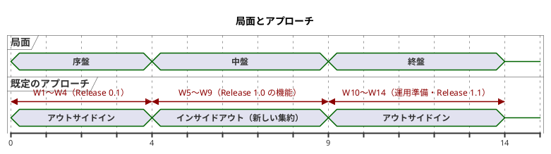
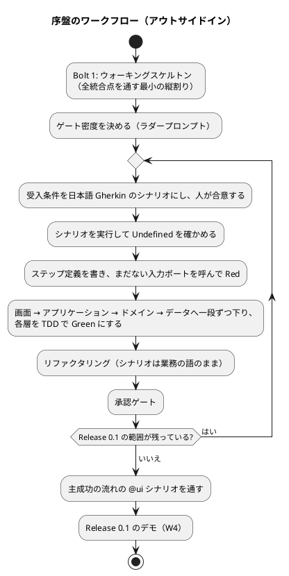
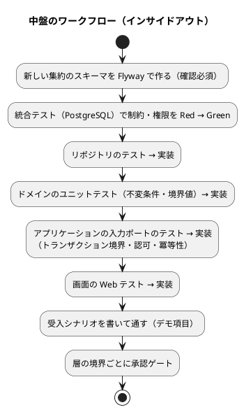
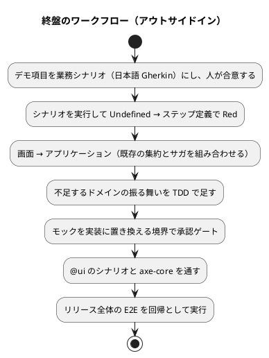

# 開発戦略 - cargo-tracker（A 社国際貨物輸送管理システム）

## 概要

本ドキュメントは、[リリース計画](release_plan.md) の W1〜W14 を **序盤・中盤・終盤** の局面に分け、各局面で採用する TDD のアプローチ（テストの入口とレイヤーを貫通する順序）と、局面を横断する進め方を定める。個々の Red-Green-Refactor の手順は [コーディングとテストガイド（AI-DLC 版）](../../reference/コーディングとテストガイド_AI-DLC版.md) に従い、本書はその上位で「どの Bolt をどちらのアプローチで進めるか」「週とリリースの完了をどう受け入れるか」を決める。

### 参照元（Single Source of Truth）

| 知識 | 正とする文書 |
| :--- | :--- |
| 週 × ストーリーの配分、リリースの完了条件 | [リリース計画](release_plan.md) |
| Bolt のゴール・仮説・ステップ | 各 Bolt 計画（[Bolt 1 計画](bolt_01_plan.md) など） |
| TDD の手順、アプローチ選択フロー、品質基準、コミット規約 | [コーディングとテストガイド（AI-DLC 版）](../../reference/コーディングとテストガイド_AI-DLC版.md) |
| テストのレベル・BDD の階層とタグ・カバレッジ | [テスト戦略](../../design/cargo-tracker/test_strategy.md)、ADR-009 |
| 受け入れテストの記法（日本語 Gherkin） | [BDD 導入ガイド](../../reference/BDD導入ガイド.md) |
| 画面遷移とナビゲーション | [UI 設計](../../design/cargo-tracker/ui_design.md) |
| ドキュメントとコードの同期 | [Living Documentation 導入ガイド](../../reference/LivingDocumentation導入ガイド.md) と個別の導入ガイド |
| DDD の設計と実装の型（集約・ドメインイベント・コンテキストの分け方、Spring のモジュラーモノリスの構成） | 開発ガイドライン（`docs/article/` の第 1〜3 章、次の節） |

### 開発ガイドラインへの準拠

本プロジェクトの主題はドメイン駆動設計の実践であり、すべての局面の設計と実装は `docs/article/` の開発ガイドライン（CLAUDE.md）に準拠する。局面によってテストの入口とレイヤーを貫通する順序は変わるが、何をどの型で作るかはこの 3 章が決める。

| 章 | ガイド | 本戦略で主に使う場面 |
| :--- | :--- | :--- |
| 第 1 章 ドメイン駆動設計 | [01-ddd-fundamentals.md](../../article/01-ddd-fundamentals.md) | 全局面。エンティティ・値オブジェクト・集約・ドメインイベント・リポジトリの判断と、ユビキタス言語の扱い |
| 第 2 章 Cargo Tracker のドメインモデル | [02-cargo-domain-model.md](../../article/02-cargo-domain-model.md) | 中盤（インサイドアウト）。集約の境界と不変条件、ドメインモデルの操作（コマンド・クエリ・サガ）の作り込み |
| 第 3 章 Spring Platform × モジュラーモノリス | [03-spring-modular-monolith.md](../../article/03-spring-modular-monolith.md) | 序盤（ウォーキングスケルトン）から全局面。4 パッケージの構成、Spring Modulith のモジュール境界とイベント、Spring Boot 4 の落とし穴 |

運用の決まりは次のとおりである。

- 各 Bolt 計画の「入力」に、その Bolt で参照する章と節を挙げる。AI は実装の前に該当の節を読み、ガイドの型から外れる実装を提案するときは理由を示して人の承認を得る
- ガイドと設計ドキュメント（`docs/design/cargo-tracker/`）・ADR が食い違うときは、本プロジェクトの判断である設計ドキュメントと ADR を正とし、差分の理由が ADR か設計ドキュメントに書かれていることを確かめる。書かれていなければ、その Bolt で ADR に記録する
- 承認ゲートでは、受入シナリオとテストの結果に加えて、ガイドの型（集約の境界、レイヤーの依存の向き、モジュール間はイベントか公開 API で連携すること）に沿っているかを確かめる。機械的に確かめられる規則はアーキテクチャテスト（AT-01〜06）に移す

### Bolt と週の読み替え

本プロジェクトでは Bolt がイテレーションである（[AI-DLC 導入ガイド](../../reference/AI-DLC導入ガイド.md) 13.5 節）。開発戦略の雛形の「イテレーション」は次のように読み替える。

| 雛形の語 | 本プロジェクト |
| :--- | :--- |
| イテレーション | Bolt（2〜4 時間）。アプローチは Bolt ごとに Bolt 計画へ明記する |
| 局面に割り当てるイテレーション群 | 週（W1〜W15）とリリース |
| `iteration_plan-N.md` | Bolt 計画 `bolt_NN_plan.md` と、週次の見直しの記録 |
| イテレーションのデモ項目 | 週次の見直しで実演するデモ項目（本書で週ごとに定める） |

Bolt 計画は Bolt 1 の分だけが作成済みである。W2 以降の局面への割り当ては、リリース計画の週の配分に基づく暫定案とし、Bolt 計画を作るたびに追従させる。

---

## 戦略の全体像

| 局面 | 週 | リリース | 既定のアプローチ | 狙い |
| :--- | :--- | :--- | :--- | :--- |
| 序盤 | W1〜W4 | Release 0.1 最初の縦の流れ | アウトサイドイン | ウォーキングスケルトン（最初の Bolt）で全統合点を通し、受入シナリオから内側を導いて最初の縦の流れを薄く貫通させる |
| 中盤 | W5〜W9 | Release 1.0 の機能 | インサイドアウト（新しい集約）／アウトサイドイン（既存の集約の拡張） | 認証・利用者管理・外部原本・有人案件・通知・照会記録など、新しい集約をデータ層とドメイン層から堅牢に作り、貧血モデルを避ける |
| 終盤 | W10〜W14 | Release 1.0 の運用準備、Release 1.1 | アウトサイドイン | 既存の集約を組み合わせる変更・再設計・訂正・復旧・照会を、業務シナリオから束ねる。リリース全体の一貫性を E2E で確かめる |

### アプローチ選択の根拠

コーディングとテストガイド（AI-DLC 版）の実装アプローチ選択フローに対応づける。

| 局面 | 選択フローの分岐 | 理由 |
| :--- | :--- | :--- |
| 序盤 | 基本の実装なし。ただし最初の縦の流れは画面からの業務シナリオで定義されている | 何もない状態で層ごとに作ると、統合点の誤り（モジュール境界、イベント配信、H2 と PostgreSQL の差）が最後まで見えない。ウォーキングスケルトンを最初の Bolt として外側から通し、統合点を先に確かめる（AI-DLC の原則）。その後の縦の流れも、受入シナリオから内側を導けば先回りの実装を防げる |
| 中盤 | 基本 CRUD 未実装 → 貧血ドメインモデルの危険 → インサイドアウト推奨 | 中盤で初めて作る集約（利用者・参照許可、外部原本と受信記録、有人案件と営業日カレンダー、通知、照会記録）は、不変条件（IA-INV、ED-INV、SC-INV、N-INV、IR-INV）と DB の制約（一意制約、追記専用の権限）が品質の中心にある。データ層とドメイン層から固め、層の境界を承認ゲートにする |
| 中盤の例外 | 基本 CRUD 実装済み × ドメインが複雑 → アウトサイドイン推奨 | W6 の経路設計・予約の残り（Golden dataset、再設計要・旧版、不足条件）は、序盤で作った経路設計案件と貨物予約を広げる作業である。受入シナリオから入る |
| 終盤 | 基本 CRUD 実装済み × ドメインが複雑 → アウトサイドイン推奨 | 予約の変更・取消し、経路の再設計、実績の訂正、連携停止からの復旧は、既存の集約とサガを組み合わせる。業務シナリオを受入テストで束ね、モックを実装に置き換える境界を承認ゲートにする |

中核ドメインは単純な CRUD ではない（経路の制約適合判定、予約の確定条件、追跡の状態導出）ため、中盤のインサイドアウト局面は省略しない。

### Bolt ごとのアプローチの決め方

局面の既定より、Bolt の対象で決める規則を優先する。決めたアプローチは Bolt 計画の冒頭に書き、AI に明示的に指示する（AI は指示がないと全層を一度に生成しようとする）。

| Bolt の対象 | アプローチ |
| :--- | :--- |
| 新しい集約・新しいスキーマを作る | インサイドアウト（データ → ドメイン → アプリケーション → 画面） |
| 既存の集約に受入条件を足す | アウトサイドイン（受入シナリオ → 画面またはアプリケーション → ドメイン → データ） |
| 技術タスク（基盤・CI・IaC） | テストの入口は検証の手段（アーキテクチャテスト、スモーク、IaC の検査）に置く |

---

## 共通の TDD サイクル

局面が変わっても、Red-Green-Refactor のサイクルと TDD の三原則は変えない。変えるのはテストの入口と、レイヤーを貫通する順序だけである。

| 規律 | 内容 |
| :--- | :--- |
| 三原則 | 失敗するテストを書くまで本番コードを書かない。失敗する範囲を超えてテストを書かない。失敗しているテストを通す以上に本番コードを書かない |
| 承認ゲート | Bolt 計画のゲート密度に従う。Bolt 1 の結果で、以降を「各ステップ」か「自律実行」にするかを決める |
| 1 コミット 1 変更 | 構造の変更と振る舞いの変更を同じコミットに入れない（Conventional Commits） |
| アーキテクチャテスト | AT-01〜06 は常に通っている状態を保つ。赤のまま次のステップへ進まない |
| 品質基準 | コーディングとテストガイド（AI-DLC 版）の品質基準と、テスト戦略のカバレッジの閾値 |
| ソース束縛レビュー | AI はステップで変更したファイルの一覧を完了報告に含め、人は `git diff --stat` と突き合わせる |

### テストの種類とレイヤーの対応

| テスト | 対象のレイヤー | 置き場所（予定） |
| :--- | :--- | :--- |
| ユニット | `domain`（集約・値オブジェクト・ドメインルール） | 各コンテキストの `domain` に対応するテスト |
| 受入シナリオ（業務ルール層） | `application` の入力ポート | `src/test/resources/features/<context>/` とステップ定義 |
| Web | `interfaces.web` | MockMvc のテスト |
| 統合 | `infrastructure`（マッパー、マイグレーション、イベント配信） | Testcontainers の PostgreSQL 18 |
| アーキテクチャ | 全体 | ArchUnit、Spring Modulith |
| E2E（`@ui`） | アプリケーション全体 | Cucumber + Playwright |

### 品質チェックのコマンド

アプリケーションのプロジェクトは Bolt 1 で作るため、コマンドはまだ存在しない。Bolt 1 で次の形に揃え、確定したら本節を実際のコマンドに更新する（憶測で固定しない）。

| 目的 | 予定のコマンド |
| :--- | :--- |
| すべての検証（ユニット・アーキテクチャ・受入シナリオ・統合・カバレッジ） | `./gradlew check`（`apps/cargo-tracker/` で実行） |
| ローカル起動（H2） | `./gradlew bootRun` |
| 設計ドキュメントの生成 | JIG のタスク（Living Documentation の節） |

---

## デモ項目を受け入れ基準とする

週次の見直しで、その週に完了したストーリーをデモ項目として実演する。デモ項目は人が手で操作して見せるだけにせず、**日本語 Gherkin の受入シナリオとして実行可能にする**（ADR-009 で BDD を採用済み）。デモ項目のシナリオがすべて通っていない週は、見直しで「未完了」とする。追加したシナリオは以降も毎回実行し、デモ項目の回帰を防ぐ。

### 週ごとのデモ項目（暫定）

| 週 | 局面 | デモ項目 | 受入シナリオのタグ |
| :--- | :--- | :--- | :--- |
| W1 | 序盤 | 輸送要求を提出すると、KPI 計測記録に提出時刻が記録され社内の画面に出る（ウォーキングスケルトン）。輸送要求の提出と審査 | `@walking-skeleton`、`@US-01`、`@US-02` |
| W2 | 序盤 | 見積りと経路方針の提示と、荷主の「詳細経路設計へ進む」回答。password でのログインと、役割ごとのナビゲーション | `@US-03`、`@US-24-AC1`、`@US-18` |
| W3 | 序盤 | 経路候補の比較と確定、荷主の承認、KPI-01 の 2 時刻 | `@US-06`、`@US-07`、`@US-24-AC4`、`@US-21-AC1` |
| W4 | 序盤 | 本予約の確定（重複確定の防止を含む）から追跡の開始・実績の登録・荷主の照会まで（Release 0.1 のデモ） | `@US-04`、`@US-12`、`@US-09`、`@ui` の主成功シナリオ |
| W5 | 中盤 | TOTP・ロック・session の失効と警告・password の再設定。利用者と役割の管理 | `@US-18`、`@US-16` |
| W6 | 中盤 | Golden dataset による経路の判定、再設計要・旧版の拒否、確定の不足条件 | `@golden`、`@US-06`、`@US-07`、`@US-04` |
| W7 | 中盤 | 外部原本の取込（重複・隔離・差異）と、実績の順序逆転・取消済み・完了後の扱い | `@US-14`、`@US-12` |
| W8 | 中盤 | 照会の引継ぎから回答・終結・再開まで（営業日カレンダーと escalation を含む） | `@US-11`、`@US-20` |
| W9 | 中盤 | 荷主の問い合わせの追跡、メール通知、KPI-02 と週次の照会、残りの受入条件 | `@US-23`、`@US-22`、`@US-21`、`@US-01`、`@US-24`、`@US-09` |
| W10 | 終盤 | ステージングでの主要フローの E2E、性能テスト、時点復旧の訓練の結果（Release 1.0 のデモ） | `@ui` 全件、`@NFR-*` |
| W11 | 終盤 | 予約の変更・取消しと監査証跡の照会 | `@US-05`、`@US-17` |
| W12 | 終盤 | 実績の訂正（二者確認）と連携停止からの復旧照合 | `@US-13`、`@US-15` |
| W13 | 終盤 | 経路の再設計 | `@US-08` |
| W14 | 終盤 | 荷受人の英語での照会と参照許可の取消し（Release 1.1 のデモ） | `@US-10`、`@US-19` |

### 局面ごとの BDD の使い方

| 局面 | BDD の役割 |
| :--- | :--- |
| 序盤 | 受入シナリオを各 Bolt の入口にする。シナリオを実行して Undefined を確かめ、ステップ定義でまだない内側のインターフェースを呼んで Red にし、内側へ一段ずつ下りて Green にする |
| 中盤 | インサイドアウトの Bolt ではドメイン層のユニットテストと統合テストが主役になる。受入シナリオは Bolt の最後のステップで書いて通し、既存のシナリオは回帰として実行する |
| 終盤 | 序盤と同じく受入シナリオを入口にする。既存の集約を組み合わせる業務シナリオを書き、モックを実装に置き換える境界を承認ゲートにする |

| 項目 | 内容 |
| :--- | :--- |
| 誰が書くか | シナリオは実装の前に、人（業務・開発・テストの立場）が AI の案を確かめて合意する。AI-DLC ではこの合意が人と AI の契約になる |
| 記述言語 | 日本語（`# language: ja`）。ドメインモデルのユビキタス言語の用語を使い、英語を混在させない |
| 処理系と配置 | Cucumber-JVM 8.0.x。フィーチャーファイルは `src/test/resources/features/<context>/`、ステップ定義はコンテキストごとの `acceptance` パッケージ（テスト戦略） |
| ステップ定義の責務 | 薄く保ち、業務ロジックを持ち込まない。自分のコンテキストの入力ポートと他のコンテキストの公開 API だけを呼ぶ（AT-05） |

---

## ドキュメントをコードと同期させる

Living Documentation を **採用する**。局面が変わるたびに設計の理解がずれる最大の原因は、手書きの設計書がコードより遅れることである。本プロジェクトは設計書（`docs/design/cargo-tracker/`）を厚く書いたため、コードができた後に両者を手で揃え続けるのは破綻しやすい。これから書くコードから適用し、Bolt 1 から始める。

### 何をコードに持たせ、何を文書に残すか

| 知識 | 置き場所 | 理由 |
| :--- | :--- | :--- |
| 構造（パッケージ、モジュール間の依存、集約と値オブジェクトの関係） | コード。図は JIG と Spring Modulith で生成する | コードが正。手で描いた図は古くなる |
| 用語（ユビキタス言語） | 設計時はドメインモデルの用語集。実装後はクラスの Javadoc の 1 行目に日本語名を書き、JIG で用語集を生成する | 実装したコンテキストから順に、コードが正になる |
| 振る舞いの仕様 | 受入シナリオ（Cucumber の実行結果を生きた仕様として CI の成果物に残す） | ADR-009 |
| 意図・判断・却下した代替案 | ADR と `docs/design/` | コードから読み取れない |
| 変更ごとの意図 | コミットメッセージ | Conventional Commits |

`docs/design/` には、コードから生成できる一覧や図を新たに手で書き足さない。実装で設計の判断が変わったら、その場で `docs/design/` の該当箇所（意図と判断）を直す。

### 重複させた知識の検証

| 重複している知識 | 整合を検証するテスト |
| :--- | :--- |
| ドメインモデルの用語集（英語名と日本語名）とクラス名・Javadoc | 用語集の表を読み、実装済みのコンテキストの英語名に対応するクラスがあり、Javadoc の日本語名が一致することを確かめるテスト（CI と合わせて Bolt 2 で作る） |
| ユーザーストーリーの受入条件と受入シナリオ | 受入条件の数と `@US-nn-ACm` のタグ付きシナリオの数を照合する（ADR-009 のコンプライアンス） |
| データモデルの表と、Flyway で作られた実際のスキーマ | jig-erd でスキーマから ER 図を生成し、週次の見直しでデータモデルと見比べる |
| モジュール境界の設計とコードの依存 | Spring Modulith の検証（AT-03）と ArchUnit |

### アノテーションの語彙

[アノテーション導入ガイド](../../reference/アノテーション導入ガイド.md) に従い、本質的な知識だけに付ける。語彙はプロジェクトで定義し、出典が分かるようパッケージ名に DDD を含める（`com.example.cargotracker.shared.annotation.ddd`）。外部の語彙ライブラリ（jMolecules など）は技術スタックに含めていないため使わない。導入する場合は ADR で判断する。

| 語彙 | 付ける対象 | 検証 |
| :--- | :--- | :--- |
| `@AggregateRoot` | 集約ルート | ArchUnit: `domain` パッケージにあること |
| `@ValueObject` | 値オブジェクト | ArchUnit: record であること（不変） |
| `@DomainEvent` | ドメインイベント | ArchUnit: 各コンテキストの `events` パッケージにあること（ADR-003） |
| `@DomainService` | ドメインサービス（制約適合判定など） | ArchUnit: 状態を持たないこと |
| `@CoreConcept` | 中核の概念（経路版、制約適合判定、貨物予約、追跡記録など） | 生成する用語集で強調する |
| `@GuidedTour(name, step, description)` | 業務シナリオの処理の流れの要所 | 終盤でツアーを生成する |

レイヤーはパッケージ名（`interfaces`・`application`・`domain`・`infrastructure`）で宣言し、注釈を付けない（命名規約で補う）。

### 局面ごとの重点

| 局面 | 生まれる主な知識 | 重点 | 参照ガイド |
| :--- | :--- | :--- | :--- |
| 序盤 | アーキテクチャ、レイヤー、モジュール境界 | 語彙の注釈を定義し、アーキテクチャテストで依存と注釈の規則を固定する。語彙の定義と付与はウォーキングスケルトン（Bolt 1）から始め、JIG と Spring Modulith のモジュール図を生成する仕組みは CI と合わせて Bolt 2 で作る | アノテーション導入ガイド |
| 中盤 | 集約、不変条件、業務ルール | `@CoreConcept` で中核をハイライトし、JIG の用語集（Living Glossary）でユビキタス言語をコードに一本化する。判断は ADR に残す。模範となる集約（貨物予約、追跡記録）を示す | ダイナミックキュレーション導入ガイド |
| 終盤 | 業務シナリオ、処理の流れ | 見積依頼から本予約・追跡までの流れを `@GuidedTour` でたどれるようにし、見どころをサイトシーイング・マップにまとめる。Cucumber のタグでシナリオのダイジェストを作る | ガイドツアー・サイトシーイング導入ガイド |

### 生成と公開

| 生成物 | 生成の時点 | 公開先 |
| :--- | :--- | :--- |
| Cucumber の実行結果（HTML・JSON） | CI の毎回 | CI の成果物 |
| JIG の設計ドキュメント（用語集、パッケージ関連、業務ルール一覧） | CI の毎回（main へのマージ時） | CI の成果物。MkDocs サイトへの掲載は W10 の運用準備で判断する |
| jig-erd の ER 図 | 週次の見直しの前（Docker と Graphviz が必要なため、毎回の CI には入れない） | 週次の見直しの記録 |
| Spring Modulith のモジュール図 | CI の毎回 | CI の成果物 |

CI は Bolt 2 で作る（Bolt 1 計画）。生成物はリポジトリにコミットしない（コードを変えたのに図が古い状態を固定しないため）。

### 完了条件への組み込み

各 Bolt と週の完了条件に次を加える。

- 生成するドキュメント（用語集、図、シナリオの実行結果）の生成が成功している
- その Bolt で下した設計判断が ADR に記録され、コードで表せない根拠だけが `docs/design/` に反映されている
- 手書きでコードの内容を複製した一覧や図が新たに増えていない

---

## 序盤: アウトサイドイン（W1〜W4）

### 目的（序盤）

最初の Bolt（ウォーキングスケルトン）で全統合点を通し、決めたアーキテクチャ（ADR-001〜009）が実際に回ることを確かめる。続く Bolt で、受入シナリオから内側を導いて、提出から照会までの最初の縦の流れ（Release 0.1）を薄く貫通させる。

### 対象のストーリー（序盤）

リリース計画の Release 0.1 の範囲（US-01、US-02、US-03、US-24、US-06、US-07、US-21、US-04、US-12、US-09、US-18 の受入条件の一部、35 SP）。

### ワークフロー（序盤）

### 手順（序盤）

1. Bolt 1 でウォーキングスケルトンを作る（[Bolt 1 計画](bolt_01_plan.md)）。結果から以降の承認ゲートの密度を決める。
2. Bolt 2 で CI と、E2E の基盤（Playwright と axe-core）を作る。
3. W2 で password によるログインを入れたら、[UI 設計](../../design/cargo-tracker/ui_design.md) の画面一覧に従って、全ルートの仮の画面と役割ごとのナビゲーションを一度に作る（ナビゲーションの骨格）。役割ごとの表示・非表示・権限なし（A-04）を E2E で確かめる。以降の Bolt は、仮の画面を実際の画面に差し替える作業になる。
4. 各 Bolt は受入シナリオを入口にし、層を一段ずつ下りる。モックを実装に置き換える境界を承認ゲートにする。

### 完了条件（序盤）

- [ ] W1〜W4 のデモ項目の受入シナリオがすべて通る
- [ ] ナビゲーションの骨格の E2E（全ルートへの到達、役割ごとの表示・非表示・権限なし）が通る
- [ ] 主成功の流れの `@ui` シナリオが通る
- [ ] アーキテクチャテスト AT-01〜06 が通り、注釈の語彙と規則が定義されている
- [ ] JIG と Modulith の生成物が CI で生成されている
- [ ] Release 0.1 のリリース条件（リリース計画）を満たす

---

## 中盤: インサイドアウト（W5〜W9）

### 目的（中盤）

Release 1.0 の機能のうち、新しい集約（利用者・役割・参照許可、外部原本と受信記録、有人案件と営業日カレンダー、通知、照会記録と KPI 計測）を、データ層とドメイン層から堅牢に作る。不変条件と DB の制約（一意制約、追記専用の権限、CHECK 制約）を先に固め、上位の層は薄く保つ。

### 対象のストーリー（中盤）

| 週 | ストーリー | アプローチ |
| :--- | :--- | :--- |
| W5 | US-18 の残り、US-16 | インサイドアウト（利用者・役割・ロックのデータとドメインから。認証の流れはセキュリティの統合テストで外側から確かめる） |
| W6 | US-06・US-07・US-04 の残り | **アウトサイドイン**（序盤の集約を広げるため。中盤の例外） |
| W7 | US-14、US-12 の残り | インサイドアウト（外部原本・受信記録の一意制約と分類から） |
| W8 | US-11、US-20 | インサイドアウト（有人案件・営業日カレンダーのドメインから） |
| W9 | US-23、US-22、US-21・US-01・US-24・US-09 の残り | 通知と照会記録はインサイドアウト。残りの受入条件はアウトサイドイン |

### ワークフロー（中盤）

### 手順（中盤）

1. Bolt 計画で、対象が新しい集約か既存の集約の拡張かを判定し、アプローチを明記する。
2. 新しい集約では、データモデルの表を Flyway で作るステップを最初に置き、承認を得る（スキーマの変更は確認必須）。権限の付与（`afterMigrate`）も同じステップで更新する。
3. 層を 1 つずつ進め、層の境界を承認ゲートにする。
4. 最後に受入シナリオを書いて通し、デモ項目のテストにする。

### 完了条件（中盤）

- [ ] W5〜W9 のデモ項目の受入シナリオがすべて通る
- [ ] テスト戦略の Comprehensive の対象（認証、外部原本、開示制御、二者確認など）の統合・Web テストが通る
- [ ] 新しい集約に `@AggregateRoot`・`@ValueObject` などの注釈が付き、JIG の用語集に日本語名が出ている
- [ ] その週の設計判断が ADR に記録されている

---

## 終盤: アウトサイドイン（W10〜W14）

### 目的（終盤）

W10 でパイロットの運用準備を整え、Release 1.0 を受け入れる。W11〜W14 で、既存の集約とサガを組み合わせる変更・再設計・訂正・復旧・照会を、業務シナリオから束ねる。

### 対象のストーリー（終盤）

| 週 | 対象 | アプローチ |
| :--- | :--- | :--- |
| W10 | 運用準備（AWS 環境、CI/CD、監視、ランブック、性能テスト、時点復旧の訓練） | 技術タスク。テストの入口は E2E（ステージング）、性能テスト、IaC の検査、訓練の手順 |
| W11 | US-05、US-17 | アウトサイドイン |
| W12 | US-13、US-15 | アウトサイドイン |
| W13 | US-08 | アウトサイドイン |
| W14 | US-10、US-19 | アウトサイドイン |

### ワークフロー（終盤）

### 完了条件（終盤）

- [ ] W10〜W14 のデモ項目の受入シナリオがすべて通る
- [ ] Release 1.0・1.1 のリリース条件（リリース計画）を満たす
- [ ] 見積依頼から本予約・追跡までの流れを `@GuidedTour` でたどれ、サイトシーイング・マップがある

---

## Bolt ごとの設計ドキュメント整合

Bolt 計画は局所の計画、`docs/design/cargo-tracker/` は全体の正である。

| 時点 | 確認すること |
| :--- | :--- |
| Bolt 計画の作成時 | Bolt の入力に設計書のパスを明記し、計画が設計書と食い違っていないかを確かめる（`validating-design`） |
| Bolt の実行中 | 実装で設計の判断が変わったら、その場で `docs/design/` の該当箇所（意図と判断）と ADR を直す。Bolt 計画だけに書いて放置しない |
| Bolt の終了時 | Bolt 終了報告に、直した設計書と ADR を書く。構造の変更はアーキテクチャテストとフルテストで裏付ける |
| 週次の見直し | jig-erd の ER 図とデータモデル、JIG の用語集とドメインモデルの用語集を見比べる |

## 局面移行時の一貫性維持

| 移行 | 確認すること |
| :--- | :--- |
| 序盤 → 中盤（W4 の終わり） | Release 0.1 のふりかえりで、ベロシティ・承認ゲートの密度・Bolt の長さを見直す（リリース計画）。注釈の語彙とアーキテクチャテストの規則が固まっていること。インサイドアウトに切り替えても、既存の受入シナリオを毎回実行する |
| 中盤 → 終盤（W9 の終わり） | 新しい集約がそろい、用語集がコードから生成されていること。終盤のアウトサイドインで「既存の集約を探さずに新しく作る」ことを防ぐため、Bolt 計画の入力に既存の集約のパスを明記する |
| 全局面 | TDD の三原則、1 コミット 1 変更、品質基準、アーキテクチャテストを常に通っている状態に保つこと、開発ガイドライン（`docs/article/` の第 1〜3 章）の型に準拠することは変えない |

---

## 更新履歴

| 日付 | 更新内容 | 更新者 |
| :--- | :--- | :--- |
| 2026-10-01 | 初版作成（W2 以降の局面の割り当ては暫定） | anthropic/claude-opus-5-5（承認 human:kakimomokuri） |
| 2026-10-01 | Bolt 1 の開始準備の検証を反映: 用語集の整合のテストと JIG・Modulith の図の生成を、CI と合わせて Bolt 2 に移した | anthropic/claude-opus-5-5（承認 human:kakimomokuri） |
| 2026-10-01 | 開発ガイドライン（`docs/article/` の第 1〜3 章）への準拠を、参照元・準拠の節・局面横断の規律に明記した | anthropic/claude-opus-5-5（承認 human:kakimomokuri） |
