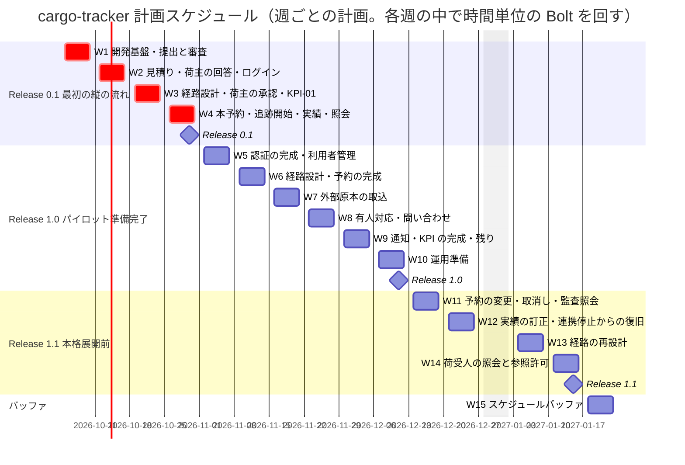
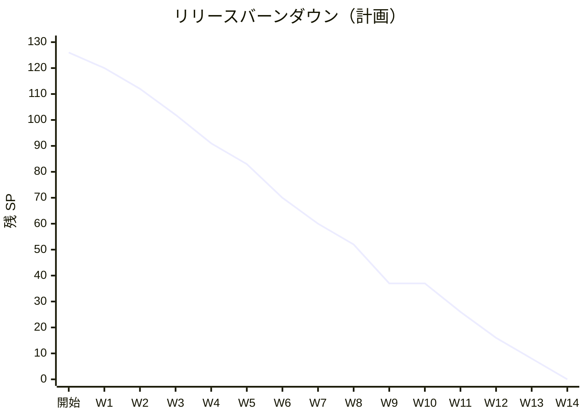

# リリース計画 - cargo-tracker（A 社国際貨物輸送管理システム）

## 概要

本ドキュメントは、cargo-tracker の MVP（予約・経路設計・基本追跡）を、パイロットを開始できる状態まで届けるリリース計画を定義する。計画は [リリース・イテレーション計画ガイド（AI-DLC 版）](../../reference/リリース・イテレーション計画ガイド_AI-DLC版.md) に従い、Intent → Unit → Bolt の単位で組む。

### プロジェクト情報

| 項目 | 内容 |
| :--- | :--- |
| **プロジェクト名** | cargo-tracker（A 社国際貨物輸送管理システム） |
| **Intent** | 荷主の輸送条件の受付から、見積り・経路設計・本予約・基本追跡までを、根拠と監査証跡を失わず一貫して提供する（[Unit 定義](../../requirements/cargo-tracker/units.md)） |
| **対象ユーザー** | 法人荷主の担当者、荷受人、A 社の営業担当者・経路設計者・追跡管理者・カスタマーサポート・データ責任者・システム管理者・監査担当者 |
| **開発体制** | 開発者 1 名 + AI エージェント（2026-10-01 に human:kakimomokuri が決定） |
| **入力** | 要件（user_story.md: 24 ストーリー・受入条件 120 件）、設計書 10 本、ADR-001〜009、[分析成果物レビュー](../../review/cargo-tracker/analysis_review_20261001.md) |

---

## 満足条件

### Intent とビジネス価値

| 項目 | 内容 |
| :--- | :--- |
| ビジネス価値 | 経路提示のリードタイムを短くし（KPI-01）、荷主の自己照会を増やす（KPI-02）。熟練者を例外判断へ集中させる |
| 測定基準 | PV-01: KPI-01 の中央値を基準値から 10% 以上短縮し 90 パーセンタイルを悪化させない。KPI-02 を 10 ポイント以上改善する。権限外開示・外部原本消失・重複予約は各 0 件（[要件定義](../../requirements/cargo-tracker/requirements_definition.md)） |
| 計測の手段 | US-21（KPI の計測）を MVP の Must に含める |

### スコープ

MVP は 3 つのリリースで段階的に届ける。

| リリース | 内容 | ストーリー | SP |
| :--- | :--- | :--- | ---: |
| Release 0.1 最初の縦の流れ | 一般貨物 1 件が、提出から本予約・追跡の照会まで縦に通り、KPI-01 の 2 時刻が記録される（レビュー R-17） | Must の主成功の流れの部分 | 35 |
| Release 1.0 パイロット準備完了 | Must の全受入条件と運用準備。パイロットを開始できる状態 | Must の残り | 54 |
| Release 1.1 本格展開前 | Should と Could | US-05、US-08、US-13、US-15、US-17、US-10、US-19 | 37 |
| **合計** | | **24 ストーリー** | **126** |

第 2 段階（荷役・リアルタイム追跡・通知の拡張・例外対応）と第 3 段階（料金・精算・外部連携強化）は、Release 1.1 の後に別のリリース計画で扱う。

### スケジュール

- **開発期間**: 2026-10-05 〜 2027-01-22（15 週）
- **イテレーション（Bolt）**: 時間単位（目安 2〜4 時間）。計画と見直しの区切りは 1 週間で、14 週 + スケジュールバッファ 1 週
- **リリース**: Release 0.1（2026-10-30）、Release 1.0（2026-12-11）、Release 1.1（2027-01-15）
- **休み**: 2026-12-28 〜 2027-01-01 は作業しない。祝日を含む週（W2、W5、W8、W14）は計画の SP を少なくする

インセプションデッキの仮定（MVP リリース 2027 年 1 月下旬）に対して、Release 1.1 の完了が 2027-01-15 になる。パイロットの開始日は、Release 1.0 の後に「パイロット開始の条件」がそろった時点で業務側が決める。

### リソース

- **開発者**: 1 名（人の検証・判断・承認ゲート）
- **AI エージェント**: 計画・実装・テスト・文書の生成
- **想定稼働**: 週 5 日。Bolt は時間単位（目安 2〜4 時間）で、1 日に 2〜4 Bolt、承認ゲートも 1 日 2〜4 回とみなす（2026-10-01 に human:kakimomokuri が決定）

---

## Unit の評価（実装エントロピー）

AI-DLC 版ガイドのステップ 4 に従い、AI がどれだけ自律的に進められるかを 5 軸で評価する。HIGH が多い Unit ほど承認ゲートを密にする。

| Unit | 意図の曖昧さ | 構造的不確実性 | 検証の不確実性 | リスク | 未解決の仮定 | 承認ゲートの密度 |
| :--- | :---: | :---: | :---: | :---: | :---: | :--- |
| U1 輸送要求・見積り | LOW | MED | LOW | MED | MED | 標準。業務のルール・スキーマ・セキュリティに関わるステップは毎回、それ以外のステップは次の承認ゲートにまとめる（Bolt 1〜5 で人の変更依頼 0 件。2026-10-03 に human:kakimomokuri が決定。Bolt 6 から） |
| U2 経路設計 | MED | MED | **HIGH** | **HIGH** | **HIGH** | 密（Red・Green ごと） |
| U6 予約管理 | LOW | MED | MED | **HIGH** | LOW | 密（確定・冪等・重複防止は Red・Green ごと） |
| U3 基本追跡 | MED | MED | MED | **HIGH** | MED | 密（開示制御は Red・Green ごと） |
| U4 アクセス・監査 | LOW | MED | MED | **HIGH** | MED | 密（認証・認可は Red・Green ごと） |
| U5 外部データ | MED | MED | MED | **HIGH** | **HIGH** | 密 |
| 通知 | LOW | LOW | LOW | MED | LOW | 標準 |

| 評価が HIGH の軸 | 対策 |
| :--- | :--- |
| U2 の検証の不確実性・未解決の仮定 | Golden dataset（TST-02）と必要最小接続時間の値（DM-05）を業務責任者に依頼する。届くまでは仮の案件で進め、W6 の前に差し替える |
| U5 の未解決の仮定 | 取込ファイルの提供元・形式（OQ-02 の残り）を W7 の前に決めてもらう。決まらなければ仮の形式で作り、差し替えの Bolt を足す |
| U6・U3・U4・U5 のリスク | テスト戦略の Comprehensive の対象。承認ゲートで全行を確認する |

### スコープ・深さ・テスト戦略

| 軸 | 選択 | 理由 |
| :--- | :--- | :--- |
| スコープ | 全ステージ（新規開発） | グリーンフィールド |
| 深さ | Standard。PV-01 に直結する領域（予約確定、開示制御、外部原本、認証、訂正の二者確認、制約適合判定）は Comprehensive | [テスト戦略](../../design/cargo-tracker/test_strategy.md) の「テストの深さ」 |
| テスト | 本番機能は Standard 以上。BDD（Cucumber）と TDD の二重ループ（ADR-009） | テスト戦略 |

---

## ユーザーストーリー一覧とストーリーポイント

### ストーリーポイントの付け方

AI-DLC 版ガイドの読み替えに従い、SP は「AI が生成する量」ではなく **人が検証に費やす負荷** の相対値とする（1、2、3、5、8）。受入条件の数、境界値の多さ、Comprehensive の対象かどうかで決める。

### 優先順位マトリックス

4 軸（金銭価値 BV、コスト C、知識習得 KA、リスク軽減 RR）で評価する。Release 0.1 に入る部分は、縦の流れを通すことを最優先にする。

| ID | ユーザーストーリー | Unit | SP | BV | C | KA | RR | 優先度 | リリース |
| :--- | :--- | :--- | ---: | :---: | :---: | :---: | :---: | :--- | :--- |
| US-01 | 輸送条件を提出する | U1 | 5 | 高 | 中 | 中 | 中 | Must | 0.1 / 1.0 |
| US-02 | 輸送条件を審査する | U1 | 3 | 高 | 低 | 低 | 中 | Must | 0.1 |
| US-03 | 根拠付き見積りを提示する | U1 | 5 | 高 | 中 | 中 | 高 | Must | 0.1 |
| US-24 | 見積りと経路に回答・承認する | U1 | 5 | 高 | 中 | 中 | 高 | Must | 0.1 / 1.0 |
| US-06 | 経路候補を比較する | U2 | 8 | 高 | 高 | 高 | 高 | Must | 0.1 / 1.0 |
| US-07 | 専門判断を伴う経路を確定する | U2 | 5 | 高 | 中 | 中 | 高 | Must | 0.1 / 1.0 |
| US-04 | 予約を確定する | U6 | 8 | 高 | 高 | 高 | 高 | Must | 0.1 / 1.0 |
| US-12 | 主要実績を登録する | U3 | 5 | 高 | 中 | 中 | 高 | Must | 0.1 / 1.0 |
| US-09 | 荷主が輸送状態を照会する | U3 | 5 | 高 | 中 | 中 | 高 | Must | 0.1 / 1.0 |
| US-21 | パイロットの KPI を計測する | U4 | 5 | 高 | 中 | 低 | 高 | Must | 0.1 / 1.0 |
| US-18 | 本人として認証される | U4 | 8 | 中 | 高 | 高 | 高 | Must | 0.1 / 1.0 |
| US-16 | 利用者と権限を管理する | U4 | 5 | 中 | 中 | 低 | 高 | Must | 1.0 |
| US-14 | 外部原本を安全に取り込む | U5 | 8 | 高 | 高 | 高 | 高 | Must | 1.0 |
| US-11 | 顧客照会を引き継ぐ | U3 | 3 | 中 | 低 | 低 | 中 | Must | 1.0 |
| US-20 | 照会・業務例外を回答・終結まで追跡する | U3 | 5 | 中 | 中 | 中 | 高 | Must | 1.0 |
| US-22 | 重要な変化を荷主へ通知する | U3（通知） | 3 | 高 | 低 | 中 | 中 | Must | 1.0 |
| US-23 | 自分の問い合わせを追跡する | U3 | 3 | 中 | 低 | 低 | 中 | Must | 1.0 |
| US-05 | 予約を変更・取消しする | U6 | 8 | 中 | 高 | 中 | 高 | Should | 1.1 |
| US-08 | 経路を再設計する | U2 | 8 | 中 | 高 | 高 | 中 | Should | 1.1 |
| US-13 | 主要実績を訂正する | U3 | 5 | 中 | 中 | 中 | 高 | Should | 1.1 |
| US-15 | 外部連携停止から復旧する | U5 | 5 | 中 | 中 | 中 | 高 | Should | 1.1 |
| US-17 | 監査証跡を照会する | U4 | 3 | 中 | 低 | 低 | 中 | Should | 1.1 |
| US-10 | 荷受人が許可範囲を照会する | U3 | 3 | 低 | 低 | 低 | 中 | Could | 1.1 |
| US-19 | 荷受人の参照許可を管理する | U4 | 5 | 低 | 中 | 中 | 中 | Could | 1.1 |
| **合計** | | | **126** | | | | | | |

### Release 0.1 最初の縦の流れの範囲

ストーリーを縦に薄く切り、主成功の流れだけを先に通す（レビュー R-17）。残りの受入条件は Release 1.0 で完成させる。

| ID | Release 0.1 で通す受入条件 | SP | 残り（Release 1.0） |
| :--- | :--- | ---: | ---: |
| US-01 | AC1 提出、AC2 不足項目、AC4 特殊貨物の拒否 | 3 | 2（AC3 他社、AC5 複製） |
| US-02 | 全受入条件 | 3 | 0 |
| US-03 | 全受入条件（BR-10 の境界を含む） | 5 | 0 |
| US-24 | AC1 詳細経路設計へ進む、AC4 承認、AC5 失効時の拒否 | 3 | 2（AC2 辞退、AC3 相談） |
| US-06 | AC1 候補の比較、AC2〜3 の境界（BR-11）。仮の航海データ | 3 | 5（AC4 停止中、Golden dataset、複数接続・規則の有効期間の境界） |
| US-07 | AC1 確定、AC2 根拠・権限の不足 | 3 | 2（AC3 承認中の更新、AC4〜5 再設計要・旧版） |
| US-04 | AC1 確定、AC2 失効、AC4 再送、B-INV-11 重複確定の防止、予約サガ | 5 | 3（AC3 不足条件、AC5 特殊貨物） |
| US-12 | AC1 登録、AC2 重複 | 3 | 2（AC3〜5 順序逆転・取消済み・完了後） |
| US-09 | AC1 照会（当初の予定と実績の区別） | 3 | 2（AC2 矛盾、AC3 停止中） |
| US-21 | AC1 KPI-01 の 2 時刻の記録 | 2 | 3（AC2〜5 KPI-02、週次の照会、基準値） |
| US-18 | password によるログインと session（TOTP は後で） | 2 | 6（TOTP、ロック、失効、再設定） |
| **合計** | | **35** | **27** |

TOTP を Release 0.1 から外すのは、レビューの矛盾事項 1 の推奨判断による。パイロットの開始の条件には含める。

### 全体サマリー

| リリース | SP | 週 |
| :--- | ---: | :--- |
| Release 0.1 最初の縦の流れ | 35 | W1〜W4 |
| Release 1.0 パイロット準備完了 | 54 | W5〜W10 |
| Release 1.1 本格展開前 | 37 | W11〜W14 |
| **合計** | **126** | **14 週 + バッファ 1 週** |

---

## ベロシティ見積もり

### 初期ベロシティ推定

| 項目 | 値 |
| :--- | :--- |
| **イテレーション（Bolt）** | 時間単位（目安 2〜4 時間）。計画の区切りは 1 週間 |
| **体制** | 開発者 1 名 + AI |
| **想定ベロシティ** | 10 SP / 週（祝日を含む週は 8 SP）。1 週あたり 10〜20 Bolt |
| **バッファ** | フィーチャバッファ 29%（Should・Could の 37 SP）+ スケジュールバッファ 1 週間 |

初回のベロシティは推測値である。W1〜W3 の実績（完了 SP、承認ゲートの通過数、変更依頼の数、リードタイム）で W4 の開始時に見直す。

### ベロシティ検証計画

- 各 Bolt の終了時に、承認ゲートの通過数・変更依頼の数・リードタイムを Bolt 終了報告に記録する。週次の見直しで、完了 SP とこれらの指標を集計する。
- 最初の Bolt（ウォーキングスケルトン）で AI の出力の品質を確かめて承認ゲートの密度を決め、Release 0.1（W1〜W4）の実績で Release 1.0 の密度を決め直す。
- 3 週後に、Release 1.0 の計画（W5〜W10）をベロシティの実績で引き直す。

---

## 段階的リリース戦略

### リリーススケジュール

#### 計画スケジュール

#### 実績スケジュール

週次の見直しごとに記入する。

| 週 | 実績 |
| :--- | :--- |
| W1 | 2026-10-01 〜 2026-10-03（期間の前に前倒し）。Bolt 1〜8（開発基盤、CI、E2E の基盤、US-01 の提出と必要書類、US-02 の審査と荷主の再提出、UI の骨格と段階入力）。6 SP。ベロシティの見直しは計画どおり W4 で行う |
| W2 | 2026-10-05 から（W2 の期間の前に前倒し）。Bolt 9（Bolt 6〜8 レビューの返済。SP 0）、Bolt 10（US-03 の提示 AC1〜AC3）、Bolt 11（US-03 の失効・置換 AC4・AC5 と Bolt 9・10 レビューの返済）を終えた。US-03（5 SP）完了 |

### リリース内容

#### Release 0.1（W4 完了）: 最初の縦の流れ

**目標**: 一般貨物 1 件が、提出 → 審査 → 見積りと経路方針の提示 → 荷主の回答 → 経路確定 → 荷主の承認 → 本予約 → 追跡開始 → 実績の登録 → 照会まで縦に通り、KPI-01 の 2 時刻が記録される。AI の出力品質を確かめ、以降の承認ゲートの密度を決める。

**含まれる機能**:

- 開発基盤（Spring Boot 4.1、Spring Modulith、MyBatis、Flyway、ArchUnit、Cucumber、H2・Testcontainers、CI）
- 見積り・経路設計・予約・追跡・アクセス監査の最小の流れ（上表の Release 0.1 の範囲）
- 予約サガ（本予約 → 追跡開始）と、重複確定の防止（B-INV-11）
- password によるログイン（TOTP は Release 1.0）

**リリース条件**:

- [ ] Release 0.1 の範囲の受入シナリオがすべて通る
- [ ] 主成功の流れの `@ui` シナリオ 1 本が通る
- [ ] アーキテクチャテスト（AT-01〜06）が通る
- [ ] H2 で起動でき、PostgreSQL の統合テストが通る
- [ ] 社内デモで human:kakimomokuri が流れを確認する

#### Release 1.0（W10 完了）: パイロット準備完了

**目標**: Must の 17 ストーリーの全受入条件と運用準備をそろえ、パイロットを開始できる状態にする。

**含まれる機能**:

- 認証の完成（TOTP、ロック、session の失効と警告、password の再設定）と利用者・権限の管理
- 経路設計の完成（Golden dataset、停止中の情報不足）と予約の完成
- 外部原本の取込（重複・隔離・差異）
- 有人対応（引継ぎ、受領・回答・終結・再開、営業日カレンダー）と荷主の問い合わせ
- 荷主へのメール通知と KPI の計測（KPI-02、週次の照会、基準値）
- AWS のステージング・本番環境、CI/CD、監視、運用タスクとランブック、性能テスト

**リリース条件**:

- [ ] Must の全受入条件のシナリオが通る（`@wip` なし）
- [ ] テスト戦略の Comprehensive の対象の統合・Web テストが通る
- [ ] カバレッジの閾値を満たす
- [ ] axe-core の違反 0 件、支援技術による手動確認で重大な問題 0 件
- [ ] 性能テストで PERF-01〜09 を満たす
- [ ] 時点復旧の訓練で RTO 2 時間・RPO 5 分を実測し、照合まで行えた（RCV-08）
- [ ] 本番の脆弱性スキャンで HIGH・CRITICAL 0 件

#### Release 1.1（W14 完了）: 本格展開前

**目標**: Should と Could のストーリーを加え、本格展開の前に必要な変更・取消し・再設計・訂正・復旧・監査照会・荷受人の照会を使えるようにする。

**含まれる機能**:

- 予約の変更・取消し（US-05）、経路の再設計（US-08）
- 実績の訂正と二者確認（US-13）、外部連携停止からの復旧（US-15）
- 監査証跡の照会（US-17）
- 荷受人の照会と参照許可（US-10、US-19。日本語・英語）

**リリース条件**:

- [ ] Should・Could の全受入条件のシナリオが通る
- [ ] Release 1.0 のリリース条件を引き続き満たす

### パイロット開始の条件

Release 1.0 はソフトウェアの準備である。パイロットの開始には、次がそろう必要がある。開発と並行して進め、責任者と期限を決める。

| 条件 | 出典 | 責任者 | 期限 |
| :--- | :--- | :--- | :--- |
| パイロット顧客・航路・案件数の決定 | OQ-01 | 経営・業務改革委員会、営業・運用責任者 | 2026-11-13（基準値の計測期間を確保するため） |
| KPI-01・KPI-02 の基準値（開始前 4 週間）の計測と登録 | PV-01、US-21 | プロダクト責任者 | パイロット開始の前日 |
| Golden dataset の案件と期待結果の承認 | TST-02、要件定義 H-9 | 業務責任者（経路設計者・コンプライアンス担当者） | 2026-11-06（W6 の前） |
| 追跡状態の状態名、必要最小接続時間の値 | DM-05 | 業務責任者 | 2026-11-06（W6 の前） |
| 取込ファイルの提供元・形式・頻度 | OQ-02 の残り、BR-18 | 追跡・データ責任者 | 2026-11-13（W7 の前） |
| 承認済みの情報源 1 件以上 | BR-18、ED-INV-01 | データ責任者 | パイロット開始の前 |
| 十分性認定の適用と保持期間の法務・コンプライアンス確認 | PRV-03、RET | 法務、管理・コンプライアンス責任者 | 2026-12-11 |
| 本予約と船腹確保の扱いの確認 | R-28 | 業務責任者 | 2026-11-27（W9 の前） |
| 外部の侵入テスト | SEC-19 | IT 責任者 | Release 1.0 の後、パイロット開始の前 |
| 必要書類のウイルスの検査が動いていること（動くまでパイロットで書類の添付を使わない） | Bolt 7 終了報告（2026-10-03 に human:kakimomokuri が決定） | IT 責任者 | パイロット開始の前（方式は W10 の運用準備で決める） |
| 書類の添付を使う画面に認証（US-18）が入っていること。認証の前は、社内の画面（`/staff`）の書類の実ファイルをステージングに置かない（置くなら `/staff` を網で制限する） | Bolt 6〜8 レビュー D-27・D-31（2026-10-05 に human:kakimomokuri が決定） | IT 責任者 | パイロット開始の前（ステージングは W10） |
| チャットツール・当番の体制 | OP-05 | 運用責任者 | 2026-12-04（W10 の前） |
| 業務担当者の教育 | インセプションデッキ | 運用責任者 | パイロット開始の前 |

---

## バッファ戦略

### フィーチャバッファ

| リリース | 計画 SP | バッファ | 扱い |
| :--- | ---: | ---: | :--- |
| Release 0.1 | 35 | — | 縦の流れは削らない。遅れたら受入条件の残りを Release 1.0 へ送る |
| Release 1.0 | 54 | — | Must は削らない。遅れたら Release 1.1 の開始を遅らせる |
| Release 1.1 | 37 | 37（29%） | Could（US-10、US-19）、次に Should の順で削る |

### スケジュールバッファ

- **予備の週**: W15（2027-01-18 〜 01-22）
- **全体バッファ**: 15 週のうち 1 週（約 7%）。フィーチャバッファと合わせて約 30%

### バッファ消費ルール

1. Release 0.1 の受入条件の残りを Release 1.0 へ送る（縦の流れは維持する）
2. Release 1.1 の Could、次に Should を後回しにする
3. スケジュールバッファ（W15）は最後の手段とする
4. 遅れの原因が「人が承認ゲートに立ち会えない」ことなら、ストーリーではなく集中時間の確保を見直す（AI-DLC 版ガイド 3.3）

---

## Bolt と週次の計画概要

AI-DLC では **Bolt がイテレーション** である（[AI-DLC 導入ガイド](../../reference/AI-DLC導入ガイド.md)、[用語集](../../reference/AI-DLC用語集.md)）。本計画では Bolt を時間単位（目安 2〜4 時間）で回し、1 週間は計画を見直す区切りとして使う。

| 単位 | 長さ | 中身 | 文書 |
| :--- | :--- | :--- | :--- |
| Bolt（イテレーション） | 2〜4 時間。半日を超えそうなら分割する | Bolt ゴール（確かめたい仮説を含む）→ AI のステップ計画 → 人の承認 → 1 ステップずつ実行し承認ゲート → Bolt 終了報告。ステップは受入シナリオ（Red）→ TDD の内側のループ → シナリオが通る（Green）の順（ADR-009） | Bolt 計画、Bolt 終了報告（AI-DLC 版ガイド 6.2 節） |
| 週（W1〜W15） | 1 週間 | Bolt の束。週の目標 SP と取り組むストーリーを決め、週末にリリース計画の更新・GitHub の同期・ふりかえりを行う | 週次の見直しの記録 |
| リリース | 数週間 | Release 0.1・1.0・1.1 | 本計画、リリース完了報告書 |

**ウォーキングスケルトン** は最初の Bolt とする（用語集）。画面 → application → domain → DB → イベント → 別のコンテキスト → 画面の、すべての統合点を通る最小の縦割り（例: 輸送要求の提出がイベントで別のコンテキストに届き、画面に表示される）を作り、AI の出力品質を確かめて以降の承認ゲートの密度を決める。Release 0.1 は、その骨格に主成功の流れを肉付けする「最初の縦の流れ」である。

### W1（2026-10-05 〜 10-09）

**ゴール**: 開発基盤を作り、輸送要求の提出と審査が縦に通る。

**主なタスク**:

- [x] 最初の Bolt: ウォーキングスケルトン（すべての統合点を通る最小の縦割り）。[Bolt 1 計画](bolt_01_plan.md)、[Bolt 1 終了報告](bolt_01_report.md)
- [x] Bolt 2: CI と品質の安全網。[Bolt 2 計画](bolt_02_plan.md)、[Bolt 2 終了報告](bolt_02_report.md)
- [x] Bolt 3: E2E の基盤と生きたドキュメント（完了、承認済み）。[Bolt 3 計画](bolt_03_plan.md)、[Bolt 3 終了報告](bolt_03_report.md)
- [x] Bolt 4: 業務番号と必須条件の検証（US-01 AC1・AC2・AC4、完了、承認済み。AC2 の必要書類は次の Bolt）。[Bolt 4 計画](bolt_04_plan.md)、[Bolt 4 終了報告](bolt_04_report.md)
- [x] Bolt 5: 輸送条件の審査と差戻し（US-02、完了、承認済み）。[Bolt 5 計画](bolt_05_plan.md)、[Bolt 5 終了報告](bolt_05_report.md)
- [x] Bolt 6: 荷主の再提出の画面（US-02 の差戻しから版 2 まで。C-02 の最小の一覧、C-04、C-03 の編集。完了、承認済み）。[Bolt 6 計画](bolt_06_plan.md)、[Bolt 6 終了報告](bolt_06_report.md)
- [x] 開発基盤（Gradle 9、Spring Boot 4.1、Spring Modulith、MyBatis、Flyway の `common`・`{vendor}`、H2・Testcontainers、ArchUnit・AT-01〜06、Cucumber、CI）。Bolt 1〜3 で完了し、#1 をクローズした
- [x] Bolt 8: UI の骨格と見積依頼の段階入力のプロトタイプ（#36。完了、承認済み）。[Bolt 8 計画](bolt_08_plan.md)、[Bolt 8 終了報告](bolt_08_report.md)
- [x] UI の骨格（Thymeleaf、htmx、Bootstrap、共通レイアウト）。Bolt 8 で完了し、#36 をクローズした
- [x] Bolt 7: 見積依頼の必要書類（US-01 AC2 の残り。D-20 は 2026-10-03 に決定。完了、承認済み）。[Bolt 7 計画](bolt_07_plan.md)、[Bolt 7 終了報告](bolt_07_report.md)
- [x] US-01（AC1、AC2、AC4）。Bolt 4 と Bolt 7 で完了し、#2 をクローズした
- [x] US-02（全受入条件）。Bolt 5 で審査、Bolt 6 で荷主の再提出の画面を完了し、#3 をクローズした
- [x] 見積依頼の段階入力（C-03）のプロトタイプで操作性を確かめる（UI-HO-04）。Bolt 8 で確かめ、段階入力で残すと決めた

**目標 SP**: 6

### W2（2026-10-12 〜 10-16、10-12 は祝日）

**ゴール**: 見積りと経路方針の提示から、荷主の「詳細経路設計へ進む」回答までが通る。

**主なタスク**:

- [x] Bolt 9: Bolt 6〜8 レビューの返済（書類の差し替え R-01 と改善提案。D-25 で W2 の最初の Bolt にした。完了、承認済み。#37 をクローズした）。[Bolt 9 計画](bolt_09_plan.md)、[Bolt 9 終了報告](bolt_09_report.md)、[#37](https://github.com/k2works/practical-domain-driven-design-in-enterpris-application/issues/37)
- [x] US-03（全受入条件、BR-10 の境界）。Bolt 10 で提示（AC1〜AC3）、Bolt 11 で失効・置換（AC4・AC5）に分ける（2026-10-05 に human:kakimomokuri が決定）。[Bolt 10 計画](bolt_10_plan.md)、[Bolt 10 終了報告](bolt_10_report.md)（提示は完了、承認済み。AC4・AC5 は Bolt 11）。[Bolt 11 計画](bolt_11_plan.md)、[Bolt 11 終了報告](bolt_11_report.md)（失効・置換と Bolt 9・10 レビューの中・低の返済。完了、承認済み。#4 をクローズした。AC4・AC5 の予約確定と荷主の承認での利用の拒否は US-04・US-24 の Bolt で確かめる）
- [ ] US-24（AC1 詳細経路設計へ進む）。Bolt 12 で行う（2026-10-06 に human:kakimomokuri が W2 の残りから選んだ。US-18 の一部と TS-01 は後の Bolt）。[Bolt 12 計画](bolt_12_plan.md)、[Bolt 12 終了報告](bolt_12_report.md)（完了、承認済み。#5 は AC1 にチェックを付け、AC4・AC5 の W3 まで開いたまま）
- [x] US-18 の一部（password によるログインと session）。Bolt 14 で行う（2026-10-06 に human:kakimomokuri が分けずに 1 つの Bolt にすると決めた。AC1 の password の部分・AC4・AC5 を R1.0 の #13 から前倒しする）。[Bolt 14 計画](bolt_14_plan.md)（承認済み）、[Bolt 14 終了報告](bolt_14_report.md)（完了、承認済み。ADR-012 を採用。#6 をクローズし、#13 に前倒しした AC をコメントした）
- [x] TOTP ライブラリのスパイク（TS-01）。Bolt 13 で行う（2026-10-06 に human:kakimomokuri が W2 の残りから選んだ。US-18 の一部は後の Bolt）。[Bolt 13 計画](bolt_13_plan.md)、[Bolt 13 終了報告](bolt_13_report.md)（完了、承認済み。方式は [ADR-011](../../adr/cargo-tracker/011-mfa-totp.md) の案で、採否は W5 の US-18 の計画で決める）

**目標 SP**: 8（US-03 5、US-24 の一部 1、US-18 の一部 2）

### W3（2026-10-19 〜 10-23）

**ゴール**: 経路設計者が候補を比較して経路を確定し、荷主が見積りと承認済み経路を承認できる。KPI-01 の 2 時刻が記録される。

**主なタスク**:

- [ ] Bolt 15: dev プロファイルによる Heroku のデモ環境（技術タスク、SP 0。2026-10-06 に human:kakimomokuri が W3 の前に置くと決めた）。[Bolt 15 計画](bolt_15_plan.md)（承認済み）、[#38](https://github.com/k2works/practical-domain-driven-design-in-enterpris-application/issues/38)、[ADR-013](../../adr/cargo-tracker/013-heroku-demo-environment.md)（提案）
- [ ] US-06（AC1〜3、仮の航海データ）、US-07（AC1、AC2）
- [ ] US-24（AC4 承認、AC5 失効時の拒否）
- [ ] US-21（AC1 KPI-01 の時刻）
- [ ] 経路候補の比較（S-06）のプロトタイプで操作性を確かめる（UI-HO-04）

**目標 SP**: 10

### W4（2026-10-26 〜 10-30）

**ゴール**: 本予約の確定から追跡の開始・実績の登録・荷主の照会までが通り、Release 0.1 の縦の流れが完成する。

**主なタスク**:

- [ ] US-04（AC1、AC2、AC4、B-INV-11）と予約サガ
- [ ] US-12（AC1、AC2）、US-09（AC1）
- [ ] 主成功の流れの `@ui` シナリオ
- [ ] ベロシティの見直しと Release 1.0 の計画の引き直し

**目標 SP**: 11

### W5〜W10（Release 1.0）

| IT | 期間 | ゴール | ストーリー（SP） | 目標 SP |
| :--- | :--- | :--- | :--- | ---: |
| W5 | 11-02 〜 11-06（11-03 祝日） | 認証の完成と利用者管理 | US-18 残り（6）、US-16（5）の一部 | 8 |
| W6 | 11-09 〜 11-13 | 経路設計・予約の完成 | US-16 残り、US-06 残り（5）、US-07 残り（2）、US-04 残り（3） | 13 |
| W7 | 11-16 〜 11-20 | 外部原本の取込 | US-14（8）、US-12 残り（2） | 10 |
| W8 | 11-23 〜 11-27（11-23 祝日） | 有人対応と問い合わせ | US-11（3）、US-20（5） | 8 |
| W9 | 11-30 〜 12-04 | 通知・KPI・残りの受入条件 | US-23（3）、US-22（3）、US-21 残り（3）、US-01 残り（2）、US-24 残り（2）、US-09 残り（2） | 15 |
| W10 | 12-07 〜 12-11 | 運用準備 | AWS 環境（Terraform）、CI/CD、監視、運用タスクとランブック、必要書類の S3 の保存とウイルスの検査（Bolt 7）、性能テスト（負荷テストのツールの選定 TS-05、R-36）、時点復旧の訓練、Spring Boot 4.2 への追従（公開済みなら） | 0（技術タスク） |

W6 と W9 は 10 SP を超えるため、W4 の見直しで、W5・W8 の祝日の週との入れ替えや、Release 1.1 への繰り下げを判断する。

### W11〜W14（Release 1.1）

| IT | 期間 | ゴール | ストーリー（SP） | 目標 SP |
| :--- | :--- | :--- | :--- | ---: |
| W11 | 12-14 〜 12-18 | 予約の変更・取消しと監査照会 | US-05（8）、US-17（3） | 11 |
| W12 | 12-21 〜 12-25 | 実績の訂正と連携停止からの復旧 | US-13（5）、US-15（5） | 10 |
| W13 | 2027-01-04 〜 01-08 | 経路の再設計 | US-08（8） | 8 |
| W14 | 01-12 〜 01-15（01-11 祝日） | 荷受人の照会と参照許可 | US-10（3）、US-19（5） | 8 |

---

## 引継ぎ ID の台帳

各設計書の「後続工程への引継ぎ」のうち、設計書の中で受け止め済みのものを除き、どこで扱うかを決める（レビュー R-31）。

| ID | 内容 | 扱う場所 |
| :--- | :--- | :--- |
| TS-01 | TOTP ライブラリと Spring Security 7 の多要素認証の統合 | W2（スパイク。Bolt 13 で済み、ADR-011 の案）、W5（実装） |
| UI-HO-04 | 見積依頼の段階入力（C-03）と経路候補の比較（S-06）のプロトタイプ | W1、W3 |
| DM-05 | 追跡状態の状態名、必要最小接続時間の値 | パイロット開始の条件（W6 の前） |
| TST-02 | Golden dataset の案件と期待結果 | パイロット開始の条件（W6 の前） |
| TST-03 | CI のワークフロー | W1（基本）、W10（配備まで） |
| TST-04 | 変異テスト（PIT）の導入可否 | W4 の見直しで判断 |
| TS-04、AI-04 | 開発環境・CI・AWS 環境の構築 | W1（開発環境・CI）、W10（AWS） |
| TS-05 | 負荷テストのツールの選定 | W10 |
| OP-01〜04 | ランブック、運用タスク、監視の IaC、CI/CD | W10 |
| OP-05 | チャットツール、当番の体制 | パイロット開始の条件 |
| AF-05 | 現場入力 UI の方式 | 第 2 段階の計画 |

上記以外の引継ぎ ID（AB-01〜06、AF-01〜04、AI-01〜03、DM-01〜04、DA-01〜04、TS-02・03、UI-HO-01〜03、TST-01）は、後続の設計書で受け止め済みである。

---

## 業務責任者に確かめる事項の台帳

Bolt のレビューや終了報告で「業務責任者に確かめる」とした事項を一か所にまとめる（2026-10-06 に human:kakimomokuri が決定）。決まるまでは「仮の決定」で開発を進め、回答を得たら、回答・日付・回答者を「状態」に書き、「影響する文書・ストーリー」に反映して、反映したコミットを書く。新しく確かめる事項ができたら、決めたレビューの D 番号のままこの表に足す。パイロットの開始に要るものは「パイロット開始の条件」に、責任者と期限が決まっている調整は「引継ぎ ID の台帳」に置く。

2026-10-06 に human:kakimomokuri が、この時点の 14 件をすべて仮の決定のとおりに決めた。影響する文書の「仮の」「回答までの」の記述を決定に書き換えた。

| ID | 確かめること | 決まるまでの仮の決定 | 影響する文書・ストーリー | 出典 | 期限 | 状態 |
| :--- | :--- | :--- | :--- | :--- | :--- | :--- |
| D-28 | 差戻しの知らせ（US-22）ができるまで、営業が電話・メールで知らせる暫定の運用を置くか。KPI-01 から荷主の対応待ちの時間を除くか | 暫定の運用は置かない。KPI-01 は対応待ちを含めて測る | US-02、US-21、US-22、運用要件 | [Bolt 6〜8 レビュー](../../review/cargo-tracker/bolt_06-08_review_20261003.md) | W2 の終わり（2026-10-16） | 決定（2026-10-06、human:kakimomokuri。仮の決定を採用） |
| D-29 | 顧客 Web のフッターと特殊貨物の案内に出す窓口の連絡手段と、欧州向けの受付時間 | 今のフッターの仮の案内のまま | UI 設計（共通レイアウト、C-03）、US-01 | 同上 | W2 の終わり（2026-10-16） | 決定（2026-10-06、human:kakimomokuri。仮の決定を採用） |
| D-30 | 見積依頼の段階入力（UI-HO-04）を、実際の荷主 2〜3 社（初回とリピートを 1 社ずつ以上）で確かめ直す場を、いつ誰で設けるか | 段階入力を残す（Bolt 8 の決定） | UI 設計（C-03）、US-01 | 同上 | W9 の前（2026-11-27） | 決定（2026-10-06、human:kakimomokuri。仮の決定を採用し、荷主で確かめ直す場は設けない） |
| D-34 | JPY の金額を整数にするか（円の見積書に銭を付けない） | すべての通貨で小数点以下 2 桁まで | US-03、ドメインモデル（Q-INV-17）、S-04 | [Bolt 9・10 レビュー](../../review/cargo-tracker/bolt_09-10_review_20261005.md) R-13 | W2 の終わり（2026-10-16） | 決定（2026-10-06、human:kakimomokuri。仮の決定を採用） |
| D-35 | 経路方針の概算の出発・到着を「日付だけ・現地の日付」にするか | 日本時間の日時 | US-03、UI 設計（S-04・C-04）、ドメインモデル（経路方針） | 同上 R-10 | W2 の終わり（2026-10-16） | 決定（2026-10-06、human:kakimomokuri。仮の決定を採用） |
| D-36-1 | 通貨の候補に CNY・SGD・GBP を足すか | USD・EUR・JPY | US-03、データモデル（`currency` の CHECK） | 同上 | W2 の終わり（2026-10-16） | 決定（2026-10-06、human:kakimomokuri。仮の決定を採用） |
| D-36-2 | 料金明細は 10 行で足りるか | 1〜10 行 | US-03、データモデル（`pricing_line`） | 同上 | W2 の終わり（2026-10-16） | 決定（2026-10-06、human:kakimomokuri。仮の決定を採用） |
| D-36-3 | 有効期限の標準の日数と、経路設計にかかる日数との関係 | 営業担当者が都度入れる（標準の日数は持たない） | US-03、US-06・US-07、US-23（期限間近の通知）、US-24（詳細設計依頼済みの見積りの失効。Bolt 12 の確認ポイント 5） | 同上 | W2 の終わり（2026-10-16） | 決定（2026-10-06、human:kakimomokuri。仮の決定を採用） |
| D-36-4 | パイロット中に、作成者と承認者を分けない（職務分離なしの）社内承認を許すか | 職務分離を入れない。承認者はログインした営業担当者（Bolt 14 まで仮の営業担当者） | US-03、US-18、ドメインモデル（見積りの社内承認） | 同上 | W2 の終わり（2026-10-16） | 決定（2026-10-06、human:kakimomokuri。仮の決定を採用） |
| D-36-5 | 承認待ちのまま有効期限を過ぎた見積りを提示できてよいか | 提示できない（Bolt 11 の確認ポイント 3） | US-03、ドメインモデル（Q-INV-07） | 同上 | W2 の終わり（2026-10-16） | 決定（2026-10-06、human:kakimomokuri。仮の決定を採用） |
| D-36-6 | 建値条件（Incoterms）と、税・現地費用を見積りでどう扱うか | 扱わない（料金明細の内容に書く） | US-03、ドメインモデル（料金根拠）、データモデル | 同上 | W2 の終わり（2026-10-16） | 決定（2026-10-06、human:kakimomokuri。仮の決定を採用） |
| D-41-1 | 有効期限内の提示済みの旧版を、新しい見積りの提示まで有効のまま残すべきか | 再見積りで算出した時点で旧版を置き換える（Bolt 11 の確認ポイント 4）。残すと決まれば Q-INV-18 を見直す | US-03、ドメインモデル（Q-INV-18）、データモデル（`ux_quotation_active`）、C-04 | [Bolt 11 レビュー](../../review/cargo-tracker/bolt_11_review_20261005.md) 矛盾事項 1 | W2 の終わり（2026-10-16） | 決定（2026-10-06、human:kakimomokuri。仮の決定を採用） |
| D-41-2 | 見積りが失効したとき、荷主へ連絡するのは営業の責任か | 連絡の手段はない（画面の案内だけ） | US-22、運用要件 | 同上 | W2 の終わり（2026-10-16） | 決定（2026-10-06、human:kakimomokuri。仮の決定を採用） |
| D-41-3 | 見積りの失効・置換の後も、輸送要求の状態を「見積提示済み」のままにしてよいか | 見積提示済みのまま | ドメインモデル（輸送要求の状態遷移）、UI 設計（C-02・C-04・S-02）、US-24（経路設計中の見積りの失効） | 同上 | W2 の終わり（2026-10-16） | 決定（2026-10-06、human:kakimomokuri。仮の決定を採用） |

---

## リスク管理

### 技術リスク

| リスク | 影響度 | 発生確率 | 対策 |
| :--- | :---: | :---: | :--- |
| Spring Boot 4.1 のサポート期限（2027-07-31）がパイロット中に来る | 中 | 高 | 4.2 の公開後、W10 または Release 1.1 の間に追従する（技術スタック） |
| TOTP と Spring Security 7 の統合が想定より難しい | 中 | 低 | Bolt 13 でスパイクし（2026-10-06）、Spring Security 7.1 の要素の権限で 2 段階のログインを組めることを確かめた（発生確率を中から低に。ADR-011 が却下されたら中に戻す）。方式は [ADR-011](../../adr/cargo-tracker/011-mfa-totp.md)（提案）。残りは登録の QR・秘密の暗号化の鍵の管理・Spring Session JDBC の上での確認（W5） |
| 利用停止・権限の取消しが既存の session に反映されない（W5 まで。最長 8 時間） | 中 | 低 | Bolt 14 の認可はログインの時点の役割（ADR-012）。パイロットの前で本番の利用者はいない。W5 で request ごとに DB の現在値を確かめる（SEC-12、US-18 AC6） |
| 未認証の request で session の行が増え続ける（ログインの画面の CSRF のトークン、失敗の後のメールアドレス） | 中 | 低 | Spring Session の期限切れの掃除に任せる。作られる速さの上限は W5 のロックか W10 の WAF で決める（Bolt 14 レビュー） |
| session の直列化の互換を壊す変更の配備で、既存の session が復元できない | 低 | 中 | 互換を壊す変更の配備では `platform.spring_session` を消してログインし直してもらう（ADR-012。W10 の運用手順書） |
| H2 と PostgreSQL の方言差（一意制約違反後の振る舞いなど） | 高 | 中 | 統合テストは PostgreSQL、H2 はスモークだけ（ADR-007） |
| イベント配信と予約サガの非同期の不具合（重複・取りこぼし） | 高 | 中 | 統合テストで再配信・順序・受信側の冪等性を確かめる（テスト戦略） |
| 外部原本の取込（PERF-06）で版の競合が連鎖する | 中 | 中 | W7 で同じ追跡番号への集中を含めて確かめ、W10 の性能テストで再確認する |
| AI の出力品質が最初の Bolt（ウォーキングスケルトン）と Release 0.1 で想定より低い | 中 | 中 | W4 で承認ゲートの密度とベロシティを見直す |
| 公開のデモ環境（Heroku、dev、ADR-013）が、だれでもログインして書類を添付できるため悪用され、人の Heroku のアカウントが止められる | 中 | 低 | 本物のデータを入れない。週次の見直しで `deploy:demo:status`・`deploy:demo:logs` を確かめ、不審な利用があれば `deploy:demo:restart`・`stop`。W10 でステージングができたら要否を見直す（Bolt 15 レビュー D-54・D-55） |
| デモ環境のメモリ（Eco 512 MB）が画面の追加で足りなくなる（R14） | 低 | 中 | `memory_total` が 450 MB を超えたら dyno の種類を人に諮る（Bolt 15 の計測で操作の後 382 MB） |

### スケジュールリスク

| リスク | 影響度 | 発生確率 | 対策 |
| :--- | :---: | :---: | :--- |
| 開発者 1 名が不在になる（体制の単一障害点） | 高 | 中 | 判断と学びをジャーナル・ADR・計画に残し、AI が文脈を引き継げるようにする。デモ環境（Heroku）の停止の手段もこの 1 名にあるため、必要になったら Heroku の collaborator を足す |
| OQ-01（パイロット顧客・航路）が決まらず、基準値の計測を始められない | 高 | 中 | パイロット開始の条件として期限（2026-11-13）を示し、週次で確認する |
| Golden dataset・必要最小接続時間・取込ファイルの形式が届かない | 中 | 中 | 仮のデータで進め、差し替えの Bolt をバッファから確保する |
| 祝日・年末年始で稼働が減る | 低 | 高 | 祝日の週は SP を減らし、年末年始は休む前提で日程を組んだ |

### リスク台帳との対応

| Unit | リスク | 承認ゲートを密にする箇所 |
| :--- | :--- | :--- |
| U6 予約管理 | 重複予約（PV-01） | 確定・冪等・重複確定の防止の Bolt |
| U3 基本追跡 | 権限外開示（PV-01） | 顧客向けの照会・開示範囲の Bolt |
| U5 外部データ | 外部原本の消失（PV-01） | 取込・隔離・照合の Bolt |
| U4 アクセス・監査 | 認証の迂回、監査記録の欠落 | 認証・認可・監査記録の Bolt |
| U2 経路設計 | 制約違反の経路（GR-01） | 制約適合判定・Golden dataset の Bolt |

---

## 進捗管理

### メトリクス

| メトリクス | 目標 |
| :--- | :--- |
| ベロシティ | 10 SP / 週（W4 で見直す） |
| 承認ゲートの通過数・変更依頼の数 | 記録し、W4 で基準を決める |
| Bolt のリードタイム | 1 Bolt 2〜4 時間（半日を超えたら分割する） |
| テストカバレッジ | テスト戦略の閾値（domain 85%、全体 75% から段階的に引き上げ） |
| 受入シナリオの達成 | 計画した受入条件のシナリオが 100% 通る |

### 進捗状況

| 週 | 計画 SP | 実績 SP | 達成率 | 状態 |
| :--- | ---: | ---: | ---: | :--- |
| W1 | 6 | 6 | 100% | 完了（W1 の期間の前に前倒しで、2026-10-03 に Bolt 1〜8 を終えた。すべて承認済み。US-01（R0.1）・US-02 を完了し、#1・#2・#3・#36 をクローズした。人の変更依頼 0） |
| W2 | 8 | 7 | - | 進行中（Bolt 9〜14 完了。US-18 の一部（2 SP）を Bolt 14 で完了し #6 をクローズした。US-03 を完了し #4 をクローズした。US-24 AC1 は Bolt 12 で作った（承認済み。US-24 の SP は AC4・AC5 の後に数える）。人の変更依頼 0） |
| W3 | 10 | - | - | 未着手 |
| W4 | 11 | - | - | 未着手 |
| W5 | 8 | - | - | 未着手 |
| W6 | 13 | - | - | 未着手 |
| W7 | 10 | - | - | 未着手 |
| W8 | 8 | - | - | 未着手 |
| W9 | 15 | - | - | 未着手 |
| W10 | 0 | - | - | 未着手 |
| W11 | 11 | - | - | 未着手 |
| W12 | 10 | - | - | 未着手 |
| W13 | 8 | - | - | 未着手 |
| W14 | 8 | - | - | 未着手 |

### バーンダウンチャート

---

## GitHub との同期

本計画を正とし、GitHub は同期先とする（2026-10-01 に初回同期）。

| 項目 | 内容 |
| :--- | :--- |
| Project | [CargoTracker practical-ddd/take-1（#42）](https://github.com/users/k2works/projects/42)。フィールド: Status、リリース、優先度、Unit、SP、週（W1〜W15） |
| Milestone | Release 0.1 最初の縦の流れ（13 件）、Release 1.0 パイロット準備完了（16 件）、Release 1.1 本格展開前（7 件） |
| Issue | #1〜#37。Release 0.1 と 1.0 にまたがる 9 ストーリーは受入条件の範囲ごとに 2 件に分けた。技術タスクは #1（開発基盤とウォーキングスケルトン、2026-10-02 にクローズ）、#36（UI の骨格と見積依頼の段階入力のプロトタイプ、#1 から分けた）、#28（運用準備）、#37（Bolt 6〜8 レビューの返済、W2） |
| Label | `user-story`、`technical` |

週のフィールドは 1 つの値しか持てないため、US-24 の R0.1 分（#5）は W2、US-16（#14）は W5 に置いた（計画では次の週にまたがる）。

## 次のステップ

1. 本計画のレビューと承認
2. GitHub との同期（済み。以後は週次の見直しで `syncing-github-project --sync` を実行する）
3. 最初の Bolt（ウォーキングスケルトン）の Bolt 計画（Bolt ゴールと確かめたい仮説、ステップ計画）を作る
4. パイロット開始の条件（OQ-01 など）の責任者へ依頼する

---

## 更新履歴

| 日付 | 更新内容 | 更新者 |
| :--- | :--- | :--- |
| 2026-10-01 | 初版作成（Bolt を時間単位に改めて承認） | anthropic/claude-opus-5-5、承認 human:kakimomokuri |
| 2026-10-01 | Bolt をイテレーションとし、1 週間を計画の見直しの区切り（W1〜W15）に改めた。ウォーキングスケルトンを最初の Bolt とし、Release 0.1 を「最初の縦の流れ」と呼び直した | anthropic/claude-opus-5-5、承認 human:kakimomokuri |
| 2026-10-01 | W1 に Bolt 1 計画へのリンクを付け、進捗状況を「計画済み（Bolt 1）」にした | anthropic/claude-opus-5-5 |
| 2026-10-01 | Bolt 1（ウォーキングスケルトン）の完了を反映し、W1 を「進行中」にした | anthropic/claude-opus-5-5 |
| 2026-10-01 | W1 に Bolt 2 計画へのリンクを付けた | anthropic/claude-opus-5-5 |
| 2026-10-01 | Bolt 2 の完了を反映した | anthropic/claude-opus-5-5 |
| 2026-10-02 | W1 に Bolt 3 計画へのリンクを付けた（人の決定 D-8: 次の Bolt は技術の Bolt 3） | anthropic/claude-opus-5-5 |
| 2026-10-02 | Bolt 3 の完了を反映した（W1 の開発基盤を終えた） | anthropic/claude-opus-5-5 |
| 2026-10-02 | GitHub と同期した。人の判断で #1 をクローズし、未着手の UI の骨格と C-03 のプロトタイプを #36 に分けた | anthropic/claude-opus-5-5 |
| 2026-10-02 | W1 に Bolt 4 計画へのリンクを付けた | anthropic/claude-opus-5-5 |
| 2026-10-02 | Bolt 4 の完了を反映した（承認済み） | anthropic/claude-opus-5-5 |
| 2026-10-02 | W1 に Bolt 5 計画へのリンクを付けた | anthropic/claude-opus-5-5 |
| 2026-10-02 | Bolt 5 の完了を反映した（承認済み） | anthropic/claude-opus-5-5 |
| 2026-10-03 | Bolt 6〜8 の計画へのリンクと完了を W1 に反映した（承認済み）。Bolt 7 の終了報告の決定で、パイロット開始の条件に必要書類のウイルスの検査を、W10 に S3 の保存とウイルスの検査を足した | anthropic/claude-opus-5-5、承認 human:kakimomokuri |
| 2026-10-03 | W1 の完了（6 SP、Bolt 1〜8）を進捗表と実績スケジュールに記録した | anthropic/claude-opus-5-5、承認 human:kakimomokuri |
| 2026-10-05 | W2 の開始準備。W2 の最初の Bolt を Bolt 6〜8 レビューの返済（Bolt 9）にし、US-03 は Bolt 10 からにした（D-25） | anthropic/claude-opus-5-5 |
| 2026-10-05 | Bolt 9 の完了を W2 に反映し、パイロット開始の条件に D-27・D-31 を足した（承認済み） | anthropic/claude-opus-5-5、承認 human:kakimomokuri |
| 2026-10-05 | W2 に Bolt 10 計画へのリンクを付けた（US-03 を Bolt 10・11 に分ける人の決定） | anthropic/claude-opus-5-5 |
| 2026-10-05 | Bolt 10 の完了を W2 に反映した（承認済み） | anthropic/claude-opus-5-5、承認 human:kakimomokuri |
| 2026-10-05 | W2 に Bolt 11 計画へのリンクを付けた（失効・置換と Bolt 9・10 レビューの中・低の返済） | anthropic/claude-opus-5-5 |
| 2026-10-05 | W2 に Bolt 11 終了報告へのリンクを付けた（終了報告の承認待ち） | anthropic/claude-opus-5-5 |
| 2026-10-05 | Bolt 11 の完了を W2 に反映し、US-03（5 SP）の完了を進捗に記録した（承認済み） | anthropic/claude-opus-5-5、承認 human:kakimomokuri |
| 2026-10-06 | 業務責任者に確かめる事項の台帳を足した（D-28〜D-30、D-34〜D-36、D-41。各レビューに散らばっていたものを集めた） | anthropic/claude-opus-5-5 |
| 2026-10-06 | W2 に Bolt 12 計画へのリンクを付けた（範囲は US-24 AC1 だけ。人の決定）。台帳の D-36-3・D-41-3 の影響に US-24 を足した | anthropic/claude-opus-5-5 |
| 2026-10-06 | W2 に Bolt 12 終了報告へのリンクを付け、進捗に Bolt 12 の完了を記録した（終了報告の承認待ち） | anthropic/claude-opus-5-5 |
| 2026-10-06 | Bolt 12 の完了を W2 に反映した（承認済み） | anthropic/claude-opus-5-5、承認 human:kakimomokuri |
| 2026-10-06 | W2 に Bolt 13 計画へのリンクを付けた（範囲は TS-01 だけ。人の決定） | anthropic/claude-opus-5-5 |
| 2026-10-06 | リスク台帳と引継ぎの TS-01 に Bolt 13 のスパイクの結論（ADR-011 の案）を反映した | anthropic/claude-opus-5-5 |
| 2026-10-06 | TOTP のリスクで下げる列を影響度から発生確率に直した（Bolt 13 レビュー R-13、D-46）。W2 に Bolt 13 終了報告へのリンクを付けた | anthropic/claude-opus-5-5 |
| 2026-10-06 | W2 の TS-01 を完了にした（Bolt 13 終了報告の承認） | anthropic/claude-opus-5-5 |
| 2026-10-06 | W2 に Bolt 14 計画へのリンクを付けた（範囲は US-18 の password によるログインと session を 1 つの Bolt で。人の決定） | anthropic/claude-opus-5-5 |
| 2026-10-06 | Bolt 14 レビューから、リスク台帳に session の反映・匿名の session・直列化の互換の 3 行を足した | anthropic/claude-opus-5-5 |
| 2026-10-06 | W2 に Bolt 14 終了報告へのリンクを付けた（終了報告の承認待ち） | anthropic/claude-opus-5-5 |
| 2026-10-06 | Bolt 14 の完了を W2 に反映し、US-18 の一部（2 SP）の完了を進捗に記録した（承認済み） | anthropic/claude-opus-5-5、承認 human:kakimomokuri |
| 2026-10-06 | 業務責任者に確かめる事項の台帳の 14 件（D-28〜D-41-3）を、仮の決定のとおりに決定した | anthropic/claude-opus-5-5、決定 human:kakimomokuri |
| 2026-10-06 | Bolt 14 計画の承認を W2 に反映した | anthropic/claude-opus-5-5、承認 human:kakimomokuri |
