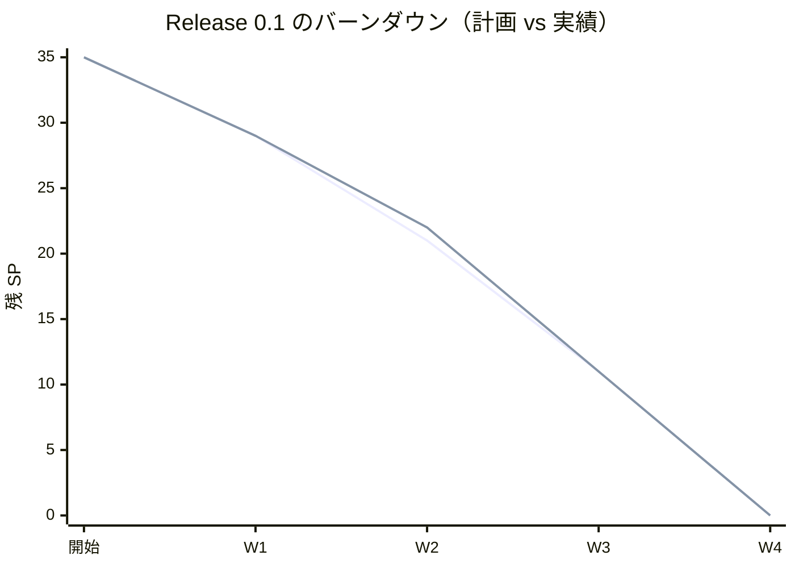
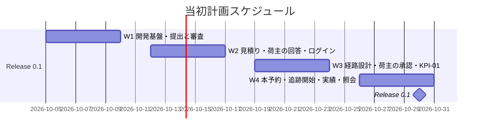
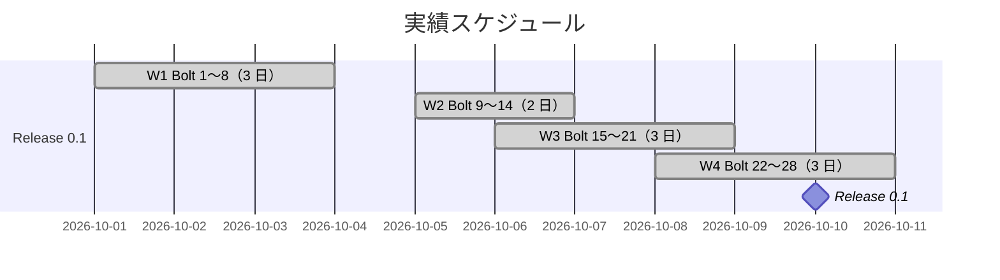
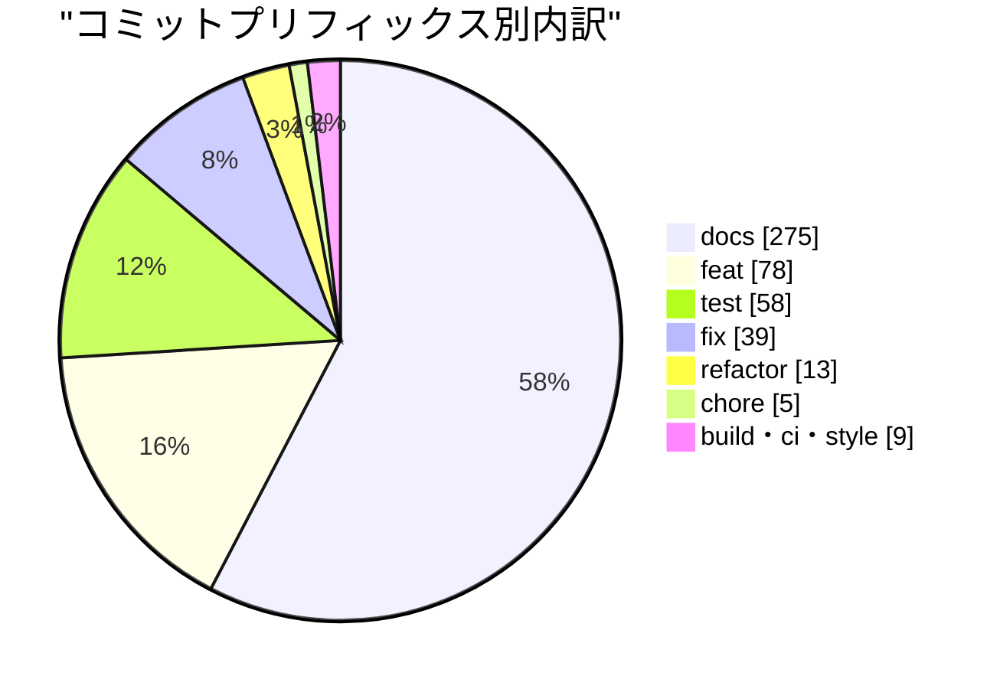
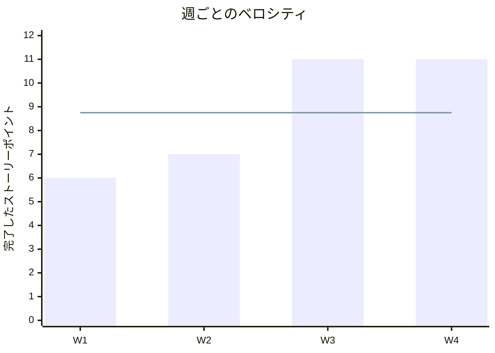

# リリース完了報告書 0.1 - cargo-tracker（A 社国際貨物輸送管理システム）

**報告書作成日**: 2026-10-10

## 概要

cargo-tracker Release 0.1（最初の縦の流れ）のリリース完了報告書です。4 週（W1〜W4）、33 本の Bolt で、計画した 35 SP をすべて終えました。一般貨物 1 件が、荷主の提出から営業の審査・見積りの提示・経路の確定・荷主の承認・本予約の確定・追跡の開始・実績の登録を経て、荷主の追跡の照会まで画面で縦に通り、KPI-01 の 2 時刻が記録されます。リリース条件は Bolt 28 の社内デモで human:kakimomokuri が確かめました。

Release 0.1 はパイロットに出すリリースではなく、縦の流れと AI の出力の品質を確かめ、Release 1.0 の計画と承認ゲートの密度を決め直すためのリリースです。本番環境（AWS）への配備は Release 1.0（W10）で行い、Release 0.1 はデモ環境（Heroku、dev プロファイル）で確かめました。git のタグと CHANGELOG はまだ運用していないので、本報告書の数値は [リリース計画](release_plan.md)・各 Bolt の終了報告・git log から集めました。

---

## プロジェクトサマリー

| 項目 | 値 |
| :--- | :--- |
| **期間** | 2026-10-01 〜 2026-10-10（9 稼働日。計画は W1〜W4 の 2026-10-05 〜 2026-10-30、19 営業日） |
| **週（計画の単位）** | 4（W1〜W4） |
| **Bolt（イテレーション）** | 33 本（W1 8、W2 6、W3 7、W4 12） |
| **ストーリーポイント** | 35 SP（計画 35 SP） |
| **ユーザーストーリー** | 11 件（Release 0.1 の範囲の受入条件 28 件） |
| **コミット数** | 477（`apps/cargo-tracker` と cargo-tracker の要件・設計・開発・ADR・マニュアル・CI。マージを除く） |
| **テスト** | `check` 1602 件、画面の層のシナリオ（`uiTest`）80 本。失敗 0（Bolt 28） |
| **ADR** | 16 件（ADR-001〜016） |

---

## 計画と実績の差異分析

### 週ごとの達成状況

| 週 | ゴール | 計画 SP | 実績 SP | 達成率 | 差異 |
| :--- | :--- | ---: | ---: | ---: | :--- |
| W1 | 開発基盤・提出と審査 | 6 | 6 | 100% | なし |
| W2 | 見積り・荷主の回答・ログイン | 8 | 7 | 88% | US-24 の R0.1 の 3 SP のうち W2 の計画分 1 を、#5 をクローズした W3 で数えた |
| W3 | 経路設計・荷主の承認・KPI-01 | 10 | 11 | 110% | W2 から 1 SP |
| W4 | 本予約・追跡開始・実績・照会 | 11 | 11 | 100% | なし |
| **合計** | | **35** | **35** | **100%** | **0** |

### ストーリーごとの達成状況

| ID | Release 0.1 で通した受入条件 | SP | 週 | 残り（Release 1.0） |
| :--- | :--- | ---: | :--- | ---: |
| US-01 | AC1 提出、AC2 不足項目、AC4 特殊貨物の拒否 | 3 | W1 | 2 |
| US-02 | 全受入条件 | 3 | W1 | 0 |
| US-03 | 全受入条件（BR-10 の境界を含む） | 5 | W2 | 0 |
| US-18 | password によるログインと session | 2 | W2 | 6 |
| US-06 | AC1 候補の比較、AC2〜3 の境界（仮の航海データ） | 3 | W3 | 5 |
| US-07 | AC1 確定、AC2 根拠・権限の不足 | 3 | W3 | 2 |
| US-24 | AC1 詳細経路設計へ進む、AC4 承認、AC5 失効時の拒否 | 3 | W3 | 2 |
| US-21 | AC1 KPI-01 の 2 時刻の記録 | 2 | W3 | 3 |
| US-04 | AC1 確定、AC2 失効、AC4 再送、重複確定の防止、予約サガ | 5 | W4 | 3 |
| US-12 | AC1 登録、AC2 重複 | 3 | W4 | 2 |
| US-09 | AC1 照会 | 3 | W4 | 2 |
| **合計** | | **35** | | **27** |

### リリースバーンダウン

**分析結果**: 実績は計画にほぼ重なりました。W2 の 1 SP の遅れは、ストーリーの SP をクローズした週で数える約束（US-24 の R0.1 の 3 SP）によるもので、作業の遅れではありません。SP は週の計画（10 SP / 週、祝日の週は 8 SP）のとおりに消化し、暦の上の前倒しは週の目標を上げる根拠にしませんでした（W4 の開始時の決定）。

---

## 計画日程 vs 実績日数の差異分析

### 週ごとの日程比較

各週の作業は、計画の期間より前に前倒しで行いました。実績の期間が重なる日（10-06・10-08）は、前の週の締めと次の週の最初の Bolt を同じ日に行った日です。

| 週 | 計画期間 | 計画日数 | 実績期間 | 実績日数 | 短縮日数 | 短縮率 |
| :--- | :--- | ---: | :--- | ---: | ---: | ---: |
| W1 | 10-05 〜 10-09 | 5 日 | 10-01 〜 10-03 | **3 日** | 2 日 | 40% |
| W2 | 10-12 〜 10-16（10-12 祝日） | 4 日 | 10-05 〜 10-06 | **2 日** | 2 日 | 50% |
| W3 | 10-19 〜 10-23 | 5 日 | 10-06 〜 10-08 | **3 日** | 2 日 | 40% |
| W4 | 10-26 〜 10-30 | 5 日 | 10-08 〜 10-10 | **3 日** | 2 日 | 40% |
| **合計** | **10-05 〜 10-30** | **19 日** | **10-01 〜 10-10** | **9 日**（重なりを除く） | **10 日** | **52.6%** |

### 工期短縮の可視化

```mermaid
xychart-beta
    title "計画日数 vs 実績日数"
    x-axis ["W1", "W2", "W3", "W4"]
    y-axis "日数" 0 --> 6
    bar "計画" [5, 4, 5, 5]
    bar "実績" [3, 2, 3, 3]
```

### 計画 vs 実績ガントチャート

#### 当初計画スケジュール

#### 実績スケジュール

### サマリー

| 指標 | 値 |
| :--- | :--- |
| **計画総日数** | 19 日 |
| **実績総日数** | 9 日 |
| **短縮日数** | 10 日 |
| **短縮率** | **52.6%** |
| **効率倍率** | **2.1 倍** |

### 差異分析

1. SP は計画どおり（35 / 35）で、短縮したのは暦の日数です。1 日に 2〜4 本の Bolt を回す想定（リリース計画の「リソース」）に対し、実績は 1 日に約 3.7 本（33 本 / 9 日）でした
2. W4 は Bolt が 12 本と最も多く、5 本（23b・25b・26b・26c・27b）は開始準備の検証で半日を超えると見えて分けた Bolt です。分けても SP は増えず、Bolt の数が増えました
3. 人の変更依頼は Release 0.1 全体で 4 件と範囲の追加 1 件でした。承認ゲートの待ちを短くした（`/goal` で途中のゲートを止めずに進め、終了報告でまとめて受けた）ことが日数の短縮に効いた一方、手順の逸脱を終了報告で拾う形になりました

### 工期短縮の要因分析

| 要因 | 説明 |
| :--- | :--- |
| ウォーキングスケルトン | Bolt 1 ですべての統合点（画面 → application → domain → DB → イベント → 別のコンテキスト → 画面）を通したので、以後の Bolt は骨格に受入条件を足す作業になった |
| 開始準備の 2 つの検証 | 計画と設計の突き合わせと横断の検証で、依存の循環・層の規則との衝突・壊れる既存のテストを着手の前に見つけ、手戻りを減らした |
| 承認ゲートの密度 | Release 0.1 の途中から、多くの Bolt を `/goal` で途中のゲートを止めずに進め、終了報告の承認でまとめて受けた。確認必須（スキーマ・認可）は T-67・T-80 で計画の場か途中で判断を受けた |
| 画面の層のシナリオを先に書く | Bolt ごとにシナリオとステップ定義をそろえてきたので、Bolt 28 で主成功の流れを、ステップ定義を足さずに組めた |

---

## コミットログ分析

### コミットプリフィックス別内訳

2026-10-01〜10-10 の、`apps/cargo-tracker`、`docs/{requirements,design,development,adr}/cargo-tracker`、`docs/manual`、cargo-tracker の CI のコミット（マージを除く）。

| プリフィックス | 件数 | 割合 | 説明 |
| :--- | ---: | ---: | :--- |
| docs | 275 | 57.7% | 計画・終了報告・設計・ADR・マニュアル |
| feat | 78 | 16.4% | 新機能 |
| test | 58 | 12.2% | テスト（Red のコミットを含む） |
| fix | 39 | 8.2% | 修正 |
| refactor | 13 | 2.7% | リファクタリング |
| chore | 5 | 1.0% | 保守 |
| build・ci・style | 9 | 1.9% | ビルド・CI・整形 |
| **合計** | **477** | **100%** | |

### コミットプリフィックス別パイチャート

### 分析

1. docs が 6 割近くを占めます。AI-DLC の「成果物は契約であり、コンテキストである」に従い、Bolt ごとに計画と終了報告を書き、設計文書を実装と同じ Bolt で直したためです
2. feat と test がほぼ 4 対 3 です。TDD の Red（`test:`）と Green（`feat:`）をコミットで分けた Bolt が多いことを示します
3. fix の 39 件の多くは、開発レビューの指摘への対応です。開発レビューを各 Bolt の終了報告の前に行い、欠陥をテストで再現してから直しました

---

## 品質メトリクス

### テストと品質ゲート（Release 0.1 の時点。Bolt 28）

| 指標 | 結果 |
| :--- | :--- |
| `check`（単体・統合・業務のルールの層の受入シナリオ・アーキテクチャテスト・`documentationTest`） | 1602 件、失敗 0 |
| `uiTest`（画面の層のシナリオ。Playwright・axe-core） | 80 本、失敗 0 |
| 受入条件とシナリオの照合（`AcceptanceCriteriaCoverageTest`） | Release 0.1 の 28 件すべてに `@wip` でないシナリオがある |
| アーキテクチャテスト AT-01〜06 | すべて通過（AT-05 は Bolt 28 で作った） |
| SonarQube（ローカル） | 品質ゲート PASS（新しいコードのカバレッジ 97.5%、重複 0.14%、新しい指摘 0 件） |
| CI（check・画面の層・デモ環境への配備） | 通過 |
| OKF（`okf:check`） | ERROR 0 |

### ベロシティ

| 項目 | 値 |
| :--- | :--- |
| 平均ベロシティ | 8.75 SP / 週 |
| 最大ベロシティ | 11 SP（W3・W4） |
| 最小ベロシティ | 6 SP（W1。開発基盤の Bolt を含む） |

### 承認ゲートと変更依頼

| 指標 | 値 |
| :--- | :--- |
| 人の変更依頼 | 4（Bolt 15 のアプリ名、Bolt 23 の予約サガの置き場所、Bolt 25 の公開 API の置き場所と見積りへの適用）と範囲の追加 1（Bolt 27b の荷主の予約一覧） |
| Bolt のリードタイム | 記録のある Bolt で約 45 分（Bolt 22）〜 4 時間 36 分（Bolt 4） |
| 手順の逸脱 | Red を確かめる前の実装（Bolt 23・24・25b・26c・27）、確認必須のゲートの AI の判断での通過（Bolt 23 のスキーマ、Bolt 26 の認可）。いずれも終了報告で記録し、Try（T-67・T-80・T-83・T-88）にした |

---

## リリース履歴

| リリース | 含まれる週 | リリース日 | SP | 状態 |
| :--- | :--- | :--- | ---: | :--- |
| Release 0.1 最初の縦の流れ | W1〜W4 | 2026-10-10（計画 10-30） | 35 | 完了 |
| Release 1.0 パイロット準備完了 | W5〜W10 | 2026-12-11（計画） | 54 | 未着手 |
| Release 1.1 本格展開前 | W11〜W14 | 2027-01-15（計画） | 37 | 未着手 |

---

## 主要な成果物

### 実装した主要機能

1. **見積依頼の提出と審査**（W1）
    - 業務番号の発行、必須条件の検証と不足項目の提示、特殊貨物の拒否、必要書類（US-01）
    - 輸送条件の審査と差戻し、荷主の再提出（US-02）
2. **見積りの提示と荷主の回答**（W2）
    - 見積りの算出・社内承認・提示、失効と再見積りによる置換（US-03）
    - 荷主の「詳細経路設計へ進む」の回答（US-24 AC1）
    - password によるログインと session（US-18 の一部）
3. **経路の設計と荷主の承認**（W3）
    - 経路候補の算出と比較、除外の理由（US-06。仮の航海データ）
    - 経路の確定と根拠・権限の検証（US-07）
    - 荷主の見積りと経路の承認、失効時の拒否（US-24 AC4・AC5、ADR-014）
    - KPI-01 の 2 時刻の記録と KPI 計測記録の画面（US-21 AC1）
4. **本予約・追跡・照会**（W4）
    - 本予約の確定と失効の拒否、再送の冪等と重複確定の防止、予約サガ（US-04。ADR-015・ADR-016）
    - 追跡の開始（予約確定のイベントを追跡が購読し、結果を予約の公開 API へ返す）
    - 主要実績の登録と重複の扱い（US-12）
    - 荷主の追跡の照会と予約一覧（US-09 AC1、C-06）

### 技術的成果

| 成果 | 内容 |
| :--- | :--- |
| モジュラーモノリス | Spring Modulith で、見積り・経路設計・予約・追跡・アクセス監査・`platform` をモジュールに分け、依存の向きを `allowedDependencies` と ModularityTest で固定した。コンテキストの公開 API は `<コンテキスト>.interfaces.api` に置いた |
| イベントによる連携 | コンテキストの間はドメインイベントでつなぎ、イベント発行記録（`event_publication`）で配信の失敗を残して再配信する。購読は冪等にした |
| 二重ループの受入テスト | 業務のルールの層（Cucumber とメモリのリポジトリ）と画面の層（Playwright・axe-core）の 2 層。受入条件とシナリオの照合を機械で行う |
| アーキテクチャテスト | AT-01〜06（ArchUnit、Spring Modulith、マッパーの SQL のスキーマの検査、ステップ定義の依存、本番の依存に H2 を含まない） |
| 生きたドキュメント | JIG・Spring Modulith の文書・SchemaSpy の ER 図を CI で生成し、設計ドキュメントのサイトに載せた |
| デモ環境 | Heroku の dev プロファイル（ADR-013）。CI から配備し、サンプルの業務データを相対の日時で入れた |
| ユーザーマニュアル | `docs/manual`（14 ページ、キャプチャ 35 枚を `./gradlew manualScreenshots` で撮る）と HTML 版 |
| 記事 | [ウォーキングスケルトンのガイドツアー](../../article/walking-skeleton-tour.md) |

---

## ふりかえり（Release 0.1）

週ごとのふりかえりはリリース計画の各週の「ふりかえり」に書いた。Release 0.1 全体で見ると次のとおりです。

- Keep
  - ウォーキングスケルトンを最初の Bolt にし、すべての統合点を先に通したこと
  - 開始準備の 2 つの検証で、着手の前に設計の食い違いを見つけ、Bolt を分けて半日以内に収めたこと
  - 連携の形を ADR で先に決め、依存の向きを機械で固定してから実装したこと
- Problem
  - TDD の手順（Red を確かめてから実装する）からの逸脱が、Try にしても繰り返した
  - 持ち越しを Issue にせず移し先だけを決めたので、Bolt 2 の 2 つが Bolt 28 まで残った
  - 画面の語の問題（実装の語・業務ルールの番号）は、マニュアルを書くまで見つからなかった
- Try（Release 1.0 に持ち込む）
  - 承認ゲートの密度は、既定を計画と終了報告の承認にし、確認必須は計画の承認の場で判断を受ける。認証の完成（W5）と外部原本の取込（W7）はステップごとに止める
  - 後に回したものは Issue にし、週の見直しで開いている持ち越しを数える（T-89）
  - 画面を作る Bolt の開発レビューに、マニュアルを書く立場の観点を入れる（T-90）
  - Release 0.1 の負債（#45・#46）を W5 の最初の Bolt で返す

## Release 1.0 への引き継ぎ

| 事項 | 扱い |
| :--- | :--- |
| 計画の引き直し | 範囲と日付（2026-12-11）は変えない。US-04 の残り（#43）を W6 から W5 に前倒しし、W5 11・W6 10 SP にした。W5 と W9（15 SP）の超過は、Release 0.1 を約 2 週早く終えた余裕で吸収する |
| 承認ゲートの密度 | 上の Try のとおり（[リリース計画](release_plan.md)の「W4 の締めの見直し」） |
| Release 0.1 の負債 | [#45](https://github.com/k2works/practical-domain-driven-design-in-enterpris-application/issues/45)（画面の層のステップ定義のキー操作の部品）、[#46](https://github.com/k2works/practical-domain-driven-design-in-enterpris-application/issues/46)（マニュアルの作成で見つけた画面の文言と表示の課題）。W5 の最初の Bolt |
| 未決の業務判断 | D-85（承認の後に失効した見積りの再見積りの規則）。W5 の開始準備で決める |
| パイロット開始の条件 | Golden dataset（TST-02）と必要最小接続時間（DM-05）を W6 の前に業務責任者から受け取る（リリース計画の「パイロット開始の条件」） |

## 関連ドキュメント

- [リリース計画](release_plan.md)
- [開発戦略](development_strategy.md)
- [Bolt 28 終了報告](bolt_28_report.md)（Release 0.1 のリリース条件の根拠と社内デモ）
- [ユーザーマニュアル](../../manual/index.md)
