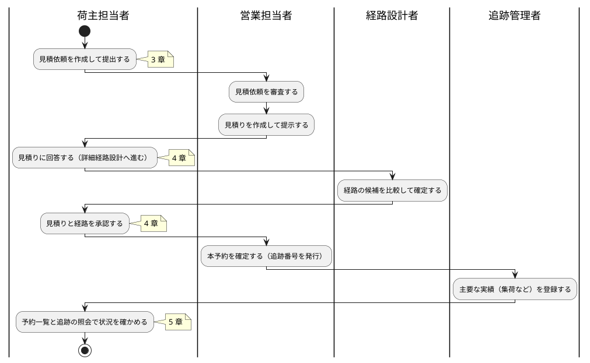

# 1 章 業務フロー

一般貨物 1 件が、荷主の見積依頼から追跡の照会まで進む流れ（WF-1）です。各工程で使う画面の章を示します。

## WF-1 見積依頼から追跡の照会まで

| # | 工程 | 担当 | 見積依頼の状態（荷主の画面の表示） | 章 |
| :--- | :--- | :--- | :--- | :--- |
| 1 | 見積依頼を作成して提出する | 荷主担当者 | 審査中（A 社の対応待ち） | [3 章](03-見積依頼.md) |
| 2 | 見積依頼を審査し、見積りを作成して提示する | 営業担当者 | 見積り作成中（A 社の対応待ち）→ 見積提示済み（お客様の対応待ち） | [6 章](06-受付一覧と審査と見積り.md) |
| 3 | 見積りに回答する（この条件で詳細経路設計へ進む） | 荷主担当者 | 経路設計中（A 社の対応待ち） | [4.1](04-見積りへの回答と承認.md#41-見積りへの回答) |
| 4 | 経路の候補を比較して確定する | 経路設計者 | 見積りと経路の承認待ち（お客様の対応待ち） | [8 章](08-経路設計.md) |
| 5 | 見積りと経路を承認する | 荷主担当者 | 予約待ち（A 社の対応待ち） | [4.2](04-見積りへの回答と承認.md#42-見積りと経路の承認) |
| 6 | 本予約を確定する | 営業担当者 | 予約確定済み（追跡の開始の準備中） | [7 章](07-本予約の確定と予約一覧.md) |
| 7 | 主要な実績（集荷など）を登録する | 追跡管理者 | — | [9 章](09-追跡管理.md) |
| 8 | 予約と追跡の状況を確かめる | 荷主担当者 | — | [5 章](05-予約一覧と追跡の照会.md) |

## 注意・補足

- 見積依頼の状態の括弧の中は、いま誰の対応を待っているかを示します。「お客様の対応待ち」のときは、荷主担当者の操作で次の工程へ進みます
- 見積りへの回答は予約の確定ではありません。経路が決まった後に、あらためて見積りと経路を確かめて承認します。承認も予約の確定ではなく、承認の後に担当営業が本予約を確定します
- 危険物・冷凍貨物などの特殊な貨物は、Release 0.1 では扱いません。見積依頼の作成の画面に示される手動の窓口へご連絡ください
- 見積依頼の差戻し（営業担当者が直しを求めたとき）は、[3.3 見積依頼の詳細](03-見積依頼.md#33-見積依頼の詳細) の注意・補足を見てください
