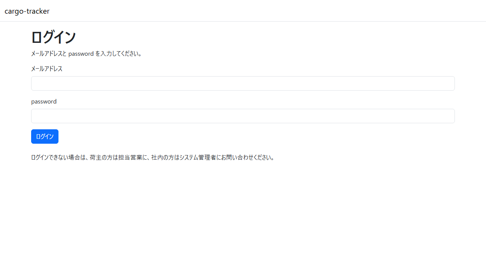
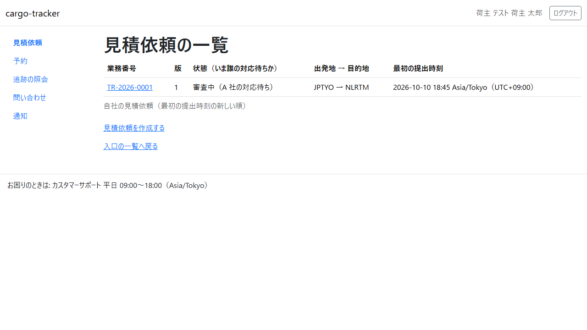
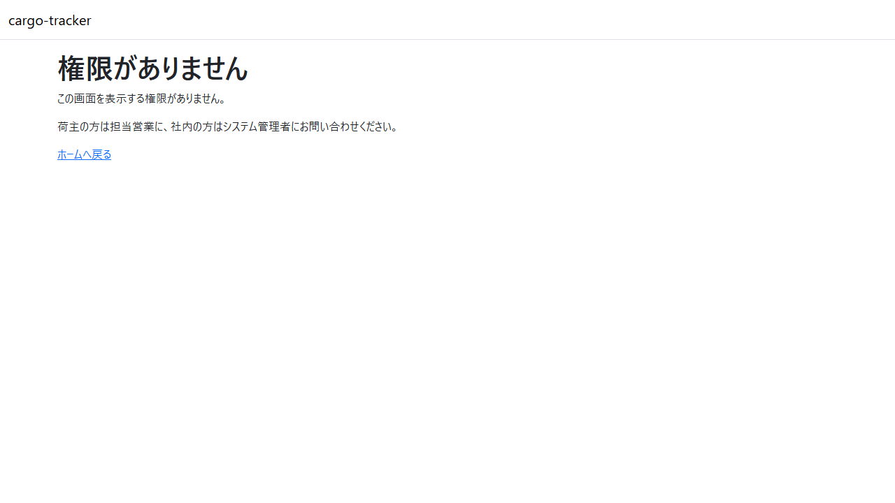
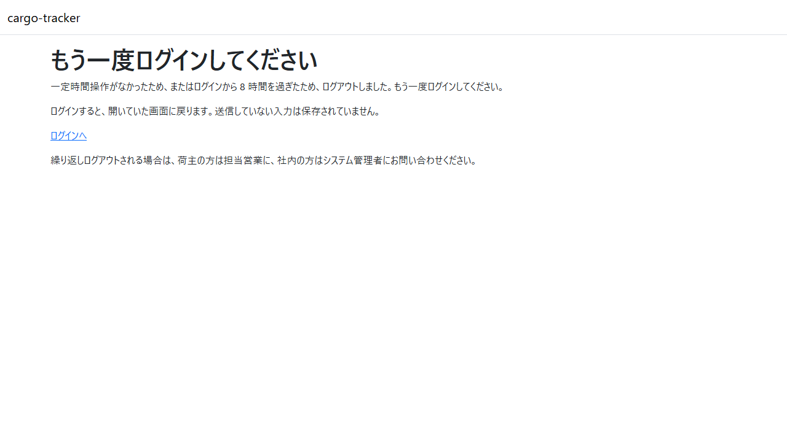

# 2 章 ログインと共通の画面

cargo-tracker にログインする手順と、どの役割でも共通の画面（画面の構成、権限がない画面、もう一度ログインする画面）を説明します。本章は [WF-1](01-業務フロー.md#wf-1-見積依頼から追跡の照会まで) のすべての工程の前提です。

画面の開き方: ブラウザで cargo-tracker の URL を開きます。ログインしていなければ、ログインの画面が開きます。

| 画面 | 役割 | 節 |
| :--- | :--- | :--- |
| ログイン | メールアドレスと password でログインする | [2.1](#21-ログイン) |
| 画面の構成 | ヘッダー・ナビゲーション・窓口の案内 | [2.2](#22-画面の構成) |
| 権限がありません | 役割にない画面を開いたときに示される | [2.3](#23-権限がありません) |
| もう一度ログインしてください | 一定時間が過ぎてログアウトしたときに示される | [2.4](#24-もう一度ログインしてください) |

## 2.1 ログイン

### この画面でできること

- メールアドレスと password で cargo-tracker にログインします。ログインすると、役割ごとの最初の画面（ホーム）が開きます

### 画面の開き方

- cargo-tracker の URL を開きます（URL: `/login`）

### 画面の説明

| # | 項目 | 説明 |
| :--- | :--- | :--- |
| ① | メールアドレス | 利用者として登録されたメールアドレス |
| ② | password | 利用者の password |
| ③ | 「ログイン」 | 入力した内容でログインします |

### 操作手順

1. 「メールアドレス」と「password」を入力します
2. 「ログイン」をクリックします
3. 役割ごとのホームが開きます。荷主担当者は見積依頼の一覧、営業担当者は見積依頼の受付一覧が開きます

### 注意・補足

- メールアドレスか password が違うと、「メールアドレスまたは password が正しくありません。」と示されます。どちらが違うかは示しません
- ログインできない場合は、荷主の方は担当営業に、社内の方はシステム管理者にお問い合わせください
- 画面の右上の「ログアウト」をクリックするとログアウトし、ログインの画面に「ログアウトしました。」と示されます

## 2.2 画面の構成

### この画面でできること

- ログインした後の画面は、どれも同じ構成です。ナビゲーションから、役割で使える画面を開きます

### 画面の開き方

- ログインした後のすべての画面

### 画面の説明

| # | 項目 | 説明 |
| :--- | :--- | :--- |
| ① | ヘッダー | 左に「cargo-tracker」、右にログインしている利用者（会社名と名前）と「ログアウト」 |
| ② | ナビゲーション | 役割で使える画面の一覧。いま開いている画面の項目が強調されます |
| ③ | メインの領域 | 画面ごとの内容 |
| ④ | 窓口の案内 | 画面の下の「お困りのときは: カスタマーサポート 平日 09:00〜18:00（Asia/Tokyo）」 |

荷主担当者のナビゲーションの項目は次のとおりです。

| 項目 | 開く画面 | 章 |
| :--- | :--- | :--- |
| 見積依頼 | 見積依頼の一覧 | [3 章](03-見積依頼.md) |
| 予約 | 予約一覧 | [5.1](05-予約一覧と追跡の照会.md#51-予約一覧) |
| 追跡の照会 | 追跡の照会 | [5.2](05-予約一覧と追跡の照会.md#52-追跡の照会) |
| 問い合わせ | （準備中） | — |
| 通知 | （準備中） | — |

### 操作手順

1. ナビゲーションの項目をクリックすると、その画面が開きます
2. 画面の幅が狭いときは、ナビゲーションがメニューのボタンにまとまります。ボタンを押すと項目が開きます

### 注意・補足

- 「問い合わせ」「通知」は、まだ作っていない画面です。開くと「この画面は準備中です」と示されます。使えるようになるまでは、担当営業にご連絡ください

## 2.3 権限がありません

### この画面でできること

- 役割にない画面（荷主担当者が社内の画面を開いたときなど）を開くと示されます。操作はできません

### 画面の開き方

- 役割にない画面の URL を直接開いたときに示されます

### 画面の説明

| # | 項目 | 説明 |
| :--- | :--- | :--- |
| ① | メッセージ | 「この画面を表示する権限がありません。」と、問い合わせ先 |
| ② | 「ホームへ戻る」 | 役割ごとのホームへ戻ります |

### 操作手順

1. 「ホームへ戻る」をクリックします

### 注意・補足

- 自分の役割で使う画面なのにこの画面が示される場合は、荷主の方は担当営業に、社内の方はシステム管理者にお問い合わせください

## 2.4 もう一度ログインしてください

### この画面でできること

- 一定時間操作がなかったとき、またはログインから 8 時間を過ぎたときに、ログアウトして示されます

### 画面の開き方

- ログアウトした後に画面を操作すると示されます（URL: `/session-expired`）

### 画面の説明

| # | 項目 | 説明 |
| :--- | :--- | :--- |
| ① | メッセージ | ログアウトした理由と、ログインすると開いていた画面に戻ること |
| ② | 「ログインへ」 | ログインの画面を開きます |

### 操作手順

1. 「ログインへ」をクリックします
2. [2.1 ログイン](#21-ログイン) の手順でログインします。開いていた画面に戻ります

### 注意・補足

- 送信していない入力は保存されていません。ログインし直した後に、もう一度入力してください
- 操作がないままの時間は 30 分まで、ログインしてからの時間は 8 時間までです
- 繰り返しログアウトされる場合は、荷主の方は担当営業に、社内の方はシステム管理者にお問い合わせください
