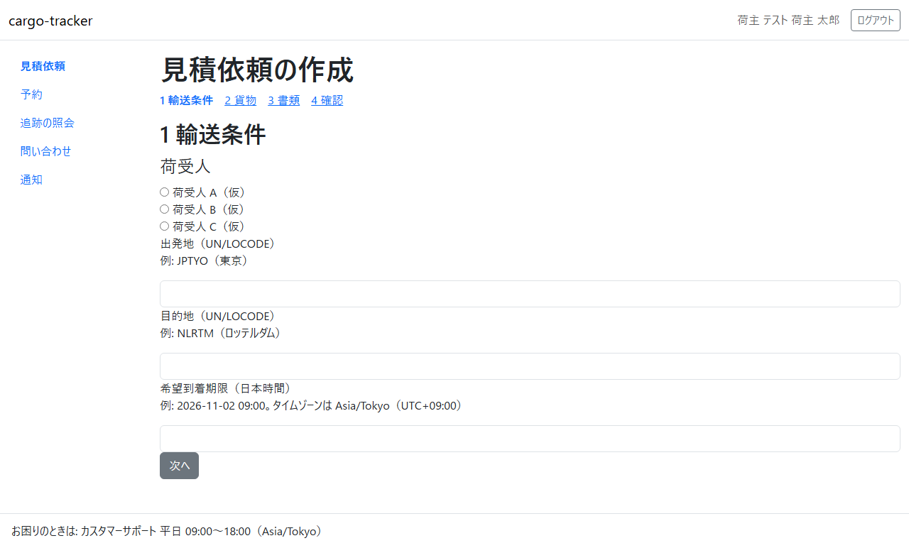
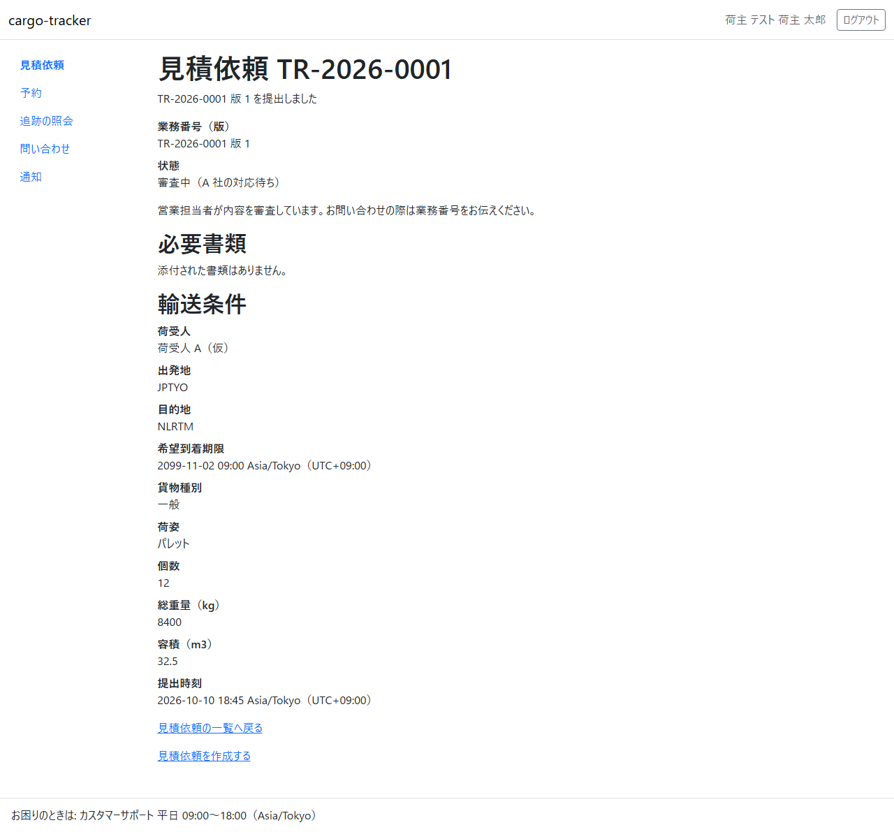

# 3 章 見積依頼

荷主担当者が、貨物の輸送の見積りを依頼する画面です。見積依頼を作成して提出し、一覧と詳細で進み具合を確かめます。本章は [WF-1](01-業務フロー.md#wf-1-見積依頼から追跡の照会まで) の工程 1（見積依頼を作成して提出する）に対応します。

画面の開き方: ナビゲーションの「見積依頼」（URL: `/customer/transport-requests`）。荷主担当者はログインするとこの画面が開きます。

| 画面 | 役割 | 節 |
| :--- | :--- | :--- |
| 見積依頼の一覧 | 自社の見積依頼と、いま誰の対応待ちかを確かめる | [3.1](#31-見積依頼の一覧) |
| 見積依頼の作成 | 輸送条件と貨物を入れて提出する | [3.2](#32-見積依頼の作成) |
| 見積依頼の詳細 | 状態・輸送条件・見積り・書類を確かめる | [3.3](#33-見積依頼の詳細) |

見積りへの回答と承認は [4 章](04-見積りへの回答と承認.md) で説明します。

## 3.1 見積依頼の一覧

### この画面でできること

- 自社の見積依頼を、最初に提出した時刻の新しい順に確かめます。いま誰の対応を待っているかが分かります

### 画面の開き方

- ナビゲーションの「見積依頼」（URL: `/customer/transport-requests`）

### 画面の説明

| # | 項目 | 説明 |
| :--- | :--- | :--- |
| ① | 業務番号 | 見積依頼の番号（TR-…）。クリックすると見積依頼の詳細が開きます |
| ② | 版 | 見積依頼を出し直すと増えます |
| ③ | 状態（いま誰の対応待ちか） | 例: 「審査中（A 社の対応待ち）」。括弧の中が次に対応する人です |
| ④ | 出発地 → 目的地 | 港の UN/LOCODE（例: JPTYO → NLRTM） |
| ⑤ | 最初の提出時刻 | 版 1 を提出した日時（日本時間） |
| ⑥ | 「見積依頼を作成する」 | 見積依頼の作成を開きます |

### 操作手順

1. 確かめたい見積依頼の業務番号をクリックします。見積依頼の詳細が開きます
2. 新しく依頼するときは「見積依頼を作成する」をクリックします

### 注意・補足

- 一覧に出るのは自社の見積依頼だけです
- 状態の意味と次の工程は [1 章 業務フロー](01-業務フロー.md) の表を見てください

## 3.2 見積依頼の作成

### この画面でできること

- 輸送条件と貨物を入れて、見積依頼を提出します。書類（商業送り状など）を添えることもできます

### 画面の開き方

- 見積依頼の一覧の「見積依頼を作成する」（URL: `/customer/transport-requests/new`）

### 画面の説明

入力は「1 輸送条件」「2 貨物」「3 書類」「4 確認」の 4 段に分かれています。

| # | 項目 | 説明 |
| :--- | :--- | :--- |
| ① | 段の見出し | 「1 輸送条件」「2 貨物」「3 書類」「4 確認」。クリックすると、その段に移ります |
| ② | 荷受人 | 貨物を受け取る会社を選びます |
| ③ | 出発地（UN/LOCODE） | 積み出す港の 5 文字のコード（例: JPTYO（東京）） |
| ④ | 目的地（UN/LOCODE） | 届け先の港のコード（例: NLRTM（ロッテルダム）） |
| ⑤ | 希望到着期限（日本時間） | 「2026-11-02 09:00」の形で入れます |
| ⑥ | 「次へ」 | 次の段に移ります |

2 段目から 4 段目の項目は次のとおりです。

| 段 | 項目 | 説明 |
| :--- | :--- | :--- |
| 2 貨物 | 貨物種別 | 「一般」「危険物」「冷凍」「その他特殊」から選びます |
| 2 貨物 | 荷姿 | 「パレット」「カートン」「クレート」「その他」から選びます |
| 2 貨物 | 個数・総重量（kg）・容積（m3） | 総重量と容積は小数点以下 3 桁まで |
| 3 書類 | 商業送り状（任意）・梱包明細（任意）・その他の書類（任意、3 件まで） | PDF・PNG・JPEG のファイルを 1 件 10 MB まで |
| 4 確認 | 入力した内容の一覧と「提出する」 | 内容を確かめて提出します |

### 操作手順

1. 「1 輸送条件」で荷受人を選び、出発地・目的地・希望到着期限を入れて「次へ」をクリックします
2. 「2 貨物」で貨物種別・荷姿・個数・総重量・容積を入れて「次へ」をクリックします
3. 「3 書類」で、必要なら書類のファイルを選んで「次へ」をクリックします
4. 「4 確認」で内容を確かめ、「提出する」をクリックします
5. 見積依頼の詳細が開き、「TR-… 版 1 を提出しました」と示されます。状態は「審査中（A 社の対応待ち）」です

### 注意・補足

- 入力に誤りがあると、画面の上に「入力内容に N 件の誤りがあります」と誤りの一覧が示され、項目の下に理由と直し方が示されます。一覧の項目をクリックすると、その入力欄に移ります。入力した値は残ります
- 危険物・冷凍・その他特殊の貨物は、この画面では受け付けていません。担当の営業窓口へご相談ください（貨物種別でこれらを選ぶと、その案内が示され、提出できません）
- 希望到着期限は、提出する時刻より後の日時を入れてください
- 出発地と目的地に同じ港は入れられません
- 書類で誤りがあったときは、選んだファイルは残りません。もう一度選んでください

## 3.3 見積依頼の詳細

### この画面でできること

- 見積依頼の状態・輸送条件・添付した書類を確かめます。見積りが提示されると、見積りの内容もここに出ます

### 画面の開き方

- 見積依頼の一覧の業務番号をクリック（URL: `/customer/transport-requests/{業務番号}`）

### 画面の説明

| # | 項目 | 説明 |
| :--- | :--- | :--- |
| ① | 結果のメッセージ | 提出や出し直しの直後に、結果が示されます |
| ② | 業務番号（版） | 例: TR-2026-0001 版 1 |
| ③ | 状態 | いま誰の対応待ちかと、次に何が起きるかの説明 |
| ④ | 必要書類 | 添付した書類の一覧。ファイル名をクリックすると取り出せます |
| ⑤ | 輸送条件 | 荷受人・出発地・目的地・希望到着期限・貨物種別・荷姿・個数・総重量・容積・提出時刻 |
| ⑥ | 「見積依頼の一覧へ戻る」 | 一覧に戻ります |

見積りが提示された後は、状態の下に「見積り」の節が加わります（[4 章](04-見積りへの回答と承認.md)）。

### 操作手順

1. 状態を確かめます。「お客様の対応待ち」のときは、荷主担当者が次の操作をします
2. 見積りが提示されていれば、「見積りに回答する」から回答します（[4.1](04-見積りへの回答と承認.md#41-見積りへの回答)）

### 注意・補足

- 営業担当者が見積依頼を差し戻したときは、状態が「差戻し（お客様の対応待ち）」になり、「差戻し」の節に差戻しの理由と不足事項が示されます。「編集して出し直す」から直して出し直すと、版が 1 つ増えます
- お問い合わせの際は、業務番号をお伝えください
